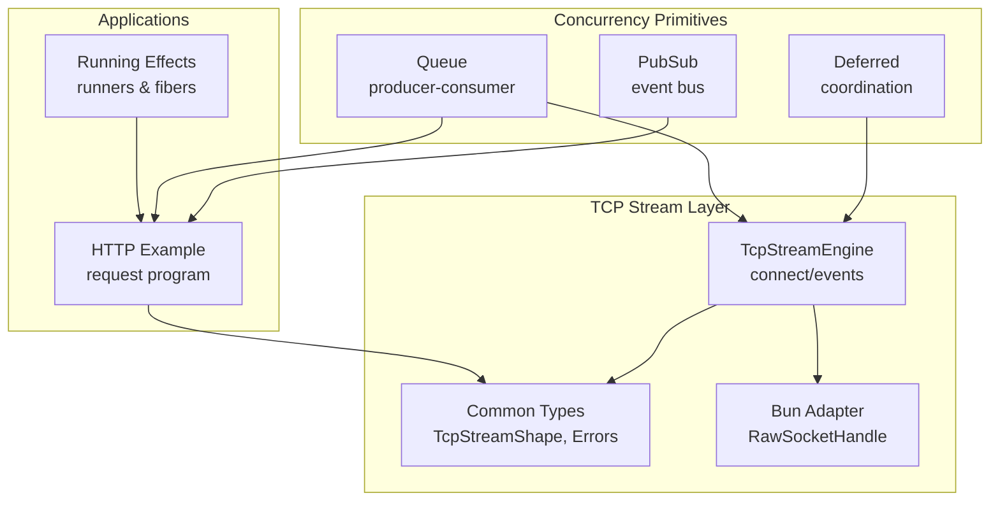
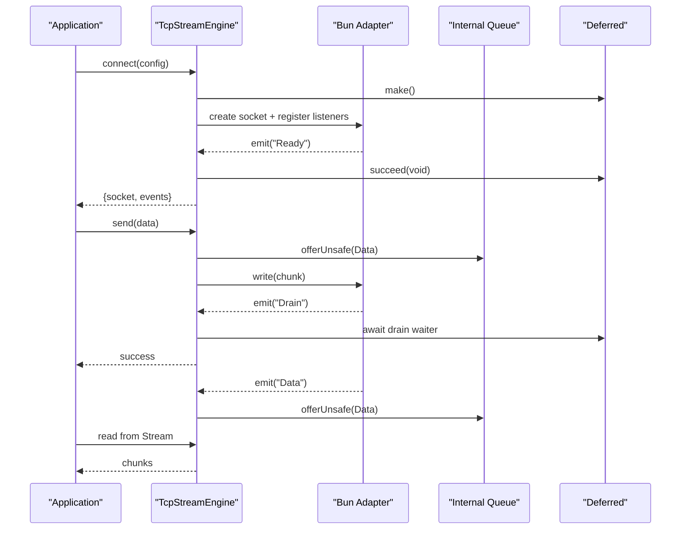
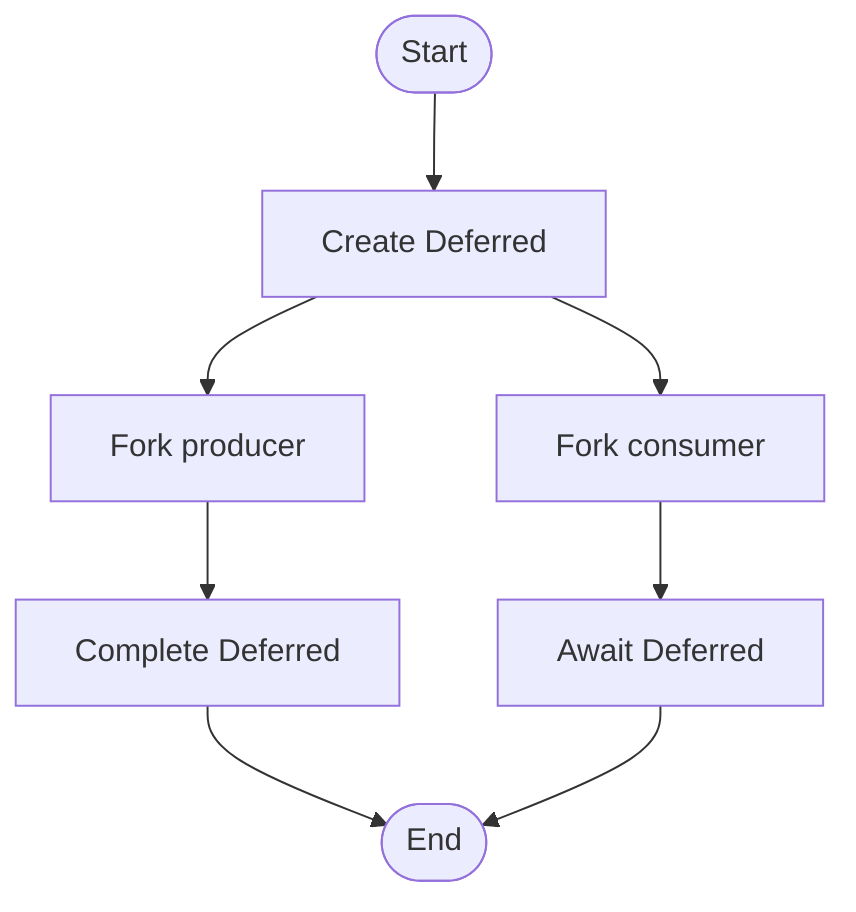
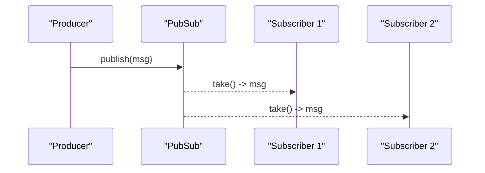
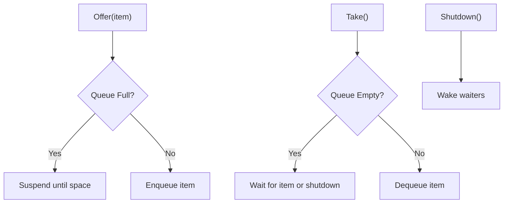
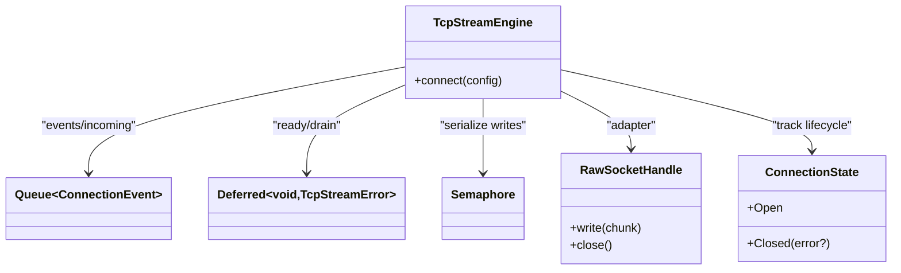
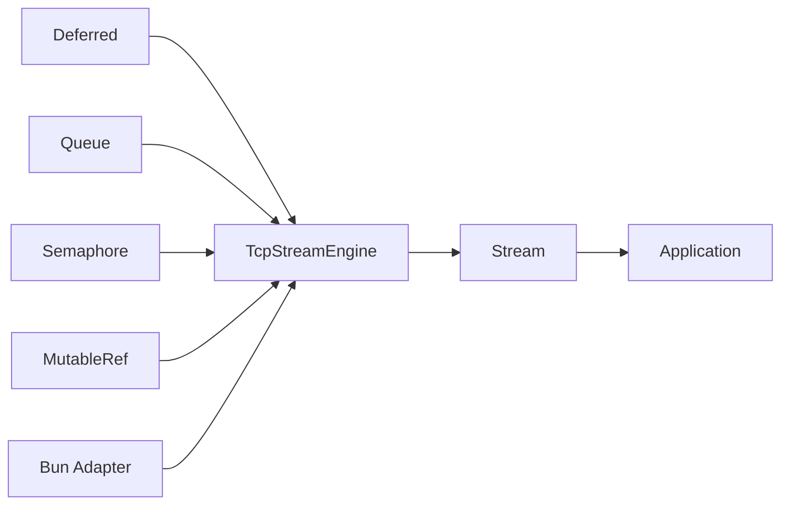

# Advanced Concurrency Patterns

<cite>
**Referenced Files in This Document**
- [concurrency-deferred.ts](file://src/concurrency-deferred.ts)
- [concurrency-pubsub.ts](file://src/concurrency-pubsub.ts)
- [concurrency-queue.ts](file://src/concurrency-queue.ts)
- [tcp-stream-engine.ts](file://src/tcp-stream-engine.ts)
- [tcp-connection-common.ts](file://src/tcp-connection-common.ts)
- [tcp-connection-bun.ts](file://src/tcp-connection-bun.ts)
- [tcp-connection-http-example.ts](file://src/tcp-connection-http-example.ts)
- [running-effects.ts](file://src/running-effects.ts)
</cite>

## Table of Contents
1. [Introduction](#introduction)
2. [Project Structure](#project-structure)
3. [Core Components](#core-components)
4. [Architecture Overview](#architecture-overview)
5. [Detailed Component Analysis](#detailed-component-analysis)
6. [Dependency Analysis](#dependency-analysis)
7. [Performance Considerations](#performance-considerations)
8. [Troubleshooting Guide](#troubleshooting-guide)
9. [Conclusion](#conclusion)
10. [Appendices](#appendices)

## Introduction
This document explains advanced concurrency patterns using Effect primitives and shows how to integrate them with TCP streams to build responsive, scalable applications. It focuses on:
- Deferred values for coordinating asynchronous operations
- Pub/Sub systems for event-driven architectures
- Queues for producer-consumer work distribution
- Integration with TCP streams for I/O-bound tasks
- Thread safety considerations, memory management, and performance implications
- Practical examples: request coordinators, event buses, and work distribution systems
- Common pitfalls: deadlocks, resource leaks, and cleanup strategies

## Project Structure
The repository provides focused modules for concurrency primitives and a layered TCP stream abstraction that composes these primitives into robust networking components.

**Diagram sources**
- [tcp-stream-engine.ts:89-178](file://src/tcp-stream-engine.ts#L89-L178)
- [tcp-connection-common.ts:20-35](file://src/tcp-connection-common.ts#L20-L35)
- [tcp-connection-bun.ts:18-135](file://src/tcp-connection-bun.ts#L18-L135)
- [tcp-connection-http-example.ts:176-225](file://src/tcp-connection-http-example.ts#L176-L225)
- [running-effects.ts:58-73](file://src/running-effects.ts#L58-L73)

**Section sources**
- [tcp-stream-engine.ts:89-178](file://src/tcp-stream-engine.ts#L89-L178)
- [tcp-connection-common.ts:20-35](file://src/tcp-connection-common.ts#L20-L35)
- [tcp-connection-bun.ts:18-135](file://src/tcp-connection-bun.ts#L18-L135)
- [tcp-connection-http-example.ts:176-225](file://src/tcp-connection-http-example.ts#L176-L225)
- [running-effects.ts:58-73](file://src/running-effects.ts#L58-L73)

## Core Components
- Deferred: A one-time coordination primitive used to signal completion or failure across fibers. Used to synchronize connection readiness and write-drain events.
- PubSub: An event bus supporting bounded, dropping, sliding, and unbounded backpressure modes. Ideal for decoupled producers and consumers.
- Queue: A typed channel for producer-consumer patterns with multiple backpressure strategies (bounded, dropping, sliding, unbounded). Supports shutdown signaling via await.
- TcpStreamEngine: A pluggable engine that bridges raw socket adapters to an effectful stream of events and a safe write API. Uses queues and deferreds internally for event flow control and lifecycle management.
- TcpStreamShape: The public interface for sending bytes/text, reading a stream, and closing connections safely.

**Section sources**
- [concurrency-deferred.ts:1-65](file://src/concurrency-deferred.ts#L1-L65)
- [concurrency-pubsub.ts:1-98](file://src/concurrency-pubsub.ts#L1-L98)
- [concurrency-queue.ts:1-92](file://src/concurrency-queue.ts#L1-L92)
- [tcp-stream-engine.ts:40-67](file://src/tcp-stream-engine.ts#L40-L67)
- [tcp-connection-common.ts:20-35](file://src/tcp-connection-common.ts#L20-L35)

## Architecture Overview
The system composes concurrency primitives to implement a resilient TCP stream layer:
- Connection setup uses a Deferred to wait for the underlying adapter to become ready or fail.
- Incoming data is pushed into an internal Queue and exposed as a pull-based Stream.
- Writes are serialized with a Semaphore to ensure ordered, non-interleaved writes and coordinated draining via Deferred.
- Lifecycle transitions (open, closed, error) are managed with refs and queue termination/failure signals.

**Diagram sources**
- [tcp-stream-engine.ts:89-178](file://src/tcp-stream-engine.ts#L89-L178)
- [tcp-stream-engine.ts:201-339](file://src/tcp-stream-engine.ts#L201-L339)
- [tcp-connection-bun.ts:18-135](file://src/tcp-connection-bun.ts#L18-L135)

## Detailed Component Analysis

### Deferred: Coordinating Asynchronous Operations
- Purpose: One-shot synchronization between fibers for readiness, timeouts, or completion.
- Typical usage:
  - Create a Deferred before starting async work.
  - Complete it on success or failure.
  - Await it in other fibers to proceed only when ready.
- In this codebase:
  - Used to gate connection readiness and propagate errors during connect.
  - Used to coordinate write drains so writers resume when the OS buffer has space.

**Diagram sources**
- [concurrency-deferred.ts:3-65](file://src/concurrency-deferred.ts#L3-L65)

**Section sources**
- [concurrency-deferred.ts:1-65](file://src/concurrency-deferred.ts#L1-L65)
- [tcp-stream-engine.ts:92-178](file://src/tcp-stream-engine.ts#L92-L178)
- [tcp-stream-engine.ts:300-332](file://src/tcp-stream-engine.ts#L300-L332)

### PubSub: Event-Driven Architectures
- Purpose: Decouple producers from consumers; supports multiple subscribers and backpressure modes.
- Modes:
  - Bounded: blocks producers when full.
  - Dropping: drops messages when full.
  - Sliding: drops oldest messages when full.
  - Unbounded: no backpressure (use cautiously).
- Usage patterns:
  - Subscribe before publishing to avoid missed messages.
  - Convert subscriptions to Streams for reactive pipelines.
  - Use forked fibers for independent producers/consumers.

**Diagram sources**
- [concurrency-pubsub.ts:3-27](file://src/concurrency-pubsub.ts#L3-L27)
- [concurrency-pubsub.ts:72-95](file://src/concurrency-pubsub.ts#L72-L95)

**Section sources**
- [concurrency-pubsub.ts:1-98](file://src/concurrency-pubsub.ts#L1-L98)

### Queue: Producer-Consumer Work Distribution
- Purpose: Reliable message passing with backpressure and lifecycle control.
- Strategies:
  - Bounded: applies backpressure by suspending offers when full.
  - Dropping/Sliding: drop new or old items under load.
  - Unbounded: infinite capacity (risk of memory growth).
- Shutdown:
  - Use shutdown to signal consumers and interrupt waiters.
  - Consumers can await shutdown to perform cleanup.

**Diagram sources**
- [concurrency-queue.ts:28-87](file://src/concurrency-queue.ts#L28-L87)

**Section sources**
- [concurrency-queue.ts:1-92](file://src/concurrency-queue.ts#L1-L92)

### TCP Stream Engine: Integrating Concurrency with I/O
- Design:
  - Pluggable adapters provide RawSocketHandle (write/close) and emit events (Ready/Data/Drain/Close/Error).
  - Internal unbounded Queue carries events to a Stream consumed by application code.
  - Deferred gates readiness and propagates connect/read/write errors.
  - Semaphore serializes writes to prevent interleaving and race conditions.
  - MutableRef tracks connection state and optional pending drain waiter.
- Lifecycle:
  - acquireRelease ensures socket.close runs even on failures.
  - Event fiber pushes incoming data into the incoming queue and handles drain signals.
  - close interrupts the event fiber and closes the socket.

**Diagram sources**
- [tcp-stream-engine.ts:40-67](file://src/tcp-stream-engine.ts#L40-L67)
- [tcp-stream-engine.ts:89-178](file://src/tcp-stream-engine.ts#L89-L178)
- [tcp-stream-engine.ts:201-339](file://src/tcp-stream-engine.ts#L201-L339)

**Section sources**
- [tcp-stream-engine.ts:89-178](file://src/tcp-stream-engine.ts#L89-L178)
- [tcp-stream-engine.ts:201-339](file://src/tcp-stream-engine.ts#L201-L339)
- [tcp-connection-bun.ts:18-135](file://src/tcp-connection-bun.ts#L18-L135)

### Practical Examples

#### Request Coordinator (using Deferred)
- Pattern:
  - Start a background task that completes a Deferred when ready.
  - Other tasks await the Deferred before proceeding.
  - Handle both success and failure paths uniformly.
- Where to see it:
  - Coordination across fibers with Deferred.make/succeed/await.
  - Connection readiness gating in the TCP engine.

**Section sources**
- [concurrency-deferred.ts:35-65](file://src/concurrency-deferred.ts#L35-L65)
- [tcp-stream-engine.ts:92-178](file://src/tcp-stream-engine.ts#L92-L178)

#### Event Bus (using PubSub)
- Pattern:
  - Create a PubSub (choose capacity strategy based on workload).
  - Subscribe early to avoid missing events.
  - Publish messages from multiple producers; consume via Stream or direct take.
- Where to see it:
  - Bounded/unbounded PubSub creation and subscription.
  - Streaming consumption with Stream.fromPubSub.

**Section sources**
- [concurrency-pubsub.ts:3-27](file://src/concurrency-pubsub.ts#L3-L27)
- [concurrency-pubsub.ts:72-95](file://src/concurrency-pubsub.ts#L72-L95)

#### Work Distribution System (using Queue)
- Pattern:
  - Producers offer work items; consumers take and process.
  - Choose bounded queues to apply backpressure and protect memory.
  - Use shutdown to gracefully stop workers and finalize resources.
- Where to see it:
  - Bounded queue offer/take with suspension semantics.
  - Queue.shutdown and awaiting shutdown to coordinate worker lifecycles.

**Section sources**
- [concurrency-queue.ts:28-87](file://src/concurrency-queue.ts#L28-L87)

#### TCP-Based HTTP Client (combining all primitives)
- Pattern:
  - Build a TcpStream via layers and configuration.
  - Send HTTP requests over the stream and collect responses.
  - Decode incremental UTF-8 chunks correctly.
- Where to see it:
  - executeHttpRequest composes TcpStream.sendText and Stream.runCollect.
  - Engine selection via CLI flags and layers.

**Section sources**
- [tcp-connection-http-example.ts:176-225](file://src/tcp-connection-http-example.ts#L176-L225)
- [tcp-connection-http-example.ts:259-299](file://src/tcp-connection-http-example.ts#L259-L299)

## Dependency Analysis
- Concurrency primitives depend only on Effect core types.
- TcpStreamEngine depends on:
  - Queue for event buffering
  - Deferred for readiness and drain coordination
  - Semaphore for write serialization
  - MutableRef for state tracking
  - Stream for exposing incoming data
- Adapters (e.g., Bun) implement RawSocketHandle and emit events consumed by the engine.
- Application code consumes TcpStreamShape without knowing platform specifics.

**Diagram sources**
- [tcp-stream-engine.ts:89-178](file://src/tcp-stream-engine.ts#L89-L178)
- [tcp-stream-engine.ts:201-339](file://src/tcp-stream-engine.ts#L201-L339)
- [tcp-connection-bun.ts:18-135](file://src/tcp-connection-bun.ts#L18-L135)

**Section sources**
- [tcp-stream-engine.ts:89-178](file://src/tcp-stream-engine.ts#L89-L178)
- [tcp-stream-engine.ts:201-339](file://src/tcp-stream-engine.ts#L201-L339)
- [tcp-connection-bun.ts:18-135](file://src/tcp-connection-bun.ts#L18-L135)

## Performance Considerations
- Backpressure:
  - Prefer bounded queues/PubSub to cap memory and apply natural backpressure.
  - Avoid unbounded structures in high-throughput paths unless you have strict memory controls.
- Serialization:
  - Serialize writes with a semaphore to avoid interleaving and reduce kernel-level contention.
- Draining:
  - Use drain-aware waits to prevent busy-waiting and reduce CPU usage.
- Stream consumption:
  - Use Stream operators to batch or throttle processing downstream.
- Resource scope:
  - Rely on acquireRelease and scoped execution to ensure timely release of sockets and buffers.
- Error mapping:
  - Map low-level errors to domain-specific errors to simplify retries and monitoring.

[No sources needed since this section provides general guidance]

## Troubleshooting Guide
- Deadlocks:
  - Ensure producers do not block indefinitely; use bounded queues and monitor sizes.
  - Avoid nested locks; prefer single-serializing points (e.g., write lock).
- Resource Leaks:
  - Always close sockets via acquired releases; verify finalizers run on errors.
  - Ensure event fibers are interrupted on close to free listeners.
- Missed Events:
  - Subscribe to PubSub before publishing to avoid lost messages.
  - For critical paths, consider durable queues or persistence layers.
- Timeouts and Retries:
  - Wrap connect with timeouts and retry schedules to handle transient failures.
  - Propagate errors through typed channels for consistent handling.
- Cleanup Strategies:
  - Use Queue.await to detect shutdown and exit cleanly.
  - On connection close, finish state and wake any pending drain waiters.

**Section sources**
- [tcp-stream-engine.ts:201-339](file://src/tcp-stream-engine.ts#L201-L339)
- [concurrency-queue.ts:56-87](file://src/concurrency-queue.ts#L56-L87)
- [tcp-connection-http-example.ts:271-299](file://src/tcp-connection-http-example.ts#L271-L299)

## Conclusion
Effect’s concurrency primitives—Deferred, PubSub, and Queue—provide a robust foundation for building responsive, scalable applications. Combined with a layered TCP stream engine, they enable clean separation of concerns, predictable backpressure, and safe resource management. By following the patterns and guidelines here, you can implement request coordinators, event buses, and work distribution systems that are resilient, efficient, and maintainable.

[No sources needed since this section summarizes without analyzing specific files]

## Appendices

### Running Effects and Fiber Management
- Use appropriate runners:
  - runSync for synchronous effects
  - runPromise/runPromiseExit for async flows
  - runFork for background tasks with explicit join
- Combine with BunRuntime.runMain for process entrypoints with signal handling.

**Section sources**
- [running-effects.ts:5-114](file://src/running-effects.ts#L5-L114)

### TCP Stream Shape and Errors
- TcpStreamShape exposes stream, send, sendText, and close.
- TcpStreamError categorizes operation context (connect/read/write) for precise error handling.

**Section sources**
- [tcp-connection-common.ts:20-35](file://src/tcp-connection-common.ts#L20-L35)