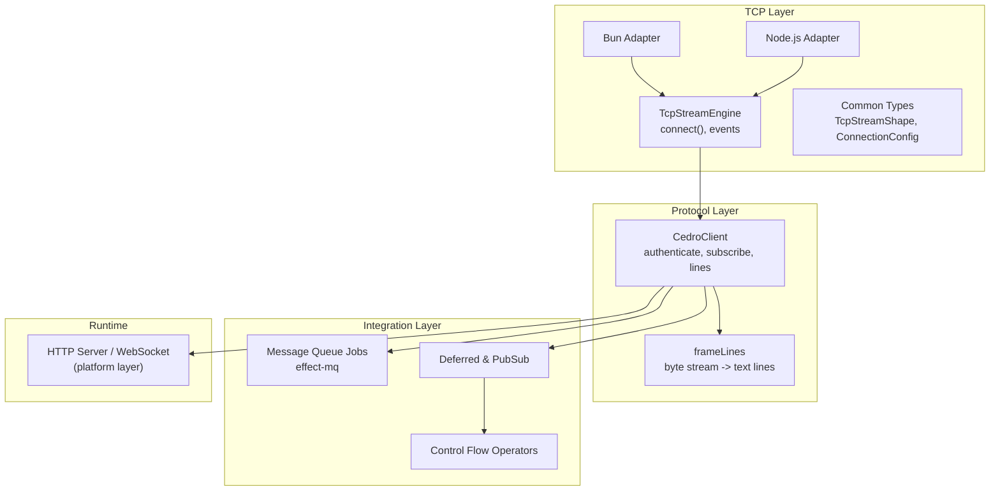
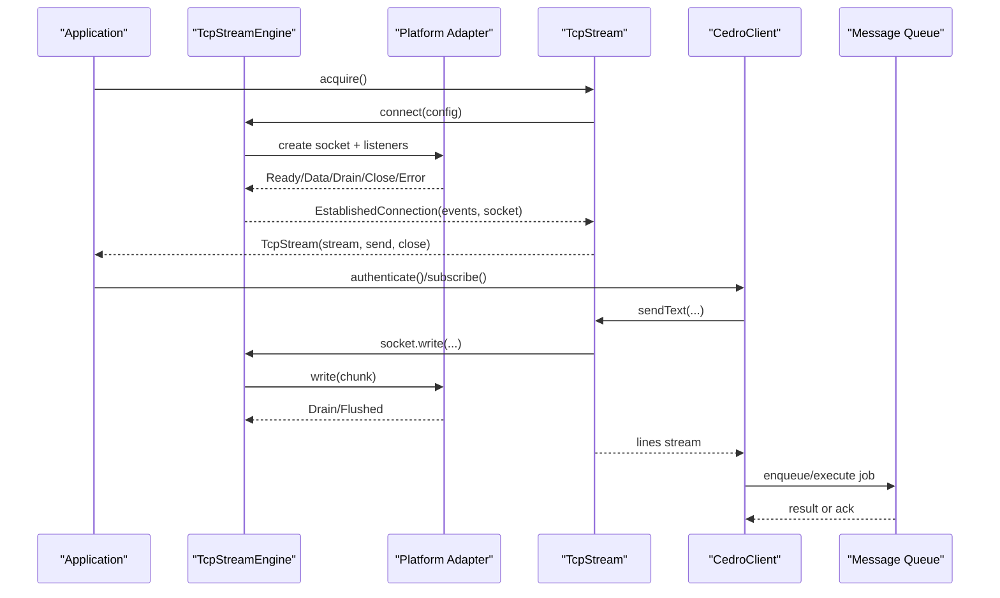
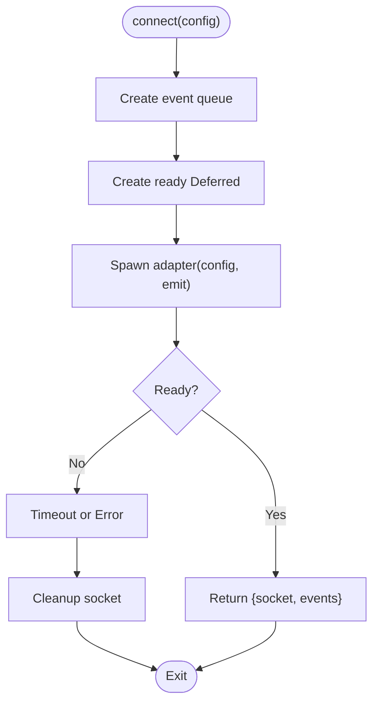
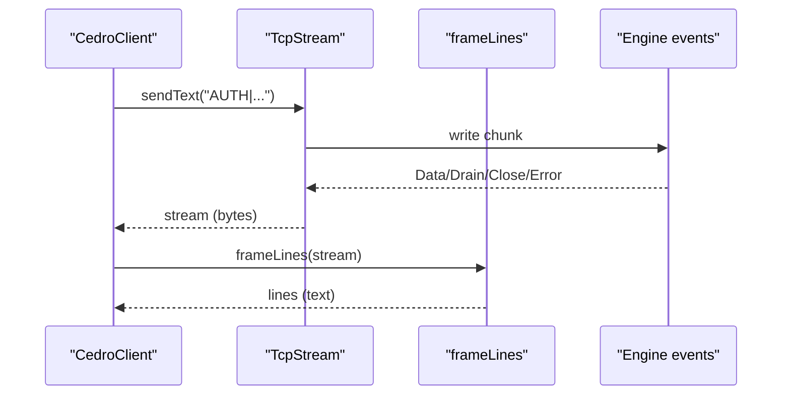
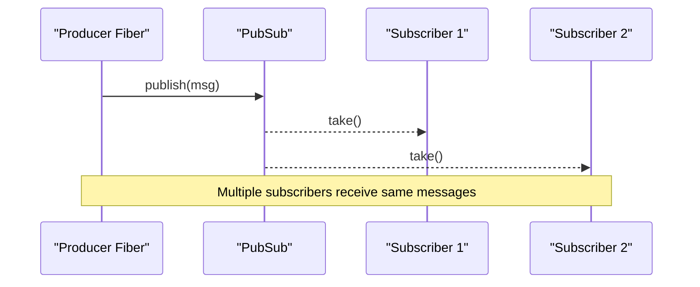
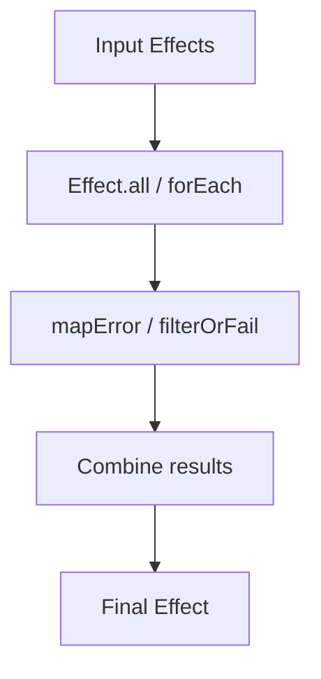
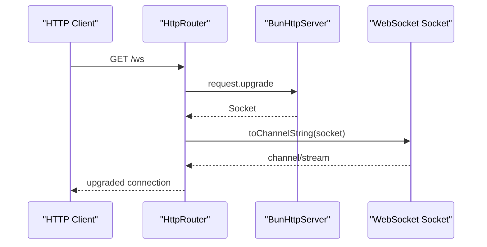
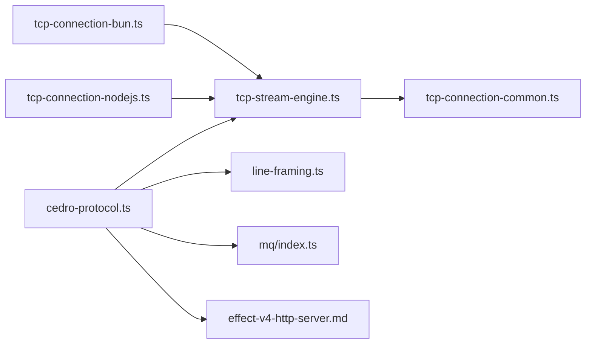

# Advanced Integration Patterns

<cite>
**Referenced Files in This Document**
- [package.json](file://package.json)
- [src/index.ts](file://src/index.ts)
- [src/tcp-connection.ts](file://src/tcp-connection.ts)
- [src/tcp-stream-engine.ts](file://src/tcp-stream-engine.ts)
- [src/tcp-connection-common.ts](file://src/tcp-connection-common.ts)
- [src/tcp-connection-bun.ts](file://src/tcp-connection-bun.ts)
- [src/tcp-connection-nodejs.ts](file://src/tcp-connection-nodejs.ts)
- [src/cedro-protocol.ts](file://src/cedro-protocol.ts)
- [src/line-framing.ts](file://src/line-framing.ts)
- [src/mq/index.ts](file://src/mq/index.ts)
- [src/concurrency-deferred.ts](file://src/concurrency-deferred.ts)
- [src/concurrency-pubsub.ts](file://src/concurrency-pubsub.ts)
- [src/control-flow-operators.ts](file://src/control-flow-operators.ts)
- [src/default-services.ts](file://src/default-services.ts)
- [src/error-channel-operations.ts](file://src/error-channel-operations.ts)
- [docs/research/effect-v4-http-server.md](file://docs/research/effect-v4-http-server.md)
</cite>

## Table of Contents
1. Introduction
2. Project Structure
3. Core Components
4. Architecture Overview
5. Detailed Component Analysis
6. Dependency Analysis
7. Performance Considerations
8. Troubleshooting Guide
9. Conclusion
10. Appendices

## Introduction
This document presents advanced integration patterns for combining TCP streams with other system components and frameworks using Effect primitives. It covers:
- Integrating TCP streams with message queues for background job processing
- Event-driven architectures and microservice communication patterns
- Advanced concurrency with Deferred values, Pub/Sub systems, and control flow operators
- Integration with HTTP servers and WebSocket handlers
- Resilience patterns such as circuit breakers and rate limiting
- Request/response correlation in distributed systems
- Testing integrated systems and managing dependencies

The repository provides a layered TCP stream abstraction with platform adapters (Bun and Node.js), a protocol client over TCP, a message queue integration via effect-mq, and examples of concurrency and control flow that can be composed into robust integrations.

## Project Structure
At a high level:
- Platform-agnostic TCP stream engine and shared types live under src/tcp-stream-engine.ts and src/tcp-connection-common.ts
- Platform-specific adapters implement the raw socket lifecycle for Bun and Node.js
- A protocol client composes TCP streams with line framing to build a typed service interface
- Message queue integration demonstrates background jobs with typed payloads and retries
- Concurrency utilities demonstrate Deferred and Pub/Sub patterns
- Control flow examples show parallelization and composition strategies
- HTTP/WebSocket guidance is documented in research notes



**Diagram sources**
- [src/tcp-stream-engine.ts:89-178](file://src/tcp-stream-engine.ts#L89-L178)
- [src/tcp-connection-common.ts:26-57](file://src/tcp-connection-common.ts#L26-L57)
- [src/tcp-connection-bun.ts:18-135](file://src/tcp-connection-bun.ts#L18-L135)
- [src/tcp-connection-nodejs.ts:21-115](file://src/tcp-connection-nodejs.ts#L21-L115)
- [src/cedro-protocol.ts:40-95](file://src/cedro-protocol.ts#L40-L95)
- [src/line-framing.ts:15-17](file://src/line-framing.ts#L15-L17)
- [src/mq/index.ts:1-40](file://src/mq/index.ts#L1-L40)
- [docs/research/effect-v4-http-server.md:140-170](file://docs/research/effect-v4-http-server.md#L140-L170)

**Section sources**
- [package.json:1-33](file://package.json#L1-L33)
- [src/index.ts:1-6](file://src/index.ts#L1-L6)

## Core Components
- TcpStreamEngine: A caller-first engine that wraps a cold adapter, manages connection lifecycle, emits Data/Drain/Close/Error events, and exposes a Stream of events plus a write handle.
- Platform Adapters: Implement RawSocketHandle and event emission for Bun and Node.js, including TLS support and error mapping.
- TcpStream: High-level service that owns a connection, enforces ordered writes with backpressure, and exposes a byte stream and helpers like sendText.
- Protocol Client: Builds a typed API over TCP by composing send operations and framing incoming bytes into lines.
- Message Queue: Demonstrates typed jobs, enqueue/execute, retry/backoff, and worker layers.
- Concurrency Primitives: Deferred for one-shot coordination; PubSub for multi-subscriber messaging; Streams for reactive pipelines.
- Control Flow: Parallel iteration, struct/record fan-out, and error handling patterns.

**Section sources**
- [src/tcp-stream-engine.ts:64-178](file://src/tcp-stream-engine.ts#L64-L178)
- [src/tcp-connection-common.ts:26-57](file://src/tcp-connection-common.ts#L26-L57)
- [src/tcp-connection-bun.ts:18-135](file://src/tcp-connection-bun.ts#L18-L135)
- [src/tcp-connection-nodejs.ts:21-115](file://src/tcp-connection-nodejs.ts#L21-L115)
- [src/cedro-protocol.ts:40-95](file://src/cedro-protocol.ts#L40-L95)
- [src/line-framing.ts:15-17](file://src/line-framing.ts#L15-L17)
- [src/mq/index.ts:1-40](file://src/mq/index.ts#L1-L40)
- [src/concurrency-deferred.ts:1-65](file://src/concurrency-deferred.ts#L1-L65)
- [src/concurrency-pubsub.ts:1-98](file://src/concurrency-pubsub.ts#L1-L98)
- [src/control-flow-operators.ts:1-62](file://src/control-flow-operators.ts#L1-L62)

## Architecture Overview
The architecture separates concerns across layers:
- Transport: Platform-specific adapters provide raw sockets with consistent events.
- Engine: The engine coordinates connection state, timeouts, retries, and event propagation through an unbounded queue and a Stream.
- Service: TcpStream encapsulates lifecycle, backpressure, and user-facing APIs.
- Protocol: A domain client composes send and framed reads to implement application protocols.
- Integration: Background jobs via message queues, event-driven flows via Pub/Sub, and HTTP/WebSocket endpoints for external clients.



**Diagram sources**
- [src/tcp-stream-engine.ts:89-178](file://src/tcp-stream-engine.ts#L89-L178)
- [src/tcp-connection-bun.ts:18-135](file://src/tcp-connection-bun.ts#L18-L135)
- [src/tcp-connection-nodejs.ts:21-115](file://src/tcp-connection-nodejs.ts#L21-L115)
- [src/cedro-protocol.ts:40-95](file://src/cedro-protocol.ts#L40-L95)
- [src/mq/index.ts:1-40](file://src/mq/index.ts#L1-L40)

## Detailed Component Analysis

### TCP Stream Engine and Adapters
- Caller-first design ensures the connection attempt is lazy and interruptible.
- Events are funneled into an internal queue and exposed as a Stream for consumers.
- Connect timeout and retry policies are applied at the engine boundary.
- Adapters map platform errors to a unified TcpStreamError and manage resource cleanup on cancellation.



**Diagram sources**
- [src/tcp-stream-engine.ts:89-178](file://src/tcp-stream-engine.ts#L89-L178)

**Section sources**
- [src/tcp-stream-engine.ts:89-178](file://src/tcp-stream-engine.ts#L89-L178)
- [src/tcp-connection-bun.ts:18-135](file://src/tcp-connection-bun.ts#L18-L135)
- [src/tcp-connection-nodejs.ts:21-115](file://src/tcp-connection-nodejs.ts#L21-L115)
- [src/tcp-connection-common.ts:18-57](file://src/tcp-connection-common.ts#L18-L57)

### Protocol Client Over TCP
- Validates configuration and builds commands as strings.
- Sends commands via TcpStream.sendText.
- Consumes incoming bytes and frames them into lines for higher-level parsing.



**Diagram sources**
- [src/cedro-protocol.ts:40-95](file://src/cedro-protocol.ts#L40-L95)
- [src/line-framing.ts:15-17](file://src/line-framing.ts#L15-L17)

**Section sources**
- [src/cedro-protocol.ts:40-95](file://src/cedro-protocol.ts#L40-L95)
- [src/line-framing.ts:15-17](file://src/line-framing.ts#L15-L17)

### Message Queue Integration for Background Jobs
- Define typed jobs with payload schemas, idempotency keys, metadata, and default retry/backoff.
- Enqueue fire-and-forget or execute-and-await with priority and delay.
- Provide a Runner layer that wires workers and a persistent store (e.g., memory or database).

```mermaid
classDiagram
class SendEmail {
+payload : { to, subject }
+success : string
+idempotencyKey()
+metadata()
+queue : "email"
+defaults : { attempts, backoff }
}
class WorkerLayer
class JobStore
SendEmail --> WorkerLayer : "toLayer(...)"
WorkerLayer --> JobStore : "provideMerge(...)"
```

**Diagram sources**
- [src/mq/index.ts:1-40](file://src/mq/index.ts#L1-L40)

**Section sources**
- [src/mq/index.ts:1-40](file://src/mq/index.ts#L1-L40)

### Concurrency Patterns: Deferred and Pub/Sub
- Deferred enables one-shot signaling between fibers, supporting success/failure and polling.
- PubSub supports bounded, dropping, sliding, and unbounded backpressure modes; subscriptions can be converted to Streams for reactive consumption.



**Diagram sources**
- [src/concurrency-pubsub.ts:1-98](file://src/concurrency-pubsub.ts#L1-L98)

**Section sources**
- [src/concurrency-deferred.ts:1-65](file://src/concurrency-deferred.ts#L1-L65)
- [src/concurrency-pubsub.ts:1-98](file://src/concurrency-pubsub.ts#L1-L98)

### Control Flow Operators for Distributed Workflows
- Use Effect.forEach for parallel iteration with controlled concurrency.
- Use Effect.all for fan-out over arrays, structs, and records.
- Combine with error mapping and filtering to model resilient workflows.



**Diagram sources**
- [src/control-flow-operators.ts:1-62](file://src/control-flow-operators.ts#L1-L62)

**Section sources**
- [src/control-flow-operators.ts:1-62](file://src/control-flow-operators.ts#L1-L62)

### HTTP Server and WebSocket Integration
- HTTP routes can upgrade to WebSockets using the platform’s HTTP server layer.
- Upgrade returns a Socket abstraction that can be converted to channels or streams for bidirectional communication.



**Diagram sources**
- [docs/research/effect-v4-http-server.md:140-170](file://docs/research/effect-v4-http-server.md#L140-L170)

**Section sources**
- [docs/research/effect-v4-http-server.md:140-170](file://docs/research/effect-v4-http-server.md#L140-L170)

## Dependency Analysis
- Platform adapters depend on the engine interface and common types.
- The engine depends on shared services (ConnectionConfig) and Effect primitives (Queue, Deferred, Stream, Schedule).
- Protocol client depends on TcpStream and framing utilities.
- Message queue integration depends on effect-mq and can be provided via Layers.
- HTTP/WebSocket usage depends on platform HTTP layers and unstable Socket abstractions.



**Diagram sources**
- [src/tcp-stream-engine.ts:89-178](file://src/tcp-stream-engine.ts#L89-L178)
- [src/tcp-connection-common.ts:26-57](file://src/tcp-connection-common.ts#L26-L57)
- [src/tcp-connection-bun.ts:18-135](file://src/tcp-connection-bun.ts#L18-L135)
- [src/tcp-connection-nodejs.ts:21-115](file://src/tcp-connection-nodejs.ts#L21-L115)
- [src/cedro-protocol.ts:40-95](file://src/cedro-protocol.ts#L40-L95)
- [src/line-framing.ts:15-17](file://src/line-framing.ts#L15-L17)
- [src/mq/index.ts:1-40](file://src/mq/index.ts#L1-L40)
- [docs/research/effect-v4-http-server.md:140-170](file://docs/research/effect-v4-http-server.md#L140-L170)

**Section sources**
- [package.json:23-28](file://package.json#L23-L28)

## Performance Considerations
- Backpressure: Use bounded or sliding PubSub when buffering large volumes; leverage Stream-based pipelines to avoid memory spikes.
- Write coalescing: The engine batches writes per chunk and waits for drain signals to prevent overwhelming the OS buffer.
- Timeouts and retries: Configure connectTimeout and retry schedules to balance responsiveness and resilience.
- Concurrency limits: Control parallelism in forEach/all to avoid saturating downstream services.
- Resource cleanup: Ensure proper scoping and interruption to release sockets promptly.

[No sources needed since this section provides general guidance]

## Troubleshooting Guide
- Connection failures: Inspect TcpStreamError.operation and message; verify host/port and TLS options.
- Timeouts: Adjust connectTimeout and retry policy; check network reachability.
- Drains and stalls: Monitor Drain events; ensure consumers keep up with producers.
- Protocol errors: Validate command formatting and required fields before sending.
- Job failures: Inspect effect-mq logs and adjust attempts/backoff; use idempotency keys to prevent duplicates.

**Section sources**
- [src/tcp-connection-common.ts:18-57](file://src/tcp-connection-common.ts#L18-L57)
- [src/tcp-stream-engine.ts:180-195](file://src/tcp-stream-engine.ts#L180-L195)
- [src/cedro-protocol.ts:40-95](file://src/cedro-protocol.ts#L40-L95)
- [src/mq/index.ts:1-40](file://src/mq/index.ts#L1-L40)

## Conclusion
This codebase demonstrates a robust, composable approach to integrating TCP streams with modern backend systems. By separating transport, engine, and protocol layers, and leveraging Effect’s concurrency and streaming primitives, you can build resilient microservices that communicate over TCP, process background jobs, and expose HTTP/WebSocket interfaces. Apply timeouts, retries, and backpressure controls to achieve predictable performance and reliability in production environments.

[No sources needed since this section summarizes without analyzing specific files]

## Appendices

### Testing Integrated Systems
- Unit tests: Mock TcpStream and protocol behaviors; validate command formatting and line parsing.
- Integration tests: Spin up local services or use in-memory stores for message queues; assert end-to-end flows.
- Deterministic randomness and time: Override Clock and Random services for reproducible tests.

**Section sources**
- [src/default-services.ts:1-32](file://src/default-services.ts#L1-L32)
- [src/error-channel-operations.ts:1-127](file://src/error-channel-operations.ts#L1-L127)

### Managing Dependencies in Complex Applications
- Use Layers to compose services (engine, config, protocol, queue runners).
- Provide platform-specific adapters at runtime boundaries.
- Keep protocol logic free of transport details by depending on TcpStreamShape.

**Section sources**
- [src/tcp-stream-engine.ts:341-359](file://src/tcp-stream-engine.ts#L341-L359)
- [src/tcp-connection-bun.ts:133-138](file://src/tcp-connection-bun.ts#L133-L138)
- [src/tcp-connection-nodejs.ts:114-131](file://src/tcp-connection-nodejs.ts#L114-L131)