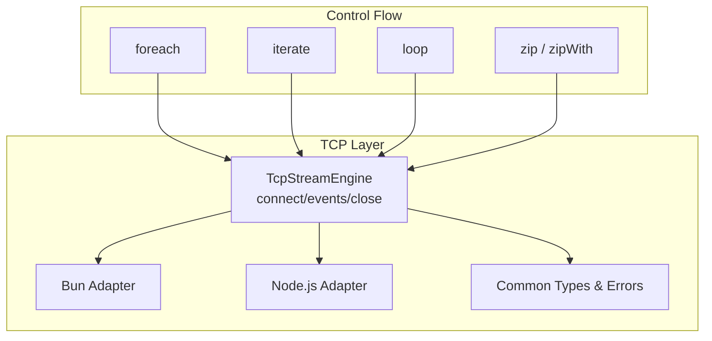
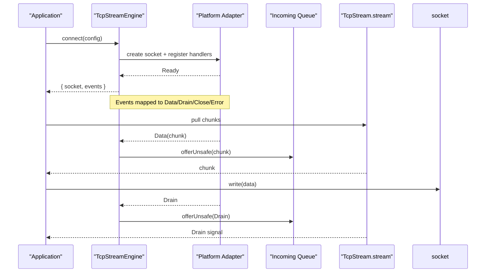
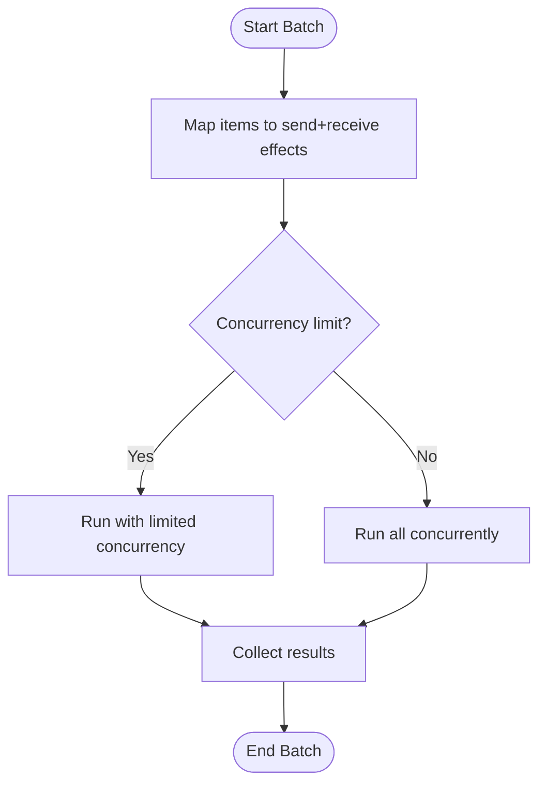
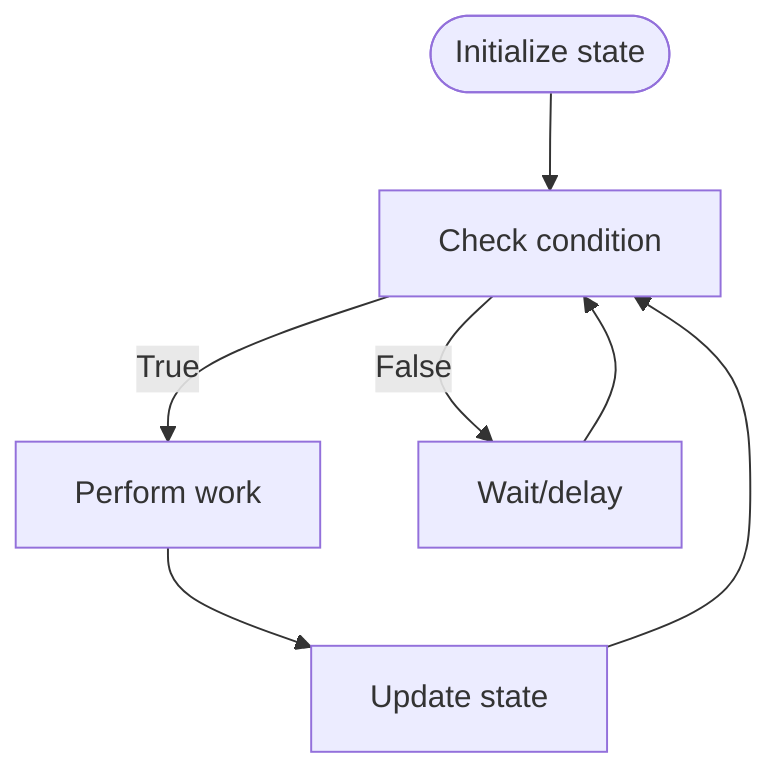
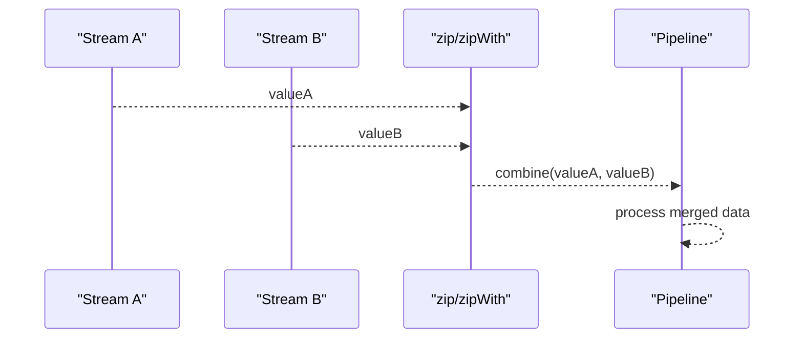
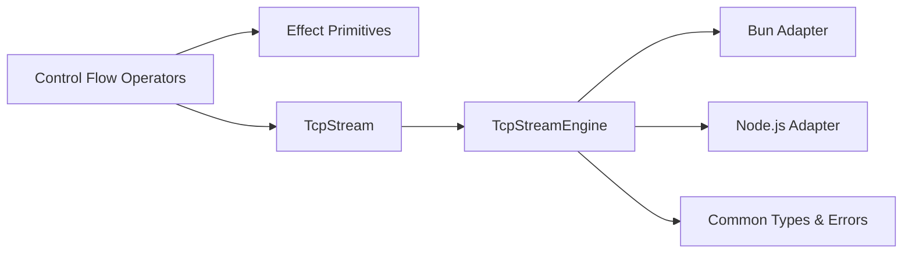

# Control Flow Operators

<cite>
**Referenced Files in This Document**
- [control-flow-foreach.ts](file://src/control-flow-foreach.ts)
- [control-flow-iterate.ts](file://src/control-flow-iterate.ts)
- [control-flow-loop.ts](file://src/control-flow-loop.ts)
- [control-flow-zip.ts](file://src/control-flow-zip.ts)
- [control-flow-operators.ts](file://src/control-flow-operators.ts)
- [tcp-stream-engine.ts](file://src/tcp-stream-engine.ts)
- [tcp-connection-common.ts](file://src/tcp-connection-common.ts)
- [tcp-connection-bun.ts](file://src/tcp-connection-bun.ts)
- [tcp-connection-nodejs.ts](file://src/tcp-connection-nodejs.ts)
</cite>

## Table of Contents
1. [Introduction](#introduction)
2. [Project Structure](#project-structure)
3. [Core Components](#core-components)
4. [Architecture Overview](#architecture-overview)
5. [Detailed Component Analysis](#detailed-component-analysis)
6. [Dependency Analysis](#dependency-analysis)
7. [Performance Considerations](#performance-considerations)
8. [Troubleshooting Guide](#troubleshooting-guide)
9. [Conclusion](#conclusion)

## Introduction
This document explains how to use control flow operators to build robust TCP stream processing and application logic with Effect. It focuses on:
- foreach for parallel iteration with concurrency limits
- iterate for functional loops with state management
- loop for imperative-style repetition
- zip for combining multiple streams or effects

It also shows how these operators integrate with Effect’s error handling and resource management, and provides concrete patterns for batch processing, polling, stream merging, and complex workflow orchestration. Finally, it covers performance characteristics, backpressure handling, and debugging techniques for long-running operations.

## Project Structure
The repository implements a layered TCP streaming stack with platform-specific adapters and a unified engine that exposes an Effect Stream interface for reading and effectful writes. Control flow operators live alongside the TCP layer and are used to compose high-level workflows over TcpStream.

**Diagram sources**
- [tcp-stream-engine.ts:88-178](file://src/tcp-stream-engine.ts#L88-L178)
- [tcp-connection-bun.ts:18-136](file://src/tcp-connection-bun.ts#L18-L136)
- [tcp-connection-nodejs.ts:21-119](file://src/tcp-connection-nodejs.ts#L21-L119)
- [tcp-connection-common.ts:18-35](file://src/tcp-connection-common.ts#L18-L35)

**Section sources**
- [tcp-stream-engine.ts:88-178](file://src/tcp-stream-engine.ts#L88-L178)
- [tcp-connection-bun.ts:18-136](file://src/tcp-connection-bun.ts#L18-L136)
- [tcp-connection-nodejs.ts:21-119](file://src/tcp-connection-nodejs.ts#L21-L119)
- [tcp-connection-common.ts:18-35](file://src/tcp-connection-common.ts#L18-L35)

## Core Components
- TcpStream service: Provides a pull-based Stream for incoming bytes, effectful send/sendText for writing, and close for lifecycle management.
- TcpStreamEngine: Bridges platform socket events (Ready, Data, Drain, Close, Error) into an Effect Stream and manages connection timeouts, retries, and drain synchronization.
- Platform Adapters: Bun and Node.js implementations map native socket callbacks to the engine’s event protocol and implement write semantics with backpressure awareness.
- Control Flow Operators:
  - foreach: Parallel iteration over collections with configurable concurrency.
  - iterate: Functional while-style loops using generators and yield*.
  - loop: Imperative-style repetition within generators.
  - zip/zipWith: Combine multiple effects or streams concurrently.

These components work together to enable safe, composable, and performant TCP workflows with strong error propagation and resource cleanup.

**Section sources**
- [tcp-connection-common.ts:26-35](file://src/tcp-connection-common.ts#L26-L35)
- [tcp-stream-engine.ts:201-339](file://src/tcp-stream-engine.ts#L201-L339)
- [control-flow-foreach.ts:3-10](file://src/control-flow-foreach.ts#L3-L10)
- [control-flow-iterate.ts:4-15](file://src/control-flow-iterate.ts#L4-L15)
- [control-flow-loop.ts:4-31](file://src/control-flow-loop.ts#L4-L31)
- [control-flow-zip.ts:3-23](file://src/control-flow-zip.ts#L3-L23)

## Architecture Overview
The TCP layer uses a caller-first design: connect returns a scoped connection with a socket handle and an events Stream. Reads are pulled via Stream.fromQueue; writes are serialized through a semaphore and honor drain signals. The engine wraps platform adapters and normalizes errors into TcpStreamError with operation tags.

**Diagram sources**
- [tcp-stream-engine.ts:92-178](file://src/tcp-stream-engine.ts#L92-L178)
- [tcp-stream-engine.ts:201-339](file://src/tcp-stream-engine.ts#L201-L339)
- [tcp-connection-bun.ts:57-123](file://src/tcp-connection-bun.ts#L57-L123)
- [tcp-connection-nodejs.ts:74-104](file://src/tcp-connection-nodejs.ts#L74-L104)

## Detailed Component Analysis

### foreach: Parallel Iteration with Concurrency Limits
Effect.forEach enables mapping over collections with controlled concurrency. In TCP workflows, this is ideal for batch processing requests or fan-out tasks such as sending commands to multiple endpoints or processing queued messages.

Key behaviors:
- Sequential by default unless configured otherwise; supports concurrency options to limit parallelism.
- Integrates with Effect’s error model: any failure short-circuits unless handled upstream.
- Works well with Streams via mapping each item to an effectful send/receive cycle.

Example pattern:
- Batch send: Map each message to an effect that sends data and awaits a response, then collect results.
- Polling: Iterate over a generated sequence of attempts with delays and retry policies.

Integration notes:
- Use concurrency limits to avoid overwhelming the TCP stack or remote services.
- Combine with zip/zipWith to coordinate multiple independent tasks.

**Section sources**
- [control-flow-foreach.ts:3-10](file://src/control-flow-foreach.ts#L3-L10)
- [control-flow-loop.ts:20-31](file://src/control-flow-loop.ts#L20-L31)
- [control-flow-operators.ts:3-7](file://src/control-flow-operators.ts#L3-L7)

### iterate: Functional Loops with State Management
Effect.gen with while/yield* provides a clean functional loop style where each iteration can be effectful. This is useful for:
- Reading until a condition is met (e.g., EOF or a termination frame).
- Accumulating state across iterations (counters, buffers, parsed frames).
- Coordinating with backpressure by awaiting drain signals.

Example pattern:
- Frame parser: Loop while more data is available, decode frames, and accumulate results.
- Request-response loop: Send a request, await response, update state, repeat until done.

Integration notes:
- Use yield* to safely interleave side effects and asynchronous operations.
- Combine with Stream.takeUntil or custom conditions to stop loops cleanly.

**Section sources**
- [control-flow-iterate.ts:4-15](file://src/control-flow-iterate.ts#L4-L15)

### loop: Imperative-Style Repetition
Imperative loops inside Effect.gen are straightforward and efficient for scenarios where you need explicit control flow, counters, and early exits. They pair naturally with:
- Retry loops with exponential backoff.
- Heartbeat/ping loops that monitor liveness.
- Bounded work queues processed until empty.

Example pattern:
- Retry loop: Attempt a connection or operation up to N times with delays, breaking on success or max attempts.
- Work queue processor: While items remain, dequeue and process them, respecting backpressure.

Integration notes:
- Ensure proper resource acquisition/release around loops to avoid leaks.
- Use Effect.retry or custom scheduling for robust retries.

**Section sources**
- [control-flow-loop.ts:4-18](file://src/control-flow-loop.ts#L4-L18)

### zip: Combining Multiple Streams and Effects
Effect.zip and zipWith allow concurrent composition of multiple effects or streams. For TCP workflows:
- Merge multiple input streams into one pipeline.
- Fan-out to multiple destinations and combine results.
- Coordinate independent tasks like health checks, metrics collection, and payload transmission.

Example pattern:
- Stream merging: Zip two streams of frames from different channels and merge into a single output.
- Task coordination: Zip a send effect with a receive effect to ensure ordering and completion.

Integration notes:
- Use concurrency flags appropriately to balance throughput and resource usage.
- Handle partial failures: zip fails fast by default; consider error recovery strategies.

**Section sources**
- [control-flow-zip.ts:3-23](file://src/control-flow-zip.ts#L3-L23)

### TCP Stream Integration Patterns

#### Batch Processing with foreach
- Map each item to an effect that sends data and reads a response.
- Limit concurrency to protect downstream systems.
- Collect results or discard outputs based on needs.

[No sources needed since this diagram shows conceptual workflow, not actual code structure]

#### Polling Pattern with iterate/loop
- Use iterate or loop to poll a server or check a condition.
- Apply delays and retries between attempts.
- Stop when a terminal condition is reached or an error occurs.

[No sources needed since this diagram shows conceptual workflow, not actual code structure]

#### Stream Merging with zip
- Combine multiple streams or effects into a coordinated pipeline.
- Use zipWith to transform combined results into domain values.

[No sources needed since this diagram shows conceptual workflow, not actual code structure]

#### Complex Workflow Orchestration
- Compose foreach, iterate, loop, and zip to build multi-stage pipelines.
- Use acquireRelease for resources (connections, buffers) scoped to workflows.
- Apply error handling per stage to isolate failures and propagate context.

**Section sources**
- [tcp-stream-engine.ts:201-339](file://src/tcp-stream-engine.ts#L201-L339)
- [tcp-connection-common.ts:18-35](file://src/tcp-connection-common.ts#L18-L35)

## Dependency Analysis
Control flow operators depend on Effect primitives and integrate with the TCP layer via Streams and Effects. The TCP engine depends on platform adapters and common types.

**Diagram sources**
- [tcp-stream-engine.ts:88-178](file://src/tcp-stream-engine.ts#L88-L178)
- [tcp-connection-bun.ts:18-136](file://src/tcp-connection-bun.ts#L18-L136)
- [tcp-connection-nodejs.ts:21-119](file://src/tcp-connection-nodejs.ts#L21-L119)
- [tcp-connection-common.ts:18-35](file://src/tcp-connection-common.ts#L18-L35)

**Section sources**
- [tcp-stream-engine.ts:88-178](file://src/tcp-stream-engine.ts#L88-L178)
- [tcp-connection-bun.ts:18-136](file://src/tcp-connection-bun.ts#L18-L136)
- [tcp-connection-nodejs.ts:21-119](file://src/tcp-connection-nodejs.ts#L21-L119)
- [tcp-connection-common.ts:18-35](file://src/tcp-connection-common.ts#L18-L35)

## Performance Considerations
- Concurrency control: Use foreach with bounded concurrency to prevent resource exhaustion and maintain stable throughput.
- Backpressure: The engine honors drain signals and serializes writes via a semaphore; ensure your pipelines respect these signals to avoid memory growth.
- Stream consumption: Pull-based Streams minimize buffering; prefer streaming transformations over collecting large intermediates.
- Resource scope: Acquire connections and buffers within scopes to ensure timely release and avoid leaks during long-running operations.
- Retry strategy: Configure exponential backoff with jitter for resilience; cap attempts and duration to bound resource usage.

[No sources needed since this section provides general guidance]

## Troubleshooting Guide
- Connection failures: Errors are normalized to TcpStreamError with operation tags ("connect", "read", "write"). Inspect the operation field to identify failure points.
- Timeouts: Connect timeouts wrap underlying causes; configure appropriate durations and handle timeout errors distinctly.
- Write stalls: If bytesWritten is zero, the engine waits for drain; ensure downstream consumers are active and not blocked.
- Stream termination: Close and Error events transition the connection to a closed state; verify that fibers and queues are properly ended.
- Debugging long-running operations:
  - Log key milestones (connect, ready, data chunks, drain, close).
  - Use structured logging with correlation IDs for requests.
  - Monitor queue sizes and fiber counts to detect leaks or bottlenecks.
  - Apply sampling or tracing for high-throughput paths.

**Section sources**
- [tcp-stream-engine.ts:125-136](file://src/tcp-stream-engine.ts#L125-L136)
- [tcp-stream-engine.ts:180-195](file://src/tcp-stream-engine.ts#L180-L195)
- [tcp-stream-engine.ts:295-339](file://src/tcp-stream-engine.ts#L295-L339)
- [tcp-connection-common.ts:18-35](file://src/tcp-connection-common.ts#L18-L35)

## Conclusion
Control flow operators provide powerful abstractions for building TCP stream processing and application logic with Effect. By combining foreach, iterate, loop, and zip with the TcpStream engine, you can implement batch processing, polling, stream merging, and complex orchestrations that are resilient, performant, and easy to debug. Properly leveraging concurrency limits, backpressure, and error handling ensures robust behavior under load and during failures.

[No sources needed since this section summarizes without analyzing specific files]