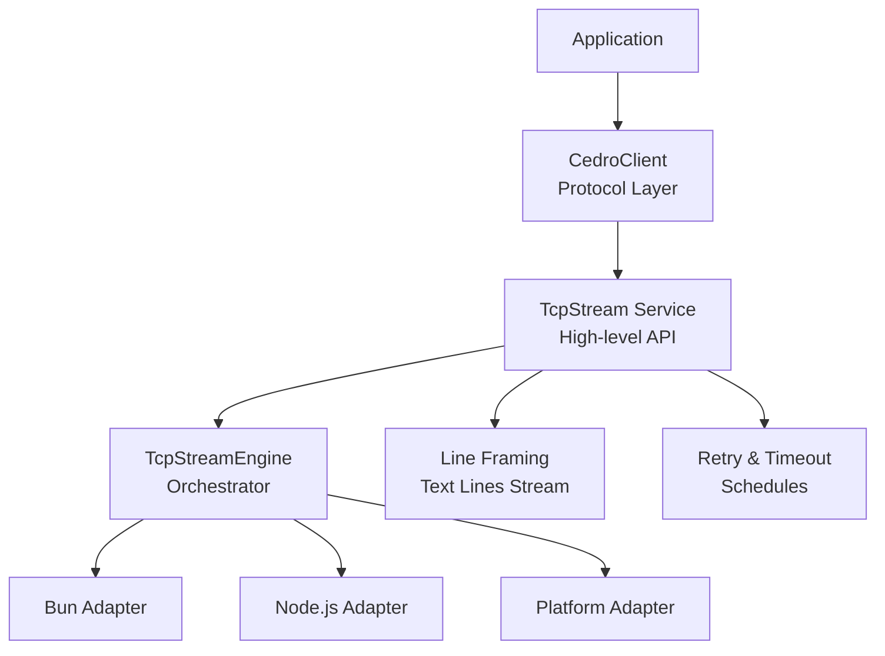
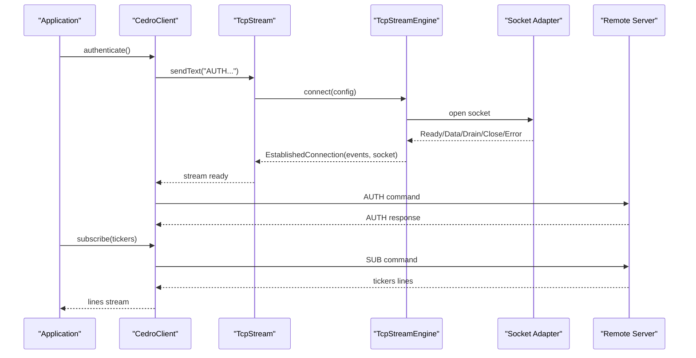
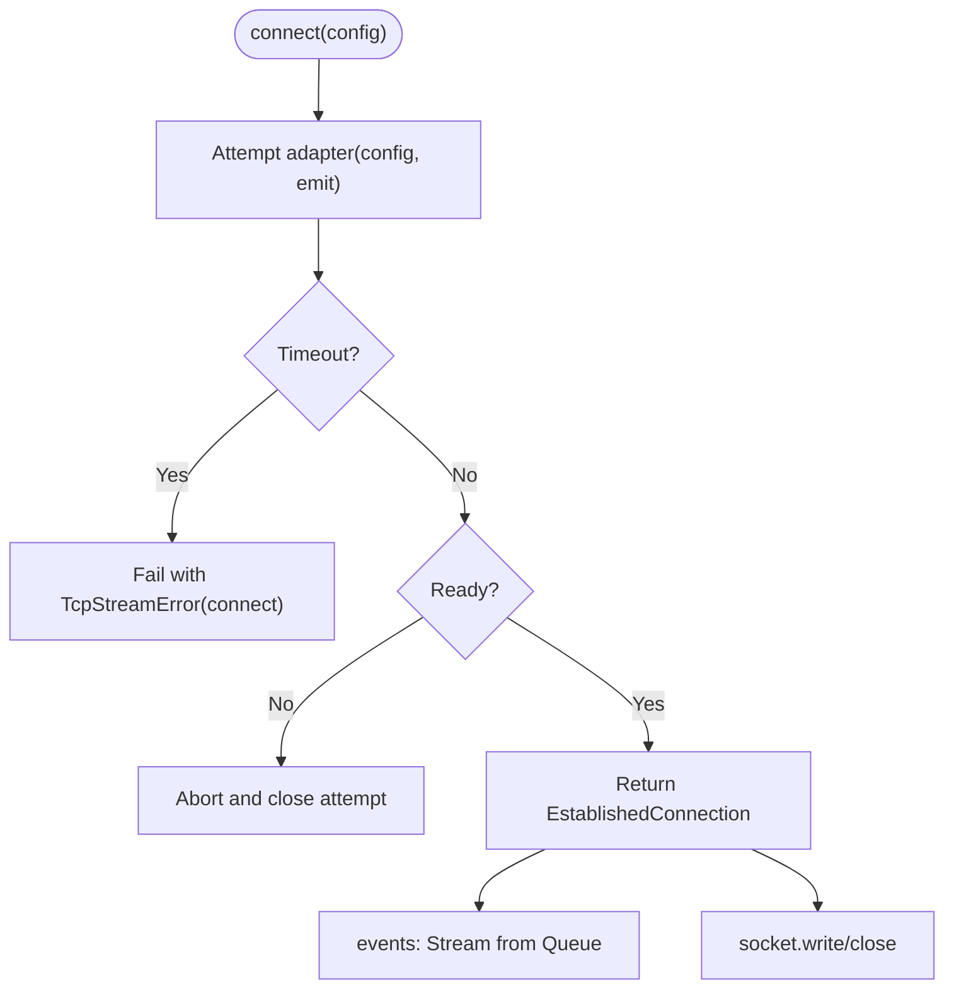
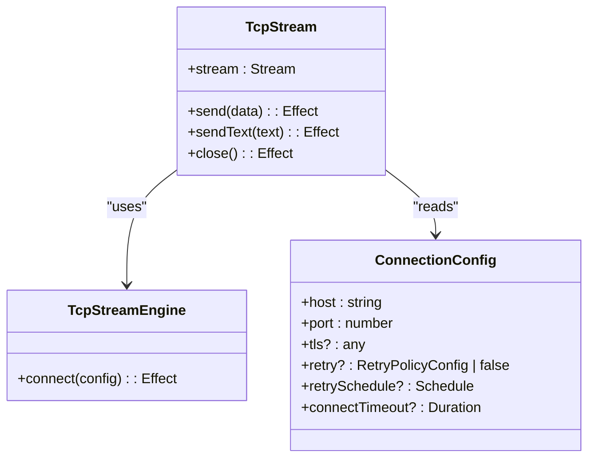
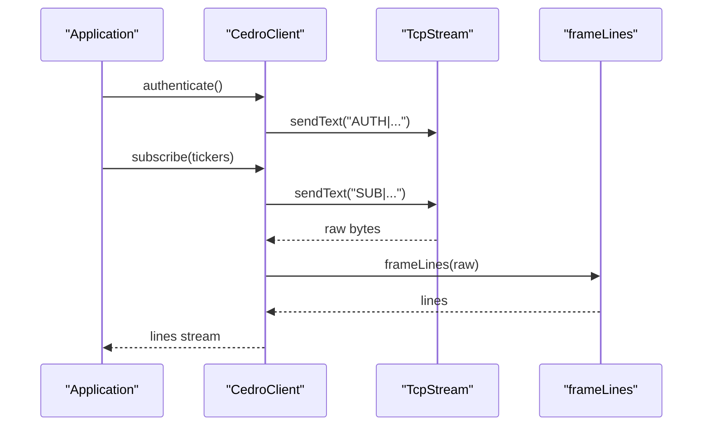
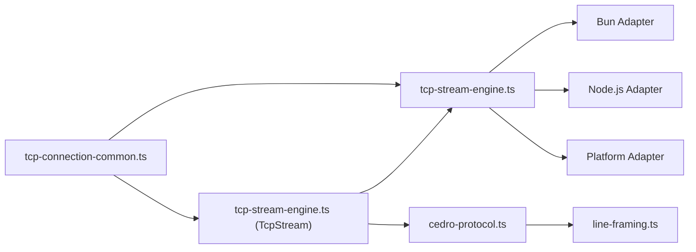

# Distributed Systems Patterns

<cite>
**Referenced Files in This Document**
- [package.json](file://package.json)
- [src/index.ts](file://src/index.ts)
- [src/tcp-connection.ts](file://src/tcp-connection.ts)
- [src/tcp-stream-engine.ts](file://src/tcp-stream-engine.ts)
- [src/tcp-connection-common.ts](file://src/tcp-connection-common.ts)
- [src/cedro-protocol.ts](file://src/cedro-protocol.ts)
- [src/line-framing.ts](file://src/line-framing.ts)
- [src/concurrency-deferred.ts](file://src/concurrency-deferred.ts)
- [src/concurrency-pubsub.ts](file://src/concurrency-pubsub.ts)
- [src/concurrency-queue.ts](file://src/concurrency-queue.ts)
- [docs/adr/0001-direct-engine-socket-wrappers.md](file://docs/adr/0001-direct-engine-socket-wrappers.md)
- [docs/adr/0002-unified-tcp-stream-engine-adapter-seam.md](file://docs/adr/0002-unified-tcp-stream-engine-adapter-seam.md)
- [docs/adr/0003-effect-platform-push-socket-implementation.md](file://docs/adr/0003-effect-platform-push-socket-implementation.md)
- [docs/research/effect-v4-platform-tcp-connection.md](file://docs/research/effect-v4-platform-tcp-connection.md)
</cite>

## Table of Contents
1. Introduction
2. Project Structure
3. Core Components
4. Architecture Overview
5. Detailed Component Analysis
6. Dependency Analysis
7. Performance Considerations
8. Troubleshooting Guide
9. Conclusion
10. Appendices

## Introduction
This document presents architectural guidance for building distributed systems with TCP streams and Effect, grounded in the repository’s concrete implementations. It focuses on resilience (circuit breaking), rate limiting, request/response correlation, connection pooling, load balancing, failure detection, eventual consistency patterns (sagas and compensating transactions), observability, and security. Where applicable, it maps these patterns to existing code such as the unified TCP stream engine, retry scheduling, line framing, and protocol client layers.

## Project Structure
The project provides a layered TCP streaming foundation:
- A shared contract and error model for connections and retries
- A platform-agnostic engine that orchestrates connect, events, timeouts, and backpressure
- Concrete adapters for Bun and Node.js
- A higher-level protocol client over framed lines
- Concurrency primitives (queues, pub/sub, deferred) used by the engine and clients

**Diagram sources**
- [src/tcp-stream-engine.ts:89-178](file://src/tcp-stream-engine.ts#L89-L178)
- [src/tcp-connection-common.ts:45-100](file://src/tcp-connection-common.ts#L45-L100)
- [src/cedro-protocol.ts:40-95](file://src/cedro-protocol.ts#L40-L95)
- [src/line-framing.ts:1-18](file://src/line-framing.ts#L1-L18)

**Section sources**
- [package.json:1-33](file://package.json#L1-L33)
- [src/tcp-connection.ts:1-10](file://src/tcp-connection.ts#L1-L10)
- [src/tcp-stream-engine.ts:1-359](file://src/tcp-stream-engine.ts#L1-L359)
- [src/tcp-connection-common.ts:1-101](file://src/tcp-connection-common.ts#L1-L101)
- [src/cedro-protocol.ts:1-96](file://src/cedro-protocol.ts#L1-L96)
- [src/line-framing.ts:1-18](file://src/line-framing.ts#L1-L18)

## Core Components
- TcpStreamEngine: Orchestrates connection lifecycle, event bridging, timeouts, and backpressure; exposes an established connection with a write handle and an events stream.
- TcpStream: High-level service combining connection acquisition/release, incoming data queue, write serialization, drain handling, and cleanup.
- ConnectionConfig and RetryPolicy: Typed configuration for host/port/TLS/connect timeout and retry schedules (exponential, jittered, bounded).
- CedroClient: Protocol client that authenticates and subscribes using framed text lines over TcpStream.
- Line Framing: Transforms raw byte streams into UTF-8 text lines, supporting multi-packet reassembly and batch emission.
- Concurrency Primitives: Queues, PubSub, Deferred used for buffering, fan-out, and synchronization across components.

Key responsibilities:
- Resilience: Built-in retry schedules and connect timeouts
- Backpressure: Write serialization via semaphore and drain waiters
- Streaming: Pull-based Streams for reads; effectful writes
- Composition: Layers and services for dependency injection

**Section sources**
- [src/tcp-stream-engine.ts:89-178](file://src/tcp-stream-engine.ts#L89-L178)
- [src/tcp-stream-engine.ts:201-341](file://src/tcp-stream-engine.ts#L201-L341)
- [src/tcp-connection-common.ts:37-100](file://src/tcp-connection-common.ts#L37-L100)
- [src/cedro-protocol.ts:40-95](file://src/cedro-protocol.ts#L40-L95)
- [src/line-framing.ts:1-18](file://src/line-framing.ts#L1-L18)

## Architecture Overview
The system composes a resilient TCP client stack:
- Application uses CedroClient for protocol operations
- CedroClient depends on TcpStream for transport
- TcpStream depends on TcpStreamEngine for connection orchestration
- Engine adapts to runtime-specific sockets (Bun, Node.js, or Platform)
- Retries and timeouts are applied at the engine layer
- Line framing sits above raw bytes to provide text-oriented protocols

**Diagram sources**
- [src/cedro-protocol.ts:40-95](file://src/cedro-protocol.ts#L40-L95)
- [src/tcp-stream-engine.ts:89-178](file://src/tcp-stream-engine.ts#L89-L178)
- [src/tcp-stream-engine.ts:201-341](file://src/tcp-stream-engine.ts#L201-L341)
- [src/tcp-connection-common.ts:45-100](file://src/tcp-connection-common.ts#L45-L100)

## Detailed Component Analysis

### Unified TCP Stream Engine
Responsibilities:
- Establishes connections with configurable timeouts
- Bridges adapter events to a typed stream
- Manages connection state transitions and error propagation
- Provides a stable EstablishedConnection with a write handle and events stream

Implementation highlights:
- Cold adapter protocol abstracts platform specifics
- Connect attempts wrapped with timeout and mapped errors
- Event loop converts adapter events into a Queue-backed Stream
- Close semantics ensure idempotent teardown and resource release

**Diagram sources**
- [src/tcp-stream-engine.ts:89-178](file://src/tcp-stream-engine.ts#L89-L178)
- [src/tcp-stream-engine.ts:180-195](file://src/tcp-stream-engine.ts#L180-L195)

**Section sources**
- [src/tcp-stream-engine.ts:89-178](file://src/tcp-stream-engine.ts#L89-L178)
- [src/tcp-stream-engine.ts:180-195](file://src/tcp-stream-engine.ts#L180-L195)

### TcpStream Service
Responsibilities:
- Acquire/release connections with retry support
- Maintain incoming data queue and backpressure-aware writes
- Handle drain signals and connection closure
- Expose send/sendText/close and a read Stream

Key behaviors:
- Uses acquireRelease with interruptible true to avoid stuck retries
- Semaphore serializes writes; drain waiter coordinates OS buffer pressure
- Finish logic propagates errors to consumers and cleans up resources

**Diagram sources**
- [src/tcp-stream-engine.ts:201-341](file://src/tcp-stream-engine.ts#L201-L341)
- [src/tcp-connection-common.ts:45-100](file://src/tcp-connection-common.ts#L45-L100)

**Section sources**
- [src/tcp-stream-engine.ts:201-341](file://src/tcp-stream-engine.ts#L201-L341)
- [src/tcp-connection-common.ts:45-100](file://src/tcp-connection-common.ts#L45-L100)

### Protocol Client (Cedro)
Responsibilities:
- Authenticate with credentials and magic token
- Subscribe to tickers
- Provide raw and framed line streams

Design notes:
- Pure validation with Result before I/O
- Text commands sent via TcpStream
- Framing transforms raw bytes to lines for protocol consumption

**Diagram sources**
- [src/cedro-protocol.ts:40-95](file://src/cedro-protocol.ts#L40-L95)
- [src/line-framing.ts:1-18](file://src/line-framing.ts#L1-L18)

**Section sources**
- [src/cedro-protocol.ts:1-96](file://src/cedro-protocol.ts#L1-L96)
- [src/line-framing.ts:1-18](file://src/line-framing.ts#L1-L18)

### Concurrency Primitives
- Queues: Bounded/unbounded/dropping/sliding queues for buffering and backpressure
- PubSub: Fan-out messaging with multiple subscribers
- Deferred: Synchronization points for readiness and coordination

These primitives underpin the engine’s event loop, write backpressure, and protocol flows.

**Section sources**
- [src/concurrency-queue.ts:1-92](file://src/concurrency-queue.ts#L1-L92)
- [src/concurrency-pubsub.ts:1-98](file://src/concurrency-pubsub.ts#L1-L98)
- [src/concurrency-deferred.ts:1-65](file://src/concurrency-deferred.ts#L1-L65)

## Dependency Analysis
The repository composes dependencies through Effect Services and Layers:
- TcpStream depends on TcpStreamEngine and ConnectionConfig
- CedroClient depends on TcpStream and CedroConfig
- Engine depends on platform adapters (Bun/Node/Platform)
- Shared types and errors live in tcp-connection-common

**Diagram sources**
- [src/tcp-connection-common.ts:1-101](file://src/tcp-connection-common.ts#L1-L101)
- [src/tcp-stream-engine.ts:1-359](file://src/tcp-stream-engine.ts#L1-L359)
- [src/cedro-protocol.ts:1-96](file://src/cedro-protocol.ts#L1-L96)
- [src/line-framing.ts:1-18](file://src/line-framing.ts#L1-L18)

**Section sources**
- [src/tcp-connection.ts:1-10](file://src/tcp-connection.ts#L1-L10)
- [src/tcp-stream-engine.ts:1-359](file://src/tcp-stream-engine.ts#L1-L359)
- [src/cedro-protocol.ts:1-96](file://src/cedro-protocol.ts#L1-L96)

## Performance Considerations
- Backpressure: The engine serializes writes and waits for drain signals to avoid overwhelming the OS buffer.
- Memory: Incoming data is buffered in a Queue; consider bounded queues for high-throughput scenarios to apply producer backpressure.
- Retries: Exponential backoff with jitter prevents thundering herds; tune maxAttempts and maxDuration per environment.
- Timeouts: Connect timeouts prevent hanging during network issues; ensure they align with SLAs.
- Framing: Line framing decodes once and splits efficiently; prefer this over ad-hoc parsing loops.

[No sources needed since this section provides general guidance]

## Troubleshooting Guide
Common issues and where to look:
- Connection failures: Check connect timeout mapping and error wrapping in the engine.
- Stuck writes: Verify drain handling and semaphore usage; ensure close is idempotent.
- Unexpected closures: Inspect finish logic and incoming queue termination/failure.
- Protocol errors: Validate command formatting and required fields in the protocol client.

Operational tips:
- Use structured logging around connect, send, and close paths.
- Instrument retry attempts and durations to detect flaky networks.
- Add metrics for queue sizes and backpressure events.

**Section sources**
- [src/tcp-stream-engine.ts:89-178](file://src/tcp-stream-engine.ts#L89-L178)
- [src/tcp-stream-engine.ts:201-341](file://src/tcp-stream-engine.ts#L201-L341)
- [src/cedro-protocol.ts:40-95](file://src/cedro-protocol.ts#L40-L95)

## Conclusion
The repository provides a robust foundation for distributed systems using TCP streams and Effect. Its unified engine, typed configuration, retry scheduling, and streaming abstractions enable resilient, observable, and composable clients. Extending this base with circuit breakers, rate limiters, correlation IDs, connection pools, load balancers, and saga orchestration yields production-grade distributed architectures.

[No sources needed since this section summarizes without analyzing specific files]

## Appendices

### Circuit Breaker Pattern
- Purpose: Prevent cascading failures by short-circuiting calls to unhealthy downstreams.
- Implementation approach: Wrap downstream calls with a breaker state machine (Closed/Open/Half-Open) and integrate with retry/backoff.
- Metrics: Track success/failure rates and latency percentiles to transition states.
- Integration point: Place near service boundaries (e.g., around CedroClient calls or outbound HTTP/TCP calls).

[No sources needed since this section provides general guidance]

### Rate Limiting Strategies
- Token bucket or leaky bucket algorithms to smooth bursts.
- Per-client or global limits depending on isolation needs.
- Combine with retries to avoid amplification during overload.
- Expose metrics for throttling decisions and user feedback.

[No sources needed since this section provides general guidance]

### Request/Response Correlation
- Assign a unique correlation ID per request and propagate it across all hops.
- Attach correlation metadata to log lines and metrics.
- For TCP streams, include correlation in message headers or frames.
- Use streams to correlate responses with requests by matching IDs.

[No sources needed since this section provides general guidance]

### Connection Pooling
- Pool reusable connections to reduce handshake overhead.
- Manage pool size based on downstream capacity and memory constraints.
- Implement health checks and eviction for stale connections.
- Ensure scoped lifetimes to avoid leaks.

[No sources needed since this section provides general guidance]

### Load Balancing Approaches
- Round-robin, least-connections, or consistent hashing for deterministic routing.
- Integrate with discovery services for dynamic endpoints.
- Pair with circuit breakers to fail fast on unhealthy nodes.

[No sources needed since this section provides general guidance]

### Failure Detection Mechanisms
- Liveness probes and heartbeat messages.
- Timeout-based detection combined with retries and fallbacks.
- Observability-driven alerts on error rates and latency spikes.

[No sources needed since this section provides general guidance]

### Eventual Consistency, Saga Orchestration, Compensating Transactions
- Model long-running workflows as sagas with explicit steps and compensations.
- Persist saga state to survive restarts.
- Use outbox pattern for reliable event publishing.
- Monitor saga progress and implement manual reconciliation tools.

[No sources needed since this section provides general guidance]

### Monitoring and Observability
- Emit metrics for connections, throughput, latency, and errors.
- Centralize logs with correlation IDs and structured fields.
- Trace requests end-to-end across services.
- Set up dashboards and alerts for SLOs.

[No sources needed since this section provides general guidance]

### Security Considerations
- Authentication: Validate credentials early (see protocol client authentication flow).
- Authorization: Enforce permissions per operation and scope.
- Secure communication: Prefer TLS for transports; validate certificates.
- Secrets management: Use secure configuration sources and rotate keys regularly.
- Input validation: Sanitize and validate all inputs to prevent injection.

**Section sources**
- [src/cedro-protocol.ts:40-95](file://src/cedro-protocol.ts#L40-L95)
- [src/tcp-connection-common.ts:45-100](file://src/tcp-connection-common.ts#L45-L100)

### Repository Design Notes and References
- Direct engine wrappers chosen for control over timeouts, retries, and backpressure.
- Unified engine seam reduces duplication across runtimes.
- Platform adapter demonstrates push-loop alternative and Channel integration.
- Research document compares platform vs custom wrappers and provides examples.

**Section sources**
- [docs/adr/0001-direct-engine-socket-wrappers.md:1-12](file://docs/adr/0001-direct-engine-socket-wrappers.md#L1-L12)
- [docs/adr/0002-unified-tcp-stream-engine-adapter-seam.md:1-9](file://docs/adr/0002-unified-tcp-stream-engine-adapter-seam.md#L1-L9)
- [docs/adr/0003-effect-platform-push-socket-implementation.md:1-56](file://docs/adr/0003-effect-platform-push-socket-implementation.md#L1-L56)
- [docs/research/effect-v4-platform-tcp-connection.md:1-656](file://docs/research/effect-v4-platform-tcp-connection.md#L1-L656)