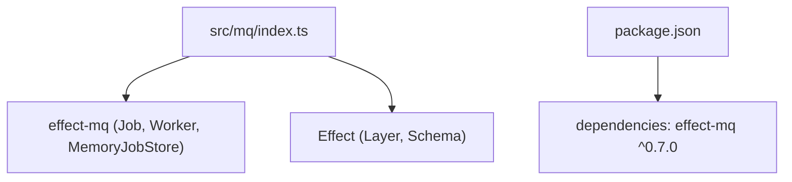
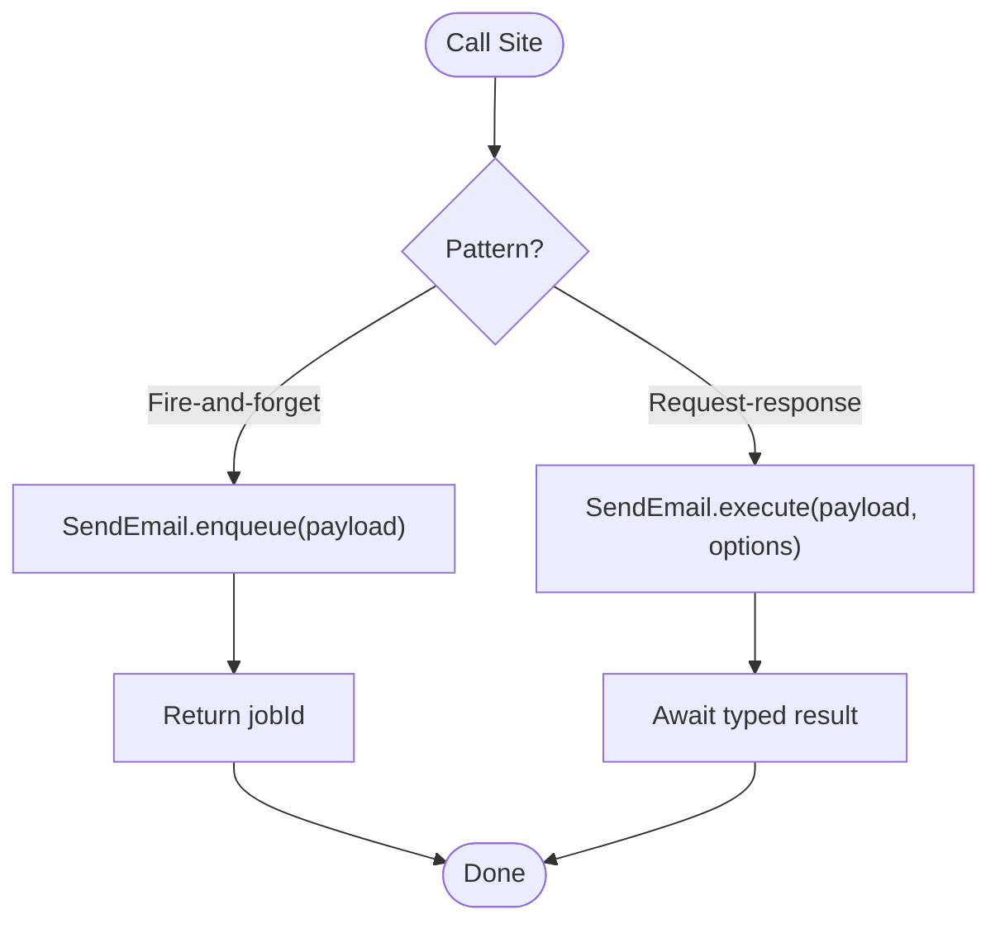
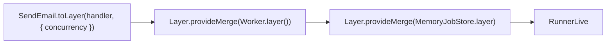
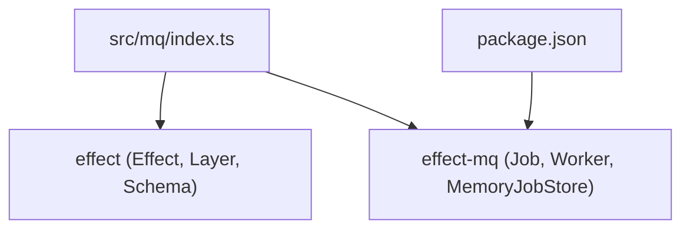

# Message Queue Integration

<cite>
**Referenced Files in This Document**
- [src/mq/index.ts](file://src/mq/index.ts)
- [package.json](file://package.json)
</cite>

## Table of Contents
1. [Introduction](#introduction)
2. [Project Structure](#project-structure)
3. [Core Components](#core-components)
4. [Architecture Overview](#architecture-overview)
5. [Detailed Component Analysis](#detailed-component-analysis)
6. [Dependency Analysis](#dependency-analysis)
7. [Performance Considerations](#performance-considerations)
8. [Troubleshooting Guide](#troubleshooting-guide)
9. [Conclusion](#conclusion)
10. [Appendices](#appendices)

## Introduction
This document explains how to integrate a message queue using the Effect MQ library within this project. It focuses on creating typed job definitions with Schema validation, configuring retry policies and backoff strategies, and implementing background job processing. You will learn the Job.make pattern for defining jobs with payload schemas, success types, idempotency keys, and metadata; understand enqueue versus execute patterns for fire-and-forget versus request-response scenarios; configure workers, concurrency, and layer composition for dependency injection; and see practical examples such as email sending jobs, data processing pipelines, and notification systems. The guide also covers job persistence, monitoring, and error handling strategies.

## Project Structure
The message queue integration is implemented under src/mq/index.ts and depends on the effect-mq package declared in package.json. The module defines a typed job class, demonstrates enqueue and execute usage, and composes a RunnerLive layer that wires up the worker and job store.



**Diagram sources**
- [src/mq/index.ts:1-39](file://src/mq/index.ts#L1-L39)
- [package.json:23-28](file://package.json#L23-L28)

**Section sources**
- [src/mq/index.ts:1-39](file://src/mq/index.ts#L1-L39)
- [package.json:23-28](file://package.json#L23-L28)

## Core Components
- Typed job definition via Job.make with payload schema, success type, idempotency key, metadata, queue name, and default retry/backoff settings.
- Enqueue for fire-and-forget job submission returning a job identifier.
- Execute for request-response style invocation that enqueues and awaits a typed result.
- Worker configuration through toLayer with concurrency and layer composition to provide Worker and JobStore implementations.

Key implementation references:
- Job definition and defaults: [src/mq/index.ts:6-16](file://src/mq/index.ts#L6-L16)
- Enqueue usage: [src/mq/index.ts:18-23](file://src/mq/index.ts#L18-L23)
- Execute usage: [src/mq/index.ts:25-29](file://src/mq/index.ts#L25-L29)
- Worker layer composition: [src/mq/index.ts:32-39](file://src/mq/index.ts#L32-L39)

**Section sources**
- [src/mq/index.ts:6-39](file://src/mq/index.ts#L6-L39)

## Architecture Overview
The system centers around a typed job class that encapsulates validation, idempotency, metadata, and execution behavior. Jobs are submitted either asynchronously (enqueue) or synchronously awaited (execute). A worker process consumes jobs from a queue backed by a persistent store (memory by default, swappable to Postgres/Redis). Layers compose dependencies like Worker and JobStore into a reusable RunnerLive.

```mermaid
sequenceDiagram
participant App as "Application"
participant Job as "SendEmail (Job)"
participant MQ as "Worker + JobStore"
participant Store as "MemoryJobStore / DB"
App->>Job : enqueue(payload)
Job->>MQ : Submit job to queue
MQ->>Store : Persist job
Note over MQ,Store : Fire-and-forget; returns jobId
App->>Job : execute(payload, options)
Job->>MQ : Submit job with delay/priority
MQ->>Store : Persist job
MQ-->>App : Awaited typed result
```

**Diagram sources**
- [src/mq/index.ts:18-29](file://src/mq/index.ts#L18-L29)
- [src/mq/index.ts:32-39](file://src/mq/index.ts#L32-L39)

## Detailed Component Analysis

### Job Definition with Schema Validation
- Payload schema ensures input validation at enqueue time.
- Success schema defines the typed return value for execute.
- Idempotency key prevents duplicate processing based on payload fields.
- Metadata provides queryable context for observability and routing.
- Queue name routes jobs to dedicated queues.
- Defaults set attempts and backoff strategy for retries.

References:
- Payload and success schemas: [src/mq/index.ts:6-8](file://src/mq/index.ts#L6-L8)
- Idempotency key and metadata: [src/mq/index.ts:9-10](file://src/mq/index.ts#L9-L10)
- Queue and defaults: [src/mq/index.ts:11-15](file://src/mq/index.ts#L11-L15)

```mermaid
classDiagram
class SendEmail {
+payload : { to : string, subject : string }
+success : string
+idempotencyKey(payload) : string
+metadata(payload) : object
+queue : string
+defaults.attempts : number
+defaults.backoff : { type : string, delay : string }
+enqueue(payload) : Promise<string>
+execute(payload, options) : Promise<string>
}
```

**Diagram sources**
- [src/mq/index.ts:6-16](file://src/mq/index.ts#L6-L16)
- [src/mq/index.ts:18-29](file://src/mq/index.ts#L18-L29)

**Section sources**
- [src/mq/index.ts:6-16](file://src/mq/index.ts#L6-L16)

### Enqueue vs Execute Patterns
- Enqueue: Fire-and-forget submission; returns a job ID for tracking.
- Execute: Request-response style; enqueues and awaits a typed result, supporting options like delay and priority.

References:
- Enqueue example: [src/mq/index.ts:18-23](file://src/mq/index.ts#L18-L23)
- Execute example: [src/mq/index.ts:25-29](file://src/mq/index.ts#L25-L29)



**Diagram sources**
- [src/mq/index.ts:18-29](file://src/mq/index.ts#L18-L29)

**Section sources**
- [src/mq/index.ts:18-29](file://src/mq/index.ts#L18-L29)

### Worker Configuration and Layer Composition
- toLayer creates a service layer for job execution with concurrency control.
- Worker.layer provides the runtime worker.
- MemoryJobStore.layer persists jobs in memory; swap to Postgres/Redis for production.
- Layer.provideMerge composes multiple layers into a single environment.

References:
- Layer creation and concurrency: [src/mq/index.ts:32-35](file://src/mq/index.ts#L32-L35)
- Worker and JobStore wiring: [src/mq/index.ts:36-39](file://src/mq/index.ts#L36-L39)



**Diagram sources**
- [src/mq/index.ts:32-39](file://src/mq/index.ts#L32-L39)

**Section sources**
- [src/mq/index.ts:32-39](file://src/mq/index.ts#L32-L39)

### Practical Examples

#### Email Sending Job
- Use SendEmail with payload schema validation and idempotency key to avoid duplicate sends.
- Enqueue for asynchronous delivery; execute when you need an immediate response.
- Configure queue and retry/backoff defaults for resilience.

References:
- Job definition and defaults: [src/mq/index.ts:6-16](file://src/mq/index.ts#L6-L16)
- Enqueue usage: [src/mq/index.ts:18-23](file://src/mq/index.ts#L18-L23)
- Execute usage: [src/mq/index.ts:25-29](file://src/mq/index.ts#L25-L29)

#### Data Processing Pipeline
- Define a new job class with a payload schema representing the dataset and a success schema for results.
- Set idempotency keys based on dataset identifiers to ensure safe retries.
- Use metadata to tag pipeline stage and version for observability.
- Compose multiple jobs in sequence or parallel using Effect combinators, leveraging the same worker layer.

[No sources needed since this section describes conceptual patterns]

#### Notification System
- Create a job class for notifications with payload schema including recipient and channel.
- Use queue names to route to different channels (e.g., sms, push).
- Apply retry/backoff defaults suitable for external APIs.
- Monitor via metadata and job store queries.

[No sources needed since this section describes conceptual patterns]

### Job Persistence
- Default in-memory store is provided by MemoryJobStore.layer for development.
- For production, replace with Postgres or Redis-backed stores as indicated in comments.

References:
- Comment indicating storage swap: [src/mq/index.ts:38-39](file://src/mq/index.ts#L38-L39)

**Section sources**
- [src/mq/index.ts:38-39](file://src/mq/index.ts#L38-L39)

### Monitoring and Observability
- Use metadata to attach contextual information to jobs for tracing and querying.
- Leverage job IDs returned by enqueue for tracking lifecycle events.
- Integrate logging and metrics in the handler passed to toLayer.

References:
- Metadata definition: [src/mq/index.ts:10](file://src/mq/index.ts#L10)
- Enqueue returns jobId: [src/mq/index.ts:18-23](file://src/mq/index.ts#L18-L23)

**Section sources**
- [src/mq/index.ts:10](file://src/mq/index.ts#L10)
- [src/mq/index.ts:18-23](file://src/mq/index.ts#L18-L23)

### Error Handling Strategies
- Configure attempts and backoff in defaults to handle transient failures gracefully.
- Use Schema validation to fail fast on invalid payloads before enqueueing.
- In handlers, catch and log errors, and consider dead-lettering or alerting for unrecoverable jobs.

References:
- Retry and backoff defaults: [src/mq/index.ts:12-15](file://src/mq/index.ts#L12-L15)
- Payload schema validation: [src/mq/index.ts:7](file://src/mq/index.ts#L7)

**Section sources**
- [src/mq/index.ts:7](file://src/mq/index.ts#L7)
- [src/mq/index.ts:12-15](file://src/mq/index.ts#L12-L15)

## Dependency Analysis
The module depends on Effect primitives and the effect-mq library for job orchestration.



**Diagram sources**
- [src/mq/index.ts:1-2](file://src/mq/index.ts#L1-L2)
- [package.json:23-28](file://package.json#L23-L28)

**Section sources**
- [src/mq/index.ts:1-2](file://src/mq/index.ts#L1-L2)
- [package.json:23-28](file://package.json#L23-L28)

## Performance Considerations
- Concurrency: Adjust concurrency in toLayer to match workload characteristics and resource limits.
- Backoff: Choose appropriate backoff strategies (e.g., exponential) to reduce load during outages.
- Queues: Separate queues for different job types to isolate performance and scaling.
- Persistence: Use durable stores for production to prevent job loss under restarts.
- Priority and Delay: Use execute options to prioritize critical jobs and schedule non-urgent tasks.

[No sources needed since this section provides general guidance]

## Troubleshooting Guide
- Invalid payloads: Ensure payload matches the defined Schema; validation failures occur at enqueue time.
- Duplicate processing: Verify idempotency key logic to avoid reprocessing identical work.
- Stalled jobs: Check worker availability and job store connectivity; monitor job states.
- Excessive retries: Tune attempts and backoff to balance reliability and throughput.
- Resource contention: Scale workers and tune concurrency; consider separate queues per domain.

[No sources needed since this section provides general guidance]

## Conclusion
This project demonstrates a robust, typed approach to message queue integration using Effect and effect-mq. By defining jobs with Schema validation, configuring resilient retry policies, and composing workers with layered dependencies, you can implement reliable background processing for emails, data pipelines, and notifications. Replace the in-memory store with a durable backend for production, and leverage metadata and job IDs for monitoring and observability.

[No sources needed since this section summarizes without analyzing specific files]

## Appendices

### Quick Reference: Key Implementation Paths
- Job definition and defaults: [src/mq/index.ts:6-16](file://src/mq/index.ts#L6-L16)
- Enqueue usage: [src/mq/index.ts:18-23](file://src/mq/index.ts#L18-L23)
- Execute usage: [src/mq/index.ts:25-29](file://src/mq/index.ts#L25-L29)
- Worker layer composition: [src/mq/index.ts:32-39](file://src/mq/index.ts#L32-L39)
- Dependencies: [package.json:23-28](file://package.json#L23-L28)