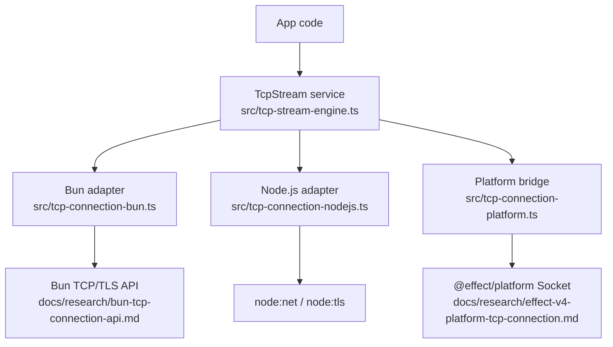
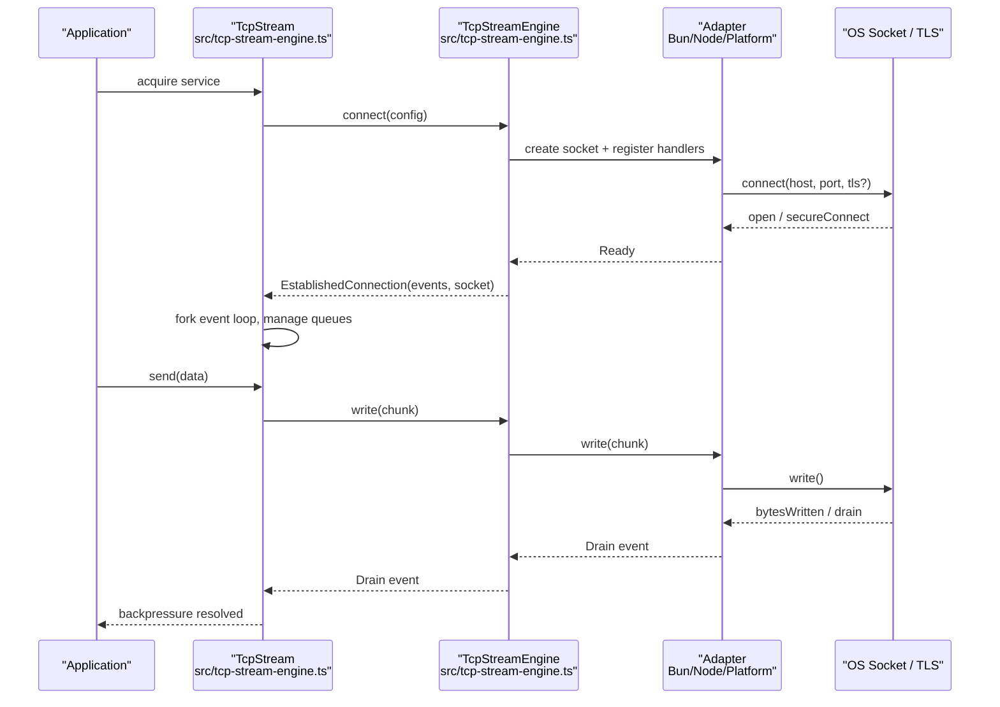
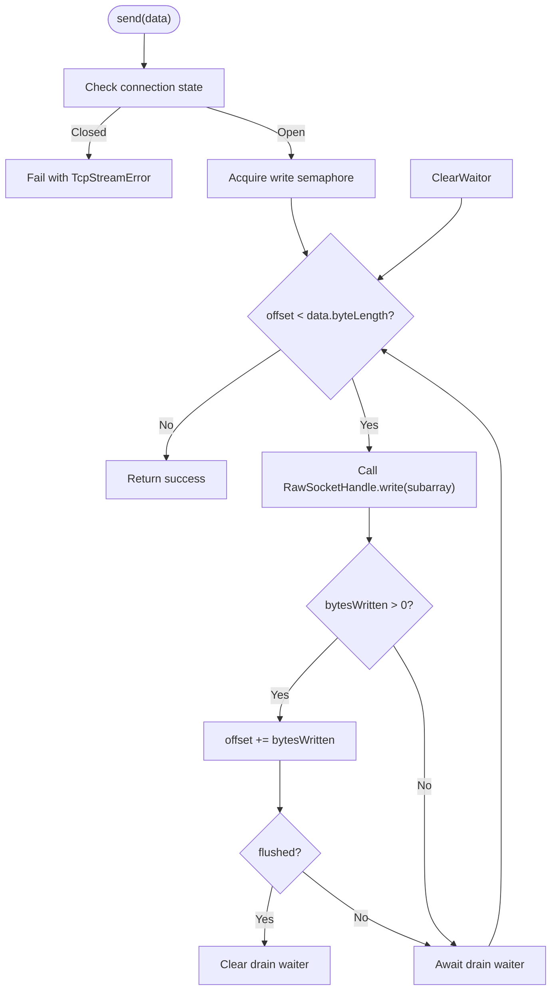
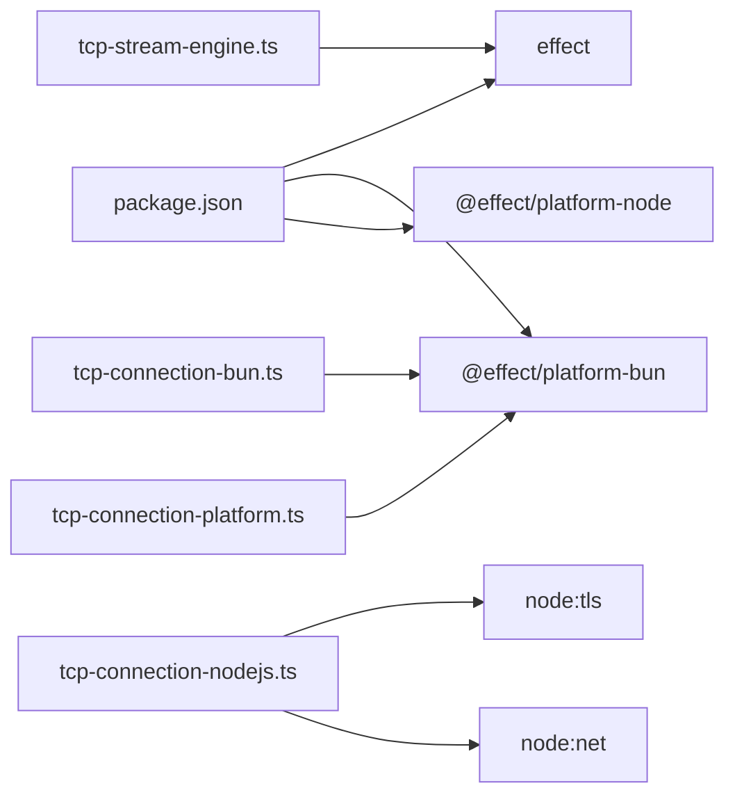

# Advanced Topics

<cite>
**Referenced Files in This Document**
- [package.json](file://package.json)
- [src/index.ts](file://src/index.ts)
- [src/tcp-stream-engine.ts](file://src/tcp-stream-engine.ts)
- [src/tcp-connection-common.ts](file://src/tcp-connection-common.ts)
- [src/tcp-connection-bun.ts](file://src/tcp-connection-bun.ts)
- [src/tcp-connection-nodejs.ts](file://src/tcp-connection-nodejs.ts)
- [src/tcp-connection-platform.ts](file://src/tcp-connection-platform.ts)
- [docs/research/bun-tcp-connection-api.md](file://docs/research/bun-tcp-connection-api.md)
- [docs/research/effect-v4-platform-tcp-connection.md](file://docs/research/effect-v4-platform-tcp-connection.md)
</cite>

## Table of Contents
1. Introduction
2. Project Structure
3. Core Components
4. Architecture Overview
5. Detailed Component Analysis
6. Dependency Analysis
7. Performance Considerations
8. Security Considerations
9. Troubleshooting and Debugging
10. Migration Guide
11. Advanced Integration Patterns
12. Contributing and Extending
13. Conclusion

## Introduction
This document provides advanced guidance for operating, optimizing, securing, and extending the TCP streaming layer implemented in this repository. It focuses on performance tuning (connection pooling, buffer management, memory optimization), security considerations for TCP connections (TLS configuration, input validation, attack prevention), troubleshooting complex network issues, migration strategies across versions and platforms, and advanced integration patterns with Effect v4 and other libraries.

## Project Structure
The project implements a platform-agnostic TCP stream abstraction over Effect services, with concrete adapters for Bun and Node.js, plus a shared platform adapter that bridges to @effect/platform sockets. Key modules:
- Engine and stream orchestration: src/tcp-stream-engine.ts
- Shared types, errors, config, retry policy: src/tcp-connection-common.ts
- Platform adapters:
  - Bun native: src/tcp-connection-bun.ts
  - Node.js native: src/tcp-connection-nodejs.ts
  - Platform bridge via @effect/platform: src/tcp-connection-platform.ts
- Research and API references: docs/research/*

**Diagram sources**
- [src/tcp-stream-engine.ts:89-177](file://src/tcp-stream-engine.ts#L89-L177)
- [src/tcp-connection-bun.ts:18-135](file://src/tcp-connection-bun.ts#L18-L135)
- [src/tcp-connection-nodejs.ts:21-114](file://src/tcp-connection-nodejs.ts#L21-L114)
- [src/tcp-connection-platform.ts:17-128](file://src/tcp-connection-platform.ts#L17-L128)
- [docs/research/effect-v4-platform-tcp-connection.md:240-336](file://docs/research/effect-v4-platform-tcp-connection.md#L240-L336)
- [docs/research/bun-tcp-connection-api.md:146-228](file://docs/research/bun-tcp-connection-api.md#L146-L228)

**Section sources**
- [package.json:1-33](file://package.json#L1-L33)
- [src/index.ts:1-6](file://src/index.ts#L1-L6)

## Core Components
- TcpStreamEngine: Central orchestrator that connects to a remote host, manages lifecycle, backpressure, retries, timeouts, and exposes an events stream and a write handle.
- TcpStream: High-level service exposing a pull-based incoming Stream, send/sendText, and close, with built-in retry scheduling and scoped cleanup.
- Adapters:
  - Bun: Direct use of Bun.connect with explicit drain handling and flush semantics.
  - Node.js: Uses node:net and node:tls with event-driven data/drain/close/error.
  - Platform: Bridges to @effect/platform’s push-based Socket model via BunSocket/NodeSocket and fromDuplex.

Key responsibilities:
- Connection readiness handshake and error signaling.
- Backpressure-aware writes using semaphores and drain waiters.
- Unified error mapping into domain TcpStreamError.
- Configurable connect timeout and retry policies.

**Section sources**
- [src/tcp-stream-engine.ts:28-75](file://src/tcp-stream-engine.ts#L28-L75)
- [src/tcp-stream-engine.ts:89-177](file://src/tcp-stream-engine.ts#L89-L177)
- [src/tcp-stream-engine.ts:201-339](file://src/tcp-stream-engine.ts#L201-L339)
- [src/tcp-connection-common.ts:12-101](file://src/tcp-connection-common.ts#L12-L101)

## Architecture Overview
The system composes a layered architecture:
- Application uses TcpStream as a service.
- TcpStream delegates to TcpStreamEngine for connection management.
- Concrete adapters implement RawSocketHandle and emit standardized events.
- The platform adapter integrates with Effect v4’s Socket abstraction for portability.

**Diagram sources**
- [src/tcp-stream-engine.ts:89-177](file://src/tcp-stream-engine.ts#L89-L177)
- [src/tcp-stream-engine.ts:201-339](file://src/tcp-stream-engine.ts#L201-L339)
- [src/tcp-connection-bun.ts:18-135](file://src/tcp-connection-bun.ts#L18-L135)
- [src/tcp-connection-nodejs.ts:21-114](file://src/tcp-connection-nodejs.ts#L21-L114)
- [src/tcp-connection-platform.ts:17-128](file://src/tcp-connection-platform.ts#L17-L128)

## Detailed Component Analysis

### TcpStreamEngine and TcpStream
- Connects with configurable timeout and retry schedule.
- Bridges adapter events into an unbounded queue consumed by Stream.fromQueue.
- Enforces single-writer concurrency via Semaphore and coordinates drain waits with Deferred.
- Provides clean shutdown and error propagation through Effect streams.

**Diagram sources**
- [src/tcp-stream-engine.ts:300-332](file://src/tcp-stream-engine.ts#L300-L332)

**Section sources**
- [src/tcp-stream-engine.ts:89-177](file://src/tcp-stream-engine.ts#L89-L177)
- [src/tcp-stream-engine.ts:201-339](file://src/tcp-stream-engine.ts#L201-L339)

### Bun Adapter
- Uses Bun.connect with binaryType set to uint8array.
- Emits Data, Drain, Close, Error events; handles connectError and termination paths.
- Writes via socket.write() and flushes explicitly; maps partial writes to flushed flag.

**Section sources**
- [src/tcp-connection-bun.ts:18-135](file://src/tcp-connection-bun.ts#L18-L135)
- [docs/research/bun-tcp-connection-api.md:146-228](file://docs/research/bun-tcp-connection-api.md#L146-L228)

### Node.js Adapter
- Uses node:net and node:tls; listens for data, drain, close, error, and secureConnect/connect.
- Encodes string chunks to Uint8Array when necessary.
- Maps write failures to TcpStreamError.

**Section sources**
- [src/tcp-connection-nodejs.ts:21-114](file://src/tcp-connection-nodejs.ts#L21-L114)

### Platform Bridge (@effect/platform)
- Wraps Node/Bun sockets via BunSocket/NodeSocket and fromDuplex.
- Establishes a push-based run loop and writer effect, bridging to the engine’s event model.
- Supports TLS via tls.connect wrapped in a duplex stream.

**Section sources**
- [src/tcp-connection-platform.ts:17-128](file://src/tcp-connection-platform.ts#L17-L128)
- [docs/research/effect-v4-platform-tcp-connection.md:240-336](file://docs/research/effect-v4-platform-tcp-connection.md#L240-L336)

## Dependency Analysis
- Dependencies are declared in package.json and include Effect v4 runtime and platform packages for Bun and Node.
- The engine depends on Effect primitives (Effect, Scope, Queue, Stream, Deferred, Layer).
- Adapters depend on platform-specific networking APIs (Bun, node:net, node:tls, @effect/platform-bun).

**Diagram sources**
- [package.json:23-28](file://package.json#L23-L28)
- [src/tcp-stream-engine.ts:1-14](file://src/tcp-stream-engine.ts#L1-L14)
- [src/tcp-connection-bun.ts:1-16](file://src/tcp-connection-bun.ts#L1-L16)
- [src/tcp-connection-nodejs.ts:1-18](file://src/tcp-connection-nodejs.ts#L1-L18)
- [src/tcp-connection-platform.ts:1-15](file://src/tcp-connection-platform.ts#L1-L15)

**Section sources**
- [package.json:1-33](file://package.json#L1-L33)

## Performance Considerations
- Connection pooling:
  - Reuse a single TcpStream per logical session where possible; avoid frequent connect/disconnect cycles.
  - Use retry schedules for transient failures to reduce churn and improve throughput under load.
- Buffer management:
  - Prefer Uint8Array and binaryType "uint8array" to minimize copies.
  - Respect backpressure: do not ignore partial writes; rely on drain events to resume sending.
  - For high-throughput producers, batch messages and flush strategically to reduce syscall overhead.
- Memory optimization:
  - Avoid storing large payloads in socket.data or long-lived closures; release references on close.
  - Use lowMemoryMode in TLS options when supported to reduce OpenSSL buffer retention at minor throughput cost.
- I/O tuning:
  - Disable Nagle (TCP_NODELAY) for latency-sensitive protocols.
  - Configure keep-alive probes to detect dead peers early.
  - Set appropriate connectTimeout to fail fast and free resources.

[No sources needed since this section provides general guidance]

## Security Considerations
- TLS configuration:
  - Provide explicit CA bundles when replacing default trust stores.
  - Use rejectUnauthorized appropriately; disable only for local self-signed testing.
  - Enable ALPN negotiation for HTTP/2 or application-layer protocol selection.
  - Consider requestCert for mutual TLS scenarios.
- Input validation:
  - Validate host and port before connecting; enforce non-empty host and valid port range.
  - Apply size limits and framing rules to prevent oversized payloads.
- Attack prevention:
  - Limit concurrent connections and apply rate limiting at the application layer.
  - Use timeouts to mitigate slowloris-style attacks.
  - Sanitize and validate all inbound data before processing or forwarding.
- Secure defaults:
  - Prefer TLS for all external communications.
  - Restrict cipher suites and enforce minimum TLS versions where applicable.

**Section sources**
- [docs/research/bun-tcp-connection-api.md:231-294](file://docs/research/bun-tcp-connection-api.md#L231-L294)
- [src/tcp-connection-common.ts:65-88](file://src/tcp-connection-common.ts#L65-L88)

## Troubleshooting and Debugging
Common symptoms and diagnostics:
- Partial writes and stalls:
  - Symptom: send hangs or data loss under load.
  - Cause: ignoring return value of socket.write and missing drain events.
  - Fix: track bytesWritten, enqueue remaining slices, await drain before resuming.
- Unexpected closes:
  - Symptom: stream ends prematurely.
  - Cause: peer FIN or network reset; ensure proper half-close handling if required by protocol.
  - Fix: inspect close events and distinguish clean vs abnormal closes.
- TLS handshake failures:
  - Symptom: connection fails during secureConnect/open.
  - Cause: certificate verification errors or misconfigured CA/serverName.
  - Fix: verify CA chain, serverName, and rejectUnauthorized settings; inspect handshake events.
- Timeouts and retries:
  - Symptom: intermittent connectivity issues.
  - Cause: network blips or overloaded servers.
  - Fix: configure connectTimeout and retry schedules; log attempts and outcomes.

Debugging strategies:
- Instrument events: log Data, Drain, Close, Error transitions with timestamps.
- Capture minimal reproducible traces: record payloads and sequence of events for replay.
- Use property-based tests to stress backpressure and error paths.
- Isolate components: test adapters independently with mock sockets.

**Section sources**
- [docs/research/bun-tcp-connection-api.md:111-142](file://docs/research/bun-tcp-connection-api.md#L111-L142)
- [docs/research/bun-tcp-connection-api.md:146-228](file://docs/research/bun-tcp-connection-api.md#L146-L228)
- [src/tcp-stream-engine.ts:106-177](file://src/tcp-stream-engine.ts#L106-L177)
- [src/tcp-stream-engine.ts:261-294](file://src/tcp-stream-engine.ts#L261-L294)

## Migration Guide
- From custom Bun.connect wrapper to @effect/platform:
  - Replace direct Bun.connect usage with BunSocket.makeNet or fromDuplex for TLS.
  - Convert event-driven logic to push-based run loops and writer effects.
  - Leverage Channel.toChannel for bidirectional streaming pipelines.
- Upgrading Effect versions:
  - Align with Effect v4 unstable socket APIs; review error hierarchy changes (SocketError variants).
  - Update layers and scopes to match new lifetime semantics.
- Platform switching:
  - When moving between Bun and Node.js adapters, ensure consistent backpressure handling and TLS options.
  - Validate behavior differences in write buffering and drain semantics.

**Section sources**
- [docs/research/effect-v4-platform-tcp-connection.md:422-461](file://docs/research/effect-v4-platform-tcp-connection.md#L422-L461)
- [docs/research/effect-v4-platform-tcp-connection.md:184-229](file://docs/research/effect-v4-platform-tcp-connection.md#L184-L229)
- [src/tcp-connection-platform.ts:17-128](file://src/tcp-connection-platform.ts#L17-L128)

## Advanced Integration Patterns
- Compose with Effect Streams:
  - Use Stream.splitOn or custom decoders to frame messages over TcpStream.stream.
  - Pipe encoded text via Stream.encodeText and fold into byte chunks.
- Bidirectional channels:
  - Convert Socket to Channel for structured request/response flows.
  - Combine with RPC clients or message brokers via Channels.
- Resilience patterns:
  - Wrap connections with Effect.retry and exponential backoff.
  - Implement circuit breakers around upstream services using Effect’s scheduling primitives.
- Multi-protocol support:
  - Use ALPN to negotiate protocols over TLS.
  - Upgrade plaintext connections to TLS dynamically when supported by the platform.

**Section sources**
- [docs/research/effect-v4-platform-tcp-connection.md:127-181](file://docs/research/effect-v4-platform-tcp-connection.md#L127-L181)
- [docs/research/bun-tcp-connection-api.md:255-294](file://docs/research/bun-tcp-connection-api.md#L255-L294)

## Contributing and Extending
- Adding a new adapter:
  - Implement the ColdAdapter signature and emit standardized events (Ready, Data, Drain, Close, Error).
  - Map platform-specific errors to TcpStreamError with operation tags.
  - Provide a convenience layer via makeConvenienceLayer.
- Testing:
  - Write integration tests against real or mocked sockets.
  - Stress backpressure and error paths with property-based tests.
- Documentation:
  - Keep research notes updated when APIs evolve.
  - Record decisions and trade-offs in ADRs.

**Section sources**
- [src/tcp-stream-engine.ts:76-79](file://src/tcp-stream-engine.ts#L76-L79)
- [src/tcp-stream-engine.ts:341-359](file://src/tcp-stream-engine.ts#L341-L359)

## Conclusion
This repository provides a robust, extensible TCP streaming layer built on Effect v4 with platform-specific adapters. By following the performance, security, and troubleshooting guidance here, you can build resilient, efficient, and secure networked applications. Use the migration and integration sections to adopt platform abstractions and compose advanced streaming pipelines.

[No sources needed since this section summarizes without analyzing specific files]