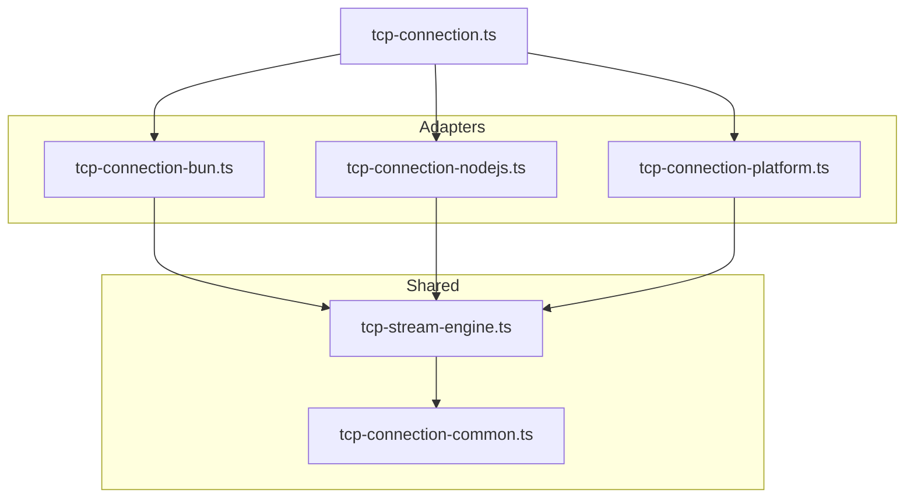
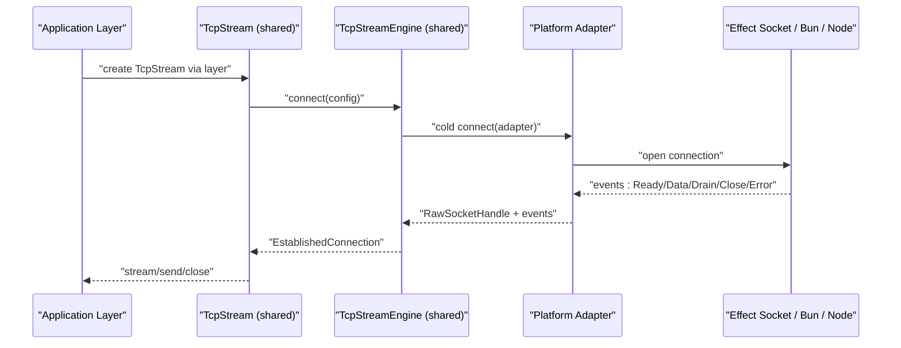
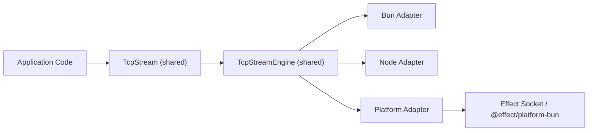

# Migration and Upgrade Guide

<cite>
**Referenced Files in This Document**
- [package.json](file://package.json)
- [effect-v3-vs-v4-differences.md](file://docs/research/effect-v3-vs-v4-differences.md)
- [effect-v4-platform-tcp-connection.md](file://docs/research/effect-v4-platform-tcp-connection.md)
- [bun-tcp-connection-api.md](file://docs/research/bun-tcp-connection-api.md)
- [0002-unified-tcp-stream-engine-adapter-seam.md](file://docs/adr/0002-unified-tcp-stream-engine-adapter-seam.md)
- [0005-unified-platform-socket-engine-adapter-and-test-suite.md](file://docs/adr/0005-unified-platform-socket-engine-adapter-and-test-suite.md)
- [0006-scope-owned-platform-engine-lifecycle.md](file://docs/adr/0006-scope-owned-platform-engine-lifecycle.md)
- [tcp-connection.ts](file://src/tcp-connection.ts)
- [tcp-connection-bun.ts](file://src/tcp-connection-bun.ts)
- [tcp-connection-nodejs.ts](file://src/tcp-connection-nodejs.ts)
- [tcp-connection-platform.ts](file://src/tcp-connection-platform.ts)
- [tcp-stream-engine.ts](file://src/tcp-stream-engine.ts)
- [tcp-connection-common.ts](file://src/tcp-connection-common.ts)
</cite>

## Table of Contents
1. [Introduction](#introduction)
2. [Project Structure](#project-structure)
3. [Core Components](#core-components)
4. [Architecture Overview](#architecture-overview)
5. [Detailed Component Analysis](#detailed-component-analysis)
6. [Dependency Analysis](#dependency-analysis)
7. [Performance Considerations](#performance-considerations)
8. [Troubleshooting Guide](#troubleshooting-guide)
9. [Conclusion](#conclusion)
10. [Appendices](#appendices)

## Introduction
This guide documents how to migrate between Effect v3 and v4, and how to upgrade from custom Bun TCP implementations to the unified platform approach used in this repository. It covers breaking changes, behavioral differences, deprecated features, compatibility matrices, dependency updates, automated migration strategies, manual refactoring steps, common pitfalls, and rollback strategies.

The repository provides:
- A shared TCP stream orchestrator that is runtime-agnostic.
- Three engine adapters: Bun native sockets, Node.js `net`/`tls`, and the unified Effect v4 platform socket abstraction.
- Research and architectural decision records explaining why and how these abstractions were introduced.

## Project Structure
At a high level, the project separates concerns into:
- Shared contracts and orchestration logic under `src/tcp-connection-common.ts` and `src/tcp-stream-engine.ts`.
- Platform-specific adapters under `src/tcp-connection-bun.ts`, `src/tcp-connection-nodejs.ts`, and `src/tcp-connection-platform.ts`.
- A backward-compatible re-export entry point at `src/tcp-connection.ts`.
- Documentation and research notes under `docs/`.

**Diagram sources**
- [tcp-connection.ts:1-10](file://src/tcp-connection.ts#L1-L10)
- [tcp-connection-bun.ts:1-145](file://src/tcp-connection-bun.ts#L1-L145)
- [tcp-connection-nodejs.ts:1-132](file://src/tcp-connection-nodejs.ts#L1-L132)
- [tcp-connection-platform.ts:1-135](file://src/tcp-connection-platform.ts#L1-L135)
- [tcp-stream-engine.ts:1-359](file://src/tcp-stream-engine.ts#L1-L359)
- [tcp-connection-common.ts:1-101](file://src/tcp-connection-common.ts#L1-L101)

**Section sources**
- [tcp-connection.ts:1-10](file://src/tcp-connection.ts#L1-L10)
- [0002-unified-tcp-stream-engine-adapter-seam.md:1-48](file://docs/adr/0002-unified-tcp-stream-engine-adapter-seam.md#L1-L48)

## Core Components
- Shared error and configuration model:
  - `TcpStreamError`, `ConnectionConfig`, validation helpers, retry schedule builder.
- Unified engine seam:
  - `TcpStreamEngineShape.connect` returns an established connection with a scoped lifecycle.
  - `makeTcpStreamEngine` builds the public caller-first engine from a cold adapter protocol.
  - `makeTcpStream` composes retry, backpressure, drain handling, and stream framing.
- Platform adapters:
  - Bun: direct `Bun.connect` mapping.
  - Node.js: `node:net`/`node:tls` mapping.
  - Platform: wraps `@effect/platform-bun` / `effect/unstable/socket/Socket` for a unified push-based API.

Key responsibilities:
- Adapters translate platform events into the shared engine event contract.
- The shared engine owns queueing, retries, timeouts, and stream composition.
- Convenience layers provide ergonomic layer factories per platform.

**Section sources**
- [tcp-connection-common.ts:12-101](file://src/tcp-connection-common.ts#L12-L101)
- [tcp-stream-engine.ts:28-79](file://src/tcp-stream-engine.ts#L28-L79)
- [tcp-stream-engine.ts:88-178](file://src/tcp-stream-engine.ts#L88-L178)
- [tcp-stream-engine.ts:201-341](file://src/tcp-stream-engine.ts#L201-L341)
- [0005-unified-platform-socket-engine-adapter-and-test-suite.md:22-45](file://docs/adr/0005-unified-platform-socket-engine-adapter-and-test-suite.md#L22-L45)

## Architecture Overview
The migration path moves from custom Bun TCP wrappers to a unified platform abstraction while preserving existing APIs through layered adapters.

**Diagram sources**
- [tcp-stream-engine.ts:88-178](file://src/tcp-stream-engine.ts#L88-L178)
- [tcp-connection-platform.ts:17-49](file://src/tcp-connection-platform.ts#L17-L49)
- [tcp-connection-bun.ts:18-131](file://src/tcp-connection-bun.ts#L18-L131)
- [tcp-connection-nodejs.ts:21-112](file://src/tcp-connection-nodejs.ts#L21-L112)

## Detailed Component Analysis

### Breaking Changes Between Effect v3 and v4
- Error handling combinators:
  - `Effect.catchAll` → `Effect.catch`
  - `Effect.catchAllDefect` → `Effect.catchDefect`
  - `Effect.catchAllCause` → `Effect.catchCause`
  - `Effect.catchSome` → `Effect.catchIf` / `Effect.catchSome`
  - Tagged catch combinators remain but are aligned with new naming conventions.
- Structured concurrency:
  - `Effect.fork` → `Effect.forkChild`
  - `Effect.forkDaemon` → `Effect.forkDetach`
  - `Effect.forkScoped` / `Effect.forkIn` unchanged.
- Layer and scope management:
  - `Layer.scoped` removed; `Layer.effect` natively manages `Scope`.
  - Prefer merging dependent layers before providing them to programs.
- Error modeling:
  - Prefer `Schema.TaggedError` over legacy patterns for richer schema integration.
- Platform runners:
  - Use `@effect/platform-bun` and `@effect/platform-node` with dedicated runMain functions.

Migration tips:
- Replace catch-all variants with their v4 names.
- Replace fork calls with explicit child or detach semantics.
- Remove `Layer.scoped` usage; rely on `Layer.effect` scoping.
- Adopt `Context.Service` class-based service definitions where appropriate.
- Use platform runner packages for application bootstrap.

**Section sources**
- [effect-v3-vs-v4-differences.md:9-19](file://docs/research/effect-v3-vs-v4-differences.md#L9-L19)
- [effect-v3-vs-v4-differences.md:23-32](file://docs/research/effect-v3-vs-v4-differences.md#L23-L32)
- [effect-v3-vs-v4-differences.md:36-44](file://docs/research/effect-v3-vs-v4-differences.md#L36-L44)
- [effect-v3-vs-v4-differences.md:48-55](file://docs/research/effect-v3-vs-v4-differences.md#L48-L55)
- [effect-v3-vs-v4-differences.md:59-66](file://docs/research/effect-v3-vs-v4-differences.md#L59-L66)

### Upgrading From Custom Bun TCP to the Unified Platform Approach
Goal: Replace custom Bun-only TCP code with the unified platform socket abstraction while keeping your application’s external API stable.

Recommended steps:
1. Identify current usage of custom Bun TCP wrappers.
   - Look for imports from the repository’s Bun adapter or direct usage of `Bun.connect`/`Bun.listen`.
2. Introduce the platform adapter layer.
   - Use `TcpStreamPlatformLive` or the convenience layer factory to provide a `TcpStream` backed by the Effect v4 platform socket abstraction.
3. Update dependencies.
   - Ensure you are using Effect v4 and platform packages as specified in the project’s dependency manifest.
4. Validate behavior.
   - Run the parameterized test suite against all engines to confirm connectivity, retries, backpressure, and teardown.
5. Decommission custom Bun-only code.
   - Keep the backward-compatible re-export only if needed during transition; prefer explicit platform imports.

Compatibility matrix:
- Bun native adapter (`tcp-connection-bun.ts`): Uses `Bun.connect` directly.
- Node.js adapter (`tcp-connection-nodejs.ts`): Uses `node:net`/`node:tls`.
- Platform adapter (`tcp-connection-platform.ts`): Uses `@effect/platform-bun` and `effect/unstable/socket/Socket`.

Behavioral differences to consider:
- Backpressure:
  - Bun native: non-blocking writes require handling partial writes and draining.
  - Platform: uses Node stream callbacks and internal synchronization.
- Event model:
  - Custom Bun wrapper: pull-based streams with explicit queues.
  - Platform: push-based execution loop with optional channel conversion.

Automated migration aids:
- Use the shared `makeConvenienceLayer` to generate consistent layers across platforms.
- Use the parameterized test suite to validate behavior uniformly across Bun, Node.js, and Platform adapters.

Manual refactoring checklist:
- Replace direct `Bun.connect` usage with the platform adapter.
- Replace custom retry/backpressure loops with the shared engine’s retry and drain handling.
- Align error handling with v4 combinators and error models.
- Update top-level runners to use platform-specific `runMain`.

Rollback strategy:
- Keep the Bun adapter available during transition via the backward-compatible re-export.
- Maintain feature flags or environment-driven layer selection so you can switch back to Bun-native behavior if issues arise.

**Section sources**
- [0002-unified-tcp-stream-engine-adapter-seam.md:1-48](file://docs/adr/0002-unified-tcp-stream-engine-adapter-seam.md#L1-L48)
- [0005-unified-platform-socket-engine-adapter-and-test-suite.md:22-45](file://docs/adr/0005-unified-platform-socket-engine-adapter-and-test-suite.md#L22-L45)
- [tcp-connection.ts:1-10](file://src/tcp-connection.ts#L1-L10)
- [tcp-connection-platform.ts:1-135](file://src/tcp-connection-platform.ts#L1-L135)
- [tcp-connection-bun.ts:1-145](file://src/tcp-connection-bun.ts#L1-L145)
- [tcp-connection-nodejs.ts:1-132](file://src/tcp-connection-nodejs.ts#L1-L132)

### Dependency Updates and Version Requirements
Current project dependencies indicate:
- `effect`: 4.0.0-rc.109
- `@effect/platform-bun`: 4.0.0-rc.111
- `@effect/platform-node`: 4.0.0-rc.111

Upgrade guidance:
- Pin compatible versions of `effect` and platform packages together.
- Avoid mixing v3 and v4 packages; ensure all networking-related modules target v4.
- If upgrading beyond release candidates, verify changelogs for breaking changes in the socket and platform APIs.

**Section sources**
- [package.json:23-28](file://package.json#L23-L28)

### Automated Migration Tools and Scripts
While no dedicated migration script exists in this repository, you can automate parts of the migration:
- Search and replace:
  - Replace `Effect.catchAll*` with v4 equivalents.
  - Replace `Effect.fork`/`Effect.forkDaemon` with `Effect.forkChild`/`Effect.forkDetach`.
  - Replace `Layer.scoped` with `Layer.effect` where applicable.
- Layer normalization:
  - Use `makeConvenienceLayer` to standardize layer creation across platforms.
- Test coverage:
  - Run the parameterized test suite against all adapters to detect regressions early.

Manual refactoring steps:
- Normalize imports to use platform-specific adapters explicitly.
- Replace custom retry/backpressure logic with the shared engine’s built-in capabilities.
- Update error types to align with v4 error modeling where feasible.

**Section sources**
- [effect-v3-vs-v4-differences.md:9-19](file://docs/research/effect-v3-vs-v4-differences.md#L9-L19)
- [effect-v3-vs-v4-differences.md:23-32](file://docs/research/effect-v3-vs-v4-differences.md#L23-L32)
- [effect-v3-vs-v4-differences.md:36-44](file://docs/research/effect-v3-vs-v4-differences.md#L36-L44)
- [0005-unified-platform-socket-engine-adapter-and-test-suite.md:44-61](file://docs/adr/0005-unified-platform-socket-engine-adapter-and-test-suite.md#L44-L61)

### Manual Refactoring Steps
- Step 1: Audit imports and usage of Bun-specific TCP primitives.
- Step 2: Introduce the platform adapter layer and configure it via layers.
- Step 3: Replace custom retry/backpressure loops with the shared engine’s retry and drain handling.
- Step 4: Update error handling to v4 combinators and error models.
- Step 5: Update application bootstrap to use platform runners.
- Step 6: Validate with tests and gradually remove legacy Bun-only code.

**Section sources**
- [tcp-stream-engine.ts:201-341](file://src/tcp-stream-engine.ts#L201-L341)
- [tcp-connection-platform.ts:17-49](file://src/tcp-connection-platform.ts#L17-L49)

### Common Migration Pitfalls
- Forgetting to update fork semantics:
  - Using `Effect.fork` instead of `Effect.forkChild` can lead to unintended detached fibers.
- Misusing `Layer.scoped`:
  - Relying on removed `Layer.scoped` will break; use `Layer.effect` instead.
- Ignoring backpressure differences:
  - Assuming Bun native writes behave like Node streams can cause data loss or memory pressure.
- Not closing scopes properly:
  - Failing to close the child scope in the platform adapter can leak resources.
- Mixing v3 and v4 packages:
  - Inconsistent versions can cause type errors and runtime failures.

Mitigations:
- Use the parameterized test suite to catch behavioral regressions.
- Prefer explicit scope management and structured concurrency patterns.
- Validate TLS and connection options across platforms.

**Section sources**
- [effect-v3-vs-v4-differences.md:23-32](file://docs/research/effect-v3-vs-v4-differences.md#L23-L32)
- [effect-v3-vs-v4-differences.md:36-44](file://docs/research/effect-v3-vs-v4-differences.md#L36-L44)
- [bun-tcp-connection-api.md:146-229](file://docs/research/bun-tcp-connection-api.md#L146-L229)
- [0006-scope-owned-platform-engine-lifecycle.md:24-69](file://docs/adr/0006-scope-owned-platform-engine-lifecycle.md#L24-L69)

### Rollback Strategies for Failed Upgrades
- Keep the Bun adapter available via the backward-compatible re-export.
- Use environment variables or configuration to select the active adapter at runtime.
- Maintain parallel test suites until confidence is achieved.
- Gradually roll out changes using feature flags and staged deployments.

**Section sources**
- [tcp-connection.ts:1-10](file://src/tcp-connection.ts#L1-L10)
- [0002-unified-tcp-stream-engine-adapter-seam.md:28-43](file://docs/adr/0002-unified-tcp-stream-engine-adapter-seam.md#L28-L43)

## Dependency Analysis
The repository’s dependency graph centers around the shared engine and its adapters.

**Diagram sources**
- [tcp-stream-engine.ts:88-178](file://src/tcp-stream-engine.ts#L88-L178)
- [tcp-connection-platform.ts:1-135](file://src/tcp-connection-platform.ts#L1-L135)
- [tcp-connection-bun.ts:1-145](file://src/tcp-connection-bun.ts#L1-L145)
- [tcp-connection-nodejs.ts:1-132](file://src/tcp-connection-nodejs.ts#L1-L132)

**Section sources**
- [tcp-stream-engine.ts:88-178](file://src/tcp-stream-engine.ts#L88-L178)
- [tcp-connection-platform.ts:1-135](file://src/tcp-connection-platform.ts#L1-L135)

## Performance Considerations
- Backpressure handling:
  - Bun native writes require careful handling of partial writes and drain events.
  - Platform adapter relies on Node stream callbacks and internal synchronization.
- Memory allocation:
  - Custom Bun wrapper routes incoming chunks through an unbounded queue; platform adapter minimizes intermediate allocations by executing handlers directly.
- Framing and protocol layering:
  - Platform adapter integrates cleanly with higher-level protocols consuming `Socket` or `Channel`.
- Retry and timeout:
  - Shared engine centralizes retry schedules and timeouts, reducing duplication and improving consistency.

[No sources needed since this section provides general guidance]

## Troubleshooting Guide
Common issues and resolutions:
- Connection hangs during retry backoff:
  - Ensure `Effect.acquireRelease` is configured with `{ interruptible: true }` to avoid blocking during backoff.
- Unexpected resource leaks:
  - Verify that the platform adapter closes the child scope on failure and that `close()` is idempotent.
- Data loss on write:
  - Confirm proper handling of partial writes and drain events when using Bun native sockets.
- Error propagation:
  - Wrap platform-specific errors in `TcpStreamError` with operation context for clearer diagnostics.

Validation checklist:
- Exhausting configured retry attempts on unreachable ports.
- Immediate failure when `retry: false`.
- Custom `Schedule` policies.
- Server availability during retry backoff window.
- Binary data transmission and graceful teardown.
- Composable layer provision via `TcpStreamLayer` and engine layers.

**Section sources**
- [0006-scope-owned-platform-engine-lifecycle.md:48-69](file://docs/adr/0006-scope-owned-platform-engine-lifecycle.md#L48-L69)
- [tcp-stream-engine.ts:180-195](file://src/tcp-stream-engine.ts#L180-L195)
- [tcp-stream-engine.ts:252-260](file://src/tcp-stream-engine.ts#L252-L260)
- [0005-unified-platform-socket-engine-adapter-and-test-suite.md:53-61](file://docs/adr/0005-unified-platform-socket-engine-adapter-and-test-suite.md#L53-L61)

## Conclusion
Migrating from Effect v3 to v4 and from custom Bun TCP implementations to the unified platform approach requires updating concurrency, error handling, layer scoping, and platform runners. The repository’s shared engine and adapters provide a robust foundation for multi-runtime TCP connections with consistent behavior, improved resource safety, and reduced duplication. By following the step-by-step migration guide, leveraging automated search-and-replace patterns, and validating with the parameterized test suite, teams can perform safe upgrades with clear rollback paths.

[No sources needed since this section summarizes without analyzing specific files]

## Appendices

### Compatibility Matrix
- Effect v3 vs v4:
  - Catch combinators renamed.
  - Fork semantics clarified.
  - Layer.scoped removed; Layer.effect handles scoping.
  - Error modeling integrated with Schema.
  - Platform runners standardized.
- Runtime adapters:
  - Bun native: direct `Bun.connect`.
  - Node.js: `node:net`/`node:tls`.
  - Platform: unified `@effect/platform-bun` and `effect/unstable/socket/Socket`.

**Section sources**
- [effect-v3-vs-v4-differences.md:9-66](file://docs/research/effect-v3-vs-v4-differences.md#L9-L66)
- [effect-v4-platform-tcp-connection.md:422-463](file://docs/research/effect-v4-platform-tcp-connection.md#L422-L463)

### Version Requirements
- `effect`: 4.0.0-rc.109
- `@effect/platform-bun`: 4.0.0-rc.111
- `@effect/platform-node`: 4.0.0-rc.111

**Section sources**
- [package.json:23-28](file://package.json#L23-L28)