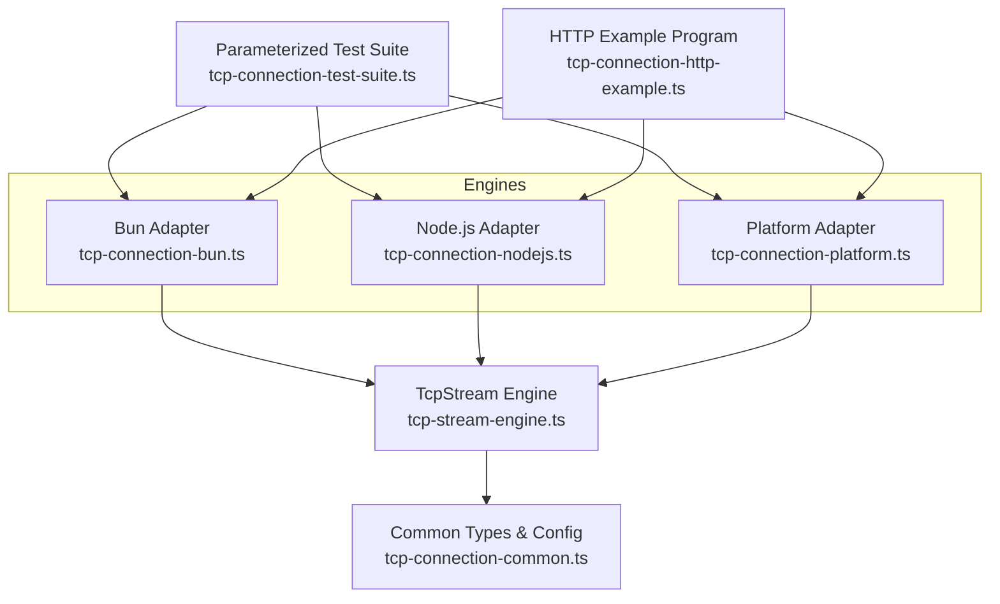
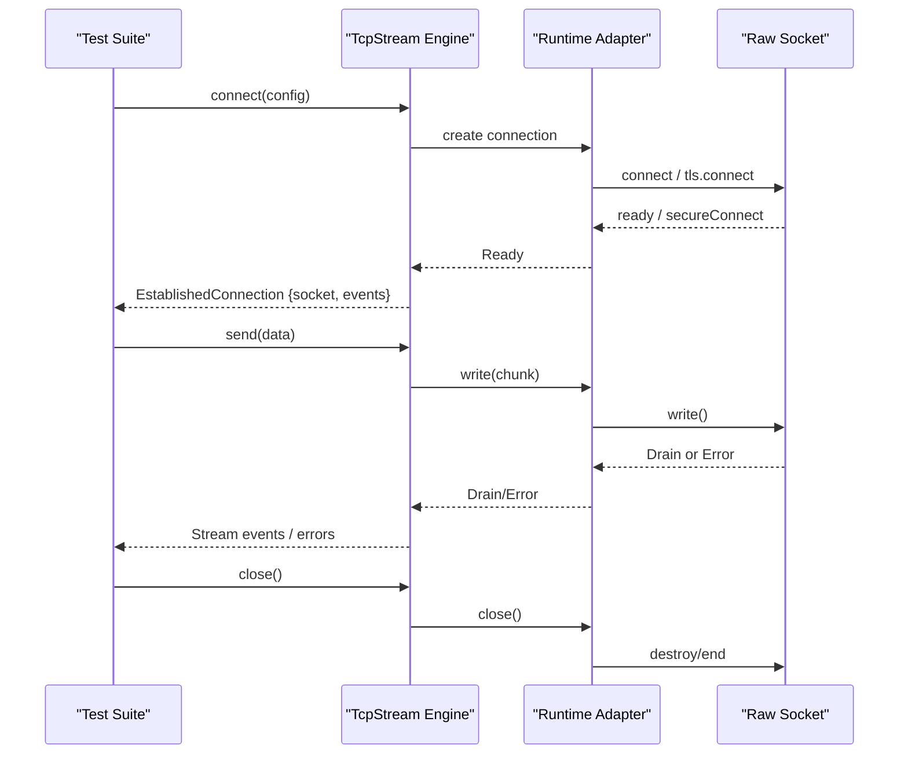
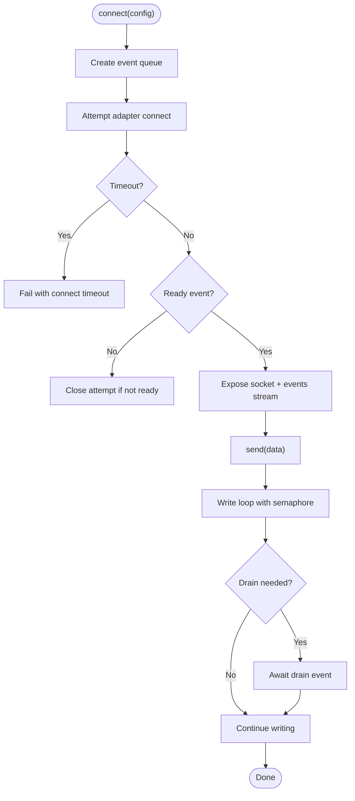
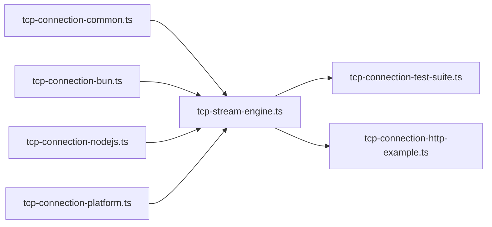

# Benchmarking and Performance Testing

<cite>
**Referenced Files in This Document**
- [tcp-connection-test-suite.ts](file://src/tcp-connection-test-suite.ts)
- [tcp-connection-bun.test.ts](file://src/tcp-connection-bun.test.ts)
- [tcp-connection-nodejs.test.ts](file://src/tcp-connection-nodejs.test.ts)
- [tcp-connection-platform.test.ts](file://src/tcp-connection-platform.test.ts)
- [tcp-connection-bun.ts](file://src/tcp-connection-bun.ts)
- [tcp-connection-nodejs.ts](file://src/tcp-connection-nodejs.ts)
- [tcp-connection-platform.ts](file://src/tcp-connection-platform.ts)
- [tcp-stream-engine.ts](file://src/tcp-stream-engine.ts)
- [tcp-connection-common.ts](file://src/tcp-connection-common.ts)
- [tcp-connection-http-example.ts](file://src/tcp-connection-http-example.ts)
- [package.json](file://package.json)
- [ci.yml](file://.github/workflows/ci.yml)
</cite>

## Table of Contents
1. Introduction
2. Project Structure
3. Core Components
4. Architecture Overview
5. Detailed Component Analysis
6. Dependency Analysis
7. Performance Considerations
8. Troubleshooting Guide
9. Conclusion
10. Appendices

## Introduction
This document provides a comprehensive benchmarking and performance testing methodology for TCP connections implemented with Effect layers across Node.js, Bun, and the Effect Platform runtime. It explains how to design meaningful benchmarks, measure throughput and latency, establish baselines, perform stress testing, plan capacity, detect regressions, and integrate automated performance checks into CI/CD. It also covers platform-specific considerations for Node.js and Bun runtimes based on the repository’s implementations and tests.

## Project Structure
The project implements a unified TCP stream abstraction over three engines:
- Bun native sockets
- Node.js net/tls
- Effect Platform socket abstractions

A shared engine orchestrator manages connection lifecycle, retries, timeouts, backpressure, and event streaming. Parameterized test suites validate behavior across engines, and an HTTP example program demonstrates end-to-end usage.

**Diagram sources**
- [tcp-connection-bun.ts:1-145](file://src/tcp-connection-bun.ts#L1-L145)
- [tcp-connection-nodejs.ts:1-132](file://src/tcp-connection-nodejs.ts#L1-L132)
- [tcp-connection-platform.ts:1-135](file://src/tcp-connection-platform.ts#L1-L135)
- [tcp-stream-engine.ts:1-359](file://src/tcp-stream-engine.ts#L1-L359)
- [tcp-connection-common.ts:1-101](file://src/tcp-connection-common.ts#L1-L101)
- [tcp-connection-test-suite.ts:1-800](file://src/tcp-connection-test-suite.ts#L1-L800)
- [tcp-connection-http-example.ts:1-301](file://src/tcp-connection-http-example.ts#L1-L301)

**Section sources**
- [tcp-connection-test-suite.ts:1-800](file://src/tcp-connection-test-suite.ts#L1-L800)
- [tcp-connection-bun.ts:1-145](file://src/tcp-connection-bun.ts#L1-L145)
- [tcp-connection-nodejs.ts:1-132](file://src/tcp-connection-nodejs.ts#L1-L132)
- [tcp-connection-platform.ts:1-135](file://src/tcp-connection-platform.ts#L1-L135)
- [tcp-stream-engine.ts:1-359](file://src/tcp-stream-engine.ts#L1-L359)
- [tcp-connection-common.ts:1-101](file://src/tcp-connection-common.ts#L1-L101)
- [tcp-connection-http-example.ts:1-301](file://src/tcp-connection-http-example.ts#L1-L301)

## Core Components
- TcpStreamEngine: Central orchestrator that connects, streams events, handles timeouts, retries, and backpressure.
- Adapters: Per-runtime implementations that bridge raw sockets to the engine’s event model.
- Common layer: Shared types, configuration validation, retry policy builder, and error definitions.
- Tests: Parameterized suite validating connectivity, retry policies, TLS behavior, graceful close, and interruption.
- HTTP example: CLI-driven program demonstrating cross-engine HTTP GET using the same TCP stack.

Key responsibilities:
- Connection lifecycle management (connect, ready, close)
- Backpressure handling via drain events and write gating
- Retry scheduling with exponential backoff and jitter
- Timeout enforcement for connect phase
- Streamed data delivery and clean termination

**Section sources**
- [tcp-stream-engine.ts:89-178](file://src/tcp-stream-engine.ts#L89-L178)
- [tcp-stream-engine.ts:201-339](file://src/tcp-stream-engine.ts#L201-L339)
- [tcp-connection-common.ts:12-101](file://src/tcp-connection-common.ts#L12-L101)
- [tcp-connection-bun.ts:18-135](file://src/tcp-connection-bun.ts#L18-L135)
- [tcp-connection-nodejs.ts:21-115](file://src/tcp-connection-nodejs.ts#L21-L115)
- [tcp-connection-platform.ts:17-121](file://src/tcp-connection-platform.ts#L17-L121)

## Architecture Overview
The architecture separates concerns between adapters and a generic engine. Each adapter wraps its runtime’s socket API and emits standardized events. The engine coordinates readiness, queues events, enforces timeouts, and exposes a stable TcpStream interface. Tests exercise all engines through a single parameterized suite, ensuring consistent behavior and enabling comparative benchmarking.

**Diagram sources**
- [tcp-stream-engine.ts:89-178](file://src/tcp-stream-engine.ts#L89-L178)
- [tcp-connection-bun.ts:57-123](file://src/tcp-connection-bun.ts#L57-L123)
- [tcp-connection-nodejs.ts:74-101](file://src/tcp-connection-nodejs.ts#L74-L101)
- [tcp-connection-platform.ts:51-119](file://src/tcp-connection-platform.ts#L51-L119)

## Detailed Component Analysis

### Engine Orchestration and Backpressure
The engine builds a connection with a bounded timeout, transitions to ready upon the first “Ready” event, and exposes a queue-backed stream for incoming data. Writes are serialized via a semaphore and respect backpressure by awaiting drain events when necessary. Errors during connect map to connect-phase errors; read-side failures propagate as read-phase errors.

**Diagram sources**
- [tcp-stream-engine.ts:89-178](file://src/tcp-stream-engine.ts#L89-L178)
- [tcp-stream-engine.ts:201-339](file://src/tcp-stream-engine.ts#L201-L339)

**Section sources**
- [tcp-stream-engine.ts:89-178](file://src/tcp-stream-engine.ts#L89-L178)
- [tcp-stream-engine.ts:201-339](file://src/tcp-stream-engine.ts#L201-L339)

### Bun Adapter
- Connects via Bun.connect with optional TLS options.
- Emits Data, Drain, Close, Error events.
- Write returns bytesWritten and flushed status; flush is explicitly invoked.
- Handles cancellation and early termination safely.

**Section sources**
- [tcp-connection-bun.ts:18-135](file://src/tcp-connection-bun.ts#L18-L135)

### Node.js Adapter
- Uses net.createConnection or tls.connect depending on config.
- Emits Data, Drain, Close, Error events.
- Write reports bytesWritten and flushed based on underlying write result.
- Ensures cleanup on error or cancellation.

**Section sources**
- [tcp-connection-nodejs.ts:21-115](file://src/tcp-connection-nodejs.ts#L21-L115)

### Platform Adapter
- Wraps @effect/platform-bun BunSocket for plain TCP and uses fromDuplex with node:tls for TLS.
- Streams data via socket.run callbacks.
- Writer-based writes report full length and flushed=true.
- Manages scoped lifecycle and teardown.

**Section sources**
- [tcp-connection-platform.ts:17-121](file://src/tcp-connection-platform.ts#L17-L121)

### Parameterized Test Suite
- Validates retry policies, immediate failure when disabled, custom schedules, recovery during backoff, binary round-trips, TLS handshake success/failure, remote close handling, graceful client close, and interruption safety.
- Provides a consistent harness to compare behaviors across engines.

**Section sources**
- [tcp-connection-test-suite.ts:213-800](file://src/tcp-connection-test-suite.ts#L213-L800)
- [tcp-connection-bun.test.ts:1-12](file://src/tcp-connection-bun.test.ts#L1-L12)
- [tcp-connection-nodejs.test.ts:1-12](file://src/tcp-connection-nodejs.test.ts#L1-L12)
- [tcp-connection-platform.test.ts:1-12](file://src/tcp-connection-platform.test.ts#L1-L12)

### HTTP Example Program
- Parses CLI arguments to select engine and URL.
- Builds ConnectionConfigShape from URL (including TLS for https).
- Executes a minimal HTTP GET request using TcpStream and collects response chunks.
- Demonstrates cross-engine usage for manual or scripted benchmarking.

**Section sources**
- [tcp-connection-http-example.ts:49-116](file://src/tcp-connection-http-example.ts#L49-L116)
- [tcp-connection-http-example.ts:152-205](file://src/tcp-connection-http-example.ts#L152-L205)
- [tcp-connection-http-example.ts:214-269](file://src/tcp-connection-http-example.ts#L214-L269)

## Dependency Analysis
- Adapters depend on their respective runtime APIs and emit standardized events consumed by the engine.
- The engine depends on common configuration and error types.
- Tests depend on the parameterized suite and each engine’s live layers.
- The HTTP example composes the engine layers and executes requests.

**Diagram sources**
- [tcp-connection-common.ts:1-101](file://src/tcp-connection-common.ts#L1-L101)
- [tcp-stream-engine.ts:1-359](file://src/tcp-stream-engine.ts#L1-L359)
- [tcp-connection-bun.ts:1-145](file://src/tcp-connection-bun.ts#L1-L145)
- [tcp-connection-nodejs.ts:1-132](file://src/tcp-connection-nodejs.ts#L1-L132)
- [tcp-connection-platform.ts:1-135](file://src/tcp-connection-platform.ts#L1-L135)
- [tcp-connection-test-suite.ts:1-800](file://src/tcp-connection-test-suite.ts#L1-L800)
- [tcp-connection-http-example.ts:1-301](file://src/tcp-connection-http-example.ts#L1-L301)

**Section sources**
- [tcp-stream-engine.ts:1-359](file://src/tcp-stream-engine.ts#L1-L359)
- [tcp-connection-common.ts:1-101](file://src/tcp-connection-common.ts#L1-L101)

## Performance Considerations
Benchmark design patterns
- Use the parameterized test suite structure to define repeatable scenarios per engine: connect-only, small message round-trip, large payload streaming, and concurrent connections.
- Measure time-to-first-byte (TTFB), end-to-end latency, throughput (bytes/sec), and resource usage (memory, CPU) for each scenario.
- Establish baselines per engine and lock dependencies to ensure reproducibility.

Load testing strategies
- Sequential load: measure latency distribution under increasing message sizes.
- Concurrent load: open multiple connections to evaluate backpressure and queue behavior.
- Mixed workload: alternate reads/writes to simulate real traffic patterns.

Performance comparison techniques
- Run identical workloads against Bun, Node.js, and Platform adapters.
- Record p50/p95/p99 latencies and throughput; compare across engines.
- Validate that retry and timeout configurations produce expected timing characteristics.

Establishing baselines
- Capture metrics from a known-good commit and store them as baselines.
- Re-run benchmarks on new commits and flag deviations beyond thresholds.

Stress testing approaches
- Increase concurrency until saturation; observe memory growth and GC pressure.
- Introduce network impairments (e.g., slow servers) to verify backpressure handling and drain semantics.
- Verify graceful shutdown under load without leaks or hangs.

Capacity planning methods
- Identify maximum sustainable throughput per engine before degradation.
- Map resource utilization curves to estimate required instances for target SLAs.
- Plan scaling triggers based on observed latency and throughput thresholds.

Performance regression detection
- Automate benchmark runs in CI with fixed inputs and durations.
- Compare results against stored baselines; fail if regressions exceed defined thresholds.
- Use the HTTP example program to drive realistic payloads and measure end-to-end performance.

Automated performance testing in CI/CD
- The CI pipeline installs dependencies, typechecks, runs tests, lints, and formats code. Extend it to include benchmark scripts that execute repeated runs and publish artifacts.
- Pin runtime versions (Bun) and package versions to reduce variance.

Platform-specific considerations
- Bun:
  - Non-blocking writes may return partial counts; ensure backpressure waits for drain events.
  - Explicit flush after write can improve determinism in benchmarks.
- Node.js:
  - net.Socket.write returns boolean; handle backpressure by waiting for drain.
  - TLS handshake occurs on secureConnect; measure handshake cost separately from application latency.
- Platform:
  - Writer-based writes report full length; ensure proper error mapping and scope teardown.

[No sources needed since this section provides general guidance]

## Troubleshooting Guide
Common issues and diagnostics
- Connection timeouts: verify connectTimeout and network reachability; check for unexpected delays in DNS or TLS setup.
- Hangs on close: ensure drain events are handled and write loops exit cleanly.
- TLS handshake failures: confirm server certificate validity and ALPN settings; use the TLS echo path in tests to validate behavior.
- Interrupts: verify that fibers and scopes are properly interrupted and resources released without defects.

Diagnostic steps
- Reproduce with the parameterized test suite to isolate engine-specific behavior.
- Use the HTTP example program to validate end-to-end connectivity and decode responses incrementally.
- Inspect error tags and messages to distinguish connect vs read/write failures.

**Section sources**
- [tcp-connection-test-suite.ts:219-800](file://src/tcp-connection-test-suite.ts#L219-L800)
- [tcp-connection-http-example.ts:176-205](file://src/tcp-connection-http-example.ts#L176-L205)

## Conclusion
The repository provides a robust, multi-engine TCP abstraction with clear separation between adapters and a central engine. The parameterized test suite enables consistent validation and comparative benchmarking across Bun, Node.js, and the Effect Platform. By adopting the methodologies outlined here—structured benchmark design, load testing, baseline establishment, stress testing, capacity planning, and CI-integrated regression detection—you can reliably measure and improve TCP performance while preventing regressions.

[No sources needed since this section summarizes without analyzing specific files]

## Appendices

### CI Integration Notes
- The CI workflow installs dependencies, runs type checks, tests, linting, and formatting. Add a dedicated step to execute benchmark scripts and compare results against baselines.

**Section sources**
- [ci.yml:1-36](file://.github/workflows/ci.yml#L1-L36)
- [package.json:6-10](file://package.json#L6-L10)