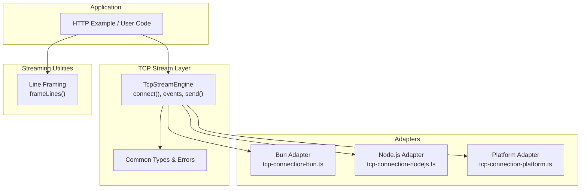
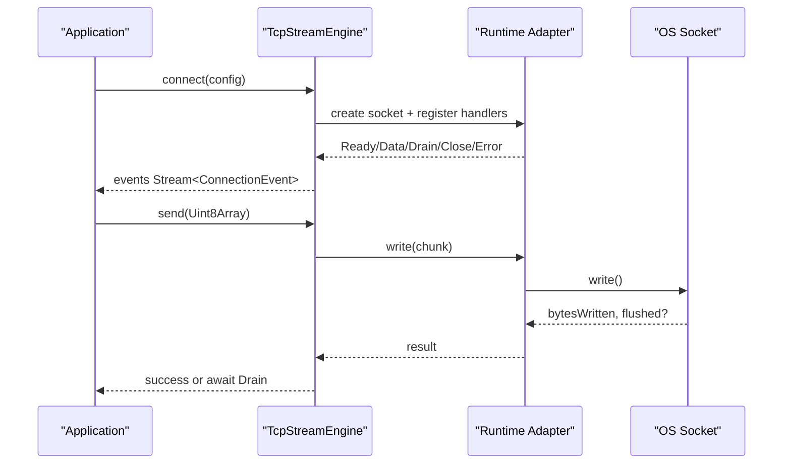
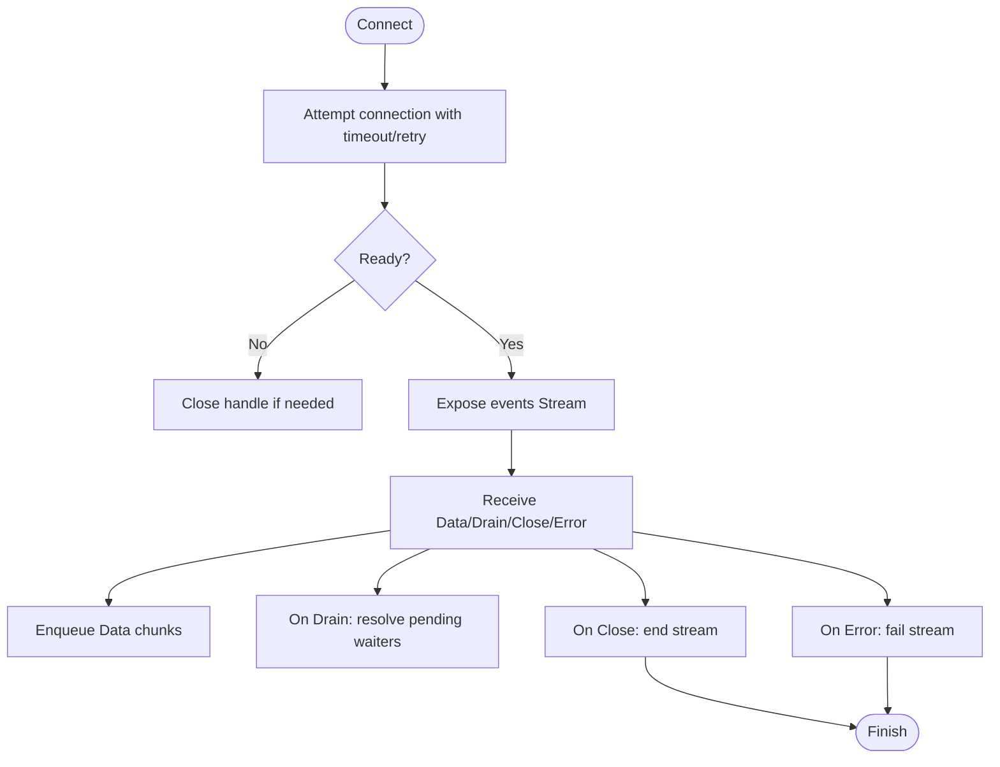
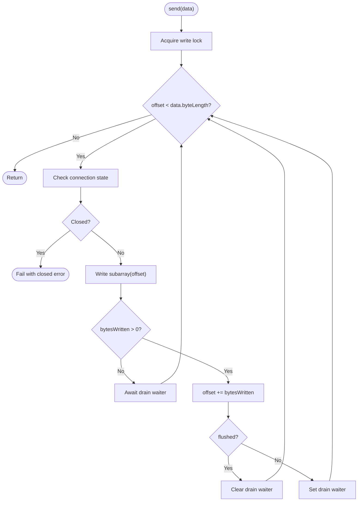
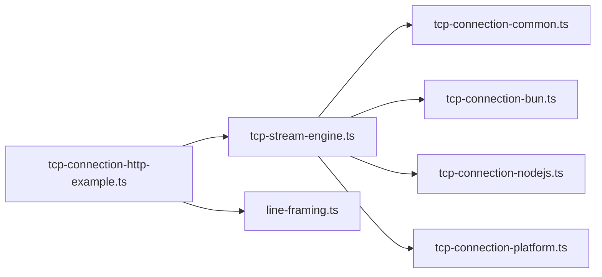

# Buffer Management and Memory Optimization

<cite>
**Referenced Files in This Document**
- [tcp-stream-engine.ts](file://src/tcp-stream-engine.ts)
- [tcp-connection-common.ts](file://src/tcp-connection-common.ts)
- [tcp-connection-bun.ts](file://src/tcp-connection-bun.ts)
- [tcp-connection-nodejs.ts](file://src/tcp-connection-nodejs.ts)
- [tcp-connection-platform.ts](file://src/tcp-connection-platform.ts)
- [line-framing.ts](file://src/line-framing.ts)
- [tcp-connection-http-example.ts](file://src/tcp-connection-http-example.ts)
- [concurrency-queue.ts](file://src/concurrency-queue.ts)
- [concurrency-pubsub.ts](file://src/concurrency-pubsub.ts)
</cite>

## Table of Contents
1. [Introduction](#introduction)
2. [Project Structure](#project-structure)
3. [Core Components](#core-components)
4. [Architecture Overview](#architecture-overview)
5. [Detailed Component Analysis](#detailed-component-analysis)
6. [Dependency Analysis](#dependency-analysis)
7. [Performance Considerations](#performance-considerations)
8. [Troubleshooting Guide](#troubleshooting-guide)
9. [Conclusion](#conclusion)
10. [Appendices](#appendices)

## Introduction
This document explains how the codebase manages buffers and memory for efficient TCP streaming, with a focus on backpressure, flow control, buffer reuse, UTF-8 handling, and garbage collection (GC) optimization. It covers:
- Buffer allocation strategies and chunk sizing considerations
- Memory reuse patterns to minimize allocations
- Backpressure mechanisms and overflow prevention
- UTF-8 encoding/decoding efficiency and binary data processing
- Monitoring memory usage, identifying leaks, and optimizing GC pauses
- Concrete guidance for implementing custom buffer managers and optimizing high-volume transfers

## Project Structure
The project provides a unified TCP stream abstraction over multiple runtimes (Bun, Node.js, and Effect Platform). The core engine coordinates connection lifecycle, event routing, and write serialization. Platform-specific adapters implement socket I/O and map platform events into a common event model. A line framing utility transforms raw byte streams into text lines using streaming decoders.

**Diagram sources**
- [tcp-stream-engine.ts:89-177](file://src/tcp-stream-engine.ts#L89-L177)
- [tcp-connection-bun.ts:18-135](file://src/tcp-connection-bun.ts#L18-L135)
- [tcp-connection-nodejs.ts:21-114](file://src/tcp-connection-nodejs.ts#L21-L114)
- [tcp-connection-platform.ts:17-128](file://src/tcp-connection-platform.ts#L17-L128)
- [line-framing.ts:3-17](file://src/line-framing.ts#L3-L17)

**Section sources**
- [tcp-stream-engine.ts:89-177](file://src/tcp-stream-engine.ts#L89-L177)
- [tcp-connection-bun.ts:18-135](file://src/tcp-connection-bun.ts#L18-L135)
- [tcp-connection-nodejs.ts:21-114](file://src/tcp-connection-nodejs.ts#L21-L114)
- [tcp-connection-platform.ts:17-128](file://src/tcp-connection-platform.ts#L17-L128)
- [line-framing.ts:3-17](file://src/line-framing.ts#L3-L17)

## Core Components
- TcpStreamEngine: Orchestrates connection lifecycle, event emission, retry/timeout, and exposes a typed stream of incoming bytes and a serialized send API.
- Adapters: Map runtime-specific sockets to a common RawSocketHandle interface and emit Data/Drain/Close/Error events.
- Line Framing: Converts raw byte streams into text lines using streaming decode and split operations.
- Concurrency Primitives: Queues and PubSubs demonstrate bounded vs unbounded buffering strategies for backpressure.

Key responsibilities:
- Event-driven read path: adapter emits chunks; engine routes them into an internal queue exposed as a Stream.
- Write path: serialized writes with backpressure handling via drain synchronization and state checks.
- Error handling: typed errors per operation (connect/read/write), timeouts, and clean shutdown.

**Section sources**
- [tcp-stream-engine.ts:28-67](file://src/tcp-stream-engine.ts#L28-L67)
- [tcp-stream-engine.ts:89-177](file://src/tcp-stream-engine.ts#L89-L177)
- [tcp-stream-engine.ts:201-339](file://src/tcp-stream-engine.ts#L201-L339)
- [line-framing.ts:3-17](file://src/line-framing.ts#L3-L17)
- [concurrency-queue.ts:1-92](file://src/concurrency-queue.ts#L1-L92)
- [concurrency-pubsub.ts:1-98](file://src/concurrency-pubsub.ts#L1-L98)

## Architecture Overview
The system uses a layered design:
- Application code consumes TcpStream (stream of Uint8Array, send/sendText/close).
- TcpStreamEngine connects via a pluggable adapter and translates low-level events into a typed stream.
- Adapters handle platform specifics (Bun native sockets, Node net/tls, or Effect Platform Socket).
- Optional line framing converts raw bytes to strings safely across chunk boundaries.

**Diagram sources**
- [tcp-stream-engine.ts:89-177](file://src/tcp-stream-engine.ts#L89-L177)
- [tcp-stream-engine.ts:201-339](file://src/tcp-stream-engine.ts#L201-L339)
- [tcp-connection-bun.ts:18-135](file://src/tcp-connection-bun.ts#L18-L135)
- [tcp-connection-nodejs.ts:21-114](file://src/tcp-connection-nodejs.ts#L21-L114)
- [tcp-connection-platform.ts:17-128](file://src/tcp-connection-platform.ts#L17-L128)

## Detailed Component Analysis

### TcpStreamEngine: Connection Lifecycle and Event Routing
- Establishes a connection with optional retry and timeout.
- Maintains a queue for incoming chunks and exposes it as a Stream.
- Emits Drain events to coordinate write backpressure.
- Ensures idempotent close and error propagation.

Memory and buffer implications:
- Incoming chunks are copied before being enqueued to avoid aliasing issues and ensure safe downstream processing.
- An unbounded queue is used for incoming data; consumers must keep up to prevent memory growth.
- Writes are serialized with a semaphore to maintain ordering and simplify backpressure coordination.

**Diagram sources**
- [tcp-stream-engine.ts:89-177](file://src/tcp-stream-engine.ts#L89-L177)
- [tcp-stream-engine.ts:201-339](file://src/tcp-stream-engine.ts#L201-L339)

**Section sources**
- [tcp-stream-engine.ts:89-177](file://src/tcp-stream-engine.ts#L89-L177)
- [tcp-stream-engine.ts:201-339](file://src/tcp-stream-engine.ts#L201-L339)

### Write Path and Backpressure Handling
- Each send call serializes writes using a semaphore.
- For each chunk, it tracks offset and waits for drain when necessary.
- If the underlying write returns zero bytes written, it awaits a drain waiter.
- On flush or full write, it advances the offset and continues until complete.

Backpressure strategy:
- Uses drain events to resume writing when the OS buffer drains.
- Avoids busy-waiting by suspending on Deferred waiters tied to drain signals.

**Diagram sources**
- [tcp-stream-engine.ts:300-332](file://src/tcp-stream-engine.ts#L300-L332)

**Section sources**
- [tcp-stream-engine.ts:300-332](file://src/tcp-stream-engine.ts#L300-L332)

### Platform-Specific Adapters: Buffer Copying and Zero-Copy Opportunities
- Bun adapter:
  - Configures binaryType to receive Uint8Array.
  - Copies incoming chunks before emitting to avoid shared mutable buffers.
  - Writes return bytesWritten and flushed status; flush is explicitly called.
- Node.js adapter:
  - Normalizes string chunks to Uint8Array and copies to avoid aliasing.
  - Emits drain events from the underlying socket.
- Platform adapter:
  - Uses Effect Platform Socket.run with a writer; copies chunks before emitting.

Buffer copying rationale:
- Prevents downstream mutations from corrupting kernel buffers or other consumers.
- Ensures safe async processing where original buffers might be reused by the runtime.

Zero-copy notes:
- When possible, pass Uint8Array directly to write APIs to avoid extra conversions.
- Be mindful of partial writes and manage offsets manually when required by the runtime.

**Section sources**
- [tcp-connection-bun.ts:18-135](file://src/tcp-connection-bun.ts#L18-L135)
- [tcp-connection-nodejs.ts:21-114](file://src/tcp-connection-nodejs.ts#L21-L114)
- [tcp-connection-platform.ts:17-128](file://src/tcp-connection-platform.ts#L17-L128)

### Line Framing: Efficient Text Processing Over Byte Streams
- Transforms a raw byte stream into individual text lines.
- Uses streaming decode and split operations to handle multi-chunk lines and mixed delimiters.
- Preserves empty lines and handles trailing content without final newline.

Optimization highlights:
- Decodes incrementally to avoid reconstructing large strings in memory.
- Splits lines efficiently without loading entire payloads.

**Section sources**
- [line-framing.ts:3-17](file://src/line-framing.ts#L3-L17)

### HTTP Example: Streaming UTF-8 Decode
- Demonstrates incremental decoding of response chunks using TextDecoder with stream mode.
- Joins decoded fragments and finalizes decoding at the end.

Best practices:
- Use streaming decode for large responses to minimize peak memory.
- Avoid concatenating large arrays of chunks; process incrementally when possible.

**Section sources**
- [tcp-connection-http-example.ts:176-205](file://src/tcp-connection-http-example.ts#L176-L205)

### Concurrency Primitives: Bounded vs Unbounded Buffers
- Examples show bounded, sliding, dropping, and unbounded queues and pubsubs.
- Bounded queues apply natural backpressure by blocking producers when full.
- Sliding/dropping strategies can cap memory at the cost of losing older messages.

Guidance:
- Prefer bounded queues for producer-consumer pipelines to enforce backpressure.
- Use unbounded queues only when you can guarantee downstream consumption rate matches production.

**Section sources**
- [concurrency-queue.ts:1-92](file://src/concurrency-queue.ts#L1-L92)
- [concurrency-pubsub.ts:1-98](file://src/concurrency-pubsub.ts#L1-L98)

## Dependency Analysis
- TcpStreamEngine depends on:
  - Common types/errors for consistent error modeling.
  - Platform adapters for concrete socket implementations.
  - Effect primitives (Queue, Stream, Semaphore, Deferred, MutableRef) for concurrency and state.
- Adapters depend on:
  - Runtime-specific socket APIs (Bun, Node net/tls, Effect Platform Socket).
  - Common utilities for error mapping.
- Line framing depends on Effect Stream utilities for decode/split.

Coupling and cohesion:
- Strong cohesion within each adapter; minimal coupling through the RawSocketHandle interface.
- Centralized error handling improves consistency across platforms.

Potential circular dependencies:
- None observed; adapters import engine interfaces but not vice versa.

External integration points:
- OS network stack via sockets.
- Effect runtime for concurrency and streams.

**Diagram sources**
- [tcp-stream-engine.ts:89-177](file://src/tcp-stream-engine.ts#L89-L177)
- [tcp-connection-common.ts:12-101](file://src/tcp-connection-common.ts#L12-L101)
- [tcp-connection-bun.ts:18-135](file://src/tcp-connection-bun.ts#L18-L135)
- [tcp-connection-nodejs.ts:21-114](file://src/tcp-connection-nodejs.ts#L21-L114)
- [tcp-connection-platform.ts:17-128](file://src/tcp-connection-platform.ts#L17-L128)
- [tcp-connection-http-example.ts:176-205](file://src/tcp-connection-http-example.ts#L176-L205)
- [line-framing.ts:3-17](file://src/line-framing.ts#L3-L17)

**Section sources**
- [tcp-stream-engine.ts:89-177](file://src/tcp-stream-engine.ts#L89-L177)
- [tcp-connection-common.ts:12-101](file://src/tcp-connection-common.ts#L12-L101)

## Performance Considerations
- Chunk sizing:
  - Prefer sizes aligned with OS page size or typical MTU (e.g., 4–16 KB) to reduce syscalls and fragmentation.
  - Avoid excessively small chunks that increase overhead; avoid overly large chunks that spike memory.
- Buffer reuse:
  - Reuse encoders/decoders where appropriate; avoid creating new instances per message.
  - Use subarrays and views to slice buffers without copying when safe.
- Backpressure:
  - Use bounded queues to naturally throttle producers.
  - Honor drain events to prevent unbounded growth.
- UTF-8 handling:
  - Use streaming decode to process large texts incrementally.
  - Avoid intermediate string conversions; work with Uint8Array as long as possible.
- Binary processing:
  - Pass TypedArrays directly to write APIs to minimize copies.
  - Validate partial writes and manage offsets carefully.
- GC optimization:
  - Minimize short-lived allocations in hot paths.
  - Reuse buffers and avoid unnecessary cloning unless safety requires it.
  - Monitor heap growth under load; adjust queue capacities and chunk sizes accordingly.

[No sources needed since this section provides general guidance]

## Troubleshooting Guide
Common issues and remedies:
- Memory growth under load:
  - Symptom: Heap increases steadily during sustained throughput.
  - Cause: Unbounded incoming queue or slow consumers.
  - Fix: Switch to bounded queues; ensure consumers keep pace; add backpressure.
- Partial writes causing data loss:
  - Symptom: Missing data on the wire.
  - Cause: Ignoring write return values and not waiting for drain.
  - Fix: Track bytesWritten; enqueue remaining slices; await drain before continuing.
- UTF-8 decode artifacts:
  - Symptom: Garbled characters at chunk boundaries.
  - Cause: Not using streaming decode mode.
  - Fix: Use TextDecoder with stream mode; finalize with decoder.decode() at end.
- Deadlocks or stalls:
  - Symptom: Writer blocks indefinitely.
  - Cause: Missing drain signaling or incorrect waiter management.
  - Fix: Ensure drain events clear waiters; verify semaphore usage and state transitions.
- Leaks on connection teardown:
  - Symptom: Resources not released after errors.
  - Cause: Incomplete cleanup in error paths.
  - Fix: Use scoped resources; ensure close is idempotent and finalizers run.

**Section sources**
- [tcp-stream-engine.ts:201-339](file://src/tcp-stream-engine.ts#L201-L339)
- [tcp-connection-bun.ts:18-135](file://src/tcp-connection-bun.ts#L18-L135)
- [tcp-connection-nodejs.ts:21-114](file://src/tcp-connection-nodejs.ts#L21-L114)
- [tcp-connection-platform.ts:17-128](file://src/tcp-connection-platform.ts#L17-L128)
- [tcp-connection-http-example.ts:176-205](file://src/tcp-connection-http-example.ts#L176-L205)

## Conclusion
The codebase implements a robust, cross-platform TCP streaming layer with careful attention to buffer management, backpressure, and error handling. Key takeaways:
- Use streaming decode and split for efficient text processing.
- Enforce backpressure with bounded queues and drain-aware writers.
- Copy incoming chunks to ensure safety while leveraging zero-copy writes where possible.
- Monitor memory and tune chunk sizes and queue capacities for your workload.
- Apply these patterns to build custom buffer managers and optimize high-volume data transfers.

[No sources needed since this section summarizes without analyzing specific files]

## Appendices

### Implementing a Custom Buffer Manager
Guidelines:
- Maintain a ring buffer or segmented list of chunks to minimize copies.
- Track total buffered bytes and enforce capacity limits; drop or pause producers when exceeded.
- Provide methods to:
  - append(chunk): validate and store chunk; apply backpressure if needed.
  - read(outBuffer, maxBytes): copy or view data; update offsets.
  - flush(): push buffered data to the socket; handle partial writes and drain events.
- Integrate with drain events to resume writing when space becomes available.
- Expose metrics (buffered bytes, drops, latency) for monitoring.

[No sources needed since this section provides general guidance]

### Optimizing High-Volume Data Transfers
Recommendations:
- Batch small writes into larger chunks to reduce syscall overhead.
- Use streaming decode for text-heavy protocols; parse incrementally.
- Prefer TypedArrays and avoid intermediate strings.
- Tune OS socket buffers and TCP_NODELAY based on latency vs throughput needs.
- Profile with heap snapshots and CPU profiles to identify hotspots.

[No sources needed since this section provides general guidance]