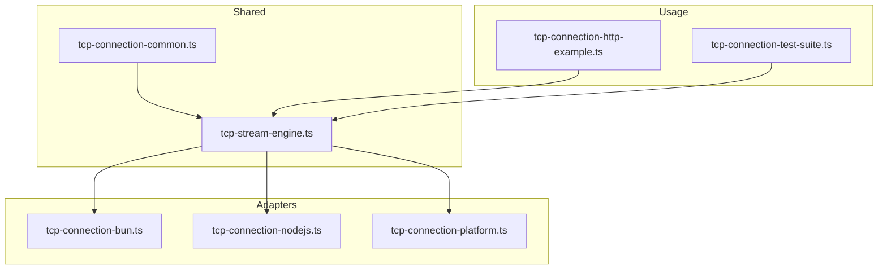
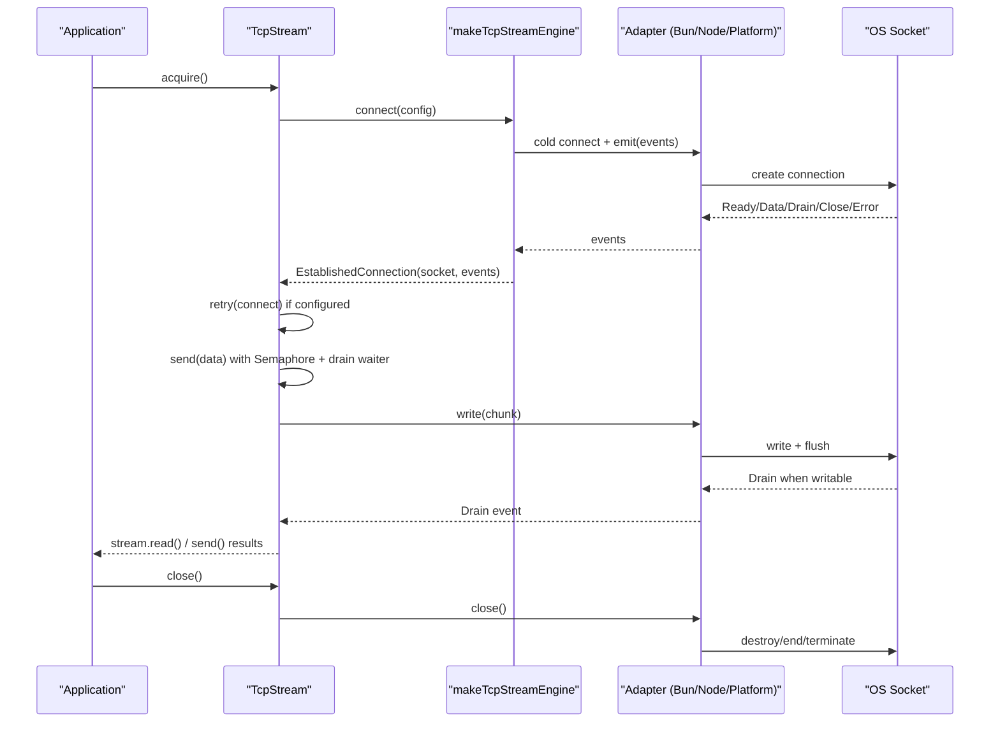
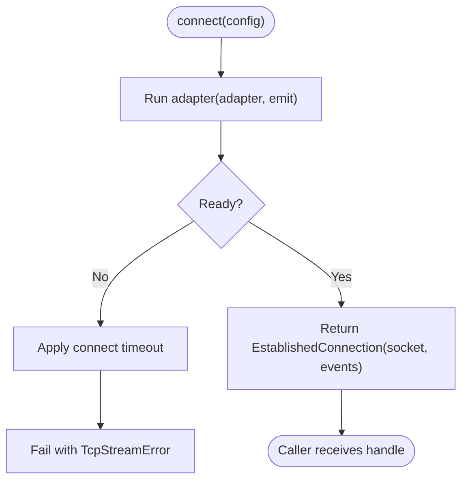
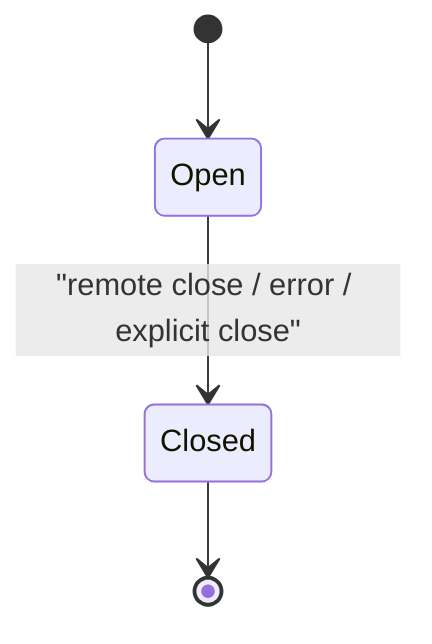
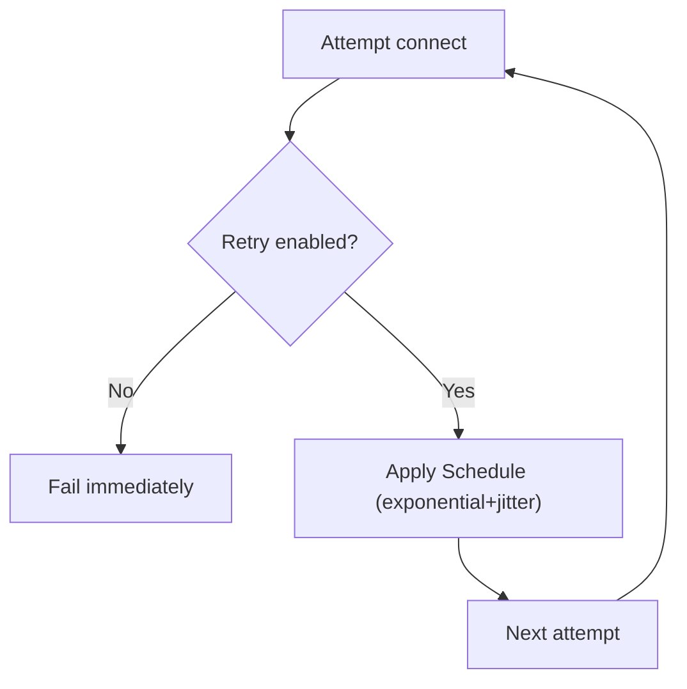
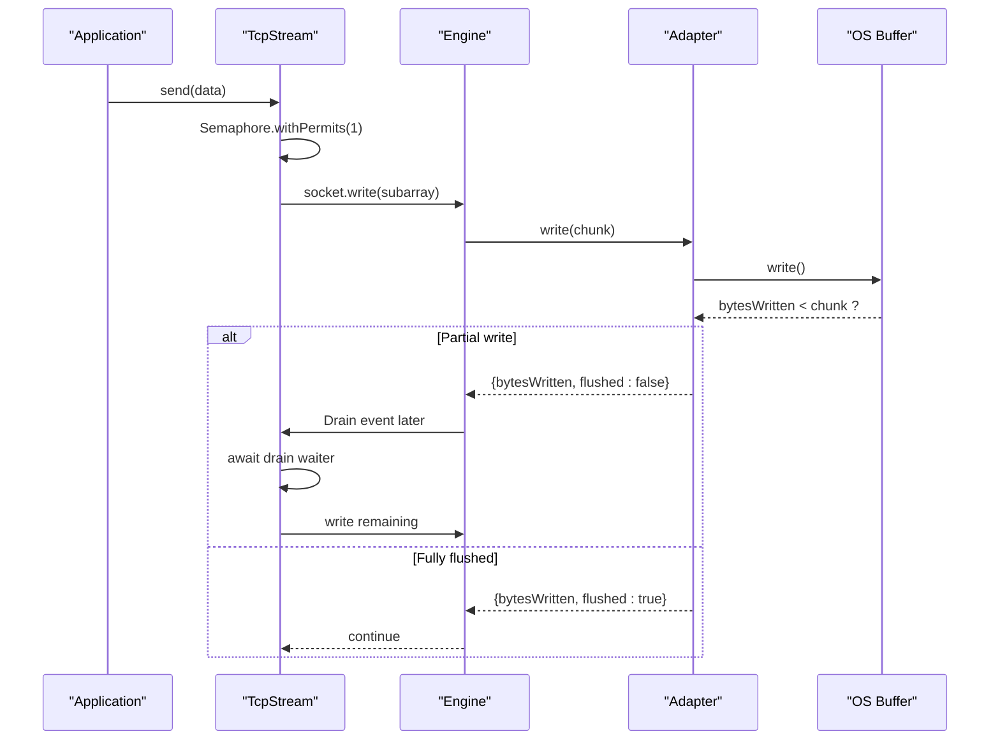
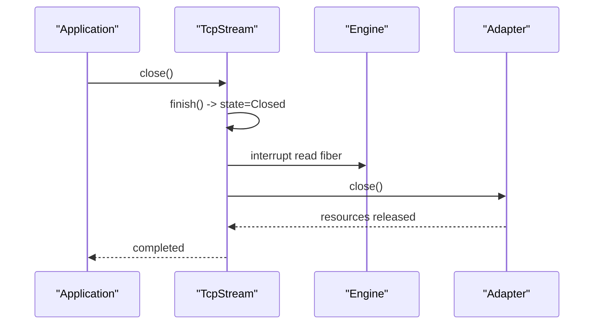
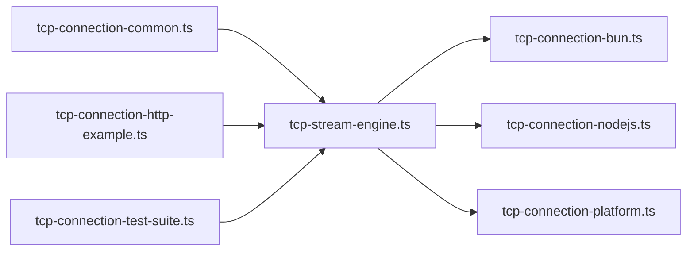

# Connection Pooling Strategies

<cite>
**Referenced Files in This Document**
- [tcp-stream-engine.ts](file://src/tcp-stream-engine.ts)
- [tcp-connection-common.ts](file://src/tcp-connection-common.ts)
- [tcp-connection-bun.ts](file://src/tcp-connection-bun.ts)
- [tcp-connection-nodejs.ts](file://src/tcp-connection-nodejs.ts)
- [tcp-connection-platform.ts](file://src/tcp-connection-platform.ts)
- [tcp-connection-http-example.ts](file://src/tcp-connection-http-example.ts)
- [tcp-connection-test-suite.ts](file://src/tcp-connection-test-suite.ts)
- [0002-unified-tcp-stream-engine-adapter-seam.md](file://docs/adr/0002-unified-tcp-stream-engine-adapter-seam.md)
- [0006-scope-owned-platform-engine-lifecycle.md](file://docs/adr/0006-scope-owned-platform-engine-lifecycle.md)
- [0008-caller-first-tcp-stream-engine.md](file://docs/adr/0008-caller-first-tcp-stream-engine.md)
- [effect-v4-platform-tcp-connection.md](file://docs/research/effect-v4-platform-tcp-connection.md)
</cite>

## Table of Contents
1. Introduction
2. Project Structure
3. Core Components
4. Architecture Overview
5. Detailed Component Analysis
6. Dependency Analysis
7. Performance Considerations
8. Troubleshooting Guide
9. Conclusion
10. Appendices

## Introduction
This document explains connection pooling strategies for TCP connections on the Effect v4 platform, focusing on lifecycle management, backpressure handling, health monitoring, graceful termination, and resource optimization. It synthesizes the repository’s unified engine design, per-adapter implementations (Bun, Node.js, Platform), and shared orchestration to provide practical guidance for building robust pooled clients under high-throughput and burst traffic patterns.

## Project Structure
The codebase provides a unified TCP stream engine with three runtime adapters and a shared orchestration layer:
- Shared contracts and configuration live in a common module.
- A central engine orchestrates connection attempts, events, timeouts, retries, and backpressure.
- Adapters implement low-level socket behavior for Bun, Node.js, and the Effect Platform Socket API.
- Tests and examples demonstrate retry policies, TLS, interruption safety, and graceful close semantics.

**Diagram sources**
- [tcp-stream-engine.ts:1-359](file://src/tcp-stream-engine.ts#L1-L359)
- [tcp-connection-common.ts:1-101](file://src/tcp-connection-common.ts#L1-L101)
- [tcp-connection-bun.ts:1-145](file://src/tcp-connection-bun.ts#L1-L145)
- [tcp-connection-nodejs.ts:1-132](file://src/tcp-connection-nodejs.ts#L1-L132)
- [tcp-connection-platform.ts:1-135](file://src/tcp-connection-platform.ts#L1-L135)
- [tcp-connection-http-example.ts:1-301](file://src/tcp-connection-http-example.ts#L1-L301)
- [tcp-connection-test-suite.ts:1-800](file://src/tcp-connection-test-suite.ts#L1-L800)

**Section sources**
- [tcp-stream-engine.ts:1-359](file://src/tcp-stream-engine.ts#L1-L359)
- [tcp-connection-common.ts:1-101](file://src/tcp-connection-common.ts#L1-L101)
- [tcp-connection-bun.ts:1-145](file://src/tcp-connection-bun.ts#L1-L145)
- [tcp-connection-nodejs.ts:1-132](file://src/tcp-connection-nodejs.ts#L1-L132)
- [tcp-connection-platform.ts:1-135](file://src/tcp-connection-platform.ts#L1-L135)
- [tcp-connection-http-example.ts:1-301](file://src/tcp-connection-http-example.ts#L1-L301)
- [tcp-connection-test-suite.ts:1-800](file://src/tcp-connection-test-suite.ts#L1-L800)

## Core Components
- TcpStreamEngineShape and makeTcpStreamEngine: Central orchestrator that builds an EstablishedConnection from a cold adapter, manages readiness, event queues, timeouts, and failure mapping.
- TcpStream: High-level service combining connection acquisition with retry, incoming data queue, write serialization via semaphore, drain synchronization, and state machine for Open/Closed.
- Adapters:
  - Bun: Uses Bun.connect with explicit terminate/end teardown and drain signaling.
  - Node.js: Uses node:net/node:tls with data/drain/close/error events.
  - Platform: Uses effect/unstable/socket/Socket with scoped writer and scope-based lifecycle.
- Configuration: ConnectionConfigShape includes host, port, optional TLS, connectTimeout, and retry policy or custom schedule.

Key responsibilities:
- Backpressure: Write serialization and drain waiters ensure writes respect OS buffer limits.
- Retry: Built-in exponential backoff with jitter and configurable caps; supports custom schedules.
- Lifecycle: Scoped acquisition/release ensures cleanup even on interruption or early close.
- Health: Connect timeout, error propagation, and clean stream completion model.

**Section sources**
- [tcp-stream-engine.ts:44-178](file://src/tcp-stream-engine.ts#L44-L178)
- [tcp-stream-engine.ts:180-359](file://src/tcp-stream-engine.ts#L180-L359)
- [tcp-connection-common.ts:37-101](file://src/tcp-connection-common.ts#L37-L101)
- [tcp-connection-bun.ts:18-138](file://src/tcp-connection-bun.ts#L18-L138)
- [tcp-connection-nodejs.ts:21-121](file://src/tcp-connection-nodejs.ts#L21-L121)
- [tcp-connection-platform.ts:17-125](file://src/tcp-connection-platform.ts#L17-L125)

## Architecture Overview
The architecture separates concerns into a reusable engine and pluggable adapters:
- The engine owns the connection attempt lifecycle, event fan-out, and backpressure coordination.
- Adapters implement minimal socket plumbing and emit standardized events.
- TcpStream composes the engine with retry, streams, and write serialization.

**Diagram sources**
- [tcp-stream-engine.ts:88-178](file://src/tcp-stream-engine.ts#L88-L178)
- [tcp-stream-engine.ts:201-339](file://src/tcp-stream-engine.ts#L201-L339)
- [tcp-connection-bun.ts:18-138](file://src/tcp-connection-bun.ts#L18-L138)
- [tcp-connection-nodejs.ts:21-121](file://src/tcp-connection-nodejs.ts#L21-L121)
- [tcp-connection-platform.ts:17-125](file://src/tcp-connection-platform.ts#L17-L125)

## Detailed Component Analysis

### Unified Engine and Connection Lifecycle
- Cold adapter protocol: The engine calls a cold adapter function that emits events until settled. Events include Ready, Data, Drain, Close, Error.
- Single-attempt ownership: Each connect call represents one complete attempt; retries are handled by TcpStream around this single attempt.
- Timeout: Connect operations are wrapped with a configurable timeout; failures map to TcpStreamError.
- Event-driven stream: Incoming data is funneled into an unbounded queue exposed as a Stream; drain events wake waiting writers.

**Diagram sources**
- [tcp-stream-engine.ts:88-178](file://src/tcp-stream-engine.ts#L88-L178)
- [tcp-stream-engine.ts:180-195](file://src/tcp-stream-engine.ts#L180-L195)

**Section sources**
- [tcp-stream-engine.ts:88-178](file://src/tcp-stream-engine.ts#L88-L178)
- [tcp-stream-engine.ts:180-195](file://src/tcp-stream-engine.ts#L180-L195)
- [0008-caller-first-tcp-stream-engine.md:1-18](file://docs/adr/0008-caller-first-tcp-stream-engine.md#L1-L18)

### TcpStream State Machine and Write Serialization
- State: Open vs Closed; transitions occur on remote close, errors, or explicit close.
- Incoming pipeline: A background fiber runs the engine’s event stream, pushing Data into an unbounded Queue and ending it on Close or error.
- Write path: A semaphore serializes writes; partial writes wait for Drain events via Deferreds; flushing resets the drain waiter.
- Cleanup: On exit or close, the state becomes Closed, pending drain waiters fail, and the underlying socket is closed.

**Diagram sources**
- [tcp-stream-engine.ts:197-237](file://src/tcp-stream-engine.ts#L197-L237)
- [tcp-stream-engine.ts:261-339](file://src/tcp-stream-engine.ts#L261-L339)

**Section sources**
- [tcp-stream-engine.ts:197-339](file://src/tcp-stream-engine.ts#L197-L339)

### Retry Policy and Scheduling
- Default retry: Exponential backoff with jitter, capped by maxAttempts and maxDuration.
- Customization: Provide a custom Schedule or disable retries entirely.
- Scope safety: Acquisition uses interruptible acquireRelease so backoff sleeps can be interrupted promptly.

**Diagram sources**
- [tcp-connection-common.ts:90-101](file://src/tcp-connection-common.ts#L90-L101)
- [tcp-stream-engine.ts:238-260](file://src/tcp-stream-engine.ts#L238-L260)
- [0006-scope-owned-platform-engine-lifecycle.md:48-62](file://docs/adr/0006-scope-owned-platform-engine-lifecycle.md#L48-L62)

**Section sources**
- [tcp-connection-common.ts:90-101](file://src/tcp-connection-common.ts#L90-L101)
- [tcp-stream-engine.ts:238-260](file://src/tcp-stream-engine.ts#L238-L260)
- [0006-scope-owned-platform-engine-lifecycle.md:48-62](file://docs/adr/0006-scope-owned-platform-engine-lifecycle.md#L48-L62)

### Backpressure Handling
- Bun adapter: Non-blocking write returns bytes written; flush is called; drain events signal when more data can be sent.
- Node.js adapter: Uses native stream callbacks; drain events propagate through the engine.
- Platform adapter: Uses a scoped writer that sequences writes and signals completion; no explicit drain needed at the application level.
- Engine coordination: Writes are serialized; partial writes wait for drain before continuing; flushed flag short-circuits waits.

**Diagram sources**
- [tcp-stream-engine.ts:300-332](file://src/tcp-stream-engine.ts#L300-L332)
- [tcp-connection-bun.ts:96-115](file://src/tcp-connection-bun.ts#L96-L115)
- [tcp-connection-nodejs.ts:46-61](file://src/tcp-connection-nodejs.ts#L46-L61)
- [tcp-connection-platform.ts:85-103](file://src/tcp-connection-platform.ts#L85-L103)

**Section sources**
- [tcp-stream-engine.ts:300-332](file://src/tcp-stream-engine.ts#L300-L332)
- [tcp-connection-bun.ts:96-115](file://src/tcp-connection-bun.ts#L96-L115)
- [tcp-connection-nodejs.ts:46-61](file://src/tcp-connection-nodejs.ts#L46-L61)
- [tcp-connection-platform.ts:85-103](file://src/tcp-connection-platform.ts#L85-L103)

### Health Monitoring and Graceful Termination
- Connect timeout: Centralized around adapter setup and readiness; maps to TcpStreamError.
- Remote close: Ends the incoming stream cleanly; drain waiters are resolved; state transitions to Closed.
- Explicit close: Idempotent; interrupts read loop; closes underlying socket; fails pending drains.
- Interruption safety: AcquireRelease with interruptible true ensures cancellation during backoff or connect.

**Diagram sources**
- [tcp-stream-engine.ts:216-237](file://src/tcp-stream-engine.ts#L216-L237)
- [tcp-stream-engine.ts:295-339](file://src/tcp-stream-engine.ts#L295-L339)
- [0006-scope-owned-platform-engine-lifecycle.md:42-62](file://docs/adr/0006-scope-owned-platform-engine-lifecycle.md#L42-L62)

**Section sources**
- [tcp-stream-engine.ts:216-339](file://src/tcp-stream-engine.ts#L216-L339)
- [0006-scope-owned-platform-engine-lifecycle.md:42-62](file://docs/adr/0006-scope-owned-platform-engine-lifecycle.md#L42-L62)

### Adapter-Specific Notes
- Bun: Uses terminate/end fallbacks; drain signaling via callback; write flush semantics.
- Node.js: Uses net/tls; data/drain/close/error mapped to engine events; string chunks encoded to Uint8Array.
- Platform: Uses effect/unstable/socket/Socket; scoped writer; owner scope forked for lifecycle control; idempotent close via Scope.close.

**Section sources**
- [tcp-connection-bun.ts:18-138](file://src/tcp-connection-bun.ts#L18-L138)
- [tcp-connection-nodejs.ts:21-121](file://src/tcp-connection-nodejs.ts#L21-L121)
- [tcp-connection-platform.ts:17-125](file://src/tcp-connection-platform.ts#L17-L125)

## Dependency Analysis
The system exhibits clear separation between shared logic and runtime-specific adapters:
- tcp-stream-engine.ts depends on tcp-connection-common.ts for types, errors, and config utilities.
- Adapters depend on both the engine and their respective runtimes.
- Examples and tests depend on the engine and adapters to exercise behaviors like retry, TLS, and interruption.

**Diagram sources**
- [tcp-stream-engine.ts:1-359](file://src/tcp-stream-engine.ts#L1-L359)
- [tcp-connection-common.ts:1-101](file://src/tcp-connection-common.ts#L1-L101)
- [tcp-connection-bun.ts:1-145](file://src/tcp-connection-bun.ts#L1-L145)
- [tcp-connection-nodejs.ts:1-132](file://src/tcp-connection-nodejs.ts#L1-L132)
- [tcp-connection-platform.ts:1-135](file://src/tcp-connection-platform.ts#L1-L135)
- [tcp-connection-http-example.ts:1-301](file://src/tcp-connection-http-example.ts#L1-L301)
- [tcp-connection-test-suite.ts:1-800](file://src/tcp-connection-test-suite.ts#L1-L800)

**Section sources**
- [tcp-stream-engine.ts:1-359](file://src/tcp-stream-engine.ts#L1-L359)
- [tcp-connection-common.ts:1-101](file://src/tcp-connection-common.ts#L1-L101)
- [tcp-connection-bun.ts:1-145](file://src/tcp-connection-bun.ts#L1-L145)
- [tcp-connection-nodejs.ts:1-132](file://src/tcp-connection-nodejs.ts#L1-L132)
- [tcp-connection-platform.ts:1-135](file://src/tcp-connection-platform.ts#L1-L135)
- [tcp-connection-http-example.ts:1-301](file://src/tcp-connection-http-example.ts#L1-L301)
- [tcp-connection-test-suite.ts:1-800](file://src/tcp-connection-test-suite.ts#L1-L800)

## Performance Considerations
- Write serialization: A single permit semaphore avoids concurrent writes and race conditions on the same socket.
- Drain-aware writes: Waiting for drain events prevents unbounded memory growth under backpressure.
- Unbounded incoming queue: While convenient, consider bounded queues or backpressure-aware consumers for high-volume streams to avoid memory pressure.
- Retry tuning: Use appropriate initialDelay, factor, maxAttempts, and maxDuration to balance resilience and latency.
- TLS overhead: Prefer keep-alive where supported by protocols; otherwise, reuse connections at the application layer.

[No sources needed since this section provides general guidance]

## Troubleshooting Guide
Common issues and how the code addresses them:
- Stuck connects: Connect timeout wraps adapter setup; failures map to TcpStreamError.
- Hanging on remote close: Engine ends the event stream and resolves drain waiters; state transitions to Closed.
- Interrupted retries: AcquireRelease with interruptible true allows cancellation during backoff.
- Double close: Close is idempotent; adapter close methods guard against repeated teardown.
- TLS handshake failures: Handshakes surface as errors; tests verify clean failures without defects.

Practical checks:
- Verify retry configuration and schedule.
- Ensure downstream consumers apply backpressure to prevent unbounded queues.
- Monitor connect timeouts and adjust based on network conditions.
- Validate TLS options (e.g., serverName, rejectUnauthorized).

**Section sources**
- [tcp-stream-engine.ts:180-195](file://src/tcp-stream-engine.ts#L180-L195)
- [tcp-stream-engine.ts:216-237](file://src/tcp-stream-engine.ts#L216-L237)
- [tcp-stream-engine.ts:295-339](file://src/tcp-stream-engine.ts#L295-L339)
- [tcp-connection-test-suite.ts:219-386](file://src/tcp-connection-test-suite.ts#L219-L386)
- [tcp-connection-test-suite.ts:581-623](file://src/tcp-connection-test-suite.ts#L581-L623)
- [0006-scope-owned-platform-engine-lifecycle.md:48-69](file://docs/adr/0006-scope-owned-platform-engine-lifecycle.md#L48-L69)

## Conclusion
The repository implements a robust, unified TCP stream engine with clear separation between shared orchestration and runtime adapters. It provides strong guarantees for backpressure, retry, lifecycle, and interruption safety. For connection pooling, use these primitives to build pools that:
- Limit active connections via semaphores or bounded queues.
- Reuse established connections for request/response flows.
- Apply per-request timeouts and global pool timeouts.
- Monitor health via periodic pings or idle timeouts.
- Enforce maximum connection limits and eviction policies.

[No sources needed since this section summarizes without analyzing specific files]

## Appendices

### Pooling Patterns for Different Workloads
- High-throughput steady-state:
  - Maintain a fixed-size pool sized to CPU cores and network capacity.
  - Use bounded queues for outgoing messages to apply backpressure.
  - Configure moderate retry with jitter to absorb transient failures.
- Burst traffic:
  - Allow temporary pool expansion with a soft cap; drop or queue excess requests.
  - Increase connectTimeout and reduce retry aggressiveness to avoid amplifying bursts.
  - Use drain-aware writes to prevent memory spikes.

Configuration tips:
- Set connectTimeout based on expected network latency.
- Tune retry.initialDelay, retry.factor, retry.maxAttempts, and retry.maxDuration.
- For TLS, set serverName and certificate validation appropriately.

**Section sources**
- [tcp-connection-common.ts:45-52](file://src/tcp-connection-common.ts#L45-L52)
- [tcp-connection-common.ts:90-101](file://src/tcp-connection-common.ts#L90-L101)
- [tcp-connection-http-example.ts:152-170](file://src/tcp-connection-http-example.ts#L152-L170)

### Practical Example: HTTP GET Over TCP
- Demonstrates constructing ConnectionConfig from URL, selecting engine, sending HTTP request, and collecting response stream.
- Shows how to choose among Bun, Node.js, and Platform engines via CLI flags.

**Section sources**
- [tcp-connection-http-example.ts:149-254](file://src/tcp-connection-http-example.ts#L149-L254)

### Reference: Unified Engine Design and Lifecycle Decisions
- ADRs explain the rationale behind caller-first engine, scope ownership, and interruption safety.
- Research document compares platform-native approaches and highlights backpressure differences.

**Section sources**
- [0002-unified-tcp-stream-engine-adapter-seam.md:1-48](file://docs/adr/0002-unified-tcp-stream-engine-adapter-seam.md#L1-L48)
- [0006-scope-owned-platform-engine-lifecycle.md:15-84](file://docs/adr/0006-scope-owned-platform-engine-lifecycle.md#L15-L84)
- [0008-caller-first-tcp-stream-engine.md:1-18](file://docs/adr/0008-caller-first-tcp-stream-engine.md#L1-L18)
- [effect-v4-platform-tcp-connection.md:1-656](file://docs/research/effect-v4-platform-tcp-connection.md#L1-L656)