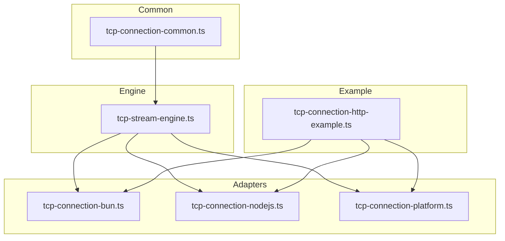
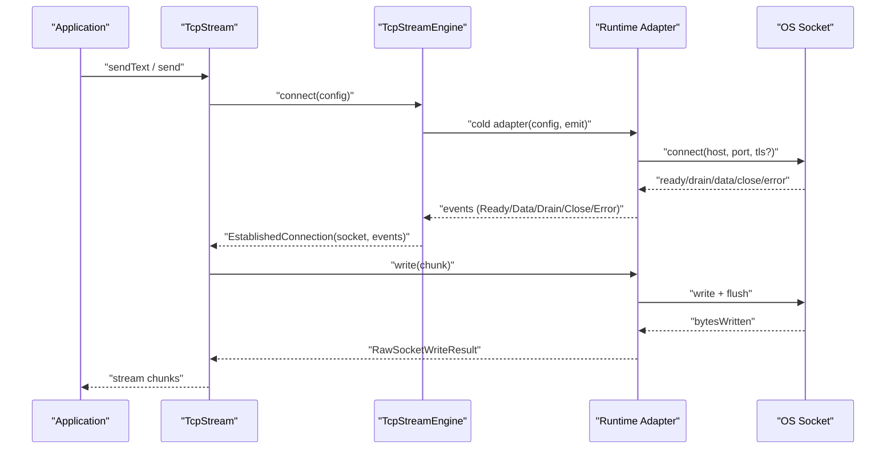
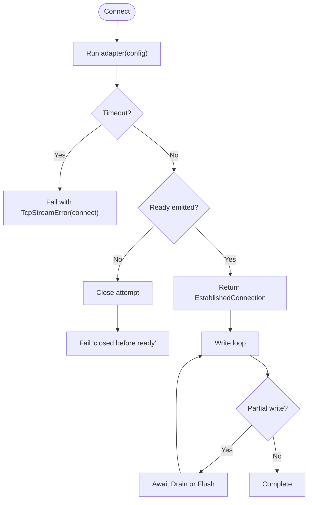
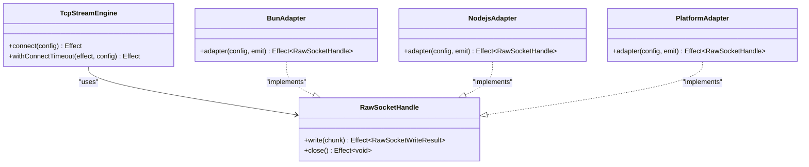
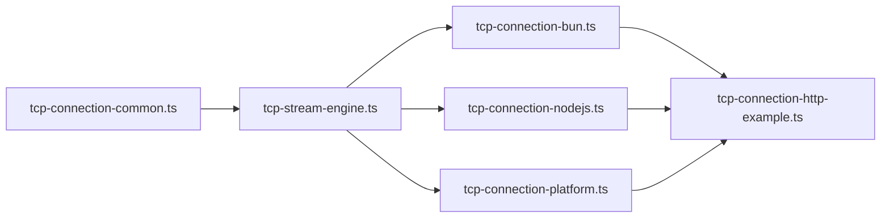

# Performance Monitoring and Profiling

<cite>
**Referenced Files in This Document**
- [tcp-stream-engine.ts](file://src/tcp-stream-engine.ts)
- [tcp-connection-bun.ts](file://src/tcp-connection-bun.ts)
- [tcp-connection-nodejs.ts](file://src/tcp-connection-nodejs.ts)
- [tcp-connection-platform.ts](file://src/tcp-connection-platform.ts)
- [tcp-connection-common.ts](file://src/tcp-connection-common.ts)
- [tcp-connection-http-example.ts](file://src/tcp-connection-http-example.ts)
- [package.json](file://package.json)
</cite>

## Table of Contents
1. Introduction
2. Project Structure
3. Core Components
4. Architecture Overview
5. Detailed Component Analysis
6. Dependency Analysis
7. Performance Considerations
8. Troubleshooting Guide
9. Conclusion
10. Appendices

## Introduction
This document provides a comprehensive guide to performance monitoring and profiling for TCP stream operations in this repository. It focuses on where and how to instrument the code, what metrics to collect, and how to integrate with observability platforms. The guidance is grounded in the actual implementation of the TCP stream engine and its Bun, Node.js, and Platform adapters, as well as the HTTP example program that exercises the stack end-to-end.

The goal is to help you:
- Identify precise instrumentation points in the connection lifecycle and data path.
- Define measurable metrics for latency, throughput, error rates, and resource usage.
- Integrate with Node.js and Bun profiling tools for CPU and memory analysis.
- Build dashboards and alerts tailored to TCP stream behavior.
- Debug performance bottlenecks using structured logs and traces.

## Project Structure
The TCP layer is implemented as a runtime-agnostic engine with three concrete adapters (Bun, Node.js, Platform). A shared common module defines configuration, errors, and services. An HTTP example demonstrates usage across engines.

**Diagram sources**
- [tcp-stream-engine.ts:1-178](file://src/tcp-stream-engine.ts#L1-L178)
- [tcp-connection-bun.ts:1-138](file://src/tcp-connection-bun.ts#L1-L138)
- [tcp-connection-nodejs.ts:1-132](file://src/tcp-connection-nodejs.ts#L1-L132)
- [tcp-connection-platform.ts:1-135](file://src/tcp-connection-platform.ts#L1-L135)
- [tcp-connection-common.ts:1-101](file://src/tcp-connection-common.ts#L1-L101)
- [tcp-connection-http-example.ts:1-301](file://src/tcp-connection-http-example.ts#L1-L301)

**Section sources**
- [tcp-stream-engine.ts:1-178](file://src/tcp-stream-engine.ts#L1-L178)
- [tcp-connection-common.ts:1-101](file://src/tcp-connection-common.ts#L1-L101)
- [tcp-connection-http-example.ts:1-301](file://src/tcp-connection-http-example.ts#L1-L301)

## Core Components
- TcpStreamEngineShape and makeTcpStreamEngine define the core connect lifecycle, event fan-out, timeouts, and state transitions.
- RawSocketHandle abstracts per-runtime write/close semantics.
- ConnectionConfig and retry scheduling are centralized in the common module.
- Adapters implement the cold adapter protocol for Bun, Node.js, and Platform runtimes.
- The HTTP example wires layers and executes an HTTP GET over raw TCP, demonstrating end-to-end usage.

Key responsibilities:
- Engine: orchestrate connection attempts, retries, timeouts, incoming data queueing, drain signaling, and graceful close.
- Adapters: bridge runtime-specific sockets into the engine’s event model and handle backpressure via drain events.
- Common: provide typed errors, validation, and default retry schedules.

**Section sources**
- [tcp-stream-engine.ts:28-178](file://src/tcp-stream-engine.ts#L28-L178)
- [tcp-connection-common.ts:12-101](file://src/tcp-connection-common.ts#L12-L101)
- [tcp-connection-bun.ts:18-138](file://src/tcp-connection-bun.ts#L18-L138)
- [tcp-connection-nodejs.ts:21-132](file://src/tcp-connection-nodejs.ts#L21-L132)
- [tcp-connection-platform.ts:17-135](file://src/tcp-connection-platform.ts#L17-L135)

## Architecture Overview
The system composes a layered architecture:
- Application code depends on TcpStream (a service).
- TcpStream uses TcpStreamEngine to establish connections and manage streams.
- Each runtime adapter implements the engine contract.
- The HTTP example selects an engine at runtime and performs a request/response cycle.

**Diagram sources**
- [tcp-stream-engine.ts:89-178](file://src/tcp-stream-engine.ts#L89-L178)
- [tcp-connection-bun.ts:18-138](file://src/tcp-connection-bun.ts#L18-L138)
- [tcp-connection-nodejs.ts:21-132](file://src/tcp-connection-nodejs.ts#L21-L132)
- [tcp-connection-platform.ts:51-119](file://src/tcp-connection-platform.ts#L51-L119)

## Detailed Component Analysis

### TcpStreamEngine: Lifecycle, Backpressure, and Retries
- Connect lifecycle:
  - Creates an unbounded queue for connection events.
  - Uses a Deferred to gate readiness until the adapter emits Ready.
  - Wraps the adapter call with a configurable connect timeout.
  - On success, returns a socket handle and a Stream of events; on failure, surfaces TcpStreamError.
- Data path:
  - Incoming Data events are enqueued into an incoming Queue exposed as a Stream.
  - Drain events wake up writers waiting for backpressure to clear.
- Write path:
  - Uses a Semaphore to serialize writes.
  - Handles partial writes by advancing offsets and awaiting drain or flushed signals.
  - Tracks connection state and propagates closure or errors to writers and readers.
- Retry and timeout:
  - Default exponential backoff with jitter and caps can be configured.
  - Connect timeout wraps the entire attempt.

Instrumentation opportunities:
- Measure connect duration from adapter start to Ready.
- Track bytes written/read per interval and per connection.
- Count retries, failures, and timeouts.
- Observe queue sizes and backpressure wait times.

**Diagram sources**
- [tcp-stream-engine.ts:89-178](file://src/tcp-stream-engine.ts#L89-L178)
- [tcp-stream-engine.ts:180-195](file://src/tcp-stream-engine.ts#L180-L195)
- [tcp-stream-engine.ts:201-339](file://src/tcp-stream-engine.ts#L201-L339)

**Section sources**
- [tcp-stream-engine.ts:89-195](file://src/tcp-stream-engine.ts#L89-L195)
- [tcp-stream-engine.ts:201-339](file://src/tcp-stream-engine.ts#L201-L339)

### Adapters: Bun, Node.js, Platform
- Bun adapter:
  - Uses Bun.connect with a static handler object.
  - Emits Data, Drain, Close, Error, and Ready events.
  - Writes return byte counts and flushes explicitly; flushed indicates full write.
- Node.js adapter:
  - Uses net.createConnection or tls.connect.
  - Emits data/drain/close/error/connect or secureConnect.
  - Encodes string chunks to Uint8Array when necessary.
- Platform adapter:
  - Uses @effect/platform-bun and effect/unstable/socket/Socket.
  - Bridges to a writer that reports bytesWritten and flushed=true.
  - Manages scoped lifecycles and error mapping.

Instrumentation opportunities:
- Per-adapter connect latency and handshake time (TLS vs plaintext).
- Write throughput and flush frequency.
- Event rate (data/drain) and backpressure episodes.
- Error classification (connect vs read vs write).

**Diagram sources**
- [tcp-stream-engine.ts:28-67](file://src/tcp-stream-engine.ts#L28-L67)
- [tcp-connection-bun.ts:18-138](file://src/tcp-connection-bun.ts#L18-L138)
- [tcp-connection-nodejs.ts:21-132](file://src/tcp-connection-nodejs.ts#L21-L132)
- [tcp-connection-platform.ts:51-119](file://src/tcp-connection-platform.ts#L51-L119)

**Section sources**
- [tcp-connection-bun.ts:18-138](file://src/tcp-connection-bun.ts#L18-L138)
- [tcp-connection-nodejs.ts:21-132](file://src/tcp-connection-nodejs.ts#L21-L132)
- [tcp-connection-platform.ts:51-119](file://src/tcp-connection-platform.ts#L51-L119)

### HTTP Example: End-to-End Usage
- Parses CLI arguments and URL.
- Builds ConnectionConfigShape from URL (including TLS options).
- Executes an HTTP GET over raw TCP using TcpStream.
- Collects response chunks and decodes them safely across chunk boundaries.

Instrumentation opportunities:
- Time to first byte (TTFB) and total response time.
- Bytes sent/received for the HTTP exchange.
- Errors during DNS, connect, TLS handshake, or write/read.

**Section sources**
- [tcp-connection-http-example.ts:49-170](file://src/tcp-connection-http-example.ts#L49-L170)
- [tcp-connection-http-example.ts:176-225](file://src/tcp-connection-http-example.ts#L176-L225)

## Dependency Analysis
- tcp-stream-engine.ts depends on tcp-connection-common.ts for configuration, errors, and retry utilities.
- Each adapter imports the engine and common modules and exposes a Layer for injection.
- The HTTP example composes layers to select a runtime and execute requests.

**Diagram sources**
- [tcp-connection-common.ts:1-101](file://src/tcp-connection-common.ts#L1-L101)
- [tcp-stream-engine.ts:1-178](file://src/tcp-stream-engine.ts#L1-L178)
- [tcp-connection-bun.ts:1-138](file://src/tcp-connection-bun.ts#L1-L138)
- [tcp-connection-nodejs.ts:1-132](file://src/tcp-connection-nodejs.ts#L1-L132)
- [tcp-connection-platform.ts:1-135](file://src/tcp-connection-platform.ts#L1-L135)
- [tcp-connection-http-example.ts:1-301](file://src/tcp-connection-http-example.ts#L1-L301)

**Section sources**
- [package.json:1-33](file://package.json#L1-L33)
- [tcp-connection-http-example.ts:1-301](file://src/tcp-connection-http-example.ts#L1-L301)

## Performance Considerations
Focus areas for TCP stream performance:
- Latency:
  - Connect latency: measure from adapter start to Ready emission.
  - Round-trip latency: measure between send and first received chunk.
  - TLS handshake overhead: separate from TCP connect time.
- Throughput:
  - Bytes per second on send and receive paths.
  - Batch size and flush frequency impact on network efficiency.
- Backpressure:
  - Monitor drain events and time spent waiting for drain.
  - Tune buffer sizes and application pacing.
- Reliability:
  - Track retry counts, timeouts, and error categories (connect/read/write).
  - Ensure no defects leak through causes.

Where to instrument:
- Adapter connect and Ready emission.
- Adapter write calls and returned bytesWritten/flushed.
- Engine event queue offers and drain handling.
- Stream send loops and offset advancement.
- HTTP example request/response timing.

Recommended metrics:
- Counter: connect_attempts, connect_success, connect_timeout, retries_total, errors_by_operation.
- Histogram: connect_duration_ms, ttfb_ms, response_time_ms, write_batch_size_bytes, read_chunk_size_bytes.
- Gauge: active_connections, queue_depth_incoming, queue_depth_events, backpressure_wait_ms.

Integration patterns:
- Wrap adapter callbacks with timers and counters.
- Use Effect hooks (Effect.tap, Effect.onExit) around connect/send/stream operations to emit metrics without changing business logic.
- Tag metrics with host, port, tls flag, and engine name for multi-tenant dashboards.

[No sources needed since this section provides general guidance]

## Troubleshooting Guide
Common issues and diagnostics:
- Slow connects or timeouts:
  - Inspect connect_duration histogram and connect_timeout counter.
  - Validate host/port and TLS settings; check DNS and firewall rules.
- High CPU usage:
  - Profile the process with Node.js --prof or Bun profiler.
  - Focus on tight write loops and excessive retransmissions due to misconfigured Nagle/TCP_NODELAY.
- Memory growth:
  - Inspect heap snapshots under load; look for large buffers retained in queues.
  - Ensure drain waits resolve and queues are drained on close.
- Deadlocks or hangs:
  - Verify drain events are propagated and writers await correctly.
  - Check that close interrupts pending operations and finalizes resources.

Debugging steps:
- Add structured logs around connect, Ready, Data, Drain, Close, Error with timestamps and durations.
- Capture stack traces on errors for non-deterministic failures.
- Use sampling traces for hot paths (e.g., send loop).

**Section sources**
- [tcp-stream-engine.ts:89-195](file://src/tcp-stream-engine.ts#L89-L195)
- [tcp-stream-engine.ts:201-339](file://src/tcp-stream-engine.ts#L201-L339)
- [tcp-connection-bun.ts:18-138](file://src/tcp-connection-bun.ts#L18-L138)
- [tcp-connection-nodejs.ts:21-132](file://src/tcp-connection-nodejs.ts#L21-L132)
- [tcp-connection-platform.ts:51-119](file://src/tcp-connection-platform.ts#L51-L119)

## Conclusion
This repository provides a robust, runtime-abstracted TCP stream engine with clear extension points for performance monitoring. By instrumenting the adapter lifecycle, write loops, and stream events, you can capture accurate latency, throughput, and reliability metrics. Integrating these measurements with Node.js and Bun profiling tools enables deep CPU and memory analysis. With targeted dashboards and alerting thresholds, teams can proactively detect and resolve performance bottlenecks in production TCP workloads.

[No sources needed since this section summarizes without analyzing specific files]

## Appendices

### A. Metrics Collection Strategy Map
- Connect phase:
  - Instrument adapter creation and Ready emission.
  - Record connect_duration_ms, connect_attempts, connect_success, connect_timeout.
- Send phase:
  - Instrument write calls and returned bytesWritten/flushed.
  - Record write_batch_size_bytes, write_latency_ms, backpressure_wait_ms.
- Receive phase:
  - Instrument Data events and queue offers.
  - Record read_chunk_size_bytes, ttfb_ms, throughput_bps.
- Lifecycle:
  - Track active_connections, queue depths, error counts by operation.

[No sources needed since this section provides general guidance]

### B. Profiling Tools and Techniques
- Node.js:
  - CPU: node --prof to generate v8 log; analyze with chrome://inspect or clinic.js.
  - Memory: heap snapshots via DevTools or --heapsnapshot; identify retained buffers.
- Bun:
  - CPU: use Bun’s built-in profiler or external tools compatible with Bun processes.
  - Memory: inspect heap snapshots and monitor resident set size.
- Integration:
  - Correlate profiles with metric spikes to pinpoint hotspots.
  - Use sampling traces around send loops and event handlers.

[No sources needed since this section provides general guidance]

### C. Dashboard and Alerting Guidance
- Dashboards:
  - Panels for latency histograms (connect, TTFB, response), throughput gauges, error rate counters, and backpressure indicators.
  - Filters by engine, host, port, and TLS status.
- Alerts:
  - Connect timeout rate > threshold.
  - p95 response time exceeding SLO.
  - Error rate spikes by operation.
  - Sustained backpressure wait > threshold.

[No sources needed since this section provides general guidance]

### D. Practical Implementation Examples
- Custom performance monitor wrapper:
  - Wrap makeTcpStreamEngine with a decorator that records timings around connect and write.
  - Emit metrics via your observability SDK using tags for context.
- HTTP example integration:
  - Add timing around executeHttpRequest to capture end-to-end request metrics.
  - Tag metrics with engine selection from CLI args.

[No sources needed since this section provides general guidance]