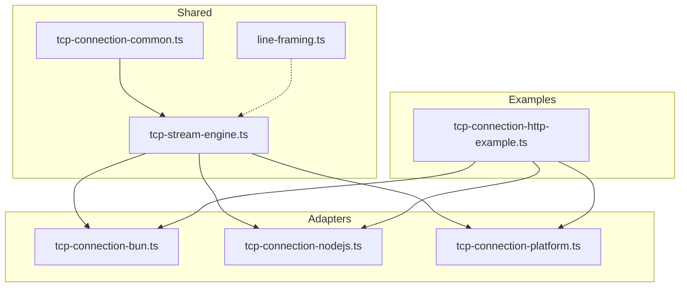
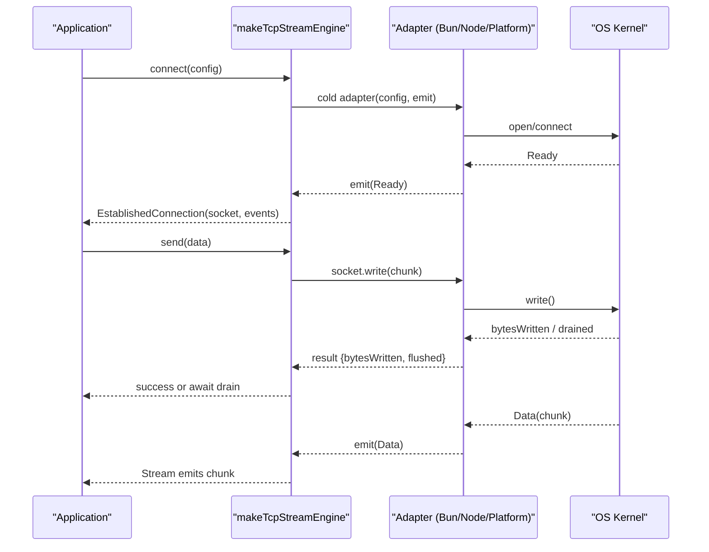
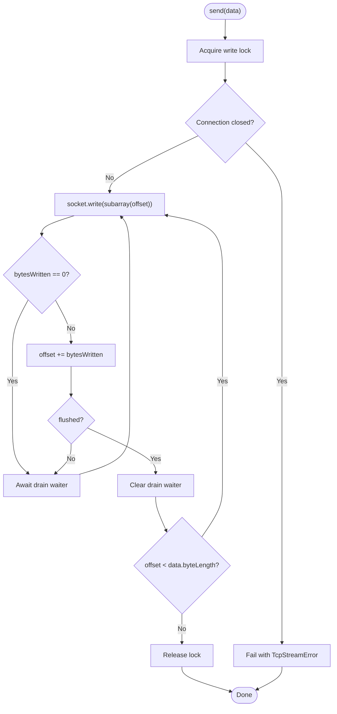
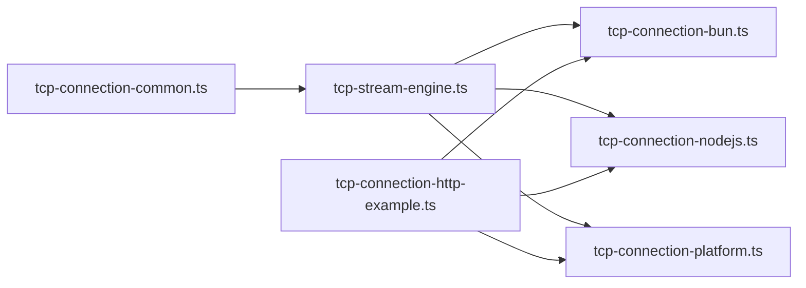

# Performance Optimization

<cite>
**Referenced Files in This Document**
- [tcp-stream-engine.ts](file://src/tcp-stream-engine.ts)
- [tcp-connection-common.ts](file://src/tcp-connection-common.ts)
- [tcp-connection-bun.ts](file://src/tcp-connection-bun.ts)
- [tcp-connection-nodejs.ts](file://src/tcp-connection-nodejs.ts)
- [tcp-connection-platform.ts](file://src/tcp-connection-platform.ts)
- [tcp-connection-http-example.ts](file://src/tcp-connection-http-example.ts)
- [line-framing.ts](file://src/line-framing.ts)
- [bun-tcp-connection-api.md](file://docs/research/bun-tcp-connection-api.md)
- [effect-v4-platform-tcp-connection.md](file://docs/research/effect-v4-platform-tcp-connection.md)
</cite>

## Table of Contents
1. [Introduction](#introduction)
2. [Project Structure](#project-structure)
3. [Core Components](#core-components)
4. [Architecture Overview](#architecture-overview)
5. [Detailed Component Analysis](#detailed-component-analysis)
6. [Dependency Analysis](#dependency-analysis)
7. [Performance Considerations](#performance-considerations)
8. [Troubleshooting Guide](#troubleshooting-guide)
9. [Conclusion](#conclusion)
10. [Appendices](#appendices)

## Introduction
This document explains performance optimization for TCP stream efficiency and resource management on the Effect v4 platform, focusing on connection lifecycle, backpressure handling, buffer management, memory usage, and stream processing. It also provides guidance for monitoring, profiling, benchmarking, and optimizing high-throughput and low-latency network operations across Bun, Node.js, and the Effect Platform socket abstractions.

## Project Structure
The TCP stack is organized around a shared engine abstraction with three runtime-specific adapters:
- Engine core: orchestrates connection lifecycle, retry policy, timeouts, and stream wiring.
- Adapters: Bun native sockets, Node.js net/tls, and Effect Platform Socket.Socket.
- Shared contracts: error types, configuration, retry scheduling, and the public TcpStream interface.
- Utilities: line framing and HTTP example programs used to exercise the stack.

**Diagram sources**
- [tcp-stream-engine.ts:1-359](file://src/tcp-stream-engine.ts#L1-L359)
- [tcp-connection-common.ts:1-101](file://src/tcp-connection-common.ts#L1-L101)
- [tcp-connection-bun.ts:1-145](file://src/tcp-connection-bun.ts#L1-L145)
- [tcp-connection-nodejs.ts:1-132](file://src/tcp-connection-nodejs.ts#L1-L132)
- [tcp-connection-platform.ts:1-135](file://src/tcp-connection-platform.ts#L1-L135)
- [tcp-connection-http-example.ts:1-301](file://src/tcp-connection-http-example.ts#L1-L301)
- [line-framing.ts:1-18](file://src/line-framing.ts#L1-L18)

**Section sources**
- [tcp-stream-engine.ts:1-359](file://src/tcp-stream-engine.ts#L1-L359)
- [tcp-connection-common.ts:1-101](file://src/tcp-connection-common.ts#L1-L101)
- [tcp-connection-bun.ts:1-145](file://src/tcp-connection-bun.ts#L1-L145)
- [tcp-connection-nodejs.ts:1-132](file://src/tcp-connection-nodejs.ts#L1-L132)
- [tcp-connection-platform.ts:1-135](file://src/tcp-connection-platform.ts#L1-L135)
- [tcp-connection-http-example.ts:1-301](file://src/tcp-connection-http-example.ts#L1-L301)
- [line-framing.ts:1-18](file://src/line-framing.ts#L1-L18)

## Core Components
- TcpStreamEngineShape and makeTcpStreamEngine: define the engine contract and build a caller-first connection pipeline that bridges adapter events into an Effect Stream.
- RawSocketHandle and RawSocketWriteResult: abstract per-adapter write semantics (bytes written, flushed status).
- TcpStream: the public service exposing a byte stream, send/sendText, and close.
- ConnectionConfig and retry scheduling: typed configuration with validation and default exponential jittered retry schedules.
- Adapter implementations: Bun, Node.js, and Platform adapters implement the cold adapter protocol and expose live layers.

Key responsibilities:
- Connect with timeout and optional retry.
- Translate adapter events (Ready/Data/Drain/Close/Error) into a typed stream.
- Serialize writes and handle partial writes/backpressure.
- Manage scoped lifecycle and clean teardown.

**Section sources**
- [tcp-stream-engine.ts:28-67](file://src/tcp-stream-engine.ts#L28-L67)
- [tcp-stream-engine.ts:88-178](file://src/tcp-stream-engine.ts#L88-L178)
- [tcp-stream-engine.ts:201-339](file://src/tcp-stream-engine.ts#L201-L339)
- [tcp-connection-common.ts:12-101](file://src/tcp-connection-common.ts#L12-L101)

## Architecture Overview
The system composes a generic engine with runtime-specific adapters. The engine owns the connection lifecycle, event fan-out, and write serialization; adapters provide the actual socket I/O.

**Diagram sources**
- [tcp-stream-engine.ts:88-178](file://src/tcp-stream-engine.ts#L88-L178)
- [tcp-stream-engine.ts:201-339](file://src/tcp-stream-engine.ts#L201-L339)
- [tcp-connection-bun.ts:18-135](file://src/tcp-connection-bun.ts#L18-L135)
- [tcp-connection-nodejs.ts:21-112](file://src/tcp-connection-nodejs.ts#L21-L112)
- [tcp-connection-platform.ts:17-128](file://src/tcp-connection-platform.ts#L17-L128)

## Detailed Component Analysis

### Engine Lifecycle and Backpressure
The engine coordinates:
- A bounded state machine for connecting/ready/closed phases.
- An unbounded queue bridging adapter events to a typed Stream.
- A Semaphore to serialize concurrent writes.
- Deferreds to coordinate drain readiness and connect readiness.
- Retry and timeout wrappers around the adapter’s connect attempt.

Backpressure model:
- Writes are serialized via a semaphore.
- If bytesWritten equals zero, the engine awaits a drain signal before continuing.
- If flushed is true, the drain waiter is cleared immediately; otherwise, it waits for Drain.
- Partial writes are handled by advancing an offset and looping until all bytes are sent.

**Diagram sources**
- [tcp-stream-engine.ts:300-332](file://src/tcp-stream-engine.ts#L300-L332)

**Section sources**
- [tcp-stream-engine.ts:88-178](file://src/tcp-stream-engine.ts#L88-L178)
- [tcp-stream-engine.ts:201-339](file://src/tcp-stream-engine.ts#L201-L339)

### Bun Adapter
Characteristics:
- Uses Bun.connect with binaryType set to Uint8Array for zero-copy-friendly reads.
- Emits Data/Drain/Close/Error through the adapter protocol.
- write returns bytesWritten and sets flushed based on whether the entire chunk was accepted.

Performance notes:
- Zero-copy writes when passing Uint8Array directly to socket.write.
- Explicit flush after write to ensure kernel acceptance where applicable.
- Drain events drive resumption of pending writes.

**Section sources**
- [tcp-connection-bun.ts:18-135](file://src/tcp-connection-bun.ts#L18-L135)
- [bun-tcp-connection-api.md:143-220](file://docs/research/bun-tcp-connection-api.md#L143-L220)
- [bun-tcp-connection-api.md:320-368](file://docs/research/bun-tcp-connection-api.md#L320-L368)

### Node.js Adapter
Characteristics:
- Wraps node:net and node:tls connections.
- Emits Data/Drain/Close/Error using event listeners.
- write wraps the underlying call in Effect.try and reports flushed from the boolean return value.

Performance notes:
- Data chunks may be strings or buffers; the adapter normalizes to Uint8Array.
- Drain events are propagated to the engine for backpressure coordination.

**Section sources**
- [tcp-connection-nodejs.ts:21-112](file://src/tcp-connection-nodejs.ts#L21-L112)

### Platform Adapter (@effect/platform Socket.Socket)
Characteristics:
- Uses @effect/platform-bun and unstable Socket.Socket.run to bridge push-based socket callbacks into Effect effects.
- Establishes a scoped writer and maps write results to RawSocketWriteResult.
- Manages a child scope for the run loop and ensures cleanup on exit.

Performance notes:
- Push-based event loop minimizes intermediate allocations compared to queuing every incoming chunk.
- Adds an extra layer of abstraction compared to native Bun wrappers.

**Section sources**
- [tcp-connection-platform.ts:17-128](file://src/tcp-connection-platform.ts#L17-L128)
- [effect-v4-platform-tcp-connection.md:442-454](file://docs/research/effect-v4-platform-tcp-connection.md#L442-L454)

### Shared Contracts and Configuration
- TcpStreamError and TcpStreamOperation: typed errors with operation context.
- ConnectionConfigShape: host, port, tls, retry, retrySchedule, connectTimeout.
- Validation enforces valid host/port ranges.
- Default retry schedule uses exponential backoff with jitter and configurable caps.

**Section sources**
- [tcp-connection-common.ts:12-101](file://src/tcp-connection-common.ts#L12-L101)

### Stream Processing Utilities
- frameLines: decodes raw bytes to text and splits lines, supporting multi-packet reassembly and batched emission.

Usage pattern:
- Apply frameLines to TcpStream.stream to obtain a stream of string lines.

**Section sources**
- [line-framing.ts:1-18](file://src/line-framing.ts#L1-L18)

### Example Program
- Demonstrates constructing ConnectionConfig from a URL, sending an HTTP request, collecting response chunks, and decoding UTF-8 incrementally.
- Provides CLI entry points for bun/nodejs/platform engines.

**Section sources**
- [tcp-connection-http-example.ts:149-205](file://src/tcp-connection-http-example.ts#L149-L205)
- [tcp-connection-http-example.ts:214-254](file://src/tcp-connection-http-example.ts#L214-L254)

## Dependency Analysis
The engine depends on shared contracts and is implemented by three adapters. The example program consumes the public TcpStream service.

**Diagram sources**
- [tcp-stream-engine.ts:1-359](file://src/tcp-stream-engine.ts#L1-L359)
- [tcp-connection-common.ts:1-101](file://src/tcp-connection-common.ts#L1-L101)
- [tcp-connection-bun.ts:1-145](file://src/tcp-connection-bun.ts#L1-L145)
- [tcp-connection-nodejs.ts:1-132](file://src/tcp-connection-nodejs.ts#L1-L132)
- [tcp-connection-platform.ts:1-135](file://src/tcp-connection-platform.ts#L1-L135)
- [tcp-connection-http-example.ts:1-301](file://src/tcp-connection-http-example.ts#L1-L301)

**Section sources**
- [tcp-stream-engine.ts:1-359](file://src/tcp-stream-engine.ts#L1-L359)
- [tcp-connection-common.ts:1-101](file://src/tcp-connection-common.ts#L1-L101)
- [tcp-connection-bun.ts:1-145](file://src/tcp-connection-bun.ts#L1-L145)
- [tcp-connection-nodejs.ts:1-132](file://src/tcp-connection-nodejs.ts#L1-L132)
- [tcp-connection-platform.ts:1-135](file://src/tcp-connection-platform.ts#L1-L135)
- [tcp-connection-http-example.ts:1-301](file://src/tcp-connection-http-example.ts#L1-L301)

## Performance Considerations

### Connection Pooling Strategies
- Current design creates one connection per TcpStream instance. There is no built-in pool.
- To pool connections:
  - Maintain a bounded pool keyed by host/port/TLS options.
  - Use a Queue.bounded or Queue.dropping to limit concurrency and memory.
  - On acquire, check idle connections; if none, create a new one with retry and timeout.
  - On release, validate liveness (e.g., ping or last activity timestamp); recycle healthy ones, discard stale ones.
  - Integrate with Effect Scope to ensure pooled resources are released on shutdown.
  - Monitor pool metrics: size, active, idle, creation rate, eviction rate, and error rates.

[No sources needed since this section provides general guidance]

### Buffer Management Techniques
- Prefer Uint8Array for zero-copy paths with Bun and avoid unnecessary copies between encoders/decoders.
- Batch small writes when possible to reduce syscall overhead, but respect backpressure signals.
- For streaming text, use frameLines to split lines efficiently without buffering entire responses.
- Avoid holding large buffers in memory; process chunks incrementally and release references promptly.

**Section sources**
- [line-framing.ts:1-18](file://src/line-framing.ts#L1-L18)
- [bun-tcp-connection-api.md:320-368](file://docs/research/bun-tcp-connection-api.md#L320-L368)

### Memory Optimization Patterns
- Use Stream.fromQueue only when necessary; consider pull-based adapters (Platform) to reduce intermediate allocations.
- Ensure finalizers close sockets and interrupt background fibers to prevent leaks.
- Avoid storing full responses in memory; decode incrementally and write downstream.

**Section sources**
- [tcp-connection-platform.ts:17-128](file://src/tcp-connection-platform.ts#L17-L128)
- [effect-v4-platform-tcp-connection.md:442-454](file://docs/research/effect-v4-platform-tcp-connection.md#L442-L454)

### Backpressure Handling Mechanisms
- Engine serializes writes and waits for Drain when bytesWritten is zero.
- Bun adapter emits Drain events; Node.js adapter propagates drain events; Platform adapter relies on its writer semantics.
- For high throughput, tune producer rates to match consumer consumption and avoid unbounded queues.

**Section sources**
- [tcp-stream-engine.ts:300-332](file://src/tcp-stream-engine.ts#L300-L332)
- [tcp-connection-bun.ts:18-135](file://src/tcp-connection-bun.ts#L18-L135)
- [tcp-connection-nodejs.ts:21-112](file://src/tcp-connection-nodejs.ts#L21-L112)

### Stream Processing Optimization
- Use frameLines for line-delimited protocols to minimize buffering and simplify parsing.
- For binary protocols, process chunks directly and avoid TextEncoder/TextDecoder unless required.
- Compose streams with map/filter/split to keep pipelines tight and avoid intermediate collections.

**Section sources**
- [line-framing.ts:1-18](file://src/line-framing.ts#L1-L18)

### Garbage Collection Considerations
- Minimize object churn by reusing buffers where safe and avoiding temporary arrays.
- Close connections promptly and ensure background fibers are interrupted to free resources.
- Prefer typed arrays and avoid string conversions when not necessary.

[No sources needed since this section provides general guidance]

### High-Throughput Scenarios and Latency Reduction
- Enable TCP_NODELAY (no delay) for latency-sensitive applications where supported by the adapter or underlying socket.
- Tune keep-alive settings to detect dead peers early.
- Use bounded queues to apply backpressure at the application level and prevent memory spikes.
- Benchmark different adapters to choose the best fit for your workload.

**Section sources**
- [bun-tcp-connection-api.md:320-368](file://docs/research/bun-tcp-connection-api.md#L320-L368)

## Troubleshooting Guide
Common issues and diagnostics:
- Connection timeouts: verify connectTimeout and retry configuration; inspect logs for TcpStreamError with operation "connect".
- Write stalls: check for missing Drain events or blocked consumers; ensure downstream is consuming the stream.
- Resource leaks: confirm that close is called and background fibers are interrupted; verify finalizers execute.
- TLS handshake failures: ensure correct TLS options and server name; tests demonstrate clean failure paths.

Operational checks:
- Validate host/port ranges using the provided validator.
- Inspect Cause for defects vs typed errors; the code surfaces TcpStreamError consistently.

**Section sources**
- [tcp-stream-engine.ts:180-195](file://src/tcp-stream-engine.ts#L180-L195)
- [tcp-connection-common.ts:65-88](file://src/tcp-connection-common.ts#L65-L88)

## Conclusion
The Effect v4 TCP stack provides a robust, cross-runtime foundation with clear separation between engine logic and adapter implementations. By leveraging the engine’s backpressure model, typed error handling, and scoped lifecycle management, you can build efficient, resilient networking components. For production workloads, adopt connection pooling, incremental processing, and careful buffer management, and measure performance across Bun, Node.js, and Platform adapters to select the optimal implementation for your scenario.

[No sources needed since this section summarizes without analyzing specific files]

## Appendices

### Monitoring and Profiling Approaches
- Metrics collection:
  - Count connect attempts, successes, retries, and failures.
  - Track bytes sent/received, queue sizes, and backpressure wait durations.
  - Record connection lifetimes and resource cleanup times.
- Profiling tools:
  - Use runtime profilers (e.g., CPU/memory profiles) to identify hotspots in write loops and stream processing.
  - Compare adapter overheads (Bun vs Node vs Platform) under load.
- Bottleneck identification:
  - Correlate slow writes with Drain frequency and consumer throughput.
  - Inspect GC pauses and allocation rates during high-throughput bursts.

[No sources needed since this section provides general guidance]

### Benchmarking Methodologies
- Workload design:
  - Small messages at high QPS to test latency and CPU overhead.
  - Large payloads to test throughput and memory pressure.
  - Mixed read/write patterns to evaluate backpressure behavior.
- Comparison matrix:
  - Measure p50/p95/p99 latency, throughput (MB/s), GC pause time, and memory footprint.
  - Run each benchmark multiple times and report medians with confidence intervals.
- Reproducibility:
  - Pin runtime versions and OS parameters.
  - Isolate network conditions and use local echo servers for controlled testing.

[No sources needed since this section provides general guidance]