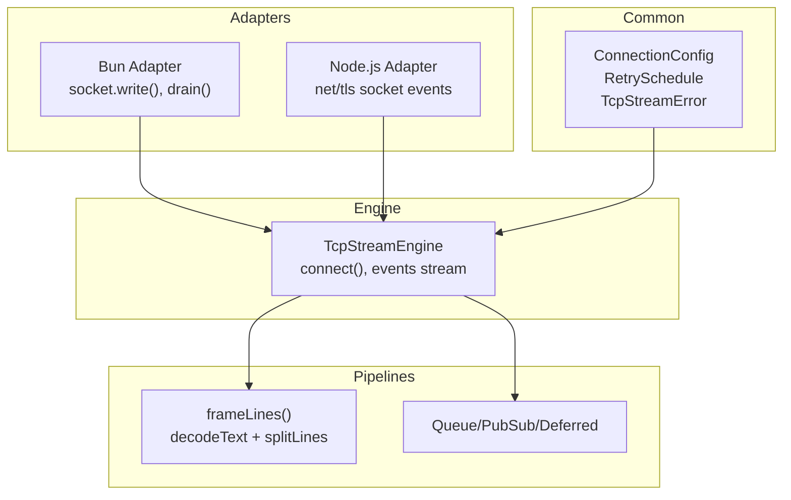
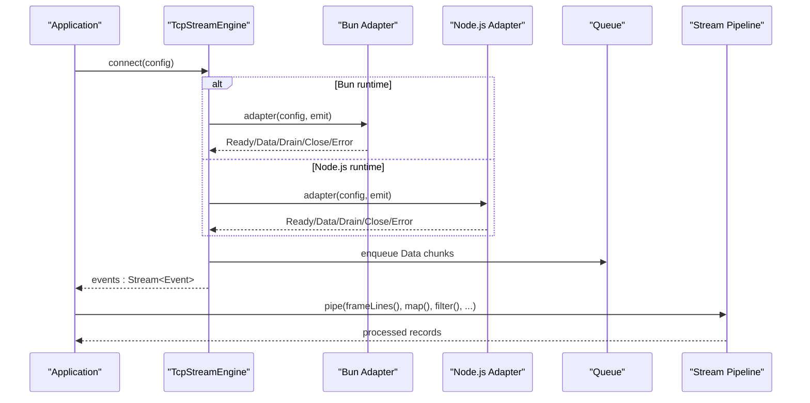
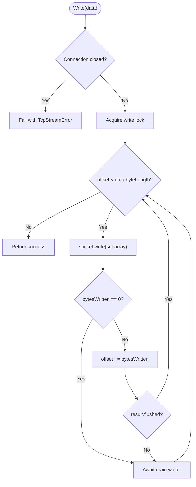
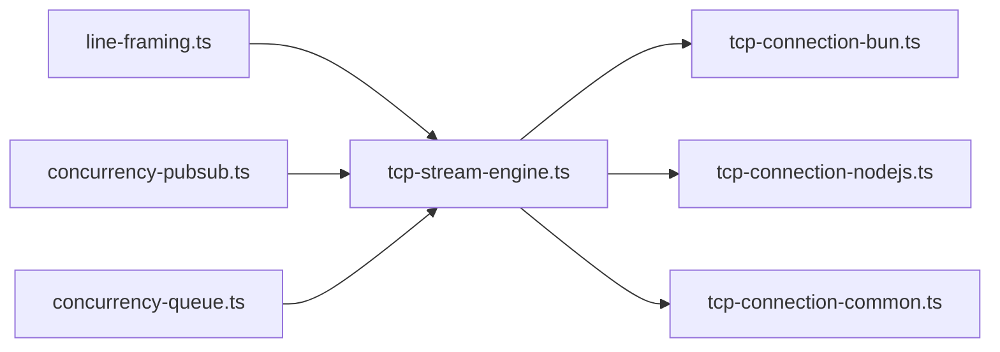
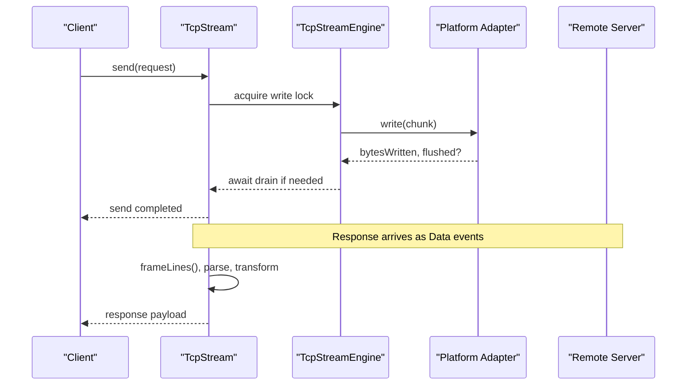

# Stream Processing Optimization

<cite>
**Referenced Files in This Document**
- [tcp-stream-engine.ts](file://src/tcp-stream-engine.ts)
- [tcp-connection-common.ts](file://src/tcp-connection-common.ts)
- [tcp-connection-bun.ts](file://src/tcp-connection-bun.ts)
- [tcp-connection-nodejs.ts](file://src/tcp-connection-nodejs.ts)
- [line-framing.ts](file://src/line-framing.ts)
- [concurrency-pubsub.ts](file://src/concurrency-pubsub.ts)
- [concurrency-queue.ts](file://src/concurrency-queue.ts)
- [control-flow-operators.ts](file://src/control-flow-operators.ts)
- [effect-v4-platform-tcp-connection.md](file://docs/research/effect-v4-platform-tcp-connection.md)
- [bun-tcp-connection-api.md](file://docs/research/bun-tcp-connection-api.md)
</cite>

## Table of Contents
1. [Introduction](#introduction)
2. [Project Structure](#project-structure)
3. [Core Components](#core-components)
4. [Architecture Overview](#architecture-overview)
5. [Detailed Component Analysis](#detailed-component-analysis)
6. [Dependency Analysis](#dependency-analysis)
7. [Performance Considerations](#performance-considerations)
8. [Troubleshooting Guide](#troubleshooting-guide)
9. [Conclusion](#conclusion)
10. [Appendices](#appendices)

## Introduction
This document provides a comprehensive guide to optimizing stream processing for throughput maximization and latency reduction using the repository’s Effect-based TCP streaming stack. It covers stream composition patterns, operator chaining optimization, concurrent processing strategies, backpressure-aware processing, batch processing techniques, parallel stream execution, performance monitoring, bottleneck identification, throughput measurement, memory-efficient processing patterns, and practical examples for filtering, mapping, and transformation chains.

## Project Structure
The codebase implements a unified TCP stream engine with platform-specific adapters (Bun and Node.js), shared contracts and error types, and utilities for framing and concurrency primitives. The key modules are:
- Engine orchestration and lifecycle management
- Platform adapters bridging native sockets to a uniform interface
- Shared configuration, validation, retry scheduling, and error modeling
- Framing utilities to transform raw byte streams into text lines
- Concurrency primitives (queues, pub/sub, deferreds) used by pipelines
- Control flow operators for parallelism and batching

**Diagram sources**
- [tcp-stream-engine.ts:89-177](file://src/tcp-stream-engine.ts#L89-L177)
- [tcp-connection-bun.ts:18-135](file://src/tcp-connection-bun.ts#L18-L135)
- [tcp-connection-nodejs.ts:21-118](file://src/tcp-connection-nodejs.ts#L21-L118)
- [tcp-connection-common.ts:12-100](file://src/tcp-connection-common.ts#L12-L100)
- [line-framing.ts:15-17](file://src/line-framing.ts#L15-L17)

**Section sources**
- [tcp-stream-engine.ts:89-177](file://src/tcp-stream-engine.ts#L89-L177)
- [tcp-connection-bun.ts:18-135](file://src/tcp-connection-bun.ts#L18-L135)
- [tcp-connection-nodejs.ts:21-118](file://src/tcp-connection-nodejs.ts#L21-L118)
- [tcp-connection-common.ts:12-100](file://src/tcp-connection-common.ts#L12-L100)
- [line-framing.ts:15-17](file://src/line-framing.ts#L15-L17)

## Core Components
- TcpStreamEngine: Orchestrates connection lifecycle, event emission, backpressure signaling, and exposes a typed Stream of events and a write handle.
- Platform Adapters: Map native socket semantics (Bun or Node.js) to a uniform RawSocketHandle contract with write and close effects.
- Shared Contracts: Define errors, configuration, retry schedules, and the TcpStream service shape.
- Framing: Transforms raw byte streams into line-delimited text streams efficiently.
- Concurrency Primitives: Queues, PubSub, and Deferreds enable backpressure, fan-out, and synchronization across fibers.

Key responsibilities:
- Backpressure-aware writes via drain events and semaphores
- Safe teardown and error propagation
- Configurable retries with jittered exponential backoff
- Memory-conscious framing and streaming

**Section sources**
- [tcp-stream-engine.ts:89-177](file://src/tcp-stream-engine.ts#L89-L177)
- [tcp-connection-bun.ts:18-135](file://src/tcp-connection-bun.ts#L18-L135)
- [tcp-connection-nodejs.ts:21-118](file://src/tcp-connection-nodejs.ts#L21-L118)
- [tcp-connection-common.ts:12-100](file://src/tcp-connection-common.ts#L12-L100)
- [line-framing.ts:15-17](file://src/line-framing.ts#L15-L17)

## Architecture Overview
The system composes a pull-based Stream from push-based socket events, applying framing and user-defined transformations while preserving backpressure and safe resource cleanup.

**Diagram sources**
- [tcp-stream-engine.ts:89-177](file://src/tcp-stream-engine.ts#L89-L177)
- [tcp-connection-bun.ts:18-135](file://src/tcp-connection-bun.ts#L18-L135)
- [tcp-connection-nodejs.ts:21-118](file://src/tcp-connection-nodejs.ts#L21-L118)
- [line-framing.ts:15-17](file://src/line-framing.ts#L15-L17)

## Detailed Component Analysis

### Stream Composition Patterns
- Raw bytes to text lines: Use decodeText followed by splitLines to reassemble partial lines and emit complete lines. This is efficient and avoids manual buffering.
- Event-driven ingestion: The engine emits Data events that are enqueued into an unbounded queue and exposed as a Stream. Consumers can apply any combination of map, filter, scan, groupBy, etc., to build pipelines.
- Fan-out and sharing: Convert PubSub subscriptions to Streams to broadcast data to multiple consumers without duplication.

Optimization tips:
- Keep transformations lazy; avoid eager collection unless necessary.
- Prefer streaming APIs over collecting intermediate arrays.
- Use bounded queues where possible to apply backpressure at boundaries.

**Section sources**
- [line-framing.ts:15-17](file://src/line-framing.ts#L15-L17)
- [tcp-stream-engine.ts:201-339](file://src/tcp-stream-engine.ts#L201-L339)
- [concurrency-pubsub.ts:72-95](file://src/concurrency-pubsub.ts#L72-L95)

### Operator Chaining Optimization
- Compose small, focused operators: Each operator should do one thing (e.g., decode, split, parse JSON, validate).
- Avoid unnecessary materialization: Do not collect into arrays inside hot paths; use streaming reductions when needed.
- Batch-friendly transforms: For CPU-bound parsing, consider chunk-wise batching before heavy work to amortize overhead.

Example pipeline pattern:
- Ingest bytes -> decodeText -> splitLines -> parseLine -> validate -> transform -> aggregate

**Section sources**
- [line-framing.ts:15-17](file://src/line-framing.ts#L15-L17)
- [control-flow-operators.ts:1-62](file://src/control-flow-operators.ts#L1-L62)

### Concurrent Processing Strategies
- Fiber-based concurrency: Fork producer and consumer fibers to overlap I/O and CPU work.
- Controlled concurrency: Use concurrency limits on forEach or custom workers to prevent overload.
- Coordination with Deferreds: Coordinate completion signals between producers and consumers.

Practical patterns:
- Producer publishes messages to PubSub; consumer subscribes via Stream.fromPubSub and processes in batches.
- Use Queue.bounded to enforce backpressure between fast producers and slower consumers.

**Section sources**
- [concurrency-pubsub.ts:72-95](file://src/concurrency-pubsub.ts#L72-L95)
- [concurrency-queue.ts:28-87](file://src/concurrency-queue.ts#L28-L87)
- [concurrency-deferred.ts:35-62](file://src/concurrency-deferred.ts#L35-L62)

### Backpressure-Aware Processing
- Write path: The engine uses a Semaphore to serialize writes and waits for drain events before continuing when the underlying socket reports zero bytes written. This prevents unbounded memory growth during bursts.
- Read path: Incoming data is enqueued into a Queue; downstream consumption pulls at its own pace. If downstream slows, upstream can be throttled by adjusting producer rates or using bounded queues.

**Diagram sources**
- [tcp-stream-engine.ts:300-332](file://src/tcp-stream-engine.ts#L300-L332)

**Section sources**
- [tcp-stream-engine.ts:300-332](file://src/tcp-stream-engine.ts#L300-L332)
- [bun-tcp-connection-api.md:161-226](file://docs/research/bun-tcp-connection-api.md#L161-L226)

### Batch Processing Techniques
- Frame lines: splitLines naturally batches multiple lines per chunk, reducing per-line overhead.
- Consumer batching: Group elements by time or size before CPU-intensive operations (e.g., JSON parsing, DB writes).
- Bounded queues: Use Queue.bounded to create natural batching windows when combined with periodic flushes.

**Section sources**
- [line-framing.ts:15-17](file://src/line-framing.ts#L15-L17)
- [concurrency-queue.ts:28-87](file://src/concurrency-queue.ts#L28-L87)

### Parallel Stream Execution
- Parallelize independent tasks: Use Effect.all or Effect.forEach with concurrency controls to process items concurrently.
- Combine with streams: Transform a Stream into batches and process each batch in parallel with controlled concurrency.

**Section sources**
- [control-flow-operators.ts:1-62](file://src/control-flow-operators.ts#L1-L62)

### Memory-Efficient Stream Processing
- Avoid large intermediate collections: Stream instead of collectAll in hot paths.
- Reuse buffers: When possible, avoid copying chunks; slice views where supported.
- Drain promptly: Ensure consumers keep up to prevent queue buildup.

Notes from research:
- The custom TcpStream routes incoming chunks into an unbounded Queue, which can increase memory usage if consumers lag. Consider bounded queues or backpressure-aware producers to mitigate.

**Section sources**
- [effect-v4-platform-tcp-connection.md:442-454](file://docs/research/effect-v4-platform-tcp-connection.md#L442-L454)

### Optimizing Common Operations
- Filtering: Apply filters early to reduce downstream work.
- Mapping: Keep mappings pure and lightweight; defer heavy computations until necessary.
- Transformation chains: Compose small operators; prefer streaming reductions over collecting intermediates.

Examples in this codebase:
- Line framing pipeline demonstrates decoding and splitting in a single chain.
- Control flow operators show parallel mapping and aggregation patterns.

**Section sources**
- [line-framing.ts:15-17](file://src/line-framing.ts#L15-L17)
- [control-flow-operators.ts:1-62](file://src/control-flow-operators.ts#L1-L62)

## Dependency Analysis
The engine depends on platform adapters and shared configuration. Adapters implement the RawSocketHandle contract and emit standardized events consumed by the engine.

**Diagram sources**
- [tcp-stream-engine.ts:89-177](file://src/tcp-stream-engine.ts#L89-L177)
- [tcp-connection-bun.ts:18-135](file://src/tcp-connection-bun.ts#L18-L135)
- [tcp-connection-nodejs.ts:21-118](file://src/tcp-connection-nodejs.ts#L21-L118)
- [tcp-connection-common.ts:12-100](file://src/tcp-connection-common.ts#L12-L100)
- [line-framing.ts:15-17](file://src/line-framing.ts#L15-L17)
- [concurrency-pubsub.ts:72-95](file://src/concurrency-pubsub.ts#L72-L95)
- [concurrency-queue.ts:28-87](file://src/concurrency-queue.ts#L28-L87)

**Section sources**
- [tcp-stream-engine.ts:89-177](file://src/tcp-stream-engine.ts#L89-L177)
- [tcp-connection-bun.ts:18-135](file://src/tcp-connection-bun.ts#L18-L135)
- [tcp-connection-nodejs.ts:21-118](file://src/tcp-connection-nodejs.ts#L21-L118)
- [tcp-connection-common.ts:12-100](file://src/tcp-connection-common.ts#L12-L100)

## Performance Considerations
- Throughput maximization:
  - Use frameLines to batch line emissions and reduce per-item overhead.
  - Process in parallel with controlled concurrency to utilize CPU cores.
  - Minimize allocations in hot paths; reuse buffers and avoid copies.
- Latency reduction:
  - Keep pipelines shallow and avoid blocking operations in the main stream path.
  - Use drain-aware writes to prevent stalls and ensure timely delivery.
  - Prefer streaming reductions over collecting results.
- Backpressure:
  - Use bounded queues between producers and consumers to prevent memory spikes.
  - Respect drain events and pause producers when the sink cannot keep up.
- Monitoring and measurement:
  - Instrument key points: bytes in/out, queue sizes, processing durations, and error rates.
  - Measure end-to-end latency and per-operator latency to identify bottlenecks.
  - Track throughput as items/sec and bytes/sec under load.

[No sources needed since this section provides general guidance]

## Troubleshooting Guide
Common issues and remedies:
- Connection timeouts: Configure connectTimeout and verify network reachability.
- Retry behavior: Adjust retry policy (initialDelay, factor, maxAttempts, jitter) to match environment characteristics.
- Write stalls: Ensure drain handling is correct; check for zero-byte writes and waiting on drain waiters.
- Memory pressure: Switch from unbounded to bounded queues; monitor queue sizes; add backpressure at producers.
- Errors: Inspect TcpStreamError details (operation, message, cause) to pinpoint failures in connect, read, or write phases.

**Section sources**
- [tcp-connection-common.ts:12-100](file://src/tcp-connection-common.ts#L12-L100)
- [tcp-stream-engine.ts:180-195](file://src/tcp-stream-engine.ts#L180-L195)
- [tcp-stream-engine.ts:300-332](file://src/tcp-stream-engine.ts#L300-L332)

## Conclusion
This codebase provides a robust, backpressure-aware TCP streaming foundation built on Effect. By composing efficient stream pipelines, leveraging concurrency primitives, and carefully managing backpressure and memory, you can achieve high throughput and low latency. Use the provided patterns for framing, batching, and parallel processing, and instrument your pipelines to continuously optimize performance.

[No sources needed since this section summarizes without analyzing specific files]

## Appendices

### Appendix A: End-to-End Sequence for a Request/Response Flow

**Diagram sources**
- [tcp-stream-engine.ts:300-332](file://src/tcp-stream-engine.ts#L300-L332)
- [tcp-connection-bun.ts:18-135](file://src/tcp-connection-bun.ts#L18-L135)
- [tcp-connection-nodejs.ts:21-118](file://src/tcp-connection-nodejs.ts#L21-L118)
- [line-framing.ts:15-17](file://src/line-framing.ts#L15-L17)

### Appendix B: Key Configuration Options
- ConnectionConfigShape fields: host, port, tls, retry, retrySchedule, connectTimeout
- RetryPolicyConfig fields: initialDelay, factor, maxAttempts, maxDuration, jitter

Use these to tune reliability and performance based on your deployment environment.

**Section sources**
- [tcp-connection-common.ts:37-100](file://src/tcp-connection-common.ts#L37-L100)