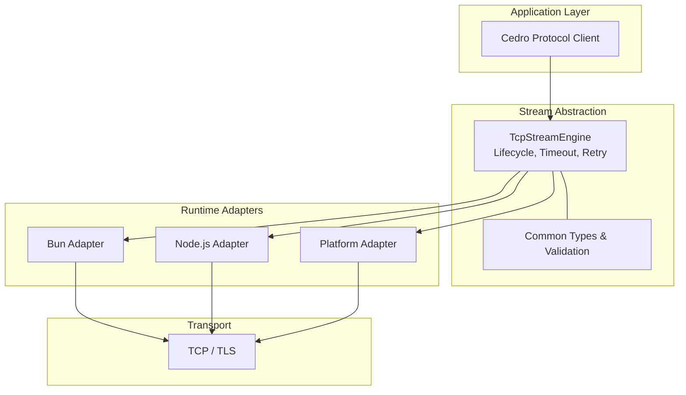
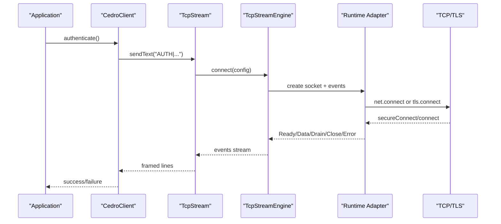
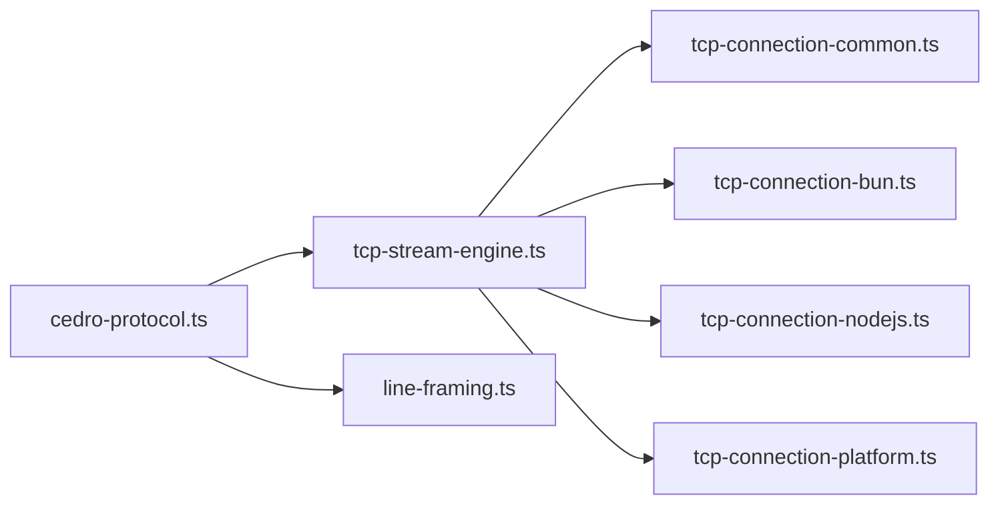

# Security Considerations

<cite>
**Referenced Files in This Document**
- [tcp-connection.ts](file://src/tcp-connection.ts)
- [tcp-stream-engine.ts](file://src/tcp-stream-engine.ts)
- [tcp-connection-common.ts](file://src/tcp-connection-common.ts)
- [tcp-connection-bun.ts](file://src/tcp-connection-bun.ts)
- [tcp-connection-nodejs.ts](file://src/tcp-connection-nodejs.ts)
- [tcp-connection-platform.ts](file://src/tcp-connection-platform.ts)
- [cedro-protocol.ts](file://src/cedro-protocol.ts)
- [line-framing.ts](file://src/line-framing.ts)
- [tcp-connection-test-suite.ts](file://src/tcp-connection-test-suite.ts)
- [bun-tcp-connection-api.md](file://docs/research/bun-tcp-connection-api.md)
</cite>

## Table of Contents
1. Introduction
2. Project Structure
3. Core Components
4. Architecture Overview
5. Detailed Component Analysis
6. Dependency Analysis
7. Performance Considerations
8. Troubleshooting Guide
9. Conclusion
10. Appendices

## Introduction
This document provides security-focused guidance for the TCP communication and protocol implementation in this repository. It covers secure transport configuration, certificate management, encryption best practices, input validation, injection prevention, authentication patterns, denial-of-service mitigations, attack surface analysis, security testing methodologies, and secure defaults. The goal is to help developers implement robust, secure TCP clients and protocols while minimizing risk across Bun, Node.js, and platform adapters.

## Project Structure
The project implements a unified TCP stream abstraction with three runtime-specific adapters (Bun, Node.js, Platform), a shared engine that manages connection lifecycle and backpressure, and a higher-level protocol client over framed lines.

**Diagram sources**
- [tcp-stream-engine.ts:88-178](file://src/tcp-stream-engine.ts#L88-L178)
- [tcp-connection-bun.ts:18-135](file://src/tcp-connection-bun.ts#L18-L135)
- [tcp-connection-nodejs.ts:21-112](file://src/tcp-connection-nodejs.ts#L21-L112)
- [tcp-connection-platform.ts:17-119](file://src/tcp-connection-platform.ts#L17-L119)
- [tcp-connection-common.ts:45-88](file://src/tcp-connection-common.ts#L45-L88)

**Section sources**
- [tcp-connection.ts:1-10](file://src/tcp-connection.ts#L1-L10)
- [tcp-stream-engine.ts:88-178](file://src/tcp-stream-engine.ts#L88-L178)
- [tcp-connection-common.ts:45-88](file://src/tcp-connection-common.ts#L45-L88)

## Core Components
- TcpStreamEngine: Central orchestrator for connecting, event dispatching, timeouts, retries, and resource cleanup.
- Runtime Adapters: Bun, Node.js, and Platform implementations wrapping native sockets and TLS.
- Common Contracts: Shared types, error definitions, host/port validation, retry schedule builder, and configuration services.
- Cedro Protocol Client: Framed-line protocol client performing authentication and subscription commands.
- Line Framing: Utility to split raw byte streams into text lines safely.

Key security-relevant responsibilities:
- Enforcing TLS where required and validating connection options.
- Validating inputs (host, port, credentials).
- Managing connection lifecycles to prevent leaks and ensure clean teardown.
- Handling backpressure and partial writes to avoid memory growth.
- Providing bounded retries and timeouts to mitigate DoS.

**Section sources**
- [tcp-stream-engine.ts:88-178](file://src/tcp-stream-engine.ts#L88-L178)
- [tcp-connection-common.ts:45-100](file://src/tcp-connection-common.ts#L45-L100)
- [cedro-protocol.ts:40-96](file://src/cedro-protocol.ts#L40-L96)
- [line-framing.ts:1-18](file://src/line-framing.ts#L1-L18)

## Architecture Overview
The system composes layers: application code depends on the Cedro protocol client, which depends on the TcpStream service. The service uses an engine that adapts to the selected runtime. TLS can be enabled per connection via configuration.

**Diagram sources**
- [cedro-protocol.ts:40-96](file://src/cedro-protocol.ts#L40-L96)
- [tcp-stream-engine.ts:88-178](file://src/tcp-stream-engine.ts#L88-L178)
- [tcp-connection-nodejs.ts:74-101](file://src/tcp-connection-nodejs.ts#L74-L101)
- [tcp-connection-bun.ts:56-87](file://src/tcp-connection-bun.ts#L56-L87)
- [tcp-connection-platform.ts:21-48](file://src/tcp-connection-platform.ts#L21-L48)

## Detailed Component Analysis

### Secure Transport and TLS Configuration
- TLS selection:
  - Node.js adapter chooses between `net.createConnection` and `tls.connect` based on the `tls` configuration field.
  - Platform adapter wraps `tls.connect` through platform abstractions when TLS is enabled.
  - Bun adapter passes TLS options directly to `Bun.connect`.
- Certificate verification:
  - Tests demonstrate enabling TLS with `rejectUnauthorized: false` for self-signed certificates during local testing.
  - Production should enforce strict certificate validation by not disabling verification unless explicitly justified.
- ALPN and other TLS fields:
  - Research documentation describes TLS options such as ALPN protocols, CA bundles, and dynamic TLS upgrade capabilities available at the platform level.

Recommendations:
- Always enable TLS for sensitive endpoints; configure appropriate CA bundles and server name indicators.
- Avoid disabling certificate verification in production.
- Use ALPN only when required by the server.
- Prefer explicit TLS options rather than relying on environment variables.

**Section sources**
- [tcp-connection-nodejs.ts:74-101](file://src/tcp-connection-nodejs.ts#L74-L101)
- [tcp-connection-platform.ts:21-48](file://src/tcp-connection-platform.ts#L21-L48)
- [tcp-connection-bun.ts:56-87](file://src/tcp-connection-bun.ts#L56-L87)
- [tcp-connection-test-suite.ts:538-543](file://src/tcp-connection-test-suite.ts#L538-L543)
- [bun-tcp-connection-api.md:231-283](file://docs/research/bun-tcp-connection-api.md#L231-L283)

### Input Validation and Injection Prevention
- Host and port validation:
  - Validates that the port is an integer within the valid range and that the host is non-empty.
- Credential formatting:
  - The protocol client validates presence of required credentials before constructing messages.
- Message framing:
  - Raw bytes are decoded to UTF-8 and split into lines using a safe line-splitting utility.

Recommendations:
- Validate all external inputs at boundaries (configuration, user-provided tickers, etc.).
- Escape or sanitize data before embedding it into protocol frames.
- Reject empty or malformed credentials early to reduce attack surface.

**Section sources**
- [tcp-connection-common.ts:65-88](file://src/tcp-connection-common.ts#L65-L88)
- [cedro-protocol.ts:45-58](file://src/cedro-protocol.ts#L45-L58)
- [line-framing.ts:1-18](file://src/line-framing.ts#L1-L18)

### Authentication and Authorization Patterns
- Current pattern:
  - The Cedro client sends an authentication command containing a magic token, username, and password over the TCP stream.
- Token handling:
  - Credentials are passed through configuration and formatted into a single frame.
- Session management:
  - The current implementation does not implement session tokens or refresh flows; it relies on the underlying TCP connection lifecycle.

Recommendations:
- Treat credentials as secrets; load them from secure secret stores.
- Implement short-lived tokens and rotation mechanisms at the protocol layer.
- Add mutual TLS (mTLS) where supported to strengthen identity verification.
- Log authentication outcomes without logging sensitive values.

**Section sources**
- [cedro-protocol.ts:40-96](file://src/cedro-protocol.ts#L40-L96)
- [tcp-connection-common.ts:45-57](file://src/tcp-connection-common.ts#L45-L57)

### Backpressure, Partial Writes, and Memory Safety
- Write behavior:
  - Bun adapter handles partial writes and flush semantics; Node.js adapter reports write results; Platform adapter maps writer effects to uniform results.
- Backpressure handling:
  - The engine coordinates drain events and deferred waiters to avoid unbounded buffering.
- Byte slicing:
  - Data events copy chunks to prevent mutation issues.

Recommendations:
- Respect backpressure signals and pause producers when buffers fill.
- Bound buffer sizes and monitor memory usage under load.
- Avoid large synchronous allocations; prefer streaming and chunked processing.

**Section sources**
- [tcp-stream-engine.ts:106-138](file://src/tcp-stream-engine.ts#L106-L138)
- [tcp-stream-engine.ts:300-332](file://src/tcp-stream-engine.ts#L300-L332)
- [tcp-connection-bun.ts:95-115](file://src/tcp-connection-bun.ts#L95-L115)
- [tcp-connection-nodejs.ts:45-61](file://src/tcp-connection-nodejs.ts#L45-L61)
- [tcp-connection-platform.ts:85-102](file://src/tcp-connection-platform.ts#L85-L102)

### Connection Lifecycle, Timeouts, and Retries
- Connect timeout:
  - A configurable timeout wraps connection attempts to prevent hanging.
- Retry policy:
  - Default exponential backoff with jitter and upper bounds; supports custom schedules.
- Resource cleanup:
  - Acquire/release patterns ensure sockets close even on interruption or failure.

Recommendations:
- Configure reasonable timeouts and retry limits to mitigate slowloris-style attacks.
- Ensure retries do not amplify load on failing endpoints.
- Verify cleanup paths under stress and interruption scenarios.

**Section sources**
- [tcp-stream-engine.ts:180-195](file://src/tcp-stream-engine.ts#L180-L195)
- [tcp-stream-engine.ts:252-260](file://src/tcp-stream-engine.ts#L252-L260)
- [tcp-connection-common.ts:90-100](file://src/tcp-connection-common.ts#L90-L100)

### Error Handling and Observability
- Errors are wrapped as typed errors with operation context and cause information.
- Test suite asserts failures are clean (no defects) and bounded in time.

Recommendations:
- Surface actionable error messages without leaking internals.
- Correlate logs with request IDs and connection identifiers.
- Monitor error rates and latency percentiles.

**Section sources**
- [tcp-connection-common.ts:12-24](file://src/tcp-connection-common.ts#L12-L24)
- [tcp-connection-test-suite.ts:424-445](file://src/tcp-connection-test-suite.ts#L424-L445)

## Dependency Analysis
The following diagram shows how components depend on each other and where security controls are applied.

**Diagram sources**
- [cedro-protocol.ts:1-4](file://src/cedro-protocol.ts#L1-L4)
- [tcp-stream-engine.ts:1-24](file://src/tcp-stream-engine.ts#L1-L24)
- [tcp-connection-bun.ts:1-16](file://src/tcp-connection-bun.ts#L1-L16)
- [tcp-connection-nodejs.ts:1-18](file://src/tcp-connection-nodejs.ts#L1-L18)
- [tcp-connection-platform.ts:1-15](file://src/tcp-connection-platform.ts#L1-L15)
- [line-framing.ts:1-2](file://src/line-framing.ts#L1-L2)

**Section sources**
- [cedro-protocol.ts:1-4](file://src/cedro-protocol.ts#L1-L4)
- [tcp-stream-engine.ts:1-24](file://src/tcp-stream-engine.ts#L1-L24)
- [tcp-connection-common.ts:1-10](file://src/tcp-connection-common.ts#L1-L10)

## Performance Considerations
- TLS overhead:
  - Handshake costs and cipher suites impact latency; choose efficient ciphers and reuse sessions where applicable.
- Buffering:
  - Minimize unnecessary copies; use streaming APIs and respect backpressure.
- Retry tuning:
  - Exponential backoff with jitter reduces thundering herds; cap attempts and durations.
- Low-memory mode:
  - Some platforms support low-memory modes to reduce per-socket memory retention.

[No sources needed since this section provides general guidance]

## Troubleshooting Guide
Common issues and mitigations:
- TLS handshake failures:
  - Verify server certificate chain, hostname, and ALPN settings.
  - In tests, `rejectUnauthorized: false` is used for self-signed certs; do not replicate in production.
- Connection hangs:
  - Check connect timeouts and retry policies; ensure cleanup on interruption.
- Unexpected data loss:
  - Confirm backpressure handling and drain events are respected.
- Protocol parsing errors:
  - Validate message framing and encoding; inspect raw streams during debugging.

Operational checks:
- Assert that failed connections do not leak resources.
- Validate that interruptions terminate promptly and cleanly.
- Monitor handshake latency and error rates.

**Section sources**
- [tcp-connection-test-suite.ts:581-623](file://src/tcp-connection-test-suite.ts#L581-L623)
- [tcp-connection-test-suite.ts:724-797](file://src/tcp-connection-test-suite.ts#L724-L797)
- [tcp-stream-engine.ts:180-195](file://src/tcp-stream-engine.ts#L180-L195)

## Conclusion
Secure TCP communication in this codebase hinges on proper TLS configuration, strict input validation, robust connection lifecycle management, and careful handling of backpressure and retries. The layered architecture enables consistent security controls across runtimes. By enforcing TLS by default, validating inputs, limiting retries and timeouts, and adopting strong authentication patterns (including mTLS and token rotation), teams can significantly reduce exposure to common attack vectors. Comprehensive testing, including TLS and interruption scenarios, ensures resilience under adverse conditions.

[No sources needed since this section summarizes without analyzing specific files]

## Appendices

### Security Testing Methodologies
- Unit tests validate credential validation and message framing.
- Integration tests exercise retry policies, graceful closes, and interruption safety.
- TLS tests cover both successful handshakes and protocol mismatches.

Recommended additions:
- Fuzzing of protocol frames and configuration inputs.
- Chaos testing for network partitions and server restarts.
- Penetration testing focusing on injection and replay attacks.

**Section sources**
- [tcp-connection-test-suite.ts:213-306](file://src/tcp-connection-test-suite.ts#L213-L306)
- [tcp-connection-test-suite.ts:388-445](file://src/tcp-connection-test-suite.ts#L388-L445)
- [tcp-connection-test-suite.ts:447-623](file://src/tcp-connection-test-suite.ts#L447-L623)

### Secure Defaults and Security Headers Guidance
- Defaults:
  - Enable TLS for all sensitive endpoints.
  - Enforce certificate verification.
  - Set conservative connect timeouts and bounded retries.
- Protocol headers:
  - For HTTP-over-TCP scenarios, apply security headers (e.g., HSTS, CSP) at the HTTP layer.
- Secrets:
  - Load credentials from secure secret stores; never hardcode or log them.

[No sources needed since this section provides general guidance]