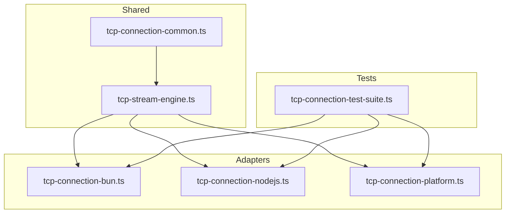
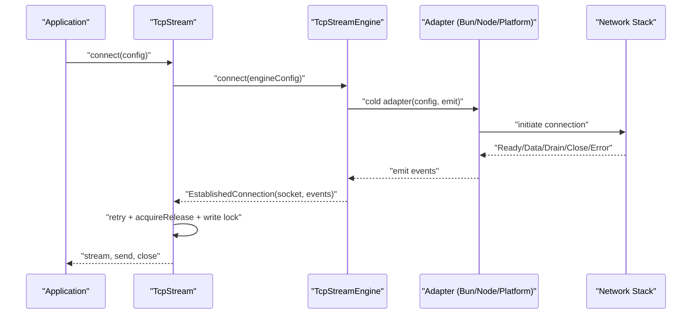
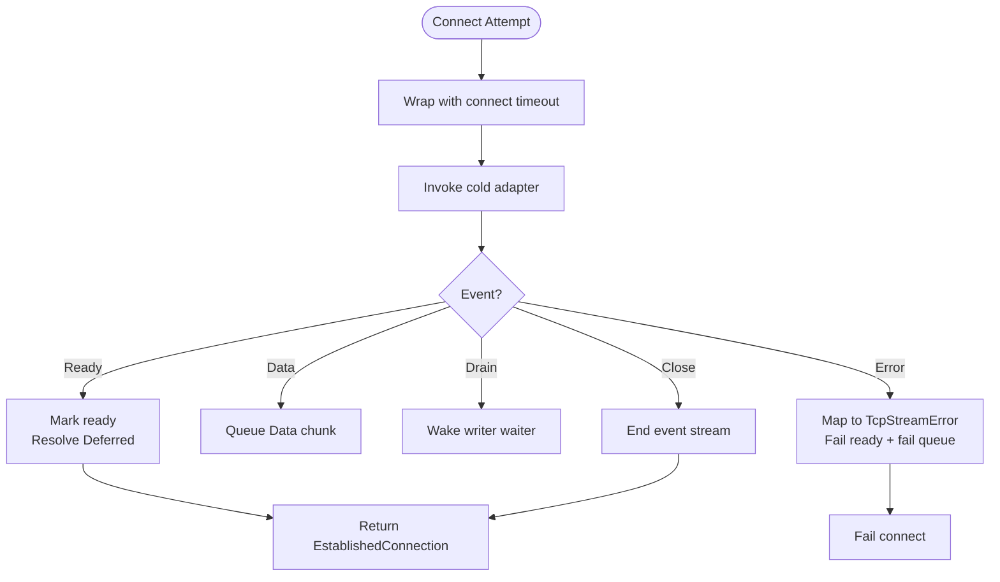
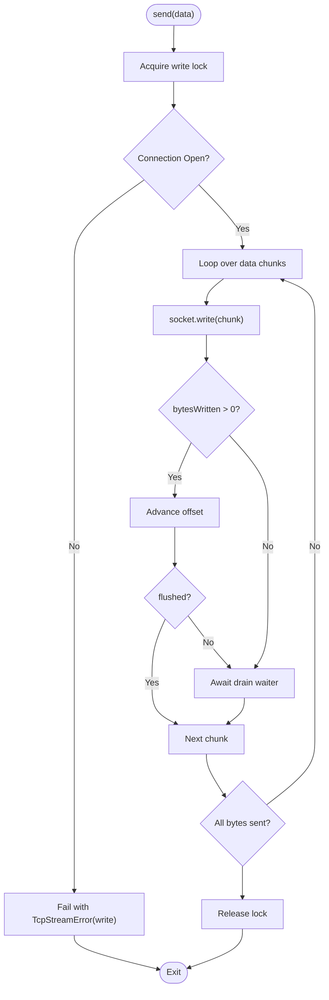
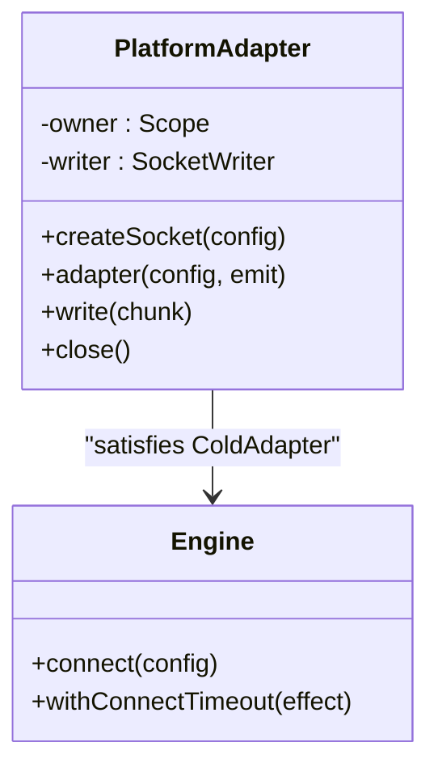
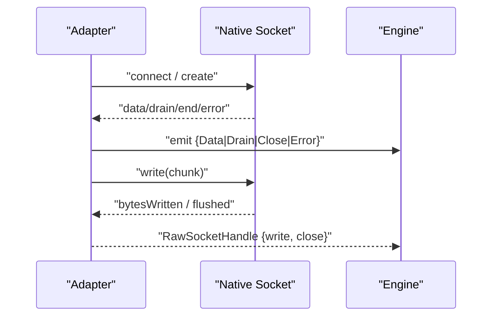
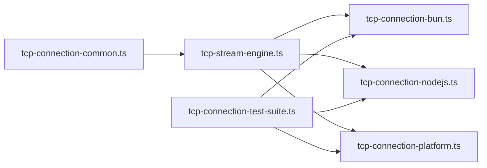

# Troubleshooting and Debugging

<cite>
**Referenced Files in This Document**
- [tcp-stream-engine.ts](file://src/tcp-stream-engine.ts)
- [tcp-connection-common.ts](file://src/tcp-connection-common.ts)
- [tcp-connection-bun.ts](file://src/tcp-connection-bun.ts)
- [tcp-connection-nodejs.ts](file://src/tcp-connection-nodejs.ts)
- [tcp-connection-platform.ts](file://src/tcp-connection-platform.ts)
- [tcp-connection-test-suite.ts](file://src/tcp-connection-test-suite.ts)
- [0005-unified-platform-socket-engine-adapter-and-test-suite.md](file://docs/adr/0005-unified-platform-socket-engine-adapter-and-test-suite.md)
- [0006-scope-owned-platform-engine-lifecycle.md](file://docs/adr/0006-scope-owned-platform-engine-lifecycle.md)
- [0008-caller-first-tcp-stream-engine.md](file://docs/adr/0008-caller-first-tcp-stream-engine.md)
</cite>

## Table of Contents
1. [Introduction](#introduction)
2. [Project Structure](#project-structure)
3. [Core Components](#core-components)
4. [Architecture Overview](#architecture-overview)
5. [Detailed Component Analysis](#detailed-component-analysis)
6. [Dependency Analysis](#dependency-analysis)
7. [Performance Considerations](#performance-considerations)
8. [Troubleshooting Guide](#troubleshooting-guide)
9. [Conclusion](#conclusion)
10. [Appendices](#appendices)

## Introduction
This document provides a comprehensive troubleshooting and debugging guide for diagnosing complex network issues and performance problems in the TCP stream layer across Bun, Node.js, and Effect Platform. It focuses on:
- Diagnosing TCP connection failures, timeouts, and stream processing errors
- Logging techniques, trace collection, and diagnostic tool usage per platform
- Common error patterns, root causes, and resolution approaches
- Production debugging workflows, log analysis, and performance profiling methods
- Creating effective test cases for network-related issues and implementing robust error recovery mechanisms

The guidance is grounded in the repository’s shared engine abstraction, runtime adapters, and parameterized test suite that validates behavior consistently across platforms.

## Project Structure
The TCP networking stack is organized around a unified engine seam with three runtime-specific adapters and a shared orchestration layer:
- Shared contracts and utilities define error types, configuration validation, retry scheduling, and the public `TcpStream` service.
- The engine orchestrator builds a caller-first connection attempt, manages readiness, events, timeouts, retries, and write serialization.
- Adapters implement the cold adapter protocol for Bun, Node.js, and Effect Platform, translating native socket lifecycles into the shared event model.
- A parameterized test suite exercises core scenarios (retry policies, graceful close, TLS handshake behavior, interruption safety) against all engines.

**Diagram sources**
- [tcp-stream-engine.ts:88-178](file://src/tcp-stream-engine.ts#L88-L178)
- [tcp-connection-bun.ts:18-135](file://src/tcp-connection-bun.ts#L18-L135)
- [tcp-connection-nodejs.ts:21-119](file://src/tcp-connection-nodejs.ts#L21-L119)
- [tcp-connection-platform.ts:17-128](file://src/tcp-connection-platform.ts#L17-L128)
- [tcp-connection-test-suite.ts:213-306](file://src/tcp-connection-test-suite.ts#L213-L306)

**Section sources**
- [tcp-stream-engine.ts:88-178](file://src/tcp-stream-engine.ts#L88-L178)
- [tcp-connection-common.ts:12-101](file://src/tcp-connection-common.ts#L12-L101)
- [tcp-connection-bun.ts:18-135](file://src/tcp-connection-bun.ts#L18-L135)
- [tcp-connection-nodejs.ts:21-119](file://src/tcp-connection-nodejs.ts#L21-L119)
- [tcp-connection-platform.ts:17-128](file://src/tcp-connection-platform.ts#L17-L128)
- [tcp-connection-test-suite.ts:213-306](file://src/tcp-connection-test-suite.ts#L213-L306)

## Core Components
- TcpStreamError and ConnectionConfigError: Structured error types used to surface operation context and underlying causes.
- ConnectionConfigShape and validation: Enforces host/port validity and config shape; supports TLS options and connect timeout.
- Retry policy: Default exponential backoff with jitter and caps; customizable via schedule or explicit policy.
- Engine orchestrator: Builds an established connection with idempotent handle, ordered event stream, readiness gating, and centralized connect timeout.
- Runtime adapters: Implement cold adapter protocol to emit Ready/Data/Drain/Close/Error and provide write/close semantics.
- Convenience layers: Provide typed layers per runtime to wire configuration and engine implementations.

Key responsibilities:
- Centralize connect timeout and failure mapping to consistent errors.
- Serialize writes and honor drain signals to avoid backpressure stalls.
- Ensure resource safety via scoped teardown and interruptible acquisition.

**Section sources**
- [tcp-connection-common.ts:12-101](file://src/tcp-connection-common.ts#L12-L101)
- [tcp-stream-engine.ts:88-178](file://src/tcp-stream-engine.ts#L88-L178)
- [tcp-stream-engine.ts:180-195](file://src/tcp-stream-engine.ts#L180-L195)
- [tcp-stream-engine.ts:201-339](file://src/tcp-stream-engine.ts#L201-L339)

## Architecture Overview
The architecture separates concerns between shared orchestration and runtime-specific adapters:
- The engine constructs a single-attempt connection, wraps it with connect timeout, and exposes a stable handle plus an ordered event stream.
- Adapters translate native socket events into the shared event model and map errors to `TcpStreamError`.
- The higher-level `TcpStream` composes retry, incoming queue management, write serialization, and graceful close.

**Diagram sources**
- [tcp-stream-engine.ts:88-178](file://src/tcp-stream-engine.ts#L88-L178)
- [tcp-stream-engine.ts:201-339](file://src/tcp-stream-engine.ts#L201-L339)
- [tcp-connection-bun.ts:18-135](file://src/tcp-connection-bun.ts#L18-L135)
- [tcp-connection-nodejs.ts:21-119](file://src/tcp-connection-nodejs.ts#L21-L119)
- [tcp-connection-platform.ts:17-128](file://src/tcp-connection-platform.ts#L17-L128)

## Detailed Component Analysis

### Engine Orchestrator: Connect Timeout, Readiness, and Event Flow
- Connect timeout is applied centrally around the adapter call, converting non-structured timeouts into `TcpStreamError` with operation "connect".
- Readiness gating ensures the connection is fully established before exposing the handle; early closure emits a specific error.
- Events are funneled through an unbounded queue and exposed as a Stream; drain signals wake blocked writers.
- Errors during connection vs read phases are distinguished by phase tracking.

**Diagram sources**
- [tcp-stream-engine.ts:88-178](file://src/tcp-stream-engine.ts#L88-L178)
- [tcp-stream-engine.ts:180-195](file://src/tcp-stream-engine.ts#L180-L195)

**Section sources**
- [tcp-stream-engine.ts:88-178](file://src/tcp-stream-engine.ts#L88-L178)
- [tcp-stream-engine.ts:180-195](file://src/tcp-stream-engine.ts#L180-L195)

### Write Serialization and Backpressure Handling
- Writes are serialized via a semaphore to prevent interleaving.
- Partial writes loop until full transmission; zero-byte writes wait for drain signals.
- Drain events complete deferred waiters to resume blocked writes.
- Closed connections surface structured errors for subsequent sends.

**Diagram sources**
- [tcp-stream-engine.ts:201-339](file://src/tcp-stream-engine.ts#L201-L339)

**Section sources**
- [tcp-stream-engine.ts:201-339](file://src/tcp-stream-engine.ts#L201-L339)

### Platform Adapter: Scoped Lifecycle and Writer Integration
- Uses a child scope forked from the ambient scope to own the connection lifecycle.
- Wraps socket run and writer acquisition within scoped resources; closing the owner scope tears down the connection deterministically.
- Maps platform errors to `TcpStreamError` and ensures immediate rejection when the connection is closed before readiness.

**Diagram sources**
- [tcp-connection-platform.ts:17-128](file://src/tcp-connection-platform.ts#L17-L128)
- [tcp-stream-engine.ts:88-178](file://src/tcp-stream-engine.ts#L88-L178)

**Section sources**
- [tcp-connection-platform.ts:17-128](file://src/tcp-connection-platform.ts#L17-L128)
- [0006-scope-owned-platform-engine-lifecycle.md:24-69](file://docs/adr/0006-scope-owned-platform-engine-lifecycle.md#L24-L69)

### Bun and Node.js Adapters: Event Mapping and Error Surface
- Bun adapter uses callbacks to emit Ready/Data/Drain/Close/Error and maps write failures to `TcpStreamError`.
- Node.js adapter wires data/drain/close/error/connect/secureConnect events and normalizes string chunks to Uint8Array.
- Both adapters ensure idempotent close and safe termination on cancellation or failure.

**Diagram sources**
- [tcp-connection-bun.ts:18-135](file://src/tcp-connection-bun.ts#L18-L135)
- [tcp-connection-nodejs.ts:21-119](file://src/tcp-connection-nodejs.ts#L21-L119)

**Section sources**
- [tcp-connection-bun.ts:18-135](file://src/tcp-connection-bun.ts#L18-L135)
- [tcp-connection-nodejs.ts:21-119](file://src/tcp-connection-nodejs.ts#L21-L119)

## Dependency Analysis
- Shared layer (`tcp-connection-common.ts`) defines error types, configuration, and retry building; consumed by engine and adapters.
- Engine (`tcp-stream-engine.ts`) depends on common and provides the central orchestration; adapters depend on engine to satisfy the cold adapter contract.
- Tests depend on each adapter’s live layer to validate behavior uniformly.

**Diagram sources**
- [tcp-connection-common.ts:12-101](file://src/tcp-connection-common.ts#L12-L101)
- [tcp-stream-engine.ts:88-178](file://src/tcp-stream-engine.ts#L88-L178)
- [tcp-connection-bun.ts:18-135](file://src/tcp-connection-bun.ts#L18-L135)
- [tcp-connection-nodejs.ts:21-119](file://src/tcp-connection-nodejs.ts#L21-L119)
- [tcp-connection-platform.ts:17-128](file://src/tcp-connection-platform.ts#L17-L128)
- [tcp-connection-test-suite.ts:213-306](file://src/tcp-connection-test-suite.ts#L213-L306)

**Section sources**
- [tcp-connection-common.ts:12-101](file://src/tcp-connection-common.ts#L12-L101)
- [tcp-stream-engine.ts:88-178](file://src/tcp-stream-engine.ts#L88-L178)
- [tcp-connection-test-suite.ts:213-306](file://src/tcp-connection-test-suite.ts#L213-L306)

## Performance Considerations
- Connect timeout prevents indefinite hangs; tune `connectTimeout` based on expected network latency and server startup time.
- Retry policy should be configured conservatively in production to avoid thundering herds; use jitter and bounded attempts/duration.
- Write serialization avoids contention but can serialize bursts; consider batching at the application layer if appropriate.
- Platform adapter’s scoped lifecycle ensures deterministic teardown; ensure scopes are properly provided to avoid leaks.
- Use the parameterized test suite to measure timing bounds for retry exhaustion and interruption responsiveness.

[No sources needed since this section provides general guidance]

## Troubleshooting Guide

### Diagnosing TCP Connection Failures
Common symptoms:
- Immediate failure with no retry when `retry: false`
- Exhaustion of retry attempts on unreachable endpoints
- TLS handshake failures when connecting to plaintext servers

Diagnostic steps:
- Verify host and port validity; invalid ports or empty hosts are rejected early.
- Inspect the final exit cause; failures should be `TcpStreamError`, not defects.
- Confirm retry policy settings and custom schedules; ensure they align with expected backoff windows.
- For TLS, ensure server supports TLS and client options match expectations.

Resolution approaches:
- Adjust retry policy (initial delay, factor, max attempts, duration).
- Validate server availability and firewall rules.
- For TLS mismatches, correct server/client configurations or disable verification only in controlled environments.

**Section sources**
- [tcp-connection-common.ts:62-101](file://src/tcp-connection-common.ts#L62-L101)
- [tcp-connection-test-suite.ts:219-306](file://src/tcp-connection-test-suite.ts#L219-L306)
- [tcp-connection-test-suite.ts:581-623](file://src/tcp-connection-test-suite.ts#L581-L623)

### Diagnosing Timeout Issues
Symptoms:
- Connect operations exceeding expected durations
- Stalls during readiness or writer acquisition

Diagnostic steps:
- Check `connectTimeout`; defaults apply if unspecified.
- Observe whether timeouts occur during native connect, TLS handshake, or Platform writer acquisition.
- Use interruption tests to verify prompt return on cancel; ensure `acquireRelease` is interruptible.

Resolution approaches:
- Increase `connectTimeout` for slow networks or heavy TLS handshakes.
- Investigate server-side delays or resource constraints.
- Ensure proper scoping and cleanup to avoid lingering fibers.

**Section sources**
- [tcp-stream-engine.ts:180-195](file://src/tcp-stream-engine.ts#L180-L195)
- [0006-scope-owned-platform-engine-lifecycle.md:48-69](file://docs/adr/0006-scope-owned-platform-engine-lifecycle.md#L48-L69)
- [tcp-connection-test-suite.ts:724-797](file://src/tcp-connection-test-suite.ts#L724-L797)

### Diagnosing Stream Processing Errors
Symptoms:
- Unexpected stream failures or premature termination
- Drains not waking writers
- Remote closes not ending streams cleanly

Diagnostic steps:
- Monitor event flow: Data/Drain/Close/Error emissions.
- Verify drain handling completes deferred waiters.
- Confirm remote close ends the event stream without hanging.

Resolution approaches:
- Ensure downstream consumers process drain signals promptly.
- Handle stream completion gracefully; avoid catching benign close outcomes as errors.
- Validate that write loops respect flushed and zero-byte write conditions.

**Section sources**
- [tcp-stream-engine.ts:201-339](file://src/tcp-stream-engine.ts#L201-L339)
- [tcp-connection-test-suite.ts:625-671](file://src/tcp-connection-test-suite.ts#L625-L671)

### Logging Techniques and Trace Collection
Recommended practices:
- Tag logs with unique prefixes to enable targeted grepping and cleanup.
- Log at boundaries: connect entry/exit, retry attempts, drain signals, write results, and error mappings.
- Capture structured payloads: operation, message, cause, timestamps, and correlation IDs.

Per platform:
- Bun: Use console logging in adapters for callback events; wrap sensitive data appropriately.
- Node.js: Leverage built-in logger or structured logging libraries; capture socket events.
- Platform: Log around scoped acquisitions and writer operations; include scope lifecycle events.

Trace collection:
- Enable fiber tracing in Effect to correlate asynchronous flows.
- Record timing around connect, write, and drain waits to identify bottlenecks.
- Export metrics for retry counts, timeouts, and error rates.

**Section sources**
- [tcp-connection-bun.ts:18-135](file://src/tcp-connection-bun.ts#L18-L135)
- [tcp-connection-nodejs.ts:21-119](file://src/tcp-connection-nodejs.ts#L21-L119)
- [tcp-connection-platform.ts:17-128](file://src/tcp-connection-platform.ts#L17-L128)

### Diagnostic Tool Usage Across Platforms
- Bun:
  - Use Bun’s REPL and debugger for breakpoint inspection.
  - Inspect socket state via Bun.listen and socket callbacks.
- Node.js:
  - Use Node inspector for breakpoints and heap snapshots.
  - Utilize net/tls diagnostics and socket event listeners.
- Effect Platform:
  - Leverage scoped resource inspection and effect tracing.
  - Validate scope ownership and teardown using tests and logs.

**Section sources**
- [tcp-connection-bun.ts:18-135](file://src/tcp-connection-bun.ts#L18-L135)
- [tcp-connection-nodejs.ts:21-119](file://src/tcp-connection-nodejs.ts#L21-L119)
- [tcp-connection-platform.ts:17-128](file://src/tcp-connection-platform.ts#L17-L128)

### Production Debugging Workflows
- Establish baselines: Measure typical connect times, write latencies, and drain frequencies.
- Instrument key seams: Connect entry/exit, retry attempts, write loops, drain signals, error mappings.
- Collect telemetry: Metrics for retries, timeouts, errors, and throughput.
- Analyze logs: Filter by tags and correlation IDs; focus on boundaries and error paths.
- Validate fixes: Run parameterized tests against affected engines to ensure consistency.

**Section sources**
- [tcp-connection-test-suite.ts:213-306](file://src/tcp-connection-test-suite.ts#L213-L306)
- [0005-unified-platform-socket-engine-adapter-and-test-suite.md:22-61](file://docs/adr/0005-unified-platform-socket-engine-adapter-and-test-suite.md#L22-L61)

### Performance Profiling Methods
- Timing harnesses: Measure connect, write, and drain durations with high-resolution timers.
- Profile CPU and memory: Use platform profilers (Bun/Node) to identify hotspots.
- Bisect changes: Isolate regressions by comparing baseline vs recent commits.
- Stress tests: Simulate high concurrency and bursty writes to validate backpressure handling.

[No sources needed since this section provides general guidance]

### Creating Effective Test Cases for Network Issues
Use the parameterized test suite to cover:
- Retry exhaustion on unreachable ports
- Immediate failure when retry disabled
- Custom retry schedules
- Recovery when server becomes available during backoff
- Binary data transmission and graceful close
- TLS handshake success and failure scenarios
- Immediate remote close handling
- Interruption safety during setup and retry backoff

Ensure tests assert:
- Exit outcomes (success/failure)
- No defects in Cause
- Bounded timing for retries and interruptions
- Correct data round-trips

**Section sources**
- [tcp-connection-test-suite.ts:213-306](file://src/tcp-connection-test-suite.ts#L213-L306)
- [tcp-connection-test-suite.ts:388-422](file://src/tcp-connection-test-suite.ts#L388-L422)
- [tcp-connection-test-suite.ts:581-623](file://src/tcp-connection-test-suite.ts#L581-L623)
- [tcp-connection-test-suite.ts:625-671](file://src/tcp-connection-test-suite.ts#L625-L671)
- [tcp-connection-test-suite.ts:724-797](file://src/tcp-connection-test-suite.ts#L724-L797)

### Implementing Robust Error Recovery Mechanisms
- Configure retry policies with jitter and bounded attempts/duration.
- Map all adapter errors to `TcpStreamError` with operation context.
- Handle drain signals to prevent writer starvation.
- Ensure graceful close terminates event streams and releases resources.
- Validate interruption safety to avoid hangs during retries or setup.

**Section sources**
- [tcp-connection-common.ts:62-101](file://src/tcp-connection-common.ts#L62-L101)
- [tcp-stream-engine.ts:180-195](file://src/tcp-stream-engine.ts#L180-L195)
- [tcp-stream-engine.ts:201-339](file://src/tcp-stream-engine.ts#L201-L339)
- [0008-caller-first-tcp-stream-engine.md:1-18](file://docs/adr/0008-caller-first-tcp-stream-engine.md#L1-L18)

## Conclusion
This troubleshooting guide consolidates strategies for diagnosing and resolving complex network issues across Bun, Node.js, and Effect Platform. By leveraging the unified engine abstraction, structured error reporting, configurable retry policies, and a comprehensive parameterized test suite, teams can reliably detect, analyze, and fix TCP connection failures, timeouts, and stream processing errors. Adopting disciplined logging, trace collection, and performance profiling practices further enhances visibility and accelerates resolution in production environments.

[No sources needed since this section summarizes without analyzing specific files]

## Appendices

### Quick Reference: Error Types and Operations
- TcpStreamError: Operation-aware error with message and optional cause
- ConnectionConfigError: Configuration validation failure
- Operations: connect, read, write

**Section sources**
- [tcp-connection-common.ts:12-24](file://src/tcp-connection-common.ts#L12-L24)

### Quick Reference: Retry Policy Defaults
- Exponential backoff with jitter
- Default max attempts and duration
- Customizable via schedule or policy object

**Section sources**
- [tcp-connection-common.ts:90-101](file://src/tcp-connection-common.ts#L90-L101)