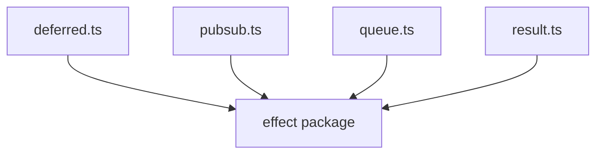
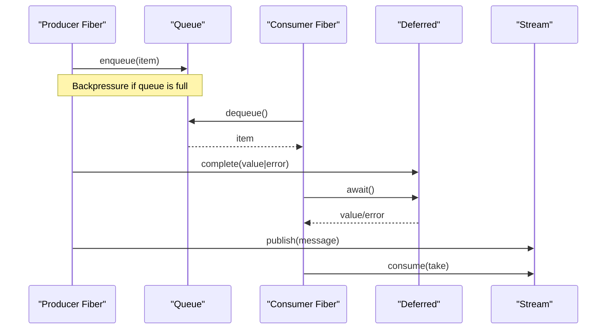
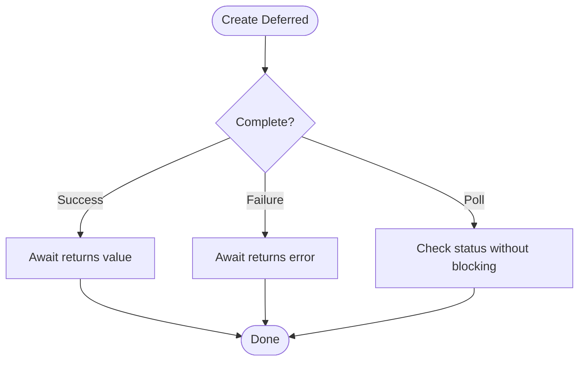
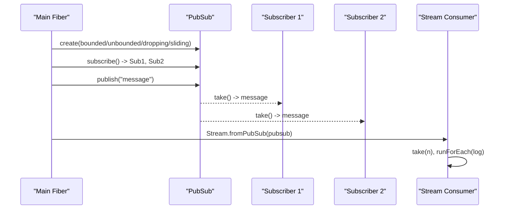
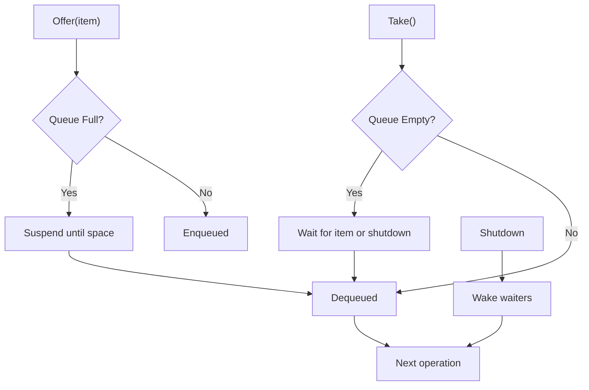
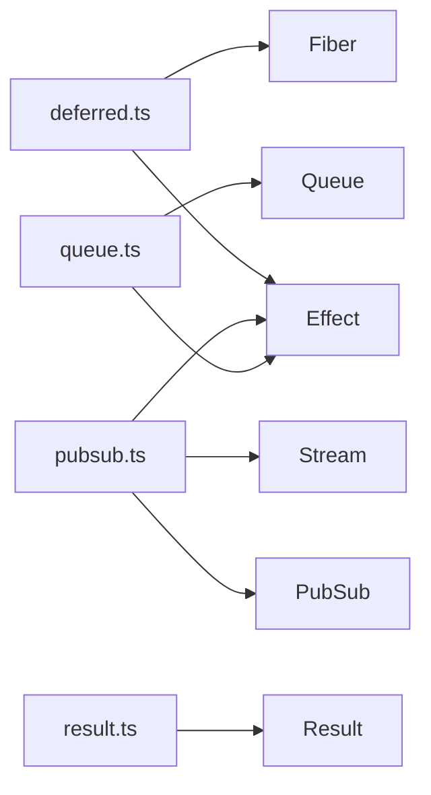

# Concurrency Primitives

<cite>
**Referenced Files in This Document**
- [concurrency-deferred.ts](file://src/concurrency-deferred.ts)
- [concurrency-pubsub.ts](file://src/concurrency-pubsub.ts)
- [concurrency-queue.ts](file://src/concurrency-queue.ts)
- [result.ts](file://src/result.ts)
- [package.json](file://package.json)
</cite>

## Table of Contents
1. [Introduction](#introduction)
2. [Project Structure](#project-structure)
3. [Core Components](#core-components)
4. [Architecture Overview](#architecture-overview)
5. [Detailed Component Analysis](#detailed-component-analysis)
6. [Dependency Analysis](#dependency-analysis)
7. [Performance Considerations](#performance-considerations)
8. [Troubleshooting Guide](#troubleshooting-guide)
9. [Conclusion](#conclusion)

## Introduction
This document explains the concurrency primitives used to build robust, concurrent applications: Deferred for coordinating async operations with success/failure states and polling; Pub/Sub for event-driven communication between components; and Queue for asynchronous task execution with backpressure handling. It includes practical usage patterns, error handling strategies, performance considerations, and guidance on composing these primitives safely while ensuring memory safety and resource cleanup.

## Project Structure
The concurrency primitives are implemented as standalone modules that compose Effect’s core primitives (Fiber, Stream, Scope). The repository focuses on three files:
- Deferred coordination examples and patterns
- Pub/Sub messaging with bounded, dropping, sliding, and unbounded variants
- Queue-based backpressure and lifecycle management

**Diagram sources**
- [concurrency-deferred.ts:1-65](file://src/concurrency-deferred.ts#L1-L65)
- [concurrency-pubsub.ts:1-98](file://src/concurrency-pubsub.ts#L1-L98)
- [concurrency-queue.ts:1-92](file://src/concurrency-queue.ts#L1-L92)
- [result.ts:1-41](file://src/result.ts#L1-L41)
- [package.json:23-28](file://package.json#L23-L28)

**Section sources**
- [concurrency-deferred.ts:1-65](file://src/concurrency-deferred.ts#L1-L65)
- [concurrency-pubsub.ts:1-98](file://src/concurrency-pubsub.ts#L1-L98)
- [concurrency-queue.ts:1-92](file://src/concurrency-queue.ts#L1-L92)
- [result.ts:1-41](file://src/result.ts#L1-L41)
- [package.json:23-28](file://package.json#L23-L28)

## Core Components
- Deferred: Create a handle that can be completed once with success or failure; await completion; poll to check status without blocking.
- Pub/Sub: Publish messages to one or more subscribers; choose capacity policies (bounded, dropping, sliding, unbounded); convert to Streams for reactive consumption.
- Queue: Enqueue and dequeue items with backpressure; support different capacity policies; manage lifecycle via shutdown and await.

These primitives integrate with Effect’s structured concurrency (Fibers, Scopes) to ensure safe resource management and predictable lifetimes.

**Section sources**
- [concurrency-deferred.ts:1-65](file://src/concurrency-deferred.ts#L1-L65)
- [concurrency-pubsub.ts:1-98](file://src/concurrency-pubsub.ts#L1-L98)
- [concurrency-queue.ts:1-92](file://src/concurrency-queue.ts#L1-L92)

## Architecture Overview
The primitives form a small but powerful toolkit for concurrent systems:
- Producers publish work or events into Queues or Pub/Sub channels.
- Consumers subscribe or take from these channels, often running in separate Fibers.
- Deferreds coordinate handoffs and synchronization points across Fibers.
- Streams provide reactive pipelines over Pub/Sub or Queue data.

[No sources needed since this diagram shows conceptual workflow, not actual code structure]

## Detailed Component Analysis

### Deferred: Coordinating Async Operations
Purpose:
- Provide a single-use handle to signal completion with success or failure.
- Allow multiple consumers to await the result.
- Support non-blocking polling to check completion status.

Key behaviors demonstrated:
- Creation and completion with success or failure.
- Awaiting completion to retrieve the value or error.
- Polling to check whether the Deferred has been completed.
- Coordinating two Fibers where one completes a Deferred and another awaits it.

Usage patterns:
- Use Deferred when you need to synchronize two independent tasks, such as signaling readiness or propagating an error across fibers.
- Prefer awaiting for clean cancellation and integration with structured concurrency.
- Use polling sparingly; it is useful for non-blocking checks but does not replace proper synchronization.

Error handling:
- Failures propagate through the Deferred and can be handled by the awaiting fiber.
- Defects and interruptions are managed by the runtime; joining a fiber yields the cause.

**Diagram sources**
- [concurrency-deferred.ts:3-13](file://src/concurrency-deferred.ts#L3-L13)
- [concurrency-deferred.ts:15-33](file://src/concurrency-deferred.ts#L15-L33)
- [concurrency-deferred.ts:35-62](file://src/concurrency-deferred.ts#L35-L62)

**Section sources**
- [concurrency-deferred.ts:3-13](file://src/concurrency-deferred.ts#L3-L13)
- [concurrency-deferred.ts:15-33](file://src/concurrency-deferred.ts#L15-L33)
- [concurrency-deferred.ts:35-62](file://src/concurrency-deferred.ts#L35-L62)

### Pub/Sub: Event-Driven Communication
Purpose:
- Enable one-to-many messaging between components.
- Choose capacity policies to control memory and throughput trade-offs.
- Convert subscriptions to Streams for reactive processing.

Key behaviors demonstrated:
- Creating bounded, dropping, sliding, and unbounded Pub/Sub instances.
- Subscribing multiple consumers and publishing messages.
- Using Streams to consume messages asynchronously in a separate fiber.
- Ensuring no missed messages by subscribing before publishing.

Usage patterns:
- Use bounded Pub/Sub for controlled backpressure; dropping/sliding for rate limiting; unbounded for high-throughput scenarios where memory is sufficient.
- Convert to Streams when you want declarative pipelines (take, map, filter, runForEach).
- Subscribe early to avoid race conditions between producer and consumer startup.

Error handling:
- Errors in producers should be modeled explicitly; downstream consumers can handle errors using Stream operators.
- Use scoped execution to ensure subscriptions are cleaned up properly.

**Diagram sources**
- [concurrency-pubsub.ts:3-27](file://src/concurrency-pubsub.ts#L3-L27)
- [concurrency-pubsub.ts:40-62](file://src/concurrency-pubsub.ts#L40-L62)
- [concurrency-pubsub.ts:72-95](file://src/concurrency-pubsub.ts#L72-L95)

**Section sources**
- [concurrency-pubsub.ts:3-27](file://src/concurrency-pubsub.ts#L3-L27)
- [concurrency-pubsub.ts:40-62](file://src/concurrency-pubsub.ts#L40-L62)
- [concurrency-pubsub.ts:72-95](file://src/concurrency-pubsub.ts#L72-L95)

### Queue: Asynchronous Task Execution with Backpressure
Purpose:
- Manage asynchronous tasks with explicit backpressure.
- Provide different capacity policies to balance throughput and memory.
- Control lifecycle via shutdown and await mechanisms.

Key behaviors demonstrated:
- Creating bounded, dropping, sliding, and unbounded queues.
- Offering items and taking them out; offer suspends when the queue is full.
- Demonstrating backpressure: a second offer suspends until space is available.
- Shutting down the queue and observing how waiting fibers respond.
- Using Queue.await to observe shutdown signals.

Usage patterns:
- Use bounded queues to apply backpressure to producers.
- Use dropping/sliding queues to drop or slide old items under load.
- Use unbounded queues only when memory constraints are acceptable.
- Always shut down queues during application teardown to release resources and wake waiters.

Error handling:
- Shutdown interrupts waiting operations; join the affected fibers to handle interruption.
- Model failures explicitly when possible; use Result for synchronous computations that do not require a runtime.

**Diagram sources**
- [concurrency-queue.ts:28-54](file://src/concurrency-queue.ts#L28-L54)
- [concurrency-queue.ts:57-87](file://src/concurrency-queue.ts#L57-L87)

**Section sources**
- [concurrency-queue.ts:28-54](file://src/concurrency-queue.ts#L28-L54)
- [concurrency-queue.ts:57-87](file://src/concurrency-queue.ts#L57-L87)

### Composing Primitives: Building Complex Concurrent Applications
Patterns:
- Use Queues to decouple producers and consumers with backpressure.
- Use Pub/Sub for fan-out notifications and event-driven updates.
- Use Deferreds to synchronize handoff points and coordinate completion across Fibers.
- Use Streams to process sequences of events from Pub/Sub or Queues.

Resource management:
- Enclose long-lived resources in scopes to ensure cleanup.
- Use forkChild to tie child Fibers to parent lifetimes.
- Join Fibers to collect results and handle errors uniformly.

Memory safety:
- Prefer bounded queues and Pub/Sub to prevent unbounded growth.
- Avoid leaking references to large objects in queues or streams.
- Ensure all subscriptions and queues are shut down during teardown.

**Section sources**
- [concurrency-deferred.ts:35-62](file://src/concurrency-deferred.ts#L35-L62)
- [concurrency-pubsub.ts:72-95](file://src/concurrency-pubsub.ts#L72-L95)
- [concurrency-queue.ts:28-87](file://src/concurrency-queue.ts#L28-L87)

## Dependency Analysis
The concurrency primitives depend on Effect’s runtime and concurrency abstractions:
- Effect: core effect type and utilities
- Fiber: structured concurrency, forking, joining
- Stream: reactive pipelines over data sources
- PubSub and Queue: channel implementations with capacity policies
- Result: synchronous error modeling without runtime overhead

**Diagram sources**
- [concurrency-deferred.ts:1-65](file://src/concurrency-deferred.ts#L1-L65)
- [concurrency-pubsub.ts:1-98](file://src/concurrency-pubsub.ts#L1-L98)
- [concurrency-queue.ts:1-92](file://src/concurrency-queue.ts#L1-L92)
- [result.ts:1-41](file://src/result.ts#L1-L41)
- [package.json:23-28](file://package.json#L23-L28)

**Section sources**
- [package.json:23-28](file://package.json#L23-L28)

## Performance Considerations
- Capacity policy selection:
  - Bounded: applies backpressure; prevents memory spikes.
  - Dropping: drops new items when full; reduces latency at cost of lost messages.
  - Sliding: removes oldest items when full; maintains recent data.
  - Unbounded: maximum throughput; risk of memory exhaustion.
- Throughput vs. latency:
  - Larger capacities increase throughput but may increase latency due to GC pressure.
  - Smaller capacities reduce memory but may increase contention.
- Streaming consumption:
  - Use Stream.take to limit consumption and avoid leaks.
  - Combine with runForEach for side effects; ensure finalizers run.
- Deferred polling:
  - Polling avoids blocking but can busy-loop if misused; prefer await for clean suspension.
- Queue shutdown:
  - Always shut down queues to wake suspended operations and free resources.

[No sources needed since this section provides general guidance]

## Troubleshooting Guide
Common issues and resolutions:
- Deadlocks or hangs:
  - Ensure producers and consumers are balanced; verify offers/takes are paired.
  - Check for missing shutdown calls that leave waiters suspended.
- Memory growth:
  - Switch from unbounded to bounded/dropping/sliding queues or Pub/Sub.
  - Limit stream consumption with take or throttle operators.
- Lost messages:
  - Subscribe before publishing to avoid races.
  - Use appropriate capacity policies based on reliability requirements.
- Error propagation:
  - Handle failures from Deferred.await and Queue.take appropriately.
  - Use Result for synchronous validations to avoid runtime overhead.

Practical tips:
- Use Fiber.joinAll to wait for multiple background tasks and aggregate outcomes.
- Wrap long-running operations in scopes to guarantee cleanup.
- Log and inspect causes when joining interrupted or failed fibers.

**Section sources**
- [concurrency-queue.ts:57-87](file://src/concurrency-queue.ts#L57-L87)
- [concurrency-pubsub.ts:40-62](file://src/concurrency-pubsub.ts#L40-L62)
- [result.ts:1-41](file://src/result.ts#L1-L41)

## Conclusion
The Deferred, Pub/Sub, and Queue primitives provide a solid foundation for building concurrent applications with clear synchronization, event-driven communication, and backpressure. By combining these tools with Effect’s structured concurrency and streaming capabilities, you can design systems that are efficient, resilient, and easy to reason about. Follow the usage patterns and guidelines above to maintain memory safety, handle errors gracefully, and ensure proper resource cleanup throughout your application lifecycle.

[No sources needed since this section summarizes without analyzing specific files]