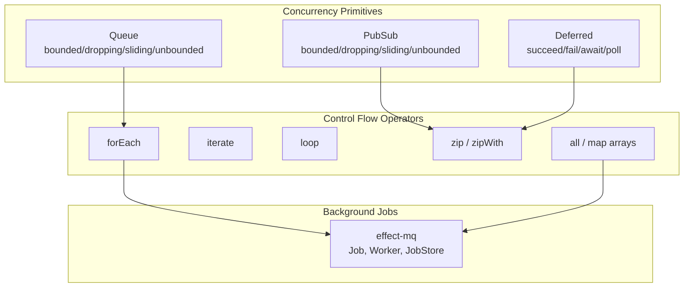
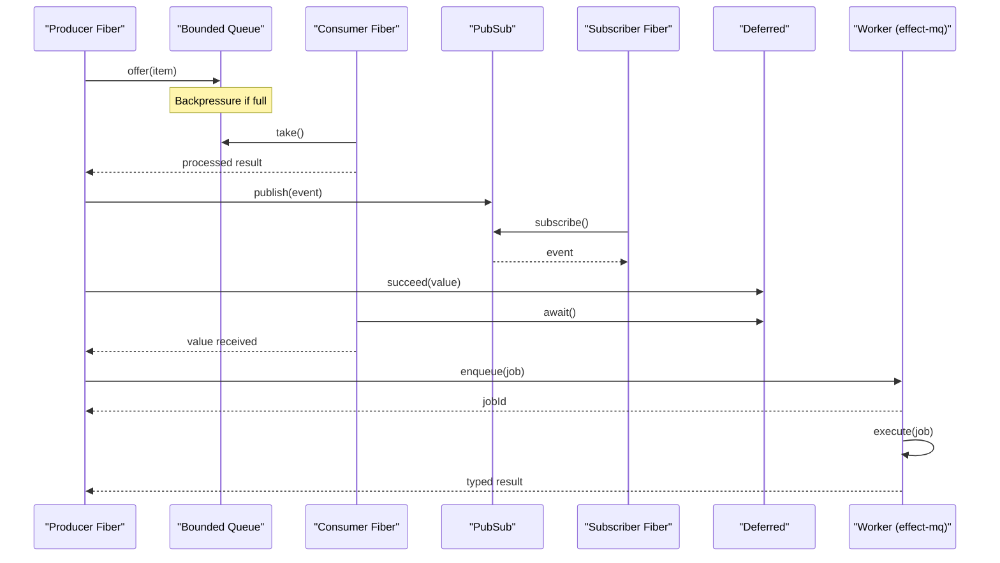
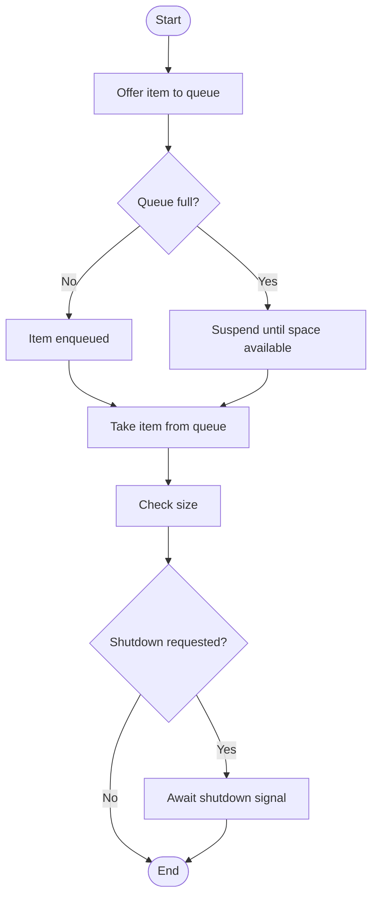
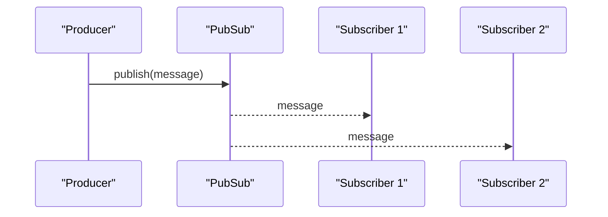
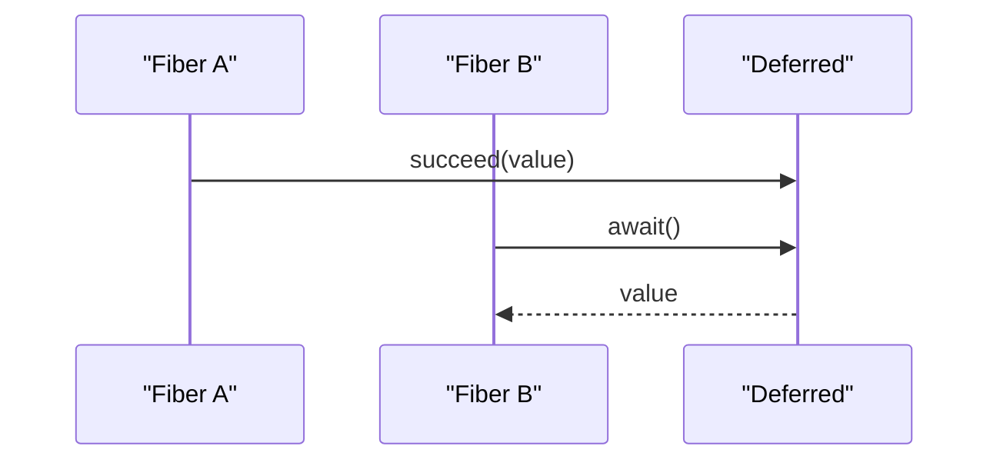
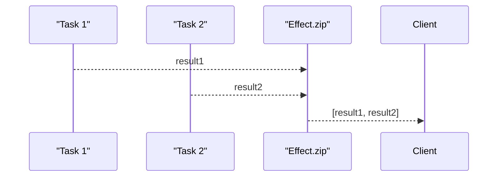
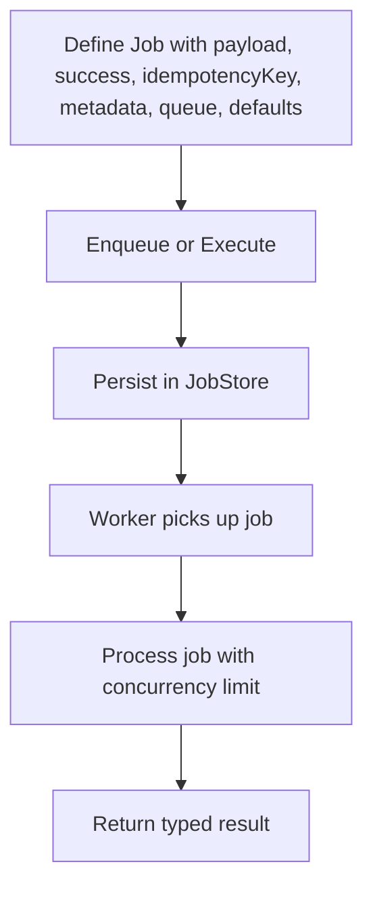
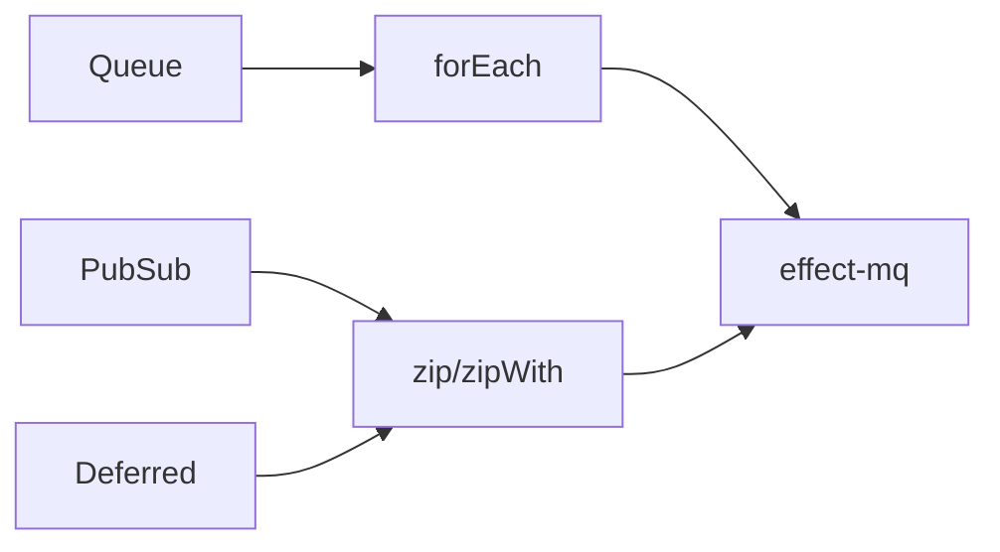

# Concurrency and Utilities

<cite>
**Referenced Files in This Document**
- [concurrency-deferred.ts](file://src/concurrency-deferred.ts)
- [concurrency-pubsub.ts](file://src/concurrency-pubsub.ts)
- [concurrency-queue.ts](file://src/concurrency-queue.ts)
- [control-flow-foreach.ts](file://src/control-flow-foreach.ts)
- [control-flow-iterate.ts](file://src/control-flow-iterate.ts)
- [control-flow-loop.ts](file://src/control-flow-loop.ts)
- [control-flow-zip.ts](file://src/control-flow-zip.ts)
- [control-flow-operators.ts](file://src/control-flow-operators.ts)
- [mq/index.ts](file://src/mq/index.ts)
</cite>

## Table of Contents
1. [Introduction](#introduction)
2. [Project Structure](#project-structure)
3. [Core Components](#core-components)
4. [Architecture Overview](#architecture-overview)
5. [Detailed Component Analysis](#detailed-component-analysis)
6. [Dependency Analysis](#dependency-analysis)
7. [Performance Considerations](#performance-considerations)
8. [Troubleshooting Guide](#troubleshooting-guide)
9. [Conclusion](#conclusion)

## Introduction
This document explains the concurrency primitives, control flow operators, and background job utilities that enable building robust concurrent applications with Effect. It covers:
- Queues for producer-consumer coordination
- Pub/Sub messaging for fan-out communication
- Deferred values for coordinating asynchronous operations
- Control flow operators (forEach, iterate, loop, zip) for orchestrating async workflows
- Message queue integration using effect-mq for background job processing

The goal is to provide practical guidance on when and how to use each utility, along with performance considerations and best practices.

## Project Structure
The concurrency and utilities are organized into focused modules:
- Concurrency primitives: queues, pub/sub, deferred
- Control flow operators: foreach, iterate, loop, zip, and general operators
- Background jobs: effect-mq integration

**Diagram sources**
- [concurrency-queue.ts:1-92](file://src/concurrency-queue.ts#L1-L92)
- [concurrency-pubsub.ts:1-98](file://src/concurrency-pubsub.ts#L1-L98)
- [concurrency-deferred.ts:1-65](file://src/concurrency-deferred.ts#L1-L65)
- [control-flow-foreach.ts:1-20](file://src/control-flow-foreach.ts#L1-L20)
- [control-flow-iterate.ts:1-17](file://src/control-flow-iterate.ts#L1-L17)
- [control-flow-loop.ts:1-31](file://src/control-flow-loop.ts#L1-L31)
- [control-flow-zip.ts:1-24](file://src/control-flow-zip.ts#L1-L24)
- [control-flow-operators.ts:1-62](file://src/control-flow-operators.ts#L1-L62)
- [mq/index.ts:1-40](file://src/mq/index.ts#L1-L40)

**Section sources**
- [concurrency-queue.ts:1-92](file://src/concurrency-queue.ts#L1-L92)
- [concurrency-pubsub.ts:1-98](file://src/concurrency-pubsub.ts#L1-L98)
- [concurrency-deferred.ts:1-65](file://src/concurrency-deferred.ts#L1-L65)
- [control-flow-foreach.ts:1-20](file://src/control-flow-foreach.ts#L1-L20)
- [control-flow-iterate.ts:1-17](file://src/control-flow-iterate.ts#L1-L17)
- [control-flow-loop.ts:1-31](file://src/control-flow-loop.ts#L1-L31)
- [control-flow-zip.ts:1-24](file://src/control-flow-zip.ts#L1-L24)
- [control-flow-operators.ts:1-62](file://src/control-flow-operators.ts#L1-L62)
- [mq/index.ts:1-40](file://src/mq/index.ts#L1-L40)

## Core Components
This section summarizes the primary concurrency utilities and their intended usage patterns.

- Queue
  - Types: bounded, dropping, sliding, unbounded
  - Operations: offer, take, size, shutdown, await
  - Use cases: backpressure-aware pipelines, worker pools, rate-limited producers

- PubSub
  - Types: bounded, dropping, sliding, unbounded
  - Operations: publish, subscribe, take
  - Use cases: event broadcasting, stream conversion via Stream.fromPubSub

- Deferred
  - Operations: make, succeed, fail, await, poll
  - Use cases: coordinating multiple fibers, signaling completion or failure across tasks

- Control Flow Operators
  - forEach: map over collections with effects; supports concurrency options
  - iterate: native while loops with yield* for safe effectful iteration
  - loop: iterative accumulation patterns
  - zip / zipWith: combine multiple Effects concurrently or sequentially

- Background Jobs (effect-mq)
  - Define typed jobs with payload, success type, idempotency key, metadata, queue name, defaults
  - Enqueue or execute jobs; run workers with a configurable concurrency
  - Provide persistence via JobStore layers (e.g., MemoryJobStore)

**Section sources**
- [concurrency-queue.ts:1-92](file://src/concurrency-queue.ts#L1-L92)
- [concurrency-pubsub.ts:1-98](file://src/concurrency-pubsub.ts#L1-L98)
- [concurrency-deferred.ts:1-65](file://src/concurrency-deferred.ts#L1-L65)
- [control-flow-foreach.ts:1-20](file://src/control-flow-foreach.ts#L1-L20)
- [control-flow-iterate.ts:1-17](file://src/control-flow-iterate.ts#L1-L17)
- [control-flow-loop.ts:1-31](file://src/control-flow-loop.ts#L1-L31)
- [control-flow-zip.ts:1-24](file://src/control-flow-zip.ts#L1-L24)
- [control-flow-operators.ts:1-62](file://src/control-flow-operators.ts#L1-L62)
- [mq/index.ts:1-40](file://src/mq/index.ts#L1-L40)

## Architecture Overview
The system composes concurrent primitives with control flow operators to build scalable workflows and integrates with effect-mq for durable background processing.

**Diagram sources**
- [concurrency-queue.ts:28-87](file://src/concurrency-queue.ts#L28-L87)
- [concurrency-pubsub.ts:3-97](file://src/concurrency-pubsub.ts#L3-L97)
- [concurrency-deferred.ts:3-64](file://src/concurrency-deferred.ts#L3-L64)
- [mq/index.ts:18-39](file://src/mq/index.ts#L18-L39)

## Detailed Component Analysis

### Queues
Queues coordinate producer-consumer flows with backpressure and lifecycle management.

Key behaviors:
- Bounded queues suspend offers when full and resumes them when space becomes available
- Dropping and sliding strategies drop or slide items under pressure
- Unbounded queues grow without limit but can cause memory pressure
- Shutdown interrupts waiting consumers and signals completion via await

Practical patterns:
- Fill a bounded queue, fork a consumer fiber, take items, join the fiber
- Use shutdown to gracefully stop consumers and observe termination
- Await shutdown to react to queue termination

**Diagram sources**
- [concurrency-queue.ts:28-87](file://src/concurrency-queue.ts#L28-L87)

Best practices:
- Prefer bounded queues to apply backpressure
- Always shut down queues in finalizers or scoped resources
- Use await to detect shutdown and perform cleanup

**Section sources**
- [concurrency-queue.ts:1-92](file://src/concurrency-queue.ts#L1-L92)

### Pub/Sub Messaging
Pub/Sub enables fan-out communication between producers and subscribers.

Key behaviors:
- Multiple subscribers receive published messages
- Subscription order depends on strategy (bounded/dropping/sliding/unbounded)
- Convert PubSub to a Stream for declarative consumption

Practical patterns:
- Subscribe before publishing to avoid missing events
- Fork consumer fibers to process messages asynchronously
- Use Stream.fromPubSub to manage subscription lifecycle automatically

**Diagram sources**
- [concurrency-pubsub.ts:3-27](file://src/concurrency-pubsub.ts#L3-L27)

Best practices:
- Choose capacity based on expected throughput and memory constraints
- Use unbounded only when necessary; prefer bounded with backpressure
- For streaming scenarios, prefer Stream.fromPubSub for automatic resource management

**Section sources**
- [concurrency-pubsub.ts:1-98](file://src/concurrency-pubsub.ts#L1-L98)

### Deferred Values
Deferred values allow fibers to coordinate by sharing a future result.

Key behaviors:
- Create a Deferred, then complete it with succeed or fail
- Other fibers await the Deferred to receive the result
- Polling checks completion status without blocking

Practical patterns:
- One fiber completes the Deferred after an async operation
- Another fiber awaits the Deferred to proceed with dependent work
- Combine with forkChild/joinAll to orchestrate concurrent tasks

**Diagram sources**
- [concurrency-deferred.ts:3-64](file://src/concurrency-deferred.ts#L3-L64)

Best practices:
- Ensure exactly one completion path (succeed or fail)
- Handle failures explicitly to propagate errors to awaiting fibers
- Use poll sparingly; prefer await for clean composition

**Section sources**
- [concurrency-deferred.ts:1-65](file://src/concurrency-deferred.ts#L1-L65)

### Control Flow Operators

#### forEach
Use forEach to transform collections where each element produces an Effect.

- Sequential by default; supports concurrency options for parallelism
- Returns an array of results aligned with input order

When to use:
- Mapping over arrays of inputs to produce side effects or computations
- When you need ordered results and predictable error propagation

**Section sources**
- [control-flow-foreach.ts:1-20](file://src/control-flow-foreach.ts#L1-L20)
- [control-flow-operators.ts:1-62](file://src/control-flow-operators.ts#L1-L62)

#### iterate
Use native while loops inside Effect.gen for efficient iteration.

- Highly performant and idiomatic for stateful loops
- Safe to yield* effects within the loop body

When to use:
- Accumulating state step-by-step
- Breaking early based on conditions

**Section sources**
- [control-flow-iterate.ts:1-17](file://src/control-flow-iterate.ts#L1-L17)

#### loop
Use iterative accumulation patterns with explicit counters or accumulators.

- Combines well with forEach for structured parallelism
- Useful for generating sequences and collecting results

When to use:
- Building lists incrementally
- Replacing manual recursion with clear iteration

**Section sources**
- [control-flow-loop.ts:1-31](file://src/control-flow-loop.ts#L1-L31)

#### zip and zipWith
Combine multiple Effects into a single composite Effect.

- zip runs concurrently by default when configured
- zipWith merges results using a combiner function

When to use:
- Coordinating independent tasks that must all complete
- Aggregating results from parallel operations

**Diagram sources**
- [control-flow-zip.ts:1-24](file://src/control-flow-zip.ts#L1-L24)

**Section sources**
- [control-flow-zip.ts:1-24](file://src/control-flow-zip.ts#L1-L24)

### Background Jobs with effect-mq
Define typed jobs and run them asynchronously with workers.

Key capabilities:
- Typed payloads and success types via Schema
- Idempotency keys to prevent duplicate processing
- Metadata for queryable context
- Defaults for attempts and backoff strategies
- Enqueue for fire-and-forget or execute to await results
- Workers with configurable concurrency and layered dependencies

**Diagram sources**
- [mq/index.ts:6-39](file://src/mq/index.ts#L6-L39)

Best practices:
- Set appropriate concurrency per job type to balance throughput and resource usage
- Use idempotency keys to ensure safety against retries and duplicates
- Provide persistent JobStore layers for production (e.g., Postgres/Redis)
- Leverage backoff strategies to handle transient failures gracefully

**Section sources**
- [mq/index.ts:1-40](file://src/mq/index.ts#L1-L40)

## Dependency Analysis
The components have clear separation of concerns and minimal coupling:
- Concurrency primitives operate independently and are composed by higher-level logic
- Control flow operators compose Effects without direct dependency on queues/pubsub
- effect-mq integrates with Effect’s Layer system for dependency injection

**Diagram sources**
- [concurrency-queue.ts:1-92](file://src/concurrency-queue.ts#L1-L92)
- [concurrency-pubsub.ts:1-98](file://src/concurrency-pubsub.ts#L1-L98)
- [concurrency-deferred.ts:1-65](file://src/concurrency-deferred.ts#L1-L65)
- [control-flow-foreach.ts:1-20](file://src/control-flow-foreach.ts#L1-L20)
- [control-flow-zip.ts:1-24](file://src/control-flow-zip.ts#L1-L24)
- [mq/index.ts:1-40](file://src/mq/index.ts#L1-L40)

**Section sources**
- [concurrency-queue.ts:1-92](file://src/concurrency-queue.ts#L1-L92)
- [concurrency-pubsub.ts:1-98](file://src/concurrency-pubsub.ts#L1-L98)
- [concurrency-deferred.ts:1-65](file://src/concurrency-deferred.ts#L1-L65)
- [control-flow-foreach.ts:1-20](file://src/control-flow-foreach.ts#L1-L20)
- [control-flow-zip.ts:1-24](file://src/control-flow-zip.ts#L1-L24)
- [mq/index.ts:1-40](file://src/mq/index.ts#L1-L40)

## Performance Considerations
- Queues
  - Prefer bounded queues to enforce backpressure and prevent memory growth
  - Avoid unbounded queues unless you fully understand memory implications
  - Use shutdown to release resources promptly and avoid leaks

- PubSub
  - Choose capacity based on expected burst sizes; bounded with backpressure is safer
  - Sliding/dropping strategies can reduce memory at the cost of dropped messages
  - Stream.fromPubSub manages subscription lifecycle efficiently

- Deferred
  - Complete exactly once; repeated completion attempts are no-ops or errors depending on API
  - Avoid polling in tight loops; use await for efficient suspension

- Control Flow
  - forEach with concurrency limits balances throughput and resource usage
  - Native iterate/loop are highly performant for stateful iterations
  - zip runs concurrently by default; be mindful of resource contention

- Background Jobs
  - Tune worker concurrency per job type to match CPU/memory capacity
  - Use idempotency keys to safely retry without side effects
  - Persist jobs with durable stores for reliability and observability

[No sources needed since this section provides general guidance]

## Troubleshooting Guide
Common issues and resolutions:
- Queue not accepting new items
  - Cause: Bounded queue is full
  - Resolution: Increase capacity or implement backpressure; ensure consumers are taking items

- Messages lost in PubSub
  - Cause: Dropping/sliding strategies or late subscriptions
  - Resolution: Subscribe before publishing; choose appropriate strategy; consider unbounded for critical paths

- Deferred never resolves
  - Cause: Missing completion path or incorrect fiber coordination
  - Resolution: Ensure exactly one succeed/fail; verify fibers are joined correctly

- forEach overwhelming resources
  - Cause: Too much concurrency
  - Resolution: Limit concurrency option; batch processing; monitor memory/CPU

- effect-mq jobs not executing
  - Cause: Missing Worker layer or insufficient concurrency
  - Resolution: Provide Worker.layer and set appropriate concurrency; check JobStore configuration

**Section sources**
- [concurrency-queue.ts:28-87](file://src/concurrency-queue.ts#L28-L87)
- [concurrency-pubsub.ts:3-97](file://src/concurrency-pubsub.ts#L3-L97)
- [concurrency-deferred.ts:3-64](file://src/concurrency-deferred.ts#L3-L64)
- [control-flow-foreach.ts:1-20](file://src/control-flow-foreach.ts#L1-L20)
- [control-flow-zip.ts:1-24](file://src/control-flow-zip.ts#L1-L24)
- [mq/index.ts:18-39](file://src/mq/index.ts#L18-L39)

## Conclusion
By combining queues, pub/sub, deferred values, and control flow operators, you can build resilient concurrent applications with clear coordination and predictable resource usage. Integrating effect-mq adds durable, typed background job processing with strong guarantees around idempotency and retries. Apply the best practices outlined here to achieve high performance, maintainability, and reliability in your concurrent workflows.

[No sources needed since this section summarizes without analyzing specific files]