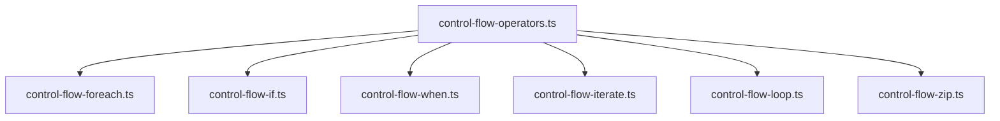
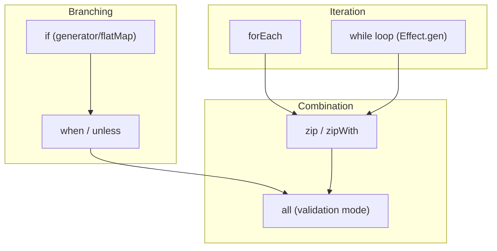
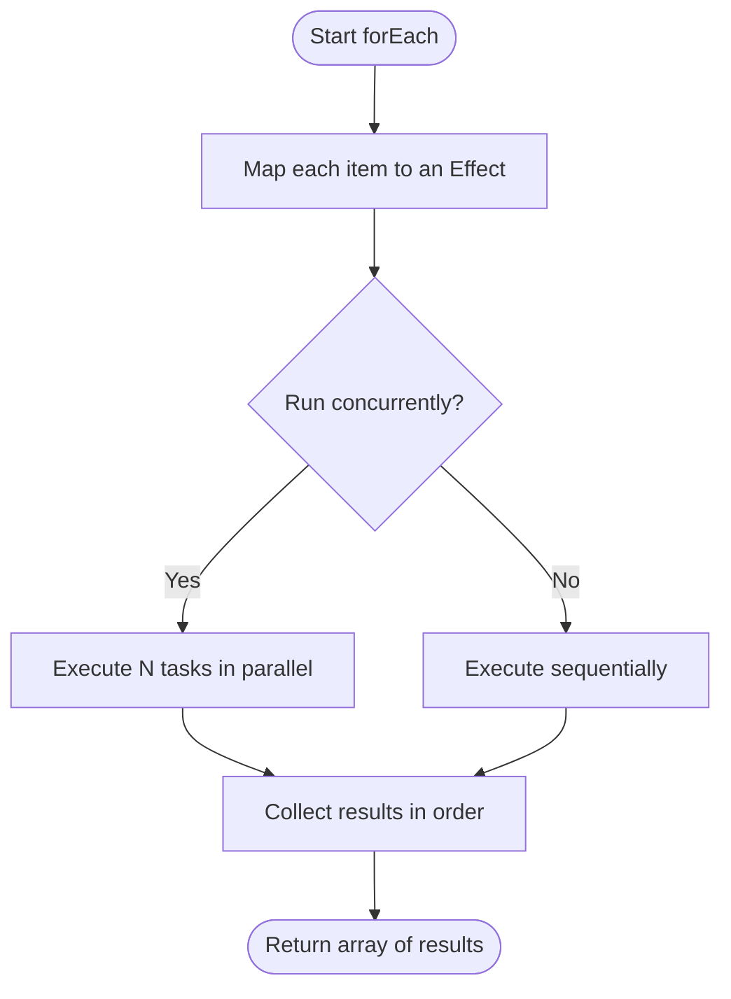
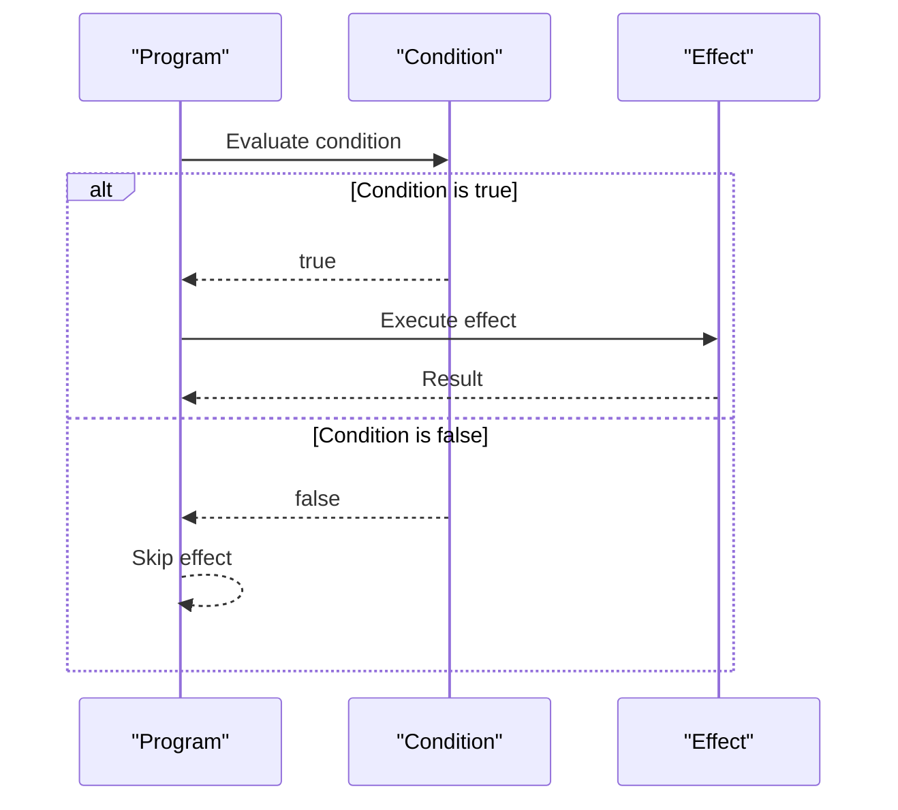
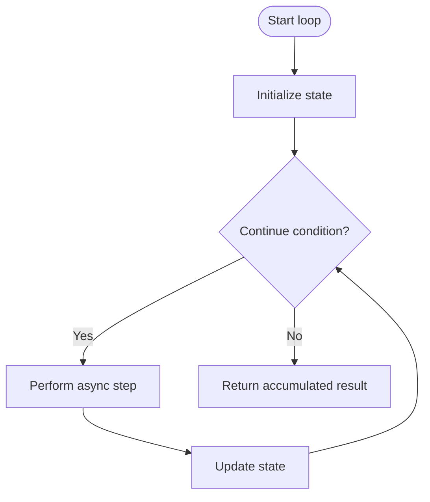
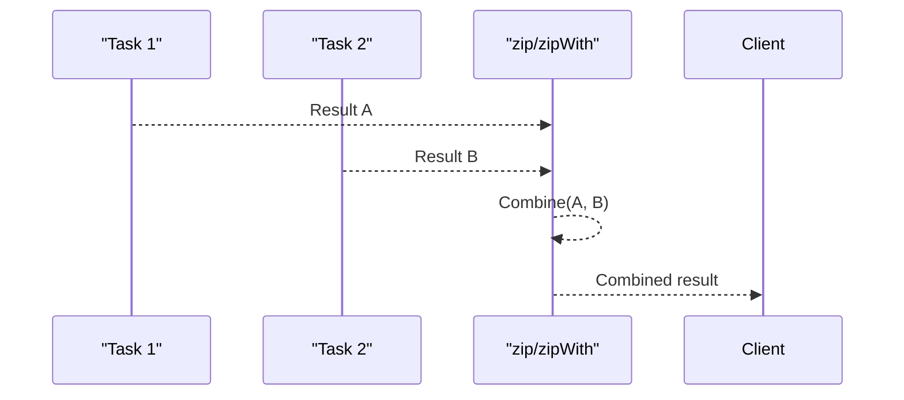
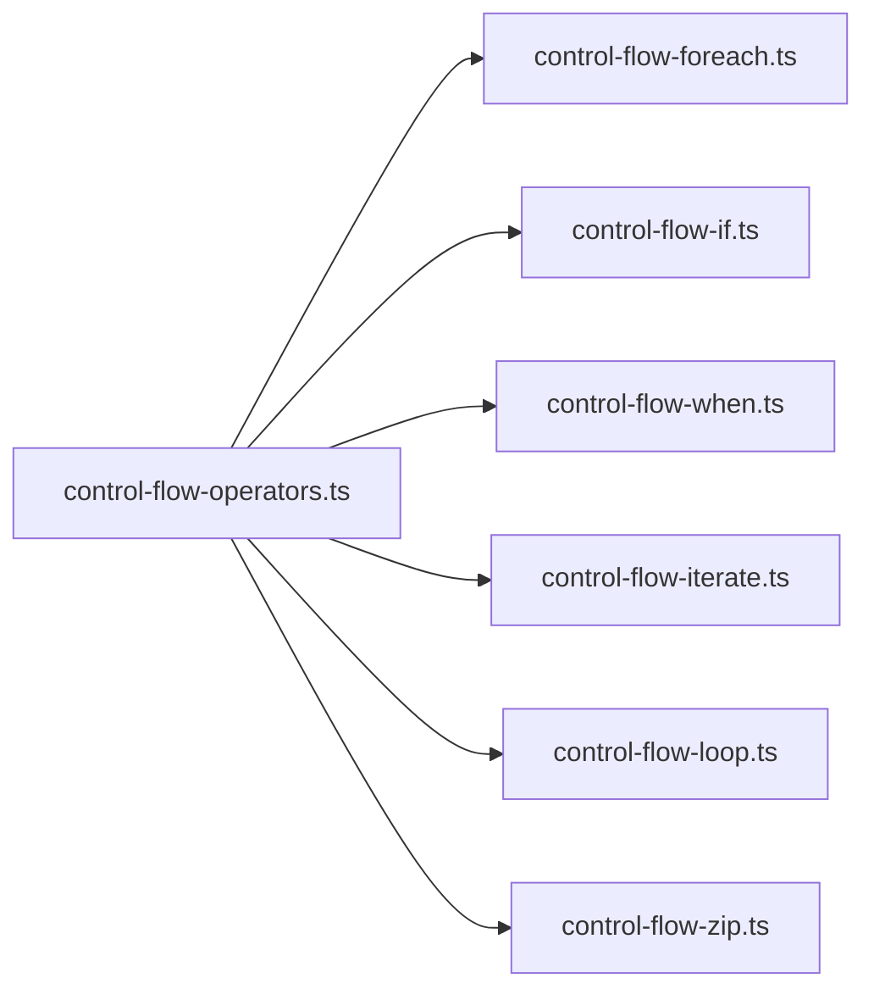

# Control Flow Operators

<cite>
**Referenced Files in This Document**
- [control-flow-operators.ts](file://src/control-flow-operators.ts)
- [control-flow-foreach.ts](file://src/control-flow-foreach.ts)
- [control-flow-if.ts](file://src/control-flow-if.ts)
- [control-flow-when.ts](file://src/control-flow-when.ts)
- [control-flow-iterate.ts](file://src/control-flow-iterate.ts)
- [control-flow-loop.ts](file://src/control-flow-loop.ts)
- [control-flow-zip.ts](file://src/control-flow-zip.ts)
</cite>

## Table of Contents
1. [Introduction](#introduction)
2. [Project Structure](#project-structure)
3. [Core Components](#core-components)
4. [Architecture Overview](#architecture-overview)
5. [Detailed Component Analysis](#detailed-component-analysis)
6. [Dependency Analysis](#dependency-analysis)
7. [Performance Considerations](#performance-considerations)
8. [Troubleshooting Guide](#troubleshooting-guide)
9. [Conclusion](#conclusion)

## Introduction
This document explains advanced asynchronous control flow operators for building robust, concurrent workflows using Effect. It focuses on:
- foreach for processing collections with configurable concurrency and error handling strategies
- if/when for conditional branching based on async conditions
- iterate and loop for complex async loops with early termination support
- zip for combining multiple async operations with result aggregation

It includes usage guidance, performance implications, and best practices for error propagation and resource management in concurrent scenarios.

## Project Structure
The control flow examples are implemented as standalone modules under src/. Each file demonstrates a specific operator or pattern:
- Foreach iteration and mapping
- Conditional branching with if and when
- Iteration patterns with while-based loops
- Combining effects with zip and zipWith
- General operator usage and composition

**Diagram sources**
- [control-flow-operators.ts:1-62](file://src/control-flow-operators.ts#L1-L62)
- [control-flow-foreach.ts:1-20](file://src/control-flow-foreach.ts#L1-L20)
- [control-flow-if.ts:1-56](file://src/control-flow-if.ts#L1-L56)
- [control-flow-when.ts:1-94](file://src/control-flow-when.ts#L1-L94)
- [control-flow-iterate.ts:1-17](file://src/control-flow-iterate.ts#L1-L17)
- [control-flow-loop.ts:1-31](file://src/control-flow-loop.ts#L1-L31)
- [control-flow-zip.ts:1-24](file://src/control-flow-zip.ts#L1-L24)

**Section sources**
- [control-flow-operators.ts:1-62](file://src/control-flow-operators.ts#L1-L62)

## Core Components
- forEach: Processes collections element-by-element, returning mapped results; supports configuration such as concurrency and discarding side effects.
- if/when: Branch execution based on synchronous or asynchronous predicates; when executes an effect only when a condition is true.
- iterate/loop: Use generator-based while loops to perform repeated async steps with full control over termination and accumulation.
- zip/zipWith: Combine multiple async operations into a single effect that resolves with aggregated results; supports concurrent execution.

These components compose naturally within Effect programs to build clear, testable, and resilient workflows.

**Section sources**
- [control-flow-foreach.ts:1-20](file://src/control-flow-foreach.ts#L1-L20)
- [control-flow-if.ts:1-56](file://src/control-flow-if.ts#L1-L56)
- [control-flow-when.ts:1-94](file://src/control-flow-when.ts#L1-L94)
- [control-flow-iterate.ts:1-17](file://src/control-flow-iterate.ts#L1-L17)
- [control-flow-loop.ts:1-31](file://src/control-flow-loop.ts#L1-L31)
- [control-flow-zip.ts:1-24](file://src/control-flow-zip.ts#L1-L24)

## Architecture Overview
The control flow operators form a cohesive set of primitives for sequencing, branching, iterating, and combining asynchronous work. They integrate with Effect’s error channel and concurrency model, enabling predictable behavior under failure and controlled parallelism.

**Diagram sources**
- [control-flow-foreach.ts:1-20](file://src/control-flow-foreach.ts#L1-L20)
- [control-flow-loop.ts:1-31](file://src/control-flow-loop.ts#L1-L31)
- [control-flow-if.ts:1-56](file://src/control-flow-if.ts#L1-L56)
- [control-flow-when.ts:1-94](file://src/control-flow-when.ts#L1-L94)
- [control-flow-zip.ts:1-24](file://src/control-flow-zip.ts#L1-L24)
- [control-flow-operators.ts:16-40](file://src/control-flow-operators.ts#L16-L40)

## Detailed Component Analysis

### forEach: Collection Processing with Concurrency and Error Handling
- Purpose: Map over a collection of items, executing an effect per item and collecting results in order.
- Concurrency: Supports configuring how many items run concurrently. In the examples, unbounded concurrency is used to process all items in parallel.
- Error handling: By default, failures propagate immediately. For validation-style semantics where you want to collect all errors, use Effect.all with mode "result" to aggregate failures instead of failing fast.
- Side effects: You can discard return values by configuring options to ignore mapped results when only side effects matter.

When to use:
- Batch processing where each item triggers an async operation (e.g., API calls, DB writes).
- When you need ordered results or controlled throughput via concurrency limits.

Performance implications:
- Unbounded concurrency maximizes throughput but may overwhelm downstream resources.
- Limit concurrency to protect external systems and reduce memory pressure.

Best practices:
- Prefer bounded concurrency for production workloads.
- Use validation mode (via Effect.all) when you must collect all errors before reporting.
- Keep per-item effects idempotent where possible to simplify retries.

**Diagram sources**
- [control-flow-foreach.ts:1-20](file://src/control-flow-foreach.ts#L1-L20)
- [control-flow-loop.ts:20-31](file://src/control-flow-loop.ts#L20-L31)
- [control-flow-when.ts:63-83](file://src/control-flow-when.ts#L63-L83)

**Section sources**
- [control-flow-foreach.ts:1-20](file://src/control-flow-foreach.ts#L1-L20)
- [control-flow-loop.ts:20-31](file://src/control-flow-loop.ts#L20-L31)
- [control-flow-when.ts:63-83](file://src/control-flow-when.ts#L63-L83)

### if/when: Conditional Control Flow
- if: Branch execution based on a boolean condition. In generators, use standard if statements; in functional style, use flatMap to branch after evaluating an async predicate.
- when: Execute an effect only if a condition is true. Useful for optional side effects or guarded computations.

When to use:
- if for two-way branching based on sync or async conditions.
- when for optional execution paths without else branches.

Error handling:
- Errors inside the executed branch propagate normally.
- Combine with validation patterns (e.g., Option/Result) to avoid short-circuiting when desired.

Best practices:
- Keep conditions pure when possible; defer async evaluation to flatMap or whenEffect variants.
- Use when for optional logging or telemetry to keep main logic clean.

**Diagram sources**
- [control-flow-if.ts:20-38](file://src/control-flow-if.ts#L20-L38)
- [control-flow-when.ts:4-31](file://src/control-flow-when.ts#L4-L31)

**Section sources**
- [control-flow-if.ts:1-56](file://src/control-flow-if.ts#L1-L56)
- [control-flow-when.ts:1-94](file://src/control-flow-when.ts#L1-L94)

### iterate and loop: Complex Async Loops with Early Termination
- iterate/loop: Use generator-based while loops to perform repeated async steps. This gives fine-grained control over iteration state, early exit, and accumulation.
- Early termination: Break out of the loop when a condition is met; return partial results or final state.

When to use:
- Polling, backoff, or retry loops until a success condition.
- Streaming-like processing where you accumulate results incrementally.

Performance implications:
- Generators execute synchronously between yields; ensure heavy work is wrapped in Effects to avoid blocking.
- Avoid tight CPU-bound loops; offload to Effects and consider batching.

Best practices:
- Encapsulate loop logic in a named Effect for reusability and testing.
- Use structured concurrency to manage lifecycle and cancellation.

**Diagram sources**
- [control-flow-iterate.ts:1-17](file://src/control-flow-iterate.ts#L1-L17)
- [control-flow-loop.ts:1-18](file://src/control-flow-loop.ts#L1-L18)

**Section sources**
- [control-flow-iterate.ts:1-17](file://src/control-flow-iterate.ts#L1-L17)
- [control-flow-loop.ts:1-31](file://src/control-flow-loop.ts#L1-L31)

### zip: Combining Multiple Async Operations with Aggregation
- zip: Combine two or more effects into one that resolves with their results. With concurrent: true, they run in parallel.
- zipWith: Combine results using a custom combiner function to produce a single aggregated value.

When to use:
- Fan-out operations where you need all results together (e.g., fetching related data from multiple sources).
- Aggregating metrics or responses from independent tasks.

Error handling:
- Any failure in zipped effects propagates to the combined effect.
- For validation semantics (collect all errors), prefer Effect.all with mode "result".

Best practices:
- Use zipWith to shape outputs into domain-specific structures.
- Ensure underlying effects are cancellable and resource-safe for long-running tasks.

**Diagram sources**
- [control-flow-zip.ts:1-24](file://src/control-flow-zip.ts#L1-L24)

**Section sources**
- [control-flow-zip.ts:1-24](file://src/control-flow-zip.ts#L1-L24)

### Additional Patterns: Structured Concurrency and Validation Mode
- Effect.all: Run multiple effects concurrently and aggregate results into a structure (object or record). Supports validation mode to collect all failures rather than fail-fast.
- Example usage shows structuring results and running with limited concurrency.

When to use:
- When you have heterogeneous inputs (objects/records) and want typed output.
- When you need to validate multiple operations and report all issues.

Best practices:
- Use concurrency limits to avoid overwhelming dependencies.
- Prefer validation mode for user-facing validations to provide comprehensive feedback.

**Section sources**
- [control-flow-operators.ts:16-40](file://src/control-flow-operators.ts#L16-L40)
- [control-flow-when.ts:63-83](file://src/control-flow-when.ts#L63-L83)

## Dependency Analysis
The control flow modules depend on Effect primitives for concurrency, error channels, and utilities like Console and Random. The relationships emphasize composition:
- forEach builds on Effect’s concurrency model and error propagation.
- if/when rely on Effect’s branching and condition evaluation.
- iterate/loop leverage generator-based sequencing.
- zip/zipWith combine independent effects into coordinated workflows.

**Diagram sources**
- [control-flow-operators.ts:1-62](file://src/control-flow-operators.ts#L1-L62)
- [control-flow-foreach.ts:1-20](file://src/control-flow-foreach.ts#L1-L20)
- [control-flow-if.ts:1-56](file://src/control-flow-if.ts#L1-L56)
- [control-flow-when.ts:1-94](file://src/control-flow-when.ts#L1-L94)
- [control-flow-iterate.ts:1-17](file://src/control-flow-iterate.ts#L1-L17)
- [control-flow-loop.ts:1-31](file://src/control-flow-loop.ts#L1-L31)
- [control-flow-zip.ts:1-24](file://src/control-flow-zip.ts#L1-L24)

**Section sources**
- [control-flow-operators.ts:1-62](file://src/control-flow-operators.ts#L1-L62)

## Performance Considerations
- Concurrency control: Use bounded concurrency in forEach/all to prevent resource exhaustion. Unbounded concurrency can spike memory and overload downstream services.
- Validation vs fail-fast: Choose validation mode when you need complete error sets; otherwise, fail-fast reduces latency by stopping at the first error.
- Loop efficiency: Keep loop bodies lightweight; wrap expensive work in Effects to avoid blocking the event loop.
- Resource management: Prefer structured concurrency so resources are released deterministically when fibers are cancelled or completed.

[No sources needed since this section provides general guidance]

## Troubleshooting Guide
Common issues and resolutions:
- Unexpected early termination: If a task fails in a parallel workflow, it may short-circuit. Switch to validation mode to collect all errors before failing.
- Memory spikes: High concurrency can cause memory pressure. Reduce concurrency or batch work.
- Stalled loops: Ensure loop conditions eventually become false; add timeouts or max iterations to prevent infinite loops.
- Error propagation: Wrap risky operations with appropriate error handling (catch/recover) to convert defects into recoverable errors.

**Section sources**
- [control-flow-when.ts:63-83](file://src/control-flow-when.ts#L63-L83)
- [control-flow-operators.ts:44-62](file://src/control-flow-operators.ts#L44-L62)

## Conclusion
Effect’s control flow operators provide a powerful toolkit for managing asynchronous workflows:
- Use forEach for scalable collection processing with concurrency controls.
- Apply if/when for clear conditional branching based on sync or async conditions.
- Implement iterate/loop for complex, stateful async iterations with precise control.
- Combine tasks with zip/zipFor efficient fan-out and aggregation.

Adopt validation modes for comprehensive error reporting, constrain concurrency to protect resources, and structure your code for clarity and testability. These patterns yield resilient, maintainable applications that scale gracefully under load.

[No sources needed since this section summarizes without analyzing specific files]