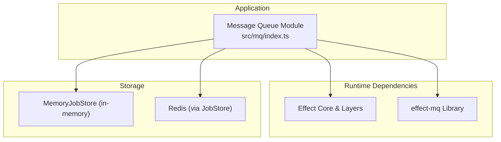
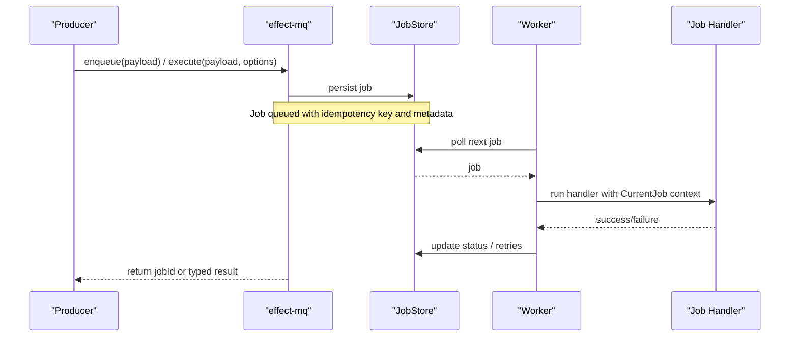
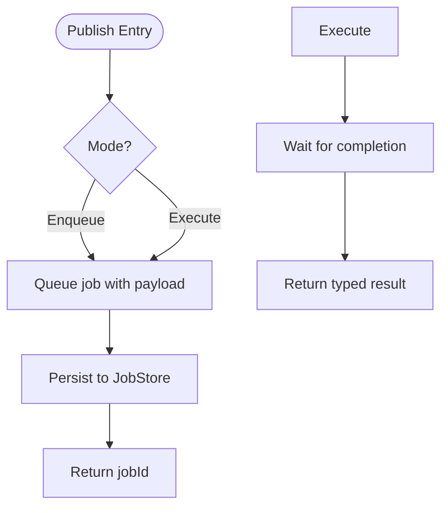
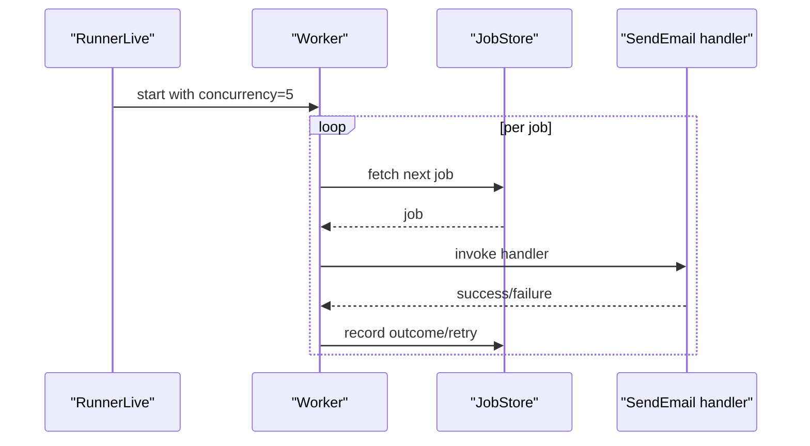
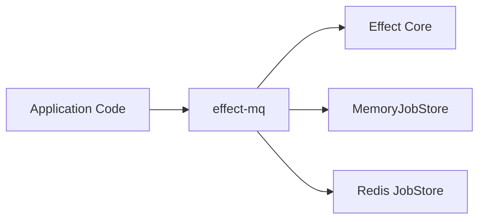

# Message Queue Integration

<cite>
**Referenced Files in This Document**
- [src/mq/index.ts](file://src/mq/index.ts)
- [package.json](file://package.json)
- [docker-compose.yml](file://docker-compose.yml)
</cite>

## Table of Contents
1. [Introduction](#introduction)
2. [Project Structure](#project-structure)
3. [Core Components](#core-components)
4. [Architecture Overview](#architecture-overview)
5. [Detailed Component Analysis](#detailed-component-analysis)
6. [Dependency Analysis](#dependency-analysis)
7. [Performance Considerations](#performance-considerations)
8. [Troubleshooting Guide](#troubleshooting-guide)
9. [Conclusion](#conclusion)
10. [Appendices](#appendices)

## Introduction
This document explains how the project integrates background job processing using the effect-mq library with Effect’s layered services. It covers publishing and consuming messages asynchronously, queue configuration options, message serialization via Effect Schema, error handling strategies, lifecycle management for connections, and resource cleanup. Practical examples include email processing, data transformation pipelines, and scheduled tasks. Scaling considerations, monitoring approaches, and troubleshooting techniques for distributed scenarios are also provided.

## Project Structure
The message queue integration is implemented under src/mq/index.ts and depends on the effect-mq package declared in package.json. A Redis service is provisioned via docker-compose.yml to support persistent job storage in production-like environments.



**Diagram sources**
- [src/mq/index.ts:1-39](file://src/mq/index.ts#L1-L39)
- [package.json:23-28](file://package.json#L23-L28)
- [docker-compose.yml:1-21](file://docker-compose.yml#L1-L21)

**Section sources**
- [src/mq/index.ts:1-39](file://src/mq/index.ts#L1-L39)
- [package.json:23-28](file://package.json#L23-L28)
- [docker-compose.yml:1-21](file://docker-compose.yml#L1-L21)

## Core Components
- Job definition and typing: Jobs are defined by extending a base class created from a factory function. Payloads and success types are validated and serialized using Effect Schema.
- Publishing: Two modes are supported:
  - Fire-and-forget enqueue that returns a job identifier.
  - Enqueue and await that returns a typed result once the job completes.
- Consuming: A worker layer processes jobs with configurable concurrency. The current job context is available inside handlers.
- Persistence: In-memory store is used by default; it can be swapped for a persistent store such as Redis or Postgres through dependency injection.

Key implementation references:
- Job definition with payload schema, success type, idempotency key, metadata, queue name, and retry/backoff defaults.
- Program demonstrating enqueue and execute patterns.
- RunnerLive layer wiring Worker and JobStore with concurrency settings.

**Section sources**
- [src/mq/index.ts:6-16](file://src/mq/index.ts#L6-L16)
- [src/mq/index.ts:18-30](file://src/mq/index.ts#L18-L30)
- [src/mq/index.ts:32-39](file://src/mq/index.ts#L32-L39)

## Architecture Overview
The system uses Effect’s Layer abstraction to compose services:
- Producer code enqueues jobs without blocking.
- Consumer workers pull jobs from a named queue and process them concurrently.
- Job persistence is abstracted behind a JobStore interface; memory-backed for development, Redis-backed for production.



**Diagram sources**
- [src/mq/index.ts:18-30](file://src/mq/index.ts#L18-L30)
- [src/mq/index.ts:32-39](file://src/mq/index.ts#L32-L39)

## Detailed Component Analysis

### Job Definition and Serialization
- Payload schema ensures strongly-typed inputs and safe serialization.
- Success schema defines the typed output of the job.
- Idempotency key prevents duplicate processing when the same logical operation is enqueued multiple times.
- Metadata provides queryable context for observability and routing.
- Queue name partitions workloads into separate queues.
- Defaults configure retry attempts and backoff strategy.

```mermaid
classDiagram
class SendEmail {
+payload : { to : string, subject : string }
+success : string
+idempotencyKey(payload) : string
+metadata(payload) : object
+queue : "email"
+defaults : { attempts : number, backoff : object }
}
```

**Diagram sources**
- [src/mq/index.ts:6-16](file://src/mq/index.ts#L6-L16)

**Section sources**
- [src/mq/index.ts:6-16](file://src/mq/index.ts#L6-L16)

### Publishing Messages Asynchronously
- Fire-and-forget: Enqueue returns a job identifier immediately, suitable for non-blocking operations like sending notifications.
- Execute: Enqueue and await returns a typed result once the job completes, useful when the caller needs confirmation or downstream data.



**Diagram sources**
- [src/mq/index.ts:18-30](file://src/mq/index.ts#L18-L30)

**Section sources**
- [src/mq/index.ts:18-30](file://src/mq/index.ts#L18-L30)

### Consuming Jobs and Lifecycle Management
- Worker layer runs job handlers with a configured concurrency limit to control throughput and resource usage.
- Current job context is accessible within handlers for logging and tracing.
- Dependency injection composes Worker and JobStore layers; swapping stores enables environment-specific behavior.



**Diagram sources**
- [src/mq/index.ts:32-39](file://src/mq/index.ts#L32-L39)

**Section sources**
- [src/mq/index.ts:32-39](file://src/mq/index.ts#L32-L39)

### Queue Configuration Options
- Queue name: Partitions jobs into distinct queues for isolation and routing.
- Attempts: Number of retry attempts before marking a job as failed.
- Backoff: Strategy and delay for retries; supports exponential backoff with a base delay.
- Concurrency: Limits the number of concurrent job executions per worker instance.
- Priority and Delay: Execution options for scheduling jobs with different priorities or delayed execution.

These options are demonstrated in the job definition and enqueue/execute calls.

**Section sources**
- [src/mq/index.ts:6-16](file://src/mq/index.ts#L6-L16)
- [src/mq/index.ts:18-30](file://src/mq/index.ts#L18-L30)
- [src/mq/index.ts:32-39](file://src/mq/index.ts#L32-L39)

### Error Handling Strategies
- Retry with backoff: Configured at the job level to handle transient failures gracefully.
- Idempotency: Prevents duplicate processing during retries or re-enqueues.
- Typed results: Consumers awaiting execution receive typed outcomes, enabling precise error handling upstream.
- Observability: Metadata and job identifiers support logging and tracing across producer/consumer boundaries.

**Section sources**
- [src/mq/index.ts:6-16](file://src/mq/index.ts#L6-L16)
- [src/mq/index.ts:18-30](file://src/mq/index.ts#L18-L30)

### Resource Cleanup and Connection Lifecycle
- Worker and JobStore are provided as Effect Layers, ensuring proper acquisition and release of resources within scopes.
- Swapping MemoryJobStore for a persistent store (e.g., Redis) is done via Layer composition, allowing clean separation between development and production configurations.
- Concurrency limits prevent resource exhaustion under load.

**Section sources**
- [src/mq/index.ts:32-39](file://src/mq/index.ts#L32-L39)
- [docker-compose.yml:1-21](file://docker-compose.yml#L1-L21)

### Practical Use Cases
- Email Processing: Define a job with recipient and subject, set retry/backoff for transient SMTP issues, and use fire-and-forget enqueue for responsiveness.
- Data Transformation Pipelines: Chain jobs with priority and delay to stage transformations; use metadata to track pipeline step context.
- Scheduled Tasks: Use delay and priority to schedule periodic or time-sensitive jobs; combine with idempotency keys to avoid duplicates.

[No sources needed since this section provides conceptual guidance]

## Dependency Analysis
The integration relies on Effect and effect-mq, with optional persistent storage via Redis.



**Diagram sources**
- [package.json:23-28](file://package.json#L23-L28)
- [src/mq/index.ts:1-3](file://src/mq/index.ts#L1-L3)
- [docker-compose.yml:1-21](file://docker-compose.yml#L1-L21)

**Section sources**
- [package.json:23-28](file://package.json#L23-L28)
- [src/mq/index.ts:1-3](file://src/mq/index.ts#L1-L3)
- [docker-compose.yml:1-21](file://docker-compose.yml#L1-L21)

## Performance Considerations
- Concurrency tuning: Adjust worker concurrency to match CPU and I/O characteristics; higher concurrency increases throughput but may increase contention.
- Backoff strategy: Exponential backoff reduces pressure on downstream systems during outages; tune base delay and max attempts based on workload.
- Idempotency: Ensure handlers are idempotent to safely retry without side effects.
- Storage choice: Use in-memory store for local development; switch to Redis or Postgres for durability and horizontal scaling.
- Scheduling: Leverage priority and delay to manage hot paths and batch jobs efficiently.

[No sources needed since this section provides general guidance]

## Troubleshooting Guide
- Duplicate processing: Verify idempotency key logic; ensure it uniquely identifies the logical operation.
- Stuck jobs: Check retry counts and backoff settings; inspect logs using metadata and job IDs.
- Slow consumers: Reduce concurrency or optimize handler performance; consider splitting heavy jobs into smaller steps.
- Storage connectivity: Validate Redis availability and credentials; monitor health checks and connection errors.
- Dead-lettering: Implement a strategy to move permanently failed jobs to a dead-letter queue for inspection.

[No sources needed since this section provides general guidance]

## Conclusion
The project demonstrates a robust, type-safe approach to background job processing using effect-mq and Effect’s layered architecture. By defining jobs with schemas, configuring retries and backoff, and composing Worker and JobStore layers, teams can build scalable, observable, and resilient message-driven workflows. Switching between in-memory and persistent stores enables smooth transitions from development to production.

[No sources needed since this section summarizes without analyzing specific files]

## Appendices

### Example: Email Processing Workflow
- Define a job with payload schema for recipient and subject.
- Configure attempts and exponential backoff for resilience.
- Use fire-and-forget enqueue for immediate response; optionally await execution for confirmation.
- Provide metadata for tracking and logging.

**Section sources**
- [src/mq/index.ts:6-16](file://src/mq/index.ts#L6-L16)
- [src/mq/index.ts:18-30](file://src/mq/index.ts#L18-L30)

### Example: Data Transformation Pipeline
- Create sequential jobs with priority and delay to orchestrate stages.
- Use metadata to carry intermediate state and lineage.
- Apply idempotency keys to ensure safe retries across stages.

[No sources needed since this section provides conceptual guidance]

### Example: Scheduled Tasks
- Schedule jobs using delay and priority to run at specific times or intervals.
- Combine with idempotency keys to avoid duplicate executions.
- Monitor via metadata and job IDs for observability.

[No sources needed since this section provides conceptual guidance]