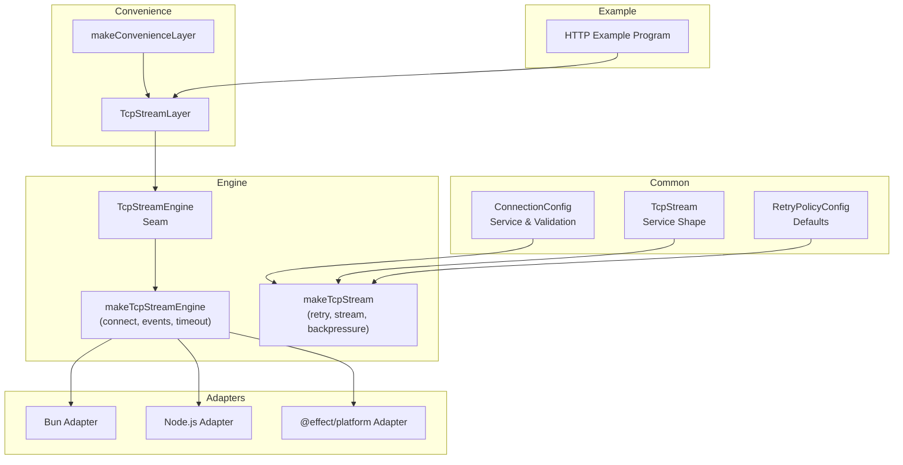
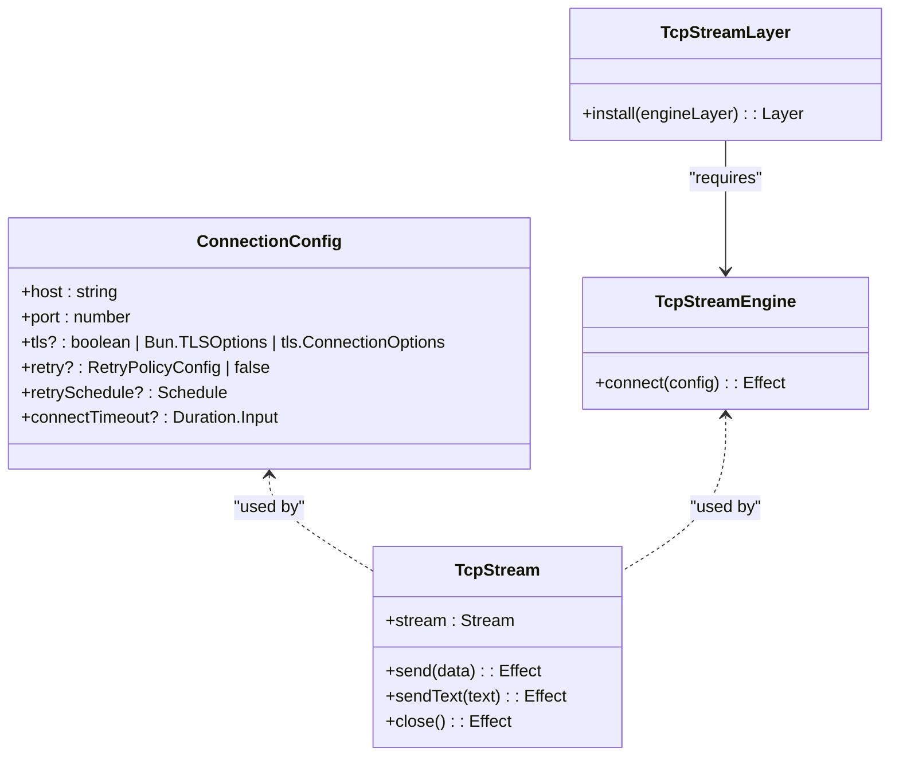
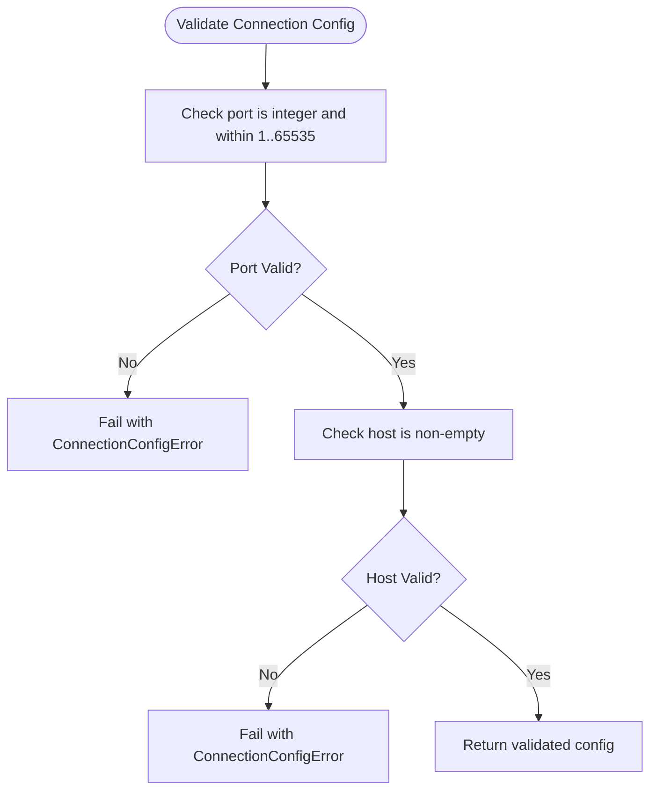
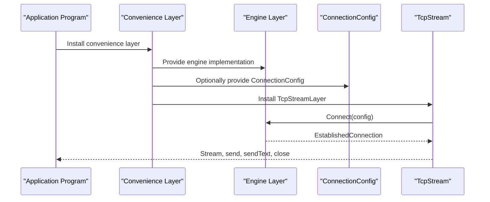
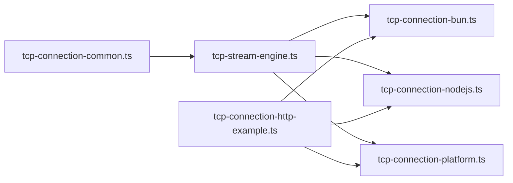

# Configuration and Services

<cite>
**Referenced Files in This Document**
- [tcp-connection-common.ts](file://src/tcp-connection-common.ts)
- [tcp-stream-engine.ts](file://src/tcp-stream-engine.ts)
- [tcp-connection-bun.ts](file://src/tcp-connection-bun.ts)
- [tcp-connection-nodejs.ts](file://src/tcp-connection-nodejs.ts)
- [tcp-connection-platform.ts](file://src/tcp-connection-platform.ts)
- [tcp-connection-http-example.ts](file://src/tcp-connection-http-example.ts)
- [default-services.ts](file://src/default-services.ts)
- [index.ts](file://src/index.ts)
</cite>

## Table of Contents
1. [Introduction](#introduction)
2. [Project Structure](#project-structure)
3. [Core Components](#core-components)
4. [Architecture Overview](#architecture-overview)
5. [Detailed Component Analysis](#detailed-component-analysis)
6. [Dependency Analysis](#dependency-analysis)
7. [Performance Considerations](#performance-considerations)
8. [Troubleshooting Guide](#troubleshooting-guide)
9. [Conclusion](#conclusion)

## Introduction
This document explains the service layer architecture, dependency injection patterns, configuration schema, validation rules, default services, and Effect Layers composition used in this repository. It focuses on how TCP connectivity is modeled as a service, how platform-specific implementations are composed through layers, and how to extend or override services for custom environments.

## Project Structure
The relevant parts of the codebase form a layered service architecture:
- Common types, services, and validation live in a shared module.
- A reusable engine orchestrates connection lifecycle, retries, timeouts, and streaming.
- Platform adapters implement the engine seam for Bun, Node.js, and @effect/platform.
- Convenience layers package engine + configuration into a single installable service.
- An example program demonstrates environment selection, configuration construction, and layer wiring.

**Diagram sources**
- [tcp-connection-common.ts:12-60](file://src/tcp-connection-common.ts#L12-L60)
- [tcp-stream-engine.ts:49-67](file://src/tcp-stream-engine.ts#L49-L67)
- [tcp-stream-engine.ts:89-178](file://src/tcp-stream-engine.ts#L89-L178)
- [tcp-stream-engine.ts:201-341](file://src/tcp-stream-engine.ts#L201-L341)
- [tcp-connection-bun.ts:18-135](file://src/tcp-connection-bun.ts#L18-L135)
- [tcp-connection-nodejs.ts:21-115](file://src/tcp-connection-nodejs.ts#L21-L115)
- [tcp-connection-platform.ts:17-121](file://src/tcp-connection-platform.ts#L17-L121)
- [tcp-connection-http-example.ts:152-254](file://src/tcp-connection-http-example.ts#L152-L254)

**Section sources**
- [tcp-connection-common.ts:12-60](file://src/tcp-connection-common.ts#L12-L60)
- [tcp-stream-engine.ts:49-67](file://src/tcp-stream-engine.ts#L49-L67)
- [tcp-connection-bun.ts:18-135](file://src/tcp-connection-bun.ts#L18-L135)
- [tcp-connection-nodejs.ts:21-115](file://src/tcp-connection-nodejs.ts#L21-L115)
- [tcp-connection-platform.ts:17-121](file://src/tcp-connection-platform.ts#L17-L121)
- [tcp-connection-http-example.ts:152-254](file://src/tcp-connection-http-example.ts#L152-L254)

## Core Components
- ConnectionConfigShape defines the connection configuration contract.
- TcpStreamShape defines the public TCP stream service API.
- RetryPolicyConfig defines retry behavior defaults.
- TcpStreamEngineShape defines the engine seam that adapters must implement.
- makeTcpStream composes retry, streaming, backpressure, and resource management.
- Convenience layers provide a single entry point to install both engine and configuration.

Key responsibilities:
- Configuration validation ensures host and port are valid before connecting.
- Engine abstraction isolates platform-specific socket logic from orchestration.
- Service tags (Context.Service) enable dependency injection via Effect Layers.

**Section sources**
- [tcp-connection-common.ts:37-60](file://src/tcp-connection-common.ts#L37-L60)
- [tcp-stream-engine.ts:49-67](file://src/tcp-stream-engine.ts#L49-L67)
- [tcp-stream-engine.ts:201-341](file://src/tcp-stream-engine.ts#L201-L341)

## Architecture Overview
The system uses Effect’s Context and Layer model for dependency injection:
- Services are declared with Context.Service and provided by Layers.
- The engine seam abstracts platform differences behind a uniform interface.
- Convenience layers combine engine implementation and configuration into one installable unit.
- Programs depend only on abstractions (TcpStream, ConnectionConfig), not concrete platforms.

**Diagram sources**
- [tcp-connection-common.ts:45-60](file://src/tcp-connection-common.ts#L45-L60)
- [tcp-stream-engine.ts:49-67](file://src/tcp-stream-engine.ts#L49-L67)
- [tcp-stream-engine.ts:341-358](file://src/tcp-stream-engine.ts#L341-L358)

## Detailed Component Analysis

### Connection Configuration Schema, Validation, and Defaults
- Schema fields:
  - host: required string
  - port: required integer between 1 and 65535
  - tls: optional; accepts boolean or platform TLS options
  - retry: optional policy or false to disable retries
  - retrySchedule: optional explicit schedule overriding retry policy
  - connectTimeout: optional duration for connection attempts
- Validation:
  - validateHostAndPort enforces port range and non-empty host.
  - validateConnectionConfig delegates to host/port validation and returns the original config when valid.
- Defaults:
  - buildDefaultRetrySchedule provides exponential backoff with jitter, capped by maxAttempts and maxDuration.
  - Default connectTimeout is applied at the engine level if not specified.

**Diagram sources**
- [tcp-connection-common.ts:65-88](file://src/tcp-connection-common.ts#L65-L88)

**Section sources**
- [tcp-connection-common.ts:45-100](file://src/tcp-connection-common.ts#L45-L100)

### Effect Layers System for Service Composition
- Services are defined using Context.Service:
  - ConnectionConfig exposes host, port, tls, retry, retrySchedule, connectTimeout.
  - TcpStream exposes stream, send, sendText, close.
  - TcpStreamEngine exposes connect(config).
- Provisioning:
  - ConnectionConfigLive installs a static ConnectionConfig.
  - Each platform exports an engine layer (e.g., TcpStreamEngineBunLive).
  - makeConvenienceLayer combines an engine layer with TcpStreamLayer and optionally injects ConnectionConfig.
- Composition rules:
  - Compose dependent layers once and provide them to effects.
  - Avoid chaining multiple Effect.provide calls; prefer Layer.provide/Layer.merge.

**Diagram sources**
- [tcp-stream-engine.ts:341-358](file://src/tcp-stream-engine.ts#L341-L358)
- [tcp-connection-bun.ts:133-137](file://src/tcp-connection-bun.ts#L133-L137)
- [tcp-connection-nodejs.ts:114-120](file://src/tcp-connection-nodejs.ts#L114-L120)
- [tcp-connection-platform.ts:121-128](file://src/tcp-connection-platform.ts#L121-L128)

**Section sources**
- [tcp-stream-engine.ts:341-358](file://src/tcp-stream-engine.ts#L341-L358)
- [tcp-connection-bun.ts:133-137](file://src/tcp-connection-bun.ts#L133-L137)
- [tcp-connection-nodejs.ts:114-120](file://src/tcp-connection-nodejs.ts#L114-L120)
- [tcp-connection-platform.ts:121-128](file://src/tcp-connection-platform.ts#L121-L128)

### Default Services Provided by the Library
- Built-in services:
  - ConnectionConfig: typed configuration service tag.
  - TcpStream: high-level TCP stream service with streaming reads and buffered writes.
  - TcpStreamEngine: low-level engine seam for platform adapters.
- Default behaviors:
  - Retry policy defaults to exponential backoff with jitter unless disabled or overridden.
  - Connect timeout defaults to a fixed duration when not configured.
  - Error channel uses tagged errors (TcpStreamError, ConnectionConfigError) for structured error handling.

How to use:
- Install a convenience layer to get TcpStream with a chosen engine.
- Provide ConnectionConfig either directly to the convenience layer or separately.

**Section sources**
- [tcp-connection-common.ts:12-60](file://src/tcp-connection-common.ts#L12-L60)
- [tcp-stream-engine.ts:201-341](file://src/tcp-stream-engine.ts#L201-L341)

### Extending or Overriding Services
- Override ConnectionConfig:
  - Use ConnectionConfigLive with your own configuration object.
- Replace engine implementation:
  - Provide a custom TcpStreamEngine layer implementing the connect method.
- Extend retry behavior:
  - Supply retrySchedule to bypass default retry policy.
  - Or configure RetryPolicyConfig to tune initialDelay, factor, maxAttempts, maxDuration, jitter.

Examples of extension points:
- Custom engine adapter implementing the cold adapter protocol.
- Custom layer factory wrapping makeConvenienceLayer with additional middleware or logging.

**Section sources**
- [tcp-connection-common.ts:54-60](file://src/tcp-connection-common.ts#L54-L60)
- [tcp-stream-engine.ts:89-178](file://src/tcp-stream-engine.ts#L89-L178)
- [tcp-stream-engine.ts:238-257](file://src/tcp-stream-engine.ts#L238-L257)

### Creating Custom Services and Integrating External Dependencies
- Define a new service:
  - Create a Context.Service subclass with a shape describing methods and properties.
- Provide it via a Layer:
  - Use Layer.succeed for pure values or Layer.effect for scoped resources.
- Inject dependencies:
  - Access other services using yield* inside Effect.gen.
- Example patterns in this repo:
  - default-services.ts shows usage of built-in Effect services like Clock and Random, including overriding Random with a seeded generator.
  - index.ts shows a minimal program using Console.log via Effect.runSync.

Integration tips:
- Wrap external SDKs with Effect callbacks or try/tryPromise to integrate side effects safely.
- Prefer specific interfaces per external operation to improve testability and mocking.

**Section sources**
- [default-services.ts:1-31](file://src/default-services.ts#L1-L31)
- [index.ts:1-6](file://src/index.ts#L1-L6)

### Environment-Specific Configuration Strategies
- CLI-driven engine selection:
  - The HTTP example parses --engine flags and selects Bun, Node.js, or platform implementation.
- URL-to-config mapping:
  - makeConnectionConfig builds ConnectionConfigShape from a URL, enabling HTTPS with TLS options.
- Runtime defaults:
  - If connectTimeout is omitted, the engine applies a default timeout.
  - If retry is omitted, default exponential backoff with jitter is used unless explicitly disabled.

Environment strategies:
- For development: disable retries or set short timeouts.
- For production: enable retries with tuned parameters and strict TLS settings.
- For testing: provide deterministic random seeds and mock external services via layers.

**Section sources**
- [tcp-connection-http-example.ts:49-116](file://src/tcp-connection-http-example.ts#L49-L116)
- [tcp-connection-http-example.ts:152-170](file://src/tcp-connection-http-example.ts#L152-L170)
- [tcp-stream-engine.ts:180-195](file://src/tcp-stream-engine.ts#L180-L195)
- [tcp-stream-engine.ts:238-257](file://src/tcp-stream-engine.ts#L238-L257)

### Configuration Validation Approaches
- Synchronous validation:
  - validateHostAndPort validates port range and host presence.
  - validateConnectionConfig composes validations and returns Result.
- Integration with Effect:
  - Convert Result to Effect using Effect.fromResult to fail fast during effect execution.
- Tagged errors:
  - ConnectionConfigError carries a message for user-friendly diagnostics.

Validation flow:
- Validate host and port early.
- On success, proceed to connect with configured retry and timeout policies.
- On failure, surface structured errors for downstream handling.

**Section sources**
- [tcp-connection-common.ts:65-88](file://src/tcp-connection-common.ts#L65-L88)
- [tcp-stream-engine.ts:201-206](file://src/tcp-stream-engine.ts#L201-L206)

## Dependency Analysis
The following diagram maps dependencies among core modules:

**Diagram sources**
- [tcp-connection-common.ts:1-101](file://src/tcp-connection-common.ts#L1-L101)
- [tcp-stream-engine.ts:1-359](file://src/tcp-stream-engine.ts#L1-L359)
- [tcp-connection-bun.ts:1-145](file://src/tcp-connection-bun.ts#L1-L145)
- [tcp-connection-nodejs.ts:1-132](file://src/tcp-connection-nodejs.ts#L1-L132)
- [tcp-connection-platform.ts:1-135](file://src/tcp-connection-platform.ts#L1-L135)
- [tcp-connection-http-example.ts:1-301](file://src/tcp-connection-http-example.ts#L1-L301)

**Section sources**
- [tcp-connection-common.ts:1-101](file://src/tcp-connection-common.ts#L1-L101)
- [tcp-stream-engine.ts:1-359](file://src/tcp-stream-engine.ts#L1-L359)
- [tcp-connection-bun.ts:1-145](file://src/tcp-connection-bun.ts#L1-L145)
- [tcp-connection-nodejs.ts:1-132](file://src/tcp-connection-nodejs.ts#L1-L132)
- [tcp-connection-platform.ts:1-135](file://src/tcp-connection-platform.ts#L1-L135)
- [tcp-connection-http-example.ts:1-301](file://src/tcp-connection-http-example.ts#L1-L301)

## Performance Considerations
- Backpressure handling:
  - Writes wait for drain signals to avoid overwhelming the socket.
- Concurrency safety:
  - A semaphore serializes concurrent writes to prevent interleaving.
- Resource management:
  - acquireRelease ensures sockets are closed even on failures.
- Timeouts and retries:
  - Connect timeouts prevent hanging connections.
  - Exponential backoff with jitter reduces thundering herd scenarios.

[No sources needed since this section provides general guidance]

## Troubleshooting Guide
Common issues and resolutions:
- Invalid host or port:
  - Ensure host is non-empty and port is within 1–65535.
- Connection timeout:
  - Increase connectTimeout or verify network reachability.
- TLS misconfiguration:
  - Verify TLS options match the target server requirements.
- Retry exhaustion:
  - Tune RetryPolicyConfig or disable retries for idempotent operations.
- Write failures:
  - Inspect TcpStreamError.operation and message; check for closed connections or drained sockets.

Error handling patterns:
- Use Effect.catchTag to handle TcpStreamError variants.
- Log structured errors without clearing the error channel using tapError.

**Section sources**
- [tcp-connection-common.ts:12-24](file://src/tcp-connection-common.ts#L12-L24)
- [tcp-stream-engine.ts:180-195](file://src/tcp-stream-engine.ts#L180-L195)
- [tcp-connection-http-example.ts:271-296](file://src/tcp-connection-http-example.ts#L271-L296)

## Conclusion
This repository implements a robust, layered service architecture centered around Effect’s Context and Layer model. Configuration is validated early, retries and timeouts are configurable, and platform differences are isolated behind a clean engine seam. By composing convenience layers, applications can select engines and configurations declaratively while keeping business logic free of infrastructure concerns. Extensibility is straightforward: define new services, provide them via layers, and compose them where needed.