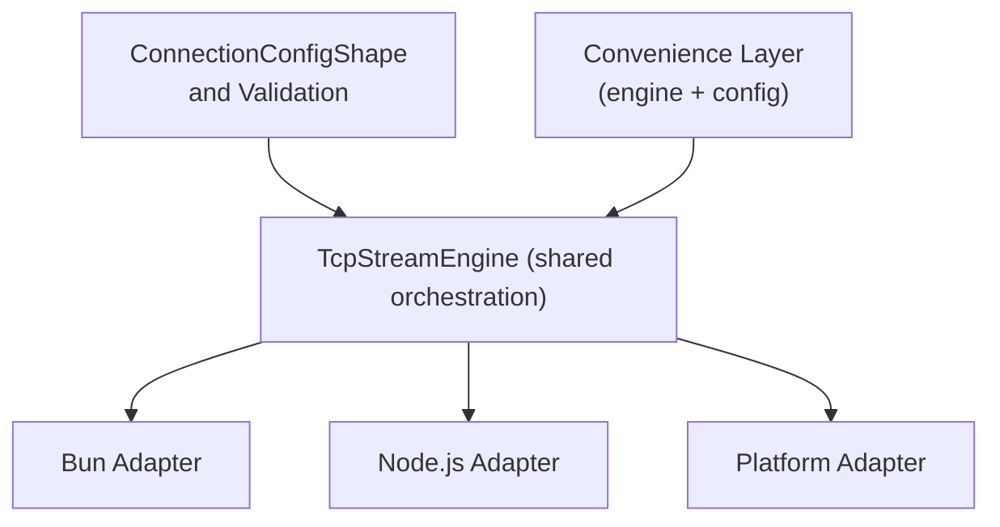
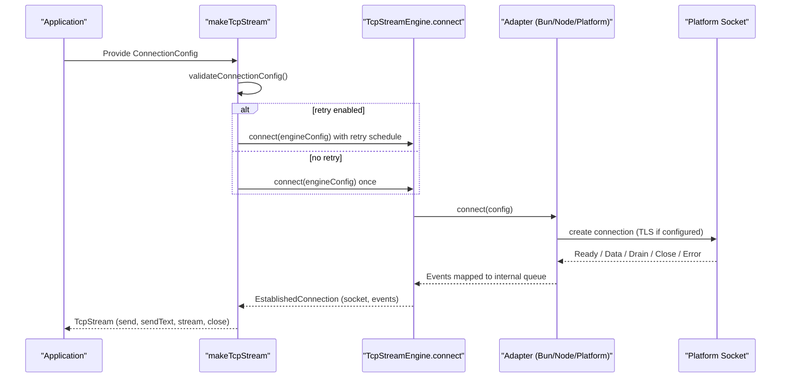
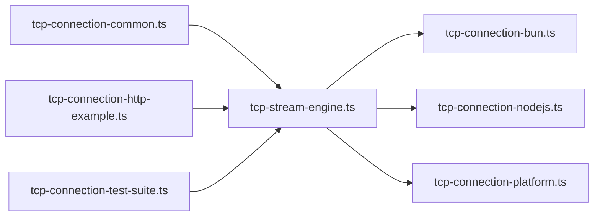

# Connection Configuration

<cite>
**Referenced Files in This Document**
- [tcp-connection-common.ts](file://src/tcp-connection-common.ts)
- [tcp-stream-engine.ts](file://src/tcp-stream-engine.ts)
- [tcp-connection-bun.ts](file://src/tcp-connection-bun.ts)
- [tcp-connection-nodejs.ts](file://src/tcp-connection-nodejs.ts)
- [tcp-connection-platform.ts](file://src/tcp-connection-platform.ts)
- [tcp-connection-http-example.ts](file://src/tcp-connection-http-example.ts)
- [tcp-connection-test-suite.ts](file://src/tcp-connection-test-suite.ts)
</cite>

## Table of Contents
1. Introduction
2. Project Structure
3. Core Components
4. Architecture Overview
5. Detailed Component Analysis
6. Dependency Analysis
7. Performance Considerations
8. Troubleshooting Guide
9. Conclusion

## Introduction
This document explains the connection configuration system centered on the ConnectionConfigShape interface and its validation, retry policies, timeouts, and TLS options. It covers default values, validation rules, environment-specific usage, error handling, and troubleshooting for common configuration issues across Bun, Node.js, and platform adapters.

## Project Structure
The connection configuration is defined centrally and consumed by engine-specific adapters:
- Central definitions and validation live in the shared module.
- Engine adapters implement low-level socket connections using platform APIs while honoring the shared configuration.
- A convenience layer composes a TcpStream service with an engine and optional configuration.

**Diagram sources**
- [tcp-connection-common.ts:45-100](file://src/tcp-connection-common.ts#L45-L100)
- [tcp-stream-engine.ts:49-67](file://src/tcp-stream-engine.ts#L49-L67)
- [tcp-connection-bun.ts:18-135](file://src/tcp-connection-bun.ts#L18-L135)
- [tcp-connection-nodejs.ts:21-119](file://src/tcp-connection-nodejs.ts#L21-L119)
- [tcp-connection-platform.ts:17-128](file://src/tcp-connection-platform.ts#L17-L128)

**Section sources**
- [tcp-connection-common.ts:45-100](file://src/tcp-connection-common.ts#L45-L100)
- [tcp-stream-engine.ts:49-67](file://src/tcp-stream-engine.ts#L49-L67)

## Core Components
- ConnectionConfigShape defines all connection parameters: host, port, tls, retry/retrySchedule, connectTimeout.
- RetryPolicyConfig controls exponential backoff, jitter, max attempts, and max duration.
- Validation ensures host and port are valid; defaults are applied for retries and timeouts where applicable.
- The shared engine orchestrates connection lifecycle, events, retries, and timeouts.

Key responsibilities:
- Validate configuration before connecting.
- Build a retry schedule when not explicitly provided or disabled.
- Apply connect timeout to each attempt.
- Provide a unified TcpStream service that abstracts engines.

**Section sources**
- [tcp-connection-common.ts:37-100](file://src/tcp-connection-common.ts#L37-L100)
- [tcp-stream-engine.ts:180-259](file://src/tcp-stream-engine.ts#L180-L259)

## Architecture Overview
The system uses a layered architecture:
- Configuration is provided via a service tag and validated at stream creation time.
- The shared engine wraps engine-specific adapters and enforces timeouts and retry behavior.
- Adapters map the shared configuration to platform-specific socket calls and emit standardized events.

**Diagram sources**
- [tcp-stream-engine.ts:201-259](file://src/tcp-stream-engine.ts#L201-L259)
- [tcp-connection-bun.ts:57-123](file://src/tcp-connection-bun.ts#L57-L123)
- [tcp-connection-nodejs.ts:74-101](file://src/tcp-connection-nodejs.ts#L74-L101)
- [tcp-connection-platform.ts:17-49](file://src/tcp-connection-platform.ts#L17-L49)

## Detailed Component Analysis

### ConnectionConfigShape fields and defaults
- host: string — required. Must be non-empty after trimming.
- port: number — required. Must be an integer between 1 and 65535.
- tls: boolean | Bun.TLSOptions | tls.ConnectionOptions — optional. When true or an object, enables TLS with the provided options. Engines interpret this per platform.
- retry: RetryPolicyConfig | false — optional. Controls retry behavior. If omitted, a default exponential backoff schedule is used. Set to false to disable retries entirely.
- retrySchedule: Schedule — optional. Overrides retry policy with a custom schedule.
- connectTimeout: Duration.Input — optional. Applied to each connect attempt. Defaults to 3 seconds when not provided.

Validation rules:
- Port must be a valid integer within the TCP range.
- Host must be a non-empty string.
- Other fields are passed through; engines handle TLS specifics.

Defaults:
- connectTimeout defaults to 3 seconds.
- Default retry schedule is exponential with jitter, up to 5 attempts over 30 seconds unless overridden.

**Section sources**
- [tcp-connection-common.ts:45-100](file://src/tcp-connection-common.ts#L45-L100)
- [tcp-stream-engine.ts:180-195](file://src/tcp-stream-engine.ts#L180-L195)

### Retry policy and scheduling
- buildDefaultRetrySchedule constructs an exponential backoff schedule with jitter by default.
- Parameters:
  - initialDelay: defaults to 100 milliseconds.
  - factor: defaults to 2.
  - maxAttempts: defaults to 5.
  - maxDuration: defaults to 30 seconds.
  - jitter: defaults to true.
- Behavior:
  - If retrySchedule is provided, it is used directly.
  - If retry is false, no retries occur.
  - Otherwise, the default schedule applies.

**Section sources**
- [tcp-connection-common.ts:90-100](file://src/tcp-connection-common.ts#L90-L100)
- [tcp-stream-engine.ts:238-259](file://src/tcp-stream-engine.ts#L238-L259)

### Connect timeout
- Each connect attempt is wrapped with a timeout derived from connectTimeout.
- If not set, the default is 3 seconds.
- Timeouts produce a TcpStreamError with operation "connect".

**Section sources**
- [tcp-stream-engine.ts:180-195](file://src/tcp-stream-engine.ts#L180-L195)

### TLS configuration
- tls can be:
  - true: use platform defaults for TLS.
  - An options object: pass-through to platform TLS options.
- Engine-specific behaviors:
  - Bun: passes tls option to Bun.connect.
  - Node.js: uses node:tls.connect with host/port and options.
  - Platform: builds tls.ConnectionOptions and connects via @effect/platform-bun socket abstraction.

Examples of environment-specific usage:
- HTTP example constructs a ConnectionConfigShape from a URL, enabling TLS for https with server name and ALPN settings.
- Tests demonstrate disabling certificate verification for self-signed servers.

**Section sources**
- [tcp-connection-bun.ts:57-63](file://src/tcp-connection-bun.ts#L57-L63)
- [tcp-connection-nodejs.ts:74-83](file://src/tcp-connection-nodejs.ts#L74-L83)
- [tcp-connection-platform.ts:17-49](file://src/tcp-connection-platform.ts#L17-L49)
- [tcp-connection-http-example.ts:152-170](file://src/tcp-connection-http-example.ts#L152-L170)
- [tcp-connection-test-suite.ts:538-543](file://src/tcp-connection-test-suite.ts#L538-L543)

### Basic connection setup
- Provide a ConnectionConfigShape with host and port.
- Use a convenience layer to wire the engine and configuration into a TcpStream service.
- Example patterns:
  - Plain TCP: omit tls.
  - HTTPS: enable tls with appropriate options.
  - Disable retries for immediate failure on errors.

Reference usage paths:
- Creating a layer with explicit config.
- Constructing config from a URL for HTTP/HTTPS clients.

**Section sources**
- [tcp-stream-engine.ts:341-358](file://src/tcp-stream-engine.ts#L341-L358)
- [tcp-connection-http-example.ts:152-170](file://src/tcp-connection-http-example.ts#L152-L170)
- [tcp-connection-test-suite.ts:222-234](file://src/tcp-connection-test-suite.ts#L222-L234)

### Advanced configuration scenarios
- Custom retry schedule: supply retrySchedule to control exact retry behavior.
- Fine-tuned retry policy: configure initialDelay, factor, maxAttempts, maxDuration, jitter.
- Per-attempt connect timeout: adjust connectTimeout to fail slow connections quickly.
- Environment-specific TLS: provide different tls options per environment (e.g., development vs production).

**Section sources**
- [tcp-connection-test-suite.ts:278-306](file://src/tcp-connection-test-suite.ts#L278-L306)
- [tcp-connection-test-suite.ts:219-253](file://src/tcp-connection-test-suite.ts#L219-L253)
- [tcp-stream-engine.ts:180-195](file://src/tcp-stream-engine.ts#L180-L195)

### Error handling for invalid configurations
- Validation failures surface as ConnectionConfigError during stream creation.
- Common causes:
  - Invalid port (non-integer or out of range).
  - Empty host.
- Runtime connection errors surface as TcpStreamError with operation "connect", "read", or "write".
- Timeout errors are normalized to TcpStreamError with message indicating timeout.

**Section sources**
- [tcp-connection-common.ts:12-24](file://src/tcp-connection-common.ts#L12-L24)
- [tcp-connection-common.ts:65-88](file://src/tcp-connection-common.ts#L65-L88)
- [tcp-stream-engine.ts:180-195](file://src/tcp-stream-engine.ts#L180-L195)

## Dependency Analysis
- tcp-connection-common.ts defines types, services, and validation utilities used by all other modules.
- tcp-stream-engine.ts depends on common for configuration and validation, and provides orchestration logic.
- Engine adapters depend on both common and the shared engine to translate platform sockets into the unified model.
- Examples and tests depend on the layers and services to exercise configuration and behavior.

**Diagram sources**
- [tcp-connection-common.ts:45-100](file://src/tcp-connection-common.ts#L45-L100)
- [tcp-stream-engine.ts:15-24](file://src/tcp-stream-engine.ts#L15-L24)
- [tcp-connection-bun.ts:1-16](file://src/tcp-connection-bun.ts#L1-L16)
- [tcp-connection-nodejs.ts:1-18](file://src/tcp-connection-nodejs.ts#L1-L18)
- [tcp-connection-platform.ts:1-15](file://src/tcp-connection-platform.ts#L1-L15)
- [tcp-connection-http-example.ts:1-10](file://src/tcp-connection-http-example.ts#L1-L10)
- [tcp-connection-test-suite.ts:1-21](file://src/tcp-connection-test-suite.ts#L1-L21)

**Section sources**
- [tcp-connection-common.ts:45-100](file://src/tcp-connection-common.ts#L45-L100)
- [tcp-stream-engine.ts:15-24](file://src/tcp-stream-engine.ts#L15-L24)

## Performance Considerations
- Retries add latency; tune maxAttempts and initialDelay based on network reliability.
- Jitter reduces thundering herd effects during recovery.
- connectTimeout prevents long hangs on unresponsive endpoints.
- Disabling retries (retry: false) yields immediate feedback for fast-fail scenarios.
- TLS handshake overhead may require longer connectTimeout in constrained environments.

[No sources needed since this section provides general guidance]

## Troubleshooting Guide
Common issues and resolutions:
- Invalid port: Ensure port is an integer between 1 and 65535.
- Empty host: Provide a non-empty hostname or IP address.
- Connection timeout: Increase connectTimeout or investigate network latency/firewall rules.
- TLS handshake failures: Verify server certificates and options; for development, you may disable verification temporarily.
- Excessive retries: Reduce maxAttempts or increase initialDelay; consider providing a custom retrySchedule.
- Immediate remote close: Handle stream completion gracefully; ensure your application reads until stream ends.

Diagnostic tips:
- Inspect TcpStreamError.operation and message to identify whether the issue occurred during connect, read, or write.
- Use test patterns to simulate unreachable endpoints and verify retry behavior and cleanup.

**Section sources**
- [tcp-connection-common.ts:65-88](file://src/tcp-connection-common.ts#L65-L88)
- [tcp-stream-engine.ts:180-195](file://src/tcp-stream-engine.ts#L180-L195)
- [tcp-connection-test-suite.ts:219-306](file://src/tcp-connection-test-suite.ts#L219-L306)

## Conclusion
The ConnectionConfigShape provides a unified, validated configuration model for TCP/TLS connections across platforms. With sensible defaults, robust retry policies, and clear validation rules, it supports both simple setups and advanced scenarios. Properly tuning timeouts, retries, and TLS options ensures reliable connectivity and predictable error handling in diverse environments.

[No sources needed since this section summarizes without analyzing specific files]