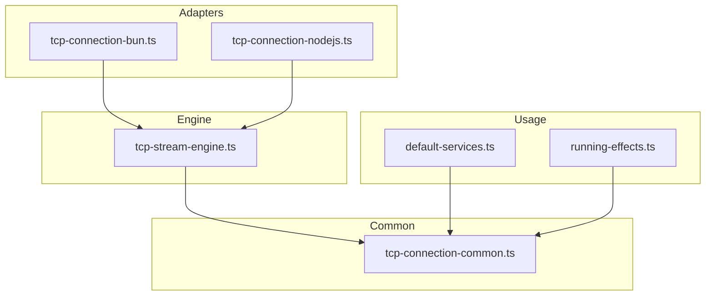
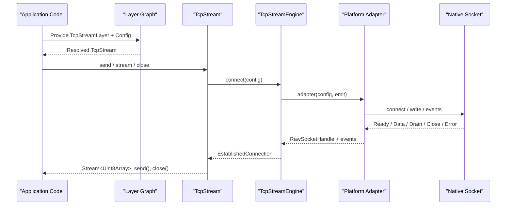
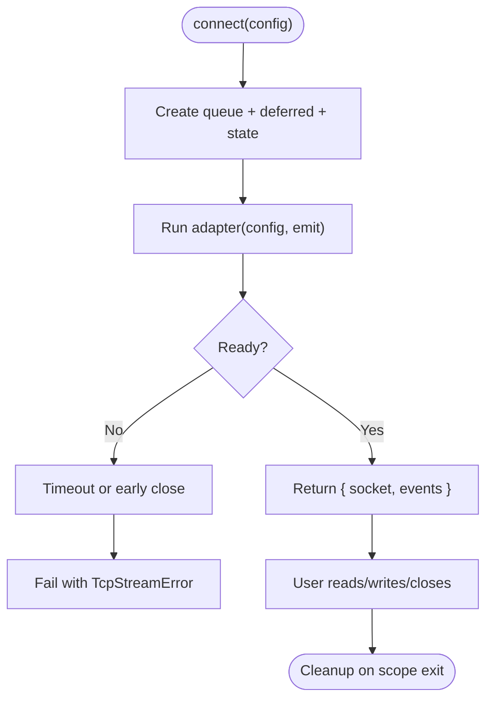
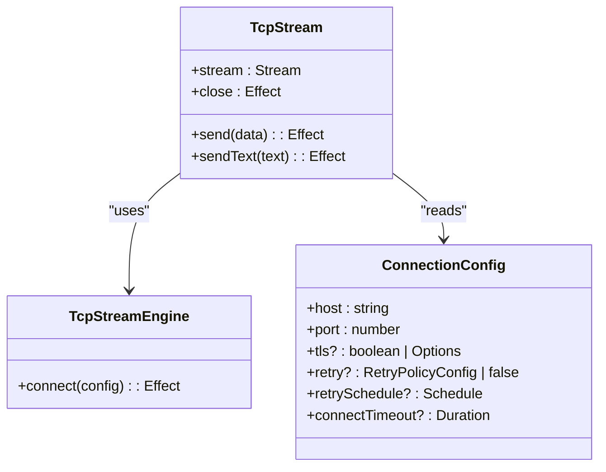
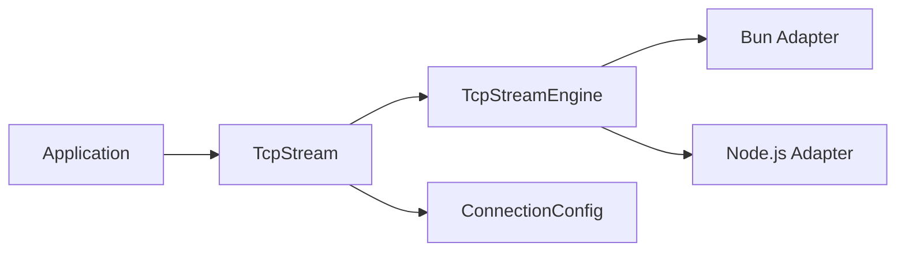

# Service Layer Architecture

<cite>
**Referenced Files in This Document**
- [tcp-stream-engine.ts](file://src/tcp-stream-engine.ts)
- [tcp-connection-common.ts](file://src/tcp-connection-common.ts)
- [tcp-connection-bun.ts](file://src/tcp-connection-bun.ts)
- [tcp-connection-nodejs.ts](file://src/tcp-connection-nodejs.ts)
- [default-services.ts](file://src/default-services.ts)
- [running-effects.ts](file://src/running-effects.ts)
- [tcp-stream-engine.test.ts](file://src/tcp-stream-engine.test.ts)
- [tcp-connection-test-suite.ts](file://src/tcp-connection-test-suite.ts)
</cite>

## Table of Contents
1. Introduction
2. Project Structure
3. Core Components
4. Architecture Overview
5. Detailed Component Analysis
6. Dependency Analysis
7. Performance Considerations
8. Troubleshooting Guide
9. Conclusion

## Introduction
This document explains the service layer architecture built on Effect’s Effect Layers and dependency injection patterns. It focuses on how services are defined, composed, and managed across the application lifecycle, with a concrete example centered on TCP stream engines, logging services, and error handling. You will learn:
- How services are modeled as Context Services and provided via Layers
- How default platform-specific services are supplied (Bun and Node.js TCP stream engines)
- How to create custom services, extend or override defaults, and compose them into layers
- How to test services using mocked implementations and layered composition

## Project Structure
The service layer is organized around a small set of cohesive modules:
- Common contracts and configuration services live in a shared module
- A platform-agnostic engine composes raw socket adapters into a stable API
- Platform-specific adapters implement the adapter protocol for Bun and Node.js
- Convenience layers expose ready-to-use services that wire configuration and engines together
- Tests demonstrate composition, mocking, and lifecycle behavior

**Diagram sources**
- [tcp-stream-engine.ts:1-30](file://src/tcp-stream-engine.ts#L1-L30)
- [tcp-connection-common.ts:1-60](file://src/tcp-connection-common.ts#L1-L60)
- [tcp-connection-bun.ts:1-25](file://src/tcp-connection-bun.ts#L1-L25)
- [tcp-connection-nodejs.ts:1-25](file://src/tcp-connection-nodejs.ts#L1-L25)
- [default-services.ts:1-12](file://src/default-services.ts#L1-L12)
- [running-effects.ts:1-15](file://src/running-effects.ts#L1-L15)

**Section sources**
- [tcp-stream-engine.ts:1-30](file://src/tcp-stream-engine.ts#L1-L30)
- [tcp-connection-common.ts:1-60](file://src/tcp-connection-common.ts#L1-L60)
- [tcp-connection-bun.ts:1-25](file://src/tcp-connection-bun.ts#L1-L25)
- [tcp-connection-nodejs.ts:1-25](file://src/tcp-connection-nodejs.ts#L1-L25)
- [default-services.ts:1-12](file://src/default-services.ts#L1-L12)
- [running-effects.ts:1-15](file://src/running-effects.ts#L1-L15)

## Core Components
This section introduces the primary services and their roles:
- TcpStream: The high-level TCP client abstraction used by application code
- TcpStreamEngine: The pluggable engine behind TcpStream; provides connect() and exposes events
- ConnectionConfig: Configuration for host, port, TLS, retry policy, timeouts
- Platform Adapters: Concrete implementations for Bun and Node.js that bridge native sockets to the engine
- Default Services: Built-in services like Clock and Random from Effect, plus platform runners

Key implementation highlights:
- Services are declared as class-based Context Services with explicit shapes
- Engines are constructed via makeTcpStreamEngine and exposed through Layers
- Convenience layers combine engine and configuration into a single provisionable unit
- Error modeling uses tagged errors for precise failure semantics

**Section sources**
- [tcp-connection-common.ts:20-60](file://src/tcp-connection-common.ts#L20-L60)
- [tcp-stream-engine.ts:49-68](file://src/tcp-stream-engine.ts#L49-L68)
- [tcp-stream-engine.ts:88-178](file://src/tcp-stream-engine.ts#L88-L178)
- [tcp-stream-engine.ts:201-359](file://src/tcp-stream-engine.ts#L201-L359)
- [tcp-connection-bun.ts:133-138](file://src/tcp-connection-bun.ts#L133-L138)
- [tcp-connection-nodejs.ts:114-131](file://src/tcp-connection-nodejs.ts#L114-L131)
- [default-services.ts:1-31](file://src/default-services.ts#L1-L31)

## Architecture Overview
At runtime, application code depends on services via Effect’s context. Layers provide concrete implementations at composition time. For TCP connectivity:
- Application code requests TcpStream from context
- TcpStreamLayer constructs a connection using TcpStreamEngine
- TcpStreamEngine.connect delegates to a platform adapter (Bun or Node.js)
- Events flow back through a Stream, and writes are serialized with concurrency control
- Errors are normalized into typed TcpStreamError values

**Diagram sources**
- [tcp-stream-engine.ts:88-178](file://src/tcp-stream-engine.ts#L88-L178)
- [tcp-stream-engine.ts:201-359](file://src/tcp-stream-engine.ts#L201-L359)
- [tcp-connection-bun.ts:18-138](file://src/tcp-connection-bun.ts#L18-L138)
- [tcp-connection-nodejs.ts:21-119](file://src/tcp-connection-nodejs.ts#L21-L119)

## Detailed Component Analysis

### Service Definition Pattern: Context.Service
Services are defined as classes extending Context.Service with an explicit shape. This pattern:
- Encapsulates the service contract (methods and types)
- Enables type-safe resolution from context
- Supports overriding via Layer.succeed or Layer.provide

Examples in this codebase:
- TcpStreamShape and TcpStream service
- ConnectionConfigShape and ConnectionConfig service
- TcpStreamEngineShape and TcpStreamEngine service

Practical implications:
- Business logic depends only on shapes, not concrete implementations
- Tests can supply mock implementations via Layer.succeed
- Production code wires real implementations via platform-specific layers

**Section sources**
- [tcp-connection-common.ts:26-58](file://src/tcp-connection-common.ts#L26-L58)
- [tcp-stream-engine.ts:49-68](file://src/tcp-stream-engine.ts#L49-L68)

### Engine Composition: makeTcpStreamEngine
The engine abstracts over platform differences:
- Accepts a “cold” adapter function that returns a handle and emits events
- Manages connection lifecycle: connecting, ready, data, drain, close, error
- Enforces connect timeout and normalizes failures
- Exposes a stable interface: connect(config) returns an established connection with a socket handle and event stream

Lifecycle highlights:
- Events emitted before readiness are buffered until ready
- Failures during connect are wrapped into TcpStreamError
- After readiness, read-side errors become stream failures
- Close is idempotent and terminates the session stream cleanly

**Diagram sources**
- [tcp-stream-engine.ts:88-178](file://src/tcp-stream-engine.ts#L88-L178)
- [tcp-stream-engine.ts:180-195](file://src/tcp-stream-engine.ts#L180-L195)

**Section sources**
- [tcp-stream-engine.ts:88-178](file://src/tcp-stream-engine.ts#L88-L178)
- [tcp-stream-engine.ts:180-195](file://src/tcp-stream-engine.ts#L180-L195)

### High-Level Service: TcpStream
TcpStream is the user-facing service that:
- Reads ConnectionConfig from context
- Acquires a connection via TcpStreamEngine with optional retry
- Runs a background fiber to forward incoming data to a queue
- Serializes writes using a semaphore to avoid interleaving
- Provides send, sendText, stream, and close operations
- Ensures cleanup on scope exit and propagates errors correctly

Retry and scheduling:
- Uses a configurable retry schedule or a default exponential backoff with jitter
- Allows disabling retries or providing a custom Schedule

**Diagram sources**
- [tcp-connection-common.ts:26-58](file://src/tcp-connection-common.ts#L26-L58)
- [tcp-stream-engine.ts:201-359](file://src/tcp-stream-engine.ts#L201-L359)

**Section sources**
- [tcp-stream-engine.ts:201-359](file://src/tcp-stream-engine.ts#L201-L359)

### Platform Adapters: Bun and Node.js
Both adapters implement the same cold adapter protocol:
- Connect to host/port, optionally with TLS
- Emit events: Ready, Data, Drain, Close, Error
- Return a RawSocketHandle with write and close
- Ensure cancellation and resource cleanup on interruption

Differences:
- Bun adapter uses Bun.connect and Bun.Socket callbacks
- Node.js adapter uses node:net and node:tls streams and events

Both export convenience layers that bind the engine and configuration into a single provisionable unit.

**Section sources**
- [tcp-connection-bun.ts:18-138](file://src/tcp-connection-bun.ts#L18-L138)
- [tcp-connection-nodejs.ts:21-131](file://src/tcp-connection-nodejs.ts#L21-L131)

### Default Services Provided by the Library
Beyond TCP, the library demonstrates usage of core Effect services:
- Clock.currentTimeMillis for deterministic timestamps
- Random.next for random numbers, with seeding support for tests
- Console.log for logging via Effect-managed services
- Platform runners such as BunRuntime.runMain for process entrypoints

These illustrate how to consume and override services without coupling to global state.

**Section sources**
- [default-services.ts:1-31](file://src/default-services.ts#L1-L31)
- [running-effects.ts:1-114](file://src/running-effects.ts#L1-L114)

### Creating Custom Services
To define a new service:
- Declare a shape describing methods and types
- Create a class extending Context.Service<Self, Shape>()("Id")
- Implement a constructor effect or factory that produces the service
- Export a Layer that provides the service (e.g., Layer.effect or Layer.succeed)

Example pattern:
- Define shape and service class
- Build a Layer that constructs the service with dependencies
- Compose layers to provide multiple services at once

**Section sources**
- [tcp-connection-common.ts:26-58](file://src/tcp-connection-common.ts#L26-L58)
- [tcp-stream-engine.ts:49-68](file://src/tcp-stream-engine.ts#L49-L68)

### Extending and Overriding Defaults
Override strategies:
- Replace a default service with a test double using Layer.succeed
- Compose layers so that a more specific layer overrides a general one
- Use Layer.merge to combine independent services into a single graph

In this codebase:
- Platform-specific layers provide TcpStreamEngine implementations
- Convenience layers bind ConnectionConfigLive with the engine
- Tests inject a custom engine via Layer.succeed(TcpStreamEngine, engine)

**Section sources**
- [tcp-connection-bun.ts:133-138](file://src/tcp-connection-bun.ts#L133-L138)
- [tcp-connection-nodejs.ts:114-131](file://src/tcp-connection-nodejs.ts#L114-L131)
- [tcp-stream-engine.test.ts:195-205](file://src/tcp-stream-engine.test.ts#L195-L205)

### Practical Examples of Service Composition
Typical composition steps:
- Define a config layer with ConnectionConfigLive
- Choose an engine layer (Bun or Node.js)
- Combine into a TcpStream layer using makeConvenienceLayer
- Provide the combined layer to your program via Effect.provide

Example flows:
- Unit tests: provide a mock engine and config to isolate behavior
- Integration tests: provide a real engine and config to exercise network paths
- Application entrypoint: provide platform runner and all required layers

**Section sources**
- [tcp-stream-engine.ts:341-359](file://src/tcp-stream-engine.ts#L341-L359)
- [tcp-stream-engine.test.ts:195-205](file://src/tcp-stream-engine.test.ts#L195-L205)
- [tcp-connection-test-suite.ts:218-235](file://src/tcp-connection-test-suite.ts#L218-L235)

### Testing Strategies with Mocked Services
Recommended practices demonstrated in the repository:
- Use makeTcpStreamEngine to build a test harness that emits controlled events
- Provide a mock engine via Layer.succeed(TcpStreamEngine, engine)
- Validate event ordering, error classification, timeouts, and cleanup
- Exercise retry policies and custom schedules with deterministic inputs

Key scenarios covered:
- Preserving pre-ready events
- Isolating failed attempts from later retries
- Handling early close and terminal close
- Classifying read vs connect errors
- Timeouts and interruption safety
- Graceful stream draining on teardown

**Section sources**
- [tcp-stream-engine.test.ts:26-214](file://src/tcp-stream-engine.test.ts#L26-L214)
- [tcp-connection-test-suite.ts:218-306](file://src/tcp-connection-test-suite.ts#L218-L306)

## Dependency Analysis
Service dependencies form a clear hierarchy:
- Application code depends on TcpStream
- TcpStream depends on TcpStreamEngine and ConnectionConfig
- TcpStreamEngine depends on a platform adapter
- Platform adapters depend on native networking APIs

Composition is explicit via Layers, avoiding hidden globals and enabling testability.

**Diagram sources**
- [tcp-stream-engine.ts:201-359](file://src/tcp-stream-engine.ts#L201-L359)
- [tcp-connection-bun.ts:133-138](file://src/tcp-connection-bun.ts#L133-L138)
- [tcp-connection-nodejs.ts:114-131](file://src/tcp-connection-nodejs.ts#L114-L131)
- [tcp-connection-common.ts:45-60](file://src/tcp-connection-common.ts#L45-L60)

**Section sources**
- [tcp-stream-engine.ts:201-359](file://src/tcp-stream-engine.ts#L201-L359)
- [tcp-connection-common.ts:45-60](file://src/tcp-connection-common.ts#L45-L60)

## Performance Considerations
- Write serialization: TcpStream uses a semaphore to serialize writes, preventing interleaved frames and ensuring ordered delivery.
- Backpressure: Drain events are forwarded to unblock writers when the underlying socket buffer accepts more data.
- Retries: Default exponential backoff with jitter reduces thundering herds; customize via retrySchedule for predictable testing.
- Timeouts: Connect timeouts prevent hanging connections; ensure they align with expected network conditions.
- Resource management: Scoped lifecycles ensure timely cleanup of sockets and fibers, minimizing leaks under load.

[No sources needed since this section provides general guidance]

## Troubleshooting Guide
Common issues and resolutions:
- Connection never becomes ready: verify adapter emits Ready; check connectTimeout and network reachability
- Unexpected stream failures: inspect whether errors occur after readiness (read path) or during connect
- Hanging drains: ensure drain events are handled and waiters are resolved; confirm close is called exactly once
- Retry storms: tune retrySchedule or disable retries for fast-fail scenarios
- TLS handshake failures: validate server certificate settings and mismatch handling; expect clean TcpStreamError without defects

Operational tips:
- Use Exit and Cause inspection to distinguish failures, interruptions, and defects
- Log at boundaries using Effect-managed logging services rather than direct console calls
- Prefer running programs with platform runtimes (e.g., BunRuntime.runMain) for consistent signal handling and exit codes

**Section sources**
- [tcp-stream-engine.ts:180-195](file://src/tcp-stream-engine.ts#L180-L195)
- [tcp-stream-engine.ts:261-294](file://src/tcp-stream-engine.ts#L261-L294)
- [tcp-connection-test-suite.ts:424-445](file://src/tcp-connection-test-suite.ts#L424-L445)
- [running-effects.ts:101-114](file://src/running-effects.ts#L101-L114)

## Conclusion
This service layer leverages Effect’s Context and Layer system to deliver a robust, testable, and extensible architecture. By defining clear service shapes, composing platform-specific implementations, and managing lifecycles with scopes, the code achieves:
- Decoupled business logic that depends only on abstractions
- Easy substitution of implementations for testing and different environments
- Predictable error handling and resource cleanup
- Scalable composition of services across the application lifecycle

Adopting these patterns enables you to add new services, override defaults safely, and maintain clarity as your application grows.

[No sources needed since this section summarizes without analyzing specific files]