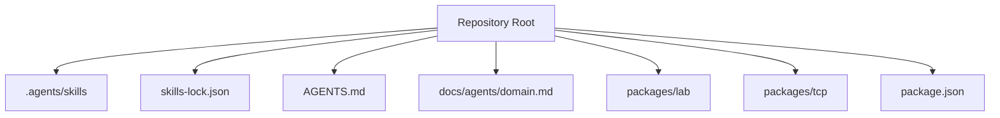
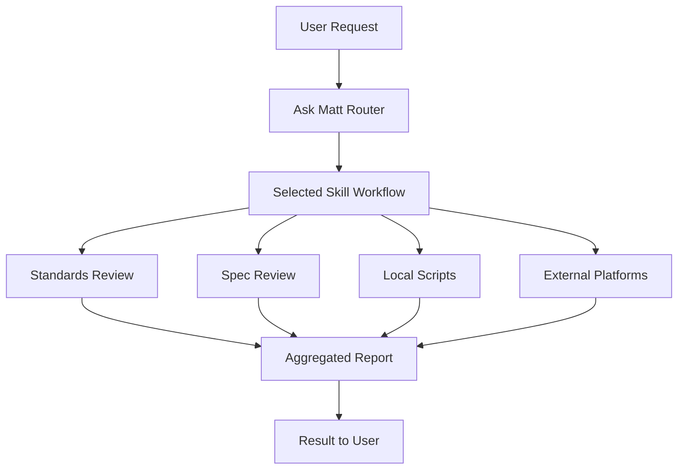
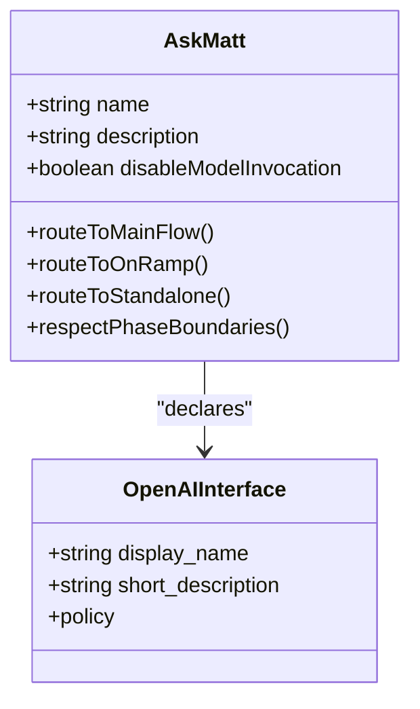
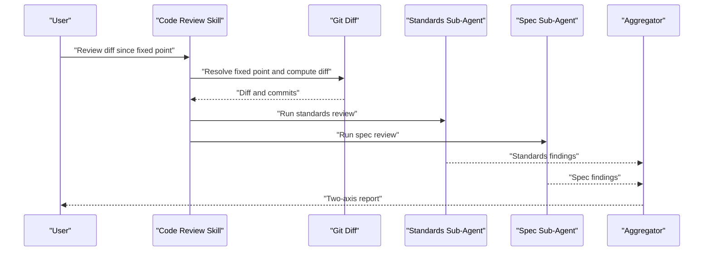
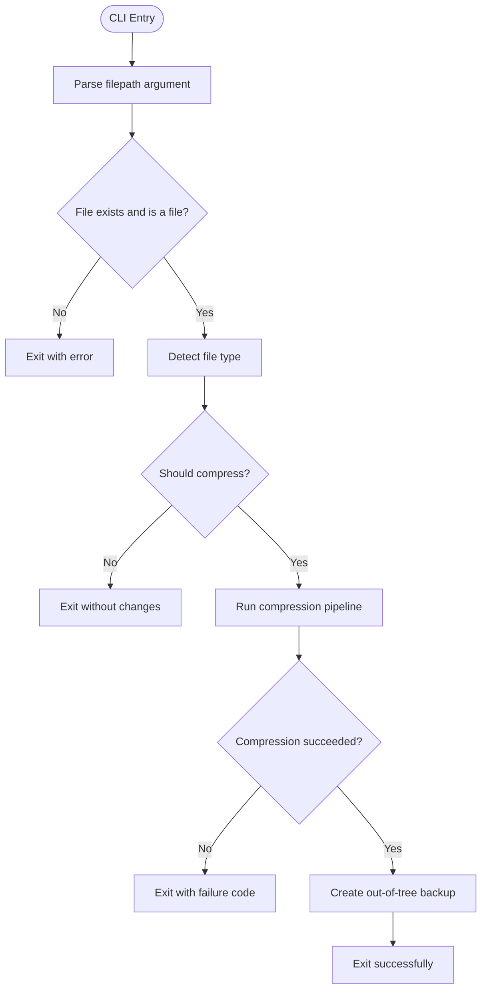
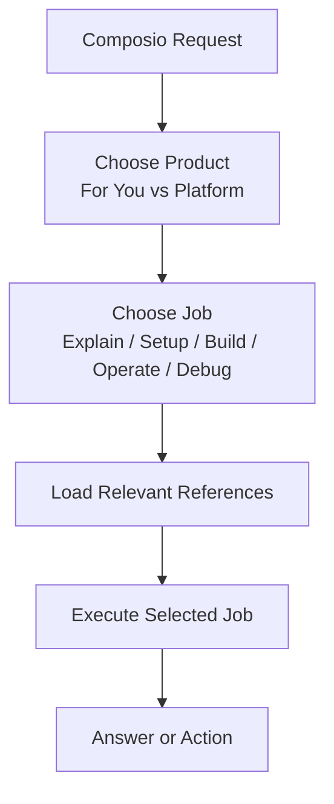
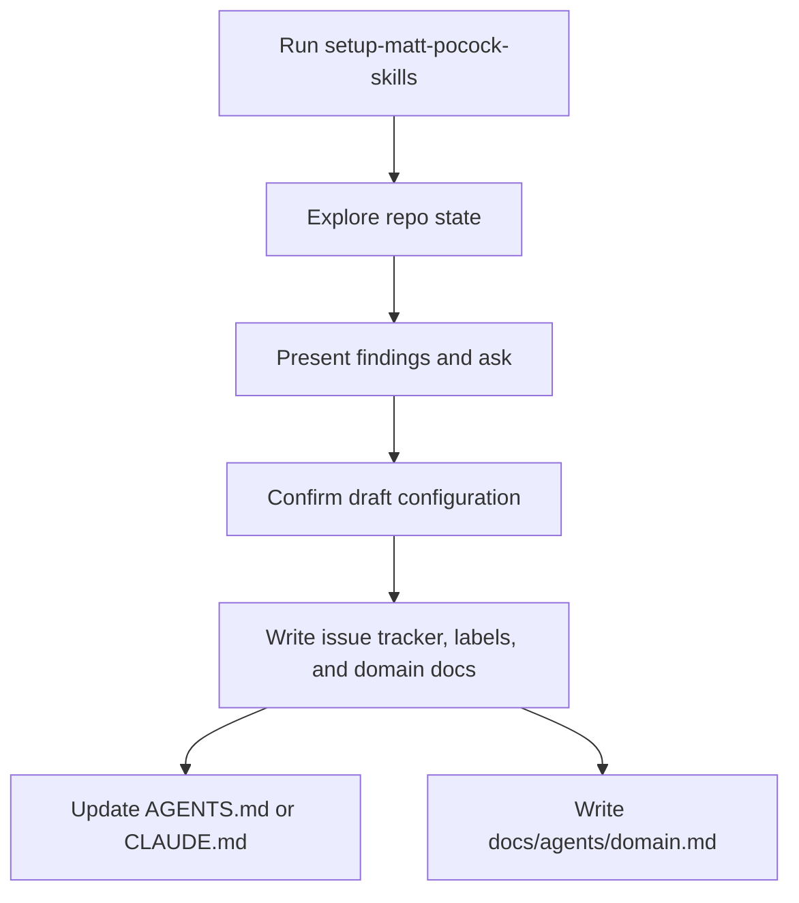
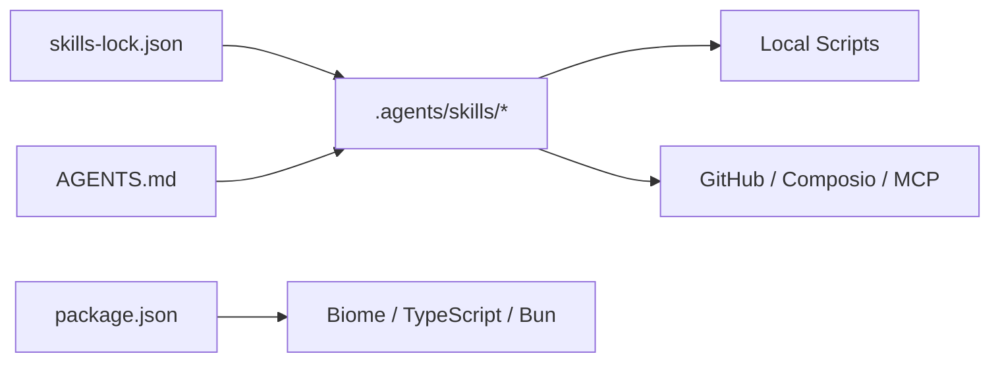

# Agent Skills Integration

<cite>
**Referenced Files in This Document**
- [README.md](file://README.md)
- [AGENTS.md](file://AGENTS.md)
- [package.json](file://package.json)
- [skills-lock.json](file://skills-lock.json)
- [.agents/skills/ask-matt/SKILL.md](file://.agents/skills/ask-matt/SKILL.md)
- [.agents/skills/ask-matt/agents/openai.yaml](file://.agents/skills/ask-matt/agents/openai.yaml)
- [.agents/skills/code-review/SKILL.md](file://.agents/skills/code-review/SKILL.md)
- [.agents/skills/code-review/agents/openai.yaml](file://.agents/skills/code-review/agents/openai.yaml)
- [.agents/skills/composio/SKILL.md](file://.agents/skills/composio/SKILL.md)
- [.agents/skills/caveman-compress/SKILL.md](file://.agents/skills/caveman-compress/SKILL.md)
- [.agents/skills/caveman-compress/scripts/__main__.py](file://.agents/skills/caveman-compress/scripts/__main__.py)
- [.agents/skills/caveman-compress/scripts/cli.py](file://.agents/skills/caveman-compress/scripts/cli.py)
- [.agents/skills/setup-matt-pocock-skills/SKILL.md](file://.agents/skills/setup-matt-pocock-skills/SKILL.md)
- [docs/agents/domain.md](file://docs/agents/domain.md)
</cite>

## Table of Contents
1. [Introduction](#introduction)
2. [Project Structure](#project-structure)
3. [Core Components](#core-components)
4. [Architecture Overview](#architecture-overview)
5. [Detailed Component Analysis](#detailed-component-analysis)
6. [Dependency Analysis](#dependency-analysis)
7. [Performance Considerations](#performance-considerations)
8. [Troubleshooting Guide](#troubleshooting-guide)
9. [Conclusion](#conclusion)

## Introduction
This document explains how agent skills are integrated into the repository and how they interact with the Effect 4 codebase, development tooling, and external platforms. The project is a private Bun monorepo focused on Effect 4 examples and TCP networking. Agent skills live under `.agents/skills`, are declared in `skills-lock.json`, and are guided by repository conventions in `AGENTS.md`. Some skills also ship small scripts or platform configuration files that extend their behavior.

The integration model is primarily declarative:
- `skills-lock.json` pins skill sources, GitHub paths, and computed hashes.
- Each skill folder contains a `SKILL.md` describing its purpose, triggers, process, and boundaries.
- Optional `agents/openai.yaml` files describe display metadata for agent interfaces.
- Some skills include executable scripts (for example, Python CLI tools) invoked from the skill’s directory.
- Repository-level documentation (`AGENTS.md`, `docs/agents/domain.md`) defines how agents should explore, format, commit, and operate within this workspace.

## Project Structure
At a high level, the repository separates:
- Code workspaces: `packages/lab` and `packages/tcp`.
- Agent skills: `.agents/skills/<skill-name>/`.
- Repository conventions and research: `AGENTS.md`, `CONTEXT.md`, `docs/adr/`, `docs/research/`.
- Skill lockfile: `skills-lock.json`.
- Root package configuration: `package.json`.

**Diagram sources**
- [README.md:1-10](file://README.md#L1-L10)
- [AGENTS.md:1-7](file://AGENTS.md#L1-L7)
- [package.json:1-10](file://package.json#L1-L10)
- [skills-lock.json:1-10](file://skills-lock.json#L1-L10)

**Section sources**
- [README.md:1-10](file://README.md#L1-L10)
- [AGENTS.md:1-7](file://AGENTS.md#L1-L7)
- [package.json:1-10](file://package.json#L1-L10)
- [skills-lock.json:1-10](file://skills-lock.json#L1-L10)

## Core Components
The agent skills integration has several core components:

| Component | Responsibility | Key Location |
|---|---|---|
| Skill registry | Declares installed skills, sources, paths, and hashes | `skills-lock.json` |
| Skill definitions | Human-readable instructions, triggers, processes, and boundaries | `.agents/skills/*/SKILL.md` |
| Agent interface metadata | Display names and short descriptions for agent UIs | `.agents/skills/*/agents/openai.yaml` |
| Executable skill scripts | Local automation invoked by skills | `.agents/skills/*/scripts/*` |
| Repository conventions | Effect v4 rules, formatting, linting, Git operations, and domain docs | `AGENTS.md`, `docs/agents/domain.md` |
| Root workspace config | Workspaces, scripts, and shared dev dependencies | `package.json` |

**Section sources**
- [skills-lock.json:1-210](file://skills-lock.json#L1-L210)
- [.agents/skills/ask-matt/SKILL.md:1-91](file://.agents/skills/ask-matt/SKILL.md#L1-L91)
- [.agents/skills/code-review/SKILL.md:1-88](file://.agents/skills/code-review/SKILL.md#L1-L88)
- [.agents/skills/composio/SKILL.md:1-87](file://.agents/skills/composio/SKILL.md#L1-L87)
- [.agents/skills/caveman-compress/SKILL.md:1-110](file://.agents/skills/caveman-compress/SKILL.md#L1-L110)
- [.agents/skills/caveman-compress/scripts/cli.py:1-87](file://.agents/skills/caveman-compress/scripts/cli.py#L1-L87)
- [AGENTS.md:1-143](file://AGENTS.md#L1-L143)
- [docs/agents/domain.md:1-36](file://docs/agents/domain.md#L1-L36)
- [package.json:1-37](file://package.json#L1-L37)

## Architecture Overview
Agent skills integrate through three layers:

1. **Skill selection layer**: A router skill such as `ask-matt` helps choose the right workflow based on the user’s situation.
2. **Workflow layer**: Engineering workflows like `code-review`, `implement`, `tdd`, `triage`, `prototype`, and `wayfinder` define multi-step agent processes.
3. **Execution layer**: Some skills invoke local scripts or external platforms (GitHub, Composio, MCP servers).

**Diagram sources**
- [.agents/skills/ask-matt/SKILL.md:1-91](file://.agents/skills/ask-matt/SKILL.md#L1-L91)
- [.agents/skills/code-review/SKILL.md:1-88](file://.agents/skills/code-review/SKILL.md#L1-L88)
- [.agents/skills/composio/SKILL.md:1-87](file://.agents/skills/composio/SKILL.md#L1-L87)
- [.agents/skills/caveman-compress/SKILL.md:1-110](file://.agents/skills/caveman-compress/SKILL.md#L1-L110)

## Detailed Component Analysis

### Ask Matt Router
`ask-matt` is a routing skill that maps user requests to the appropriate engineering flow. It describes:
- A main idea-to-ship path.
- On-ramps such as triage, diagnosing bugs, and wayfinding.
- Phase boundaries and context hygiene.
- Standalone flows such as prototyping, research, merge conflict resolution, teaching, and writing for agents.

It also declares policy metadata that can control invocation behavior.

**Diagram sources**
- [.agents/skills/ask-matt/SKILL.md:1-91](file://.agents/skills/ask-matt/SKILL.md#L1-L91)
- [.agents/skills/ask-matt/agents/openai.yaml:1-6](file://.agents/skills/ask-matt/agents/openai.yaml#L1-L6)

**Section sources**
- [.agents/skills/ask-matt/SKILL.md:1-91](file://.agents/skills/ask-matt/SKILL.md#L1-L91)
- [.agents/skills/ask-matt/agents/openai.yaml:1-6](file://.agents/skills/ask-matt/agents/openai.yaml#L1-L6)

### Code Review Workflow
`code-review` performs a two-axis review of changes:
- **Standards**: checks whether code follows documented repo standards and a baseline set of design smells.
- **Spec**: checks whether code implements the originating issue or spec.

It runs both axes as parallel sub-agents and aggregates findings without merging them into a single ranking.

**Diagram sources**
- [.agents/skills/code-review/SKILL.md:1-88](file://.agents/skills/code-review/SKILL.md#L1-L88)

**Section sources**
- [.agents/skills/code-review/SKILL.md:1-88](file://.agents/skills/code-review/SKILL.md#L1-L88)
- [.agents/skills/code-review/agents/openai.yaml:1-4](file://.agents/skills/code-review/agents/openai.yaml#L1-L4)

### Caveman Compress Skill
`caveman-compress` compresses natural language files into a compact form while preserving code blocks, links, commands, and structure. It backs up originals outside the source tree and invokes a Python CLI.

**Diagram sources**
- [.agents/skills/caveman-compress/scripts/cli.py:35-86](file://.agents/skills/caveman-compress/scripts/cli.py#L35-L86)
- [.agents/skills/caveman-compress/SKILL.md:18-34](file://.agents/skills/caveman-compress/SKILL.md#L18-L34)

**Section sources**
- [.agents/skills/caveman-compress/SKILL.md:1-110](file://.agents/skills/caveman-compress/SKILL.md#L1-L110)
- [.agents/skills/caveman-compress/scripts/__main__.py:1-4](file://.agents/skills/caveman-compress/scripts/__main__.py#L1-L4)
- [.agents/skills/caveman-compress/scripts/cli.py:1-87](file://.agents/skills/caveman-compress/scripts/cli.py#L1-L87)

### Composio Routing Skill
`composio` routes requests between:
- **Composio For You**: personal agent integrations using MCP or CLI.
- **Composio Platform**: product integrations where users connect accounts.

It emphasizes choosing the product first, then the job, loading only relevant references, and following stable rules around credentials, sessions, and canonical documentation.

**Diagram sources**
- [.agents/skills/composio/SKILL.md:1-87](file://.agents/skills/composio/SKILL.md#L1-L87)

**Section sources**
- [.agents/skills/composio/SKILL.md:1-87](file://.agents/skills/composio/SKILL.md#L1-L87)

### Setup Skill and Domain Documentation
`setup-matt-pocock-skills` scaffolds per-repo configuration for engineering skills:
- Issue tracker location.
- Triage label vocabulary.
- Domain doc layout.

`docs/agents/domain.md` tells agents how to consume domain documentation, including `CONTEXT.md` and ADRs, and how to handle single-context versus multi-context layouts.

**Diagram sources**
- [.agents/skills/setup-matt-pocock-skills/SKILL.md:1-117](file://.agents/skills/setup-matt-pocock-skills/SKILL.md#L1-L117)
- [docs/agents/domain.md:1-36](file://docs/agents/domain.md#L1-L36)

**Section sources**
- [.agents/skills/setup-matt-pocock-skills/SKILL.md:1-117](file://.agents/skills/setup-matt-pocock-skills/SKILL.md#L1-L117)
- [docs/agents/domain.md:1-36](file://docs/agents/domain.md#L1-L36)

## Dependency Analysis
The skill system depends on:
- `skills-lock.json` for pinned skill sources and hashes.
- `AGENTS.md` for Effect v4 conventions, formatting, linting, and Git/MCP usage.
- `package.json` for workspace scripts and shared dev tooling.
- Individual skill folders for workflow logic.
- Optional scripts for deterministic automation.
- External platforms when skills require GitHub, Composio, or other services.

**Diagram sources**
- [skills-lock.json:1-210](file://skills-lock.json#L1-L210)
- [AGENTS.md:1-143](file://AGENTS.md#L1-L143)
- [package.json:1-37](file://package.json#L1-L37)

**Section sources**
- [skills-lock.json:1-210](file://skills-lock.json#L1-L210)
- [AGENTS.md:1-143](file://AGENTS.md#L1-L143)
- [package.json:1-37](file://package.json#L1-L37)

## Performance Considerations
- Keep skill prompts concise and scoped. Long prompts increase token cost and reduce reasoning quality.
- Prefer parallel sub-agents only when contexts do not need to share mutable state.
- Avoid unnecessary model invocations; some skills declare `disable-model-invocation: true` to signal that they are configuration or routing steps rather than generative tasks.
- Use local scripts for deterministic, repeatable work instead of asking the model to perform fragile shell operations.
- Respect phase boundaries and context hygiene so large sessions do not degrade performance.

[No sources needed since this section provides general guidance]

## Troubleshooting Guide
Common issues and resolutions:

| Symptom | Likely Cause | Resolution |
|---|---|---|
| Skill does not appear or cannot be loaded | Missing or outdated entry in `skills-lock.json` | Reinstall or refresh skills according to the skill manager; verify the skill path and hash. |
| Code review fails before sub-agents | Invalid fixed point or empty diff | Resolve the ref first and confirm the diff is non-empty before spawning sub-agents. |
| Compression script exits unexpectedly | File not found, wrong type, or encoding issues | Check the absolute path, ensure the file is a supported natural-language type, and verify UTF-8 output handling. |
| Agent uses deprecated Effect v3 patterns | Violation of repository conventions | Follow `AGENTS.md` Effect v4 guidelines and use Effect v4 combinators. |
| Git operations fail due to raw shell usage | Using shell commands instead of MCP tools | Use GitKraken MCP or GitHub MCP tools as required by `AGENTS.md`. |
| Domain terminology is inconsistent | Not reading `CONTEXT.md` or ADRs | Read `docs/agents/domain.md` and the root `CONTEXT.md` before exploring code. |

**Section sources**
- [AGENTS.md:11-82](file://AGENTS.md#L11-L82)
- [AGENTS.md:109-127](file://AGENTS.md#L109-L127)
- [.agents/skills/code-review/SKILL.md:15-24](file://.agents/skills/code-review/SKILL.md#L15-L24)
- [.agents/skills/caveman-compress/scripts/cli.py:40-82](file://.agents/skills/caveman-compress/scripts/cli.py#L40-L82)
- [docs/agents/domain.md:5-10](file://docs/agents/domain.md#L5-L10)

## Conclusion
Agent skills in this repository are organized as declarative workflows with optional executable helpers. `skills-lock.json` anchors the installed skills, `SKILL.md` files describe behavior, and `AGENTS.md` enforces consistent Effect v4, formatting, linting, and Git practices. Routers like `ask-matt` guide users into structured workflows, while specialized skills such as `code-review`, `caveman-compress`, and `composio` provide focused capabilities. For reliable operation, keep the skill lockfile updated, follow repository conventions, prefer MCP-based Git operations, and use local scripts for deterministic tasks.

[No sources needed since this section summarizes without analyzing specific files]