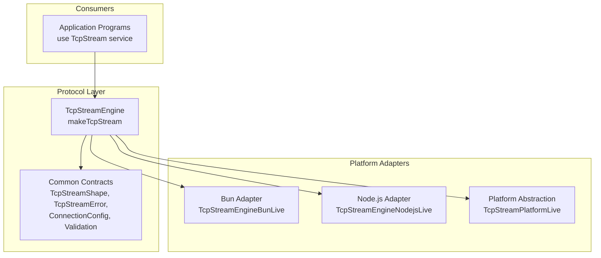
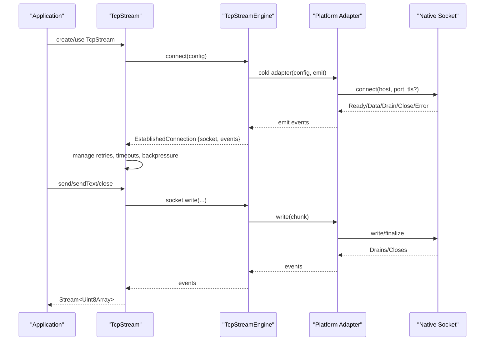
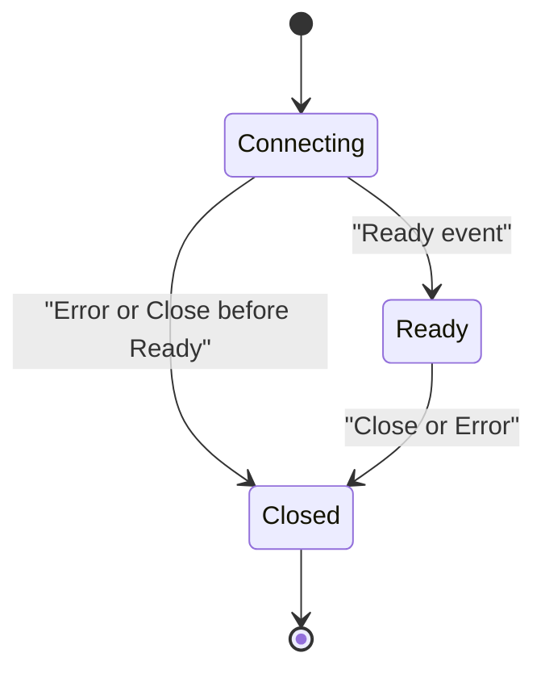
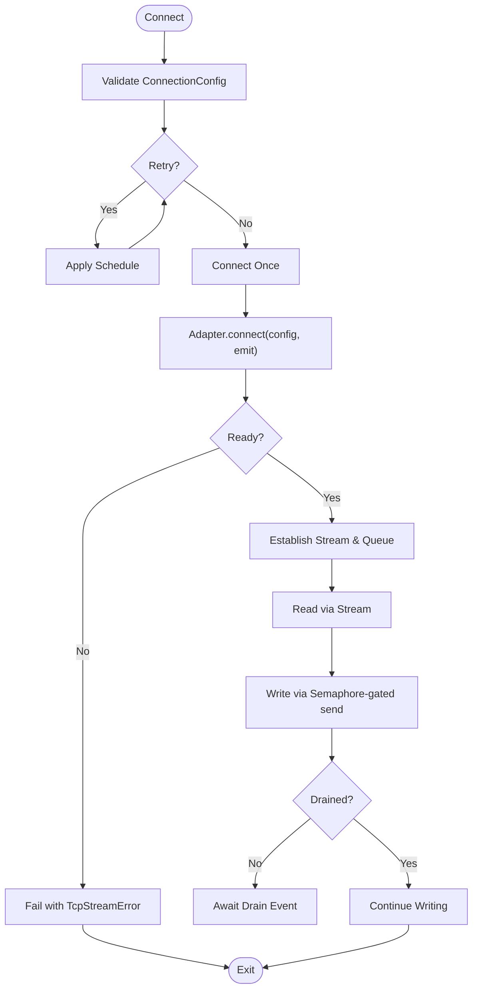
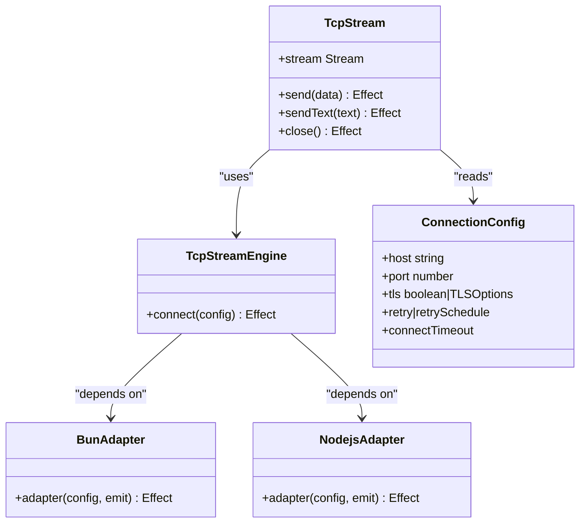
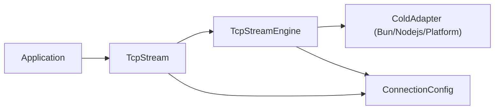

# Core Concepts

<cite>
**Referenced Files in This Document**
- [tcp-stream-engine.ts](file://src/tcp-stream-engine.ts)
- [tcp-connection-common.ts](file://src/tcp-connection-common.ts)
- [tcp-connection-bun.ts](file://src/tcp-connection-bun.ts)
- [tcp-connection-nodejs.ts](file://src/tcp-connection-nodejs.ts)
- [tcp-connection-platform.ts](file://src/tcp-connection-platform.ts)
- [creating-effects.ts](file://src/creating-effects.ts)
- [running-effects.ts](file://src/running-effects.ts)
- [error-channel-operations.ts](file://src/error-channel-operations.ts)
</cite>

## Table of Contents
1. [Introduction](#introduction)
2. [Project Structure](#project-structure)
3. [Core Components](#core-components)
4. [Architecture Overview](#architecture-overview)
5. [Detailed Component Analysis](#detailed-component-analysis)
6. [Dependency Analysis](#dependency-analysis)
7. [Performance Considerations](#performance-considerations)
8. [Troubleshooting Guide](#troubleshooting-guide)
9. [Conclusion](#conclusion)

## Introduction
This document explains the core architectural principles of a TCP stream library built with Effect functional programming patterns. It focuses on:
- Effects, layers, and dependency injection for composable, testable I/O
- A layered TCP stream architecture that separates protocol logic from platform-specific socket adapters
- A state machine governing connection lifecycle and backpressure
- Typed error handling via tagged errors and effect channels (streams and queues)
- Cross-platform compatibility through pluggable platform adapters (Bun, Node.js, and a platform abstraction)

The goal is to help both new and experienced users understand how the engine, adapters, and protocol layer interact to provide a robust, portable TCP streaming API.

## Project Structure
At a high level, the library organizes code into:
- Engine and protocol layer: shared TCP stream logic, state management, retries, timeouts, and typed errors
- Platform adapters: concrete implementations for Bun and Node.js, plus an optional platform abstraction
- Common contracts: shared types, services, validation, and error definitions
- Examples and utilities: effect creation patterns, running effects, and error channel operations

**Diagram sources**
- [tcp-stream-engine.ts:64-67](file://src/tcp-stream-engine.ts#L64-L67)
- [tcp-connection-common.ts:20-35](file://src/tcp-connection-common.ts#L20-L35)
- [tcp-connection-bun.ts:133-136](file://src/tcp-connection-bun.ts#L133-L136)
- [tcp-connection-nodejs.ts:114-119](file://src/tcp-connection-nodejs.ts#L114-L119)
- [tcp-connection-platform.ts:1-200](file://src/tcp-connection-platform.ts#L1-L200)

**Section sources**
- [tcp-stream-engine.ts:64-67](file://src/tcp-stream-engine.ts#L64-L67)
- [tcp-connection-common.ts:20-35](file://src/tcp-connection-common.ts#L20-L35)
- [tcp-connection-bun.ts:133-136](file://src/tcp-connection-bun.ts#L133-L136)
- [tcp-connection-nodejs.ts:114-119](file://src/tcp-connection-nodejs.ts#L114-L119)

## Core Components
- TcpStreamEngine: The central orchestrator that connects to remote hosts, manages events, enforces timeouts, and exposes a stable interface to consumers.
- TcpStream: A higher-level service that wraps the engine with retry policies, incoming data streams, write serialization, drain handling, and clean shutdown.
- Platform Adapters: Concrete implementations that translate native socket APIs into the engine’s adapter contract.
- Common Contracts: Shared types, services, validation, and error definitions used across all layers.

Key responsibilities:
- Engine: Connects, emits events (Ready, Data, Drain, Close, Error), enforces connect timeout, and provides a raw socket handle.
- Stream: Manages connection lifecycle, retries, backpressure, and exposes a pull-based Stream for incoming bytes and send/sendText for outgoing data.
- Adapters: Bridge platform sockets to the engine’s event-driven model.
- Common: Defines typed errors, configuration, and validation to ensure safe usage.

**Section sources**
- [tcp-stream-engine.ts:88-178](file://src/tcp-stream-engine.ts#L88-L178)
- [tcp-stream-engine.ts:201-341](file://src/tcp-stream-engine.ts#L201-L341)
- [tcp-connection-common.ts:12-101](file://src/tcp-connection-common.ts#L12-L101)
- [tcp-connection-bun.ts:18-135](file://src/tcp-connection-bun.ts#L18-L135)
- [tcp-connection-nodejs.ts:21-119](file://src/tcp-connection-nodejs.ts#L21-L119)

## Architecture Overview
The library follows a layered design:
- Protocol layer (engine + stream): Purely functional composition using Effect, independent of platform specifics. It defines the TCP stream behavior, including retries, timeouts, backpressure, and typed errors.
- Platform adapters: Implement the engine’s cold adapter contract to connect, read, write, and close sockets using Bun or Node.js APIs.
- Consumers: Use the TcpStream service via dependency injection; they never directly touch platform sockets.

**Diagram sources**
- [tcp-stream-engine.ts:88-178](file://src/tcp-stream-engine.ts#L88-L178)
- [tcp-stream-engine.ts:201-341](file://src/tcp-stream-engine.ts#L201-L341)
- [tcp-connection-bun.ts:18-135](file://src/tcp-connection-bun.ts#L18-L135)
- [tcp-connection-nodejs.ts:21-119](file://src/tcp-connection-nodejs.ts#L21-L119)

## Detailed Component Analysis

### Effect Functional Programming Patterns
- Effects: All I/O is modeled as Effect values, enabling composition, error propagation, and structured concurrency.
- Layers and Dependency Injection: Services like TcpStream, TcpStreamEngine, and ConnectionConfig are defined as Context services and provided via Layers. This decouples implementation from usage and enables swapping platforms at runtime.
- Suspend and Composition: Long-running or conditional effects use suspend to unify return types and avoid premature evaluation.

Examples in this codebase:
- Service definitions and layers for TcpStream and ConnectionConfig
- Convenience layers that combine engine and config for easy consumption
- Using Effect.gen and yield* to compose asynchronous workflows

**Section sources**
- [tcp-connection-common.ts:54-60](file://src/tcp-connection-common.ts#L54-L60)
- [tcp-stream-engine.ts:341-359](file://src/tcp-stream-engine.ts#L341-L359)
- [creating-effects.ts:1-324](file://src/creating-effects.ts#L1-L324)
- [running-effects.ts:1-114](file://src/running-effects.ts#L1-L114)

### TCP Stream Architecture Overview
- Layered Design Pattern:
  - Protocol layer encapsulates connection lifecycle, retries, timeouts, and stream semantics.
  - Platform adapters implement the engine’s cold adapter contract for Bun and Node.js.
  - Consumers depend only on the TcpStream service.
- State Machine Implementation:
  - Connection phases: connecting → ready → closed
  - Stream state: Open → Closed (with optional error)
  - Events drive transitions: Ready marks readiness; Data/Drain update backpressure; Close ends the stream; Error fails it.
- Cross-Platform Compatibility Model:
  - Adapters expose a uniform event model (Ready, Data, Drain, Close, Error).
  - Engine remains platform-agnostic; only adapters change per runtime.

**Diagram sources**
- [tcp-stream-engine.ts:99-138](file://src/tcp-stream-engine.ts#L99-L138)
- [tcp-stream-engine.ts:197-237](file://src/tcp-stream-engine.ts#L197-L237)

**Section sources**
- [tcp-stream-engine.ts:88-178](file://src/tcp-stream-engine.ts#L88-L178)
- [tcp-stream-engine.ts:197-237](file://src/tcp-stream-engine.ts#L197-L237)
- [tcp-connection-bun.ts:18-135](file://src/tcp-connection-bun.ts#L18-L135)
- [tcp-connection-nodejs.ts:21-119](file://src/tcp-connection-nodejs.ts#L21-L119)

### Error Handling Strategies
- Typed Errors: Domain-specific tagged errors (e.g., TcpStreamError, ConnectionConfigError) carry operation context and causes, enabling precise error discrimination and recovery.
- Effect Channels:
  - Streams: Incoming data flows through a Stream<Uint8Array, TcpStreamError>, allowing backpressure and graceful termination.
  - Queues: Internal unbounded queues bridge push-based socket events to pull-based streams.
  - Deferreds: Coordinate readiness and drain waits during connection setup and backpressure.
- Retry and Timeout:
  - Configurable retry schedules with exponential backoff and jitter.
  - Connect timeout enforced around the adapter’s setup effect.

**Diagram sources**
- [tcp-stream-engine.ts:180-195](file://src/tcp-stream-engine.ts#L180-L195)
- [tcp-stream-engine.ts:201-341](file://src/tcp-stream-engine.ts#L201-L341)
- [tcp-connection-common.ts:85-101](file://src/tcp-connection-common.ts#L85-L101)

**Section sources**
- [tcp-connection-common.ts:12-24](file://src/tcp-connection-common.ts#L12-L24)
- [tcp-stream-engine.ts:180-195](file://src/tcp-stream-engine.ts#L180-L195)
- [tcp-stream-engine.ts:201-341](file://src/tcp-stream-engine.ts#L201-L341)
- [error-channel-operations.ts:1-127](file://src/error-channel-operations.ts#L1-L127)

### Relationship Between Engine, Platform Adapters, and Protocol Layer
- Engine: Implements the protocol logic (connect, retry, timeout, events, stream construction).
- Adapters: Provide the cold adapter function that creates a RawSocketHandle and emits events. They encapsulate platform differences (Bun vs Node.js).
- Protocol Layer: Remains pure and reusable; consumers depend only on TcpStream.

**Diagram sources**
- [tcp-stream-engine.ts:64-67](file://src/tcp-stream-engine.ts#L64-L67)
- [tcp-stream-engine.ts:201-341](file://src/tcp-stream-engine.ts#L201-L341)
- [tcp-connection-common.ts:45-60](file://src/tcp-connection-common.ts#L45-L60)
- [tcp-connection-bun.ts:18-135](file://src/tcp-connection-bun.ts#L18-L135)
- [tcp-connection-nodejs.ts:21-119](file://src/tcp-connection-nodejs.ts#L21-L119)

**Section sources**
- [tcp-stream-engine.ts:64-67](file://src/tcp-stream-engine.ts#L64-L67)
- [tcp-connection-bun.ts:133-136](file://src/tcp-connection-bun.ts#L133-L136)
- [tcp-connection-nodejs.ts:114-119](file://src/tcp-connection-nodejs.ts#L114-L119)

## Dependency Analysis
- Coupling:
  - TcpStream depends on TcpStreamEngine and ConnectionConfig via dependency injection.
  - TcpStreamEngine depends on a ColdAdapter function provided by platform layers.
- Cohesion:
  - Each module has a clear responsibility: engine (protocol), adapters (platform), common (contracts).
- External Dependencies:
  - Effect primitives (Effect, Stream, Queue, Deferred, Scope, Layer, Context)
  - Platform-specific modules (Bun, Node.js net/tls)

**Diagram sources**
- [tcp-stream-engine.ts:64-67](file://src/tcp-stream-engine.ts#L64-L67)
- [tcp-connection-common.ts:54-60](file://src/tcp-connection-common.ts#L54-L60)
- [tcp-connection-bun.ts:133-136](file://src/tcp-connection-bun.ts#L133-L136)
- [tcp-connection-nodejs.ts:114-119](file://src/tcp-connection-nodejs.ts#L114-L119)

**Section sources**
- [tcp-stream-engine.ts:64-67](file://src/tcp-stream-engine.ts#L64-L67)
- [tcp-connection-common.ts:54-60](file://src/tcp-connection-common.ts#L54-L60)

## Performance Considerations
- Backpressure:
  - Writes are serialized via a semaphore to prevent concurrent writes.
  - Drain events coordinate when the underlying socket can accept more data.
- Streaming:
  - Incoming data is bridged from push-based socket events to a pull-based Stream via an internal Queue, enabling efficient consumption without buffering unnecessarily.
- Retries and Timeouts:
  - Exponential backoff with jitter reduces thundering herds and network contention.
  - Connect timeout prevents hanging connections.
- Resource Management:
  - Scoped resources and finalizers ensure sockets are closed even on interruption or failure.

[No sources needed since this section provides general guidance]

## Troubleshooting Guide
Common issues and strategies:
- Connection failures:
  - Check host/port validity and TLS options; validation errors surface as typed errors.
  - Inspect retry schedule and connect timeout settings.
- Unexpected closes:
  - Ensure proper handling of Close events and stream termination.
  - Verify that consumers do not hold references after close.
- Write stalls:
  - Monitor Drain events; ensure send respects backpressure.
  - Confirm that write paths are not blocked by long-running operations.
- Error discrimination:
  - Use tagged errors to branch on specific failure modes (connect, read, write).
  - Log causes for diagnostics while preserving type safety.

**Section sources**
- [tcp-connection-common.ts:65-88](file://src/tcp-connection-common.ts#L65-L88)
- [tcp-stream-engine.ts:180-195](file://src/tcp-stream-engine.ts#L180-L195)
- [tcp-stream-engine.ts:201-341](file://src/tcp-stream-engine.ts#L201-L341)
- [error-channel-operations.ts:1-127](file://src/error-channel-operations.ts#L1-L127)

## Conclusion
This TCP stream library leverages Effect’s functional programming model to deliver a robust, cross-platform networking stack. By separating protocol logic from platform details, enforcing typed errors, and using streams and queues for backpressure, it provides a clean, composable API for building reliable TCP clients and servers. The layered architecture and dependency injection make it straightforward to swap platforms, configure retries and timeouts, and integrate seamlessly into larger Effect-based applications.

[No sources needed since this section summarizes without analyzing specific files]