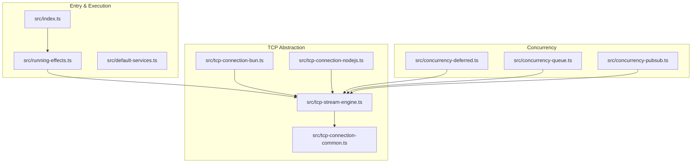
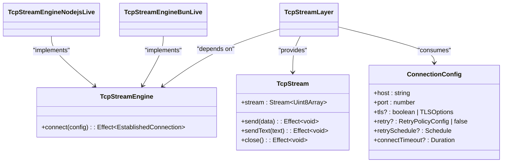
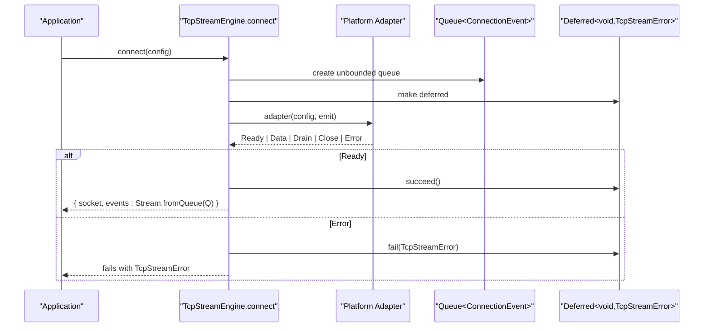
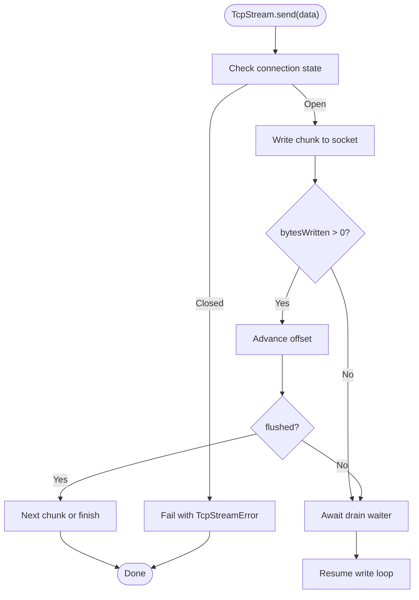
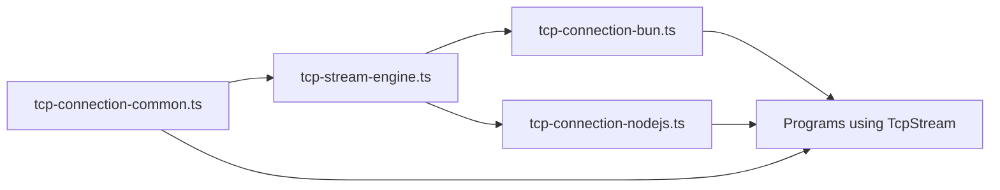

# Effect Functional Programming Patterns

<cite>
**Referenced Files in This Document**
- [index.ts](file://src/index.ts)
- [default-services.ts](file://src/default-services.ts)
- [running-effects.ts](file://src/running-effects.ts)
- [creating-effects.ts](file://src/creating-effects.ts)
- [tcp-stream-engine.ts](file://src/tcp-stream-engine.ts)
- [tcp-connection-common.ts](file://src/tcp-connection-common.ts)
- [tcp-connection-bun.ts](file://src/tcp-connection-bun.ts)
- [tcp-connection-nodejs.ts](file://src/tcp-connection-nodejs.ts)
- [concurrency-deferred.ts](file://src/concurrency-deferred.ts)
- [concurrency-queue.ts](file://src/concurrency-queue.ts)
- [concurrency-pubsub.ts](file://src/concurrency-pubsub.ts)
</cite>

## Table of Contents
1. Introduction
2. Project Structure
3. Core Components
4. Architecture Overview
5. Detailed Component Analysis
6. Dependency Analysis
7. Performance Considerations
8. Troubleshooting Guide
9. Conclusion

## Introduction
This document explains the Effect functional programming patterns used across the codebase, focusing on:
- Effects as typed, composable computations with explicit error and interruption channels
- Layers and dependency injection via Context for service composition and testing
- The Layer pattern for platform abstraction (Bun vs Node.js) and configuration management
- Practical examples for creating custom services, composing layers, and handling errors
- How Effects integrate with Streams, Queues, and Deferred values to manage TCP connections

The goal is to make these concepts accessible while providing precise references to the implementation files.

## Project Structure
At a high level, the repository organizes Effect programs by feature and runtime:
- Entry points and execution runners demonstrate how to run Effects
- Default services show how to use built-in services like Clock and Random
- TCP connection modules implement a platform-agnostic engine with Bun and Node.js adapters
- Concurrency utilities illustrate Queues, PubSub, and Deferred usage
- Common types and shared error models live in a shared module

**Diagram sources**
- [index.ts:1-6](file://src/index.ts#L1-L6)
- [running-effects.ts:1-114](file://src/running-effects.ts#L1-L114)
- [tcp-stream-engine.ts:1-359](file://src/tcp-stream-engine.ts#L1-L359)
- [tcp-connection-common.ts:1-101](file://src/tcp-connection-common.ts#L1-L101)
- [tcp-connection-bun.ts:1-145](file://src/tcp-connection-bun.ts#L1-L145)
- [tcp-connection-nodejs.ts:1-132](file://src/tcp-connection-nodejs.ts#L1-L132)
- [concurrency-deferred.ts:1-65](file://src/concurrency-deferred.ts#L1-L65)
- [concurrency-queue.ts:1-92](file://src/concurrency-queue.ts#L1-L92)
- [concurrency-pubsub.ts:1-98](file://src/concurrency-pubsub.ts#L1-L98)

**Section sources**
- [index.ts:1-6](file://src/index.ts#L1-L6)
- [running-effects.ts:1-114](file://src/running-effects.ts#L1-L114)

## Core Components
- Effects: Represent typed computations that may fail or be interrupted; composed with combinators and generators
- Context and Services: Strongly-typed dependencies resolved at runtime via tags
- Layers: Declarative graphs of services and resources; provide dependencies to programs and manage lifecycles
- Platform Adapters: Concrete implementations of a common interface for different runtimes (Bun, Node.js)
- Concurrency Primitives: Queue, Stream, PubSub, Deferred for backpressure, streaming data, and synchronization

Key responsibilities:
- tcp-stream-engine.ts: Implements the caller-first connect flow, event stream, retry, timeouts, and resource lifecycle
- tcp-connection-common.ts: Defines shared services (TcpStream, ConnectionConfig), error types, validation, and retry schedules
- tcp-connection-bun.ts / tcp-connection-nodejs.ts: Provide platform-specific socket adapters and expose ready-to-use layers
- concurrency-*: Demonstrate core concurrency patterns used within TCP streams and tests

**Section sources**
- [tcp-stream-engine.ts:1-359](file://src/tcp-stream-engine.ts#L1-L359)
- [tcp-connection-common.ts:1-101](file://src/tcp-connection-common.ts#L1-L101)
- [tcp-connection-bun.ts:1-145](file://src/tcp-connection-bun.ts#L1-L145)
- [tcp-connection-nodejs.ts:1-132](file://src/tcp-connection-nodejs.ts#L1-L132)
- [concurrency-deferred.ts:1-65](file://src/concurrency-deferred.ts#L1-L65)
- [concurrency-queue.ts:1-92](file://src/concurrency-queue.ts#L1-L92)
- [concurrency-pubsub.ts:1-98](file://src/concurrency-pubsub.ts#L1-L98)

## Architecture Overview
The TCP subsystem follows a layered architecture:
- TcpStreamEngine is a Context Service that encapsulates low-level connect/write/close operations
- Platform adapters implement the engine for Bun and Node.js
- TcpStreamLayer composes the engine with ConnectionConfig to produce a high-level TcpStream service
- Programs depend only on TcpStream, enabling easy swapping of engines and configuration

**Diagram sources**
- [tcp-stream-engine.ts:64-67](file://src/tcp-stream-engine.ts#L64-L67)
- [tcp-stream-engine.ts:201-341](file://src/tcp-stream-engine.ts#L201-L341)
- [tcp-connection-common.ts:26-57](file://src/tcp-connection-common.ts#L26-L57)
- [tcp-connection-bun.ts:133-137](file://src/tcp-connection-bun.ts#L133-L137)
- [tcp-connection-nodejs.ts:114-120](file://src/tcp-connection-nodejs.ts#L114-L120)

**Section sources**
- [tcp-stream-engine.ts:88-178](file://src/tcp-stream-engine.ts#L88-L178)
- [tcp-stream-engine.ts:201-341](file://src/tcp-stream-engine.ts#L201-L341)
- [tcp-connection-common.ts:26-57](file://src/tcp-connection-common.ts#L26-L57)

## Detailed Component Analysis

### Effects, Context, and Services
- Effects model side effects with explicit success, failure, and interruption outcomes
- Context.Service defines strongly-typed services; programs request them directly without boilerplate
- Default services like Clock and Random are consumed via tags and can be overridden for deterministic behavior

Practical notes:
- Use generator-based workflows with yield* for readable sequencing
- Prefer direct tag access over unnecessary wrapping in gen blocks
- Override services in tests using provided combinators to control randomness and time

**Section sources**
- [default-services.ts:1-32](file://src/default-services.ts#L1-L32)
- [running-effects.ts:1-114](file://src/running-effects.ts#L1-L114)
- [tcp-connection-common.ts:54-57](file://src/tcp-connection-common.ts#L54-L57)

### Layer Pattern for Platform Abstraction and Configuration
- TcpStreamEngine is a service abstracting raw socket operations
- Platform adapters (Bun, Node.js) implement the engine and export ready-to-use layers
- TcpStreamLayer composes the engine with ConnectionConfig to produce TcpStream
- makeConvenienceLayer provides a simple API to build layers with optional config

Benefits:
- Swap platforms by changing the provided layer
- Centralize configuration and validation
- Compose multiple layers into a single graph before running programs

**Section sources**
- [tcp-stream-engine.ts:341-359](file://src/tcp-stream-engine.ts#L341-L359)
- [tcp-connection-bun.ts:133-137](file://src/tcp-connection-bun.ts#L133-L137)
- [tcp-connection-nodejs.ts:114-120](file://src/tcp-connection-nodejs.ts#L114-L120)
- [tcp-connection-common.ts:45-60](file://src/tcp-connection-common.ts#L45-L60)

### TCP Engine: Connect Flow, Events, and Lifecycle
The engine implements a caller-first connect protocol:
- Creates an unbounded queue for events and a Deferred to signal readiness
- Adapts platform callbacks into a uniform event stream
- Enforces connect timeout and maps errors to typed TcpStreamError
- Returns a socket handle and a Stream of events; closing ensures cleanup

**Diagram sources**
- [tcp-stream-engine.ts:88-178](file://src/tcp-stream-engine.ts#L88-L178)
- [tcp-connection-bun.ts:18-131](file://src/tcp-connection-bun.ts#L18-L131)
- [tcp-connection-nodejs.ts:21-112](file://src/tcp-connection-nodejs.ts#L21-L112)

**Section sources**
- [tcp-stream-engine.ts:88-178](file://src/tcp-stream-engine.ts#L88-L178)

### TcpStream: High-Level API with Backpressure and Reliability
TcpStream wraps the engine to provide:
- A Stream of incoming bytes
- send/sendText with backpressure handling via drain events and semaphores
- Graceful close that interrupts background event processing and releases resources
- Optional retry policy based on ConnectionConfig

**Diagram sources**
- [tcp-stream-engine.ts:300-338](file://src/tcp-stream-engine.ts#L300-L338)

**Section sources**
- [tcp-stream-engine.ts:201-339](file://src/tcp-stream-engine.ts#L201-L339)

### Creating Effects and Typed Errors
- Wrap callback/Promise APIs with Effect.callback and Effect.tryPromise
- Define domain errors using tagged error classes for type-safe handling
- Use Effect.suspend to unify return types when branching between success and failure

Examples in this codebase include file I/O wrappers and interruptible tasks with proper cleanup.

**Section sources**
- [creating-effects.ts:1-324](file://src/creating-effects.ts#L1-L324)

### Concurrency: Queues, PubSub, and Deferreds
- Queues provide bounded/unbounded backpressure and shutdown semantics
- PubSub enables multi-subscriber messaging and conversion to Streams
- Deferred coordinates completion between fibers and gates asynchronous handshakes

These primitives are used extensively in TCP streams to buffer data, coordinate readiness, and manage lifecycle.

**Section sources**
- [concurrency-queue.ts:1-92](file://src/concurrency-queue.ts#L1-L92)
- [concurrency-pubsub.ts:1-98](file://src/concurrency-pubsub.ts#L1-L98)
- [concurrency-deferred.ts:1-65](file://src/concurrency-deferred.ts#L1-L65)

## Dependency Analysis
The system exhibits clear separation of concerns:
- tcp-stream-engine.ts depends on tcp-connection-common.ts for shared types and services
- Platform adapters depend on the engine and re-export convenience layers
- Programs depend on TcpStream, not on concrete engines
- Tests compose layers to inject configuration and engines

**Diagram sources**
- [tcp-connection-common.ts:1-101](file://src/tcp-connection-common.ts#L1-L101)
- [tcp-stream-engine.ts:1-359](file://src/tcp-stream-engine.ts#L1-L359)
- [tcp-connection-bun.ts:1-145](file://src/tcp-connection-bun.ts#L1-L145)
- [tcp-connection-nodejs.ts:1-132](file://src/tcp-connection-nodejs.ts#L1-L132)

**Section sources**
- [tcp-stream-engine.ts:1-359](file://src/tcp-stream-engine.ts#L1-L359)
- [tcp-connection-common.ts:1-101](file://src/tcp-connection-common.ts#L1-L101)

## Performance Considerations
- Use bounded queues to apply backpressure and avoid memory growth under load
- Leverage Stream.fromQueue to process events incrementally rather than buffering all data
- Configure connectTimeout and retry policies to balance responsiveness and resilience
- Avoid unnecessary allocations in hot paths; reuse buffers where possible
- Ensure proper cleanup via finalizers and scoped resources to prevent leaks during interruptions

[No sources needed since this section provides general guidance]

## Troubleshooting Guide
Common issues and strategies:
- Connection failures: Inspect TcpStreamError details (operation, message, cause) to diagnose connect/read/write issues
- Timeouts: Verify connectTimeout and retry settings; ensure server availability and network reachability
- Interrupts: Confirm that adapters return cleanup effects and that engine transitions mark phases correctly
- Stream hangs: Check drain handling and that close interrupts background event processing
- Testing: Use ConnectionConfigLive to inject deterministic configs and override services for reproducibility

**Section sources**
- [tcp-connection-common.ts:12-24](file://src/tcp-connection-common.ts#L12-L24)
- [tcp-stream-engine.ts:180-195](file://src/tcp-stream-engine.ts#L180-L195)
- [tcp-stream-engine.ts:252-299](file://src/tcp-stream-engine.ts#L252-L299)

## Conclusion
This codebase demonstrates robust Effect patterns:
- Effects model side effects with explicit error and interruption channels
- Context and Layers enable clean dependency injection and platform abstraction
- The TCP engine uses Streams, Queues, and Deferreds to manage connectivity, backpressure, and lifecycle
- Tests validate reliability, retries, timeouts, and graceful shutdowns

By following these patterns, you can build maintainable, testable, and resilient applications that are portable across runtimes.

[No sources needed since this section summarizes without analyzing specific files]