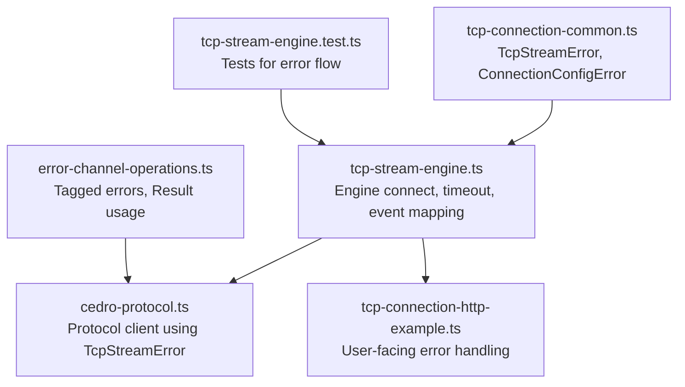
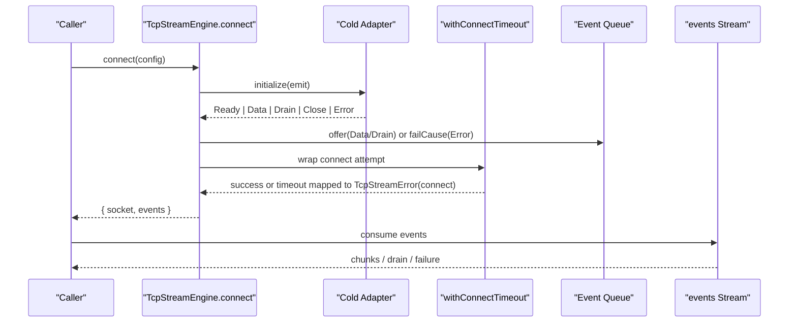
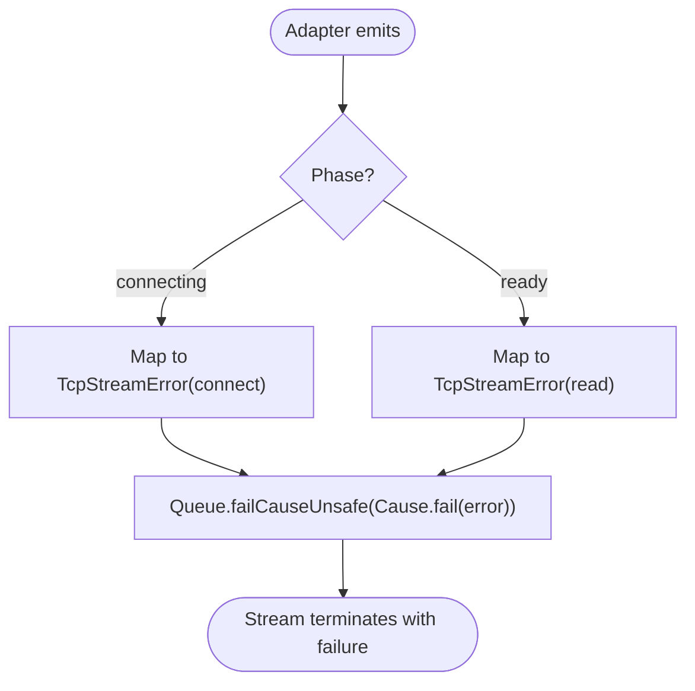
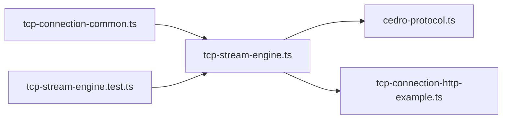

# Error Handling Strategies

<cite>
**Referenced Files in This Document**
- [tcp-connection-common.ts](file://src/tcp-connection-common.ts)
- [tcp-stream-engine.ts](file://src/tcp-stream-engine.ts)
- [error-channel-operations.ts](file://src/error-channel-operations.ts)
- [cedro-protocol.ts](file://src/cedro-protocol.ts)
- [tcp-connection-http-example.ts](file://src/tcp-connection-http-example.ts)
- [tcp-stream-engine.test.ts](file://src/tcp-stream-engine.test.ts)
</cite>

## Table of Contents
1. [Introduction](#introduction)
2. [Project Structure](#project-structure)
3. [Core Components](#core-components)
4. [Architecture Overview](#architecture-overview)
5. [Detailed Component Analysis](#detailed-component-analysis)
6. [Dependency Analysis](#dependency-analysis)
7. [Performance Considerations](#performance-considerations)
8. [Troubleshooting Guide](#troubleshooting-guide)
9. [Conclusion](#conclusion)

## Introduction
This document explains the error handling strategies used across the TCP stream layer and protocol client. It focuses on:
- The TcpStreamError type system and how it carries structured operation context.
- How Effect’s Cause type is used to propagate, transform, and recover from errors through streams and effects.
- Error channel operations that move failures through the stream processing pipeline.
- Practical patterns for connection failures, timeouts, and protocol errors.
- Best practices for reporting, logging, and user-friendly messages.

## Project Structure
The error handling spans a few core modules:
- tcp-connection-common.ts defines shared error types and validation utilities.
- tcp-stream-engine.ts implements the engine that connects, manages events, and maps low-level adapter events into typed errors and streams.
- error-channel-operations.ts demonstrates mapped errors, tagged errors, and Result-based validation.
- cedro-protocol.ts shows a protocol client that composes TcpStreamError with domain-specific protocol errors.
- tcp-connection-http-example.ts shows end-to-end error recovery and user-facing messaging.
- tcp-stream-engine.test.ts validates behavior around readiness, retries, timeouts, and error classification.

**Diagram sources**
- [tcp-connection-common.ts:12-24](file://src/tcp-connection-common.ts#L12-L24)
- [tcp-stream-engine.ts:81-195](file://src/tcp-stream-engine.ts#L81-L195)
- [cedro-protocol.ts:5-33](file://src/cedro-protocol.ts#L5-L33)
- [tcp-connection-http-example.ts:12-36](file://src/tcp-connection-http-example.ts#L12-L36)
- [error-channel-operations.ts:3-20](file://src/error-channel-operations.ts#L3-L20)
- [tcp-stream-engine.test.ts:100-149](file://src/tcp-stream-engine.test.ts#L100-L149)

**Section sources**
- [tcp-connection-common.ts:12-24](file://src/tcp-connection-common.ts#L12-L24)
- [tcp-stream-engine.ts:81-195](file://src/tcp-stream-engine.ts#L81-L195)
- [error-channel-operations.ts:3-20](file://src/error-channel-operations.ts#L3-L20)
- [cedro-protocol.ts:5-33](file://src/cedro-protocol.ts#L5-L33)
- [tcp-connection-http-example.ts:12-36](file://src/tcp-connection-http-example.ts#L12-L36)
- [tcp-stream-engine.test.ts:100-149](file://src/tcp-stream-engine.test.ts#L100-L149)

## Core Components
- TcpStreamError: A tagged error carrying operation context (connect, read, write), a human-readable message, and an optional underlying cause.
- ConnectionConfigError: Validation failure for host/port configuration.
- Protocol-specific errors: CedroProtocolError and example CLI errors (MissingCliArgError, UnsupportedProtocolError, InvalidUrlError, UnsupportedEngineError).
- Engine error mapping: Adapter events are converted into TcpStreamError with precise operation tags based on connection phase.
- Stream error propagation: Errors flow through queues and streams as typed failures or Cause.Done for clean termination.

Key responsibilities:
- Centralize error typing so callers can pattern-match on error kinds.
- Preserve original causes for diagnostics while exposing stable, typed errors.
- Provide timeouts and retry boundaries without leaking stale events between attempts.

**Section sources**
- [tcp-connection-common.ts:12-24](file://src/tcp-connection-common.ts#L12-L24)
- [tcp-stream-engine.ts:81-195](file://src/tcp-stream-engine.ts#L81-L195)
- [cedro-protocol.ts:5-33](file://src/cedro-protocol.ts#L5-L33)
- [tcp-connection-http-example.ts:12-36](file://src/tcp-connection-http-example.ts#L12-L36)

## Architecture Overview
The engine wraps a cold adapter that emits events. Errors during connection become TcpStreamError(connect); after readiness, errors become TcpStreamError(read). Timeouts wrap the connect attempt and map non-TcpStreamError causes into TcpStreamError(connect) with a “Connection timeout” message. The established session exposes a Stream of data and drain events; failures terminate the stream with a typed error.

**Diagram sources**
- [tcp-stream-engine.ts:89-177](file://src/tcp-stream-engine.ts#L89-L177)
- [tcp-stream-engine.ts:180-195](file://src/tcp-stream-engine.ts#L180-L195)

**Section sources**
- [tcp-stream-engine.ts:89-177](file://src/tcp-stream-engine.ts#L89-L177)
- [tcp-stream-engine.ts:180-195](file://src/tcp-stream-engine.ts#L180-L195)

## Detailed Component Analysis

### TcpStreamError Type System
- Purpose: Provide a unified, typed error surface for all TCP operations.
- Fields:
  - operation: one of connect, read, write.
  - message: human-readable summary.
  - cause?: preserves the original underlying error for diagnostics.
- Usage:
  - Connect-time failures are wrapped as TcpStreamError(connect).
  - Post-readiness failures are wrapped as TcpStreamError(read).
  - Write-time failures are wrapped as TcpStreamError(write).
  - Timeouts are normalized to TcpStreamError(connect) with a specific message.

Benefits:
- Callers can match on operation to tailor recovery (e.g., retry connect vs. abort read).
- Stable error shape enables consistent logging and user messaging.
- Optional cause retains stack traces and platform-specific details.

**Section sources**
- [tcp-connection-common.ts:18-24](file://src/tcp-connection-common.ts#L18-L24)
- [tcp-stream-engine.ts:81-86](file://src/tcp-stream-engine.ts#L81-L86)
- [tcp-stream-engine.ts:125-135](file://src/tcp-stream-engine.ts#L125-L135)
- [tcp-stream-engine.ts:180-195](file://src/tcp-stream-engine.ts#L180-L195)

### Effect’s Cause Type for Propagation and Recovery
- Streams use Cause to represent terminal failures and clean completion:
  - Queue.failCauseUnsafe propagates a typed failure through the stream.
  - Queue.endUnsafe signals normal completion.
- In the engine:
  - On adapter Error, the engine creates TcpStreamError and fails the queue with Cause.fail(error).
  - On stream consumer exit, if not interrupted, the engine finishes the session and may fail incoming with Cause.fail(error) or end cleanly.
- Recovering from errors:
  - Use Effect.catchTag to handle TcpStreamError by operation.
  - Use Effect.catchCause to inspect full Cause when needed (e.g., distinguishing interrupts).

Practical implications:
- Errors flow predictably through streams and can be handled at any level.
- Interrupts are treated specially to avoid false-positive error reporting.

**Section sources**
- [tcp-stream-engine.ts:125-135](file://src/tcp-stream-engine.ts#L125-L135)
- [tcp-stream-engine.ts:216-237](file://src/tcp-stream-engine.ts#L216-L237)
- [tcp-stream-engine.ts:271-293](file://src/tcp-stream-engine.ts#L271-L293)

### Error Channel Operations and Pipeline Flow
- Event emission:
  - Before readiness: Data and Drain events are buffered and offered to the queue; they are preserved even if the attempt later fails.
  - After readiness: Events continue flowing until Close or Error.
- Failure mapping:
  - Adapter Error during connecting -> TcpStreamError(connect).
  - Adapter Error after ready -> TcpStreamError(read).
- Stream consumption:
  - Consumers receive Data and Drain events via Stream.
  - Failures appear as stream failures; clean close appears as stream completion.

**Diagram sources**
- [tcp-stream-engine.ts:106-138](file://src/tcp-stream-engine.ts#L106-L138)

**Section sources**
- [tcp-stream-engine.ts:106-138](file://src/tcp-stream-engine.ts#L106-L138)
- [tcp-stream-engine.test.ts:100-124](file://src/tcp-stream-engine.test.ts#L100-L124)

### Patterns for Common Scenarios

#### Connection Failures
- Pattern: Wrap adapter initialization and readiness in a scoped effect; map any failure to TcpStreamError(connect).
- Retry: Apply retry at the caller side around connect; ensure per-attempt isolation so stale events do not leak.
- Example reference: Tests verify that failed attempts discard their event queues and retries start fresh.

**Section sources**
- [tcp-stream-engine.ts:89-177](file://src/tcp-stream-engine.ts#L89-L177)
- [tcp-stream-engine.test.ts:49-73](file://src/tcp-stream-engine.test.ts#L49-L73)

#### Timeouts
- Pattern: Use withConnectTimeout to wrap connect attempts; non-TcpStreamError causes are normalized to TcpStreamError(connect) with a clear message.
- Behavior: If the adapter never reaches Ready within the configured duration, the attempt is interrupted and closed.

**Section sources**
- [tcp-stream-engine.ts:180-195](file://src/tcp-stream-engine.ts#L180-L195)
- [tcp-stream-engine.test.ts:126-149](file://src/tcp-stream-engine.test.ts#L126-L149)

#### Protocol Errors
- Pattern: Combine TcpStreamError with domain-specific errors (e.g., CedroProtocolError) using Result for pure validation and Effect for I/O.
- Composition: Validate inputs with Result; lift into Effect when sending over the wire; propagate both error kinds up the call stack.

**Section sources**
- [cedro-protocol.ts:5-33](file://src/cedro-protocol.ts#L5-L33)
- [error-channel-operations.ts:71-127](file://src/error-channel-operations.ts#L71-L127)

### Best Practices for Reporting, Logging, and User-Friendly Messages
- Log structured information:
  - Include operation, message, and cause for TcpStreamError.
  - For protocol errors, include contextual fields (e.g., missing credentials, unsupported protocol).
- Surface user-friendly messages:
  - Translate technical causes into concise messages (e.g., “Connection timeout”).
  - Keep detailed diagnostics in logs, not UI text.
- Handle errors at boundaries:
  - Use Effect.catchTag to convert internal errors into user-facing responses.
  - Ensure cleanup runs regardless of success or failure.

Example references:
- HTTP example catches TcpStreamError and logs operation and cause.
- CLI parsing returns descriptive errors for invalid inputs.

**Section sources**
- [tcp-connection-http-example.ts:271-296](file://src/tcp-connection-http-example.ts#L271-L296)
- [tcp-connection-http-example.ts:49-116](file://src/tcp-connection-http-example.ts#L49-L116)

## Dependency Analysis
- tcp-stream-engine.ts depends on:
  - TcpStreamError and ConnectionConfigShape from tcp-connection-common.ts.
  - Effect primitives (Effect, Stream, Queue, Deferred, Cause, etc.).
- cedro-protocol.ts depends on TcpStreamError and composes with CedroProtocolError.
- tcp-connection-http-example.ts depends on concrete engine layers and uses catchTag to handle TcpStreamError.

**Diagram sources**
- [tcp-connection-common.ts:12-24](file://src/tcp-connection-common.ts#L12-L24)
- [tcp-stream-engine.ts:1-24](file://src/tcp-stream-engine.ts#L1-L24)
- [cedro-protocol.ts:1-33](file://src/cedro-protocol.ts#L1-L33)
- [tcp-connection-http-example.ts:1-11](file://src/tcp-connection-http-example.ts#L1-L11)
- [tcp-stream-engine.test.ts:1-14](file://src/tcp-stream-engine.test.ts#L1-L14)

**Section sources**
- [tcp-connection-common.ts:12-24](file://src/tcp-connection-common.ts#L12-L24)
- [tcp-stream-engine.ts:1-24](file://src/tcp-stream-engine.ts#L1-L24)
- [cedro-protocol.ts:1-33](file://src/cedro-protocol.ts#L1-L33)
- [tcp-connection-http-example.ts:1-11](file://src/tcp-connection-http-example.ts#L1-L11)
- [tcp-stream-engine.test.ts:1-14](file://src/tcp-stream-engine.test.ts#L1-L14)

## Performance Considerations
- Avoid unnecessary allocations in error paths: reuse error constructors where appropriate.
- Prefer Cause.fail for stream termination to minimize overhead compared to throwing.
- Use Semaphore for write serialization to prevent interleaved writes and reduce contention.
- Timeouts should be set conservatively to avoid premature failures under load.

[No sources needed since this section provides general guidance]

## Troubleshooting Guide
Common issues and how to diagnose them:
- Stale events after retries:
  - Ensure each connect attempt has its own event queue; tests validate that failed attempts do not leak events to subsequent attempts.
- Misclassified errors:
  - Verify that errors before readiness map to connect and after readiness map to read.
- Timeouts not interrupting:
  - Confirm that connect attempts are wrapped with withConnectTimeout and that adapters respond to interruption.

Recovery tips:
- Use Effect.catchTag("TcpStreamError", handler) to centralize TCP error handling.
- Inspect Cause for interrupts vs. failures to distinguish expected shutdowns from real errors.
- Log operation, message, and cause for fast triage.

**Section sources**
- [tcp-stream-engine.test.ts:49-73](file://src/tcp-stream-engine.test.ts#L49-L73)
- [tcp-stream-engine.test.ts:100-149](file://src/tcp-stream-engine.test.ts#L100-L149)
- [tcp-connection-http-example.ts:271-296](file://src/tcp-connection-http-example.ts#L271-L296)

## Conclusion
The error handling strategy centers on a typed TcpStreamError model enriched with operation context and optional causes, combined with Effect’s Cause to propagate and recover from errors across streams and effects. The engine normalizes adapter events into consistent errors, applies timeouts, and ensures clean session lifecycle management. Protocol layers compose domain-specific errors with TCP errors, while application code handles and surfaces user-friendly messages. Following these patterns yields robust, testable, and maintainable networking code.

[No sources needed since this section summarizes without analyzing specific files]