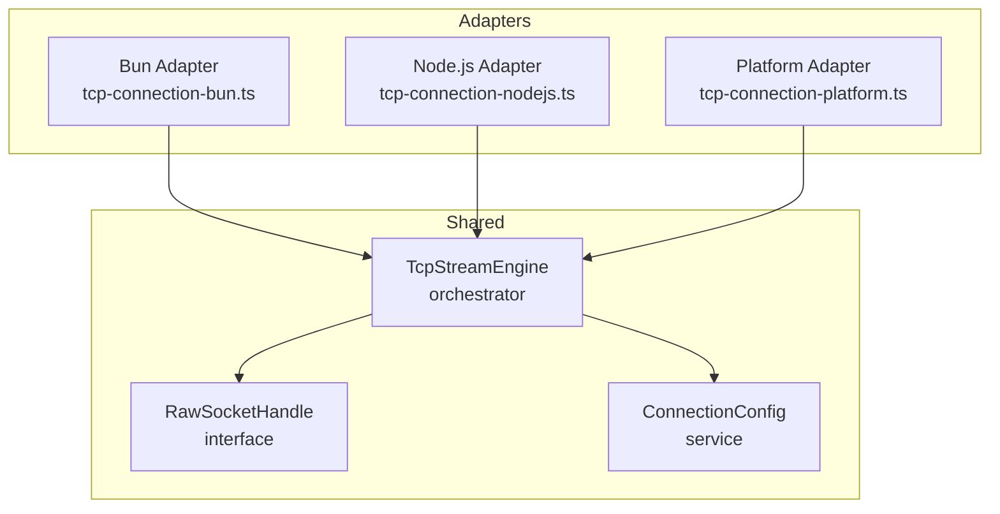
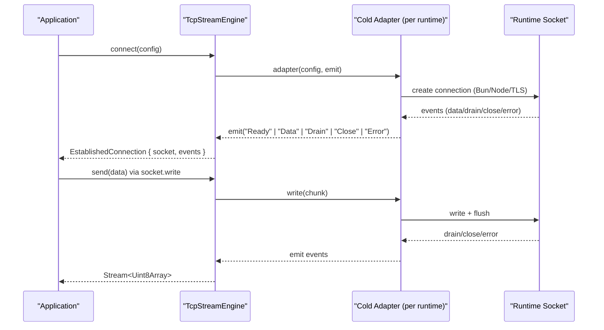
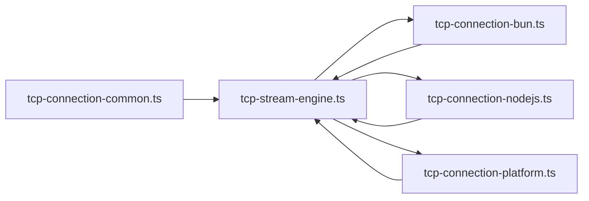

# Platform Abstraction Model

<cite>
**Referenced Files in This Document**
- [tcp-stream-engine.ts](file://src/tcp-stream-engine.ts)
- [tcp-connection-bun.ts](file://src/tcp-connection-bun.ts)
- [tcp-connection-nodejs.ts](file://src/tcp-connection-nodejs.ts)
- [tcp-connection-platform.ts](file://src/tcp-connection-platform.ts)
- [tcp-connection-common.ts](file://src/tcp-connection-common.ts)
- [0002-unified-tcp-stream-engine-adapter-seam.md](file://docs/adr/0002-unified-tcp-stream-engine-adapter-seam.md)
- [0003-effect-platform-push-socket-implementation.md](file://docs/adr/0003-effect-platform-push-socket-implementation.md)
- [0005-unified-platform-socket-engine-adapter-and-test-suite.md](file://docs/adr/0005-unified-platform-socket-engine-adapter-and-test-suite.md)
</cite>

## Table of Contents
1. [Introduction](#introduction)
2. [Project Structure](#project-structure)
3. [Core Components](#core-components)
4. [Architecture Overview](#architecture-overview)
5. [Detailed Component Analysis](#detailed-component-analysis)
6. [Dependency Analysis](#dependency-analysis)
7. [Performance Considerations](#performance-considerations)
8. [Troubleshooting Guide](#troubleshooting-guide)
9. [Conclusion](#conclusion)

## Introduction
This document explains the platform abstraction model that enables cross-platform TCP connectivity across Bun, Node.js, and Effect Platform runtimes. It focuses on the cold adapter protocol, the RawSocketHandle interface, the strategy pattern for runtime selection, and how to implement custom platform adapters. It also highlights benefits for testing and deployment flexibility.

## Project Structure
The TCP subsystem is organized around a shared engine orchestrator and thin platform-specific adapters:
- Shared orchestration and types live in the stream engine module.
- Platform adapters implement the same cold adapter protocol using native or effectful socket APIs.
- Common configuration and error types are centralized for reuse.

**Diagram sources**
- [tcp-stream-engine.ts:88-178](file://src/tcp-stream-engine.ts#L88-L178)
- [tcp-stream-engine.ts:28-79](file://src/tcp-stream-engine.ts#L28-L79)
- [tcp-connection-bun.ts:18-135](file://src/tcp-connection-bun.ts#L18-L135)
- [tcp-connection-nodejs.ts:21-115](file://src/tcp-connection-nodejs.ts#L21-L115)
- [tcp-connection-platform.ts:17-125](file://src/tcp-connection-platform.ts#L17-L125)

**Section sources**
- [tcp-stream-engine.ts:88-178](file://src/tcp-stream-engine.ts#L88-L178)
- [tcp-connection-bun.ts:18-135](file://src/tcp-connection-bun.ts#L18-L135)
- [tcp-connection-nodejs.ts:21-115](file://src/tcp-connection-nodejs.ts#L21-L115)
- [tcp-connection-platform.ts:17-125](file://src/tcp-connection-platform.ts#L17-L125)

## Core Components
- Cold adapter protocol: A function type that accepts connection configuration and an event emitter callback, returning an effect that resolves to a handle for writing and closing the socket.
- RawSocketHandle: The minimal contract adapters must satisfy to integrate with the shared orchestrator.
- TcpStreamEngine: The shared orchestrator that manages connection lifecycle, retry policies, backpressure, and streaming.
- ConnectionConfig: Centralized service providing host, port, TLS options, timeouts, and retry behavior.

Key responsibilities:
- Adapters focus only on platform-specific socket creation and event mapping.
- Orchestrator owns state transitions, queues, retries, and exposure of a unified stream API.

**Section sources**
- [tcp-stream-engine.ts:28-79](file://src/tcp-stream-engine.ts#L28-L79)
- [tcp-stream-engine.ts:88-178](file://src/tcp-stream-engine.ts#L88-L178)
- [tcp-connection-common.ts:45-63](file://src/tcp-connection-common.ts#L45-L63)

## Architecture Overview
The architecture uses a strategy pattern at the layer level: each runtime provides its own engine layer implementing the same shape. The orchestrator composes these layers to deliver a uniform TcpStream service regardless of the underlying runtime.

**Diagram sources**
- [tcp-stream-engine.ts:88-178](file://src/tcp-stream-engine.ts#L88-L178)
- [tcp-connection-bun.ts:18-135](file://src/tcp-connection-bun.ts#L18-L135)
- [tcp-connection-nodejs.ts:21-115](file://src/tcp-connection-nodejs.ts#L21-L115)
- [tcp-connection-platform.ts:17-125](file://src/tcp-connection-platform.ts#L17-L125)

## Detailed Component Analysis

### Cold Adapter Protocol
- Purpose: Decouples platform socket details from the shared orchestrator by defining a small, well-scoped interface.
- Signature: A function that takes connection configuration and an event emitter; returns an Effect resolving to a RawSocketHandle.
- Event contract: The adapter emits Ready, Data, Drain, Close, and Error events through the provided callback. The orchestrator interprets these to manage state and streams.
- Lifecycle: The returned handle’s write and close are effectful, enabling both synchronous kernel operations and asynchronous writers to be uniformly handled.

Benefits:
- Uniform integration across Bun, Node.js, and Effect Platform.
- Clear separation of concerns: adapters map platform I/O; orchestrator handles concurrency, retries, and streaming.

**Section sources**
- [tcp-stream-engine.ts:69-79](file://src/tcp-stream-engine.ts#L69-L79)
- [tcp-stream-engine.ts:88-178](file://src/tcp-stream-engine.ts#L88-L178)

### RawSocketHandle Interface
- Methods:
  - write(chunk): Returns an effect producing bytes written and whether data was flushed.
  - close(): Returns an effect to close the socket cleanly.
- Design rationale: Making write and close effectful allows adapters to wrap synchronous writes (e.g., Bun/Node) and asynchronous writers (e.g., Effect Platform) uniformly.

Usage:
- Each adapter constructs a handle that maps platform-specific semantics into this contract.
- The orchestrator calls write for sending data and close for teardown, ensuring consistent resource management.

**Section sources**
- [tcp-stream-engine.ts:28-38](file://src/tcp-stream-engine.ts#L28-L38)
- [tcp-connection-bun.ts:95-116](file://src/tcp-connection-bun.ts#L95-L116)
- [tcp-connection-nodejs.ts:45-62](file://src/tcp-connection-nodejs.ts#L45-L62)
- [tcp-connection-platform.ts:85-108](file://src/tcp-connection-platform.ts#L85-L108)

### Strategy Pattern for Runtime Selection
- Layer-based strategy: Each runtime exports a concrete engine layer that implements the same shape. Consumers choose the desired runtime by providing the corresponding layer.
- Convenience layers: Factory functions package engine and optional connection config into a single layer, simplifying setup per runtime.
- Selection points:
  - Importing a specific runtime module to get its layer.
  - Providing a chosen layer into the Effect context where TcpStream is used.

Advantages:
- Zero conditional logic in application code.
- Easy swapping of runtimes for testing or deployment targets.

**Section sources**
- [tcp-connection-bun.ts:133-138](file://src/tcp-connection-bun.ts#L133-L138)
- [tcp-connection-nodejs.ts:114-121](file://src/tcp-connection-nodejs.ts#L114-L121)
- [tcp-connection-platform.ts:121-128](file://src/tcp-connection-platform.ts#L121-L128)
- [tcp-stream-engine.ts:346-358](file://src/tcp-stream-engine.ts#L346-L358)

### Platform-Specific Implementations

#### Bun Adapter
- Uses Bun.connect to establish connections, optionally with TLS.
- Maps socket events (data, drain, close, error) to the adapter event contract.
- Provides a handle that wraps synchronous writes and flushes into effects.

Notes:
- Handles termination and cleanup carefully to avoid leaks on cancellation or errors.

**Section sources**
- [tcp-connection-bun.ts:18-135](file://src/tcp-connection-bun.ts#L18-L135)

#### Node.js Adapter
- Uses node:net and node:tls to create connections based on configuration.
- Emits events for data, drain, close, and error.
- Wraps writes in effects and normalizes buffer/string chunks to Uint8Array.

Notes:
- Ensures proper handling of secureConnect vs connect events depending on TLS usage.

**Section sources**
- [tcp-connection-nodejs.ts:21-115](file://src/tcp-connection-nodejs.ts#L21-L115)

#### Effect Platform Adapter
- Leverages @effect/platform-bun and effect/unstable/socket/Socket for push-based sockets.
- Bridges socket.run callbacks to the adapter event contract and manages scoped lifecycles.
- Supports both plain TCP and TLS via BunSocket.makeNet and BunSocket.fromDuplex.

Notes:
- Uses Effect primitives (Deferred, Scope) to coordinate readiness and teardown safely.

**Section sources**
- [tcp-connection-platform.ts:17-125](file://src/tcp-connection-platform.ts#L17-L125)

### Custom Platform Adapters: Contract and Examples
To add a new runtime:
- Implement the cold adapter function that:
  - Accepts TcpStreamEngineConfig and an emit callback.
  - Creates a platform socket and wires events to emit.
  - Returns an Effect resolving to a RawSocketHandle with effectful write and close.
- Export a layer that satisfies TcpStreamEngineShape via makeTcpStreamEngine(adapter).
- Provide a convenience layer using makeConvenienceLayer if desired.

Example patterns:
- Synchronous writes wrapped in Effect.try to produce RawSocketWriteResult.
- Asynchronous writers mapped via Effect.map/mapError to conform to the contract.
- Proper emission of Ready before exposing the handle to prevent races.

References:
- See Bun and Node.js adapters for concrete examples of event mapping and handle construction.

**Section sources**
- [tcp-stream-engine.ts:88-178](file://src/tcp-stream-engine.ts#L88-L178)
- [tcp-connection-bun.ts:18-135](file://src/tcp-connection-bun.ts#L18-L135)
- [tcp-connection-nodejs.ts:21-115](file://src/tcp-connection-nodejs.ts#L21-L115)
- [tcp-connection-platform.ts:17-125](file://src/tcp-connection-platform.ts#L17-L125)

### Benefits for Testing and Deployment Flexibility
- Testability:
  - Swap implementations easily to test against different runtimes or mock adapters.
  - Use the parameterized test suite to validate behavior consistently across engines.
- Deployment flexibility:
  - Choose the optimal runtime per environment without changing application code.
  - Unified configuration and error handling simplify operational concerns.

**Section sources**
- [0002-unified-tcp-stream-engine-adapter-seam.md:11-48](file://docs/adr/0002-unified-tcp-stream-engine-adapter-seam.md#L11-L48)
- [0005-unified-platform-socket-engine-adapter-and-test-suite.md:22-76](file://docs/adr/0005-unified-platform-socket-engine-adapter-and-test-suite.md#L22-L76)

## Dependency Analysis
The following diagram shows how components depend on each other:

**Diagram sources**
- [tcp-connection-common.ts:45-63](file://src/tcp-connection-common.ts#L45-L63)
- [tcp-stream-engine.ts:88-178](file://src/tcp-stream-engine.ts#L88-L178)
- [tcp-connection-bun.ts:18-135](file://src/tcp-connection-bun.ts#L18-L135)
- [tcp-connection-nodejs.ts:21-115](file://src/tcp-connection-nodejs.ts#L21-L115)
- [tcp-connection-platform.ts:17-125](file://src/tcp-connection-platform.ts#L17-L125)

**Section sources**
- [tcp-stream-engine.ts:88-178](file://src/tcp-stream-engine.ts#L88-L178)
- [tcp-connection-bun.ts:18-135](file://src/tcp-connection-bun.ts#L18-L135)
- [tcp-connection-nodejs.ts:21-115](file://src/tcp-connection-nodejs.ts#L21-L115)
- [tcp-connection-platform.ts:17-125](file://src/tcp-connection-platform.ts#L17-L125)

## Performance Considerations
- Minimal overhead: Adapters are thin and focused on I/O mapping; the orchestrator centralizes expensive logic once.
- Backpressure handling: The orchestrator coordinates drain events and write loops to avoid unbounded buffering.
- Scoped resources: Per-attempt scopes ensure timely cleanup even on failures or interruptions.

[No sources needed since this section provides general guidance]

## Troubleshooting Guide
Common issues and strategies:
- Connection timeout: The orchestrator enforces a configurable connect timeout and converts timeouts into typed errors.
- Retry policy misconfiguration: Validate host/port and adjust retry settings; use custom schedules when needed.
- TLS handshake failures: Ensure correct TLS options and server compatibility; failures surface as typed errors rather than defects.
- Resource leaks: Rely on scoped teardown; ensure adapters emit Close and Error appropriately.

Operational tips:
- Prefer convenience layers to reduce boilerplate and ensure consistent configuration.
- Use the shared test suite to verify behavior across runtimes during development.

**Section sources**
- [tcp-stream-engine.ts:180-195](file://src/tcp-stream-engine.ts#L180-L195)
- [tcp-connection-common.ts:65-88](file://src/tcp-connection-common.ts#L65-L88)
- [0005-unified-platform-socket-engine-adapter-and-test-suite.md:53-61](file://docs/adr/0005-unified-platform-socket-engine-adapter-and-test-suite.md#L53-L61)

## Conclusion
The platform abstraction model delivers a clean, extensible design for cross-platform TCP connectivity. By isolating platform specifics behind a cold adapter protocol and a strict RawSocketHandle contract, the system achieves:
- Consistent behavior across Bun, Node.js, and Effect Platform.
- Simplified testing and easy runtime swaps.
- Robust lifecycle and error handling managed centrally.

Adopting this model ensures maintainable, portable networking code that scales with your deployment needs.