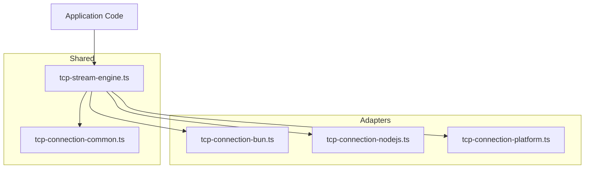
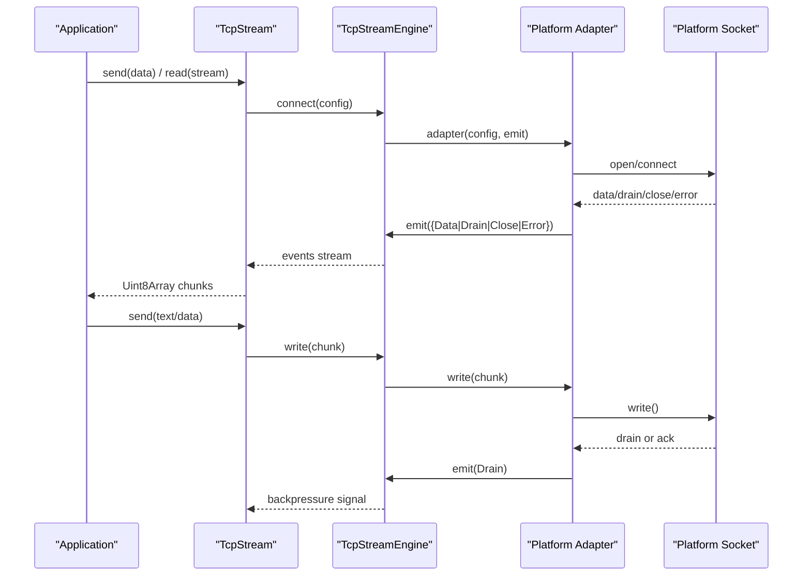
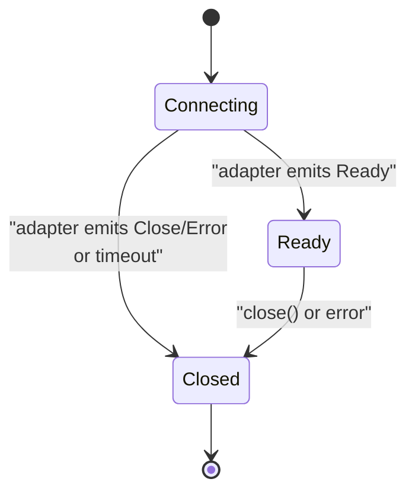
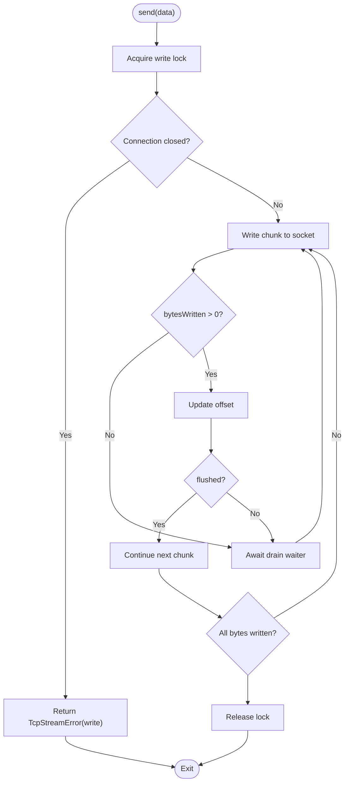
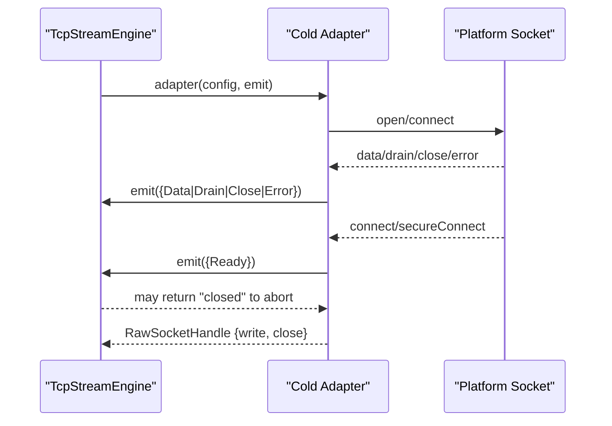
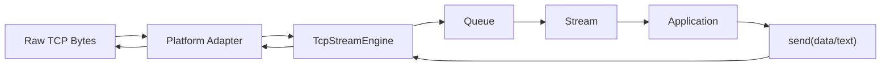
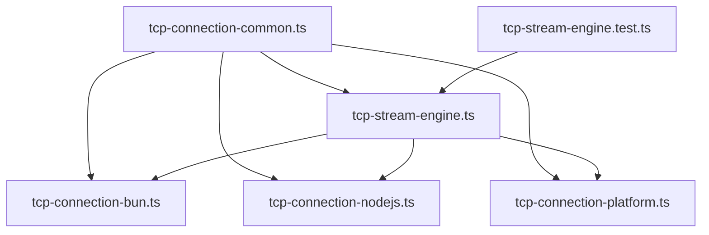

# TCP Architecture Overview

<cite>
**Referenced Files in This Document**
- [tcp-stream-engine.ts](file://src/tcp-stream-engine.ts)
- [tcp-connection-common.ts](file://src/tcp-connection-common.ts)
- [tcp-connection-bun.ts](file://src/tcp-connection-bun.ts)
- [tcp-connection-nodejs.ts](file://src/tcp-connection-nodejs.ts)
- [tcp-connection-platform.ts](file://src/tcp-connection-platform.ts)
- [tcp-stream-engine.test.ts](file://src/tcp-stream-engine.test.ts)
</cite>

## Table of Contents
1. [Introduction](#introduction)
2. [Project Structure](#project-structure)
3. [Core Components](#core-components)
4. [Architecture Overview](#architecture-overview)
5. [Detailed Component Analysis](#detailed-component-analysis)
6. [Dependency Analysis](#dependency-analysis)
7. [Performance Considerations](#performance-considerations)
8. [Troubleshooting Guide](#troubleshooting-guide)
9. [Conclusion](#conclusion)

## Introduction
This document explains the layered TCP architecture that separates protocol concerns, stream orchestration, and platform-specific adapters. It focuses on:
- The layered design pattern with clear boundaries between the protocol layer (shared contracts), the TCP stream engine (orchestration and state machine), and platform adapters (Bun, Node.js, Effect Platform).
- The connection lifecycle state machine with connecting, ready, and closed states.
- The cold adapter protocol that enables cross-platform compatibility by decoupling platform socket implementations from shared orchestration logic.
- Data flow diagrams showing how raw TCP bytes are transformed into application-level streams and writes.

## Project Structure
The TCP subsystem is organized around a shared orchestrator and thin platform adapters:
- Shared contracts and services live in the common module.
- The stream engine implements the core state machine, retry, backpressure, and streaming.
- Platform adapters implement the cold adapter protocol for Bun, Node.js, and an Effect Platform-based implementation.

**Diagram sources**
- [tcp-stream-engine.ts:1-100](file://src/tcp-stream-engine.ts#L1-L100)
- [tcp-connection-common.ts:1-101](file://src/tcp-connection-common.ts#L1-L101)
- [tcp-connection-bun.ts:1-145](file://src/tcp-connection-bun.ts#L1-L145)
- [tcp-connection-nodejs.ts:1-132](file://src/tcp-connection-nodejs.ts#L1-L132)
- [tcp-connection-platform.ts:1-135](file://src/tcp-connection-platform.ts#L1-L135)

**Section sources**
- [tcp-stream-engine.ts:1-100](file://src/tcp-stream-engine.ts#L1-L100)
- [tcp-connection-common.ts:1-101](file://src/tcp-connection-common.ts#L1-L101)

## Core Components
- Protocol Layer (Common): Defines shared types, errors, configuration, and the TcpStream service shape used by all platforms.
- Stream Engine: Implements the caller-first connect flow, connection state machine, retry scheduling, backpressure handling, and event streaming.
- Platform Adapters: Implement the cold adapter protocol to bridge platform sockets to the engine’s event-driven model.

Key responsibilities:
- tcp-connection-common.ts: Error modeling, configuration validation, default retry schedule, and TcpStream service interface.
- tcp-stream-engine.ts: makeTcpStreamEngine, makeTcpStream, retry/timeout, queueing, drain synchronization, and lifecycle management.
- tcp-connection-bun.ts / tcp-connection-nodejs.ts / tcp-connection-platform.ts: Cold adapters mapping platform events to the engine’s event contract.

**Section sources**
- [tcp-connection-common.ts:12-101](file://src/tcp-connection-common.ts#L12-L101)
- [tcp-stream-engine.ts:64-178](file://src/tcp-stream-engine.ts#L64-L178)
- [tcp-connection-bun.ts:18-135](file://src/tcp-connection-bun.ts#L18-L135)
- [tcp-connection-nodejs.ts:21-115](file://src/tcp-connection-nodejs.ts#L21-L115)
- [tcp-connection-platform.ts:17-128](file://src/tcp-connection-platform.ts#L17-L128)

## Architecture Overview
The system follows a layered design:
- Application code depends on TcpStream (service) and ConnectionConfig.
- TcpStream uses TcpStreamEngine to establish connections and manage lifecycle.
- TcpStreamEngine uses a cold adapter function to create platform-specific connections and emit events.
- Each adapter maps platform events (data, drain, close, error) to a unified event type consumed by the engine.

**Diagram sources**
- [tcp-stream-engine.ts:88-178](file://src/tcp-stream-engine.ts#L88-L178)
- [tcp-connection-bun.ts:18-135](file://src/tcp-connection-bun.ts#L18-L135)
- [tcp-connection-nodejs.ts:21-115](file://src/tcp-connection-nodejs.ts#L21-L115)
- [tcp-connection-platform.ts:17-128](file://src/tcp-connection-platform.ts#L17-L128)

## Detailed Component Analysis

### Protocol Layer (tcp-connection-common.ts)
- Errors: TcpStreamError with operation tags (connect, read, write) and cause preservation.
- Configuration: ConnectionConfigShape includes host, port, optional TLS, retry policy, and connect timeout. Validation ensures valid host/port.
- Services: TcpStream defines stream, send, sendText, and close; ConnectionConfig provides runtime configuration via layers.
- Utilities: Default exponential jittered retry schedule builder and message conversion helpers.

Role: Provides a stable contract so the engine and adapters can evolve independently while maintaining compatibility across platforms.

**Section sources**
- [tcp-connection-common.ts:12-101](file://src/tcp-connection-common.ts#L12-L101)

### TCP Stream Engine (tcp-stream-engine.ts)
Responsibilities:
- Caller-first connect: Returns an EstablishedConnection only after the adapter signals Ready; otherwise fails fast with appropriate errors.
- State machine: Tracks phase transitions connecting → ready → closed and enforces terminal behavior.
- Event pipeline: Bridges adapter events to a Stream of ConnectionEvent (Data, Drain).
- Backpressure: Uses a semaphore and Deferred waiters to handle partial writes and drain signals.
- Retry and timeout: Wraps connect attempts with configurable retry schedules and timeouts.
- Lifecycle: Ensures single effective close and clean teardown of resources.

State machine highlights:
- Phase variable controls allowed transitions and event handling.
- Ready transition sets isReady and completes the readiness Deferred.
- Close and Error transitions set phase to closed and terminate queues.
- Abandon marks closed when underlying effect exits unsuccessfully.

**Diagram sources**
- [tcp-stream-engine.ts:92-178](file://src/tcp-stream-engine.ts#L92-L178)

Write path and backpressure:
- Writes are serialized via a semaphore.
- Partial writes wait for drain signals using a Deferred waiter.
- Flushed writes bypass waiting; non-flushed writes await drain.

**Diagram sources**
- [tcp-stream-engine.ts:201-339](file://src/tcp-stream-engine.ts#L201-L339)

**Section sources**
- [tcp-stream-engine.ts:64-178](file://src/tcp-stream-engine.ts#L64-L178)
- [tcp-stream-engine.ts:180-195](file://src/tcp-stream-engine.ts#L180-L195)
- [tcp-stream-engine.ts:201-339](file://src/tcp-stream-engine.ts#L201-L339)

### Cold Adapter Protocol
The cold adapter is a function that:
- Accepts config and an emit callback.
- Creates a platform socket and wires events to emit.
- Returns a RawSocketHandle with write and close.
- Emits Ready only when the socket is established; if emit returns "closed", the adapter must tear down immediately.

Platform implementations:
- Bun adapter: Uses Bun.connect with binary handlers for data, drain, end/close, error, and connectError. Emits Ready upon successful connection.
- Node.js adapter: Uses node:net or node:tls, wiring data, drain, close, error, and connect/secureConnect events.
- Platform adapter: Uses @effect/platform push-based Socket.Socket, bridging to pull-based Stream via Queue and managing lifecycle with scopes and Deferred.

**Diagram sources**
- [tcp-stream-engine.ts:69-79](file://src/tcp-stream-engine.ts#L69-L79)
- [tcp-connection-bun.ts:18-135](file://src/tcp-connection-bun.ts#L18-L135)
- [tcp-connection-nodejs.ts:21-115](file://src/tcp-connection-nodejs.ts#L21-L115)
- [tcp-connection-platform.ts:17-128](file://src/tcp-connection-platform.ts#L17-L128)

**Section sources**
- [tcp-connection-bun.ts:18-135](file://src/tcp-connection-bun.ts#L18-L135)
- [tcp-connection-nodejs.ts:21-115](file://src/tcp-connection-nodejs.ts#L21-L115)
- [tcp-connection-platform.ts:17-128](file://src/tcp-connection-platform.ts#L17-L128)

### Data Flow: Raw Bytes to Application Data
End-to-end flow:
- Platform socket emits raw bytes as Uint8Array chunks.
- Adapter emits Data events to the engine.
- Engine offers chunks into an unbounded Queue exposed as a Stream.
- Application consumes the stream to process messages.
- Writes are serialized and respect backpressure via drain events.

**Diagram sources**
- [tcp-stream-engine.ts:92-178](file://src/tcp-stream-engine.ts#L92-L178)
- [tcp-stream-engine.ts:201-339](file://src/tcp-stream-engine.ts#L201-L339)
- [tcp-connection-bun.ts:18-135](file://src/tcp-connection-bun.ts#L18-L135)
- [tcp-connection-nodejs.ts:21-115](file://src/tcp-connection-nodejs.ts#L21-L115)
- [tcp-connection-platform.ts:17-128](file://src/tcp-connection-platform.ts#L17-L128)

## Dependency Analysis
- Common module is depended on by all adapters and the engine.
- Engine depends on Common for configuration, errors, and retry utilities.
- Adapters depend on Engine to obtain the established connection and expose platform-specific layers.
- Tests validate state transitions, event ordering, and cleanup behaviors.

**Diagram sources**
- [tcp-connection-common.ts:1-101](file://src/tcp-connection-common.ts#L1-L101)
- [tcp-stream-engine.ts:1-100](file://src/tcp-stream-engine.ts#L1-L100)
- [tcp-connection-bun.ts:1-145](file://src/tcp-connection-bun.ts#L1-L145)
- [tcp-connection-nodejs.ts:1-132](file://src/tcp-connection-nodejs.ts#L1-L132)
- [tcp-connection-platform.ts:1-135](file://src/tcp-connection-platform.ts#L1-L135)
- [tcp-stream-engine.test.ts:1-214](file://src/tcp-stream-engine.test.ts#L1-L214)

**Section sources**
- [tcp-stream-engine.test.ts:26-214](file://src/tcp-stream-engine.test.ts#L26-L214)

## Performance Considerations
- Zero-copy semantics: Adapters slice incoming buffers to avoid sharing mutable state across async boundaries.
- Backpressure: Drains are propagated to writers to prevent unbounded memory growth during slow consumers.
- Concurrency control: Writes are serialized to maintain ordering and simplify drain coordination.
- Retry strategy: Exponential backoff with jitter reduces thundering herd effects during transient failures.
- Timeouts: Connect timeouts prevent hanging attempts and free resources promptly.

[No sources needed since this section provides general guidance]

## Troubleshooting Guide
Common issues and diagnostics:
- Connection never reaches Ready:
  - Verify host/port and TLS options.
  - Check connectTimeout and ensure the adapter emits Ready only after secureConnect/connect.
- Unexpected early closure:
  - Ensure the adapter does not emit Close before Ready unless intentionally aborted.
  - Confirm emit returns "accepted" during setup; returning "closed" will tear down the attempt.
- Write stalls:
  - Inspect drain events; ensure writers await drain when flushed is false.
  - Validate that the platform socket actually flushes or reports drained state.
- Errors classified incorrectly:
  - Pre-Ready errors are treated as connect failures; post-Ready errors are read failures.
  - Review error emission paths in adapters and engine event handling.

Validation references:
- Event ordering and leak prevention tests confirm pre-ready events are preserved and failed attempts do not pollute later attempts.
- Timeout test verifies interruption and cleanup when connectivity stalls.
- Single-close semantics ensure idempotent teardown.

**Section sources**
- [tcp-stream-engine.test.ts:26-214](file://src/tcp-stream-engine.test.ts#L26-L214)
- [tcp-stream-engine.ts:88-178](file://src/tcp-stream-engine.ts#L88-L178)
- [tcp-connection-bun.ts:18-135](file://src/tcp-connection-bun.ts#L18-L135)
- [tcp-connection-nodejs.ts:21-115](file://src/tcp-connection-nodejs.ts#L21-L115)
- [tcp-connection-platform.ts:17-128](file://src/tcp-connection-platform.ts#L17-L128)

## Conclusion
This TCP architecture cleanly separates concerns:
- Protocol layer defines stable contracts and configuration.
- Stream engine centralizes lifecycle management, retries, backpressure, and streaming.
- Cold adapter protocol enables multiple platform implementations with minimal duplication.
The result is a robust, testable, and extensible TCP stack that supports Bun, Node.js, and Effect Platform abstractions while providing consistent behavior and clear error semantics.

[No sources needed since this section summarizes without analyzing specific files]