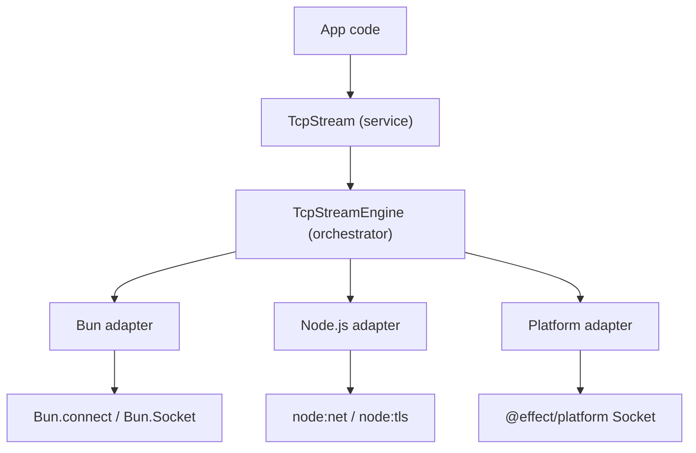
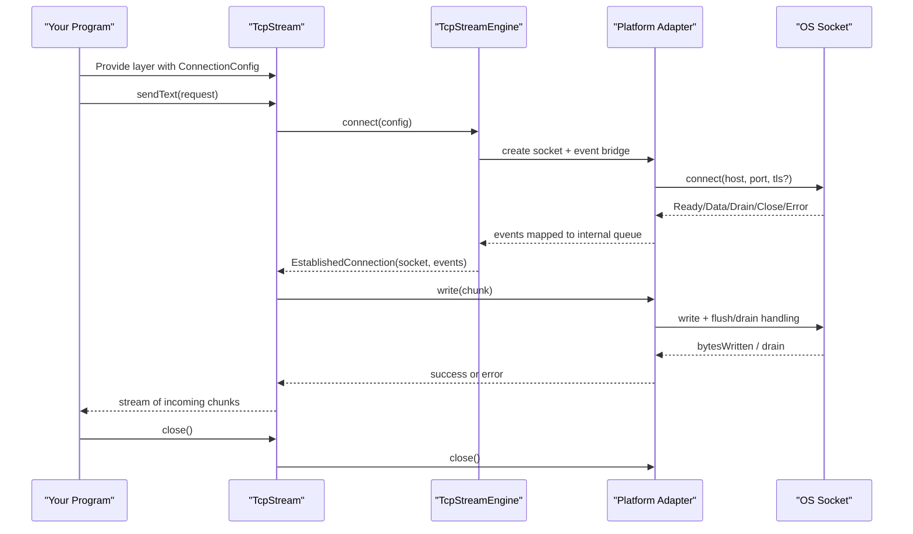
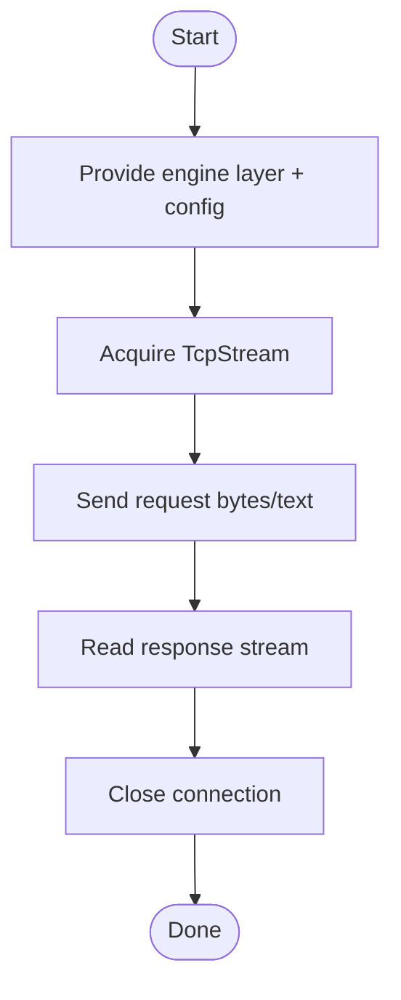
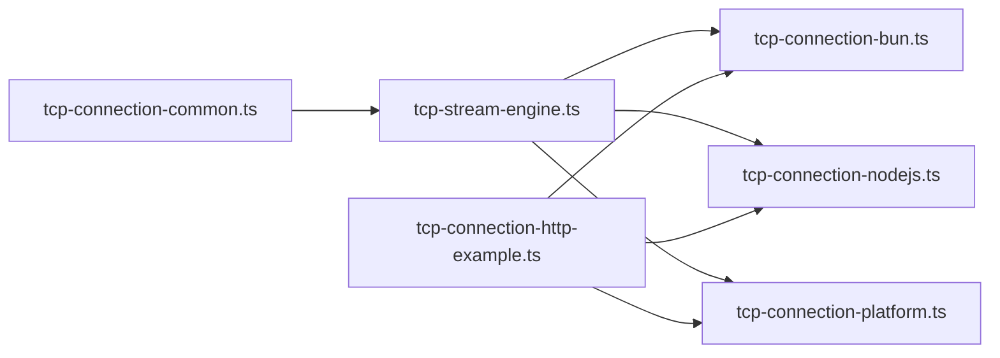

# Getting Started

<cite>
**Referenced Files in This Document**
- [package.json](file://package.json)
- [src/tcp-connection.ts](file://src/tcp-connection.ts)
- [src/tcp-stream-engine.ts](file://src/tcp-stream-engine.ts)
- [src/tcp-connection-common.ts](file://src/tcp-connection-common.ts)
- [src/tcp-connection-bun.ts](file://src/tcp-connection-bun.ts)
- [src/tcp-connection-nodejs.ts](file://src/tcp-connection-nodejs.ts)
- [src/tcp-connection-platform.ts](file://src/tcp-connection-platform.ts)
- [src/tcp-connection-http-example.ts](file://src/tcp-connection-http-example.ts)
</cite>

## Table of Contents
1. Introduction
2. Project Structure
3. Core Components
4. Architecture Overview
5. Detailed Component Analysis
6. Dependency Analysis
7. Performance Considerations
8. Troubleshooting Guide
9. Conclusion

## Introduction
This guide helps you get started with the TCP stream library that provides a unified, Effect-based API for connecting to TCP servers across multiple runtimes: Bun, Node.js, and the Effect Platform. You will learn environment requirements, installation steps, basic configuration, and step-by-step examples ranging from a simple TCP connection to an HTTP client built over raw TCP.

The library exposes:
- A runtime-agnostic TcpStream service for sending data and reading responses as streams
- Engine-specific implementations for Bun, Node.js, and the Effect Platform
- An example program that performs HTTP GET requests over raw TCP using any supported engine

## Project Structure
At a high level:
- Common types, errors, and configuration live in the shared module
- The engine orchestrator wires platform adapters into a unified interface
- Each platform adapter implements low-level socket operations
- An example demonstrates building an HTTP client on top of the library

**Diagram sources**
- [src/tcp-stream-engine.ts:89-178](file://src/tcp-stream-engine.ts#L89-L178)
- [src/tcp-connection-bun.ts:18-135](file://src/tcp-connection-bun.ts#L18-L135)
- [src/tcp-connection-nodejs.ts:21-119](file://src/tcp-connection-nodejs.ts#L21-L119)
- [src/tcp-connection-platform.ts:17-128](file://src/tcp-connection-platform.ts#L17-L128)

**Section sources**
- [package.json:1-33](file://package.json#L1-L33)
- [src/tcp-connection.ts:1-10](file://src/tcp-connection.ts#L1-L10)

## Core Components
- TcpStream: The main service your application uses to send bytes or text and read incoming data as a stream. It also exposes close for graceful shutdown.
- ConnectionConfigShape: Describes host, port, optional TLS settings, retry policy, and connect timeout.
- TcpStreamError: A typed error class used throughout the library to report failures during connect, read, or write operations.
- TcpStreamEngine: The core orchestrator that manages connection lifecycle, events, timeouts, retries, and backpressure.
- Platform Adapters: Concrete implementations for Bun, Node.js, and the Effect Platform that translate their native sockets into the common engine protocol.

Key capabilities:
- Connect to TCP or TLS endpoints with configurable timeouts and retries
- Send binary or text payloads safely with backpressure handling
- Read incoming data incrementally via a stream
- Graceful close and cleanup under interruption

**Section sources**
- [src/tcp-connection-common.ts:12-101](file://src/tcp-connection-common.ts#L12-L101)
- [src/tcp-stream-engine.ts:28-67](file://src/tcp-stream-engine.ts#L28-L67)
- [src/tcp-stream-engine.ts:201-341](file://src/tcp-stream-engine.ts#L201-L341)

## Architecture Overview
The library separates concerns between a stable public API and pluggable platform adapters:

**Diagram sources**
- [src/tcp-stream-engine.ts:89-178](file://src/tcp-stream-engine.ts#L89-L178)
- [src/tcp-connection-bun.ts:18-135](file://src/tcp-connection-bun.ts#L18-L135)
- [src/tcp-connection-nodejs.ts:21-119](file://src/tcp-connection-nodejs.ts#L21-L119)
- [src/tcp-connection-platform.ts:17-128](file://src/tcp-connection-platform.ts#L17-L128)

## Detailed Component Analysis

### Environment Requirements and Installation
- Runtime support: Bun, Node.js, and Effect Platform are supported via separate adapters.
- Dependencies: The project depends on Effect v4 and platform packages for Bun and Node.
- Package manager: Use npm, pnpm, or yarn to install dependencies.

Steps:
1. Ensure you have a compatible runtime installed (Bun or Node.js).
2. Install dependencies using your preferred package manager.
3. Configure your program to provide the appropriate engine layer and connection configuration.

**Section sources**
- [package.json:16-28](file://package.json#L16-L28)

### Basic Configuration Setup
To use the library, provide:
- host: target hostname or IP address
- port: target port number
- tls: optional boolean or TLS options for secure connections
- retry: optional policy or false to disable retries
- connectTimeout: optional duration for connection attempts

You can supply these via a configuration layer so your program can depend only on the TcpStream service.

**Section sources**
- [src/tcp-connection-common.ts:45-60](file://src/tcp-connection-common.ts#L45-L60)
- [src/tcp-stream-engine.ts:244-259](file://src/tcp-stream-engine.ts#L244-L259)

### First Connection Example: Establish, Send, Receive
This example shows how to:
- Provide an engine layer and connection configuration
- Acquire TcpStream
- Send a request
- Collect incoming data as a stream
- Close the connection

Conceptual flow:

Implementation references:
- Provide engine layer and config: see the convenience layer factory and configuration layer usage in the example program.
- Acquire TcpStream and perform I/O: see the shared HTTP request execution logic that sends and collects data.
- Close: call the close method when done.

**Section sources**
- [src/tcp-connection-http-example.ts:176-225](file://src/tcp-connection-http-example.ts#L176-L225)
- [src/tcp-connection-bun.ts:133-138](file://src/tcp-connection-bun.ts#L133-L138)
- [src/tcp-connection-nodejs.ts:114-121](file://src/tcp-connection-nodejs.ts#L114-L121)
- [src/tcp-connection-platform.ts:121-129](file://src/tcp-connection-platform.ts#L121-L129)

### HTTP Client Implementation Over Raw TCP
The repository includes a ready-to-run HTTP client that demonstrates building an HTTP GET request over raw TCP using the library’s TcpStream. It supports three engines: Bun, Node.js, and the Effect Platform.

How it works:
- Parse CLI arguments to select engine and URL
- Build a ConnectionConfigShape from the URL (including TLS for https)
- Send a minimal HTTP/1.1 GET request
- Collect the response stream and decode UTF-8 text
- Print the response

Run instructions:
- Choose an engine flag and pass an http or https URL.
- For Bun: run the example file with Bun.
- For Node.js: ensure the Node.js adapter is selected.
- For the Effect Platform: select the platform engine.

Example invocation patterns:
- Bun: run the example with --engine=bun and a URL
- Node.js: run with --engine=nodejs and a URL
- Platform: run with --engine=platform and a URL

**Section sources**
- [src/tcp-connection-http-example.ts:49-116](file://src/tcp-connection-http-example.ts#L49-L116)
- [src/tcp-connection-http-example.ts:152-170](file://src/tcp-connection-http-example.ts#L152-L170)
- [src/tcp-connection-http-example.ts:176-225](file://src/tcp-connection-http-example.ts#L176-L225)
- [src/tcp-connection-http-example.ts:240-269](file://src/tcp-connection-http-example.ts#L240-L269)
- [src/tcp-connection-http-example.ts:271-300](file://src/tcp-connection-http-example.ts#L271-L300)

### Platform-Specific Setup

#### Bun
- Use the Bun adapter which wraps Bun.connect and Bun.Socket.
- Provide the Bun engine layer and configuration to your program.
- Run your program with Bun.

Key exports:
- Engine layer and convenience layer for Bun

**Section sources**
- [src/tcp-connection-bun.ts:18-135](file://src/tcp-connection-bun.ts#L18-L135)
- [src/tcp-connection-bun.ts:133-138](file://src/tcp-connection-bun.ts#L133-L138)

#### Node.js
- Use the Node.js adapter which wraps node:net and node:tls.
- Provide the Node.js engine layer and configuration to your program.
- Run your program with Node.js.

Key exports:
- Engine layer and convenience layer for Node.js

**Section sources**
- [src/tcp-connection-nodejs.ts:21-119](file://src/tcp-connection-nodejs.ts#L21-L119)
- [src/tcp-connection-nodejs.ts:114-121](file://src/tcp-connection-nodejs.ts#L114-L121)

#### Effect Platform
- Use the Effect Platform adapter which leverages @effect/platform Socket abstractions.
- Provide the platform engine layer and configuration to your program.
- Run your program with your chosen runtime that supports Effect Platform.

Key exports:
- Engine layer and convenience layer for the platform

**Section sources**
- [src/tcp-connection-platform.ts:17-128](file://src/tcp-connection-platform.ts#L17-L128)

## Dependency Analysis
The library composes a small set of modules:
- Common module defines shared types, errors, and configuration
- Engine orchestrator coordinates connection lifecycle and events
- Platform adapters implement concrete socket operations
- Example program ties everything together for end-to-end testing

**Diagram sources**
- [src/tcp-connection-common.ts:12-101](file://src/tcp-connection-common.ts#L12-L101)
- [src/tcp-stream-engine.ts:89-178](file://src/tcp-stream-engine.ts#L89-L178)
- [src/tcp-connection-bun.ts:18-135](file://src/tcp-connection-bun.ts#L18-L135)
- [src/tcp-connection-nodejs.ts:21-119](file://src/tcp-connection-nodejs.ts#L21-L119)
- [src/tcp-connection-platform.ts:17-128](file://src/tcp-connection-platform.ts#L17-L128)
- [src/tcp-connection-http-example.ts:176-225](file://src/tcp-connection-http-example.ts#L176-L225)

**Section sources**
- [src/tcp-connection.ts:1-10](file://src/tcp-connection.ts#L1-L10)
- [src/tcp-stream-engine.ts:89-178](file://src/tcp-stream-engine.ts#L89-L178)

## Performance Considerations
- Backpressure: Writes may be partial; the engine handles draining and ensures ordered writes. Avoid sending large payloads without considering downstream consumption.
- Timeouts: Configure connectTimeout to avoid hanging on slow networks.
- Retries: Use retry policies for transient failures; disable retries for immediate failure semantics when needed.
- Streams: Prefer streaming reads to process data incrementally and reduce memory pressure.

[No sources needed since this section provides general guidance]

## Troubleshooting Guide
Common setup issues and resolutions:
- Unsupported engine selection: Ensure the engine flag is one of bun, nodejs, or platform.
- Invalid URL or unsupported protocol: Only http and https URLs are accepted by the HTTP example.
- Missing CLI argument: Provide a URL when running the example.
- Connection failures: Check host, port, firewall rules, and TLS configuration. Inspect TcpStreamError details for operation and message.
- TLS handshake issues: Verify server name, certificate trust, and ALPN settings when using https.

Where to look:
- CLI parsing and validation for engine and URL
- Error handling and logging in the example program
- Engine-specific adapters for platform differences

**Section sources**
- [src/tcp-connection-http-example.ts:49-116](file://src/tcp-connection-http-example.ts#L49-L116)
- [src/tcp-connection-http-example.ts:271-300](file://src/tcp-connection-http-example.ts#L271-L300)

## Conclusion
You now have the essentials to install, configure, and run TCP connections across Bun, Node.js, and the Effect Platform. Start with a simple connection, then progress to the included HTTP client example to see the library in action. Use the provided layers and configuration to integrate TcpStream into your applications, and rely on the built-in timeouts, retries, and stream-based I/O for robust networking.

[No sources needed since this section summarizes without analyzing specific files]