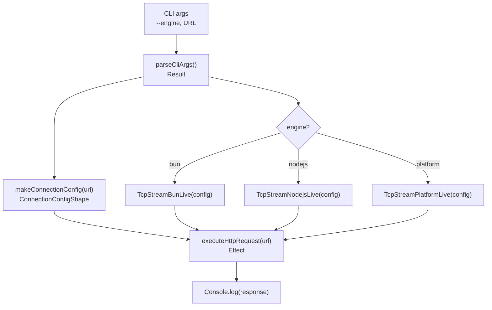
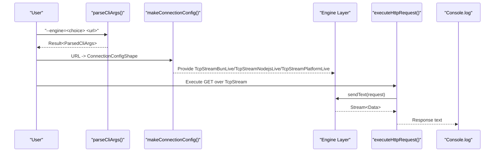
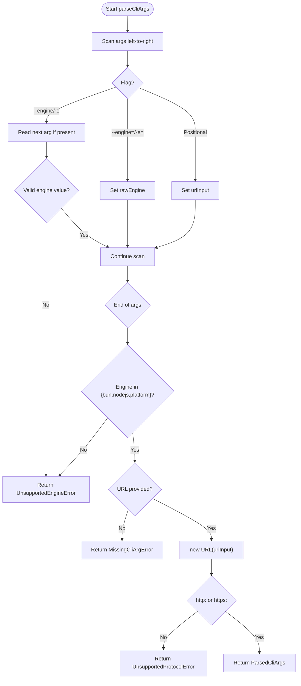
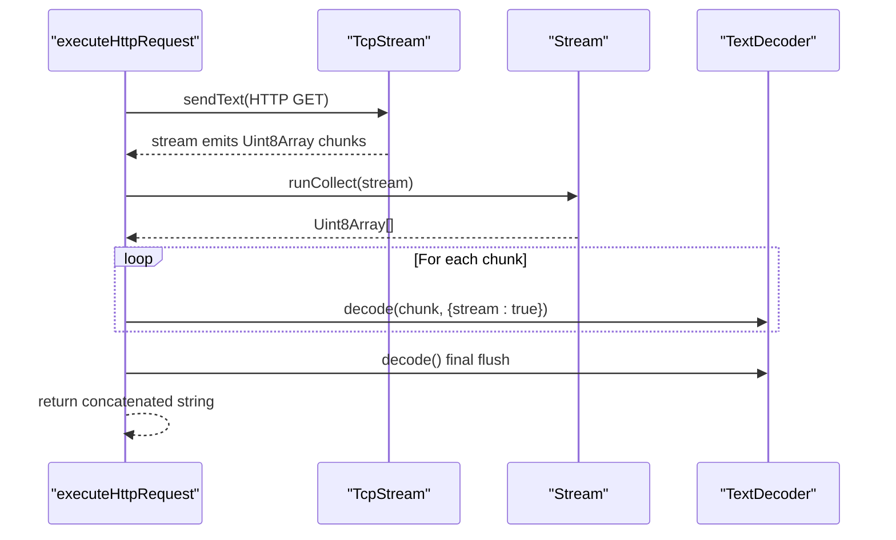
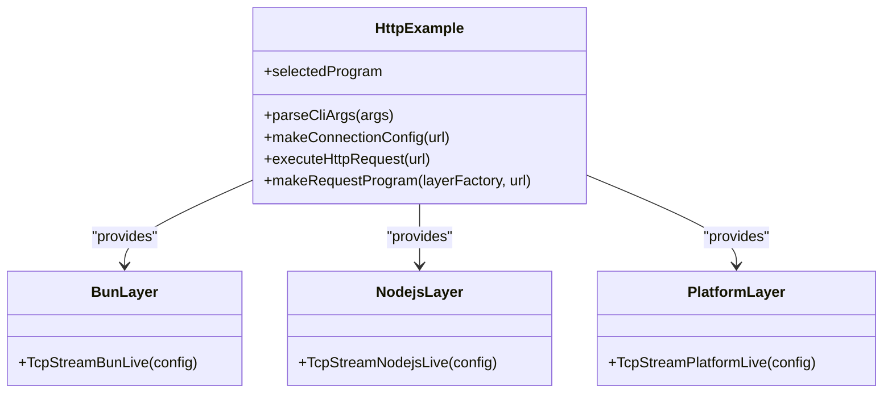
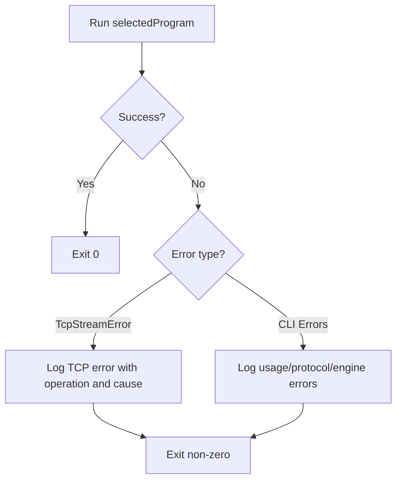
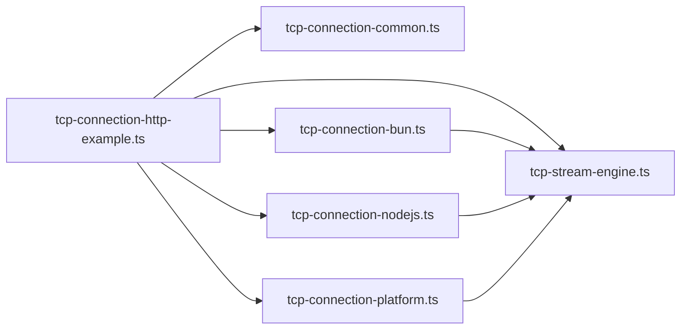

# HTTP Client Example

<cite>
**Referenced Files in This Document**
- [tcp-connection-http-example.ts](file://src/tcp-connection-http-example.ts)
- [tcp-stream-engine.ts](file://src/tcp-stream-engine.ts)
- [tcp-connection-common.ts](file://src/tcp-connection-common.ts)
- [tcp-connection-bun.ts](file://src/tcp-connection-bun.ts)
- [tcp-connection-nodejs.ts](file://src/tcp-connection-nodejs.ts)
- [tcp-connection-platform.ts](file://src/tcp-connection-platform.ts)
- [0004-multi-engine-http-example-programs.md](file://docs/adr/0004-multi-engine-http-example-programs.md)
- [tcp-connection-http-example.test.ts](file://src/tcp-connection-http-example.test.ts)
</cite>

## Table of Contents
1. Introduction
2. Project Structure
3. Core Components
4. Architecture Overview
5. Detailed Component Analysis
6. Dependency Analysis
7. Performance Considerations
8. Troubleshooting Guide
9. Conclusion
10. Appendices

## Introduction
This document explains the HTTP client example that demonstrates a complete, multi-engine HTTP/1.1 client built on top of a unified TCP stream abstraction. It covers CLI argument parsing, HTTP request construction, response handling, and how the same logic runs across Bun, Node.js, and Effect Platform via layered configuration. It also details error handling strategies, logging, debugging techniques, and best practices for building network clients. Finally, it provides guidance for adapting the example to custom protocols.

## Project Structure
The HTTP client example is implemented as a single executable module that:
- Parses CLI arguments to select an engine and target URL
- Builds a connection configuration from the URL (including TLS for HTTPS)
- Executes a shared HTTP GET request over a TcpStream service
- Provides engine-specific layers to wire the underlying socket implementation
- Logs results and handles errors uniformly

**Diagram sources**
- [tcp-connection-http-example.ts:49-116](file://src/tcp-connection-http-example.ts#L49-L116)
- [tcp-connection-http-example.ts:152-170](file://src/tcp-connection-http-example.ts#L152-L170)
- [tcp-connection-http-example.ts:176-205](file://src/tcp-connection-http-example.ts#L176-L205)
- [tcp-connection-http-example.ts:242-254](file://src/tcp-connection-http-example.ts#L242-L254)

**Section sources**
- [tcp-connection-http-example.ts:49-116](file://src/tcp-connection-http-example.ts#L49-L116)
- [0004-multi-engine-http-example-programs.md:17-58](file://docs/adr/0004-multi-engine-http-example-programs.md#L17-L58)

## Core Components
- CLI parsing and validation: parseCliArgs and parseCliUrl return typed Results with specific error tags for missing arguments, unsupported engines, invalid URLs, and unsupported protocols.
- Connection configuration builder: makeConnectionConfig derives host, port, and TLS options (SNI, ALPN) from a URL.
- Shared HTTP execution: executeHttpRequest composes a minimal HTTP/1.1 GET request, sends it via TcpStream.sendText, collects the response stream, and decodes UTF-8 incrementally.
- Multi-engine wiring: makeRequestProgram and makeCliRequestProgram provide engine-specific layers and run the shared HTTP logic.
- Program selection: selectedProgram chooses among Bun, Node.js, and Platform implementations based on parsed CLI flags.
- Error handling and logging: main uses catchTag for TCP-level errors and tapError for CLI-related errors, printing user-friendly messages while preserving non-zero exit behavior.

**Section sources**
- [tcp-connection-http-example.ts:12-36](file://src/tcp-connection-http-example.ts#L12-L36)
- [tcp-connection-http-example.ts:49-116](file://src/tcp-connection-http-example.ts#L49-L116)
- [tcp-connection-http-example.ts:152-170](file://src/tcp-connection-http-example.ts#L152-L170)
- [tcp-connection-http-example.ts:176-205](file://src/tcp-connection-http-example.ts#L176-L205)
- [tcp-connection-http-example.ts:214-269](file://src/tcp-connection-http-example.ts#L214-L269)
- [tcp-connection-http-example.ts:271-296](file://src/tcp-connection-http-example.ts#L271-L296)

## Architecture Overview
The system separates concerns into three layers:
- Application layer: CLI parsing, URL-to-config mapping, and shared HTTP request logic.
- Service layer: TcpStream service exposing send, sendText, stream, and close.
- Engine adapters: Three concrete implementations (Bun, Node.js, Platform) providing RawSocketHandle and event streams consumed by a unified engine.

**Diagram sources**
- [tcp-connection-http-example.ts:49-116](file://src/tcp-connection-http-example.ts#L49-L116)
- [tcp-connection-http-example.ts:152-170](file://src/tcp-connection-http-example.ts#L152-L170)
- [tcp-connection-http-example.ts:176-205](file://src/tcp-connection-http-example.ts#L176-L205)
- [tcp-connection-http-example.ts:242-254](file://src/tcp-connection-http-example.ts#L242-L254)

## Detailed Component Analysis

### CLI Argument Parsing
- Supports --engine=<engine>, --engine <engine>, -e <engine>, and -e=<engine>.
- Accepts a positional URL argument anywhere before or after flags.
- Validates engine choice against allowed values; otherwise returns UnsupportedEngineError.
- Validates URL scheme must be http: or https:; otherwise returns UnsupportedProtocolError.
- Returns InvalidUrlError when URL cannot be parsed.
- Missing URL yields MissingCliArgError with usage hint.

**Diagram sources**
- [tcp-connection-http-example.ts:49-116](file://src/tcp-connection-http-example.ts#L49-L116)

**Section sources**
- [tcp-connection-http-example.ts:49-116](file://src/tcp-connection-http-example.ts#L49-L116)
- [tcp-connection-http-example.test.ts:13-121](file://src/tcp-connection-http-example.test.ts#L13-L121)

### HTTP Request Construction and Execution
- Constructs a minimal HTTP/1.1 GET request including Host, Connection: close, User-Agent, and Accept headers.
- Sends the request using TcpStream.sendText.
- Collects the entire response stream via Stream.runCollect.
- Decodes bytes to UTF-8 incrementally using TextDecoder to handle multi-byte characters split across chunks.
- Returns the full response string for display or testing.

**Diagram sources**
- [tcp-connection-http-example.ts:176-205](file://src/tcp-connection-http-example.ts#L176-L205)

**Section sources**
- [tcp-connection-http-example.ts:176-205](file://src/tcp-connection-http-example.ts#L176-L205)

### Multi-Engine Execution Capability
- The same HTTP logic runs on three engines by swapping the TcpStream layer:
  - Bun: TcpStreamBunLive
  - Node.js: TcpStreamNodejsLive
  - Platform: TcpStreamPlatformLive
- makeConnectionConfig maps a URL to ConnectionConfigShape, enabling TLS with SNI and ALPN for HTTPS.
- Program selection is driven by CLI flags, defaulting to Bun when unspecified.

**Diagram sources**
- [tcp-connection-http-example.ts:152-170](file://src/tcp-connection-http-example.ts#L152-L170)
- [tcp-connection-http-example.ts:214-254](file://src/tcp-connection-http-example.ts#L214-L254)
- [tcp-connection-bun.ts:133-136](file://src/tcp-connection-bun.ts#L133-L136)
- [tcp-connection-nodejs.ts:114-119](file://src/tcp-connection-nodejs.ts#L114-L119)
- [tcp-connection-platform.ts:121-128](file://src/tcp-connection-platform.ts#L121-L128)

**Section sources**
- [tcp-connection-http-example.ts:214-269](file://src/tcp-connection-http-example.ts#L214-L269)
- [0004-multi-engine-http-example-programs.md:17-58](file://docs/adr/0004-multi-engine-http-example-programs.md#L17-L58)

### Error Handling Strategies
- CLI errors are modeled as tagged errors: MissingCliArgError, UnsupportedProtocolError, InvalidUrlError, UnsupportedEngineError.
- Network errors are normalized to TcpStreamError with operation context (connect, read, write).
- Main program:
  - Uses Effect.catchTag("TcpStreamError", ...) to log TCP errors with operation and cause.
  - Uses Effect.tapError(...) to print friendly messages for CLI errors without swallowing them, ensuring non-zero exits.

**Diagram sources**
- [tcp-connection-http-example.ts:271-296](file://src/tcp-connection-http-example.ts#L271-L296)
- [tcp-connection-common.ts:20-24](file://src/tcp-connection-common.ts#L20-L24)

**Section sources**
- [tcp-connection-http-example.ts:271-296](file://src/tcp-connection-http-example.ts#L271-L296)
- [tcp-connection-common.ts:20-24](file://src/tcp-connection-common.ts#L20-L24)

### Logging Implementation
- Successful responses are logged via Console.log within the request program.
- Errors are logged through Effect.tapError and catchTag handlers, including TCP operation details and causes.

**Section sources**
- [tcp-connection-http-example.ts:214-225](file://src/tcp-connection-http-example.ts#L214-L225)
- [tcp-connection-http-example.ts:271-296](file://src/tcp-connection-http-example.ts#L271-L296)

### Debugging Techniques
- Use the test suite to validate CLI parsing and cross-engine behavior with a local echo server.
- Inspect TcpStreamError.operation to identify failure phases (connect, read, write).
- Leverage the engine-specific layers to isolate issues per runtime.
- Add temporary logging around key steps (e.g., request framing, stream collection) by wrapping executeHttpRequest with additional effects.

**Section sources**
- [tcp-connection-http-example.test.ts:13-121](file://src/tcp-connection-http-example.test.ts#L13-L121)
- [tcp-connection-http-example.test.ts:123-205](file://src/tcp-connection-http-example.test.ts#L123-L205)

## Dependency Analysis
The HTTP example depends on:
- Common types and services: TcpStream, ConnectionConfig, TcpStreamError
- Unified engine: TcpStreamEngine and makeTcpStreamEngine
- Engine adapters: Bun, Node.js, Platform implementations

**Diagram sources**
- [tcp-connection-http-example.ts:1-11](file://src/tcp-connection-http-example.ts#L1-L11)
- [tcp-connection-bun.ts:1-16](file://src/tcp-connection-bun.ts#L1-L16)
- [tcp-connection-nodejs.ts:1-18](file://src/tcp-connection-nodejs.ts#L1-L18)
- [tcp-connection-platform.ts:1-15](file://src/tcp-connection-platform.ts#L1-L15)

**Section sources**
- [tcp-connection-http-example.ts:1-11](file://src/tcp-connection-http-example.ts#L1-L11)
- [tcp-connection-bun.ts:1-16](file://src/tcp-connection-bun.ts#L1-L16)
- [tcp-connection-nodejs.ts:1-18](file://src/tcp-connection-nodejs.ts#L1-L18)
- [tcp-connection-platform.ts:1-15](file://src/tcp-connection-platform.ts#L1-L15)

## Performance Considerations
- Streaming response decoding: Using TextDecoder with streaming mode avoids buffering large payloads and correctly reconstructs multi-byte characters across chunks.
- Connection reuse: The example uses Connection: close to simplify response boundaries; for higher throughput, consider persistent connections and pipelining where supported.
- Timeouts and retries: Connect timeouts are enforced by the engine layer; retry policies can be configured via ConnectionConfigShape to improve resilience.
- Write backpressure: The engine coordinates drain events to avoid overwhelming the socket during writes.

[No sources needed since this section provides general guidance]

## Troubleshooting Guide
Common issues and remedies:
- Missing URL or invalid engine flag: Ensure a valid URL is provided and engine is one of bun, nodejs, platform.
- Unsupported protocol: Only http: and https: are supported; adjust the URL accordingly.
- Invalid URL format: Verify the URL string is well-formed.
- TCP errors: Inspect TcpStreamError.operation to determine whether connect, read, or write failed; check network reachability, TLS settings, and certificates.
- Cross-engine differences: Test with all three engines to isolate runtime-specific behaviors.

**Section sources**
- [tcp-connection-http-example.ts:271-296](file://src/tcp-connection-http-example.ts#L271-L296)
- [tcp-connection-common.ts:20-24](file://src/tcp-connection-common.ts#L20-L24)

## Conclusion
The HTTP client example demonstrates a clean separation between application logic and engine-specific networking, enabling the same code to run across Bun, Node.js, and Effect Platform. It showcases robust CLI parsing, safe HTTP request construction, streaming response handling, and comprehensive error management. By following its patterns, you can adapt the example to implement custom protocols with similar reliability and portability.

[No sources needed since this section summarizes without analyzing specific files]

## Appendices

### Step-by-Step Walkthrough
1. Parse CLI arguments to extract engine and URL.
2. Build ConnectionConfigShape from URL, enabling TLS for HTTPS.
3. Provide the appropriate engine layer to supply TcpStream.
4. Execute the shared HTTP GET request and collect the response stream.
5. Decode the response incrementally and log the result.
6. Handle errors gracefully with informative messages and non-zero exits.

**Section sources**
- [tcp-connection-http-example.ts:49-116](file://src/tcp-connection-http-example.ts#L49-L116)
- [tcp-connection-http-example.ts:152-170](file://src/tcp-connection-http-example.ts#L152-L170)
- [tcp-connection-http-example.ts:176-205](file://src/tcp-connection-http-example.ts#L176-L205)
- [tcp-connection-http-example.ts:214-269](file://src/tcp-connection-http-example.ts#L214-L269)
- [tcp-connection-http-example.ts:271-296](file://src/tcp-connection-http-example.ts#L271-L296)

### Adapting for Custom Protocols
- Replace executeHttpRequest with your protocol framing logic while reusing TcpStream.sendText and tcp.stream.
- Use the same engine layer strategy to keep your protocol portable across runtimes.
- Extend error handling to include protocol-specific failures alongside TcpStreamError.
- Add tests mirroring the example’s approach: spin up a simple echo server and assert on responses for each engine.

**Section sources**
- [tcp-connection-http-example.ts:176-205](file://src/tcp-connection-http-example.ts#L176-L205)
- [tcp-connection-http-example.test.ts:123-205](file://src/tcp-connection-http-example.test.ts#L123-L205)