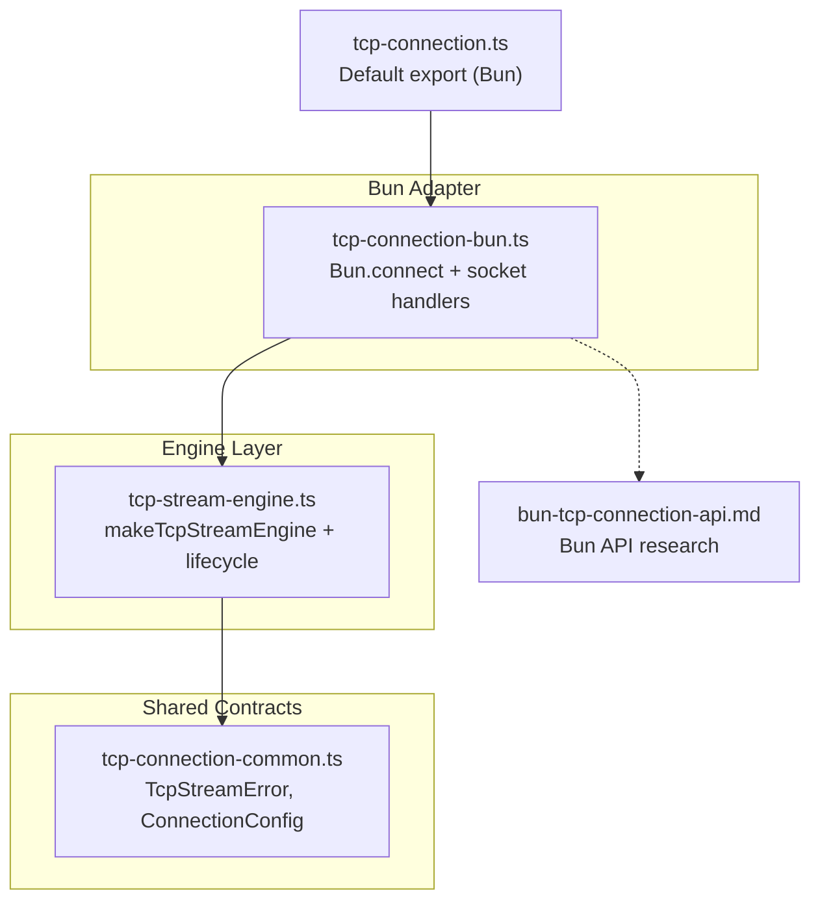
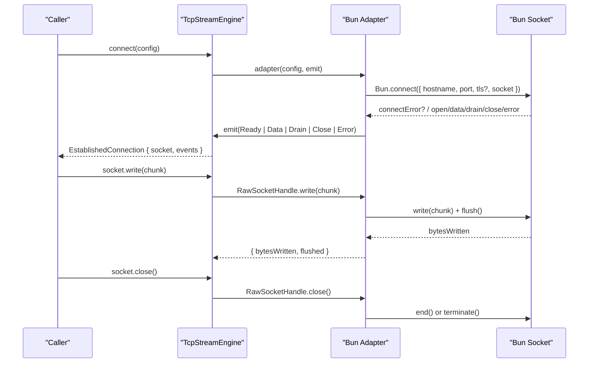
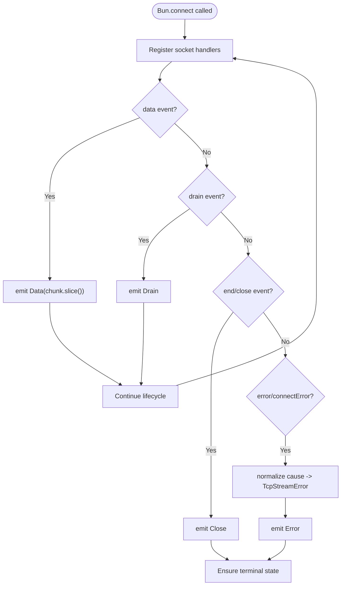
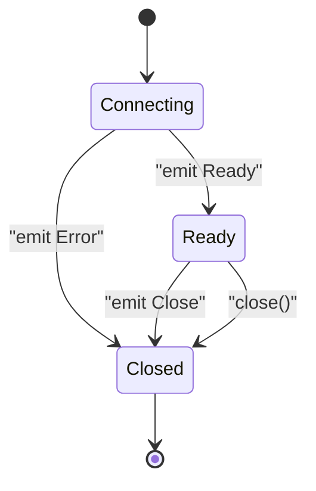
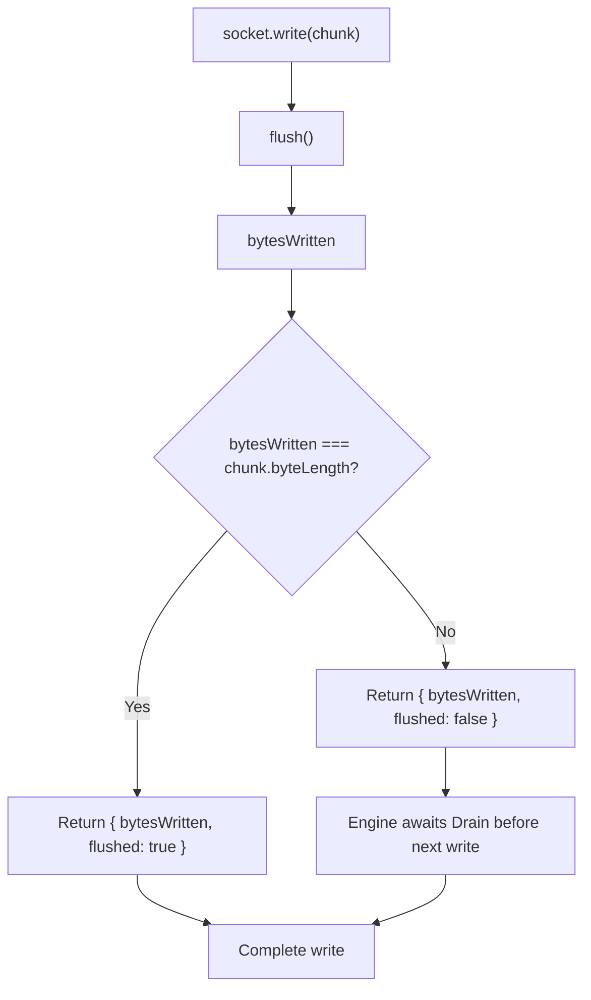
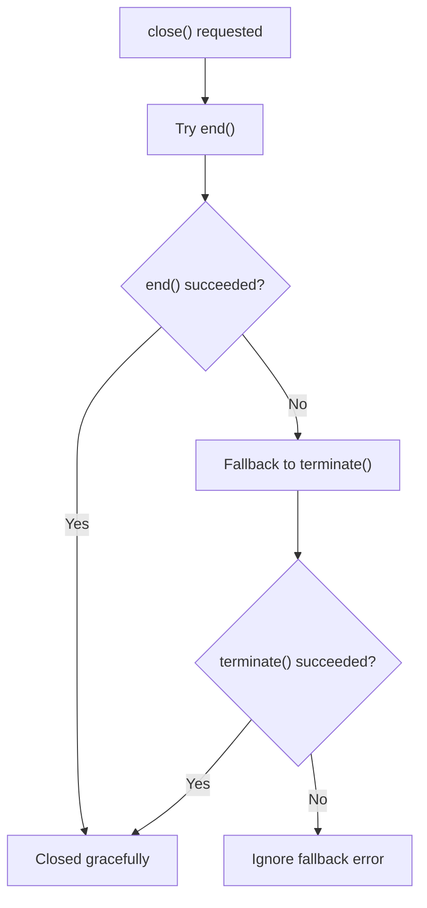
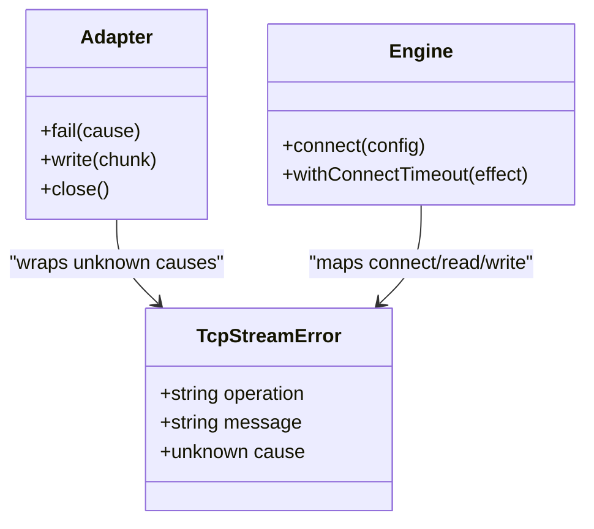
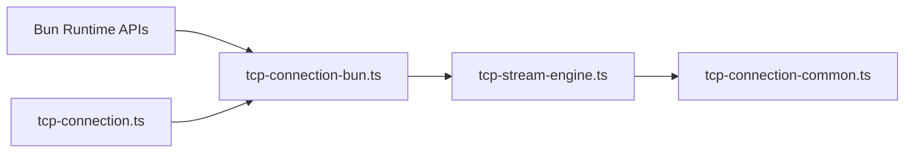

# Bun Adapter Implementation

<cite>
**Referenced Files in This Document**
- [tcp-connection-bun.ts](file://src/tcp-connection-bun.ts)
- [tcp-stream-engine.ts](file://src/tcp-stream-engine.ts)
- [tcp-connection-common.ts](file://src/tcp-connection-common.ts)
- [bun-tcp-connection-api.md](file://docs/research/bun-tcp-connection-api.md)
- [tcp-connection.ts](file://src/tcp-connection.ts)
- [tcp-connection-bun.test.ts](file://src/tcp-connection-bun.test.ts)
</cite>

## Table of Contents
1. [Introduction](#introduction)
2. [Project Structure](#project-structure)
3. [Core Components](#core-components)
4. [Architecture Overview](#architecture-overview)
5. [Detailed Component Analysis](#detailed-component-analysis)
6. [Dependency Analysis](#dependency-analysis)
7. [Performance Considerations](#performance-considerations)
8. [Troubleshooting Guide](#troubleshooting-guide)
9. [Conclusion](#conclusion)

## Introduction
This document explains the Bun adapter implementation that provides a TCP socket adapter for the unified stream engine. It focuses on how the adapter uses Bun’s client connection API, handles socket events, manages connection lifecycles, and maps Bun-specific behaviors to the shared error model. It also covers Bun-specific characteristics such as binary type configuration, flush behavior, and termination strategies, along with performance considerations and TLS configuration examples.

## Project Structure
The Bun adapter is implemented as a thin layer over Bun’s native TCP primitives and integrates with the platform-agnostic stream engine:

- The Bun adapter constructs a cold adapter that connects via Bun and emits normalized events to the engine.
- The engine coordinates queues, timeouts, retries, and backpressure using Effect primitives.
- Shared contracts define errors, configuration, and the public TcpStream interface.

**Diagram sources**
- [tcp-connection-bun.ts:18-137](file://src/tcp-connection-bun.ts#L18-L137)
- [tcp-stream-engine.ts:88-178](file://src/tcp-stream-engine.ts#L88-L178)
- [tcp-connection-common.ts:18-52](file://src/tcp-connection-common.ts#L18-L52)
- [tcp-connection.ts:1-10](file://src/tcp-connection.ts#L1-L10)
- [bun-tcp-connection-api.md:64-143](file://docs/research/bun-tcp-connection-api.md#L64-L143)

**Section sources**
- [tcp-connection-bun.ts:18-137](file://src/tcp-connection-bun.ts#L18-L137)
- [tcp-stream-engine.ts:88-178](file://src/tcp-stream-engine.ts#L88-L178)
- [tcp-connection-common.ts:18-52](file://src/tcp-connection-common.ts#L18-L52)
- [tcp-connection.ts:1-10](file://src/tcp-connection.ts#L1-L10)
- [bun-tcp-connection-api.md:64-143](file://docs/research/bun-tcp-connection-api.md#L64-L143)

## Core Components
- Bun adapter factory: Creates a cold adapter that calls Bun.connect, wires socket event handlers, and returns a raw handle with write and close operations.
- Engine integration: The adapter emits normalized events (Ready, Data, Drain, Close, Error) consumed by the engine, which builds streams, applies timeouts, and manages backpressure.
- Shared error model: All errors are wrapped into TcpStreamError with operation context (connect, read, write).

Key responsibilities:
- Bun.connect usage with optional TLS configuration.
- Binary data handling via binaryType set to a typed array format.
- Explicit flush after writes to ensure kernel buffer progress.
- Graceful vs abrupt shutdown using terminate and end.
- Event mapping to engine events and error normalization.

**Section sources**
- [tcp-connection-bun.ts:18-137](file://src/tcp-connection-bun.ts#L18-L137)
- [tcp-stream-engine.ts:88-178](file://src/tcp-stream-engine.ts#L88-L178)
- [tcp-connection-common.ts:18-52](file://src/tcp-connection-common.ts#L18-L52)

## Architecture Overview
The adapter implements the cold adapter protocol expected by makeTcpStreamEngine. It bridges Bun’s callback-based socket API to an Effect-driven stream pipeline.

**Diagram sources**
- [tcp-stream-engine.ts:88-178](file://src/tcp-stream-engine.ts#L88-L178)
- [tcp-connection-bun.ts:18-137](file://src/tcp-connection-bun.ts#L18-L137)

## Detailed Component Analysis

### Bun.connect Usage and TLS Configuration
- The adapter invokes Bun.connect with host, port, and optional TLS options.
- TLS can be enabled by passing true or a full TLS options object; when undefined, TLS is disabled.
- The returned promise resolves to a connected socket once established.

TLS configuration guidance:
- Use boolean true for system trust store.
- Provide a TLS options object for custom CA, certificates, ALPN, cipher suites, and verification policies.
- For dynamic upgrades, consult the research doc for upgrade patterns.

Examples of configuration:
- Plain TCP: omit tls or pass false.
- TLS with defaults: pass true.
- TLS with custom options: pass a TLS options object including fields like ca, cert, key, serverName, rejectUnauthorized, ALPNProtocols.

**Section sources**
- [tcp-connection-bun.ts:57-63](file://src/tcp-connection-bun.ts#L57-L63)
- [bun-tcp-connection-api.md:231-294](file://docs/research/bun-tcp-connection-api.md#L231-L294)

### Socket Event Handling
The adapter registers Bun socket handlers and maps them to engine events:

- data: Emits Data with a copy of the chunk to avoid external mutation.
- drain: Emits Drain to signal the engine that the kernel buffer has space.
- end and close: Both map to Close, ensuring consistent lifecycle signaling.
- error: Normalizes unknown causes into TcpStreamError and emits Error.
- connectError: Handles initial connection failures, terminates the socket if needed, and emits Error.

Lifecycle flags:
- ended prevents duplicate terminal operations.
- cancelled indicates cleanup due to scope interruption.
- settled ensures only one outcome (success or failure) is emitted.

**Diagram sources**
- [tcp-connection-bun.ts:63-86](file://src/tcp-connection-bun.ts#L63-L86)

**Section sources**
- [tcp-connection-bun.ts:63-86](file://src/tcp-connection-bun.ts#L63-L86)

### Connection Lifecycle Management
- Cold adapter creation: Uses Effect.callback to manage asynchronous setup and cleanup.
- Ready emission: After successful connection, the adapter emits Ready and resumes with a RawSocketHandle.
- Cleanup: On cancellation or error, the adapter ensures the socket is terminated or ended exactly once.
- Engine coordination: The engine tracks phases (connecting, ready, closed), enforces timeouts, and converts adapter outcomes into streams and errors.

**Diagram sources**
- [tcp-stream-engine.ts:92-178](file://src/tcp-stream-engine.ts#L92-L178)
- [tcp-connection-bun.ts:22-55](file://src/tcp-connection-bun.ts#L22-L55)

**Section sources**
- [tcp-connection-bun.ts:22-55](file://src/tcp-connection-bun.ts#L22-L55)
- [tcp-stream-engine.ts:92-178](file://src/tcp-stream-engine.ts#L92-L178)

### Write Path, Flush, and Backpressure
- Write implementation: Calls Bun socket write and then flush to push pending data to the wire.
- Result interpretation: Returns bytesWritten and whether the entire chunk was flushed.
- Engine backpressure: The engine waits for Drain events when partial writes occur and coordinates subsequent writes.

**Diagram sources**
- [tcp-connection-bun.ts:96-114](file://src/tcp-connection-bun.ts#L96-L114)
- [tcp-stream-engine.ts:300-332](file://src/tcp-stream-engine.ts#L300-L332)

**Section sources**
- [tcp-connection-bun.ts:96-114](file://src/tcp-connection-bun.ts#L96-L114)
- [tcp-stream-engine.ts:300-332](file://src/tcp-stream-engine.ts#L300-L332)

### Terminate vs End Methods
- terminate: Attempts immediate abortive termination; falls back to end if terminate fails.
- end: Performs graceful closure; falls back to terminate if end fails.
- The adapter chooses between these based on context (e.g., error vs normal close) and ensures idempotency via the ended flag.

**Diagram sources**
- [tcp-connection-bun.ts:27-48](file://src/tcp-connection-bun.ts#L27-L48)

**Section sources**
- [tcp-connection-bun.ts:27-48](file://src/tcp-connection-bun.ts#L27-L48)

### Error Handling Patterns and Mapping to TcpStreamError
- Adapter-level errors: Connect-time errors from Bun.connect and socket error/connectError handlers are normalized into TcpStreamError with appropriate operation labels.
- Engine-level mapping: Errors during connecting become connect errors; post-ready errors become read errors.
- Common error class: TcpStreamError carries operation, message, and original cause.

**Diagram sources**
- [tcp-connection-common.ts:18-24](file://src/tcp-connection-common.ts#L18-L24)
- [tcp-connection-bun.ts:49-55](file://src/tcp-connection-bun.ts#L49-L55)
- [tcp-stream-engine.ts:81-86](file://src/tcp-stream-engine.ts#L81-L86)

**Section sources**
- [tcp-connection-common.ts:18-24](file://src/tcp-connection-common.ts#L18-L24)
- [tcp-connection-bun.ts:49-55](file://src/tcp-connection-bun.ts#L49-L55)
- [tcp-stream-engine.ts:81-86](file://src/tcp-stream-engine.ts#L81-L86)

### Binary Type Configuration and Zero-Copy Considerations
- The adapter sets binaryType to a typed array format to receive chunks as Uint8Array-like data.
- This avoids extra conversions and aligns with zero-copy write paths when passing typed arrays to Bun socket write.
- Data events emit copies of chunks to prevent downstream mutation of internal buffers.

Practical implications:
- Prefer Uint8Array for efficient processing.
- Avoid unnecessary string conversions unless required by application logic.

**Section sources**
- [tcp-connection-bun.ts:63-67](file://src/tcp-connection-bun.ts#L63-L67)
- [bun-tcp-connection-api.md:331-353](file://docs/research/bun-tcp-connection-api.md#L331-L353)

### Connection Events and Example Scenarios
- Establishing a plain TCP connection:
  - Configure host and port without TLS.
  - Handle Data, Drain, Close, and Error events.
- Establishing a TLS connection:
  - Set tls to true or provide a TLS options object.
  - Optionally inspect handshake success and certificate details per the research doc.
- Handling connection events:
  - Data: Process incoming bytes.
  - Drain: Resume writing when kernel buffer drains.
  - Close: Clean up resources and mark connection as closed.
  - Error: Log and propagate TcpStreamError.

Example references:
- Plain TCP and TLS configuration patterns are described in the research document.
- The adapter demonstrates wiring these events to the engine.

**Section sources**
- [bun-tcp-connection-api.md:64-143](file://docs/research/bun-tcp-connection-api.md#L64-L143)
- [tcp-connection-bun.ts:57-86](file://src/tcp-connection-bun.ts#L57-L86)

## Dependency Analysis
The Bun adapter depends on:
- Bun runtime APIs for TCP/TLS sockets.
- The shared engine for lifecycle management, queues, and backpressure.
- Common types and errors for cross-platform compatibility.

**Diagram sources**
- [tcp-connection-bun.ts:1-16](file://src/tcp-connection-bun.ts#L1-L16)
- [tcp-stream-engine.ts:1-24](file://src/tcp-stream-engine.ts#L1-L24)
- [tcp-connection-common.ts:1-24](file://src/tcp-connection-common.ts#L1-L24)
- [tcp-connection.ts:1-10](file://src/tcp-connection.ts#L1-L10)

**Section sources**
- [tcp-connection-bun.ts:1-16](file://src/tcp-connection-bun.ts#L1-L16)
- [tcp-stream-engine.ts:1-24](file://src/tcp-stream-engine.ts#L1-L24)
- [tcp-connection-common.ts:1-24](file://src/tcp-connection-common.ts#L1-L24)
- [tcp-connection.ts:1-10](file://src/tcp-connection.ts#L1-L10)

## Performance Considerations
- Zero-copy writes: Passing Uint8Array or ArrayBuffer directly to Bun socket write minimizes copying overhead.
- Flushing strategy: Calling flush after write helps push pending data promptly, reducing latency at the cost of additional syscalls.
- Binary type selection: Using a typed array binaryType avoids Buffer wrapping overhead and aligns with modern Web APIs.
- Backpressure handling: Rely on drain events to resume writes; avoid unbounded queuing of outgoing data.
- Keep-alive and Nagle: When low latency is critical, consider disabling Nagle and enabling keep-alive at the socket level per Bun documentation.

[No sources needed since this section provides general guidance]

## Troubleshooting Guide
Common issues and resolutions:
- Connection timeout: Ensure connectTimeout is configured appropriately; the engine wraps timeouts into TcpStreamError with operation "connect".
- Partial writes: If bytesWritten < chunk.byteLength, wait for Drain before sending more data; the engine coordinates this automatically.
- Unexpected closes: Both end and close map to Close; verify remote peer behavior and allowHalfOpen settings if half-duplex communication is required.
- TLS handshake failures: Inspect TLS options and certificate validation settings; use handshake inspection where supported.

Operational tips:
- Always normalize errors through TcpStreamError to maintain consistent diagnostics.
- Use terminate for abrupt shutdowns in error scenarios; prefer end for graceful closures.
- Copy incoming chunks when emitting Data to prevent unintended mutations.

**Section sources**
- [tcp-stream-engine.ts:180-195](file://src/tcp-stream-engine.ts#L180-L195)
- [tcp-connection-bun.ts:63-86](file://src/tcp-connection-bun.ts#L63-L86)
- [tcp-connection-bun.ts:96-114](file://src/tcp-connection-bun.ts#L96-L114)

## Conclusion
The Bun adapter cleanly bridges Bun’s native TCP/TLS sockets to the unified stream engine. It leverages Bun.connect with configurable TLS, maps socket events to normalized engine events, and ensures robust lifecycle management with explicit flush and termination strategies. By adhering to Bun’s performance characteristics—typed array binary types, zero-copy writes, and explicit backpressure—the adapter delivers efficient, reliable TCP connectivity within the Effect-driven architecture.

[No sources needed since this section summarizes without analyzing specific files]