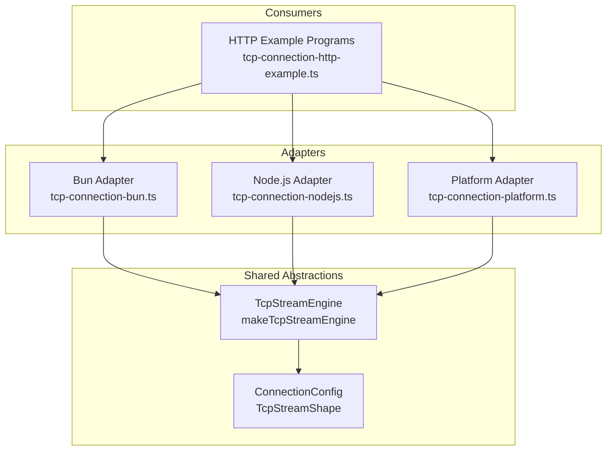
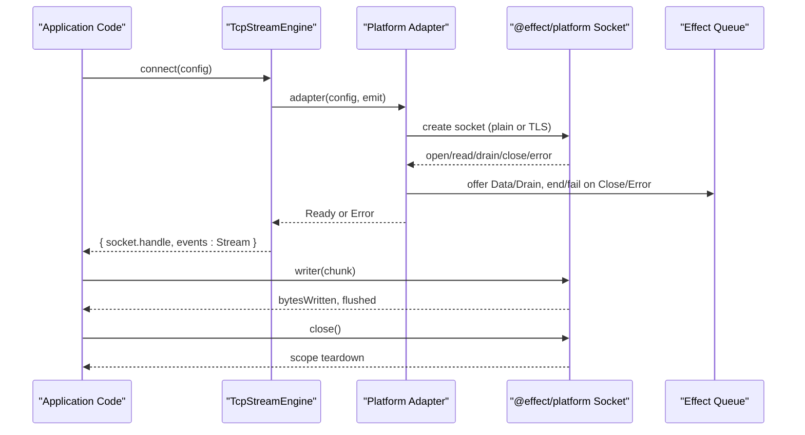
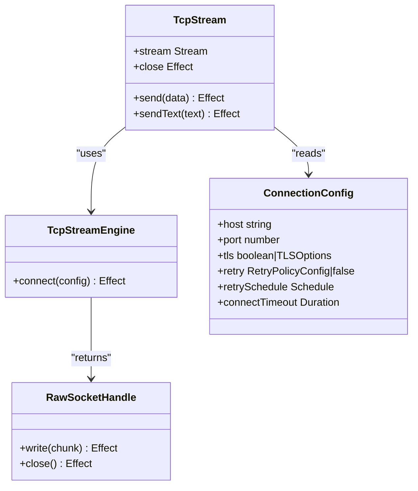
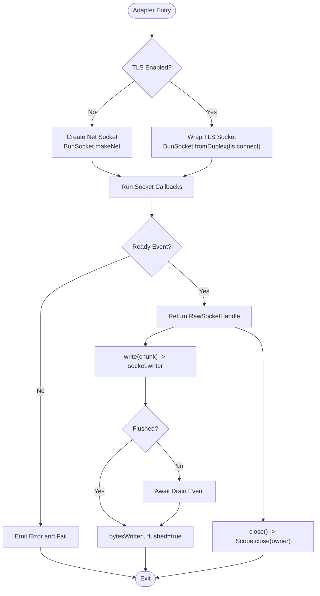
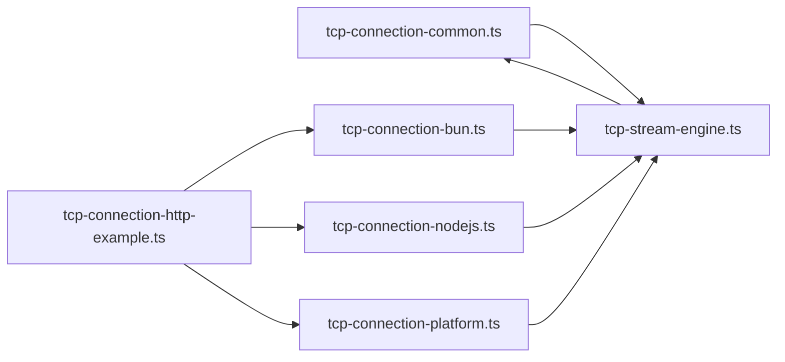

# Effect Platform Adapter Implementation

<cite>
**Referenced Files in This Document**
- [tcp-connection-platform.ts](file://packages/tcp/src/tcp-connection-platform.ts)
- [tcp-stream-engine.ts](file://packages/tcp/src/tcp-stream-engine.ts)
- [tcp-connection-common.ts](file://packages/tcp/src/tcp-connection-common.ts)
- [tcp-connection-bun.ts](file://packages/tcp/src/tcp-connection-bun.ts)
- [tcp-connection-nodejs.ts](file://packages/tcp/src/tcp-connection-nodejs.ts)
- [tcp-connection-http-example.ts](file://packages/tcp/src/tcp-connection-http-example.ts)
- [0003-effect-platform-push-socket-implementation.md](file://docs/adr/0003-effect-platform-push-socket-implementation.md)
- [0005-unified-platform-socket-engine-adapter-and-test-suite.md](file://docs/adr/0005-unified-platform-socket-engine-adapter-and-test-suite.md)
</cite>

## Update Summary
**Changes Made**
- Updated all file path references from root `src/` to `packages/tcp/src/` to reflect the new package structure
- Maintained all architectural and implementation details as they remain functionally unchanged
- Preserved all diagrams and examples with updated file paths

## Table of Contents
1. [Introduction](#introduction)
2. [Project Structure](#project-structure)
3. [Core Components](#core-components)
4. [Architecture Overview](#architecture-overview)
5. [Detailed Component Analysis](#detailed-component-analysis)
6. [Dependency Analysis](#dependency-analysis)
7. [Performance Considerations](#performance-considerations)
8. [Troubleshooting Guide](#troubleshooting-guide)
9. [Conclusion](#conclusion)
10. [Appendices](#appendices)

## Introduction
This document explains the Effect Platform adapter implementation that provides a unified TCP streaming interface across different runtimes using @effect/platform abstractions. It covers how the platform adapter fits into the broader engine abstraction, how runtime selection works at the application boundary, and when to prefer the platform adapter versus direct runtime implementations. The goal is to help you configure and reason about the adapter while understanding its trade-offs compared to Bun or Node.js-specific socket code.

## Project Structure
The repository implements a shared TCP stream orchestrator with three concrete engine adapters:
- Bun-native adapter using Bun.connect
- Node.js adapter using node:net and node:tls
- Platform adapter using @effect/platform's Socket.Socket (BunSocket.makeNet / BunSocket.fromDuplex)

All adapters implement a common engine seam so the same business logic can run on any supported runtime.

**Diagram sources**
- [tcp-stream-engine.ts:88-178](file://packages/tcp/src/tcp-stream-engine.ts#L88-L178)
- [tcp-connection-bun.ts:18-135](file://packages/tcp/src/tcp-connection-bun.ts#L18-L135)
- [tcp-connection-nodejs.ts:21-115](file://packages/tcp/src/tcp-connection-nodejs.ts#L21-L115)
- [tcp-connection-platform.ts:17-125](file://packages/tcp/src/tcp-connection-platform.ts#L17-L125)
- [tcp-connection-http-example.ts:149-269](file://packages/tcp/src/tcp-connection-http-example.ts#L149-L269)

**Section sources**
- [tcp-stream-engine.ts:88-178](file://packages/tcp/src/tcp-stream-engine.ts#L88-L178)
- [tcp-connection-bun.ts:18-135](file://packages/tcp/src/tcp-connection-bun.ts#L18-L135)
- [tcp-connection-nodejs.ts:21-115](file://packages/tcp/src/tcp-connection-nodejs.ts#L21-L115)
- [tcp-connection-platform.ts:17-125](file://packages/tcp/src/tcp-connection-platform.ts#L17-L125)
- [tcp-connection-http-example.ts:149-269](file://packages/tcp/src/tcp-connection-http-example.ts#L149-L269)

## Core Components
- TcpStreamEngine: The core service that exposes connect(config) returning an EstablishedConnection with a RawSocketHandle and a Stream of events.
- RawSocketHandle: The adapter contract for write and close operations, now effectful to support both synchronous kernel writes and asynchronous writers.
- ConnectionConfig: Typed configuration for host, port, TLS options, retry policy, and connect timeout.
- makeConvenienceLayer: Factory that composes a specific engine layer with ConnectionConfig to produce a ready-to-use TcpStream layer.

Key responsibilities:
- Engine adapters implement the ColdAdapter function that emits lifecycle events and returns a RawSocketHandle.
- The shared engine orchestrates connection timeouts, retries, event queuing, and resource cleanup.
- Consumers depend only on TcpStream and never import runtime-specific modules directly.

**Section sources**
- [tcp-stream-engine.ts:28-67](file://packages/tcp/src/tcp-stream-engine.ts#L28-L67)
- [tcp-stream-engine.ts:88-178](file://packages/tcp/src/tcp-stream-engine.ts#L88-L178)
- [tcp-connection-common.ts:18-60](file://packages/tcp/src/tcp-connection-common.ts#L18-L60)
- [tcp-stream-engine.ts:341-359](file://packages/tcp/src/tcp-stream-engine.ts#L341-L359)

## Architecture Overview
The platform adapter integrates via the same engine seam as Bun and Node.js adapters. It uses @effect/platform's push-based Socket.Socket to bridge to the shared orchestrator.

**Diagram sources**
- [tcp-stream-engine.ts:88-178](file://packages/tcp/src/tcp-stream-engine.ts#L88-L178)
- [tcp-connection-platform.ts:17-125](file://packages/tcp/src/tcp-connection-platform.ts#L17-L125)

## Detailed Component Analysis

### Platform Adapter: tcp-connection-platform.ts
Responsibilities:
- Create sockets for plain TCP or TLS using @effect/platform's BunSocket APIs.
- Bridge push-based socket callbacks to the shared engine's event model.
- Provide a RawSocketHandle whose write delegates to the effectful socket.writer and close closes the scoped owner.

Runtime detection and TLS handling:
- Plain TCP: uses BunSocket.makeNet with host and port.
- TLS: wraps Node's tls.connect inside BunSocket.fromDuplex, listening for secureConnect and error events, then resuming the Effect.

Lifecycle and readiness:
- Uses a Deferred to signal when the socket is ready or has errored.
- Emits Ready, Data, Drain, Close, and Error events through the engine's emit callback.
- Ensures child-scoped resources are closed on exit or rejection.

Error mapping:
- Maps underlying socket errors into TcpStreamError with operation tags for consistent error handling upstream.

Exports:
- TcpStreamEnginePlatformLive: provides the engine layer.
- TcpStreamPlatformLive: convenience layer combining engine and config.

**Section sources**
- [tcp-connection-platform.ts:17-125](file://packages/tcp/src/tcp-connection-platform.ts#L17-L125)

### Shared Engine: tcp-stream-engine.ts
Responsibilities:
- Expose connect(config) that builds queues, manages phases (connecting/ready/closed), and handles timeouts.
- Translate adapter events into a Stream of ConnectionEvent and enforce connection readiness before exposing the handle.
- Provide makeTcpStream which adds retry policies, incoming queue bridging, drain coordination, and a high-level TcpStream API (send, sendText, stream, close).
- Offer makeConvenienceLayer to compose engine layers with ConnectionConfig.

Key behaviors:
- Connect timeout enforcement via withConnectTimeout.
- Retry orchestration based on configured schedules.
- Safe teardown with Scoped resources and fiber interruption.

**Section sources**
- [tcp-stream-engine.ts:88-178](file://packages/tcp/src/tcp-stream-engine.ts#L88-L178)
- [tcp-stream-engine.ts:180-195](file://packages/tcp/src/tcp-stream-engine.ts#L180-L195)
- [tcp-stream-engine.ts:201-359](file://packages/tcp/src/tcp-stream-engine.ts#L201-L359)

### Common Types and Config: tcp-connection-common.ts
Responsibilities:
- Define TcpStreamError and ConnectionConfigError types.
- Define TcpStreamShape and TcpStream Service for consumers.
- Define ConnectionConfigShape with host, port, tls, retry, retrySchedule, and connectTimeout.
- Provide validation helpers and default retry schedule builder.

Usage:
- All adapters consume ConnectionConfigShape and validate inputs.
- Consumers depend on TcpStream and never touch engine internals.

**Section sources**
- [tcp-connection-common.ts:12-60](file://packages/tcp/src/tcp-connection-common.ts#L12-L60)
- [tcp-connection-common.ts:62-100](file://packages/tcp/src/tcp-connection-common.ts#L62-L100)

### Runtime Selection and Configuration
Runtime selection is explicit at the program boundary:
- The HTTP example supports selecting bun, nodejs, or platform engines via CLI flags.
- Each engine exports a convenience layer that wires ConnectionConfig to the appropriate engine.
- Application code composes the chosen layer around request programs, keeping business logic runtime-agnostic.

Configuration examples:
- Plain HTTP: provide host, port; no TLS.
- HTTPS: provide host, port, and tls options (e.g., serverName, rejectUnauthorized, ALPNProtocols).
- Retries: configure retry policy or supply a custom Schedule.
- Timeouts: set connectTimeout to bound connection attempts.

When to use the platform adapter:
- Prefer when you want to leverage @effect/platform's Socket abstractions and align with Effect ecosystem patterns.
- Useful for comparative benchmarking against native adapters.
- Good choice if your codebase already depends on @effect/platform and you want a single abstraction surface.

When to prefer direct runtime implementations:
- If you need minimal overhead and direct access to runtime-specific optimizations (Bun.connect or node:net/tls).
- When targeting a known runtime and avoiding extra abstraction layers.

**Section sources**
- [tcp-connection-http-example.ts:49-116](file://packages/tcp/src/tcp-connection-http-example.ts#L49-L116)
- [tcp-connection-http-example.ts:149-170](file://packages/tcp/src/tcp-connection-http-example.ts#L149-L170)
- [tcp-connection-http-example.ts:214-269](file://packages/tcp/src/tcp-connection-http-example.ts#L214-L269)

### Class and Module Relationships

**Diagram sources**
- [tcp-stream-engine.ts:28-67](file://packages/tcp/src/tcp-stream-engine.ts#L28-L67)
- [tcp-stream-engine.ts:201-359](file://packages/tcp/src/tcp-stream-engine.ts#L201-L359)
- [tcp-connection-common.ts:18-60](file://packages/tcp/src/tcp-connection-common.ts#L18-L60)

### Platform Adapter Flowchart

**Diagram sources**
- [tcp-connection-platform.ts:17-125](file://packages/tcp/src/tcp-connection-platform.ts#L17-L125)

## Dependency Analysis
- Adapters depend on the shared engine seam and common types.
- The platform adapter additionally depends on @effect/platform's Socket and Node's tls module for duplex wrapping.
- Consumers depend only on TcpStream and ConnectionConfig, enabling runtime swapping without changing business logic.

**Diagram sources**
- [tcp-stream-engine.ts:88-178](file://packages/tcp/src/tcp-stream-engine.ts#L88-L178)
- [tcp-connection-bun.ts:18-135](file://packages/tcp/src/tcp-connection-bun.ts#L18-L135)
- [tcp-connection-nodejs.ts:21-115](file://packages/tcp/src/tcp-connection-nodejs.ts#L21-L115)
- [tcp-connection-platform.ts:17-125](file://packages/tcp/src/tcp-connection-platform.ts#L17-L125)
- [tcp-connection-http-example.ts:149-269](file://packages/tcp/src/tcp-connection-http-example.ts#L149-L269)

**Section sources**
- [tcp-stream-engine.ts:88-178](file://packages/tcp/src/tcp-stream-engine.ts#L88-L178)
- [tcp-connection-platform.ts:17-125](file://packages/tcp/src/tcp-connection-platform.ts#L17-L125)
- [tcp-connection-http-example.ts:149-269](file://packages/tcp/src/tcp-connection-http-example.ts#L149-L269)

## Performance Considerations
- Direct runtime adapters (Bun, Node.js) call kernel socket APIs directly, minimizing abstraction overhead.
- The platform adapter introduces an additional layer by wrapping Node's tls.connect with BunSocket.fromDuplex and using push-based socket callbacks, which may add slight overhead compared to native wrappers.
- Use the platform adapter when you value ecosystem alignment and uniformity; choose direct adapters when performance-critical paths demand minimal indirection.

[No sources needed since this section provides general guidance]

## Troubleshooting Guide
Common issues and where they are handled:
- Connection failures during setup: mapped to TcpStreamError with operation "connect".
- Errors after connection established: mapped to TcpStreamError with operation "read".
- Remote close: ends the events stream cleanly.
- Interrupted connections: ensure no defects and timely teardown via scoped resources.

Validation and configuration:
- Validate host and port to prevent invalid configurations.
- Configure retry policies to handle transient network issues.
- Set connectTimeout to avoid hanging on slow or unreachable endpoints.

**Section sources**
- [tcp-stream-engine.ts:81-86](file://packages/tcp/src/tcp-stream-engine.ts#L81-L86)
- [tcp-stream-engine.ts:106-138](file://packages/tcp/src/tcp-stream-engine.ts#L106-L138)
- [tcp-connection-common.ts:62-88](file://packages/tcp/src/tcp-connection-common.ts#L62-L88)

## Conclusion
The Effect Platform adapter provides a unified TCP streaming interface that integrates seamlessly with the shared engine seam used by Bun and Node.js adapters. It enables runtime-agnostic code while offering a clear path to swap implementations based on deployment needs. Choose the platform adapter for ecosystem alignment and comparability; choose direct runtime adapters for minimal overhead and tight control.

[No sources needed since this section summarizes without analyzing specific files]

## Appendices

### How to Configure the Platform Adapter
- Provide ConnectionConfig with host, port, and optional TLS options.
- Compose TcpStreamPlatformLive with ConnectionConfig to obtain a TcpStream service.
- Use TcpStream.send/sendText/stream/close for data exchange.
- Optionally configure retry policies and connect timeouts.

Examples of usage patterns:
- Plain HTTP requests: omit TLS options.
- HTTPS requests: include TLS options such as serverName and ALPNProtocols.
- Retry behavior: enable default exponential backoff or supply a custom Schedule.

**Section sources**
- [tcp-connection-http-example.ts:149-170](file://packages/tcp/src/tcp-connection-http-example.ts#L149-L170)
- [tcp-connection-http-example.ts:214-269](file://packages/tcp/src/tcp-connection-http-example.ts#L214-L269)

### Design Decisions and Trade-offs
- Effectful RawSocketHandle allows both synchronous kernel writes and asynchronous writers to coexist under one contract.
- Platform adapter bridges push-based sockets to pull-based streams via queues, maintaining compatibility with existing consumers.
- Using @effect/platform adds abstraction but improves consistency with Effect ecosystem patterns.

**Section sources**
- [0005-unified-platform-socket-engine-adapter-and-test-suite.md:22-76](file://docs/adr/0005-unified-platform-socket-engine-adapter-and-test-suite.md#L22-L76)
- [0003-effect-platform-push-socket-implementation.md:7-56](file://docs/adr/0003-effect-platform-push-socket-implementation.md#L7-L56)