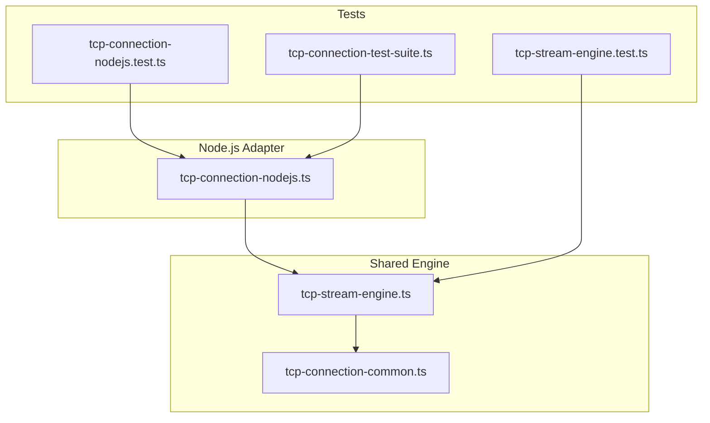
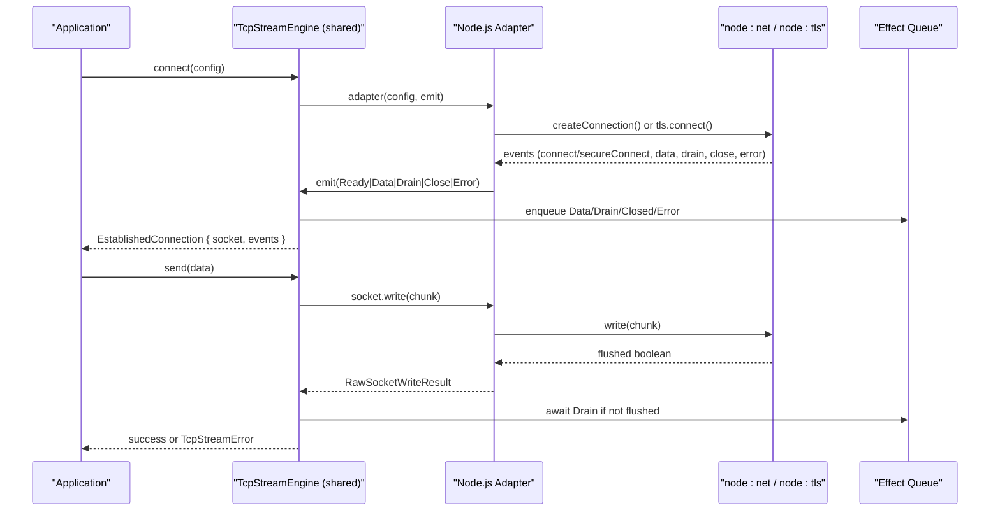
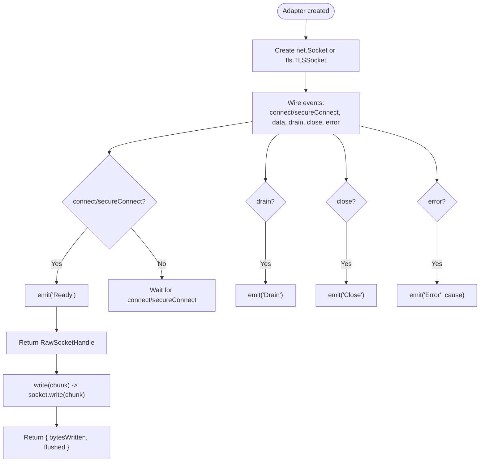
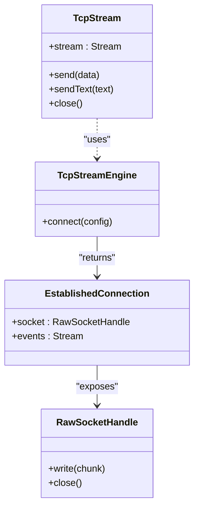
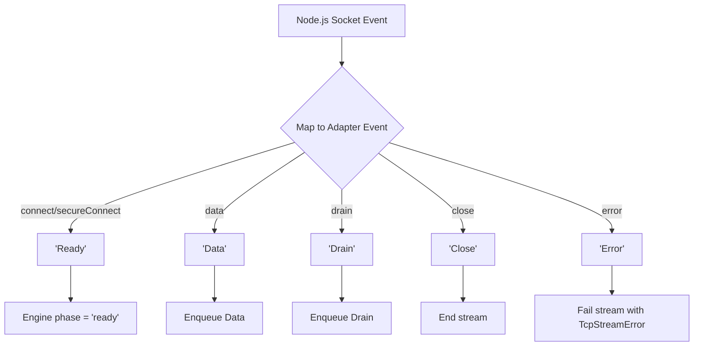
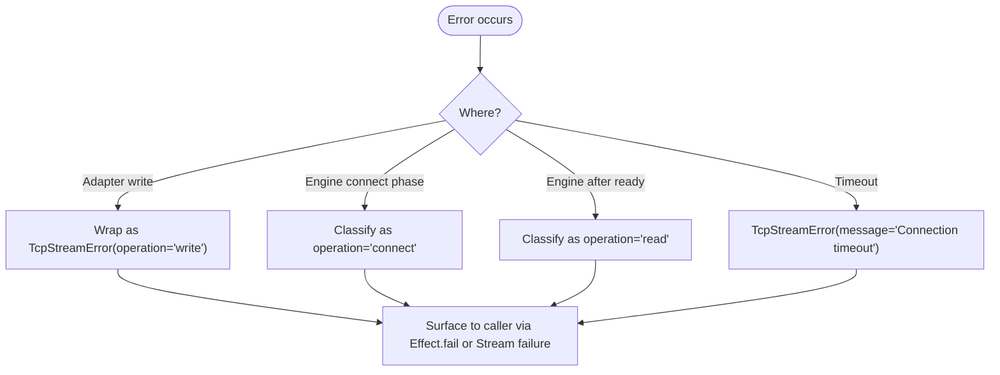
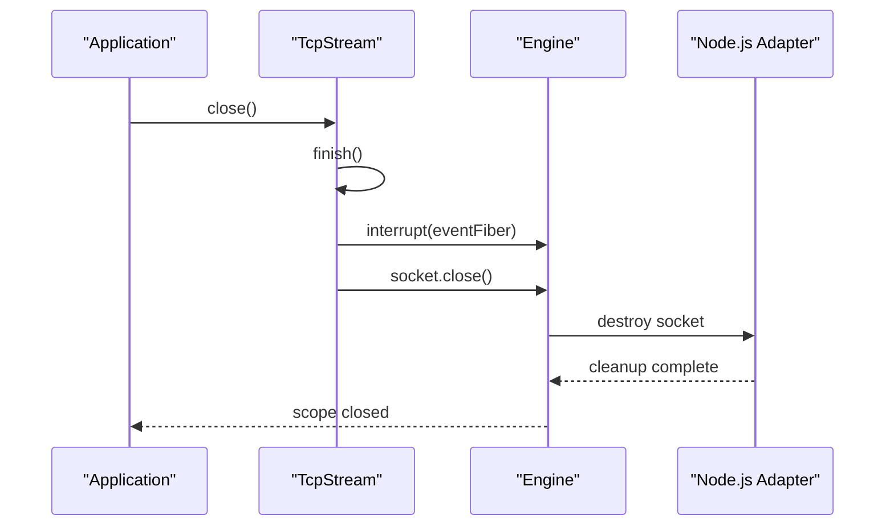
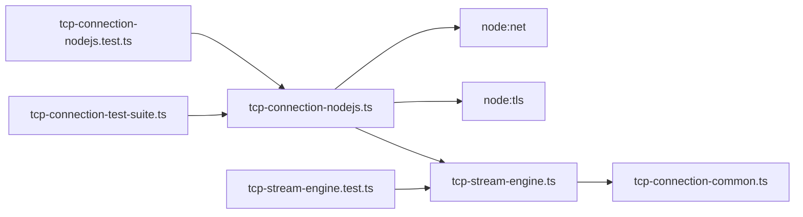

# Node.js Adapter Implementation

<cite>
**Referenced Files in This Document**
- [tcp-connection-nodejs.ts](file://src/tcp-connection-nodejs.ts)
- [tcp-stream-engine.ts](file://src/tcp-stream-engine.ts)
- [tcp-connection-common.ts](file://src/tcp-connection-common.ts)
- [tcp-connection-nodejs.test.ts](file://src/tcp-connection-nodejs.test.ts)
- [tcp-stream-engine.test.ts](file://src/tcp-stream-engine.test.ts)
- [tcp-connection-test-suite.ts](file://src/tcp-connection-test-suite.ts)
- [0001-direct-engine-socket-wrappers.md](file://docs/adr/0001-direct-engine-socket-wrappers.md)
- [0002-unified-tcp-stream-engine-adapter-seam.md](file://docs/adr/0002-unified-tcp-stream-engine-adapter-seam.md)
</cite>

## Table of Contents
1. [Introduction](#introduction)
2. [Project Structure](#project-structure)
3. [Core Components](#core-components)
4. [Architecture Overview](#architecture-overview)
5. [Detailed Component Analysis](#detailed-component-analysis)
6. [Dependency Analysis](#dependency-analysis)
7. [Performance Considerations](#performance-considerations)
8. [Troubleshooting Guide](#troubleshooting-guide)
9. [Conclusion](#conclusion)

## Introduction
This document explains the Node.js adapter implementation that powers TCP and TLS connections for this project. The adapter is a thin, event-driven bridge between Node.js’s built-in `node:net` and `node:tls` modules and a unified Effect-based stream engine. It focuses on:
- Socket creation with plaintext or TLS support
- Event-driven data handling through Node.js socket events
- Backpressure-aware writes using Node.js drain semantics
- Mapping Node.js socket events to a unified adapter interface
- Error handling strategies that integrate with Effect’s error model
- Configuration options including timeouts, retry policies, and TLS settings
- Graceful shutdown procedures scoped to Effect lifecycles

The design intentionally keeps runtime-specific logic minimal in the adapter while centralizing connection orchestration, retries, backpressure synchronization, and streaming in a shared engine layer.

## Project Structure
The Node.js adapter lives alongside a shared engine and common types:
- `src/tcp-connection-nodejs.ts`: Node.js-specific adapter using `node:net` and `node:tls`.
- `src/tcp-stream-engine.ts`: Shared engine that orchestrates connection attempts, queues, retries, and streams.
- `src/tcp-connection-common.ts`: Shared types, configuration, validation, and error definitions.
- Tests validate behavior across engines and scenarios.

**Diagram sources**
- [tcp-connection-nodejs.ts:1-132](file://src/tcp-connection-nodejs.ts#L1-L132)
- [tcp-stream-engine.ts:1-359](file://src/tcp-stream-engine.ts#L1-L359)
- [tcp-connection-common.ts:1-101](file://src/tcp-connection-common.ts#L1-L101)
- [tcp-connection-nodejs.test.ts:1-12](file://src/tcp-connection-nodejs.test.ts#L1-L12)
- [tcp-connection-test-suite.ts:1-800](file://src/tcp-connection-test-suite.ts#L1-L800)
- [tcp-stream-engine.test.ts:1-214](file://src/tcp-stream-engine.test.ts#L1-L214)

**Section sources**
- [tcp-connection-nodejs.ts:1-132](file://src/tcp-connection-nodejs.ts#L1-L132)
- [tcp-stream-engine.ts:1-359](file://src/tcp-stream-engine.ts#L1-L359)
- [tcp-connection-common.ts:1-101](file://src/tcp-connection-common.ts#L1-L101)
- [tcp-connection-nodejs.test.ts:1-12](file://src/tcp-connection-nodejs.test.ts#L1-L12)
- [tcp-stream-engine.test.ts:1-214](file://src/tcp-stream-engine.test.ts#L1-L214)
- [tcp-connection-test-suite.ts:1-800](file://src/tcp-connection-test-suite.ts#L1-L800)

## Core Components
- Node.js adapter (`tcp-connection-nodejs.ts`): Creates `net.Socket` or `tls.TLSSocket`, wires events (`data`, `drain`, `close`, `error`, `connect`/`secureConnect`), and exposes a `RawSocketHandle` with `write` and `close`.
- Unified engine (`tcp-stream-engine.ts`): Builds a caller-first connection API, manages an unbounded queue for incoming data, synchronizes write backpressure via drain events, enforces connect timeouts, and provides a `TcpStream` service with `stream`, `send`, `sendText`, and `close`.
- Common types (`tcp-connection-common.ts`): Defines `ConnectionConfigShape`, `TcpStreamError`, `TcpStreamShape`, retry policy configuration, and helpers like `unknownToMessage` and `buildDefaultRetrySchedule`.

Key responsibilities:
- Adapter: Map Node.js sockets to the engine’s cold adapter protocol.
- Engine: Orchestrate retries, timeouts, backpressure, and lifecycle.
- Common: Provide shared contracts and utilities.

**Section sources**
- [tcp-connection-nodejs.ts:20-118](file://src/tcp-connection-nodejs.ts#L20-L118)
- [tcp-stream-engine.ts:28-79](file://src/tcp-stream-engine.ts#L28-L79)
- [tcp-stream-engine.ts:89-178](file://src/tcp-stream-engine.ts#L89-L178)
- [tcp-stream-engine.ts:201-339](file://src/tcp-stream-engine.ts#L201-L339)
- [tcp-connection-common.ts:18-52](file://src/tcp-connection-common.ts#L18-L52)
- [tcp-connection-common.ts:62-100](file://src/tcp-connection-common.ts#L62-L100)

## Architecture Overview
The Node.js adapter implements a cold adapter function consumed by the shared engine. The engine coordinates:
- Attempting connection with optional retry and timeout
- Emitting adapter events (`Ready`, `Data`, `Drain`, `Close`, `Error`)
- Exposing a stable `EstablishedConnection` with a `RawSocketHandle` and an event stream
- Building a high-level `TcpStream` service with backpressure-aware writes

**Diagram sources**
- [tcp-stream-engine.ts:89-178](file://src/tcp-stream-engine.ts#L89-L178)
- [tcp-stream-engine.ts:201-339](file://src/tcp-stream-engine.ts#L201-L339)
- [tcp-connection-nodejs.ts:20-118](file://src/tcp-connection-nodejs.ts#L20-L118)

## Detailed Component Analysis

### Node.js Adapter: Socket Creation and Event Wiring
The adapter creates either a plain TCP socket or a TLS socket based on configuration:
- Plain TCP: `net.createConnection({ host, port })`
- TLS: `tls.connect({ ...tlsOptions, host, port })`

It wires the following Node.js socket events:
- `connect` or `secureConnect`: Signals readiness; emits `Ready` to the engine
- `data`: Emits `Data` with a copy of the chunk as `Uint8Array`
- `drain`: Emits `Drain` to signal backpressure relief
- `close`: Emits `Close` to terminate the session
- `error`: Emits `Error` with the underlying cause

The adapter returns a `RawSocketHandle` exposing:
- `write(chunk)`: Calls `socket.write(chunk)` and returns `{ bytesWritten, flushed }` wrapped in Effect
- `close()`: Destroys the socket safely

**Diagram sources**
- [tcp-connection-nodejs.ts:74-104](file://src/tcp-connection-nodejs.ts#L74-L104)
- [tcp-connection-nodejs.ts:43-69](file://src/tcp-connection-nodejs.ts#L43-L69)

**Section sources**
- [tcp-connection-nodejs.ts:20-118](file://src/tcp-connection-nodejs.ts#L20-L118)

### Unified Engine: Connection Lifecycle and Backpressure
The shared engine builds a caller-first API:
- `makeTcpStreamEngine(adapter)`: Returns a shape with `connect(config)`
- `connect(config)`:
  - Creates an unbounded queue for events
  - Manages phases: connecting → ready → closed
  - Wraps adapter execution with a connect timeout
  - On success, returns an `EstablishedConnection` with:
    - `socket: RawSocketHandle`
    - `events: Stream.Stream<ConnectionEvent, TcpStreamError>`
- `makeTcpStream`:
  - Validates configuration
  - Optionally retries connection attempts
  - Starts a background fiber to forward events from the engine to a consumer-facing queue
  - Implements backpressure-aware `send` using semaphore serialization and drain waiters
  - Provides `sendText`, `stream`, and `close`

Backpressure handling:
- If `flushed` is false, the engine awaits a `Drain` event before continuing writes
- A deferred waiter is stored per pending write and resolved on `Drain`
- Writes are serialized with a semaphore to avoid interleaving

Timeouts and retries:
- Connect timeout enforced via `withConnectTimeout`
- Retry schedule configurable via `ConnectionConfigShape.retry` or custom `retrySchedule`

Graceful shutdown:
- Closing the connection ends the event stream and closes the underlying socket
- Interrupts are handled cleanly without leaking resources

**Diagram sources**
- [tcp-stream-engine.ts:28-79](file://src/tcp-stream-engine.ts#L28-L79)
- [tcp-stream-engine.ts:89-178](file://src/tcp-stream-engine.ts#L89-L178)
- [tcp-stream-engine.ts:201-339](file://src/tcp-stream-engine.ts#L201-L339)

**Section sources**
- [tcp-stream-engine.ts:89-178](file://src/tcp-stream-engine.ts#L89-L178)
- [tcp-stream-engine.ts:180-195](file://src/tcp-stream-engine.ts#L180-L195)
- [tcp-stream-engine.ts:201-339](file://src/tcp-stream-engine.ts#L201-L339)

### Event Mapping: Node.js Socket Events to Unified Interface
Node.js socket events map to the engine’s adapter events:
- `connect`/`secureConnect` → `Ready`
- `data` → `Data`
- `drain` → `Drain`
- `close` → `Close`
- `error` → `Error`

The engine then translates these into:
- `Stream` events for consumers
- Internal state transitions and queue operations
- Typed `TcpStreamError` instances for failures

**Diagram sources**
- [tcp-connection-nodejs.ts:84-101](file://src/tcp-connection-nodejs.ts#L84-L101)
- [tcp-stream-engine.ts:106-138](file://src/tcp-stream-engine.ts#L106-L138)

**Section sources**
- [tcp-connection-nodejs.ts:84-101](file://src/tcp-connection-nodejs.ts#L84-L101)
- [tcp-stream-engine.ts:106-138](file://src/tcp-stream-engine.ts#L106-L138)

### Error Handling Strategies
Error handling integrates with Effect’s typed errors:
- `TcpStreamError` wraps operation, message, and cause
- Adapter catches socket write errors and converts them to `TcpStreamError`
- Engine classifies failures:
  - During connection phase: operation `"connect"`
  - After readiness: operation `"read"`
- Connect timeout produces a `TcpStreamError` with a clear message
- Remote close ends the stream cleanly without failing unless there is an actual read/write failure

**Diagram sources**
- [tcp-connection-nodejs.ts:49-60](file://src/tcp-connection-nodejs.ts#L49-L60)
- [tcp-stream-engine.ts:81-86](file://src/tcp-stream-engine.ts#L81-L86)
- [tcp-stream-engine.ts:125-136](file://src/tcp-stream-engine.ts#L125-L136)
- [tcp-stream-engine.ts:180-195](file://src/tcp-stream-engine.ts#L180-L195)

**Section sources**
- [tcp-connection-nodejs.ts:49-60](file://src/tcp-connection-nodejs.ts#L49-L60)
- [tcp-stream-engine.ts:81-86](file://src/tcp-stream-engine.ts#L81-L86)
- [tcp-stream-engine.ts:125-136](file://src/tcp-stream-engine.ts#L125-L136)
- [tcp-stream-engine.ts:180-195](file://src/tcp-stream-engine.ts#L180-L195)

### Configuration Options and Examples
Configuration flows through `ConnectionConfigShape` and is validated before use:
- `host`: string
- `port`: number (validated range)
- `tls`: boolean or TLS options object (Node.js `tls.ConnectionOptions` supported)
- `retry`: boolean or retry policy config; can be disabled
- `retrySchedule`: custom Effect Schedule
- `connectTimeout`: duration input

Examples:
- Disable retries: set `retry: false`
- Custom retry policy: provide `initialDelay`, `factor`, `maxAttempts`, `jitter`, `maxDuration`
- TLS client with self-signed server: set `tls: { rejectUnauthorized: false }`
- Connect timeout: set `connectTimeout` to a duration string

These configurations are used by:
- The engine to build `TcpStreamEngineConfig`
- The adapter to choose TLS vs plaintext and pass TLS options to `tls.connect`

**Section sources**
- [tcp-connection-common.ts:45-52](file://src/tcp-connection-common.ts#L45-L52)
- [tcp-connection-common.ts:85-88](file://src/tcp-connection-common.ts#L85-L88)
- [tcp-connection-common.ts:90-100](file://src/tcp-connection-common.ts#L90-L100)
- [tcp-stream-engine.ts:244-257](file://src/tcp-stream-engine.ts#L244-L257)
- [tcp-connection-nodejs.ts:74-83](file://src/tcp-connection-nodejs.ts#L74-L83)

### Backpressure Handling and HighWaterMark
Backpressure is managed at two levels:
- Node.js socket level: The adapter listens for the `drain` event and emits it to the engine when the kernel buffer has room
- Engine level: The engine waits for `Drain` if `flushed` is false before continuing writes

HighWaterMark specifics:
- The adapter does not explicitly configure `highWaterMark`; it relies on Node.js defaults
- Applications requiring fine-grained control over buffering should consider:
  - Using smaller payloads to reduce internal buffering
  - Tuning application-level batching around drain events
  - Monitoring throughput and memory usage under load

Note: The current adapter does not expose a direct option to set `highWaterMark` on the underlying socket. If you need explicit control, extend the adapter to accept and apply socket options during creation.

**Section sources**
- [tcp-connection-nodejs.ts:94-96](file://src/tcp-connection-nodejs.ts#L94-L96)
- [tcp-stream-engine.ts:300-332](file://src/tcp-stream-engine.ts#L300-L332)

### Graceful Shutdown Procedures
Graceful shutdown is integrated with Effect’s scoping:
- `TcpStream.close`:
  - Marks the connection as closed
  - Interrupts the event forwarding fiber
  - Closes the underlying socket handle
- Engine ensures:
  - The event stream ends cleanly on remote close
  - Multiple calls to `close` are idempotent
  - Interruption during connect or retry exits promptly without defects

**Diagram sources**
- [tcp-stream-engine.ts:295-299](file://src/tcp-stream-engine.ts#L295-L299)
- [tcp-stream-engine.ts:159-176](file://src/tcp-stream-engine.ts#L159-L176)
- [tcp-connection-nodejs.ts:30-35](file://src/tcp-connection-nodejs.ts#L30-L35)

**Section sources**
- [tcp-stream-engine.ts:295-299](file://src/tcp-stream-engine.ts#L295-L299)
- [tcp-stream-engine.ts:159-176](file://src/tcp-stream-engine.ts#L159-L176)
- [tcp-connection-nodejs.ts:30-35](file://src/tcp-connection-nodejs.ts#L30-L35)

### Custom Socket Options and Timeouts
Customization points:
- TLS options: Pass `tls: tls.ConnectionOptions` to enable TLS and configure handshake behavior
- Connect timeout: Set `connectTimeout` to enforce a maximum time for establishing a connection
- Retry policy: Configure exponential backoff with jitter or supply a custom `retrySchedule`

Example patterns:
- TLS client against a local self-signed server:
  - Set `tls: { rejectUnauthorized: false }`
- Short connect timeout for fast failures:
  - Set `connectTimeout: "1 second"`
- Custom retry schedule:
  - Use `Schedule.recurs(n)` or other Effect schedules

These options are validated and forwarded appropriately by the engine and adapter.

**Section sources**
- [tcp-connection-common.ts:45-52](file://src/tcp-connection-common.ts#L45-L52)
- [tcp-stream-engine.ts:180-195](file://src/tcp-stream-engine.ts#L180-L195)
- [tcp-connection-nodejs.ts:74-83](file://src/tcp-connection-nodejs.ts#L74-L83)

## Dependency Analysis
The Node.js adapter depends on:
- `node:net` and `node:tls` for socket creation and TLS
- Effect primitives for callbacks, layers, and streams
- The shared engine for orchestration
- Common types for configuration and errors

**Diagram sources**
- [tcp-connection-nodejs.ts:1-18](file://src/tcp-connection-nodejs.ts#L1-L18)
- [tcp-stream-engine.ts:1-24](file://src/tcp-stream-engine.ts#L1-L24)
- [tcp-connection-common.ts:1-10](file://src/tcp-connection-common.ts#L1-L10)
- [tcp-connection-nodejs.test.ts:1-12](file://src/tcp-connection-nodejs.test.ts#L1-L12)
- [tcp-connection-test-suite.ts:1-22](file://src/tcp-connection-test-suite.ts#L1-L22)
- [tcp-stream-engine.test.ts:1-14](file://src/tcp-stream-engine.test.ts#L1-L14)

**Section sources**
- [tcp-connection-nodejs.ts:1-18](file://src/tcp-connection-nodejs.ts#L1-L18)
- [tcp-stream-engine.ts:1-24](file://src/tcp-stream-engine.ts#L1-L24)
- [tcp-connection-common.ts:1-10](file://src/tcp-connection-common.ts#L1-L10)

## Performance Considerations
- Event-driven architecture minimizes overhead by leveraging Node.js socket events
- Backpressure is synchronized via drain events to prevent unbounded memory growth
- Unbounded queues are used internally; applications should consume streams promptly to avoid backlog
- Retries use exponential backoff with jitter by default; tune `retry` or provide a custom schedule for specific workloads
- Avoid large single writes; batch data thoughtfully and rely on drain events to pace output

[No sources needed since this section provides general guidance]

## Troubleshooting Guide
Common issues and resolutions:
- Connection timeout:
  - Increase `connectTimeout` or ensure the server is reachable
- TLS handshake failures:
  - Verify certificate configuration; for testing, set `rejectUnauthorized: false`
- Immediate remote close:
  - Ensure the consumer drains the stream; check for early termination in the server
- Hanging writes:
  - Confirm drain events are being processed; verify that the consumer is not blocking the event loop
- Resource leaks:
  - Always call `close()` or rely on Effect scoping to tear down connections

Validation and tests cover:
- Clean failures without defects
- Retry behavior and recovery
- TLS positive and negative paths
- Graceful client-side close

**Section sources**
- [tcp-stream-engine.test.ts:126-149](file://src/tcp-stream-engine.test.ts#L126-L149)
- [tcp-connection-test-suite.ts:447-579](file://src/tcp-connection-test-suite.ts#L447-L579)
- [tcp-connection-test-suite.ts:581-623](file://src/tcp-connection-test-suite.ts#L581-L623)
- [tcp-connection-test-suite.ts:625-671](file://src/tcp-connection-test-suite.ts#L625-L671)
- [tcp-connection-test-suite.ts:673-722](file://src/tcp-connection-test-suite.ts#L673-L722)

## Conclusion
The Node.js adapter provides a concise, event-driven bridge between Node.js sockets and a robust, shared Effect-based stream engine. It emphasizes:
- Clear separation of concerns: adapters focus on platform mapping; the engine handles orchestration
- Reliable backpressure handling via drain events
- Comprehensive error modeling with `TcpStreamError`
- Configurable timeouts, retries, and TLS options
- Graceful shutdown integrated with Effect scopes

This design enables consistent TCP/TLS behavior across runtimes while preserving low-level control where needed.

[No sources needed since this section summarizes without analyzing specific files]