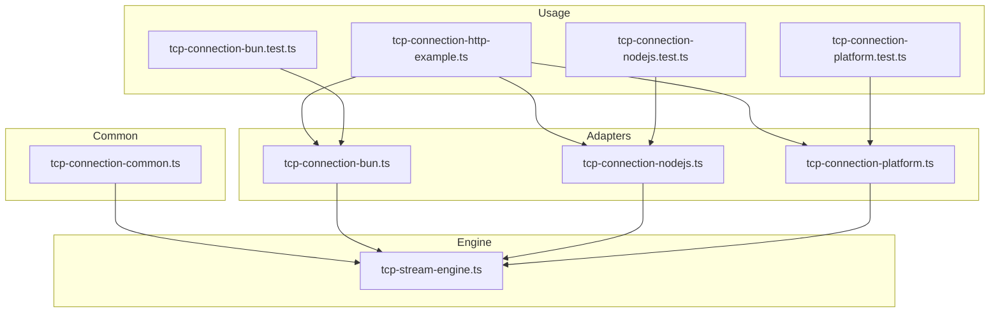
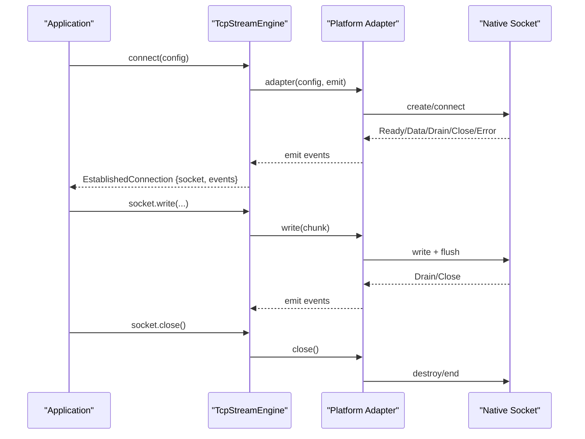
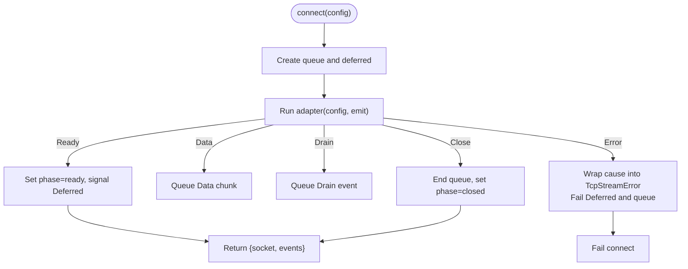
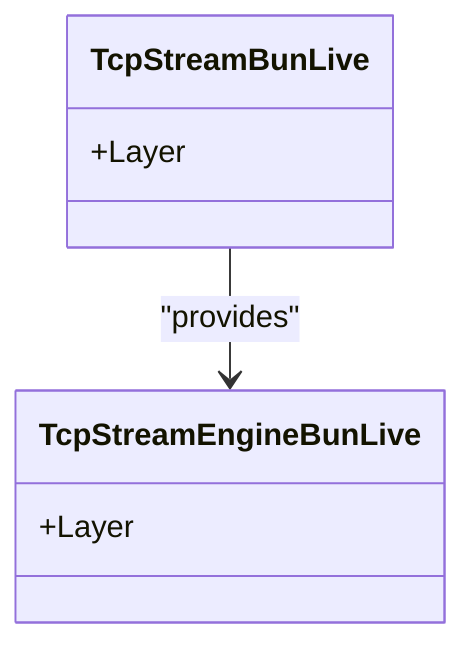
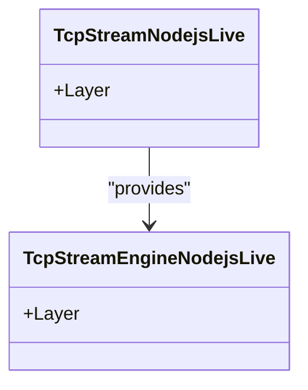
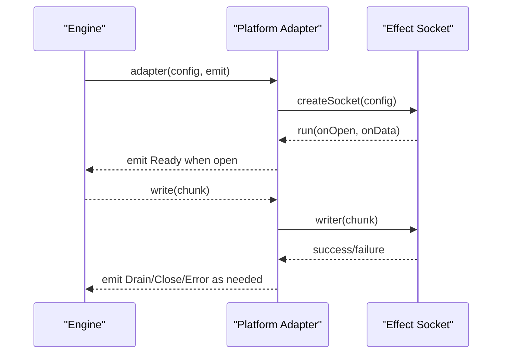
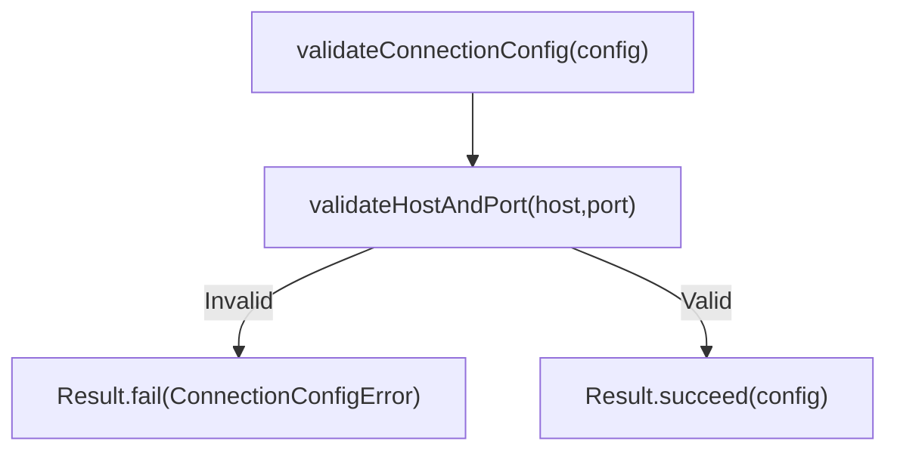
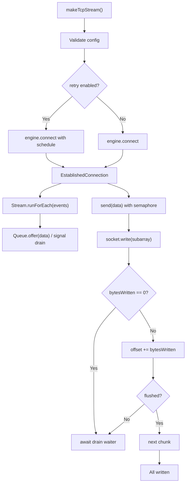
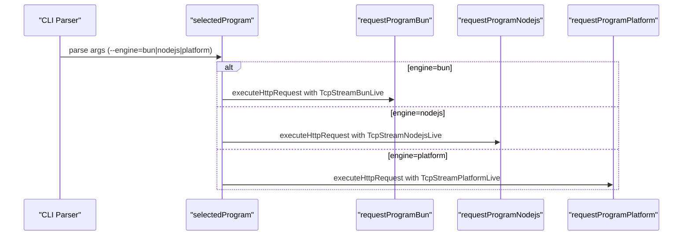
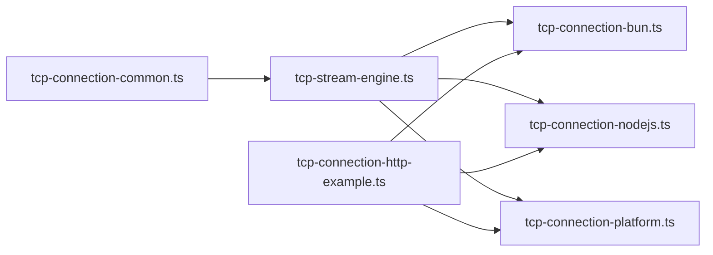

# Platform Implementations

<cite>
**Referenced Files in This Document**
- [tcp-connection-bun.ts](file://src/tcp-connection-bun.ts)
- [tcp-connection-nodejs.ts](file://src/tcp-connection-nodejs.ts)
- [tcp-connection-platform.ts](file://src/tcp-connection-platform.ts)
- [tcp-stream-engine.ts](file://src/tcp-stream-engine.ts)
- [tcp-connection-common.ts](file://src/tcp-connection-common.ts)
- [tcp-connection-http-example.ts](file://src/tcp-connection-http-example.ts)
- [tcp-connection-bun.test.ts](file://src/tcp-connection-bun.test.ts)
- [tcp-connection-nodejs.test.ts](file://src/tcp-connection-nodejs.test.ts)
- [tcp-connection-platform.test.ts](file://src/tcp-connection-platform.test.ts)
</cite>

## Table of Contents
1. [Introduction](#introduction)
2. [Project Structure](#project-structure)
3. [Core Components](#core-components)
4. [Architecture Overview](#architecture-overview)
5. [Detailed Component Analysis](#detailed-component-analysis)
6. [Dependency Analysis](#dependency-analysis)
7. [Performance Considerations](#performance-considerations)
8. [Troubleshooting Guide](#troubleshooting-guide)
9. [Conclusion](#conclusion)
10. [Appendices](#appendices)

## Introduction
This document explains the cross-platform TCP socket abstractions implemented for Bun, Node.js, and Effect Platform runtimes. The design uses a strategy pattern to provide a unified API over three different underlying implementations while preserving platform-specific characteristics. It covers:
- The shared contract and validation logic
- Each platform adapter’s implementation details, unique traits, and limitations
- How the engine is selected at runtime via Effect layers
- Performance considerations and platform-specific optimizations
- Practical examples for choosing and configuring the appropriate implementation per deployment scenario

## Project Structure
The TCP stack is organized around a common interface and three platform adapters:
- Common module defines shared types, errors, configuration, and validation utilities
- Stream engine builds a caller-friendly connection abstraction on top of a cold adapter protocol
- Platform adapters implement the cold adapter using native or platform APIs
- Tests validate behavior uniformly across all platforms
- Example program demonstrates runtime selection via CLI flags

**Diagram sources**
- [tcp-connection-common.ts:12-101](file://src/tcp-connection-common.ts#L12-L101)
- [tcp-stream-engine.ts:64-178](file://src/tcp-stream-engine.ts#L64-L178)
- [tcp-connection-bun.ts:18-138](file://src/tcp-connection-bun.ts#L18-L138)
- [tcp-connection-nodejs.ts:21-121](file://src/tcp-connection-nodejs.ts#L21-L121)
- [tcp-connection-platform.ts:17-129](file://src/tcp-connection-platform.ts#L17-L129)
- [tcp-connection-http-example.ts:146-269](file://src/tcp-connection-http-example.ts#L146-L269)

**Section sources**
- [tcp-connection-common.ts:12-101](file://src/tcp-connection-common.ts#L12-L101)
- [tcp-stream-engine.ts:64-178](file://src/tcp-stream-engine.ts#L64-L178)
- [tcp-connection-bun.ts:18-138](file://src/tcp-connection-bun.ts#L18-L138)
- [tcp-connection-nodejs.ts:21-121](file://src/tcp-connection-nodejs.ts#L21-L121)
- [tcp-connection-platform.ts:17-129](file://src/tcp-connection-platform.ts#L17-L129)
- [tcp-connection-http-example.ts:146-269](file://src/tcp-connection-http-example.ts#L146-L269)

## Core Components
- Shared types and services:
  - TcpStreamShape and TcpStream service define the public API consumers use (stream, send, sendText, close).
  - ConnectionConfigShape describes host, port, optional TLS options, retry policy, and connect timeout.
  - Validation helpers ensure host and port are valid and build default retry schedules.
- Engine:
  - TcpStreamEngine provides connect(config) that returns an EstablishedConnection with a RawSocketHandle and a Stream of events.
  - makeTcpStream composes retries, timeouts, backpressure, and drain handling into a high-level TcpStream layer.
- Adapters:
  - Each platform exports a Layer providing TcpStreamEngine and convenience layers for TcpStream.

Key responsibilities:
- tcp-connection-common.ts: error types, config shape, validation, retry schedule builder
- tcp-stream-engine.ts: cold adapter protocol, event queue, timeouts, retries, high-level stream
- Platform modules: implement cold adapter using platform-native APIs

**Section sources**
- [tcp-connection-common.ts:12-101](file://src/tcp-connection-common.ts#L12-L101)
- [tcp-stream-engine.ts:28-67](file://src/tcp-stream-engine.ts#L28-L67)
- [tcp-stream-engine.ts:201-359](file://src/tcp-stream-engine.ts#L201-L359)

## Architecture Overview
The system follows a strategy pattern:
- A cold adapter function creates a raw socket handle and emits lifecycle events
- The engine orchestrates connection attempts, timeouts, retries, and event flow
- Platform adapters plug in their native socket implementation behind the same interface

**Diagram sources**
- [tcp-stream-engine.ts:89-178](file://src/tcp-stream-engine.ts#L89-L178)
- [tcp-connection-bun.ts:18-138](file://src/tcp-connection-bun.ts#L18-L138)
- [tcp-connection-nodejs.ts:21-121](file://src/tcp-connection-nodejs.ts#L21-L121)
- [tcp-connection-platform.ts:17-129](file://src/tcp-connection-platform.ts#L17-L129)

## Detailed Component Analysis

### Strategy Pattern and Cold Adapter Protocol
- Cold adapter signature: takes config and an emit callback; returns an Effect producing a RawSocketHandle and cleanup
- Events emitted include Ready, Data, Drain, Close, Error
- Engine manages state machine (connecting -> ready -> closed), queues events, enforces connect timeout, and wraps failures into TcpStreamError

**Diagram sources**
- [tcp-stream-engine.ts:89-178](file://src/tcp-stream-engine.ts#L89-L178)

**Section sources**
- [tcp-stream-engine.ts:69-178](file://src/tcp-stream-engine.ts#L69-L178)

### Bun Adapter
Characteristics:
- Uses Bun.connect with binaryType set to uint8array
- Emits Data by slicing incoming chunks to avoid sharing buffers
- On write, calls flush to ensure data is sent; reports flushed based on bytesWritten vs chunk length
- Handles terminate/end fallbacks for robust teardown
- Exposes TcpStreamBunLive and TcpStreamEngineBunLive layers

Limitations:
- Relies on Bun-specific APIs; not portable outside Bun
- Write result semantics depend on Bun’s socket behavior

**Diagram sources**
- [tcp-connection-bun.ts:133-138](file://src/tcp-connection-bun.ts#L133-L138)

**Section sources**
- [tcp-connection-bun.ts:18-138](file://src/tcp-connection-bun.ts#L18-L138)

### Node.js Adapter
Characteristics:
- Uses node:net and node:tls to create connections
- Supports both plaintext and TLS via conditional connect
- Normalizes string chunks to Uint8Array
- Emits Drain and Close events; handles secureConnect vs connect depending on TLS
- Exposes TcpStreamNodejsLive and TcpStreamEngineNodejsLive layers

Limitations:
- Requires Node.js standard library; not available in other runtimes without polyfills
- Write result semantics reflect Node’s net/tls behavior

**Diagram sources**
- [tcp-connection-nodejs.ts:114-121](file://src/tcp-connection-nodejs.ts#L114-L121)

**Section sources**
- [tcp-connection-nodejs.ts:21-121](file://src/tcp-connection-nodejs.ts#L21-L121)

### Effect Platform Adapter
Characteristics:
- Leverages @effect/platform-bun’s BunSocket and effect/unstable/socket/Socket
- For non-TLS: uses BunSocket.makeNet
- For TLS: constructs tls.TLSSocket and wraps it via BunSocket.fromDuplex
- Uses scoped execution with Scope.fork and Deferred to manage readiness and lifecycle
- Writer-based model ensures backpressure and clean shutdown

Limitations:
- Depends on Effect Platform’s unstable socket APIs
- TLS path requires proper handshake completion before writer becomes usable

**Diagram sources**
- [tcp-connection-platform.ts:17-119](file://src/tcp-connection-platform.ts#L17-L119)

**Section sources**
- [tcp-connection-platform.ts:17-129](file://src/tcp-connection-platform.ts#L17-L129)

### Shared Types and Validation Logic
- Errors:
  - ConnectionConfigError for invalid configuration
  - TcpStreamError with operation context (connect/read/write)
- Configuration:
  - ConnectionConfigShape includes host, port, optional TLS, retry policy, and connectTimeout
- Validation:
  - validateHostAndPort checks port range and non-empty host
  - validateConnectionConfig delegates to host/port validation
  - buildDefaultRetrySchedule creates exponential backoff with jitter and limits

**Diagram sources**
- [tcp-connection-common.ts:62-88](file://src/tcp-connection-common.ts#L62-L88)

**Section sources**
- [tcp-connection-common.ts:12-101](file://src/tcp-connection-common.ts#L12-L101)

### High-Level Stream and Backpressure
- makeTcpStream composes:
  - Retry policy from ConnectionConfig (custom or default)
  - Connect timeout enforcement
  - Event loop that pushes data into a queue and signals drains
  - Semaphore-protected writes to serialize and honor backpressure
  - Graceful close and interruption-safe cleanup

**Diagram sources**
- [tcp-stream-engine.ts:201-339](file://src/tcp-stream-engine.ts#L201-L339)

**Section sources**
- [tcp-stream-engine.ts:201-339](file://src/tcp-stream-engine.ts#L201-L339)

### Platform Selection Mechanism
- No automatic runtime detection is performed in code; selection is explicit via Effect layers
- Tests demonstrate selecting a specific engine by providing its layer factory
- Example program parses CLI arguments to choose among bun, nodejs, or platform engines and wires the corresponding layer

**Diagram sources**
- [tcp-connection-http-example.ts:49-116](file://src/tcp-connection-http-example.ts#L49-L116)
- [tcp-connection-http-example.ts:259-269](file://src/tcp-connection-http-example.ts#L259-L269)

**Section sources**
- [tcp-connection-bun.test.ts:1-12](file://src/tcp-connection-bun.test.ts#L1-L12)
- [tcp-connection-nodejs.test.ts:1-12](file://src/tcp-connection-nodejs.test.ts#L1-L12)
- [tcp-connection-platform.test.ts:1-12](file://src/tcp-connection-platform.test.ts#L1-L12)
- [tcp-connection-http-example.ts:49-116](file://src/tcp-connection-http-example.ts#L49-L116)
- [tcp-connection-http-example.ts:259-269](file://src/tcp-connection-http-example.ts#L259-L269)

## Dependency Analysis
- All adapters depend on:
  - tcp-stream-engine.ts for the engine and shared types
  - tcp-connection-common.ts for configuration and validation
- The example program depends on all three adapters to demonstrate runtime selection
- Tests depend on each adapter to validate behavior uniformly

**Diagram sources**
- [tcp-connection-common.ts:12-101](file://src/tcp-connection-common.ts#L12-L101)
- [tcp-stream-engine.ts:64-178](file://src/tcp-stream-engine.ts#L64-L178)
- [tcp-connection-bun.ts:1-16](file://src/tcp-connection-bun.ts#L1-L16)
- [tcp-connection-nodejs.ts:1-18](file://src/tcp-connection-nodejs.ts#L1-L18)
- [tcp-connection-platform.ts:1-15](file://src/tcp-connection-platform.ts#L1-L15)
- [tcp-connection-http-example.ts:1-10](file://src/tcp-connection-http-example.ts#L1-L10)

**Section sources**
- [tcp-connection-bun.ts:1-16](file://src/tcp-connection-bun.ts#L1-L16)
- [tcp-connection-nodejs.ts:1-18](file://src/tcp-connection-nodejs.ts#L1-L18)
- [tcp-connection-platform.ts:1-15](file://src/tcp-connection-platform.ts#L1-L15)
- [tcp-connection-http-example.ts:1-10](file://src/tcp-connection-http-example.ts#L1-L10)

## Performance Considerations
- Bun adapter:
  - Binary mode with uint8array reduces encoding overhead
  - Explicit flush after write can reduce latency but may increase syscall frequency
- Node.js adapter:
  - Uses native net/tls; string-to-buffer conversion handled internally
  - Drain signaling allows efficient backpressure handling
- Platform adapter:
  - Writer-based model integrates with Effect’s backpressure primitives
  - Scoped lifecycles minimize resource leaks and improve cleanup performance
- Engine-wide:
  - Connect timeout prevents hanging connections
  - Retry policies with jitter reduce thundering herd effects
  - Semaphore-protected sends serialize writes to avoid interleaving and respect backpressure

[No sources needed since this section provides general guidance]

## Troubleshooting Guide
Common issues and where they surface:
- Invalid configuration:
  - Host empty or port out of range triggers ConnectionConfigError during validation
- Connection failures:
  - Network errors wrapped into TcpStreamError with operation "connect"
  - Timeouts produce TcpStreamError with message indicating timeout
- TLS handshake failures:
  - Platform adapter surfaces handshake errors via Socket errors; tests verify clean failure without defects
- Immediate remote close:
  - Engine ends the stream cleanly; consumer should observe normal stream termination
- Interrupted connects:
  - Ensure cleanup paths close sockets and scopes; tests assert no defects and bounded time

Where to inspect:
- Validation and retry scheduling in common module
- Engine connect timeout and retry orchestration
- Adapter-specific error mapping and teardown

**Section sources**
- [tcp-connection-common.ts:62-101](file://src/tcp-connection-common.ts#L62-L101)
- [tcp-stream-engine.ts:180-195](file://src/tcp-stream-engine.ts#L180-L195)
- [tcp-connection-platform.ts:27-48](file://src/tcp-connection-platform.ts#L27-L48)

## Conclusion
The cross-platform TCP abstraction provides a consistent API across Bun, Node.js, and Effect Platform through a strategy pattern centered on a cold adapter protocol. Each adapter implements platform-specific socket creation, event emission, and teardown while the engine unifies connection lifecycle, retries, timeouts, and backpressure. Platform selection is explicit via Effect layers, enabling deterministic behavior per deployment scenario. The shared validation and error models ensure predictable configuration and error handling across platforms.

[No sources needed since this section summarizes without analyzing specific files]

## Appendices

### Choosing and Configuring the Right Implementation
- Use Bun adapter when running under Bun and you want minimal overhead with native Bun sockets
- Use Node.js adapter when targeting Node.js environments or when relying on standard net/tls behavior
- Use Platform adapter when integrating with Effect Platform’s socket model and scoped lifecycles
- Configure TLS via ConnectionConfigShape.tls:
  - boolean to enable with defaults
  - object to pass engine-specific TLS options (Bun.TLSOptions or tls.ConnectionOptions)
- Control retries:
  - Provide custom retrySchedule or use defaults with jitter and limits
- Set connectTimeout to bound connection attempts

Examples:
- HTTP client example demonstrates CLI-driven selection and TLS configuration for HTTPS URLs
- Tests show how to wire each engine’s layer for uniform test suites

**Section sources**
- [tcp-connection-http-example.ts:152-170](file://src/tcp-connection-http-example.ts#L152-L170)
- [tcp-connection-http-example.ts:259-269](file://src/tcp-connection-http-example.ts#L259-L269)
- [tcp-connection-bun.test.ts:1-12](file://src/tcp-connection-bun.test.ts#L1-L12)
- [tcp-connection-nodejs.test.ts:1-12](file://src/tcp-connection-nodejs.test.ts#L1-L12)
- [tcp-connection-platform.test.ts:1-12](file://src/tcp-connection-platform.test.ts#L1-L12)