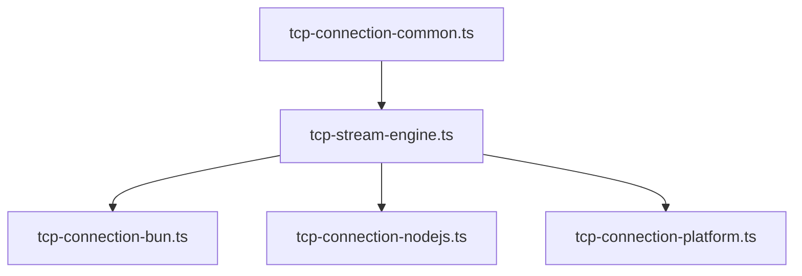
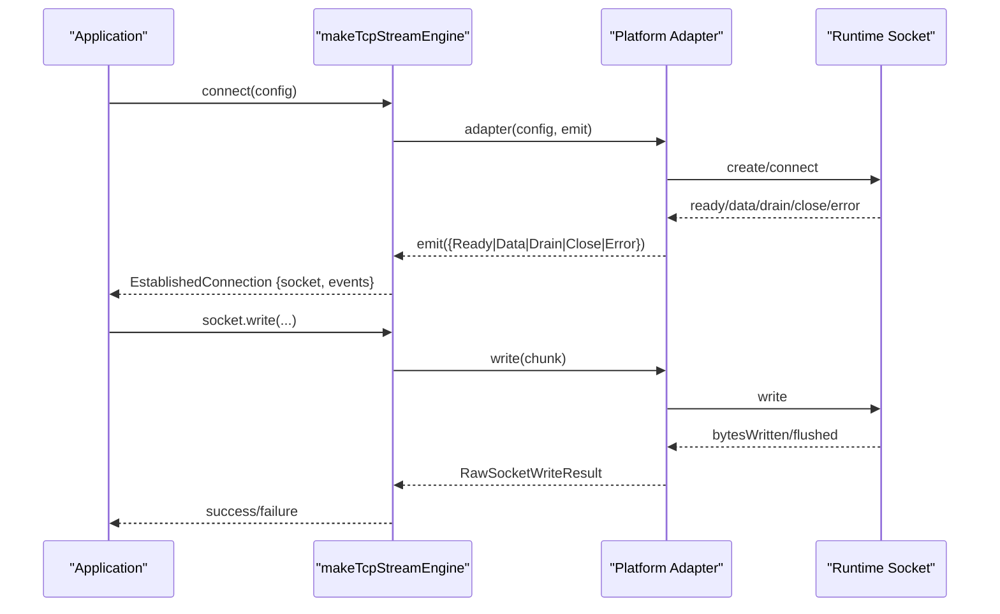
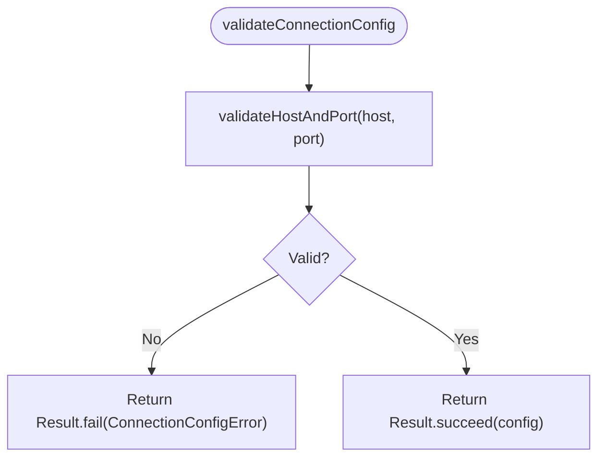
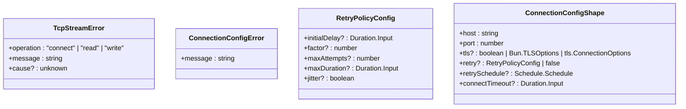
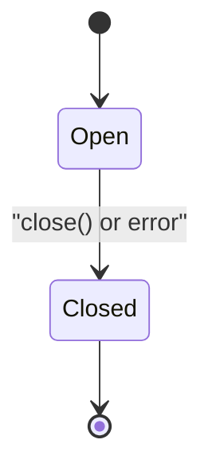
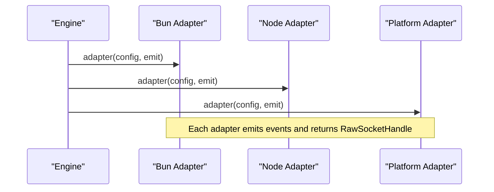
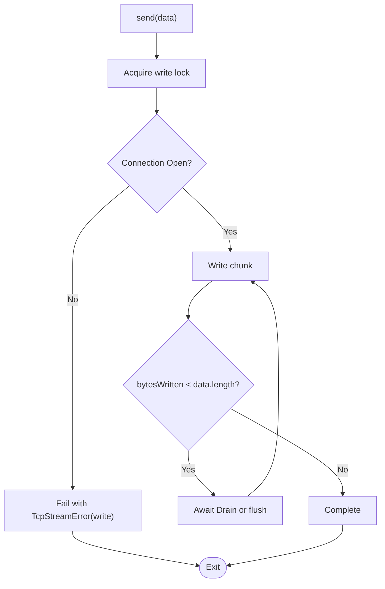
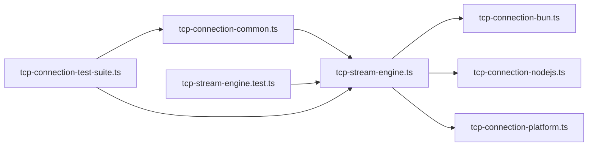

# Shared Types and Validation

<cite>
**Referenced Files in This Document**
- [tcp-connection-common.ts](file://packages/tcp/src/tcp-connection-common.ts)
- [tcp-stream-engine.ts](file://packages/tcp/src/tcp-stream-engine.ts)
- [tcp-connection-bun.ts](file://packages/tcp/src/tcp-connection-bun.ts)
- [tcp-connection-nodejs.ts](file://packages/tcp/src/tcp-connection-nodejs.ts)
- [tcp-connection-platform.ts](file://packages/tcp/src/tcp-connection-platform.ts)
- [tcp-stream-engine.test.ts](file://packages/tcp/src/tcp-stream-engine.test.ts)
- [tcp-connection-test-suite.ts](file://packages/tcp/src/tcp-connection-test-suite.ts)
</cite>

## Update Summary
**Changes Made**
- Updated all file references from `src/` to `packages/tcp/src/` to reflect the new package structure
- Maintained all existing functionality and API surface while updating paths
- Preserved complete documentation structure and content accuracy

## Table of Contents
1. Introduction
2. Project Structure
3. Core Components
4. Architecture Overview
5. Detailed Component Analysis
6. Dependency Analysis
7. Performance Considerations
8. Troubleshooting Guide
9. Conclusion
10. Appendices

## Introduction
This document explains the shared types, validation logic, error normalization, and utility functions that underpin all platform adapters (Bun, Node.js, Platform). It focuses on:
- Common configuration shape and services
- Connection state modeling
- Error type system and normalization across runtimes
- Validation rules for host/port and retry behavior
- Utilities for message handling and cross-platform compatibility
- Guidance for extending the configuration schema and adding new validation rules

## Project Structure
The shared layer is implemented in a small set of files within the tcp package:
- tcp-connection-common.ts: Shared types, services, validation, and utilities
- tcp-stream-engine.ts: Engine orchestration, timeouts, retry wiring, and high-level stream construction
- Platform adapters: tcp-connection-bun.ts, tcp-connection-nodejs.ts, tcp-connection-platform.ts implement the low-level socket bridge using the shared engine contract

**Diagram sources**
- [tcp-connection-common.ts:1-101](file://packages/tcp/src/tcp-connection-common.ts#L1-L101)
- [tcp-stream-engine.ts:1-359](file://packages/tcp/src/tcp-stream-engine.ts#L1-L359)
- [tcp-connection-bun.ts:1-145](file://packages/tcp/src/tcp-connection-bun.ts#L1-L145)
- [tcp-connection-nodejs.ts:1-132](file://packages/tcp/src/tcp-connection-nodejs.ts#L1-L132)
- [tcp-connection-platform.ts:1-135](file://packages/tcp/src/tcp-connection-platform.ts#L1-L135)

**Section sources**
- [tcp-connection-common.ts:1-101](file://packages/tcp/src/tcp-connection-common.ts#L1-L101)
- [tcp-stream-engine.ts:1-359](file://packages/tcp/src/tcp-stream-engine.ts#L1-L359)

## Core Components
- ConnectionConfigShape: The canonical connection configuration used by all adapters. Includes host, port, optional TLS options, retry policy or schedule, and connect timeout.
- TcpStreamError: A unified error type with operation context and normalized message, carrying an optional underlying cause.
- RetryPolicyConfig and buildDefaultRetrySchedule: Define and construct exponential backoff with jitter and caps.
- validateHostAndPort and validateConnectionConfig: Validate host and port and return typed results.
- unknownToMessage: Normalizes any error-like cause into a string message.
- TcpStreamShape and TcpStream service: High-level API surface for sending, streaming data, and closing.
- TcpStreamEngine and makeTcpStreamEngine: Orchestrate connection lifecycle, events, timeouts, retries, and provide EstablishedConnection.

Key responsibilities:
- Centralize configuration and validation to ensure consistent behavior across platforms
- Normalize errors so callers can handle them uniformly regardless of runtime
- Provide reusable retry scheduling and timeout helpers
- Expose a stable engine interface that adapters implement

**Section sources**
- [tcp-connection-common.ts:12-101](file://packages/tcp/src/tcp-connection-common.ts#L12-L101)
- [tcp-stream-engine.ts:28-67](file://packages/tcp/src/tcp-stream-engine.ts#L28-L67)

## Architecture Overview
The architecture separates concerns into three layers:
- Shared contracts and utilities (common): types, validation, error normalization, retry helpers
- Engine (stream engine): orchestrates connection attempts, event flow, timeouts, retries, and exposes a stable API
- Adapters (platform-specific): implement the cold adapter protocol to bridge Bun/Node/Platform sockets to the engine

**Diagram sources**
- [tcp-stream-engine.ts:89-178](file://packages/tcp/src/tcp-stream-engine.ts#L89-L178)
- [tcp-connection-bun.ts:18-135](file://packages/tcp/src/tcp-connection-bun.ts#L18-L135)
- [tcp-connection-nodejs.ts:21-115](file://packages/tcp/src/tcp-connection-nodejs.ts#L21-L115)
- [tcp-connection-platform.ts:17-119](file://packages/tcp/src/tcp-connection-platform.ts#L17-L119)

## Detailed Component Analysis

### Shared Configuration and Services
- ConnectionConfigShape defines the cross-platform connection parameters, including optional TLS and retry settings.
- ConnectionConfig is an Effect Service exposing the resolved configuration to downstream components.
- ConnectionConfigLive provides a Layer to inject configuration.

Validation:
- validateHostAndPort enforces integer ports within the valid range and non-empty host strings.
- validateConnectionConfig composes host/port validation and returns the validated config.

Retry:
- RetryPolicyConfig supports initial delay, factor, max attempts, max duration, and jitter.
- buildDefaultRetrySchedule constructs an exponential backoff schedule with jitter and caps.

Utilities:
- unknownToMessage converts arbitrary causes into readable messages for error normalization.

**Diagram sources**
- [tcp-connection-common.ts:65-89](file://packages/tcp/src/tcp-connection-common.ts#L65-L89)

**Section sources**
- [tcp-connection-common.ts:37-101](file://packages/tcp/src/tcp-connection-common.ts#L37-L101)

### Unified Error Type System
- TcpStreamError carries:
  - operation: one of connect, read, write
  - message: normalized human-readable message
  - cause: original underlying error (optional)
- All adapters wrap raw errors into TcpStreamError during write and error paths, ensuring uniform handling at the application level.
- The engine classifies failures based on connection phase:
  - Errors before readiness are classified as connect errors
  - Errors after readiness are classified as read errors

Normalization:
- unknownToMessage ensures consistent message formatting from any cause
- withConnectTimeout wraps connect effects and normalizes timeout failures into TcpStreamError

**Diagram sources**
- [tcp-connection-common.ts:12-57](file://packages/tcp/src/tcp-connection-common.ts#L12-L57)
- [tcp-stream-engine.ts:180-195](file://packages/tcp/src/tcp-stream-engine.ts#L180-L195)

**Section sources**
- [tcp-connection-common.ts:12-24](file://packages/tcp/src/tcp-connection-common.ts#L12-L24)
- [tcp-stream-engine.ts:81-86](file://packages/tcp/src/tcp-stream-engine.ts#L81-L86)
- [tcp-stream-engine.ts:180-195](file://packages/tcp/src/tcp-stream-engine.ts#L180-L195)

### Connection State and Lifecycle
- ConnectionState models Open vs Closed states, optionally capturing a terminal error.
- makeTcpStream builds a high-level TcpStream over the engine:
  - Validates configuration
  - Resolves retry strategy (custom schedule, explicit disable, or default exponential backoff)
  - Acquires connection with acquireRelease and manages event fiber
  - Provides send, sendText, stream, and close
- Events from adapters are mapped to ConnectionEvent and queued for consumers.

**Diagram sources**
- [tcp-stream-engine.ts:197-200](file://packages/tcp/src/tcp-stream-engine.ts#L197-L200)
- [tcp-stream-engine.ts:201-339](file://packages/tcp/src/tcp-stream-engine.ts#L201-L339)

**Section sources**
- [tcp-stream-engine.ts:197-339](file://packages/tcp/src/tcp-stream-engine.ts#L197-L339)

### Platform Adapters and Cross-Platform Compatibility
Adapters implement a cold adapter protocol consumed by makeTcpStreamEngine:
- Adapter receives config and an emit function to signal Ready, Data, Drain, Close, Error
- On success, returns a RawSocketHandle with write and close
- Writes return RawSocketWriteResult indicating bytes written and whether flushed

Bun adapter:
- Uses Bun.connect and maps callbacks to engine events
- Wraps write failures into TcpStreamError with normalized messages

Node.js adapter:
- Uses node:net and node:tls
- Handles data as Buffer or string, converting to Uint8Array
- Emits drain and close events appropriately

Platform adapter:
- Uses @effect/platform-bun and unstable socket APIs
- Manages scope ownership and child scopes to ensure proper teardown
- Maps writer errors to TcpStreamError

**Diagram sources**
- [tcp-connection-bun.ts:18-135](file://packages/tcp/src/tcp-connection-bun.ts#L18-L135)
- [tcp-connection-nodejs.ts:21-115](file://packages/tcp/src/tcp-connection-nodejs.ts#L21-L115)
- [tcp-connection-platform.ts:17-119](file://packages/tcp/src/tcp-connection-platform.ts#L17-L119)

**Section sources**
- [tcp-connection-bun.ts:18-135](file://packages/tcp/src/tcp-connection-bun.ts#L18-L135)
- [tcp-connection-nodejs.ts:21-115](file://packages/tcp/src/tcp-connection-nodejs.ts#L21-L115)
- [tcp-connection-platform.ts:17-119](file://packages/tcp/src/tcp-connection-platform.ts#L17-L119)

### Message Handling and Stream Construction
- Incoming data is queued and exposed via Stream.fromQueue for consumers
- Drain events wake up writers waiting for buffer space
- Write path uses a semaphore to serialize writes and handles partial writes and zero-byte responses by awaiting drain
- Text encoding is handled via TextEncoder for sendText

**Diagram sources**
- [tcp-stream-engine.ts:300-332](file://packages/tcp/src/tcp-stream-engine.ts#L300-L332)

**Section sources**
- [tcp-stream-engine.ts:201-339](file://packages/tcp/src/tcp-stream-engine.ts#L201-L339)

### Validation Logic Across Platforms
- Host and port validation is centralized in validateHostAndPort and applied before connecting
- TLS options are passed through to adapters; they interpret boolean or options objects per runtime
- Connect timeout is enforced by withConnectTimeout, normalizing timeout failures into TcpStreamError
- Retry behavior is configured via RetryPolicyConfig or custom retrySchedule; defaults are built with buildDefaultRetrySchedule

Examples of validation usage:
- Tests configure retry policies and schedules to exercise failure recovery and timing constraints
- Tests verify that invalid endpoints fail cleanly with TcpStreamError and bounded time

**Section sources**
- [tcp-connection-common.ts:65-101](file://packages/tcp/src/tcp-connection-common.ts#L65-L101)
- [tcp-stream-engine.ts:180-195](file://packages/tcp/src/tcp-stream-engine.ts#L180-L195)
- [tcp-stream-engine.test.ts:16-24](file://packages/tcp/src/tcp-stream-engine.test.ts#L16-L24)
- [tcp-connection-test-suite.ts:219-306](file://packages/tcp/src/tcp-connection-test-suite.ts#L219-L306)

## Dependency Analysis
- tcp-stream-engine depends on tcp-connection-common for types, services, validation, and utilities
- Platform adapters depend on both tcp-connection-common and tcp-stream-engine to implement the adapter protocol and expose convenience layers
- Tests depend on shared types and engine to validate behavior across adapters

**Diagram sources**
- [tcp-connection-common.ts:1-101](file://packages/tcp/src/tcp-connection-common.ts#L1-L101)
- [tcp-stream-engine.ts:1-359](file://packages/tcp/src/tcp-stream-engine.ts#L1-L359)
- [tcp-connection-bun.ts:1-145](file://packages/tcp/src/tcp-connection-bun.ts#L1-L145)
- [tcp-connection-nodejs.ts:1-132](file://packages/tcp/src/tcp-connection-nodejs.ts#L1-L132)
- [tcp-connection-platform.ts:1-135](file://packages/tcp/src/tcp-connection-platform.ts#L1-L135)
- [tcp-stream-engine.test.ts:1-214](file://packages/tcp/src/tcp-stream-engine.test.ts#L1-L214)
- [tcp-connection-test-suite.ts:1-800](file://packages/tcp/src/tcp-connection-test-suite.ts#L1-L800)

**Section sources**
- [tcp-connection-common.ts:1-101](file://packages/tcp/src/tcp-connection-common.ts#L1-L101)
- [tcp-stream-engine.ts:1-359](file://packages/tcp/src/tcp-stream-engine.ts#L1-L359)
- [tcp-connection-bun.ts:1-145](file://packages/tcp/src/tcp-connection-bun.ts#L1-L145)
- [tcp-connection-nodejs.ts:1-132](file://packages/tcp/src/tcp-connection-nodejs.ts#L1-L132)
- [tcp-connection-platform.ts:1-135](file://packages/tcp/src/tcp-connection-platform.ts#L1-L135)
- [tcp-stream-engine.test.ts:1-214](file://packages/tcp/src/tcp-stream-engine.test.ts#L1-L214)
- [tcp-connection-test-suite.ts:1-800](file://packages/tcp/src/tcp-connection-test-suite.ts#L1-L800)

## Performance Considerations
- Serialization of writes via a semaphore prevents concurrent writes and ensures ordered delivery
- Zero-byte write responses trigger drain waits to avoid busy loops
- Default retry uses exponential backoff with jitter to reduce thundering herd scenarios
- Connect timeout prevents long hangs during slow or blocked connections
- Event-driven model minimizes blocking and leverages queues for efficient data flow

[No sources needed since this section provides general guidance]

## Troubleshooting Guide
Common issues and how the system handles them:
- Invalid host or port: validateHostAndPort fails early with ConnectionConfigError; applications should inspect Result and present user-friendly messages
- Connection timeout: withConnectTimeout wraps connect and produces TcpStreamError with operation "connect" and a normalized message
- Remote close before readiness: engine closes the attempt and surfaces a clear error
- Post-readiness errors: classified as "read" operations to distinguish from connect failures
- Retry exhaustion: tests assert bounded time and clean failures without defects

Debugging tips:
- Inspect TcpStreamError.operation to determine where the failure occurred
- Use unknownToMessage to log the underlying cause consistently
- Configure retry: false for immediate failure in tests or when retries are not desired
- Provide custom retrySchedule for fine-grained control over retry behavior

**Section sources**
- [tcp-connection-common.ts:65-89](file://packages/tcp/src/tcp-connection-common.ts#L65-L89)
- [tcp-stream-engine.ts:81-86](file://packages/tcp/src/tcp-stream-engine.ts#L81-L86)
- [tcp-stream-engine.ts:180-195](file://packages/tcp/src/tcp-stream-engine.ts#L180-L195)
- [tcp-stream-engine.test.ts:100-149](file://packages/tcp/src/tcp-stream-engine.test.ts#L100-L149)
- [tcp-connection-test-suite.ts:219-306](file://packages/tcp/src/tcp-connection-test-suite.ts#L219-L306)

## Conclusion
The shared types and validation layer centralizes configuration, error normalization, and retry behavior to ensure consistent TCP stream behavior across Bun, Node.js, and Platform adapters. By validating inputs early, normalizing errors, and providing robust retry and timeout mechanisms, the system offers a reliable foundation for building cross-platform network clients. Extending the configuration schema and adding validation rules follows established patterns: update ConnectionConfigShape, extend validators, and wire new options into the engine and adapters.

[No sources needed since this section summarizes without analyzing specific files]

## Appendices

### Extending the Configuration Schema
Steps to add a new option to ConnectionConfigShape:
- Add the field to ConnectionConfigShape in the common module
- Update validateConnectionConfig to include validation for the new field if necessary
- Propagate the option to adapters in their connect logic
- If it affects retry or timeout, integrate with buildDefaultRetrySchedule or withConnectTimeout accordingly

Example references:
- Adding TLS options is already supported via boolean or runtime-specific options
- Retry policy fields are validated and composed into schedules

**Section sources**
- [tcp-connection-common.ts:45-57](file://packages/tcp/src/tcp-connection-common.ts#L45-L57)
- [tcp-stream-engine.ts:244-251](file://packages/tcp/src/tcp-stream-engine.ts#L244-L251)
- [tcp-connection-bun.ts:57-63](file://packages/tcp/src/tcp-connection-bun.ts#L57-L63)
- [tcp-connection-nodejs.ts:75-83](file://packages/tcp/src/tcp-connection-nodejs.ts#L75-L83)

### Adding New Validation Rules
To add a new rule:
- Implement a validator function returning Result with a typed error
- Compose it into validateConnectionConfig
- Ensure adapters rely on the validated config rather than duplicating checks

Example references:
- validateHostAndPort demonstrates integer range checks and empty string checks
- Tests exercise these validations via ConnectionConfigLive and assertions on outcomes

**Section sources**
- [tcp-connection-common.ts:65-89](file://packages/tcp/src/tcp-connection-common.ts#L65-L89)
- [tcp-connection-test-suite.ts:219-276](file://packages/tcp/src/tcp-connection-test-suite.ts#L219-L276)