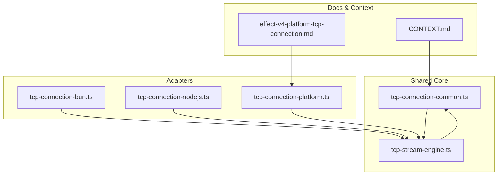
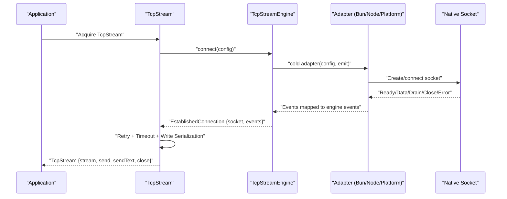
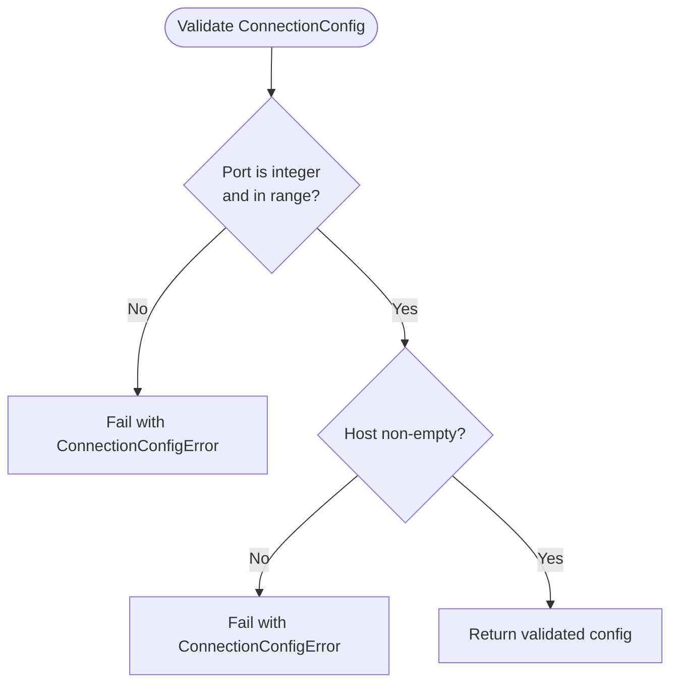
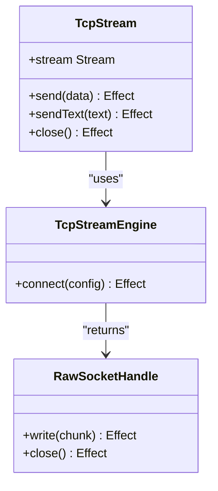
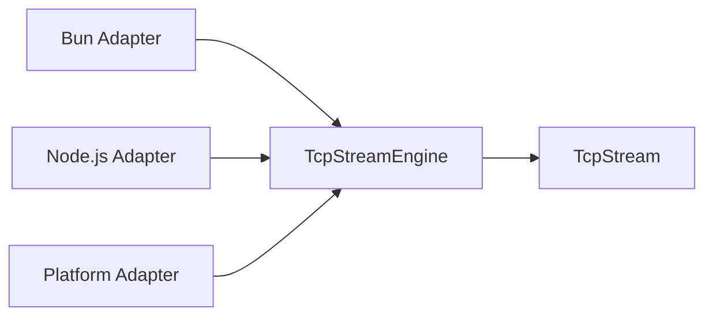
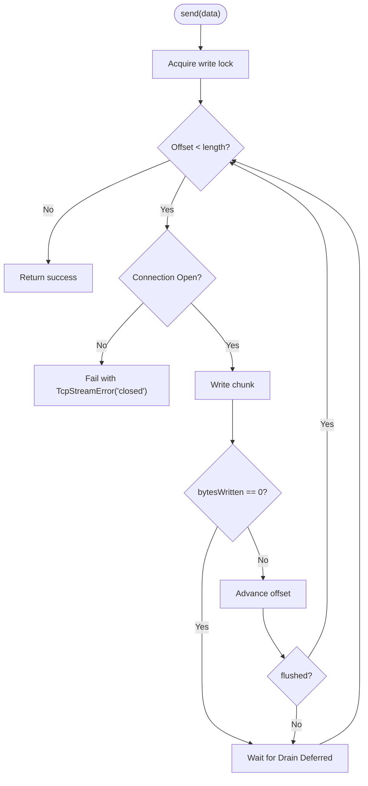
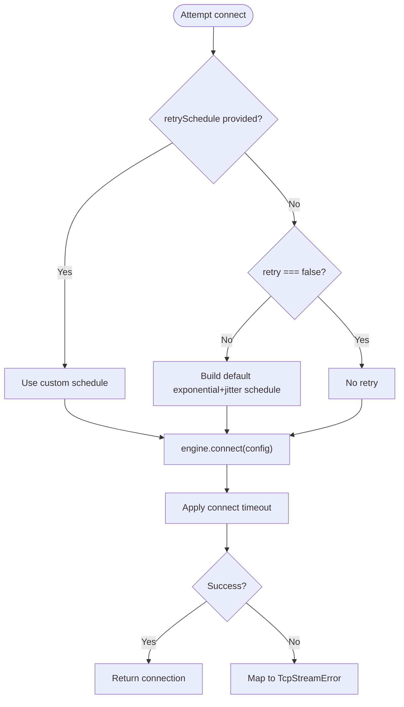
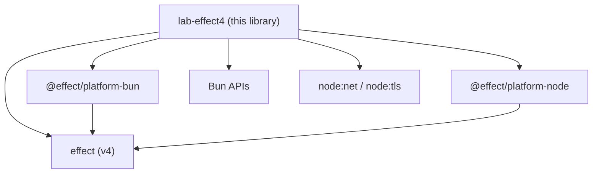

# Project Overview

<cite>
**Referenced Files in This Document**
- [package.json](file://package.json)
- [AGENTS.md](file://AGENTS.md)
- [CONTEXT.md](file://CONTEXT.md)
- [src/tcp-stream-engine.ts](file://src/tcp-stream-engine.ts)
- [src/tcp-connection-common.ts](file://src/tcp-connection-common.ts)
- [src/tcp-connection-bun.ts](file://src/tcp-connection-bun.ts)
- [src/tcp-connection-nodejs.ts](file://src/tcp-connection-nodejs.ts)
- [src/tcp-connection-platform.ts](file://src/tcp-connection-platform.ts)
- [docs/research/effect-v4-platform-tcp-connection.md](file://docs/research/effect-v4-platform-tcp-connection.md)
</cite>

## Table of Contents
1. [Introduction](#introduction)
2. [Project Structure](#project-structure)
3. [Core Components](#core-components)
4. [Architecture Overview](#architecture-overview)
5. [Detailed Component Analysis](#detailed-component-analysis)
6. [Dependency Analysis](#dependency-analysis)
7. [Performance Considerations](#performance-considerations)
8. [Troubleshooting Guide](#troubleshooting-guide)
9. [Conclusion](#conclusion)

## Introduction
This project is an Effect-based TCP stream library that provides a cross-platform, unified API for TCP socket connectivity across Bun, Node.js, and the Effect Platform runtime. Built on TypeScript and Effect v4, it abstracts platform-specific networking details behind a consistent interface while delivering production-grade features such as advanced connection management, retry logic with configurable schedules, connect timeouts, backpressure-aware writes, and robust lifecycle management via Effect Scopes and Layers.

The library targets:
- Beginners learning functional programming patterns through a practical, well-structured codebase.
- Experienced developers building resilient network applications that must run consistently across multiple JavaScript runtimes.

It serves both as a usable networking layer and as an educational resource demonstrating modern asynchronous I/O patterns using Effect’s composable primitives (Streams, Queues, Semaphores, Deferred, Schedules, and Layered dependency injection).

**Section sources**
- [package.json:23-28](file://package.json#L23-L28)
- [AGENTS.md:1-10](file://AGENTS.md#L1-L10)
- [CONTEXT.md:1-26](file://CONTEXT.md#L1-L26)

## Project Structure
At a high level, the repository separates concerns into:
- A shared engine and common types that define the public contract and error model.
- Platform-specific adapters for Bun, Node.js, and the Effect Platform.
- A comprehensive test suite that validates behavior across all engines.
- Research and design documents explaining architectural decisions and platform differences.

**Diagram sources**
- [src/tcp-connection-common.ts:12-101](file://src/tcp-connection-common.ts#L12-L101)
- [src/tcp-stream-engine.ts:64-178](file://src/tcp-stream-engine.ts#L64-L178)
- [src/tcp-connection-bun.ts:18-136](file://src/tcp-connection-bun.ts#L18-L136)
- [src/tcp-connection-nodejs.ts:21-119](file://src/tcp-connection-nodejs.ts#L21-L119)
- [src/tcp-connection-platform.ts:17-128](file://src/tcp-connection-platform.ts#L17-L128)
- [docs/research/effect-v4-platform-tcp-connection.md:1-13](file://docs/research/effect-v4-platform-tcp-connection.md#L1-L13)
- [CONTEXT.md:1-26](file://CONTEXT.md#L1-L26)

**Section sources**
- [src/tcp-connection-common.ts:12-101](file://src/tcp-connection-common.ts#L12-L101)
- [src/tcp-stream-engine.ts:64-178](file://src/tcp-stream-engine.ts#L64-L178)
- [src/tcp-connection-bun.ts:18-136](file://src/tcp-connection-bun.ts#L18-L136)
- [src/tcp-connection-nodejs.ts:21-119](file://src/tcp-connection-nodejs.ts#L21-L119)
- [src/tcp-connection-platform.ts:17-128](file://src/tcp-connection-platform.ts#L17-L128)
- [docs/research/effect-v4-platform-tcp-connection.md:1-13](file://docs/research/effect-v4-platform-tcp-connection.md#L1-L13)
- [CONTEXT.md:1-26](file://CONTEXT.md#L1-L26)

## Core Components
- TcpStream: The primary service exposing a bidirectional communication channel with an incoming Stream of bytes and backpressure-aware send methods. It encapsulates connection lifecycle, retries, timeouts, and graceful close semantics.
- TcpStreamEngine: An abstraction over platform-specific socket implementations. Adapters implement a cold connection protocol that emits readiness, data, drain, close, and error events to the engine.
- ConnectionConfig: Typed configuration for host, port, TLS options, retry policy or schedule, and connect timeout. Validated before use.
- Error Model: A tagged error type that captures operation context (connect/read/write), messages, and underlying causes for precise error handling.

Key capabilities:
- Advanced connection management: Scoped acquisition/release, interruption-safe connect, and idempotent close.
- Retry logic: Configurable exponential backoff with jitter, max attempts/duration, or custom schedules.
- Timeouts: Connect timeout enforced centrally around adapter setup and readiness.
- Backpressure: Write serialization via a semaphore and drain-waiting to avoid overwhelming kernel buffers.
- Lifecycle: Scope-owned resources ensure cleanup on interruption or scope completion.

**Section sources**
- [src/tcp-connection-common.ts:12-101](file://src/tcp-connection-common.ts#L12-L101)
- [src/tcp-stream-engine.ts:64-178](file://src/tcp-stream-engine.ts#L64-L178)
- [src/tcp-stream-engine.ts:201-341](file://src/tcp-stream-engine.ts#L201-L341)

## Architecture Overview
The architecture follows a caller-first engine pattern:
- Adapters provide a cold connection function that emits events until Ready/Data/Drain/Close/Error.
- The engine coordinates readiness, event queuing, and failure mapping, returning a stable handle and an ordered event stream.
- TcpStream composes the engine with retry, timeouts, write serialization, and stream orchestration.

**Diagram sources**
- [src/tcp-stream-engine.ts:89-178](file://src/tcp-stream-engine.ts#L89-L178)
- [src/tcp-connection-bun.ts:18-136](file://src/tcp-connection-bun.ts#L18-L136)
- [src/tcp-connection-nodejs.ts:21-119](file://src/tcp-connection-nodejs.ts#L21-L119)
- [src/tcp-connection-platform.ts:17-128](file://src/tcp-connection-platform.ts#L17-L128)

## Detailed Component Analysis

### Shared Types and Configuration
- ConnectionConfigShape defines host, port, optional TLS, retry policy/schedule, and connectTimeout.
- Validation ensures valid host/port and returns typed errors for invalid configurations.
- Default retry schedule builds exponential backoff with jitter and caps attempts/duration.

**Diagram sources**
- [src/tcp-connection-common.ts:65-88](file://src/tcp-connection-common.ts#L65-L88)
- [src/tcp-connection-common.ts:90-101](file://src/tcp-connection-common.ts#L90-L101)

**Section sources**
- [src/tcp-connection-common.ts:12-101](file://src/tcp-connection-common.ts#L12-L101)

### Engine Orchestration and Lifecycle
- makeTcpStreamEngine wraps a cold adapter, manages phases (connecting/ready/closed), and exposes an EstablishedConnection with a RawSocketHandle and an ordered Stream of events.
- withConnectTimeout applies a central timeout around connect and maps failures to TcpStreamError.
- makeTcpStream composes retry, acquire/release, event fan-out, write serialization, and graceful close.

**Diagram sources**
- [src/tcp-stream-engine.ts:64-67](file://src/tcp-stream-engine.ts#L64-L67)
- [src/tcp-stream-engine.ts:89-178](file://src/tcp-stream-engine.ts#L89-L178)
- [src/tcp-stream-engine.ts:201-341](file://src/tcp-stream-engine.ts#L201-L341)

**Section sources**
- [src/tcp-stream-engine.ts:89-178](file://src/tcp-stream-engine.ts#L89-L178)
- [src/tcp-stream-engine.ts:201-341](file://src/tcp-stream-engine.ts#L201-L341)

### Platform Adapters
- Bun Adapter: Uses native Bun.connect with binaryType set to Uint8Array; maps data/drain/end/close/error events; write uses direct socket.write and flush; close terminates or ends the socket.
- Node.js Adapter: Uses node:net/node:tls; handles data/drain/close/error events; write uses socket.write and reports flushed status; destroy on close.
- Platform Adapter: Uses @effect/platform’s Socket.Socket; creates sockets via BunSocket.makeNet or fromDuplex for TLS; integrates writer and run loop; closes via scoped owner.

**Diagram sources**
- [src/tcp-connection-bun.ts:18-136](file://src/tcp-connection-bun.ts#L18-L136)
- [src/tcp-connection-nodejs.ts:21-119](file://src/tcp-connection-nodejs.ts#L21-L119)
- [src/tcp-connection-platform.ts:17-128](file://src/tcp-connection-platform.ts#L17-L128)

**Section sources**
- [src/tcp-connection-bun.ts:18-136](file://src/tcp-connection-bun.ts#L18-L136)
- [src/tcp-connection-nodejs.ts:21-119](file://src/tcp-connection-nodejs.ts#L21-L119)
- [src/tcp-connection-platform.ts:17-128](file://src/tcp-connection-platform.ts#L17-L128)

### Backpressure and Write Serialization
- Writes are serialized with a Semaphore(1) to prevent concurrent writes.
- Partial writes and drain signals are handled by waiting on a Deferred until the buffer drains or the write completes.
- On connection close, pending writers fail with a clear TcpStreamError indicating closed state.

**Diagram sources**
- [src/tcp-stream-engine.ts:300-332](file://src/tcp-stream-engine.ts#L300-L332)

**Section sources**
- [src/tcp-stream-engine.ts:300-332](file://src/tcp-stream-engine.ts#L300-L332)

### Retry and Timeouts
- Retry can be disabled, configured via RetryPolicyConfig, or provided as a custom Schedule.
- Default retry uses exponential backoff with jitter and caps attempts/duration.
- Connect timeout is applied centrally; failures are normalized to TcpStreamError.

**Diagram sources**
- [src/tcp-stream-engine.ts:238-259](file://src/tcp-stream-engine.ts#L238-L259)
- [src/tcp-stream-engine.ts:180-195](file://src/tcp-stream-engine.ts#L180-L195)
- [src/tcp-connection-common.ts:90-101](file://src/tcp-connection-common.ts#L90-L101)

**Section sources**
- [src/tcp-stream-engine.ts:238-259](file://src/tcp-stream-engine.ts#L238-L259)
- [src/tcp-stream-engine.ts:180-195](file://src/tcp-stream-engine.ts#L180-L195)
- [src/tcp-connection-common.ts:90-101](file://src/tcp-connection-common.ts#L90-L101)

## Dependency Analysis
The library depends on Effect v4 primitives and platform-specific packages:
- effect: core runtime primitives (Effect, Stream, Queue, Semaphore, Deferred, Schedule, Layer, etc.).
- @effect/platform-bun and @effect/platform-node: platform abstractions used by the Platform adapter.
- Native modules: Bun APIs for Bun adapter; node:net and node:tls for Node.js adapter.

**Diagram sources**
- [package.json:23-28](file://package.json#L23-L28)
- [src/tcp-connection-platform.ts:1-5](file://src/tcp-connection-platform.ts#L1-L5)
- [src/tcp-connection-nodejs.ts:1-3](file://src/tcp-connection-nodejs.ts#L1-L3)
- [src/tcp-connection-bun.ts:1-6](file://src/tcp-connection-bun.ts#L1-L6)

**Section sources**
- [package.json:23-28](file://package.json#L23-L28)
- [src/tcp-connection-platform.ts:1-5](file://src/tcp-connection-platform.ts#L1-L5)
- [src/tcp-connection-nodejs.ts:1-3](file://src/tcp-connection-nodejs.ts#L1-L3)
- [src/tcp-connection-bun.ts:1-6](file://src/tcp-connection-bun.ts#L1-L6)

## Performance Considerations
- Backpressure-aware writes minimize memory pressure by honoring drain signals and avoiding unbounded queues for outgoing data.
- Scoped lifecycles ensure timely release of OS resources and prevent leaks during interruptions or failures.
- Centralized connect timeout prevents long-running hangs during network issues.
- Retry with jitter reduces thundering herds when reconnecting after transient failures.
- Platform differences: Bun’s native socket path avoids extra buffering; Node.js path leverages stream callbacks; Platform path integrates with Effect’s push-based Socket model.

[No sources needed since this section provides general guidance]

## Troubleshooting Guide
Common issues and how they are handled:
- Invalid configuration: Host/port validation fails early with a typed error.
- Connect timeout: Normalized to TcpStreamError with operation "connect".
- Remote close: Incoming stream ends cleanly; pending writers fail with a clear message.
- Interrupted connections: Scoped ownership ensures cleanup; no defects propagate if handled correctly.
- TLS handshake failures: Errors surface at connect or first write depending on adapter; tests assert clean failures without hanging.

**Section sources**
- [src/tcp-connection-common.ts:65-88](file://src/tcp-connection-common.ts#L65-L88)
- [src/tcp-stream-engine.ts:180-195](file://src/tcp-stream-engine.ts#L180-L195)
- [src/tcp-stream-engine.ts:216-237](file://src/tcp-stream-engine.ts#L216-L237)
- [docs/research/effect-v4-platform-tcp-connection.md:422-461](file://docs/research/effect-v4-platform-tcp-connection.md#L422-L461)

## Conclusion
This Effect-based TCP stream library delivers a robust, cross-platform networking solution built on modern functional programming principles. By unifying Bun, Node.js, and Effect Platform under a single API, it enables developers to build resilient clients and services with predictable lifecycle management, backpressure-aware I/O, and composable retry and timeout strategies. Its layered architecture and comprehensive test coverage also make it an excellent learning resource for understanding contemporary asynchronous I/O patterns in TypeScript with Effect v4.

[No sources needed since this section summarizes without analyzing specific files]