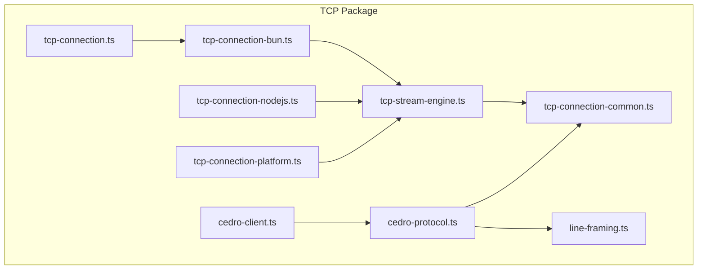
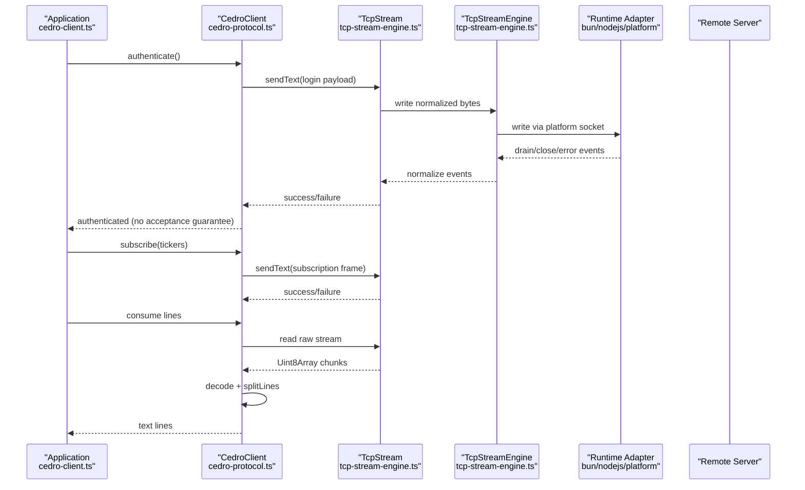
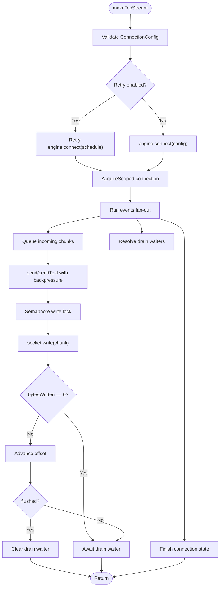
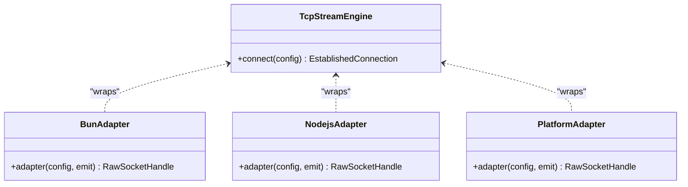
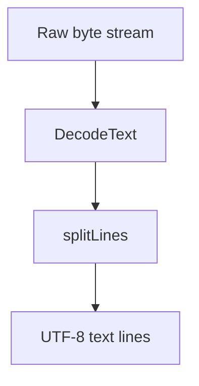
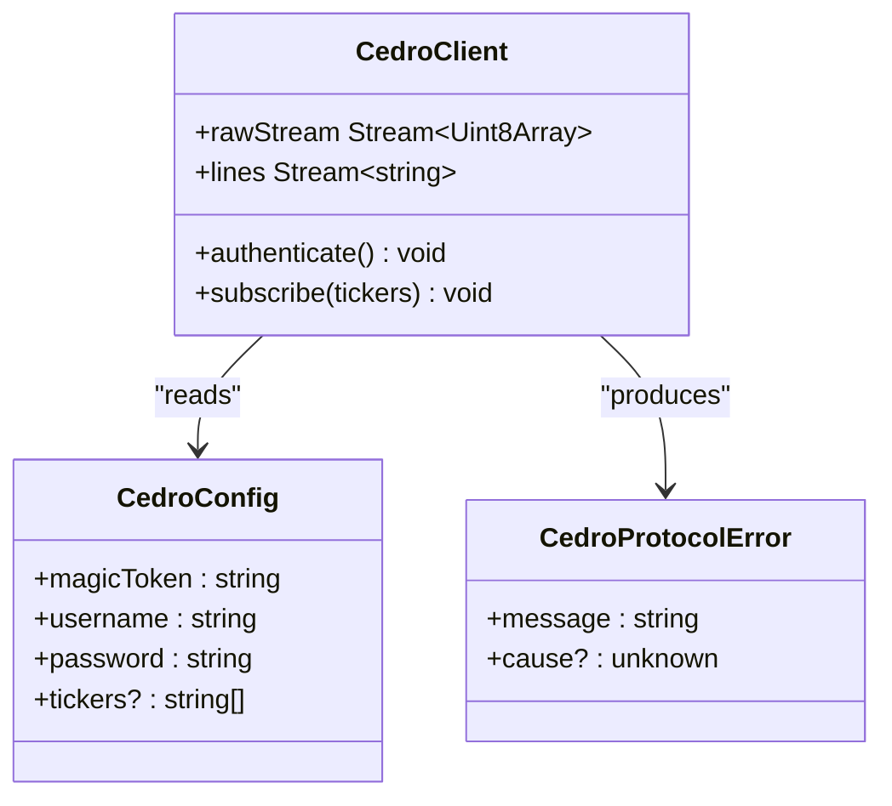
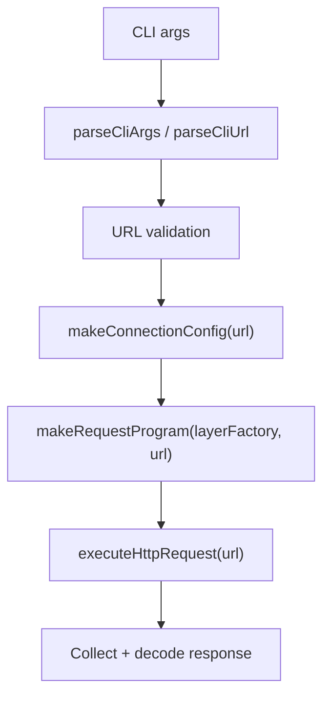
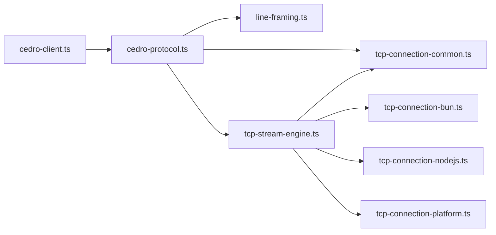

# Cedro High-Level Client

<cite>
**Referenced Files in This Document**
- [README.md](file://README.md)
- [CONTEXT.md](file://CONTEXT.md)
- [packages/tcp/README.md](file://packages/tcp/README.md)
- [packages/tcp/src/tcp-connection.ts](file://packages/tcp/src/tcp-connection.ts)
- [packages/tcp/src/tcp-connection-common.ts](file://packages/tcp/src/tcp-connection-common.ts)
- [packages/tcp/src/tcp-stream-engine.ts](file://packages/tcp/src/tcp-stream-engine.ts)
- [packages/tcp/src/tcp-connection-bun.ts](file://packages/tcp/src/tcp-connection-bun.ts)
- [packages/tcp/src/tcp-connection-nodejs.ts](file://packages/tcp/src/tcp-connection-nodejs.ts)
- [packages/tcp/src/tcp-connection-platform.ts](file://packages/tcp/src/tcp-connection-platform.ts)
- [packages/tcp/src/line-framing.ts](file://packages/tcp/src/line-framing.ts)
- [packages/tcp/src/cedro-protocol.ts](file://packages/tcp/src/cedro-protocol.ts)
- [packages/tcp/src/cedro-client.ts](file://packages/tcp/src/cedro-client.ts)
- [packages/tcp/src/cedro-client.test.ts](file://packages/tcp/src/cedro-client.test.ts)
- [packages/tcp/src/cedro-protocol.test.ts](file://packages/tcp/src/cedro-protocol.test.ts)
- [packages/tcp/src/tcp-connection-http-example.ts](file://packages/tcp/src/tcp-connection-http-example.ts)
</cite>

## Table of Contents
1. [Introduction](#introduction)
2. [Project Structure](#project-structure)
3. [Core Components](#core-components)
4. [Architecture Overview](#architecture-overview)
5. [Detailed Component Analysis](#detailed-component-analysis)
6. [Dependency Analysis](#dependency-analysis)
7. [Performance Considerations](#performance-considerations)
8. [Troubleshooting Guide](#troubleshooting-guide)
9. [Conclusion](#conclusion)

## Introduction
This document explains the Cedro high-level client built on top of a runtime-agnostic TCP networking layer. The system provides:
- A unified `TcpStream` abstraction over Bun, Node.js, and Effect Platform sockets.
- A line-framing utility that turns raw byte streams into UTF-8 text lines.
- A Cedro protocol client that authenticates and subscribes to tickers over TCP.
- A ready-to-run CLI program that connects, sends credentials, and prints server lines until disconnect.

The repository is a private Bun monorepo for Effect 4 experiments and TCP networking. The TCP package contains the engines, shared contracts, framing, the Cedro client, an HTTP demonstration, and tests.

**Section sources**
- [README.md:1-10](file://README.md#L1-L10)
- [packages/tcp/README.md:1-14](file://packages/tcp/README.md#L1-L14)

## Project Structure
At the repository root, two independent packages live under `packages`:
- `lab`: Effect learning examples.
- `tcp`: TCP engines, shared connection lifecycle, line framing, Cedro client, HTTP example, and tests.

The TCP package organizes code by responsibility:
- Shared contracts and errors: `tcp-connection-common.ts`.
- Engine orchestration: `tcp-stream-engine.ts`.
- Runtime adapters: `tcp-connection-bun.ts`, `tcp-connection-nodejs.ts`, `tcp-connection-platform.ts`.
- Facade re-export: `tcp-connection.ts`.
- Framing: `line-framing.ts`.
- Protocol client: `cedro-protocol.ts`.
- Application entrypoint: `cedro-client.ts`.
- Examples and tests alongside their source files.



**Diagram sources**
- [packages/tcp/src/tcp-connection.ts:1-10](file://packages/tcp/src/tcp-connection.ts#L1-L10)
- [packages/tcp/src/tcp-connection-common.ts:1-101](file://packages/tcp/src/tcp-connection-common.ts#L1-L101)
- [packages/tcp/src/tcp-stream-engine.ts:1-359](file://packages/tcp/src/tcp-stream-engine.ts#L1-L359)
- [packages/tcp/src/tcp-connection-bun.ts:1-145](file://packages/tcp/src/tcp-connection-bun.ts#L1-L145)
- [packages/tcp/src/tcp-connection-nodejs.ts:1-132](file://packages/tcp/src/tcp-connection-nodejs.ts#L1-L132)
- [packages/tcp/src/tcp-connection-platform.ts:1-135](file://packages/tcp/src/tcp-connection-platform.ts#L1-L135)
- [packages/tcp/src/line-framing.ts:1-18](file://packages/tcp/src/line-framing.ts#L1-L18)
- [packages/tcp/src/cedro-protocol.ts:1-105](file://packages/tcp/src/cedro-protocol.ts#L1-L105)
- [packages/tcp/src/cedro-client.ts:1-45](file://packages/tcp/src/cedro-client.ts#L1-L45)

**Section sources**
- [README.md:1-10](file://README.md#L1-L10)
- [packages/tcp/README.md:1-14](file://packages/tcp/README.md#L1-L14)

## Core Components
- TcpStream: Bidirectional communication service exposing an Effect Stream for incoming bytes and backpressured send operations for outgoing data.
- ConnectionConfig: Configuration schema for host, port, TLS options, retry policy, and connect timeout.
- Drain: Flow-control event signaling when kernel/userland write buffers are clear.
- TcpStreamEngine: Underlying runtime implementation driving a TcpStream session (Bun, Node.js, or Effect Platform).
- RawSocketHandle: Minimal handle to an active socket with normalized writes and teardown.
- Line framing: Transforms raw byte streams into UTF-8 text lines, handling partial frames and multiple lines per chunk.
- CedroClient: High-level client providing authentication, subscription, raw stream access, and framed line stream.
- receiveCedroCommands: Convenience function that authenticates immediately and consumes server lines until disconnect.

Key vocabulary from the domain glossary aligns with these components.

**Section sources**
- [CONTEXT.md:1-26](file://CONTEXT.md#L1-L26)
- [packages/tcp/src/tcp-connection-common.ts:12-57](file://packages/tcp/src/tcp-connection-common.ts#L12-L57)
- [packages/tcp/src/tcp-stream-engine.ts:28-67](file://packages/tcp/src/tcp-stream-engine.ts#L28-L67)
- [packages/tcp/src/line-framing.ts:1-18](file://packages/tcp/src/line-framing.ts#L1-L18)
- [packages/tcp/src/cedro-protocol.ts:5-39](file://packages/tcp/src/cedro-protocol.ts#L5-L39)
- [packages/tcp/src/cedro-client.ts:10-18](file://packages/tcp/src/cedro-client.ts#L10-L18)

## Architecture Overview
The architecture layers responsibilities cleanly:
- Adapters implement platform-specific socket behavior and emit normalized events.
- The engine coordinates connection lifecycle, retries, timeouts, and backpressure.
- TcpStream exposes a stable API over any engine.
- Line framing converts raw bytes to text lines.
- Cedro protocol composes configuration and TcpStream to provide authentication and subscriptions.
- The application wires environment configuration and runs the command loop.



**Diagram sources**
- [packages/tcp/src/cedro-client.ts:10-41](file://packages/tcp/src/cedro-client.ts#L10-L41)
- [packages/tcp/src/cedro-protocol.ts:41-100](file://packages/tcp/src/cedro-protocol.ts#L41-L100)
- [packages/tcp/src/tcp-stream-engine.ts:201-339](file://packages/tcp/src/tcp-stream-engine.ts#L201-L339)
- [packages/tcp/src/tcp-connection-bun.ts:18-137](file://packages/tcp/src/tcp-connection-bun.ts#L18-L137)
- [packages/tcp/src/tcp-connection-nodejs.ts:21-119](file://packages/tcp/src/tcp-connection-nodejs.ts#L21-L119)
- [packages/tcp/src/tcp-connection-platform.ts:51-119](file://packages/tcp/src/tcp-connection-platform.ts#L51-L119)

## Detailed Component Analysis

### TcpStream and Engine Orchestration
- TcpStreamShape defines the public API: a stream of raw bytes, typed send functions, and close.
- makeTcpStream validates configuration, selects retry strategy, acquires a scoped connection, fans out events, and manages write backpressure with a semaphore and drain waiters.
- makeTcpStreamEngine wraps a cold adapter protocol, normalizing Ready/Data/Drain/Close/Error events into a queue-backed stream and a safe socket handle.
- Convenience layers compose an engine layer with connection configuration.



**Diagram sources**
- [packages/tcp/src/tcp-stream-engine.ts:180-195](file://packages/tcp/src/tcp-stream-engine.ts#L180-L195)
- [packages/tcp/src/tcp-stream-engine.ts:201-339](file://packages/tcp/src/tcp-stream-engine.ts#L201-L339)

**Section sources**
- [packages/tcp/src/tcp-connection-common.ts:26-57](file://packages/tcp/src/tcp-connection-common.ts#L26-L57)
- [packages/tcp/src/tcp-stream-engine.ts:88-178](file://packages/tcp/src/tcp-stream-engine.ts#L88-L178)
- [packages/tcp/src/tcp-stream-engine.ts:201-359](file://packages/tcp/src/tcp-stream-engine.ts#L201-L359)

### Runtime Adapters
- Bun adapter uses Bun native sockets, mapping data/drain/end/close/error/connectError events to normalized events and returning a handle with write and close.
- Node.js adapter uses node:net and node:tls, wiring data/drain/close/error/connect/secureConnect events similarly.
- Platform adapter uses @effect/platform-bun and unstable Socket.Socket.run, managing scopes and writer lifetimes.



**Diagram sources**
- [packages/tcp/src/tcp-stream-engine.ts:88-178](file://packages/tcp/src/tcp-stream-engine.ts#L88-L178)
- [packages/tcp/src/tcp-connection-bun.ts:18-137](file://packages/tcp/src/tcp-connection-bun.ts#L18-L137)
- [packages/tcp/src/tcp-connection-nodejs.ts:21-119](file://packages/tcp/src/tcp-connection-nodejs.ts#L21-L119)
- [packages/tcp/src/tcp-connection-platform.ts:51-119](file://packages/tcp/src/tcp-connection-platform.ts#L51-L119)

**Section sources**
- [packages/tcp/src/tcp-connection-bun.ts:18-137](file://packages/tcp/src/tcp-connection-bun.ts#L18-L137)
- [packages/tcp/src/tcp-connection-nodejs.ts:21-119](file://packages/tcp/src/tcp-connection-nodejs.ts#L21-L119)
- [packages/tcp/src/tcp-connection-platform.ts:51-119](file://packages/tcp/src/tcp-connection-platform.ts#L51-L119)

### Line Framing
- frameLines decodes raw bytes to UTF-8 and splits on line boundaries, preserving empty lines and handling multi-packet reassembly and batched emissions.



**Diagram sources**
- [packages/tcp/src/line-framing.ts:1-18](file://packages/tcp/src/line-framing.ts#L1-L18)

**Section sources**
- [packages/tcp/src/line-framing.ts:1-18](file://packages/tcp/src/line-framing.ts#L1-L18)

### Cedro Protocol Client
- CedroConfig carries magic token, username, password, and optional tickers.
- CedroClient provides:
  - authenticate: formats and sends login fields; completion does not confirm server acceptance.
  - subscribe: formats and sends ticker subscription.
  - rawStream: underlying raw byte stream.
  - lines: framed UTF-8 text stream.
- Errors use CedroProtocolError for invalid inputs.



**Diagram sources**
- [packages/tcp/src/cedro-protocol.ts:5-39](file://packages/tcp/src/cedro-protocol.ts#L5-L39)
- [packages/tcp/src/cedro-protocol.ts:41-100](file://packages/tcp/src/cedro-protocol.ts#L41-L100)

**Section sources**
- [packages/tcp/src/cedro-protocol.ts:5-105](file://packages/tcp/src/cedro-protocol.ts#L5-L105)

### Application Entry Point
- receiveCedroCommands composes CedroClient to authenticate immediately and consume server lines until disconnect.
- main reads environment variables, composes TcpStreamLive and CedroConfigLive, and runs the command loop.

```mermaid
sequenceDiagram
participant Main as "main()<br/>cedro-client.ts"
participant Config as "Environment Config"
participant Layer as "Layer Composition"
participant Loop as "receiveCedroCommands"
participant Client as "CedroClient"
Main->>Config : CEDRO_HOST, CEDRO_PORT, CEDRO_MAGIC_KEY, CEDRO_USER, CEDRO_PASSWORD
Main->>Layer : merge(TcpStreamLive, CedroConfigLive)
Main->>Loop : run with callback Console.log
Loop->>Client : authenticate()
Loop->>Client : consume lines
Client-->>Loop : text lines
Loop-->>Main : print lines until disconnect
```

**Diagram sources**
- [packages/tcp/src/cedro-client.ts:10-45](file://packages/tcp/src/cedro-client.ts#L10-L45)

**Section sources**
- [packages/tcp/src/cedro-client.ts:10-45](file://packages/tcp/src/cedro-client.ts#L10-L45)

### HTTP Demonstration
- tcp-connection-http-example.ts demonstrates selecting a runtime engine via CLI flags, constructing a ConnectionConfigShape from a URL, sending an HTTP GET request over raw TCP, and decoding the response.
- It includes robust argument parsing, error types, and per-engine programs.



**Diagram sources**
- [packages/tcp/src/tcp-connection-http-example.ts:49-144](file://packages/tcp/src/tcp-connection-http-example.ts#L49-L144)
- [packages/tcp/src/tcp-connection-http-example.ts:152-205](file://packages/tcp/src/tcp-connection-http-example.ts#L152-L205)
- [packages/tcp/src/tcp-connection-http-example.ts:214-269](file://packages/tcp/src/tcp-connection-http-example.ts#L214-L269)

**Section sources**
- [packages/tcp/src/tcp-connection-http-example.ts:12-301](file://packages/tcp/src/tcp-connection-http-example.ts#L12-L301)

## Dependency Analysis
The Cedro client depends on:
- Line framing for text processing.
- TcpStream for I/O.
- Configuration services for credentials and connection settings.
- Layers for composition and dependency injection.



**Diagram sources**
- [packages/tcp/src/cedro-client.ts:1-45](file://packages/tcp/src/cedro-client.ts#L1-L45)
- [packages/tcp/src/cedro-protocol.ts:1-105](file://packages/tcp/src/cedro-protocol.ts#L1-L105)
- [packages/tcp/src/tcp-stream-engine.ts:1-359](file://packages/tcp/src/tcp-stream-engine.ts#L1-L359)
- [packages/tcp/src/tcp-connection-bun.ts:1-145](file://packages/tcp/src/tcp-connection-bun.ts#L1-L145)
- [packages/tcp/src/tcp-connection-nodejs.ts:1-132](file://packages/tcp/src/tcp-connection-nodejs.ts#L1-L132)
- [packages/tcp/src/tcp-connection-platform.ts:1-135](file://packages/tcp/src/tcp-connection-platform.ts#L1-L135)

**Section sources**
- [packages/tcp/src/cedro-client.ts:1-45](file://packages/tcp/src/cedro-client.ts#L1-L45)
- [packages/tcp/src/cedro-protocol.ts:1-105](file://packages/tcp/src/cedro-protocol.ts#L1-L105)
- [packages/tcp/src/tcp-stream-engine.ts:1-359](file://packages/tcp/src/tcp-stream-engine.ts#L1-L359)

## Performance Considerations
- Backpressure: Writes are serialized through a semaphore and await drain events to avoid overwhelming kernel buffers.
- Batched framing: Multiple lines can be emitted from a single chunk, reducing overhead.
- Retry policy: Exponential backoff with jitter and configurable limits protects against transient failures.
- Connect timeout: Enforced at the engine level to prevent hanging connections.
- Encoding: TextDecoder is used incrementally to correctly reconstruct multi-byte characters across chunks.

[No sources needed since this section provides general guidance]

## Troubleshooting Guide
Common issues and how to address them:
- Missing or invalid credentials:
  - Cedro authentication fails if required fields are missing or contain line breaks. Ensure environment variables are set and non-empty without newlines.
- Authentication acceptance:
  - Sending credentials does not prove server acceptance; inspect incoming lines for server responses.
- Subscription requirements:
  - Subscribing requires at least one ticker; validate input before calling subscribe.
- TCP errors:
  - TcpStreamError categorizes failures by operation (connect/read/write); catch and log with context.
- Environment configuration:
  - For the CLI client, ensure CEDRO_HOST, CEDRO_PORT, CEDRO_MAGIC_KEY, CEDRO_USER, and CEDRO_PASSWORD are present.

Validation and test references:
- Credential validation and error production are covered by protocol logic and tests.
- End-to-end behavior (authentication followed by line consumption) is validated by integration tests using local servers.

**Section sources**
- [packages/tcp/src/cedro-protocol.ts:45-86](file://packages/tcp/src/cedro-protocol.ts#L45-L86)
- [packages/tcp/src/cedro-protocol.test.ts:10-109](file://packages/tcp/src/cedro-protocol.test.ts#L10-L109)
- [packages/tcp/src/cedro-client.test.ts:17-58](file://packages/tcp/src/cedro-client.test.ts#L17-L58)
- [packages/tcp/src/tcp-connection-common.ts:12-24](file://packages/tcp/src/tcp-connection-common.ts#L12-L24)

## Conclusion
The Cedro high-level client builds on a clean separation between platform-specific socket adapters, a robust engine orchestrating lifecycle and backpressure, and a simple protocol client that composes configuration and I/O. The design emphasizes:
- Predictable error modeling with tagged errors.
- Composable layers for dependency injection.
- Streaming data with proper framing and backpressure.
- Extensibility across runtimes while keeping the application code portable.

For production usage, add explicit authentication acknowledgment handling, automatic reconnection policies, and structured logging around TcpStreamError and CedroProtocolError.

[No sources needed since this section summarizes without analyzing specific files]