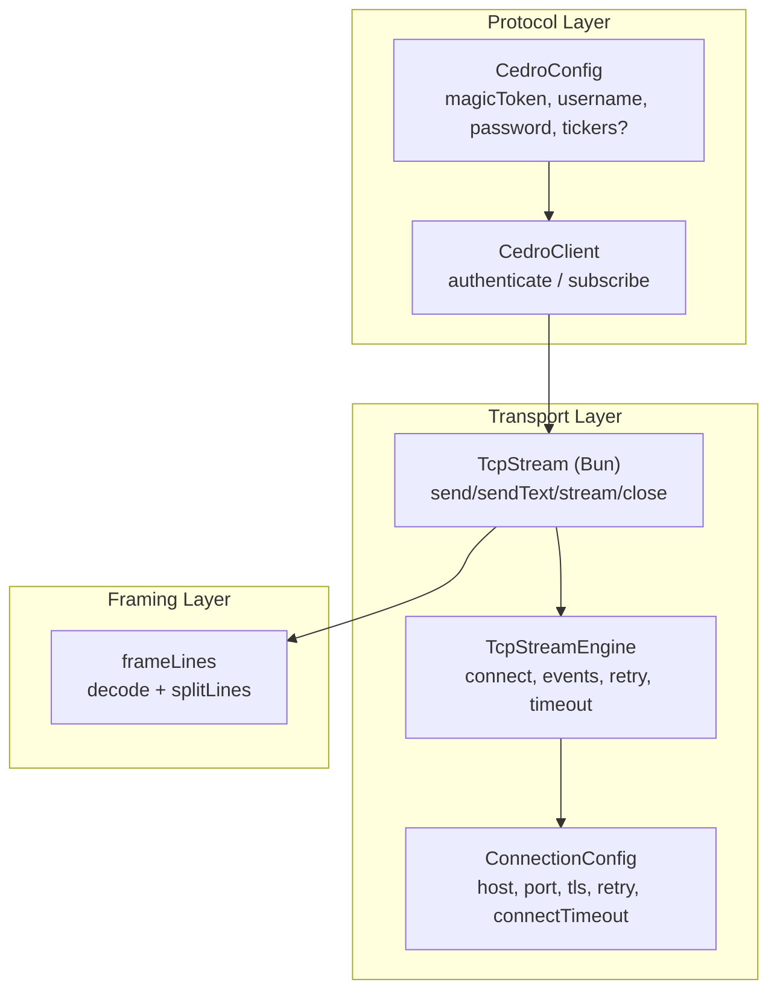
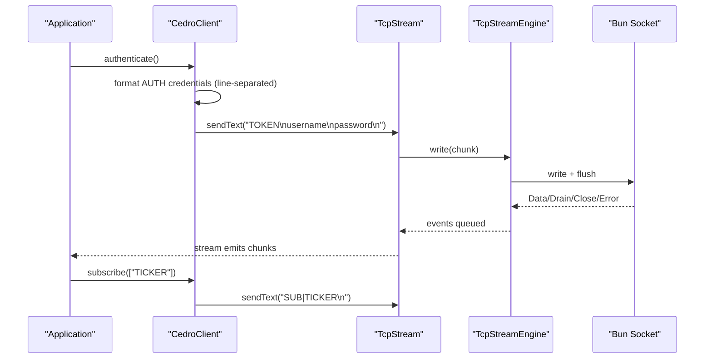
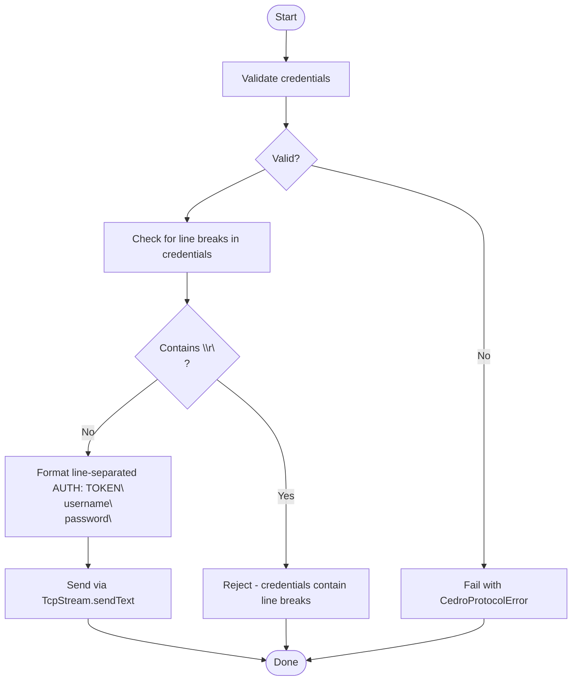
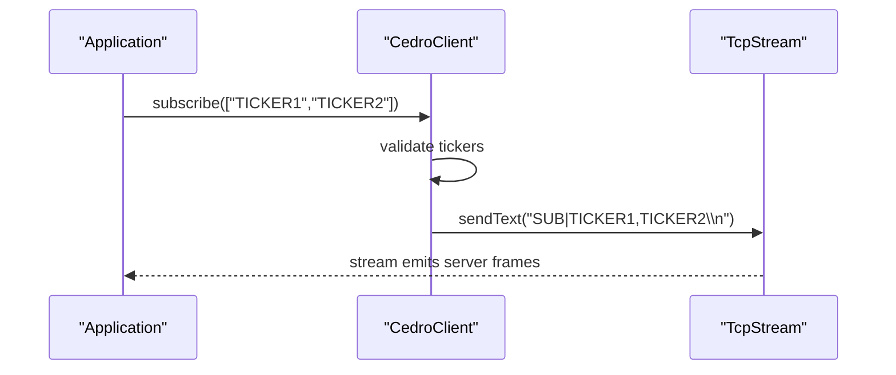
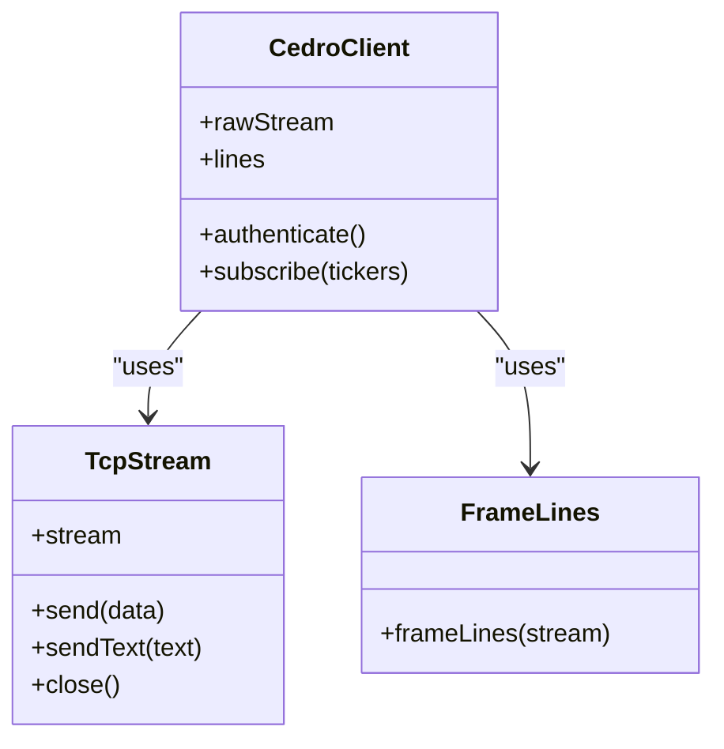
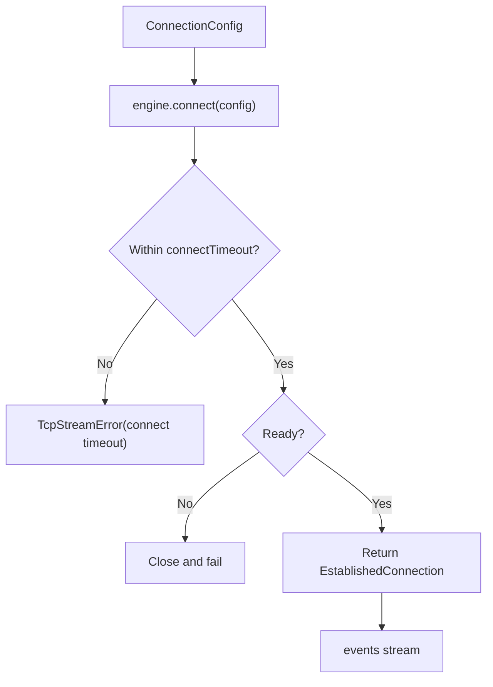
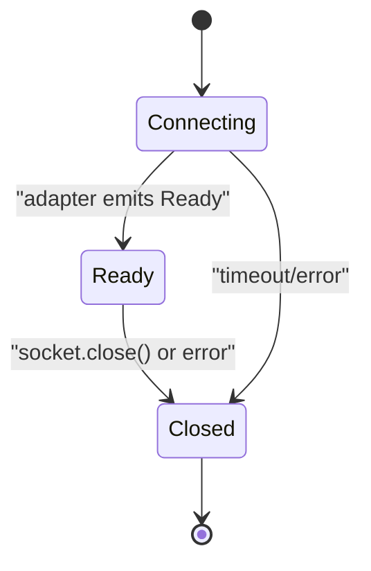
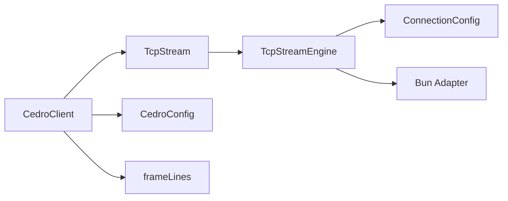

# Cedro Protocol Client

<cite>
**Referenced Files in This Document**
- [cedro-protocol.ts](file://packages/tcp/src/cedro-protocol.ts)
- [cedro-protocol.test.ts](file://packages/tcp/src/cedro-protocol.test.ts)
- [tcp-stream-engine.ts](file://packages/tcp/src/tcp-stream-engine.ts)
- [tcp-connection-bun.ts](file://packages/tcp/src/tcp-connection-bun.ts)
- [tcp-connection-common.ts](file://packages/tcp/src/tcp-connection-common.ts)
- [line-framing.ts](file://packages/tcp/src/line-framing.ts)
- [line-framing.test.ts](file://packages/tcp/src/line-framing.test.ts)
</cite>

## Update Summary
**Changes Made**
- Updated authentication protocol format from pipe-delimited to line-separated format
- Enhanced credential validation to reject credentials containing line breaks
- Made CedroConfig.tickers field optional
- Updated examples and diagrams to reflect the new authentication message format

## Table of Contents
1. [Introduction](#introduction)
2. [Project Structure](#project-structure)
3. [Core Components](#core-components)
4. [Architecture Overview](#architecture-overview)
5. [Detailed Component Analysis](#detailed-component-analysis)
6. [Dependency Analysis](#dependency-analysis)
7. [Performance Considerations](#performance-considerations)
8. [Troubleshooting Guide](#troubleshooting-guide)
9. [Conclusion](#conclusion)
10. [Appendices](#appendices)

## Introduction
This document explains the Cedro protocol client implementation located in the `packages/tcp/src/` directory. It covers authentication, session management, subscription to market data streams, message formatting and parsing, connection establishment, error handling, retry logic, lifecycle/state management, and practical usage patterns for real-time streaming and order management. The client is built on Effect's layered architecture with a pluggable TCP stream engine and line-framed text transport.

## Project Structure
The Cedro client sits on top of a reusable TCP stream abstraction and a line-framing utility within the `packages/tcp/src/` directory:
- Protocol layer: defines configuration, client service, and message formatting for AUTH and SUB commands.
- Transport layer: provides a platform-specific TCP stream (Bun), a shared engine that manages connection lifecycle, retries, timeouts, and backpressure, and common types/errors.
- Framing layer: decodes raw bytes into UTF-8 lines and splits them by newline variants.

**Diagram sources**
- [cedro-protocol.ts:10-38](file://packages/tcp/src/cedro-protocol.ts#L10-L38)
- [tcp-stream-engine.ts:49-67](file://packages/tcp/src/tcp-stream-engine.ts#L49-L67)
- [tcp-connection-bun.ts:18-136](file://packages/tcp/src/tcp-connection-bun.ts#L18-L136)
- [tcp-connection-common.ts:45-57](file://packages/tcp/src/tcp-connection-common.ts#L45-L57)
- [line-framing.ts:15-17](file://packages/tcp/src/line-framing.ts#L15-L17)

**Section sources**
- [cedro-protocol.ts:1-106](file://packages/tcp/src/cedro-protocol.ts#L1-L106)
- [tcp-stream-engine.ts:1-359](file://packages/tcp/src/tcp-stream-engine.ts#L1-L359)
- [tcp-connection-bun.ts:1-145](file://packages/tcp/src/tcp-connection-bun.ts#L1-L145)
- [tcp-connection-common.ts:1-101](file://packages/tcp/src/tcp-connection-common.ts#L1-L101)
- [line-framing.ts:1-18](file://packages/tcp/src/line-framing.ts#L1-L18)

## Core Components
- CedroConfig: Holds credentials and optional initial ticker list used to format messages.
- CedroClient: Exposes authenticate(), subscribe(tickers), rawStream, and lines.
- TcpStream: Unified interface for send, sendText, stream, close; backed by Bun sockets via an engine.
- TcpStreamEngine: Manages connection lifecycle, events, retries, timeouts, and backpressure.
- frameLines: Transforms raw byte streams into UTF-8 lines for protocol framing.

Key responsibilities:
- Authentication: Build and send line-separated AUTH credentials.
- Subscription: Build and send SUB|... lines.
- Streaming: Provide raw and framed line streams for incoming server messages.
- Error handling: Propagate structured errors from transport and protocol layers.

**Section sources**
- [cedro-protocol.ts:10-38](file://packages/tcp/src/cedro-protocol.ts#L10-L38)
- [tcp-connection-common.ts:26-35](file://packages/tcp/src/tcp-connection-common.ts#L26-L35)
- [tcp-stream-engine.ts:201-339](file://packages/tcp/src/tcp-stream-engine.ts#L201-L339)
- [line-framing.ts:15-17](file://packages/tcp/src/line-framing.ts#L15-L17)

## Architecture Overview
The client composes layers to provide a typed, effectful API over TCP:
- Configuration layers inject host/port/TLS/retry settings and Cedro credentials.
- The TCP engine connects with optional retries and timeouts, then exposes a stable handle and event stream.
- The Cedro client formats protocol messages and sends them using the TCP stream.
- Incoming data flows through a queue and can be consumed as raw bytes or framed lines.

**Diagram sources**
- [cedro-protocol.ts:41-92](file://packages/tcp/src/cedro-protocol.ts#L41-L92)
- [tcp-stream-engine.ts:89-178](file://packages/tcp/src/tcp-stream-engine.ts#L89-L178)
- [tcp-connection-bun.ts:18-136](file://packages/tcp/src/tcp-connection-bun.ts#L18-L136)

## Detailed Component Analysis

### Authentication Flow and Credential Handling
**Updated** Authentication now uses line-separated format instead of pipe-delimited format, with enhanced security validation.

- Message formatting validates required fields and rejects credentials containing line breaks for security.
- Authentication sends line-separated credentials: magic token, username, and password each on separate lines.
- Authentication sends the formatted payload via the TCP stream. Errors during formatting are wrapped as protocol errors.
- Tests demonstrate composing layers, sending AUTH credentials, and reading the first response chunk.

**Diagram sources**
- [cedro-protocol.ts:45-75](file://packages/tcp/src/cedro-protocol.ts#L45-L75)

**Section sources**
- [cedro-protocol.ts:45-75](file://packages/tcp/src/cedro-protocol.ts#L45-L75)
- [cedro-protocol.test.ts:11-64](file://packages/tcp/src/cedro-protocol.test.ts#L11-L64)
- [cedro-protocol.test.ts:66-109](file://packages/tcp/src/cedro-protocol.test.ts#L66-L109)

### Subscription Management and Event Handling
- Subscriptions are expressed as SUB|TICKERS lines. At least one ticker is required; otherwise, a protocol error is returned.
- The client exposes both rawStream (bytes) and lines (UTF-8 strings split by newlines). Consumers can process frames accordingly.
- Tests verify that both AUTH and SUB frames are sent and that responses are received on the stream.

**Diagram sources**
- [cedro-protocol.ts:77-92](file://packages/tcp/src/cedro-protocol.ts#L77-L92)
- [cedro-protocol.test.ts:11-64](file://packages/tcp/src/cedro-protocol.test.ts#L11-L64)

**Section sources**
- [cedro-protocol.ts:77-92](file://packages/tcp/src/cedro-protocol.ts#L77-L92)
- [cedro-protocol.test.ts:11-64](file://packages/tcp/src/cedro-protocol.test.ts#L11-L64)

### Message Formatting and Parsing Mechanisms
**Updated** Authentication messages now use line-separated format while subscriptions maintain pipe-delimited format.

- Outgoing messages:
  - AUTH: line-separated format with magic token, username, password, terminated by newline.
  - SUB: pipe-delimited with comma-separated tickers, terminated by newline.
- Incoming messages:
  - Raw bytes are exposed via rawStream.
  - Lines are decoded to UTF-8 and split by newline variants via frameLines, supporting multi-packet reassembly and batched emissions.

**Diagram sources**
- [cedro-protocol.ts:22-38](file://packages/tcp/src/cedro-protocol.ts#L22-L38)
- [tcp-connection-common.ts:26-35](file://packages/tcp/src/tcp-connection-common.ts#L26-L35)
- [line-framing.ts:15-17](file://packages/tcp/src/line-framing.ts#L15-L17)

**Section sources**
- [cedro-protocol.ts:45-92](file://packages/tcp/src/cedro-protocol.ts#L45-L92)
- [line-framing.ts:1-18](file://packages/tcp/src/line-framing.ts#L1-L18)
- [line-framing.test.ts:12-107](file://packages/tcp/src/line-framing.test.ts#L12-L107)

### Connection Establishment, Retry Logic, and Timeouts
- Connection configuration supports host, port, TLS options, connect timeout, and retry policy (or custom schedule).
- The engine wraps connection attempts with a configurable timeout and optional exponential backoff with jitter.
- On success, the engine exposes a socket handle and an events stream; on failure, it propagates structured TcpStreamError.

**Diagram sources**
- [tcp-stream-engine.ts:89-178](file://packages/tcp/src/tcp-stream-engine.ts#L89-L178)
- [tcp-stream-engine.ts:180-195](file://packages/tcp/src/tcp-stream-engine.ts#L180-L195)
- [tcp-connection-common.ts:85-100](file://packages/tcp/src/tcp-connection-common.ts#L85-L100)

**Section sources**
- [tcp-stream-engine.ts:89-195](file://packages/tcp/src/tcp-stream-engine.ts#L89-L195)
- [tcp-connection-common.ts:45-100](file://packages/tcp/src/tcp-connection-common.ts#L45-L100)

### Lifecycle and State Management
- The engine maintains phases connecting/ready/closed and ensures proper cleanup on interruption or errors.
- The high-level TcpStream wrapper adds:
  - An incoming queue for bytes.
  - A write lock for serialized writes.
  - Drain waiting to respect backpressure.
  - A state reference tracking Open/Closed and any terminal error.
- Closing the stream finishes state, interrupts the event fiber, and closes the underlying socket.

**Diagram sources**
- [tcp-stream-engine.ts:92-178](file://packages/tcp/src/tcp-stream-engine.ts#L92-L178)
- [tcp-stream-engine.ts:201-339](file://packages/tcp/src/tcp-stream-engine.ts#L201-L339)

**Section sources**
- [tcp-stream-engine.ts:92-178](file://packages/tcp/src/tcp-stream-engine.ts#L92-L178)
- [tcp-stream-engine.ts:201-339](file://packages/tcp/src/tcp-stream-engine.ts#L201-L339)

### Practical Usage Patterns
- Real-time data streaming:
  - Compose layers for TCP and Cedro config.
  - Call authenticate() and subscribe().
  - Consume client.lines or client.rawStream to process incoming frames.
- Order management:
  - Use the same authenticated stream to send order-related messages following the protocol's message format.
  - Parse incoming ORDER_UPDATE-like frames from the lines stream.
- Market data consumption:
  - Subscribe to multiple tickers at once.
  - Process QUOTE or similar frames from the lines stream.

Example references:
- Test demonstrates composing layers, authenticating, subscribing, and reading the first response chunk.
- Line framing tests show how multi-packet messages are correctly reassembled into lines.

**Section sources**
- [cedro-protocol.test.ts:11-64](file://packages/tcp/src/cedro-protocol.test.ts#L11-L64)
- [line-framing.test.ts:89-107](file://packages/tcp/src/line-framing.test.ts#L89-L107)

## Dependency Analysis
- CedroClient depends on:
  - TcpStream for I/O.
  - CedroConfig for credentials and optional initial tickers.
  - frameLines for inbound framing.
- TcpStream depends on:
  - TcpStreamEngine for connection lifecycle and events.
  - ConnectionConfig for host/port/tls/retry/timeout.
- Platform binding (Bun) implements the adapter that maps socket events to engine events.

**Diagram sources**
- [cedro-protocol.ts:41-92](file://packages/tcp/src/cedro-protocol.ts#L41-L92)
- [tcp-stream-engine.ts:201-339](file://packages/tcp/src/tcp-stream-engine.ts#L201-L339)
- [tcp-connection-bun.ts:18-136](file://packages/tcp/src/tcp-connection-bun.ts#L18-L136)
- [tcp-connection-common.ts:45-57](file://packages/tcp/src/tcp-connection-common.ts#L45-L57)

**Section sources**
- [cedro-protocol.ts:41-92](file://packages/tcp/src/cedro-protocol.ts#L41-L92)
- [tcp-stream-engine.ts:201-339](file://packages/tcp/src/tcp-stream-engine.ts#L201-L339)
- [tcp-connection-bun.ts:18-136](file://packages/tcp/src/tcp-connection-bun.ts#L18-L136)
- [tcp-connection-common.ts:45-57](file://packages/tcp/src/tcp-connection-common.ts#L45-L57)

## Performance Considerations
- Backpressure-aware writes:
  - The engine waits for drain events when the socket cannot accept more data, preventing unbounded buffering.
- Serialized writes:
  - A semaphore serializes outbound writes to avoid interleaving and ensure ordering.
- Efficient framing:
  - frameLines uses decode and splitLines to handle multi-packet reassembly and batched emission efficiently.
- Retries and timeouts:
  - Configurable connect timeout prevents hanging connections.
  - Default exponential backoff with jitter reduces thundering herds on transient failures.
- High-frequency trading best practices:
  - Prefer consuming framed lines for simplicity; if needed, process rawStream directly for minimal overhead.
  - Keep subscriptions scoped to required tickers to reduce throughput.
  - Tune retry policies and connect timeouts based on network characteristics.
  - Monitor memory usage when processing large bursts; consider batching or throttling downstream consumers.

[No sources needed since this section provides general guidance]

## Troubleshooting Guide
Common issues and strategies:
- Missing credentials:
  - Authentication fails early with a protocol error when required fields are absent.
- Invalid credentials format:
  - Credentials containing line breaks are rejected for security reasons.
- Network errors:
  - Connection failures raise TcpStreamError with operation context (connect/read/write) and cause details.
- Timeouts:
  - Connect timeout produces a TcpStreamError indicating timeout.
- Unexpected disconnects:
  - The stream ends gracefully; consumers should handle stream completion and reconnect if necessary.
- Backpressure stalls:
  - Writes may wait for drain; ensure downstream consumers keep up to avoid stalls.

Operational tips:
- Inspect TcpStreamError.operation and message to identify failure points.
- Use Stream.runHead or other operators to inspect first frames during development.
- Disable retries in tests to simplify deterministic behavior.

**Section sources**
- [cedro-protocol.ts:45-75](file://packages/tcp/src/cedro-protocol.ts#L45-L75)
- [tcp-connection-common.ts:12-24](file://packages/tcp/src/tcp-connection-common.ts#L12-L24)
- [tcp-stream-engine.ts:180-195](file://packages/tcp/src/tcp-stream-engine.ts#L180-L195)
- [tcp-stream-engine.ts:295-339](file://packages/tcp/src/tcp-stream-engine.ts#L295-L339)

## Conclusion
The Cedro protocol client provides a robust, layered implementation for authentication, subscription, and streaming over TCP. It leverages Effect's concurrency primitives and a pluggable engine to deliver reliable connectivity, clear error semantics, and efficient framing. With configurable retries, timeouts, and backpressure handling, it is well-suited for production scenarios including high-frequency trading where reliability and performance are critical. The enhanced security measures and flexible configuration options make it suitable for modern trading environments.

[No sources needed since this section summarizes without analyzing specific files]

## Appendices

### Appendix A: Example Workflows
- Establish connection and authenticate:
  - Compose TcpStreamLive with ConnectionConfigLive.
  - Provide CedroConfigLive with credentials (tickers are now optional).
  - Call authenticate() and consume the first response frame.
- Subscribe to market data:
  - Call subscribe() with one or more tickers.
  - Process incoming frames from client.lines.
- Order management:
  - Send order messages using sendText on the underlying stream or extend the client with additional methods following the same pattern as authenticate/subscribe.
  - Parse ORDER_UPDATE frames from the lines stream.

References:
- [cedro-protocol.test.ts:11-64](file://packages/tcp/src/cedro-protocol.test.ts#L11-L64)
- [cedro-protocol.ts:41-92](file://packages/tcp/src/cedro-protocol.ts#L41-L92)