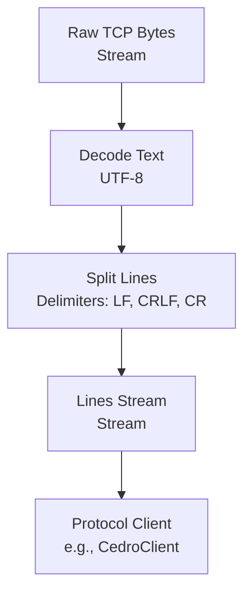
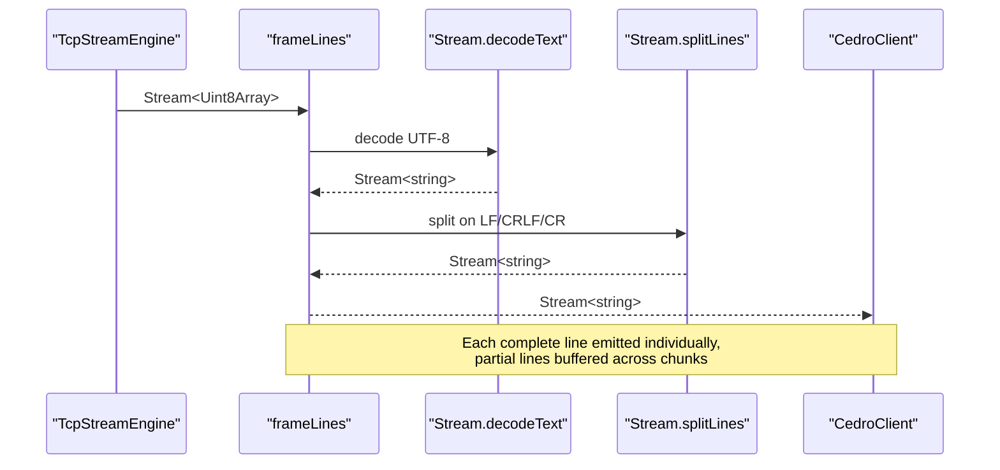
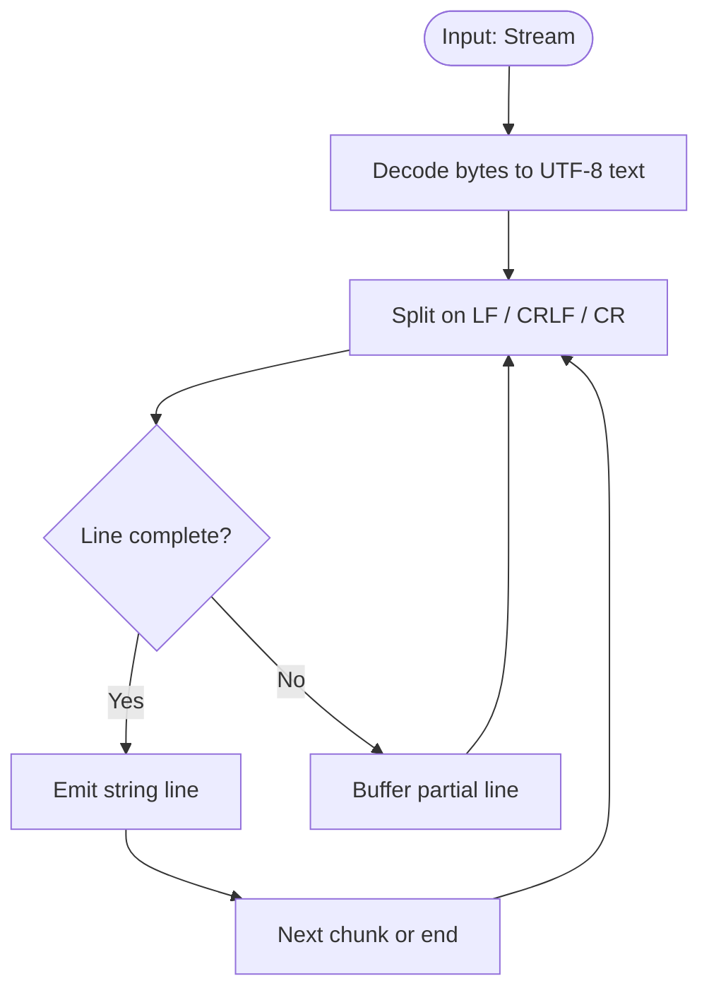
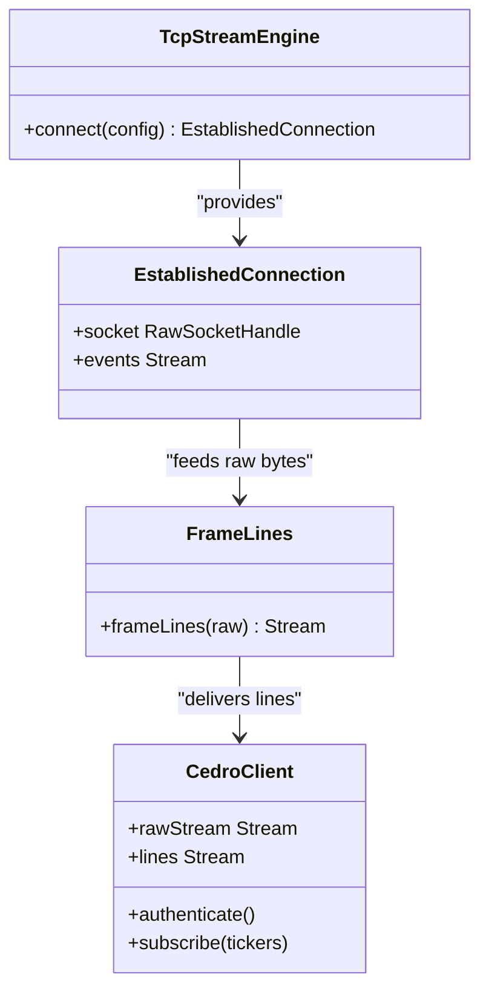
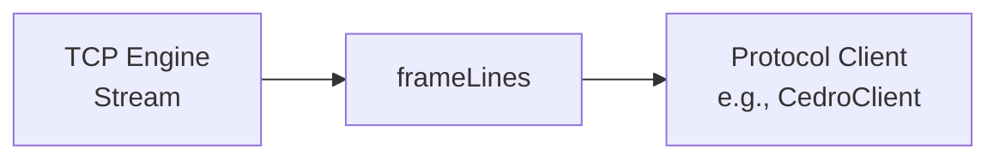

# Line Framing Utilities

<cite>
**Referenced Files in This Document**
- [line-framing.ts](file://packages/tcp/src/line-framing.ts)
- [line-framing.test.ts](file://packages/tcp/src/line-framing.test.ts)
- [cedro-protocol.ts](file://packages/tcp/src/cedro-protocol.ts)
- [tcp-stream-engine.ts](file://packages/tcp/src/tcp-stream-engine.ts)
- [tcp-connection.ts](file://packages/tcp/src/tcp-connection.ts)
</cite>

## Update Summary
**Changes Made**
- Updated all file references to reflect the new location of line framing utilities in `packages/tcp/src/`
- Maintained all existing functionality descriptions and architectural diagrams
- Updated source paths throughout the document to point to the correct file locations

## Table of Contents
1. [Introduction](#introduction)
2. [Project Structure](#project-structure)
3. [Core Components](#core-components)
4. [Architecture Overview](#architecture-overview)
5. [Detailed Component Analysis](#detailed-component-analysis)
6. [Dependency Analysis](#dependency-analysis)
7. [Performance Considerations](#performance-considerations)
8. [Troubleshooting Guide](#troubleshooting-guide)
9. [Conclusion](#conclusion)
10. [Appendices](#appendices)

## Introduction
This document explains the line framing utilities that transform a raw byte stream into text lines for text-based protocol communication. It covers delimiter detection, multi-packet reassembly, UTF-8 encoding handling across packet boundaries, buffer management strategies, error handling, and guidelines for extending the system to support different delimiters or encodings. It also includes performance guidance for high-throughput implementations and examples showing how to build custom text protocols on top of these utilities.

## Project Structure
The line framing functionality is implemented as a small, focused utility within the TCP package that composes Effect Stream transformations. It is used by higher-level protocol clients to obtain a stream of decoded, delimited text messages from raw TCP bytes.

**Diagram sources**
- [line-framing.ts:15-17](file://packages/tcp/src/line-framing.ts#L15-L17)
- [cedro-protocol.ts:84-89](file://packages/tcp/src/cedro-protocol.ts#L84-L89)

**Section sources**
- [line-framing.ts:1-18](file://packages/tcp/src/line-framing.ts#L1-L18)
- [cedro-protocol.ts:1-96](file://packages/tcp/src/cedro-protocol.ts#L1-L96)

## Core Components
- frameLines: A pure transformation that takes a stream of raw bytes and returns a stream of strings, one per line. It relies on two Effect Stream operations:
  - Decode bytes to UTF-8 text
  - Split on line delimiters (LF, CRLF, CR), preserving empty lines between delimiters

Key behaviors:
- Multi-packet reassembly: partial lines are buffered until a full line delimiter arrives
- Batched emission: multiple lines within a single chunk are emitted individually
- Delimiter support: LF, CRLF, and CR are all recognized
- Empty lines: preserved in output when present between consecutive delimiters
- Trailing content: if the stream ends without a final newline, the last fragment is emitted as a line

**Section sources**
- [line-framing.ts:3-17](file://packages/tcp/src/line-framing.ts#L3-L17)
- [line-framing.test.ts:13-87](file://packages/tcp/src/line-framing.test.ts#L13-L87)

## Architecture Overview
The line framing pipeline sits between the TCP transport layer and application protocols. The TCP engine provides a stream of raw bytes; the framing utility decodes and splits them into lines; protocol clients consume the line stream to parse domain-specific messages.

**Diagram sources**
- [tcp-stream-engine.ts:201-339](file://packages/tcp/src/tcp-stream-engine.ts#L201-L339)
- [line-framing.ts:15-17](file://packages/tcp/src/line-framing.ts#L15-L17)
- [cedro-protocol.ts:84-89](file://packages/tcp/src/cedro-protocol.ts#L84-L89)

## Detailed Component Analysis

### Line Framing Utility
- Purpose: Convert a raw byte stream into a stream of text lines with robust delimiter handling and multi-packet reassembly.
- Implementation approach: Compose two Effect Stream operators:
  - Decode bytes to UTF-8 text
  - Split on line delimiters (LF, CRLF, CR)
- Guarantees:
  - Correctly handles fragments crossing chunk boundaries
  - Emits each line individually even when multiple lines arrive in one chunk
  - Preserves empty lines between delimiters
  - Emits trailing content without a final newline at stream end

**Diagram sources**
- [line-framing.ts:15-17](file://packages/tcp/src/line-framing.ts#L15-L17)

**Section sources**
- [line-framing.ts:3-17](file://packages/tcp/src/line-framing.ts#L3-L17)
- [line-framing.test.ts:13-87](file://packages/tcp/src/line-framing.test.ts#L13-L87)

### Integration with TCP Transport
- The TCP engine exposes a raw byte stream and a send API. The framing utility consumes this stream to produce lines for protocol consumers.
- The Cedro client demonstrates usage by exposing both a raw byte stream and a framed line stream derived from the same underlying TCP stream.

**Diagram sources**
- [tcp-stream-engine.ts:40-47](file://packages/tcp/src/tcp-stream-engine.ts#L40-L47)
- [line-framing.ts:15-17](file://packages/tcp/src/line-framing.ts#L15-L17)
- [cedro-protocol.ts:22-33](file://packages/tcp/src/cedro-protocol.ts#L22-L33)

**Section sources**
- [tcp-stream-engine.ts:201-339](file://packages/tcp/src/tcp-stream-engine.ts#L201-L339)
- [cedro-protocol.ts:84-89](file://packages/tcp/src/cedro-protocol.ts#L84-L89)

### Example: Custom Text Protocol Using Line Framing
- Use the framed line stream to parse domain-specific messages. For example, a simple pipe-delimited protocol can be parsed by splitting each line into fields after receiving it from the line stream.
- The tests demonstrate framing of such messages arriving in single packets or fragmented across multiple TCP packets.

Guidelines:
- Consume the line stream provided by the framing utility
- Parse each line according to your protocol's grammar
- Handle errors per message, not per byte, since framing already ensures complete lines

**Section sources**
- [line-framing.test.ts:89-106](file://packages/tcp/src/line-framing.test.ts#L89-L106)
- [cedro-protocol.ts:44-82](file://packages/tcp/src/cedro-protocol.ts#L44-L82)

## Dependency Analysis
- The framing utility depends on Effect Stream primitives for decoding and splitting.
- Higher-level components depend on the framing utility to abstract away low-level buffering and delimiter logic.

**Diagram sources**
- [tcp-stream-engine.ts:201-339](file://packages/tcp/src/tcp-stream-engine.ts#L201-L339)
- [line-framing.ts:15-17](file://packages/tcp/src/line-framing.ts#L15-L17)
- [cedro-protocol.ts:84-89](file://packages/tcp/src/cedro-protocol.ts#L84-L89)

**Section sources**
- [line-framing.ts:1-18](file://packages/tcp/src/line-framing.ts#L1-L18)
- [cedro-protocol.ts:1-96](file://packages/tcp/src/cedro-protocol.ts#L1-L96)

## Performance Considerations
- Streaming composition: The framing utility uses streaming transforms, which process data incrementally without loading entire payloads into memory. This minimizes peak memory usage during high-throughput scenarios.
- Delimiter efficiency: Splitting on standard line delimiters (LF, CRLF, CR) avoids complex scanning and leverages optimized internal routines.
- Backpressure: Because the pipeline is built on streams, backpressure naturally flows from consumers to producers, preventing unbounded buffering when downstream processing is slower.
- Batched emissions: Multiple lines in a single chunk are emitted individually, reducing latency while avoiding per-byte overhead.
- Recommendations:
  - Keep consumer pipelines efficient to avoid bottlenecks that could cause upstream buffering
  - Avoid unnecessary conversions between text and binary unless required by your protocol
  - Monitor memory usage under load; adjust consumer throughput accordingly

[No sources needed since this section provides general guidance]

## Troubleshooting Guide
Common issues and how they are handled:

- Malformed messages:
  - If your protocol parser encounters invalid fields, surface a domain-specific error. The framing layer guarantees complete lines, so parsing errors should be localized to message semantics rather than fragmentation.
- Encoding issues:
  - The decoder expects valid UTF-8. Invalid sequences will propagate as stream errors. Ensure peers send valid UTF-8 or handle decode errors by closing or resetting the connection.
- Stream interruptions:
  - When the TCP stream closes or errors, the framing stream ends or fails accordingly. Consumers should handle stream termination gracefully and clean up resources.
- Mixed line endings:
  - The splitter supports LF, CRLF, and CR. If you see unexpected behavior, verify that your peer adheres to expected line ending conventions.

Operational tips:
- Log stream lifecycle events (open, data, drain, close, error) around the framing pipeline to diagnose connectivity issues
- Add metrics for line counts and sizes to detect anomalies early
- Implement retry/reconnect logic at the transport layer; keep framing stateless per stream

**Section sources**
- [tcp-stream-engine.ts:106-138](file://packages/tcp/src/tcp-stream-engine.ts#L106-L138)
- [tcp-stream-engine.ts:261-294](file://packages/tcp/src/tcp-stream-engine.ts#L261-L294)
- [line-framing.test.ts:48-68](file://packages/tcp/src/line-framing.test.ts#L48-L68)

## Conclusion
The line framing utilities provide a concise, robust foundation for text-based protocol communication over TCP. By leveraging streaming transforms, they ensure correct multi-packet reassembly, efficient buffer management, and clear separation between transport concerns and protocol parsing. Consumers can build custom protocols by parsing the resulting line stream, handling errors at the message level, and scaling efficiently under high throughput.

[No sources needed since this section summarizes without analyzing specific files]

## Appendices

### Extending the Framing System
- Different delimiters:
  - Replace the line-splitting step with a custom splitter that recognizes your protocol's delimiter(s). Maintain the same streaming composition pattern to preserve reassembly and backpressure characteristics.
- Different encodings:
  - Swap the UTF-8 decoder for another codec if your protocol requires a different character encoding. Validate that the chosen codec handles stream boundaries correctly and propagates errors appropriately.
- Combining steps:
  - You can compose additional transformations (e.g., trimming whitespace, normalizing line endings) before or after splitting, depending on protocol requirements.

[No sources needed since this section provides general guidance]