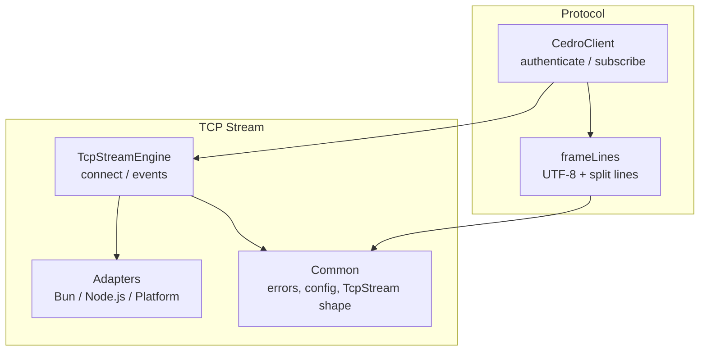
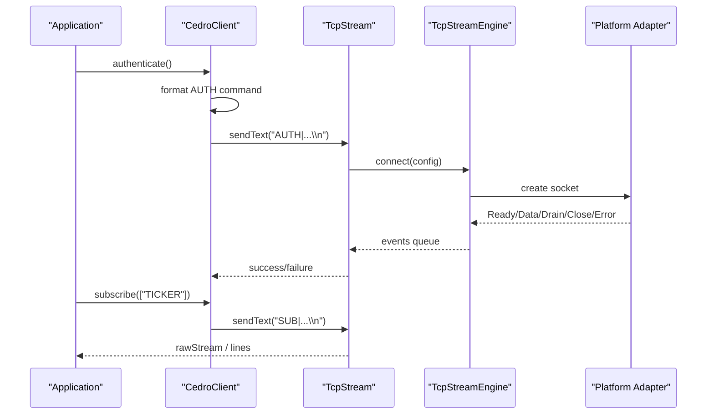
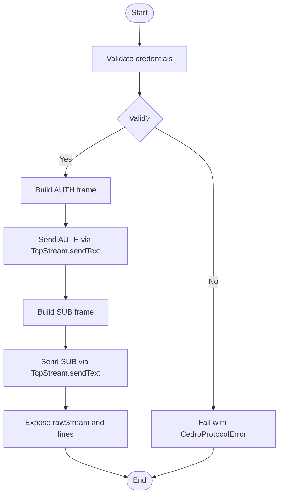
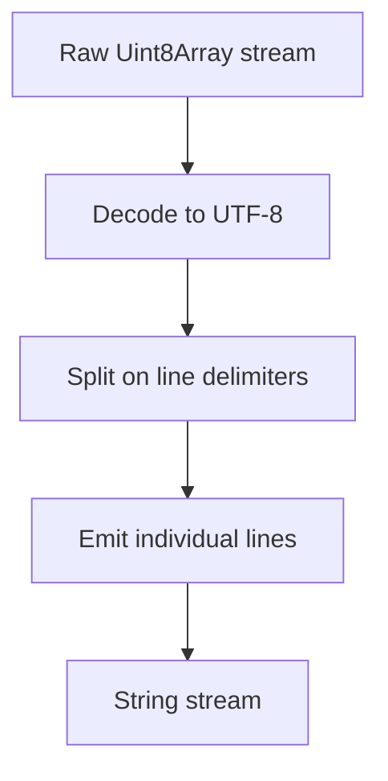
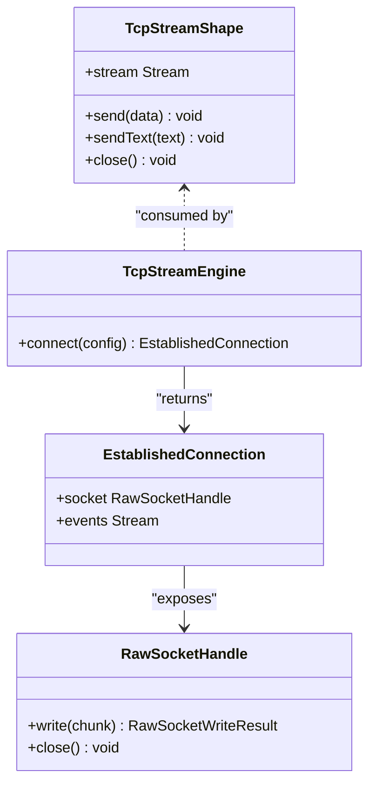
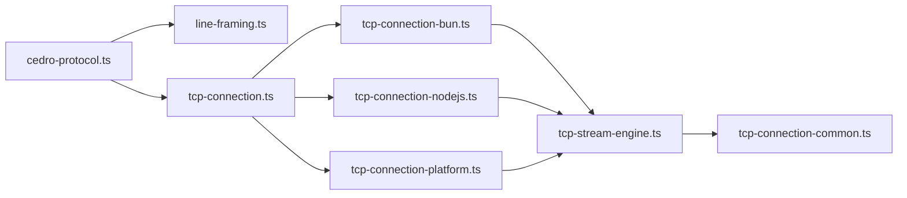

# Protocol Layer

<cite>
**Referenced Files in This Document**
- [cedro-protocol.ts](file://src/cedro-protocol.ts)
- [line-framing.ts](file://src/line-framing.ts)
- [tcp-stream-engine.ts](file://src/tcp-stream-engine.ts)
- [tcp-connection-common.ts](file://src/tcp-connection-common.ts)
- [tcp-connection-bun.ts](file://src/tcp-connection-bun.ts)
- [tcp-connection-nodejs.ts](file://src/tcp-connection-nodejs.ts)
- [tcp-connection-platform.ts](file://src/tcp-connection-platform.ts)
- [tcp-connection.ts](file://src/tcp-connection.ts)
- [cedro-protocol.test.ts](file://src/cedro-protocol.test.ts)
</cite>

## Table of Contents
1. Introduction
2. Project Structure
3. Core Components
4. Architecture Overview
5. Detailed Component Analysis
6. Dependency Analysis
7. Performance Considerations
8. Troubleshooting Guide
9. Conclusion
10. Appendices

## Introduction
This document specifies the protocol layer for the Cedro trading protocol client built on top of a unified TCP stream foundation. It covers:
- Authentication flow and subscription management
- Message formatting and line framing utilities (multi-packet reassembly, UTF-8 handling)
- Request/response patterns, error handling, and connection state management
- Extensibility guidelines to implement custom protocols over the TCP stream
- Testing strategies for protocol implementations

## Project Structure
The protocol layer is composed of:
- A high-level Cedro client that formats messages and orchestrates authentication and subscriptions
- A line framing utility that converts raw byte streams into text lines
- A platform-agnostic TCP stream engine with concrete adapters for Bun, Node.js, and Effect Platform
- Shared configuration, errors, and service contracts

**Diagram sources**
- [cedro-protocol.ts:40-90](file://src/cedro-protocol.ts#L40-L90)
- [line-framing.ts:3-17](file://src/line-framing.ts#L3-L17)
- [tcp-stream-engine.ts:89-178](file://src/tcp-stream-engine.ts#L89-L178)
- [tcp-connection-bun.ts:18-136](file://src/tcp-connection-bun.ts#L18-L136)
- [tcp-connection-nodejs.ts:21-119](file://src/tcp-connection-nodejs.ts#L21-L119)
- [tcp-connection-platform.ts:17-128](file://src/tcp-connection-platform.ts#L17-L128)
- [tcp-connection-common.ts:18-35](file://src/tcp-connection-common.ts#L18-L35)

**Section sources**
- [cedro-protocol.ts:1-96](file://src/cedro-protocol.ts#L1-L96)
- [line-framing.ts:1-18](file://src/line-framing.ts#L1-L18)
- [tcp-stream-engine.ts:1-359](file://src/tcp-stream-engine.ts#L1-L359)
- [tcp-connection-common.ts:1-101](file://src/tcp-connection-common.ts#L1-L101)
- [tcp-connection-bun.ts:1-145](file://src/tcp-connection-bun.ts#L1-L145)
- [tcp-connection-nodejs.ts:1-132](file://src/tcp-connection-nodejs.ts#L1-L132)
- [tcp-connection-platform.ts:1-135](file://src/tcp-connection-platform.ts#L1-L135)
- [tcp-connection.ts:1-10](file://src/tcp-connection.ts#L1-L10)

## Core Components
- CedroClient: Provides authenticate and subscribe operations, exposes raw bytes and framed text streams.
- Line Framing: Converts raw byte streams into UTF-8 decoded lines, handling multi-packet boundaries and multiple lines per chunk.
- TcpStreamEngine: Manages connection lifecycle, event dispatching, timeouts, retries, and write coordination.
- Adapters: Concrete socket implementations for Bun, Node.js, and Effect Platform.
- Common: Shared types, errors, configuration validation, and retry scheduling.

Key responsibilities:
- CedroClient composes message formatting and I/O via TcpStream.
- Line framing ensures robust parsing of text-based protocols.
- TcpStreamEngine abstracts platform differences while exposing a uniform API.

**Section sources**
- [cedro-protocol.ts:5-96](file://src/cedro-protocol.ts#L5-L96)
- [line-framing.ts:3-17](file://src/line-framing.ts#L3-L17)
- [tcp-stream-engine.ts:44-67](file://src/tcp-stream-engine.ts#L44-L67)
- [tcp-connection-common.ts:18-35](file://src/tcp-connection-common.ts#L18-L35)

## Architecture Overview
The Cedro client uses a layered architecture:
- Application code depends on CedroClient services
- CedroClient depends on TcpStream and CedroConfig
- TcpStream depends on TcpStreamEngine and ConnectionConfig
- TcpStreamEngine adapts to platform-specific sockets

**Diagram sources**
- [cedro-protocol.ts:40-90](file://src/cedro-protocol.ts#L40-L90)
- [tcp-stream-engine.ts:89-178](file://src/tcp-stream-engine.ts#L89-L178)
- [tcp-connection-bun.ts:18-136](file://src/tcp-connection-bun.ts#L18-L136)
- [tcp-connection-nodejs.ts:21-119](file://src/tcp-connection-nodejs.ts#L21-L119)
- [tcp-connection-platform.ts:17-128](file://src/tcp-connection-platform.ts#L17-L128)

## Detailed Component Analysis

### Cedro Protocol Client
Responsibilities:
- Validate credentials and build the AUTH frame
- Send AUTH and SUB frames over TCP
- Expose raw bytes and framed text streams for downstream processing

Message formatting:
- AUTH: includes magic token, username, password, terminated by newline
- SUB: comma-separated tickers, terminated by newline

Error handling:
- Missing credentials produce a domain-specific protocol error before any network I/O
- Network errors propagate as TcpStreamError from the underlying stream

Connection state:
- The client relies on TcpStream for connection lifecycle; it does not manage reconnection itself

**Diagram sources**
- [cedro-protocol.ts:44-82](file://src/cedro-protocol.ts#L44-L82)

**Section sources**
- [cedro-protocol.ts:5-96](file://src/cedro-protocol.ts#L5-L96)

### Line Framing Utilities
Purpose:
- Decode raw bytes to UTF-8 text
- Split into lines using standard delimiters (\n, \r\n, \r)
- Handle multi-packet reassembly and batched emissions

Behavior:
- Preserves empty lines between delimiters
- Emits each line individually even if multiple arrive in one chunk

Complexity:
- O(n) over input bytes for decoding and splitting
- Memory proportional to largest partial line buffered until delimiter

**Diagram sources**
- [line-framing.ts:3-17](file://src/line-framing.ts#L3-L17)

**Section sources**
- [line-framing.ts:1-18](file://src/line-framing.ts#L1-L18)

### TCP Stream Engine and Adapters
Core engine:
- Connects with timeout and optional retry schedule
- Normalizes platform events (Data, Drain, Close, Error) into a typed stream
- Coordinates writes with backpressure awareness and drain signals
- Maintains connection state and propagates failures

Adapters:
- Bun adapter: uses Bun.connect with binary mode, flushes writes, emits events
- Node.js adapter: uses node:net or node:tls, handles data/drain/close/error
- Platform adapter: uses Effect Platform’s Socket abstraction with TLS support

Write semantics:
- Writes may return zero bytes written; engine waits for drain before continuing
- Flushed flag indicates full delivery when available

**Diagram sources**
- [tcp-stream-engine.ts:28-67](file://src/tcp-stream-engine.ts#L28-L67)
- [tcp-stream-engine.ts:201-339](file://src/tcp-stream-engine.ts#L201-L339)

**Section sources**
- [tcp-stream-engine.ts:89-178](file://src/tcp-stream-engine.ts#L89-L178)
- [tcp-stream-engine.ts:201-339](file://src/tcp-stream-engine.ts#L201-L339)
- [tcp-connection-bun.ts:18-136](file://src/tcp-connection-bun.ts#L18-L136)
- [tcp-connection-nodejs.ts:21-119](file://src/tcp-connection-nodejs.ts#L21-L119)
- [tcp-connection-platform.ts:17-128](file://src/tcp-connection-platform.ts#L17-L128)

### Configuration and Errors
Configuration:
- Host and port are validated
- Optional TLS options supported across adapters
- Retry policy can be disabled or customized; default exponential backoff with jitter applies unless overridden
- Connect timeout enforced at engine level

Errors:
- TcpStreamError wraps operation, message, and cause
- ConnectionConfigError validates host/port
- CedroProtocolError represents protocol-level validation failures

**Section sources**
- [tcp-connection-common.ts:12-101](file://src/tcp-connection-common.ts#L12-L101)
- [tcp-stream-engine.ts:180-195](file://src/tcp-stream-engine.ts#L180-L195)
- [cedro-protocol.ts:5-8](file://src/cedro-protocol.ts#L5-L8)

## Dependency Analysis
High-level dependencies:
- cedro-protocol.ts depends on line-framing.ts and tcp-connection.ts (re-exported)
- tcp-connection.ts re-exports Bun implementation by default
- tcp-stream-engine.ts depends on tcp-connection-common.ts
- Adapters depend on tcp-stream-engine.ts and tcp-connection-common.ts

**Diagram sources**
- [cedro-protocol.ts:1-4](file://src/cedro-protocol.ts#L1-L4)
- [tcp-connection.ts:1-10](file://src/tcp-connection.ts#L1-L10)
- [tcp-stream-engine.ts:1-25](file://src/tcp-stream-engine.ts#L1-L25)
- [tcp-connection-bun.ts:1-17](file://src/tcp-connection-bun.ts#L1-L17)
- [tcp-connection-nodejs.ts:1-18](file://src/tcp-connection-nodejs.ts#L1-L18)
- [tcp-connection-platform.ts:1-15](file://src/tcp-connection-platform.ts#L1-L15)

**Section sources**
- [cedro-protocol.ts:1-4](file://src/cedro-protocol.ts#L1-L4)
- [tcp-connection.ts:1-10](file://src/tcp-connection.ts#L1-L10)
- [tcp-stream-engine.ts:1-25](file://src/tcp-stream-engine.ts#L1-L25)

## Performance Considerations
- Line framing decodes once and splits efficiently; avoid redundant decoding in higher layers
- Backpressure: engine respects drain signals; ensure producers respect stream consumption
- Retries: configure retry schedules appropriate for your environment to avoid thundering herds
- TLS overhead: prefer connection reuse where possible; minimize frequent reconnects
- Buffer sizes: large messages increase memory usage during reassembly; consider batching or chunking strategies

[No sources needed since this section provides general guidance]

## Troubleshooting Guide
Common issues and remedies:
- Missing credentials: authenticate fails early with a protocol error; validate configuration before connecting
- Connection timeout: engine enforces connectTimeout; adjust configuration or network settings
- Write stalls: engine waits for drain; verify consumer is reading from streams and not blocking
- Unexpected close: inspect error stream; handle TcpStreamError with operation context
- Encoding issues: ensure consumers decode only once; rely on frameLines for consistent UTF-8 handling

Validation and diagnostics:
- Use ConnectionConfigLive to pin host/port and disable retries during tests
- Inspect rawStream for raw bytes; use lines for text-oriented debugging
- Leverage test suites to assert both sent frames and received acknowledgements

**Section sources**
- [cedro-protocol.test.ts:10-64](file://src/cedro-protocol.test.ts#L10-L64)
- [cedro-protocol.test.ts:66-109](file://src/cedro-protocol.test.ts#L66-L109)
- [tcp-stream-engine.ts:180-195](file://src/tcp-stream-engine.ts#L180-L195)
- [tcp-connection-common.ts:62-88](file://src/tcp-connection-common.ts#L62-L88)

## Conclusion
The Cedro protocol layer provides a clean, composable client over a robust TCP stream foundation. It separates concerns across message formatting, line framing, and platform-agnostic networking. With clear error modeling, configurable retries, and comprehensive testing, it supports reliable integration with trading systems and serves as a template for extending to other text-based protocols.

[No sources needed since this section summarizes without analyzing specific files]

## Appendices

### Authentication Flow
- Validate credentials locally and construct AUTH frame
- Send AUTH via TcpStream.sendText
- Await server response through rawStream or lines

**Section sources**
- [cedro-protocol.ts:44-65](file://src/cedro-protocol.ts#L44-L65)
- [cedro-protocol.test.ts:10-64](file://src/cedro-protocol.test.ts#L10-L64)

### Subscription Management
- Validate ticker list and construct SUB frame
- Send SUB via TcpStream.sendText
- Consume incoming updates via lines stream

**Section sources**
- [cedro-protocol.ts:67-82](file://src/cedro-protocol.ts#L67-L82)
- [cedro-protocol.test.ts:10-64](file://src/cedro-protocol.test.ts#L10-L64)

### Message Formatting Specification
- AUTH: fields separated by pipe characters, terminated by newline
- SUB: comma-separated ticker list, terminated by newline
- All frames are UTF-8 encoded text lines

**Section sources**
- [cedro-protocol.ts:44-82](file://src/cedro-protocol.ts#L44-L82)

### Request/Response Patterns
- The client sends commands and consumes responses from the same stream
- For synchronous acknowledgment, read from rawStream or lines after sending
- For asynchronous updates, continuously consume lines

**Section sources**
- [cedro-protocol.test.ts:10-64](file://src/cedro-protocol.test.ts#L10-L64)

### Extending the Protocol Layer
To implement a new protocol:
- Define a new client service similar to CedroClient with methods for your commands
- Reuse frameLines for text-based framing
- Compose with TcpStreamLayer and ConnectionConfigLive
- Add validation and error modeling akin to CedroProtocolError

Example steps:
- Create a new module exporting a Service and makeXxxClient function
- Format commands using Result for pre-I/O validation
- Expose rawStream and lines for consumers
- Provide Live layers for dependency injection

**Section sources**
- [cedro-protocol.ts:17-38](file://src/cedro-protocol.ts#L17-L38)
- [tcp-stream-engine.ts:341-359](file://src/tcp-stream-engine.ts#L341-L359)
- [tcp-connection-common.ts:45-60](file://src/tcp-connection-common.ts#L45-L60)

### Testing Strategies
- Spin up an in-process server that echoes or acknowledges frames
- Compose layers with TcpStreamLive and ConnectionConfigLive
- Assert sent frames by capturing server-side received data
- Verify error paths by providing invalid configurations

**Section sources**
- [cedro-protocol.test.ts:10-64](file://src/cedro-protocol.test.ts#L10-L64)
- [cedro-protocol.test.ts:66-109](file://src/cedro-protocol.test.ts#L66-L109)