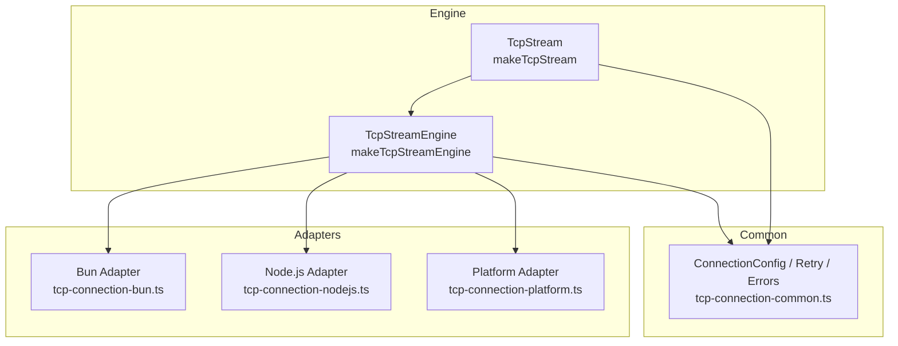
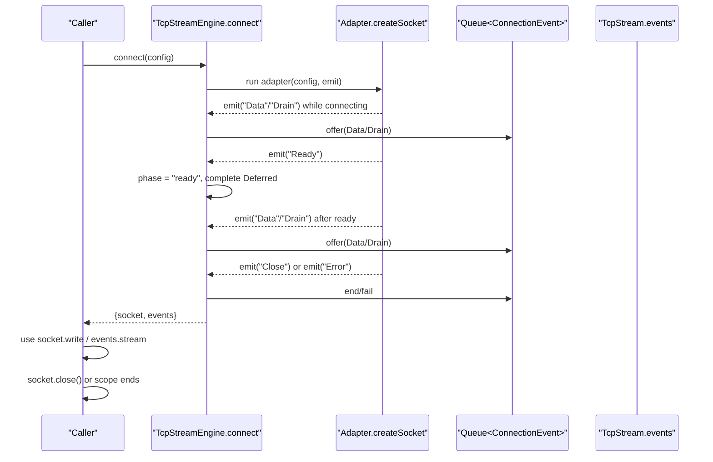
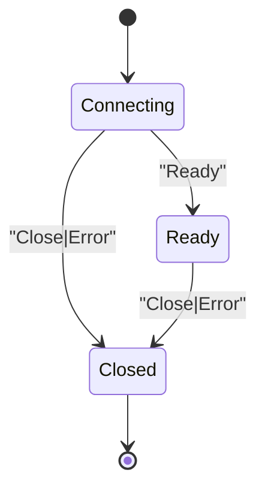
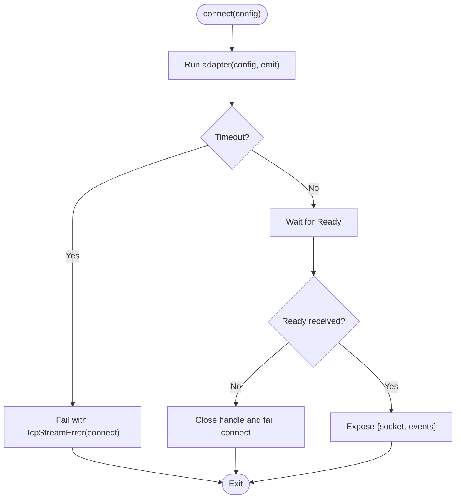
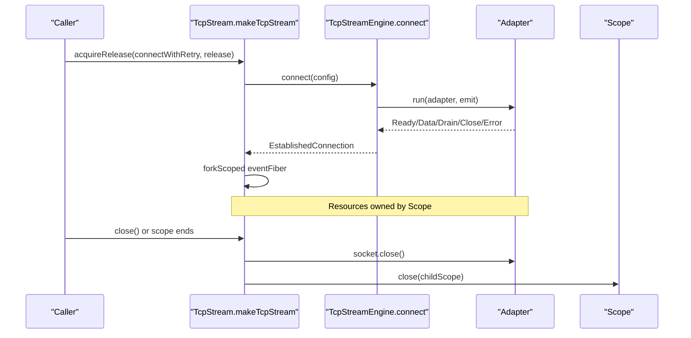
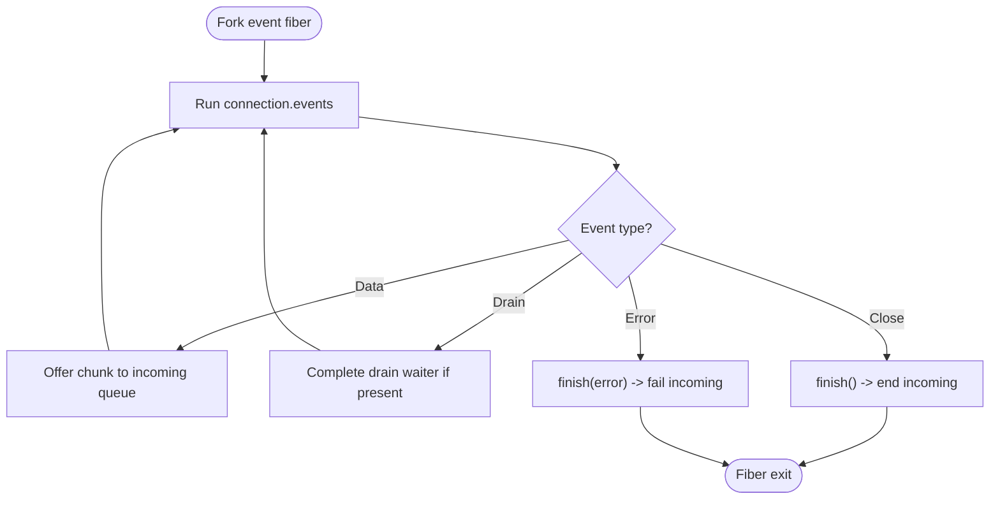
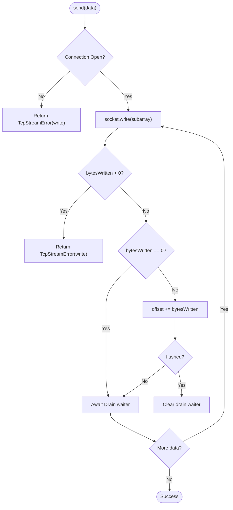
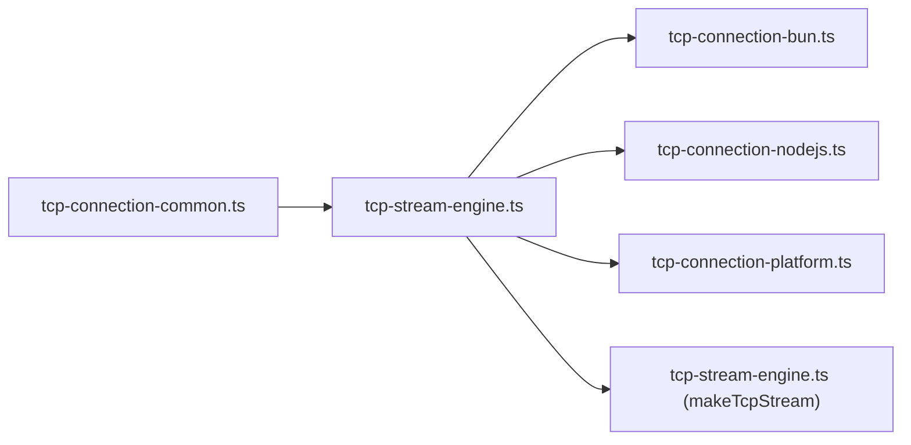

# Connection Lifecycle Management

<cite>
**Referenced Files in This Document**
- [tcp-stream-engine.ts](file://src/tcp-stream-engine.ts)
- [tcp-connection-common.ts](file://src/tcp-connection-common.ts)
- [tcp-connection-bun.ts](file://src/tcp-connection-bun.ts)
- [tcp-connection-nodejs.ts](file://src/tcp-connection-nodejs.ts)
- [tcp-connection-platform.ts](file://src/tcp-connection-platform.ts)
- [tcp-stream-engine.test.ts](file://src/tcp-stream-engine.test.ts)
- [tcp-connection-test-suite.ts](file://src/tcp-connection-test-suite.ts)
- [0006-scope-owned-platform-engine-lifecycle.md](file://docs/adr/0006-scope-owned-platform-engine-lifecycle.md)
- [0007-interruption-safe-engine-connect.md](file://docs/adr/0007-interruption-safe-engine-connect.md)
</cite>

## Table of Contents
1. [Introduction](#introduction)
2. [Project Structure](#project-structure)
3. [Core Components](#core-components)
4. [Architecture Overview](#architecture-overview)
5. [Detailed Component Analysis](#detailed-component-analysis)
6. [Dependency Analysis](#dependency-analysis)
7. [Performance Considerations](#performance-considerations)
8. [Troubleshooting Guide](#troubleshooting-guide)
9. [Conclusion](#conclusion)
10. [Appendices](#appendices)

## Introduction
This document explains connection lifecycle management in the TCP Stream Engine with a focus on the state machine (connecting, ready, closed), connection establishment procedures, resource acquisition and release patterns, cleanup mechanisms, scope-based resource management, fiber lifecycle coordination, and error handling across lifecycle phases. It also provides code example references for creating connections, monitoring states, and disposing resources safely.

## Project Structure
The TCP Stream Engine is implemented as a layered system:
- A platform-agnostic engine orchestrates connection attempts, events, timeouts, retries, and scoped teardown.
- Platform adapters implement the low-level socket creation and event emission for Bun, Node.js, and a generic platform abstraction.
- A shared common module defines configuration, errors, and retry scheduling utilities.
- Tests validate lifecycle behaviors such as readiness, close idempotency, interruption safety, and clean stream termination.

**Diagram sources**
- [tcp-stream-engine.ts:89-178](file://src/tcp-stream-engine.ts#L89-L178)
- [tcp-connection-bun.ts:18-135](file://src/tcp-connection-bun.ts#L18-L135)
- [tcp-connection-nodejs.ts:21-114](file://src/tcp-connection-nodejs.ts#L21-L114)
- [tcp-connection-platform.ts:17-128](file://src/tcp-connection-platform.ts#L17-L128)
- [tcp-connection-common.ts:12-100](file://src/tcp-connection-common.ts#L12-L100)

**Section sources**
- [tcp-stream-engine.ts:89-178](file://src/tcp-stream-engine.ts#L89-L178)
- [tcp-connection-common.ts:12-100](file://src/tcp-connection-common.ts#L12-L100)

## Core Components
- TcpStreamEngineShape and makeTcpStreamEngine: define connect(config) returning an EstablishedConnection with a RawSocketHandle and a Stream of ConnectionEvent. The engine maintains a local phase variable transitioning through connecting → ready → closed and coordinates events via a queue and Deferred.
- RawSocketHandle: abstracts write(chunk) and close() for each adapter.
- TcpStream: higher-level API that wraps an EstablishedConnection into a stream-oriented interface with send, sendText, and close, plus a background fiber to forward incoming data and handle drain/close/error signals.
- Adapters: Bun, Node.js, and Platform implementations provide createSocket logic and emit Ready/Data/Drain/Close/Error events to the engine.
- Common: ConnectionConfig, TcpStreamError, retry policy helpers, and validation utilities.

Key responsibilities:
- Engine: state transitions, timeout enforcement, retry orchestration, event routing, and safe close semantics.
- Adapters: manage OS/Bun sockets, translate native events to engine events, and ensure cleanup on cancellation/interruption.
- TcpStream: user-facing API with acquire/release semantics, backpressure handling, and graceful shutdown.

**Section sources**
- [tcp-stream-engine.ts:28-79](file://src/tcp-stream-engine.ts#L28-L79)
- [tcp-stream-engine.ts:89-178](file://src/tcp-stream-engine.ts#L89-L178)
- [tcp-stream-engine.ts:201-341](file://src/tcp-stream-engine.ts#L201-L341)
- [tcp-connection-common.ts:12-100](file://src/tcp-connection-common.ts#L12-L100)

## Architecture Overview
The engine uses a caller-first, scope-bound lifecycle:
- connect(config) runs an adapter-supplied effect under a connect timeout.
- While connecting, events are buffered until Ready; after Ready, Data/Drain flow through a queue; Close or Error terminate the session.
- On failure before Ready, the attempt’s handle is closed and the engine fails with a connect error.
- After Ready, errors are classified as read failures.
- TcpStream wraps the connection with acquireRelease, ensuring the underlying socket closes when the scope ends or close() is called.

**Diagram sources**
- [tcp-stream-engine.ts:92-178](file://src/tcp-stream-engine.ts#L92-L178)
- [tcp-connection-bun.ts:57-123](file://src/tcp-connection-bun.ts#L57-L123)
- [tcp-connection-nodejs.ts:74-101](file://src/tcp-connection-nodejs.ts#L74-L101)
- [tcp-connection-platform.ts:51-119](file://src/tcp-connection-platform.ts#L51-L119)

## Detailed Component Analysis

### State Machine and Phases
- Phases:
  - connecting: initial state; only Ready can transition to ready; Data/Drain are buffered; Close/Error move to closed.
  - ready: normal operation; Data/Drain pass through; Close/Error move to closed.
  - closed: terminal; all subsequent emits return "closed".
- Transitions:
  - Ready: connecting → ready; sets isReady and completes the ready Deferred.
  - Data/Drain: enqueued regardless of phase (buffered during connecting).
  - Close: phase → closed; ends the queue.
  - Error: phase → closed; fails the ready Deferred if not yet done; fails the queue; marks outcome to prevent further processing.

**Diagram sources**
- [tcp-stream-engine.ts:99-138](file://src/tcp-stream-engine.ts#L99-L138)

**Section sources**
- [tcp-stream-engine.ts:92-178](file://src/tcp-stream-engine.ts#L92-L178)

### Connection Establishment Procedures
- Timeout: withConnectTimeout wraps the adapter effect, failing with a TcpStreamError on timeout.
- Readiness gating: the engine waits for Ready before exposing the connection; if the adapter closes before Ready, the engine closes the handle and fails with a connect error.
- Retry: TcpStream optionally retries the entire connect sequence using a configurable schedule.

**Diagram sources**
- [tcp-stream-engine.ts:140-178](file://src/tcp-stream-engine.ts#L140-L178)
- [tcp-stream-engine.ts:180-195](file://src/tcp-stream-engine.ts#L180-L195)

**Section sources**
- [tcp-stream-engine.ts:140-195](file://src/tcp-stream-engine.ts#L140-L195)

### Resource Acquisition and Release Patterns
- Scope ownership:
  - Platform adapter forks a child scope from the ambient scope to own per-attempt resources; closing the parent closes the child, and closing the child detaches it.
  - Bun and Node.js adapters implement cancellation hooks to avoid leaks when interrupted mid-connect.
- Acquire/Release:
  - TcpStream uses Effect.acquireRelease around the connect-and-retry sequence with interruptible: true, ensuring the socket is closed on success or failure, including interruptions.
- Idempotent close:
  - Engine close is idempotent; multiple calls do nothing after the first.
  - Adapters guard against double-close and late callbacks.

**Diagram sources**
- [tcp-stream-engine.ts:252-299](file://src/tcp-stream-engine.ts#L252-L299)
- [tcp-connection-platform.ts:51-119](file://src/tcp-connection-platform.ts#L51-L119)
- [tcp-connection-bun.ts:18-135](file://src/tcp-connection-bun.ts#L18-L135)
- [tcp-connection-nodejs.ts:21-114](file://src/tcp-connection-nodejs.ts#L21-L114)

**Section sources**
- [tcp-stream-engine.ts:252-299](file://src/tcp-stream-engine.ts#L252-L299)
- [0006-scope-owned-platform-engine-lifecycle.md:24-63](file://docs/adr/0006-scope-owned-platform-engine-lifecycle.md#L24-L63)
- [0007-interruption-safe-engine-connect.md:17-29](file://docs/adr/0007-interruption-safe-engine-connect.md#L17-L29)

### Fiber Lifecycle Coordination
- Event fiber:
  - TcpStream forks a scoped fiber to run the connection events stream.
  - On success or interruption, it finishes the incoming queue cleanly.
  - On failure, it converts the cause to a TcpStreamError and fails the incoming queue.
- Drain handling:
  - When the adapter emits Drain, any waiting writer is completed so it can resume writing.
- Interruptibility:
  - acquireRelease is configured with interruptible: true so backoff sleeps and connect attempts can be cancelled promptly.

**Diagram sources**
- [tcp-stream-engine.ts:261-294](file://src/tcp-stream-engine.ts#L261-L294)

**Section sources**
- [tcp-stream-engine.ts:261-294](file://src/tcp-stream-engine.ts#L261-L294)

### Error Handling During Lifecycle Phases
- Before Ready:
  - Any error or early close results in a connect error; the handle is closed and the ready Deferred is failed.
- After Ready:
  - Errors are classified as read failures and surfaced on the events stream.
- Timeouts:
  - Connect timeout wraps the adapter effect and maps non-TcpStreamError causes to TcpStreamError(connect).
- Write path:
  - Writes check current state; if closed, returns a TcpStreamError(write).
  - If bytesWritten is negative, returns a write error; if zero, waits for Drain before continuing.

**Diagram sources**
- [tcp-stream-engine.ts:300-332](file://src/tcp-stream-engine.ts#L300-L332)

**Section sources**
- [tcp-stream-engine.ts:140-178](file://src/tcp-stream-engine.ts#L140-L178)
- [tcp-stream-engine.ts:300-332](file://src/tcp-stream-engine.ts#L300-L332)

### Code Examples and Usage References
- Creating a connection with retry and timeout:
  - See [tcp-stream-engine.ts:252-260](file://src/tcp-stream-engine.ts#L252-L260) for acquireRelease around connect with optional retry.
- Monitoring connection states:
  - Observe events via connection.events stream; see [tcp-stream-engine.ts:170-176](file://src/tcp-stream-engine.ts#L170-L176).
- Proper disposal patterns:
  - Use TcpStream.close or rely on scope finalization; see [tcp-stream-engine.ts:295-299](file://src/tcp-stream-engine.ts#L295-L299).
- Adapter-specific setup:
  - Bun: [tcp-connection-bun.ts:57-123](file://src/tcp-connection-bun.ts#L57-L123)
  - Node.js: [tcp-connection-nodejs.ts:74-101](file://src/tcp-connection-nodejs.ts#L74-L101)
  - Platform: [tcp-connection-platform.ts:51-119](file://src/tcp-connection-platform.ts#L51-L119)

**Section sources**
- [tcp-stream-engine.ts:170-176](file://src/tcp-stream-engine.ts#L170-L176)
- [tcp-stream-engine.ts:252-260](file://src/tcp-stream-engine.ts#L252-L260)
- [tcp-stream-engine.ts:295-299](file://src/tcp-stream-engine.ts#L295-L299)
- [tcp-connection-bun.ts:57-123](file://src/tcp-connection-bun.ts#L57-L123)
- [tcp-connection-nodejs.ts:74-101](file://src/tcp-connection-nodejs.ts#L74-L101)
- [tcp-connection-platform.ts:51-119](file://src/tcp-connection-platform.ts#L51-L119)

## Dependency Analysis
- Engine depends on:
  - Common: ConnectionConfig, TcpStreamError, retry schedule builder.
  - Adapters: RawSocketHandle and event emission contract.
- Adapters depend on:
  - Engine: makeTcpStreamEngine and types.
  - Platform-specific libraries: Bun Socket, Node net/tls, or @effect/platform-bun Socket.
- TcpStream depends on:
  - Engine for connect and raw events.
  - Common for config and errors.

**Diagram sources**
- [tcp-stream-engine.ts:1-26](file://src/tcp-stream-engine.ts#L1-L26)
- [tcp-connection-common.ts:12-100](file://src/tcp-connection-common.ts#L12-L100)
- [tcp-connection-bun.ts:1-17](file://src/tcp-connection-bun.ts#L1-L17)
- [tcp-connection-nodejs.ts:1-18](file://src/tcp-connection-nodejs.ts#L1-L18)
- [tcp-connection-platform.ts:1-15](file://src/tcp-connection-platform.ts#L1-L15)

**Section sources**
- [tcp-stream-engine.ts:1-26](file://src/tcp-stream-engine.ts#L1-L26)
- [tcp-connection-common.ts:12-100](file://src/tcp-connection-common.ts#L12-L100)

## Performance Considerations
- Backpressure:
  - Writes wait for Drain when the underlying buffer is full; this prevents unbounded memory growth.
- Concurrency:
  - A semaphore serializes writes to avoid interleaving partial sends.
- Timeouts and retries:
  - Configurable connectTimeout and retry schedules bound worst-case latency and resource usage.
- Event buffering:
  - Events emitted before Ready are buffered in a queue; keep consumers responsive to avoid queue buildup.

[No sources needed since this section provides general guidance]

## Troubleshooting Guide
- Connection never becomes ready:
  - Verify connectTimeout and adapter readiness; see [tcp-stream-engine.ts:140-158](file://src/tcp-stream-engine.ts#L140-L158).
- Unexpected stream failure after Ready:
  - Errors post-Ready are classified as read; inspect events stream for TcpStreamError(read); see [tcp-stream-engine.ts:125-135](file://src/tcp-stream-engine.ts#L125-L135).
- Hanging on close:
  - Ensure close is idempotent and adapter handles double-close; see [tcp-stream-engine.ts:159-174](file://src/tcp-stream-engine.ts#L159-L174) and adapter close implementations.
- Leaks on interruption:
  - Confirm acquireRelease is used with interruptible: true and adapters implement cancellation hooks; see [0006-scope-owned-platform-engine-lifecycle.md:48-63](file://docs/adr/0006-scope-owned-platform-engine-lifecycle.md#L48-L63) and [0007-interruption-safe-engine-connect.md:17-29](file://docs/adr/0007-interruption-safe-engine-connect.md#L17-L29).

**Section sources**
- [tcp-stream-engine.ts:125-135](file://src/tcp-stream-engine.ts#L125-L135)
- [tcp-stream-engine.ts:140-158](file://src/tcp-stream-engine.ts#L140-L158)
- [tcp-stream-engine.ts:159-174](file://src/tcp-stream-engine.ts#L159-L174)
- [0006-scope-owned-platform-engine-lifecycle.md:48-63](file://docs/adr/0006-scope-owned-platform-engine-lifecycle.md#L48-L63)
- [0007-interruption-safe-engine-connect.md:17-29](file://docs/adr/0007-interruption-safe-engine-connect.md#L17-L29)

## Conclusion
The TCP Stream Engine implements a robust, scope-bound connection lifecycle with clear phases and disciplined resource management. The engine centralizes state transitions, timeouts, retries, and event routing, while adapters encapsulate platform specifics and ensure safe cleanup. TcpStream provides a high-level, ergonomic API with reliable backpressure and graceful shutdown. Together, these components deliver predictable behavior under normal operations, failures, and interruptions.

[No sources needed since this section summarizes without analyzing specific files]

## Appendices

### Example References
- Create a connection with retry and timeout:
  - [tcp-stream-engine.ts:252-260](file://src/tcp-stream-engine.ts#L252-L260)
- Monitor connection events:
  - [tcp-stream-engine.ts:170-176](file://src/tcp-stream-engine.ts#L170-L176)
- Dispose resources:
  - [tcp-stream-engine.ts:295-299](file://src/tcp-stream-engine.ts#L295-L299)
- Validate configuration and build retry schedule:
  - [tcp-connection-common.ts:85-100](file://src/tcp-connection-common.ts#L85-L100)

**Section sources**
- [tcp-stream-engine.ts:170-176](file://src/tcp-stream-engine.ts#L170-L176)
- [tcp-stream-engine.ts:252-260](file://src/tcp-stream-engine.ts#L252-L260)
- [tcp-stream-engine.ts:295-299](file://src/tcp-stream-engine.ts#L295-L299)
- [tcp-connection-common.ts:85-100](file://src/tcp-connection-common.ts#L85-L100)