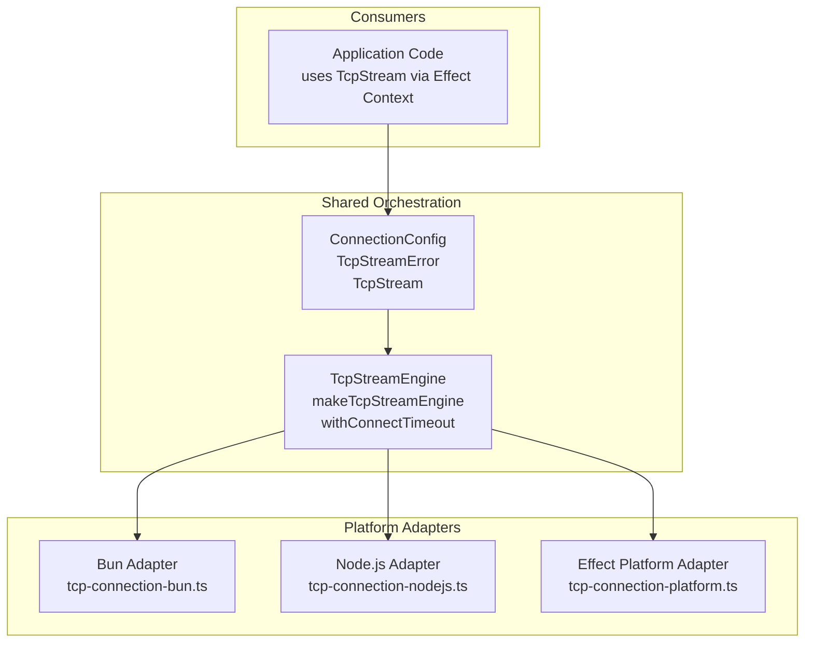
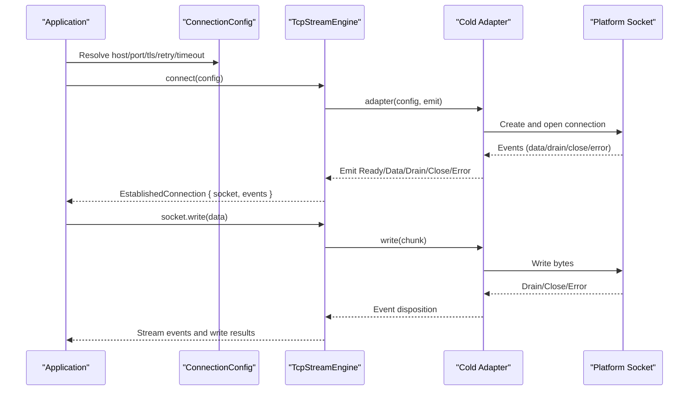
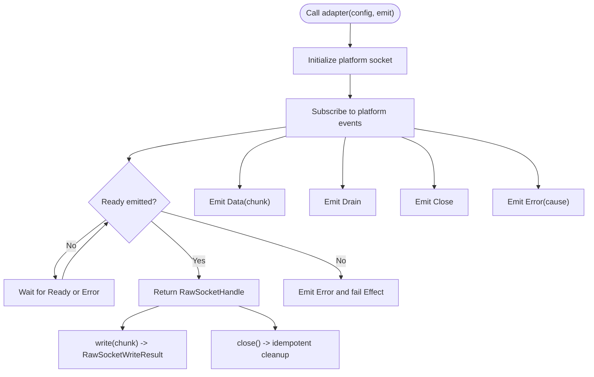
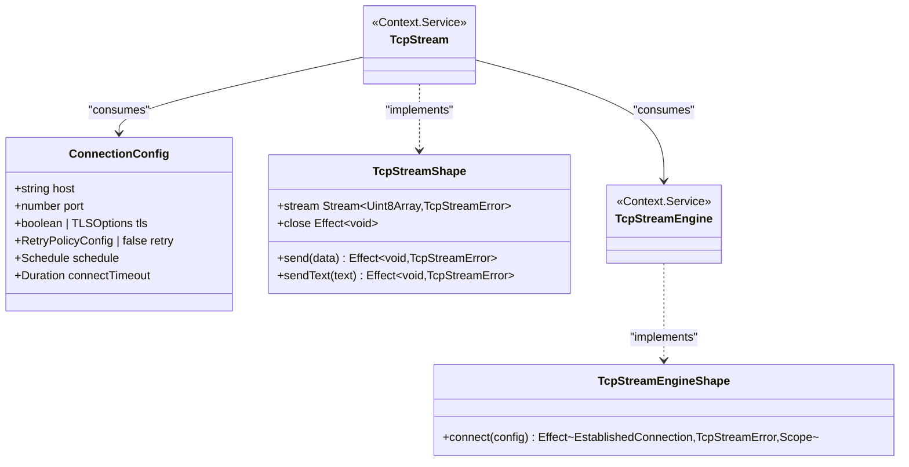
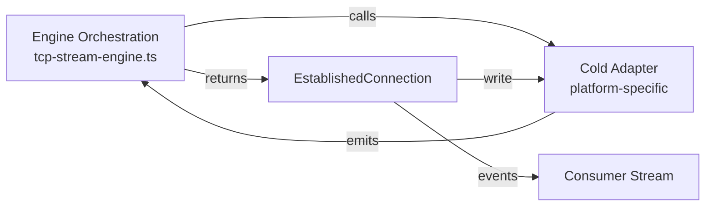
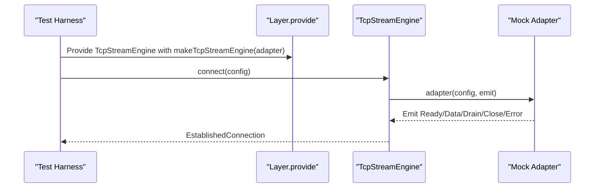
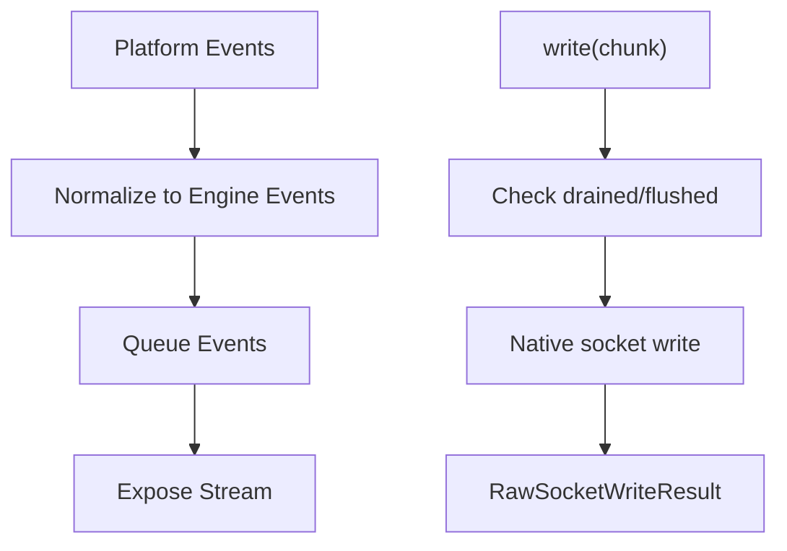
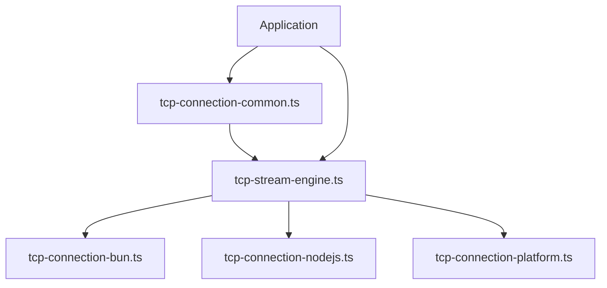

# Engine Architecture and Design

<cite>
**Referenced Files in This Document**
- [tcp-stream-engine.ts](file://packages/tcp/src/tcp-stream-engine.ts)
- [tcp-connection-common.ts](file://packages/tcp/src/tcp-connection-common.ts)
- [tcp-connection-bun.ts](file://packages/tcp/src/tcp-connection-bun.ts)
- [tcp-connection-nodejs.ts](file://packages/tcp/src/tcp-connection-nodejs.ts)
- [tcp-connection-platform.ts](file://packages/tcp/src/tcp-connection-platform.ts)
- [tcp-stream-engine.test.ts](file://packages/tcp/src/tcp-stream-engine.test.ts)
- [0002-unified-tcp-stream-engine-adapter-seam.md](file://docs/adr/0002-unified-tcp-stream-engine-adapter-seam.md)
- [0001-direct-engine-socket-wrappers.md](file://docs/adr/0001-direct-engine-socket-wrappers.md)
- [0008-caller-first-tcp-stream-engine.md](file://docs/adr/0008-caller-first-tcp-stream-engine.md)
</cite>

## Update Summary
**Changes Made**
- Updated all file path references from `src/` to `packages/tcp/src/` to reflect the successful migration of TCP stream engine files
- Maintained identical functionality and architecture while updating location references
- Verified all component relationships and dependencies remain unchanged

## Table of Contents
1. [Introduction](#introduction)
2. [Project Structure](#project-structure)
3. [Core Components](#core-components)
4. [Architecture Overview](#architecture-overview)
5. [Detailed Component Analysis](#detailed-component-analysis)
6. [Dependency Analysis](#dependency-analysis)
7. [Performance Considerations](#performance-considerations)
8. [Troubleshooting Guide](#troubleshooting-guide)
9. [Conclusion](#conclusion)

## Introduction
This document explains the TCP Stream Engine architecture with a focus on design patterns, system boundaries, and cross-platform compatibility. The engine uses a cold adapter protocol to abstract platform-specific socket implementations behind a unified interface. It follows a service-oriented architecture built on Effect Context and Layer, separating orchestration from runtime-specific adapters. The adapter seam defines a small, stable contract that enables dependency injection, testability, and portability across Bun, Node.js, and other platforms.

## Project Structure
The TCP stream subsystem is organized around three layers within the `packages/tcp/src/` directory:
- Shared orchestration and public API: `TcpStream` service, configuration, retry policies, and error types.
- Engine core: caller-first connection lifecycle, event queueing, backpressure handling, timeouts, and retry composition.
- Platform adapters: thin implementations for Bun, Node.js, and an Effect Platform-based socket path.

**Diagram sources**
- [tcp-stream-engine.ts:64-67](file://packages/tcp/src/tcp-stream-engine.ts#L64-L67)
- [tcp-stream-engine.ts:88-178](file://packages/tcp/src/tcp-stream-engine.ts#L88-L178)
- [tcp-connection-common.ts:18-35](file://packages/tcp/src/tcp-connection-common.ts#L18-L35)
- [tcp-connection-bun.ts:18-135](file://packages/tcp/src/tcp-connection-bun.ts#L18-L135)
- [tcp-connection-nodejs.ts:21-118](file://packages/tcp/src/tcp-connection-nodejs.ts#L21-L118)
- [tcp-connection-platform.ts:17-128](file://packages/tcp/src/tcp-connection-platform.ts#L17-L128)

**Section sources**
- [tcp-stream-engine.ts:64-67](file://packages/tcp/src/tcp-stream-engine.ts#L64-L67)
- [tcp-connection-common.ts:18-35](file://packages/tcp/src/tcp-connection-common.ts#L18-L35)
- [0002-unified-tcp-stream-engine-adapter-seam.md:12-30](file://docs/adr/0002-unified-tcp-stream-engine-adapter-seam.md#L12-L30)

## Core Components
- TcpStreamService: Public service shape exposing a pull-based data stream, send operations, and close semantics.
- ConnectionConfig: Typed configuration for host, port, TLS options, retry policy, and connect timeout.
- TcpStreamEngine: Service tag and shape defining a single-attempt connect operation returning an established connection handle and ordered events.
- Cold Adapter Protocol: A function type that accepts configuration and an event emitter, returning a RawSocketHandle after readiness.

Key responsibilities:
- Orchestration: Connect lifecycle, readiness gating, event ordering, backpressure drain handling, retry scheduling, and timeout enforcement.
- Abstraction: Hides platform differences behind a minimal adapter seam.
- Composition: Uses Effect Context and Layer for dependency injection and environment setup.

**Section sources**
- [tcp-connection-common.ts:18-35](file://packages/tcp/src/tcp-connection-common.ts#L18-L35)
- [tcp-connection-common.ts:45-60](file://packages/tcp/src/tcp-connection-common.ts#L45-L60)
- [tcp-stream-engine.ts:40-67](file://packages/tcp/src/tcp-stream-engine.ts#L40-L67)
- [tcp-stream-engine.ts:69-79](file://packages/tcp/src/tcp-stream-engine.ts#L69-L79)

## Architecture Overview
The system separates concerns into clear boundaries:
- Application code depends only on TcpStream and ConnectionConfig services.
- The engine owns the caller-first connect attempt, event queue, and session lifecycle.
- Platform adapters implement the cold adapter protocol and map native socket events to the engine's event model.
- Layers provide concrete dependencies (engine implementation and configuration) at runtime.

**Diagram sources**
- [tcp-stream-engine.ts:88-178](file://packages/tcp/src/tcp-stream-engine.ts#L88-L178)
- [tcp-connection-bun.ts:18-135](file://packages/tcp/src/tcp-connection-bun.ts#L18-L135)
- [tcp-connection-nodejs.ts:21-118](file://packages/tcp/src/tcp-connection-nodejs.ts#L21-L118)
- [tcp-connection-platform.ts:17-128](file://packages/tcp/src/tcp-connection-platform.ts#L17-L128)

## Detailed Component Analysis

### Cold Adapter Protocol Pattern
The cold adapter protocol is a function that:
- Accepts a partial engine configuration (host, port, tls, connectTimeout).
- Receives an emit callback to signal Ready, Data, Drain, Close, or Error.
- Returns a RawSocketHandle with write and close methods once the connection is ready.

Design benefits:
- Cross-platform compatibility: Each platform implements the same protocol while using its native socket APIs.
- Testability: Tests can supply mock adapters to validate engine behavior without real sockets.
- Separation of concerns: Adapters focus on mapping platform events; the engine focuses on orchestration.

**Diagram sources**
- [tcp-stream-engine.ts:69-79](file://packages/tcp/src/tcp-stream-engine.ts#L69-L79)
- [tcp-stream-engine.ts:106-138](file://packages/tcp/src/tcp-stream-engine.ts#L106-L138)
- [tcp-connection-bun.ts:18-135](file://packages/tcp/src/tcp-connection-bun.ts#L18-L135)
- [tcp-connection-nodejs.ts:21-118](file://packages/tcp/src/tcp-connection-nodejs.ts#L21-L118)
- [tcp-connection-platform.ts:51-119](file://packages/tcp/src/tcp-connection-platform.ts#L51-L119)

**Section sources**
- [tcp-stream-engine.ts:69-79](file://packages/tcp/src/tcp-stream-engine.ts#L69-L79)
- [tcp-stream-engine.ts:106-138](file://packages/tcp/src/tcp-stream-engine.ts#L106-L138)
- [0008-caller-first-tcp-stream-engine.md:8-13](file://docs/adr/0008-caller-first-tcp-stream-engine.md#L8-L13)

### Service-Oriented Architecture Using Effect Context
- TcpStream and TcpStreamEngine are Effect Context Services, enabling dependency injection through Layer.
- ConnectionConfig provides typed configuration consumed by both the engine and application code.
- Convenience layers package engine implementations with optional configuration for ergonomic usage.

Benefits:
- Decoupled components: Consumers depend on interfaces, not concrete implementations.
- Composable environments: Layers can be composed and overridden per test or runtime.
- Clear ownership: Configuration and engine lifecycles are explicit and scoped.

**Diagram sources**
- [tcp-connection-common.ts:18-35](file://packages/tcp/src/tcp-connection-common.ts#L18-L35)
- [tcp-connection-common.ts:45-60](file://packages/tcp/src/tcp-connection-common.ts#L45-L60)
- [tcp-stream-engine.ts:40-67](file://packages/tcp/src/tcp-stream-engine.ts#L40-L67)

**Section sources**
- [tcp-connection-common.ts:18-35](file://packages/tcp/src/tcp-connection-common.ts#L18-L35)
- [tcp-connection-common.ts:45-60](file://packages/tcp/src/tcp-connection-common.ts#L45-L60)
- [tcp-stream-engine.ts:64-67](file://packages/tcp/src/tcp-stream-engine.ts#L64-L67)

### Engine Orchestration vs Platform-Specific Implementations
- Engine orchestration:
  - Manages connect timeout, readiness gating, event queue, and backpressure.
  - Provides retry composition outside the adapter.
  - Ensures one established connection per call and cleans up resources.
- Platform adapters:
  - Map native socket events to the engine's event model.
  - Provide RawSocketHandle write and close semantics.
  - Own platform-specific resource management (e.g., Bun socket termination, Node socket destruction, Platform scope teardown).

**Diagram sources**
- [tcp-stream-engine.ts:88-178](file://packages/tcp/src/tcp-stream-engine.ts#L88-L178)
- [tcp-stream-engine.ts:201-339](file://packages/tcp/src/tcp-stream-engine.ts#L201-L339)
- [tcp-connection-bun.ts:18-135](file://packages/tcp/src/tcp-connection-bun.ts#L18-L135)
- [tcp-connection-nodejs.ts:21-118](file://packages/tcp/src/tcp-connection-nodejs.ts#L21-L118)
- [tcp-connection-platform.ts:17-128](file://packages/tcp/src/tcp-connection-platform.ts#L17-L128)

**Section sources**
- [tcp-stream-engine.ts:88-178](file://packages/tcp/src/tcp-stream-engine.ts#L88-L178)
- [tcp-stream-engine.ts:201-339](file://packages/tcp/src/tcp-stream-engine.ts#L201-L339)
- [0002-unified-tcp-stream-engine-adapter-seam.md:24-30](file://docs/adr/0002-unified-tcp-stream-engine-adapter-seam.md#L24-L30)

### Adapter Seam Interface and Dependency Injection
- Adapter seam:
  - Function signature: adapter(config, emit) => Effect<RawSocketHandle>.
  - Emit returns a disposition ("accepted" | "closed") to control state transitions.
- Dependency injection:
  - TcpStreamEngine is provided via Layer.succeed with a concrete adapter-backed engine.
  - Convenience layers combine engine and configuration for simple consumption.

**Diagram sources**
- [tcp-stream-engine.ts:88-178](file://packages/tcp/src/tcp-stream-engine.ts#L88-L178)
- [tcp-stream-engine.test.ts:26-47](file://packages/tcp/src/tcp-stream-engine.test.ts#L26-L47)

**Section sources**
- [tcp-stream-engine.ts:88-178](file://packages/tcp/src/tcp-stream-engine.ts#L88-L178)
- [tcp-stream-engine.test.ts:26-47](file://packages/tcp/src/tcp-stream-engine.test.ts#L26-L47)

### How the Engine Abstracts Platform Differences
- Unified event model: All platforms emit Ready, Data, Drain, Close, and Error through the same interface.
- Consistent backpressure: Drain events synchronize writes; write results indicate flushed status.
- Uniform error handling: Errors are wrapped in TcpStreamError with operation context.
- Pluggable TLS: TLS configuration is passed through config and handled per platform.

**Diagram sources**
- [tcp-stream-engine.ts:106-138](file://packages/tcp/src/tcp-stream-engine.ts#L106-L138)
- [tcp-stream-engine.ts:300-332](file://packages/tcp/src/tcp-stream-engine.ts#L300-L332)
- [tcp-connection-bun.ts:63-87](file://packages/tcp/src/tcp-connection-bun.ts#L63-L87)
- [tcp-connection-nodejs.ts:84-101](file://packages/tcp/src/tcp-connection-nodejs.ts#L84-L101)
- [tcp-connection-platform.ts:61-80](file://packages/tcp/src/tcp-connection-platform.ts#L61-L80)

**Section sources**
- [tcp-stream-engine.ts:106-138](file://packages/tcp/src/tcp-stream-engine.ts#L106-L138)
- [tcp-stream-engine.ts:300-332](file://packages/tcp/src/tcp-stream-engine.ts#L300-L332)
- [tcp-connection-bun.ts:63-87](file://packages/tcp/src/tcp-connection-bun.ts#L63-L87)
- [tcp-connection-nodejs.ts:84-101](file://packages/tcp/src/tcp-connection-nodejs.ts#L84-L101)
- [tcp-connection-platform.ts:61-80](file://packages/tcp/src/tcp-connection-platform.ts#L61-L80)

## Dependency Analysis
The engine depends on shared configuration and error types, while platform adapters depend on the engine's cold adapter protocol. Consumers depend on TcpStream and ConnectionConfig services.

**Diagram sources**
- [tcp-connection-common.ts:18-35](file://packages/tcp/src/tcp-connection-common.ts#L18-L35)
- [tcp-stream-engine.ts:64-67](file://packages/tcp/src/tcp-stream-engine.ts#L64-L67)
- [tcp-connection-bun.ts:1-16](file://packages/tcp/src/tcp-connection-bun.ts#L1-L16)
- [tcp-connection-nodejs.ts:1-18](file://packages/tcp/src/tcp-connection-nodejs.ts#L1-L18)
- [tcp-connection-platform.ts:1-15](file://packages/tcp/src/tcp-connection-platform.ts#L1-L15)

**Section sources**
- [tcp-connection-common.ts:18-35](file://packages/tcp/src/tcp-connection-common.ts#L18-L35)
- [tcp-stream-engine.ts:64-67](file://packages/tcp/src/tcp-stream-engine.ts#L64-L67)
- [tcp-connection-bun.ts:1-16](file://packages/tcp/src/tcp-connection-bun.ts#L1-L16)
- [tcp-connection-nodejs.ts:1-18](file://packages/tcp/src/tcp-connection-nodejs.ts#L1-L18)
- [tcp-connection-platform.ts:1-15](file://packages/tcp/src/tcp-connection-platform.ts#L1-L15)

## Performance Considerations
- Pull-based streaming: Reduces memory pressure and aligns with backpressure semantics.
- Scoped resource management: Per-attempt scopes ensure no leaks during retries or interruptions.
- Bounded retries and timeouts: Prevent indefinite hangs and limit resource contention.
- Minimal adapter overhead: Thin mappings keep platform-specific logic localized and efficient.

[No sources needed since this section provides general guidance]

## Troubleshooting Guide
Common issues and their architectural implications:
- Stale events across retries: The engine ensures each attempt has isolated event queues; failures discard stale data.
- Late readiness: The engine waits for Ready before exposing the handle; early events are buffered and ordered.
- Graceful close: Explicit close terminates the event stream and ensures idempotent cleanup.
- Interrupt safety: Interruption during connect or retry does not leak resources or defect outcomes.

Validation points:
- Event ordering preserves pre-readiness Data and Drain events.
- Failed attempts do not leak events into later attempts.
- Handles close once and suppress subsequent emissions.
- Timeouts interrupt pending connections cleanly.

**Section sources**
- [tcp-stream-engine.test.ts:26-47](file://packages/tcp/src/tcp-stream-engine.test.ts#L26-L47)
- [tcp-stream-engine.test.ts:49-73](file://packages/tcp/src/tcp-stream-engine.test.ts#L49-L73)
- [tcp-stream-engine.test.ts:75-98](file://packages/tcp/src/tcp-stream-engine.test.ts#L75-L98)
- [tcp-stream-engine.test.ts:126-149](file://packages/tcp/src/tcp-stream-engine.test.ts#L126-L149)
- [tcp-stream-engine.test.ts:151-186](file://packages/tcp/src/tcp-stream-engine.test.ts#L151-L186)

## Conclusion
The TCP Stream Engine achieves cross-platform compatibility through a cold adapter protocol that isolates platform-specific socket logic behind a stable seam. Its service-oriented design leverages Effect Context and Layer for clean dependency injection and composable environments. The engine orchestrates connection lifecycle, event ordering, backpressure, retries, and timeouts, while adapters remain thin and focused. This separation yields maintainable, testable, and portable networking code suitable for diverse runtimes.

[No sources needed since this section summarizes without analyzing specific files]