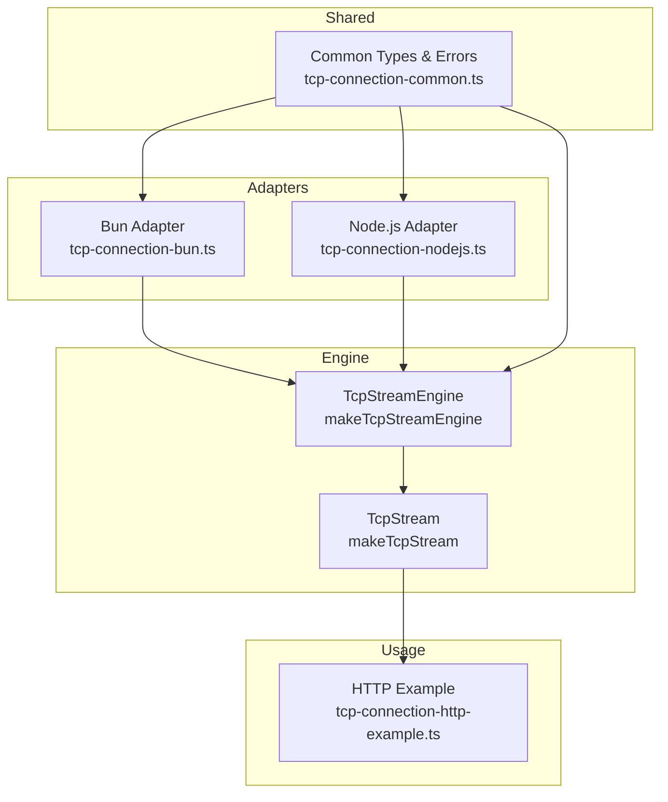
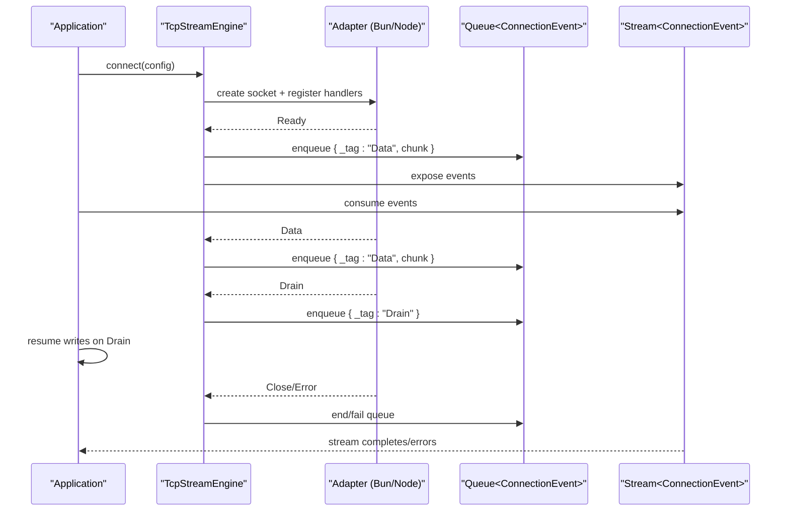
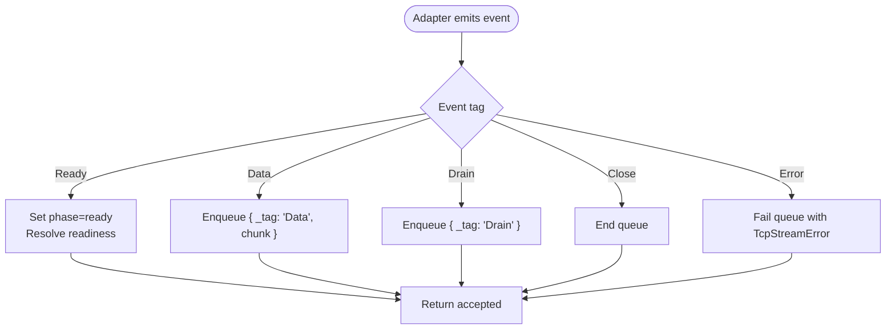
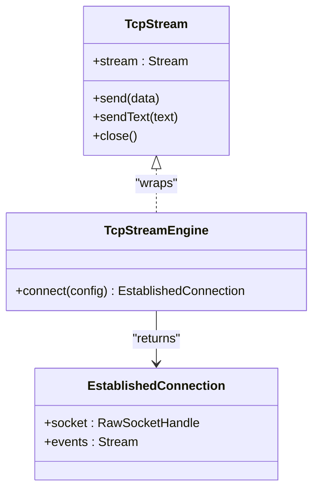
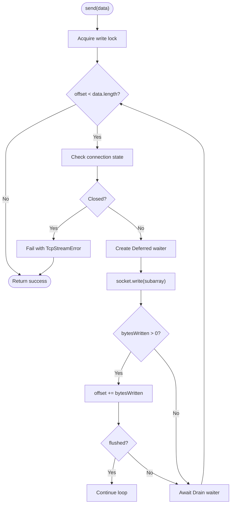
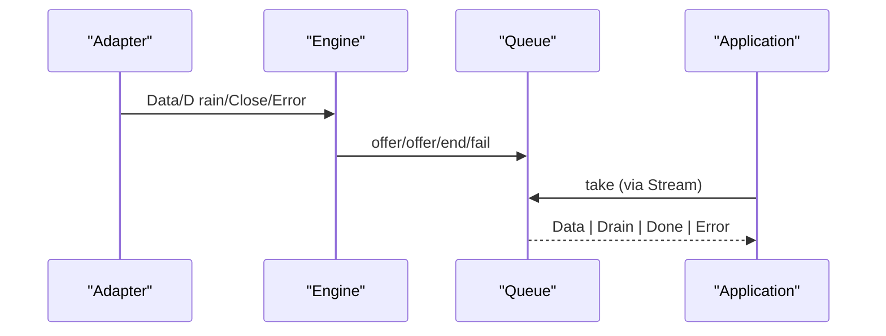
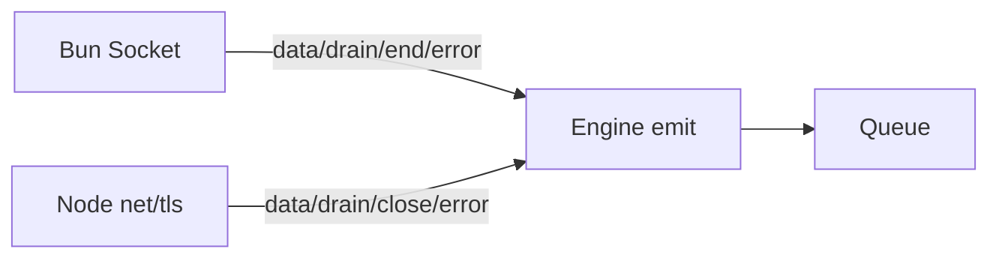
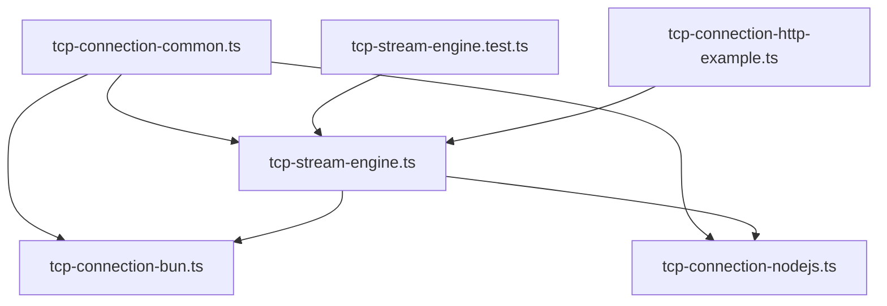

# Event-Driven Communication

<cite>
**Referenced Files in This Document**
- [tcp-stream-engine.ts](file://src/tcp-stream-engine.ts)
- [tcp-connection-common.ts](file://src/tcp-connection-common.ts)
- [tcp-connection-bun.ts](file://src/tcp-connection-bun.ts)
- [tcp-connection-nodejs.ts](file://src/tcp-connection-nodejs.ts)
- [tcp-stream-engine.test.ts](file://src/tcp-stream-engine.test.ts)
- [tcp-connection-http-example.ts](file://src/tcp-connection-http-example.ts)
</cite>

## Table of Contents
1. [Introduction](#introduction)
2. [Project Structure](#project-structure)
3. [Core Components](#core-components)
4. [Architecture Overview](#architecture-overview)
5. [Detailed Component Analysis](#detailed-component-analysis)
6. [Dependency Analysis](#dependency-analysis)
7. [Performance Considerations](#performance-considerations)
8. [Troubleshooting Guide](#troubleshooting-guide)
9. [Conclusion](#conclusion)

## Introduction
This document explains the event-driven communication model used by the TCP Stream Engine. It focuses on how raw socket events are normalized into a typed ConnectionEvent stream, how backpressure is managed via drain handling, and how the producer-consumer pattern is implemented using Effect’s queues and streams. You will learn about the event types (Data, Drain, Close, Error), queue-based message passing, event propagation through the engine, and practical patterns for high-throughput scenarios.

## Project Structure
The TCP Stream Engine is composed of:
- A platform-agnostic engine that normalizes adapter events into a typed stream and manages lifecycle and backpressure.
- Platform adapters (Bun and Node.js) that bridge native socket callbacks to the engine’s event protocol.
- Shared types and error definitions for configuration and errors.
- Example usage demonstrating stream consumption and sending data.

**Diagram sources**
- [tcp-stream-engine.ts:89-178](file://src/tcp-stream-engine.ts#L89-L178)
- [tcp-connection-bun.ts:18-135](file://src/tcp-connection-bun.ts#L18-L135)
- [tcp-connection-nodejs.ts:21-114](file://src/tcp-connection-nodejs.ts#L21-L114)
- [tcp-connection-common.ts:18-57](file://src/tcp-connection-common.ts#L18-L57)
- [tcp-connection-http-example.ts:176-205](file://src/tcp-connection-http-example.ts#L176-L205)

**Section sources**
- [tcp-stream-engine.ts:89-178](file://src/tcp-stream-engine.ts#L89-L178)
- [tcp-connection-bun.ts:18-135](file://src/tcp-connection-bun.ts#L18-L135)
- [tcp-connection-nodejs.ts:21-114](file://src/tcp-connection-nodejs.ts#L21-L114)
- [tcp-connection-common.ts:18-57](file://src/tcp-connection-common.ts#L18-L57)
- [tcp-connection-http-example.ts:176-205](file://src/tcp-connection-http-example.ts#L176-L205)

## Core Components
- ConnectionEvent: The normalized event type emitted by the engine’s connection.events stream. It includes Data and Drain events; Close and Error are propagated as terminal conditions on the stream or write path.
- RawSocketHandle: The minimal interface returned by adapters with write and close operations.
- TcpStreamEngine: Provides connect(config) which returns an EstablishedConnection with a socket handle and a typed events stream.
- TcpStream: A higher-level abstraction that exposes a readable stream of Uint8Array chunks, send/sendText for writes, and close for teardown. It coordinates incoming queues, write locks, and drain waiters.

Key responsibilities:
- Normalize adapter events into a typed stream.
- Manage connection lifecycle (connecting → ready → closed).
- Implement backpressure by honoring Drain signals during writes.
- Provide a clean producer-consumer boundary between network I/O and application logic.

**Section sources**
- [tcp-stream-engine.ts:28-67](file://src/tcp-stream-engine.ts#L28-L67)
- [tcp-stream-engine.ts:89-178](file://src/tcp-stream-engine.ts#L89-L178)
- [tcp-stream-engine.ts:201-339](file://src/tcp-stream-engine.ts#L201-L339)

## Architecture Overview
The system follows a clear producer-consumer pattern:
- Producers: Platform adapters emit low-level events (Ready, Data, Drain, Close, Error).
- Normalizer: The engine converts these into ConnectionEvent and pushes them into an internal Queue, then exposes them as a Stream.
- Consumers: Application code consumes the events stream to process data and respond to backpressure. Writes are serialized and honor Drain signals to avoid overwhelming the socket.

**Diagram sources**
- [tcp-stream-engine.ts:106-138](file://src/tcp-stream-engine.ts#L106-L138)
- [tcp-stream-engine.ts:170-176](file://src/tcp-stream-engine.ts#L170-L176)
- [tcp-connection-bun.ts:65-86](file://src/tcp-connection-bun.ts#L65-L86)
- [tcp-connection-nodejs.ts:84-101](file://src/tcp-connection-nodejs.ts#L84-L101)

## Detailed Component Analysis

### ConnectionEvent System and Event Propagation
- Events produced by adapters:
  - Ready: Signals that the socket is established and safe to use.
  - Data: Incoming bytes from the peer.
  - Drain: Indicates the socket buffer has space; consumers should resume writing.
  - Close: Peer closed or connection ended.
  - Error: Any failure during connect/read/write phases.
- The engine’s emit function maps these to:
  - Ready: Marks phase “ready” and resolves readiness deferred.
  - Data/Drain: Enqueued into the connection events queue.
  - Close: Ends the queue to signal completion.
  - Error: Fails the queue and fails readiness if not yet ready.

**Diagram sources**
- [tcp-stream-engine.ts:106-138](file://src/tcp-stream-engine.ts#L106-L138)

**Section sources**
- [tcp-stream-engine.ts:106-138](file://src/tcp-stream-engine.ts#L106-L138)

### Stream-Based Data Processing
- The engine exposes connection.events as a Stream<ConnectionEvent>.
- TcpStream wraps this to provide:
  - A readable stream of Uint8Array chunks for application consumption.
  - A send/sendText API for outbound data.
  - A close method to tear down resources deterministically.
- An internal unbounded Queue buffers incoming chunks until consumed.

**Diagram sources**
- [tcp-stream-engine.ts:40-67](file://src/tcp-stream-engine.ts#L40-L67)
- [tcp-stream-engine.ts:201-339](file://src/tcp-stream-engine.ts#L201-L339)

**Section sources**
- [tcp-stream-engine.ts:201-339](file://src/tcp-stream-engine.ts#L201-L339)

### Backpressure Management via Drain Handling
- Write path uses a semaphore to serialize concurrent writes.
- For each write call:
  - If the underlying socket reports zero bytes written, the writer waits for a Drain event before retrying.
  - A Deferred acts as a per-write waiter; it is resolved when a Drain arrives or when the connection closes.
  - If flushed is true, the write is considered complete without waiting.
- This ensures producers do not overwhelm the socket and respects consumer pacing.

**Diagram sources**
- [tcp-stream-engine.ts:300-332](file://src/tcp-stream-engine.ts#L300-L332)

**Section sources**
- [tcp-stream-engine.ts:300-332](file://src/tcp-stream-engine.ts#L300-L332)

### Producer-Consumer Pattern Implementation
- Producers:
  - Platform adapters emit events asynchronously from native sockets.
  - Engine enqueues these events into an unbounded Queue and exposes them as a Stream.
- Consumers:
  - Application code subscribes to the events stream to process Data and react to Drain.
  - TcpStream provides a typed Uint8Array stream for easier framing/parsing.
- Termination:
  - Close ends the stream cleanly.
  - Error fails the stream with a typed TcpStreamError.

**Diagram sources**
- [tcp-stream-engine.ts:106-138](file://src/tcp-stream-engine.ts#L106-L138)
- [tcp-stream-engine.ts:170-176](file://src/tcp-stream-engine.ts#L170-L176)

**Section sources**
- [tcp-stream-engine.ts:106-138](file://src/tcp-stream-engine.ts#L106-L138)
- [tcp-stream-engine.ts:170-176](file://src/tcp-stream-engine.ts#L170-L176)

### Event Handling Examples and Patterns
- Consuming incoming data and responding to backpressure:
  - Read from tcp.stream to receive Uint8Array chunks.
  - On receiving a Drain event from connection.events, resume any pending writes.
- Sending text or binary data:
  - Use tcp.sendText or tcp.send; they internally handle serialization and backpressure.
- HTTP request example:
  - Build and send an HTTP request string via tcp.sendText.
  - Collect response chunks from tcp.stream and decode incrementally.

**Section sources**
- [tcp-connection-http-example.ts:176-205](file://src/tcp-connection-http-example.ts#L176-L205)
- [tcp-stream-engine.ts:300-339](file://src/tcp-stream-engine.ts#L300-L339)

### Platform Adapters: Mapping Native Events to Engine Events
- Bun adapter:
  - Emits Data, Drain, Close, Error based on Bun socket callbacks.
  - write returns bytesWritten and whether the buffer was fully flushed.
- Node.js adapter:
  - Emits Data, Drain, Close, Error based on net/tls socket events.
  - write returns a boolean indicating flush status.

**Diagram sources**
- [tcp-connection-bun.ts:65-86](file://src/tcp-connection-bun.ts#L65-L86)
- [tcp-connection-nodejs.ts:84-101](file://src/tcp-connection-nodejs.ts#L84-L101)

**Section sources**
- [tcp-connection-bun.ts:65-86](file://src/tcp-connection-bun.ts#L65-L86)
- [tcp-connection-nodejs.ts:84-101](file://src/tcp-connection-nodejs.ts#L84-L101)

## Dependency Analysis
- Common types and errors are shared across engine and adapters.
- The engine depends on Effect primitives: Queue, Stream, Deferred, Semaphore, MutableRef, Fiber.
- Adapters depend on the engine’s abstract event protocol and return a RawSocketHandle.
- Tests validate event ordering, leak prevention, timeouts, and cleanup behavior.

**Diagram sources**
- [tcp-connection-common.ts:18-57](file://src/tcp-connection-common.ts#L18-L57)
- [tcp-stream-engine.ts:89-178](file://src/tcp-stream-engine.ts#L89-L178)
- [tcp-connection-bun.ts:18-135](file://src/tcp-connection-bun.ts#L18-L135)
- [tcp-connection-nodejs.ts:21-114](file://src/tcp-connection-nodejs.ts#L21-L114)
- [tcp-stream-engine.test.ts:26-213](file://src/tcp-stream-engine.test.ts#L26-L213)
- [tcp-connection-http-example.ts:176-205](file://src/tcp-connection-http-example.ts#L176-L205)

**Section sources**
- [tcp-stream-engine.test.ts:26-213](file://src/tcp-stream-engine.test.ts#L26-L213)

## Performance Considerations
- High-throughput streaming:
  - Use Stream.fromQueue to back-pressure consumers; ensure consumers keep up to prevent memory growth.
  - Prefer incremental decoding (e.g., TextDecoder with stream mode) to minimize allocations.
- Write efficiency:
  - Batch small messages where possible to reduce syscall overhead.
  - Rely on Drain handling to avoid busy loops; never spin on zero-byte writes.
- Resource management:
  - Always close connections via tcp.close to release resources and terminate streams cleanly.
  - Use acquire/release semantics implicitly provided by scoped connections to guarantee cleanup.
- Timeouts and retries:
  - Configure connectTimeout to fail fast on slow networks.
  - Use retry schedules judiciously to avoid thundering herds.

[No sources needed since this section provides general guidance]

## Troubleshooting Guide
- Symptom: No data received after connection.
  - Verify that the adapter emits Data events and that the consumer is subscribed to the events stream early enough.
  - Ensure the connection reaches Ready before expecting data.
- Symptom: Writes stall indefinitely.
  - Confirm that Drain events are being emitted and that your code awaits the Drain waiter before retrying writes.
  - Check that the connection is not closed while writing.
- Symptom: Stream terminates unexpectedly.
  - Inspect Close or Error events; errors are surfaced as TcpStreamError with operation context (connect/read/write).
- Symptom: Memory pressure under load.
  - Ensure consumers are keeping pace; consider applying backpressure at the application layer or using bounded queues for upstream buffering.

**Section sources**
- [tcp-stream-engine.ts:106-138](file://src/tcp-stream-engine.ts#L106-L138)
- [tcp-stream-engine.ts:300-339](file://src/tcp-stream-engine.ts#L300-L339)
- [tcp-connection-common.ts:18-24](file://src/tcp-connection-common.ts#L18-L24)

## Conclusion
The TCP Stream Engine implements a robust, event-driven architecture that normalizes platform-specific socket events into a typed, composable stream. It manages lifecycle, backpressure, and resource cleanup while exposing a simple producer-consumer interface. By leveraging Drain handling, queues, and streams, it supports high-throughput scenarios with predictable behavior and clear error signaling.