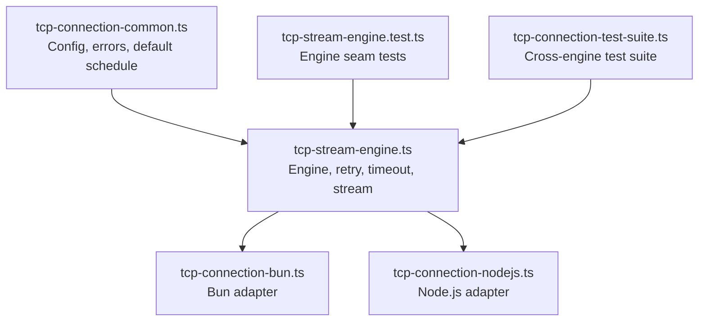
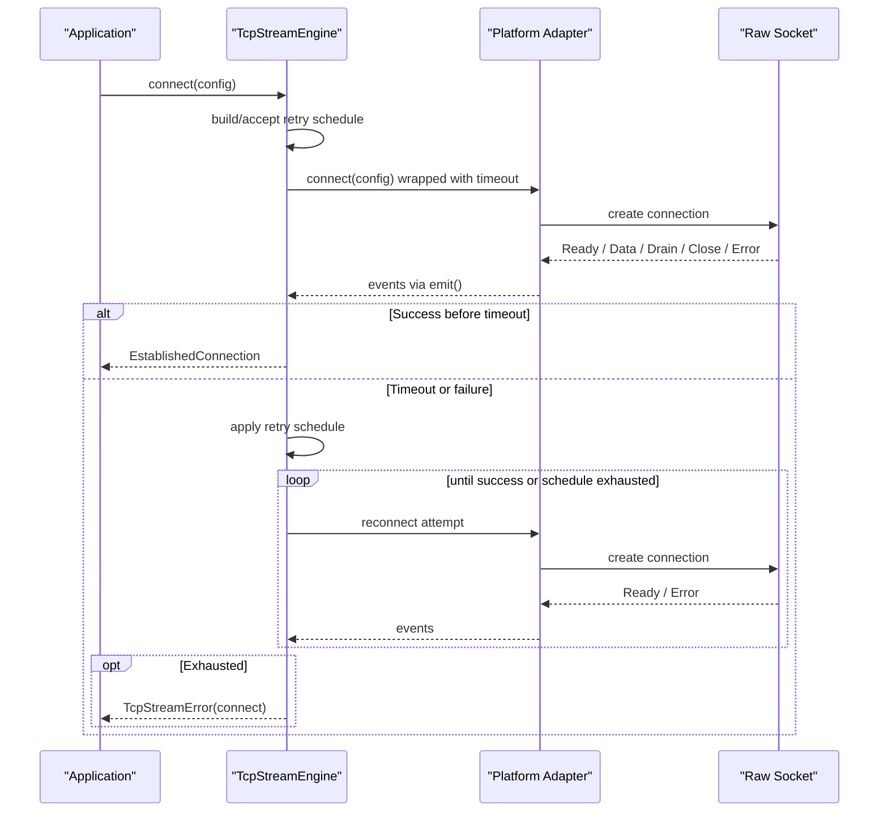
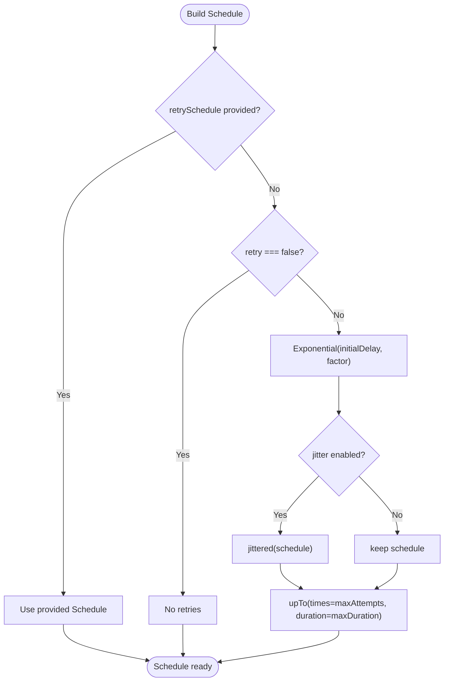
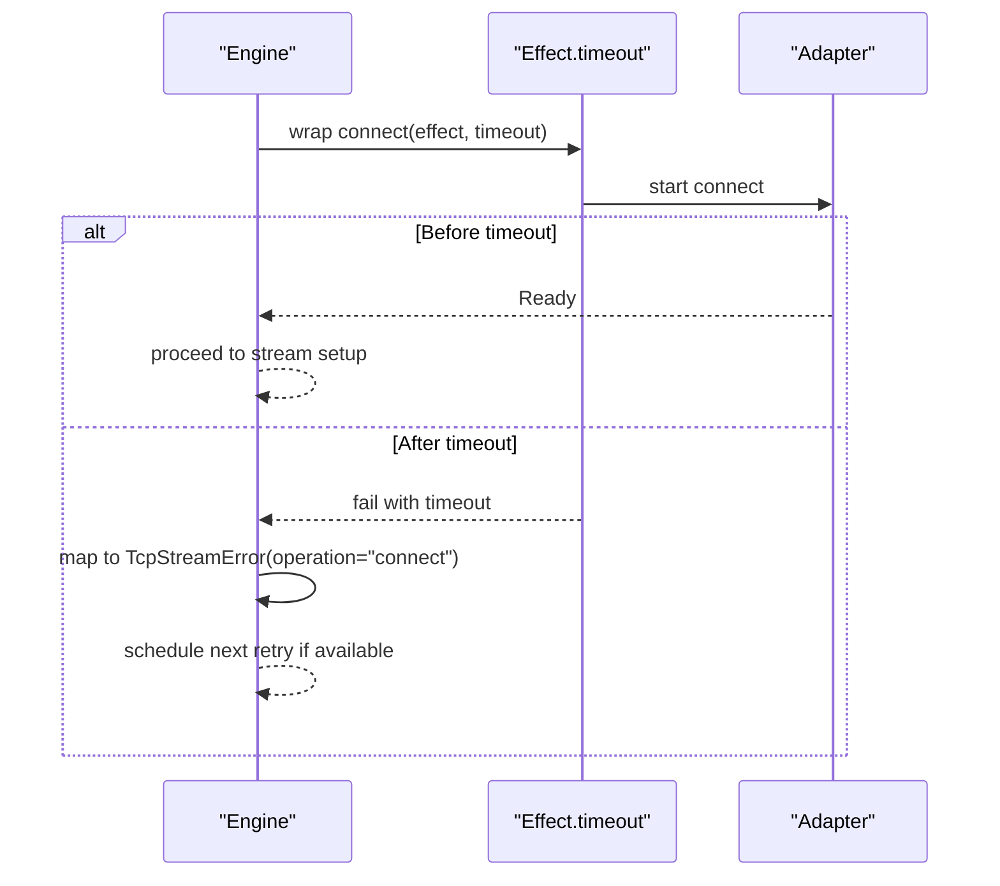
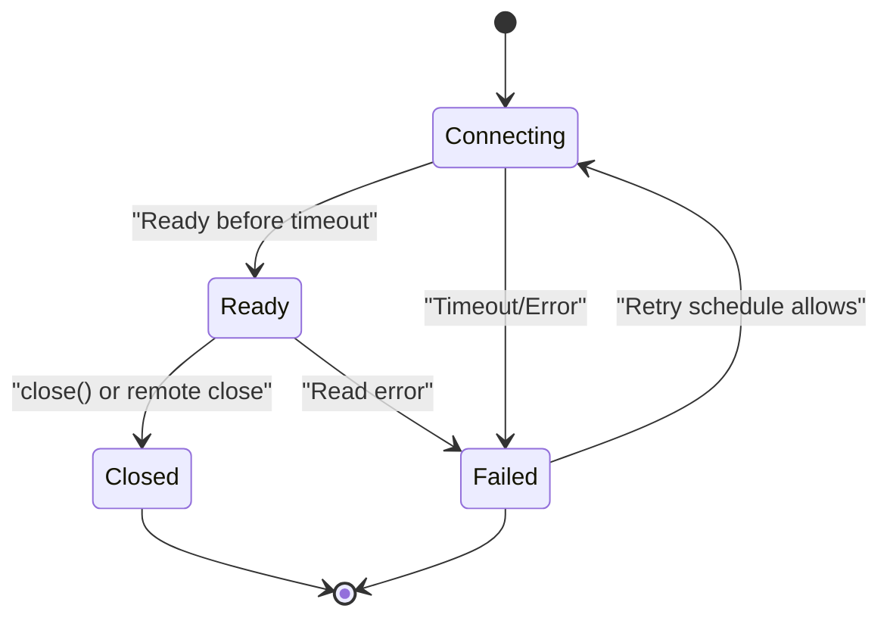
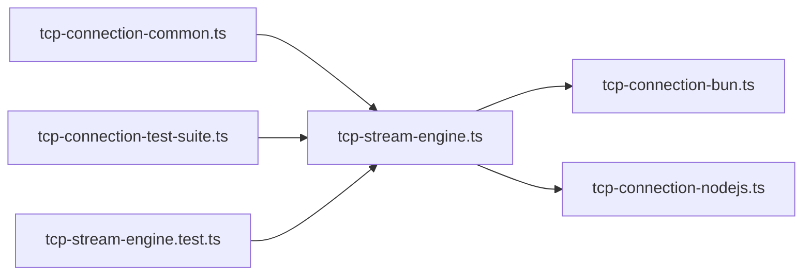

# Retry and Timeout Handling

<cite>
**Referenced Files in This Document**
- [tcp-stream-engine.ts](file://src/tcp-stream-engine.ts)
- [tcp-connection-common.ts](file://src/tcp-connection-common.ts)
- [tcp-connection-bun.ts](file://src/tcp-connection-bun.ts)
- [tcp-connection-nodejs.ts](file://src/tcp-connection-nodejs.ts)
- [tcp-stream-engine.test.ts](file://src/tcp-stream-engine.test.ts)
- [tcp-connection-test-suite.ts](file://src/tcp-connection-test-suite.ts)
</cite>

## Table of Contents
1. [Introduction](#introduction)
2. [Project Structure](#project-structure)
3. [Core Components](#core-components)
4. [Architecture Overview](#architecture-overview)
5. [Detailed Component Analysis](#detailed-component-analysis)
6. [Dependency Analysis](#dependency-analysis)
7. [Performance Considerations](#performance-considerations)
8. [Troubleshooting Guide](#troubleshooting-guide)
9. [Conclusion](#conclusion)
10. [Appendices](#appendices)

## Introduction
This document explains how the TCP Stream Engine implements retry policies and timeout mechanisms for establishing and maintaining TCP connections. It covers:
- Exponential backoff algorithm and configurable retry schedules
- Connection timeout handling and propagation
- Error categorization (transient vs permanent failures)
- Graceful degradation strategies
- Practical examples for custom retry policies and timeouts
- Troubleshooting common connectivity issues

The implementation is built on Effect’s scheduling primitives, providing robust, interruptible retries with jitter and bounded durations.

## Project Structure
The retry and timeout logic spans a small set of focused modules:
- Common types, configuration, and default schedule builder
- Platform-agnostic engine that wires connection attempts, retries, timeouts, and lifecycle management
- Platform adapters (Bun and Node.js) implementing raw socket operations
- Tests validating behavior across engines

**Diagram sources**
- [tcp-connection-common.ts:37-100](file://src/tcp-connection-common.ts#L37-L100)
- [tcp-stream-engine.ts:89-195](file://src/tcp-stream-engine.ts#L89-L195)
- [tcp-connection-bun.ts:18-135](file://src/tcp-connection-bun.ts#L18-L135)
- [tcp-connection-nodejs.ts:21-118](file://src/tcp-connection-nodejs.ts#L21-L118)

**Section sources**
- [tcp-connection-common.ts:37-100](file://src/tcp-connection-common.ts#L37-L100)
- [tcp-stream-engine.ts:89-195](file://src/tcp-stream-engine.ts#L89-L195)
- [tcp-connection-bun.ts:18-135](file://src/tcp-connection-bun.ts#L18-L135)
- [tcp-connection-nodejs.ts:21-118](file://src/tcp-connection-nodejs.ts#L21-L118)

## Core Components
- Connection configuration and validation: host, port, TLS options, retry policy or custom schedule, connect timeout
- Default exponential backoff schedule with optional jitter and bounds
- Engine-level connect with timeout and retry orchestration
- Stream wrapper that manages read/write lifecycle, drain signaling, and error propagation

Key responsibilities:
- Build or accept a retry schedule
- Wrap connect with a timeout
- Apply retry to connect attempts
- Manage event flow and state transitions
- Provide a clean API for sending data and reading events

**Section sources**
- [tcp-connection-common.ts:37-100](file://src/tcp-connection-common.ts#L37-L100)
- [tcp-stream-engine.ts:89-195](file://src/tcp-stream-engine.ts#L89-L195)
- [tcp-stream-engine.ts:201-339](file://src/tcp-stream-engine.ts#L201-L339)

## Architecture Overview
At a high level, the engine coordinates three concerns:
- Scheduling: builds or accepts a Schedule for retries
- Timing: enforces connectTimeout per attempt
- Lifecycle: ensures resources are released and streams end cleanly

**Diagram sources**
- [tcp-stream-engine.ts:89-195](file://src/tcp-stream-engine.ts#L89-L195)
- [tcp-connection-bun.ts:18-135](file://src/tcp-connection-bun.ts#L18-L135)
- [tcp-connection-nodejs.ts:21-118](file://src/tcp-connection-nodejs.ts#L21-L118)

## Detailed Component Analysis

### Retry Policy and Exponential Backoff
- Default schedule:
  - Starts with an initial delay
  - Grows by a factor each step
  - Optionally adds jitter to avoid thundering herds
  - Bounded by maximum attempts and maximum duration
- Customization:
  - Provide a full Schedule via retrySchedule to fully control timing and count
  - Disable retries entirely with retry: false

**Diagram sources**
- [tcp-connection-common.ts:90-100](file://src/tcp-connection-common.ts#L90-L100)

**Section sources**
- [tcp-connection-common.ts:37-100](file://src/tcp-connection-common.ts#L37-L100)
- [tcp-stream-engine.ts:238-257](file://src/tcp-stream-engine.ts#L238-L257)

### Connect Timeout Handling
- Each connect attempt is wrapped with a timeout derived from config.connectTimeout (default applies if not specified)
- On timeout, the attempt fails with a TcpStreamError tagged as operation "connect"
- The engine treats timeouts as transient failures eligible for retry according to the schedule

**Diagram sources**
- [tcp-stream-engine.ts:180-195](file://src/tcp-stream-engine.ts#L180-L195)

**Section sources**
- [tcp-stream-engine.ts:180-195](file://src/tcp-stream-engine.ts#L180-L195)
- [tcp-stream-engine.test.ts:126-149](file://src/tcp-stream-engine.test.ts#L126-L149)

### Error Categorization: Transient vs Permanent
- Errors occurring before readiness are treated as connect failures and retried per schedule
- Errors after readiness are classified as read failures and do not trigger reconnection; they propagate through the stream
- Timeouts during connect are considered transient and retriable
- Immediate remote close ends the incoming stream gracefully without hanging

Practical implications:
- Network flaps, DNS delays, server restarts: handled by retry/backoff
- Misconfiguration (invalid host/port): validated early and fails fast
- Application-level protocol errors: surfaced as read/write errors without retry

**Section sources**
- [tcp-stream-engine.ts:125-135](file://src/tcp-stream-engine.ts#L125-L135)
- [tcp-stream-engine.ts:271-293](file://src/tcp-stream-engine.ts#L271-L293)
- [tcp-connection-test-suite.ts:219-276](file://src/tcp-connection-test-suite.ts#L219-L276)

### Graceful Degradation Strategies
- Interruptible retries: backoff sleeps can be interrupted promptly when the owning scope closes or is interrupted
- Resource cleanup: failed attempts release sockets and queues; no leaks into subsequent attempts
- Stream termination: remote close or explicit close ends the incoming stream cleanly
- Write safety: writes respect drain signals and guard against writing to closed connections

**Diagram sources**
- [tcp-stream-engine.ts:99-176](file://src/tcp-stream-engine.ts#L99-L176)
- [tcp-stream-engine.ts:201-339](file://src/tcp-stream-engine.ts#L201-L339)

**Section sources**
- [tcp-stream-engine.ts:99-176](file://src/tcp-stream-engine.ts#L99-L176)
- [tcp-stream-engine.ts:201-339](file://src/tcp-stream-engine.ts#L201-L339)
- [tcp-stream-engine.test.ts:151-186](file://src/tcp-stream-engine.test.ts#L151-L186)

### Configuration Options
- host: string — target hostname
- port: number — target port (validated)
- tls: boolean | TLS options — enable TLS and pass platform-specific options
- retry: RetryPolicyConfig | false — configure exponential backoff or disable retries
- retrySchedule: Schedule — fully custom retry timing/count
- connectTimeout: Duration — per-attempt connect timeout

Defaults:
- Default retry schedule uses exponential backoff with jitter and bounded attempts/duration
- Default connectTimeout is applied when not specified

Validation:
- Host cannot be empty; port must be a valid integer within range

**Section sources**
- [tcp-connection-common.ts:37-88](file://src/tcp-connection-common.ts#L37-L88)
- [tcp-connection-common.ts:90-100](file://src/tcp-connection-common.ts#L90-L100)

### Practical Examples

- Configure exponential backoff with jitter and limits:
  - Set retry.initialDelay, retry.factor, retry.maxAttempts, retry.maxDuration, retry.jitter
  - See usage patterns in the shared test suite

- Disable retries for immediate failure:
  - Set retry: false to fail fast on first attempt

- Provide a custom schedule:
  - Supply retrySchedule to fully control attempts and timing

- Set connect timeout:
  - Provide connectTimeout to cap time spent waiting for readiness

- Observe behavior:
  - Tests demonstrate exhausting retries on unreachable endpoints, recovering when a server starts during backoff, and prompt interruption mid-backoff

Note: Refer to the linked sections for concrete code paths rather than embedding snippets here.

**Section sources**
- [tcp-connection-test-suite.ts:219-306](file://src/tcp-connection-test-suite.ts#L219-L306)
- [tcp-connection-test-suite.ts:308-386](file://src/tcp-connection-test-suite.ts#L308-L386)
- [tcp-stream-engine.test.ts:126-149](file://src/tcp-stream-engine.test.ts#L126-L149)

## Dependency Analysis
- tcp-stream-engine depends on:
  - tcp-connection-common for configuration, validation, and default schedule
  - Platform adapters for actual socket I/O
- Adapters depend on:
  - Engine interfaces and error types
  - Platform networking libraries (Bun or Node.js)
- Tests validate cross-engine behavior and edge cases

**Diagram sources**
- [tcp-connection-common.ts:37-100](file://src/tcp-connection-common.ts#L37-L100)
- [tcp-stream-engine.ts:89-195](file://src/tcp-stream-engine.ts#L89-L195)
- [tcp-connection-bun.ts:18-135](file://src/tcp-connection-bun.ts#L18-L135)
- [tcp-connection-nodejs.ts:21-118](file://src/tcp-connection-nodejs.ts#L21-L118)

**Section sources**
- [tcp-connection-common.ts:37-100](file://src/tcp-connection-common.ts#L37-L100)
- [tcp-stream-engine.ts:89-195](file://src/tcp-stream-engine.ts#L89-L195)

## Performance Considerations
- Jitter reduces burstiness during retries, improving stability under load
- Bounded maxAttempts and maxDuration prevent runaway retries
- Interruptible retries ensure responsive shutdown and testing
- Efficient event handling avoids unnecessary allocations and preserves ordering
- Proper drain handling prevents write stalls and memory growth

[No sources needed since this section provides general guidance]

## Troubleshooting Guide
Common issues and resolutions:
- Connection never reaches readiness:
  - Verify connectTimeout is appropriate for your environment
  - Ensure network/DNS resolution works; check firewall rules
  - Confirm server is listening on the expected host/port

- Retries exhaust too quickly or too slowly:
  - Adjust retry.initialDelay and retry.factor
  - Tune retry.maxAttempts and retry.maxDuration
  - Enable/disable jitter based on traffic patterns

- Immediate failures:
  - If retry: false is set, failures are immediate; remove or adjust to allow retries
  - Validate host and port; invalid values fail fast

- Remote close or intermittent drops:
  - Expect stream to end; handle reconnection at application layer if needed
  - Use retries to recover from transient network issues

- Interruption hangs:
  - Ensure you are using the provided layers and engine; they support interruptible retries
  - Avoid long-running synchronous work inside callbacks

Diagnostic tips:
- Inspect TcpStreamError.operation to distinguish connect vs read vs write failures
- Log schedule parameters and observed attempt counts
- Use tests as reference for expected behaviors and timings

**Section sources**
- [tcp-connection-test-suite.ts:219-306](file://src/tcp-connection-test-suite.ts#L219-L306)
- [tcp-stream-engine.test.ts:126-149](file://src/tcp-stream-engine.test.ts#L126-L149)

## Conclusion
The TCP Stream Engine provides a robust, configurable retry and timeout system built on Effect’s scheduling primitives. It supports exponential backoff with jitter, customizable schedules, and strict connect timeouts. Errors are categorized to differentiate transient connect issues from permanent read/write problems, enabling graceful degradation and predictable recovery. The design ensures resource safety, interruptibility, and clean stream lifecycle management across platforms.

[No sources needed since this section summarizes without analyzing specific files]

## Appendices

### Appendix A: Key Types and Defaults
- RetryPolicyConfig fields:
  - initialDelay: Duration.Input
  - factor: number
  - maxAttempts: number
  - maxDuration: Duration.Input
  - jitter: boolean
- Default schedule:
  - Exponential backoff with jitter enabled by default
  - Bounded by maxAttempts and maxDuration
- Connect timeout:
  - Applied per attempt; defaults when not specified

**Section sources**
- [tcp-connection-common.ts:37-100](file://src/tcp-connection-common.ts#L37-L100)
- [tcp-stream-engine.ts:180-195](file://src/tcp-stream-engine.ts#L180-L195)

### Appendix B: Platform-Specific Notes
- Bun adapter:
  - Uses Bun.connect and emits events for data, drain, close, and errors
- Node.js adapter:
  - Uses net/tls and emits events for data, drain, close, and errors
- Both adapters integrate with the engine’s retry and timeout logic transparently

**Section sources**
- [tcp-connection-bun.ts:18-135](file://src/tcp-connection-bun.ts#L18-L135)
- [tcp-connection-nodejs.ts:21-118](file://src/tcp-connection-nodejs.ts#L21-L118)