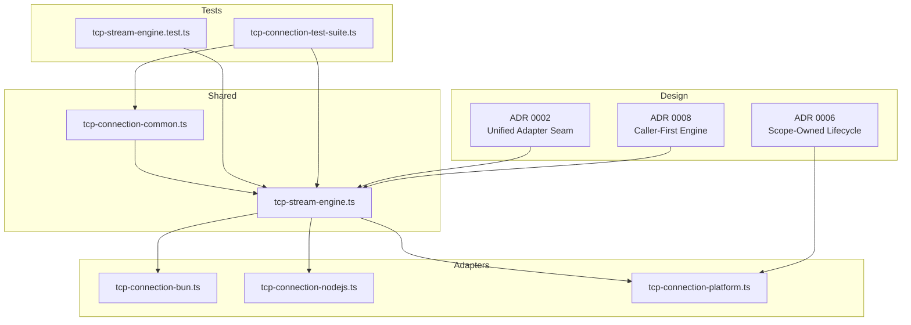
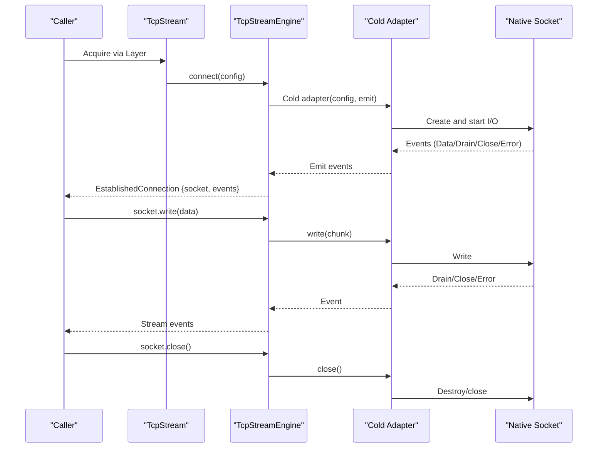
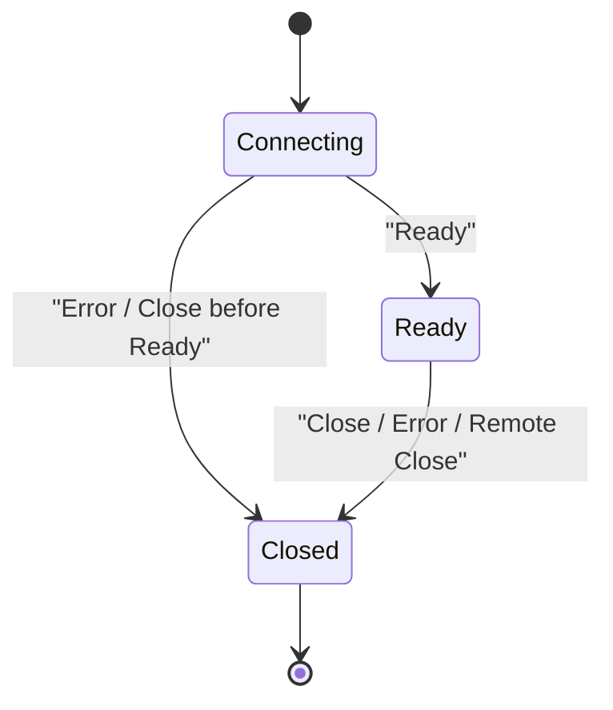
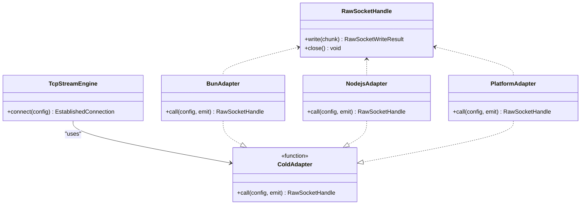
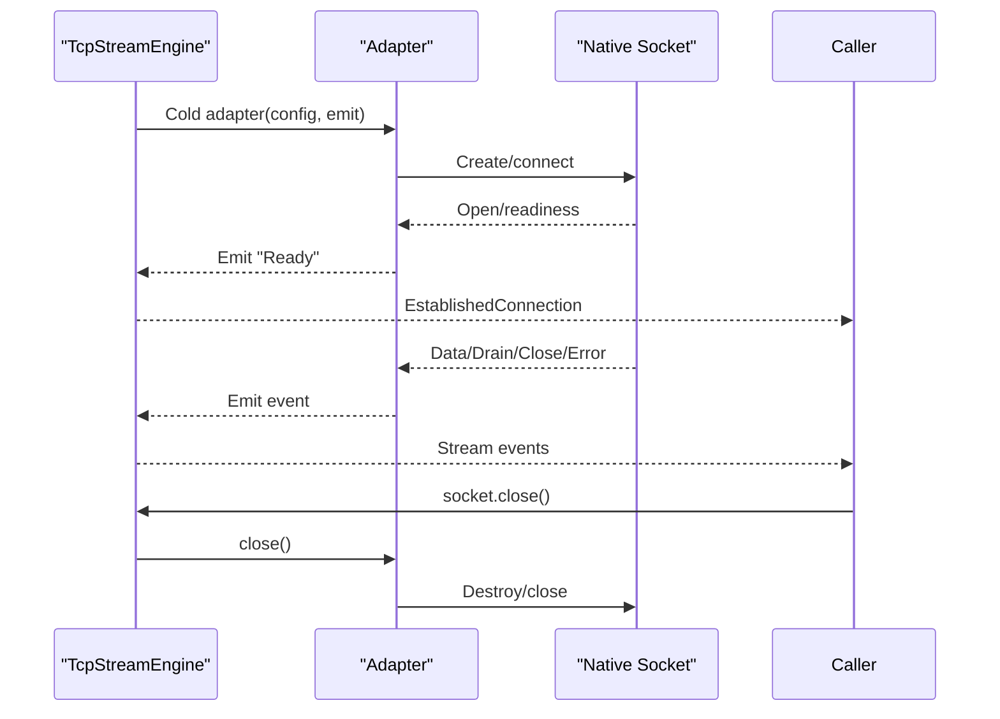
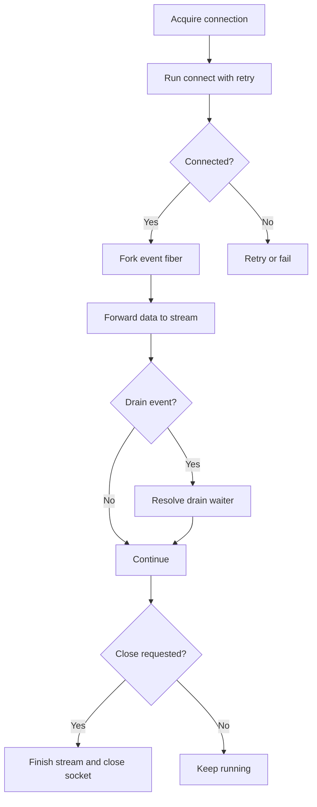
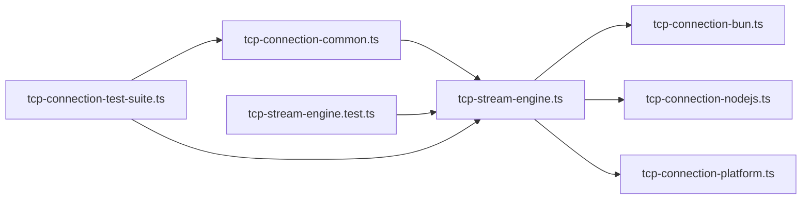

# TCP Stream Engine

<cite>
**Referenced Files in This Document**
- [tcp-stream-engine.ts](file://src/tcp-stream-engine.ts)
- [tcp-connection-common.ts](file://src/tcp-connection-common.ts)
- [tcp-connection-bun.ts](file://src/tcp-connection-bun.ts)
- [tcp-connection-nodejs.ts](file://src/tcp-connection-nodejs.ts)
- [tcp-connection-platform.ts](file://src/tcp-connection-platform.ts)
- [tcp-stream-engine.test.ts](file://src/tcp-stream-engine.test.ts)
- [tcp-connection-test-suite.ts](file://src/tcp-connection-test-suite.ts)
- [0002-unified-tcp-stream-engine-adapter-seam.md](file://docs/adr/0002-unified-tcp-stream-engine-adapter-seam.md)
- [0006-scope-owned-platform-engine-lifecycle.md](file://docs/adr/0006-scope-owned-platform-engine-lifecycle.md)
- [0008-caller-first-tcp-stream-engine.md](file://docs/adr/0008-caller-first-tcp-stream-engine.md)
</cite>

## Table of Contents
1. [Introduction](#introduction)
2. [Project Structure](#project-structure)
3. [Core Components](#core-components)
4. [Architecture Overview](#architecture-overview)
5. [Detailed Component Analysis](#detailed-component-analysis)
6. [Dependency Analysis](#dependency-analysis)
7. [Performance Considerations](#performance-considerations)
8. [Troubleshooting Guide](#troubleshooting-guide)
9. [Conclusion](#conclusion)

## Introduction
This document explains the TCP Stream Engine with a focus on its central orchestrator: the caller-first engine that owns one connection attempt, exposes an established connection, and coordinates retry, timeout, backpressure, event ordering, and resource lifecycle. It also documents the adapter seam that enables cross-platform compatibility across Bun, Node.js, and a unified platform abstraction.

The engine is designed around three main ideas:
- A shared orchestrator that implements stateful connection management, retry policies, timeouts, and streaming.
- Thin platform adapters that translate native socket events into a common cold protocol.
- A public `TcpStream` service that composes configuration, retry, and session orchestration over any engine implementation.

## Project Structure
The TCP Stream Engine lives under `src` and is organized by responsibility:
- Shared contracts, errors, configuration, and retry utilities are in `tcp-connection-common.ts`.
- The central orchestrator is in `tcp-stream-engine.ts`.
- Platform-specific adapters are in `tcp-connection-bun.ts`, `tcp-connection-nodejs.ts`, and `tcp-connection-platform.ts`.
- Tests validate behavior for the engine seam and the full stream layer.
- Architecture Decision Records (ADRs) explain design choices such as the adapter seam, scope ownership, and caller-first semantics.

**Diagram sources**
- [tcp-stream-engine.ts:1-359](file://src/tcp-stream-engine.ts#L1-L359)
- [tcp-connection-common.ts:1-101](file://src/tcp-connection-common.ts#L1-L101)
- [tcp-connection-bun.ts:1-145](file://src/tcp-connection-bun.ts#L1-L145)
- [tcp-connection-nodejs.ts:1-132](file://src/tcp-connection-nodejs.ts#L1-L132)
- [tcp-connection-platform.ts:1-135](file://src/tcp-connection-platform.ts#L1-L135)
- [tcp-stream-engine.test.ts:1-214](file://src/tcp-stream-engine.test.ts#L1-L214)
- [tcp-connection-test-suite.ts:1-800](file://src/tcp-connection-test-suite.ts#L1-L800)
- [0002-unified-tcp-stream-engine-adapter-seam.md:1-48](file://docs/adr/0002-unified-tcp-stream-engine-adapter-seam.md#L1-L48)
- [0006-scope-owned-platform-engine-lifecycle.md:1-84](file://docs/adr/0006-scope-owned-platform-engine-lifecycle.md#L1-L84)
- [0008-caller-first-tcp-stream-engine.md:1-18](file://docs/adr/0008-caller-first-tcp-stream-engine.md#L1-L18)

**Section sources**
- [tcp-stream-engine.ts:1-359](file://src/tcp-stream-engine.ts#L1-L359)
- [tcp-connection-common.ts:1-101](file://src/tcp-connection-common.ts#L1-L101)
- [tcp-connection-bun.ts:1-145](file://src/tcp-connection-bun.ts#L1-L145)
- [tcp-connection-nodejs.ts:1-132](file://src/tcp-connection-nodejs.ts#L1-L132)
- [tcp-connection-platform.ts:1-135](file://src/tcp-connection-platform.ts#L1-L135)
- [tcp-stream-engine.test.ts:1-214](file://src/tcp-stream-engine.test.ts#L1-L214)
- [tcp-connection-test-suite.ts:1-800](file://src/tcp-connection-test-suite.ts#L1-L800)
- [0002-unified-tcp-stream-engine-adapter-seam.md:1-48](file://docs/adr/0002-unified-tcp-stream-engine-adapter-seam.md#L1-L48)
- [0006-scope-owned-platform-engine-lifecycle.md:1-84](file://docs/adr/0006-scope-owned-platform-engine-lifecycle.md#L1-L84)
- [0008-caller-first-tcp-stream-engine.md:1-18](file://docs/adr/0008-caller-first-tcp-stream-engine.md#L1-L18)

## Core Components
- `TcpStreamEngine`: The central orchestrator service that provides `connect(config)` and returns an established connection with a socket handle and an ordered event stream.
- `makeTcpStreamEngine(adapter)`: Builds the caller-first engine from a cold adapter function.
- `TcpStream`: The higher-level service that adds retry, write serialization, backpressure handling, and lifecycle management.
- `ConnectionConfigShape`: Configuration for host, port, TLS, retry policy, custom schedule, and connect timeout.
- Platform adapters (`Bun`, `Node.js`, `Platform`): Implement the cold adapter protocol to map native sockets to the shared engine.

Key responsibilities:
- Orchestrator: State machine for connection readiness, event ordering, first-outcome-wins settlement, and idempotent close.
- Retry and timeout: Exponential backoff with jitter, bounded attempts/duration, and configurable connect timeout.
- Backpressure: Drain events synchronize writes; zero-byte writes wait for drain before continuing.
- Resource management: Scoped acquisition/release ensures cleanup even on interruption or failure.

**Section sources**
- [tcp-stream-engine.ts:49-67](file://src/tcp-stream-engine.ts#L49-L67)
- [tcp-stream-engine.ts:88-178](file://src/tcp-stream-engine.ts#L88-L178)
- [tcp-stream-engine.ts:201-341](file://src/tcp-stream-engine.ts#L201-L341)
- [tcp-connection-common.ts:37-57](file://src/tcp-connection-common.ts#L37-L57)
- [tcp-connection-common.ts:90-100](file://src/tcp-connection-common.ts#L90-L100)

## Architecture Overview
The architecture separates concerns between a shared orchestrator and thin platform adapters. The orchestrator owns the connection lifecycle and user-facing API; adapters only translate platform socket events into a common cold protocol.

**Diagram sources**
- [tcp-stream-engine.ts:88-178](file://src/tcp-stream-engine.ts#L88-L178)
- [tcp-stream-engine.ts:201-341](file://src/tcp-stream-engine.ts#L201-L341)
- [tcp-connection-bun.ts:18-135](file://src/tcp-connection-bun.ts#L18-L135)
- [tcp-connection-nodejs.ts:21-114](file://src/tcp-connection-nodejs.ts#L21-L114)
- [tcp-connection-platform.ts:17-128](file://src/tcp-connection-platform.ts#L17-L128)

## Detailed Component Analysis

### Central Orchestrator: `TcpStreamEngine` and `makeTcpStreamEngine`
The orchestrator builds a caller-first connection model:
- `connect(config)` runs one attempt through the cold adapter.
- It manages a phase state machine: connecting → ready → closed.
- It buffers early events until readiness and guarantees order.
- It settles the first outcome (ready or error), suppresses stale signals, and makes explicit close terminal and effective once.
- Connect timeout wraps the entire attempt, including readiness and event setup.

State transitions:
- Connecting: Waiting for adapter to emit Ready.
- Ready: First successful outcome; events flow through a queue.
- Closed: Either explicit close, remote close, or error; event stream ends.

**Diagram sources**
- [tcp-stream-engine.ts:99-138](file://src/tcp-stream-engine.ts#L99-L138)
- [tcp-stream-engine.ts:149-176](file://src/tcp-stream-engine.ts#L149-L176)

Retry and timeout:
- Retry is owned by `TcpStream`, not the engine attempt.
- Default exponential backoff with jitter is built from `buildDefaultRetrySchedule`.
- Custom schedules can be provided via `retrySchedule`.
- Connect timeout is applied centrally around the adapter’s effect.

Backpressure and write serialization:
- Writes are serialized with a semaphore.
- Zero-byte writes wait for a drain waiter; drain events resolve the waiter.
- Data chunks are offered into an incoming queue; read errors terminate the stream.

Resource management:
- Connection acquisition uses `Effect.acquireRelease` with `{ interruptible: true }`.
- Explicit close interrupts the event fiber and closes the underlying socket.
- The event fiber finishes the incoming queue on success or failure.

**Diagram sources**
- [tcp-stream-engine.ts:180-195](file://src/tcp-stream-engine.ts#L180-L195)
- [tcp-stream-engine.ts:238-260](file://src/tcp-stream-engine.ts#L238-L260)
- [tcp-stream-engine.ts:300-332](file://src/tcp-stream-engine.ts#L300-L332)

**Section sources**
- [tcp-stream-engine.ts:88-178](file://src/tcp-stream-engine.ts#L88-L178)
- [tcp-stream-engine.ts:180-195](file://src/tcp-stream-engine.ts#L180-L195)
- [tcp-stream-engine.ts:201-341](file://src/tcp-stream-engine.ts#L201-L341)
- [tcp-stream-engine.test.ts:26-47](file://src/tcp-stream-engine.test.ts#L26-L47)
- [tcp-stream-engine.test.ts:49-73](file://src/tcp-stream-engine.test.ts#L49-L73)
- [tcp-stream-engine.test.ts:126-149](file://src/tcp-stream-engine.test.ts#L126-L149)
- [tcp-stream-engine.test.ts:151-186](file://src/tcp-stream-engine.test.ts#L151-L186)

### Higher-Level Service: `TcpStream`
`TcpStream` composes:
- Validation of `ConnectionConfigShape`.
- Selection of retry strategy: none, default exponential backoff with jitter, or custom schedule.
- Acquisition and release of the connection.
- Event fiber that forwards data and handles drain semantics.
- Write serialization and backpressure coordination.
- Graceful close that terminates the event fiber and underlying socket.

Configuration options:
- `host`, `port`: Required endpoint.
- `tls`: Boolean or platform TLS options.
- `retry`: Policy object or `false`.
- `retrySchedule`: Custom Effect `Schedule`.
- `connectTimeout`: Duration for connect attempt.

Usage pattern:
- Provide `ConnectionConfigLive(config)` and a concrete engine layer (e.g., `TcpStreamBunLive`, `TcpStreamNodejsLive`, `TcpStreamPlatformLive`).
- Access `TcpStream` via Effect context and use `send`, `sendText`, `stream`, and `close`.

**Section sources**
- [tcp-stream-engine.ts:201-341](file://src/tcp-stream-engine.ts#L201-L341)
- [tcp-connection-common.ts:45-57](file://src/tcp-connection-common.ts#L45-L57)
- [tcp-connection-common.ts:85-100](file://src/tcp-connection-common.ts#L85-L100)
- [tcp-connection-test-suite.ts:219-306](file://src/tcp-connection-test-suite.ts#L219-L306)
- [tcp-connection-test-suite.ts:388-422](file://src/tcp-connection-test-suite.ts#L388-L422)

### Adapter Seam Pattern: Cross-Platform Compatibility
The adapter seam defines a cold protocol:
- `ColdAdapter(config, emit)`: Returns an effect producing a `RawSocketHandle`.
- `emit(event)`: Synchronous event emission returning `"accepted"` or `"closed"`.
- `RawSocketHandle.write(chunk)`: Returns `RawSocketWriteResult` with `bytesWritten` and `flushed`.
- `RawSocketHandle.close()`: Idempotent teardown.

Platform implementations:
- Bun adapter maps `Bun.connect` callbacks to the adapter events.
- Node.js adapter maps `net.Socket` and `tls.connect` events to the adapter events.
- Platform adapter uses `effect/unstable.socket/Socket` with Bun’s `BunSocket` wrapper and Node TLS.

Benefits:
- Zero duplication of orchestration logic.
- Direct control of native sockets preserved.
- High leverage: adapters are thin and focused on mapping.

**Diagram sources**
- [tcp-stream-engine.ts:28-38](file://src/tcp-stream-engine.ts#L28-L38)
- [tcp-stream-engine.ts:69-79](file://src/tcp-stream-engine.ts#L69-L79)
- [tcp-connection-bun.ts:18-135](file://src/tcp-connection-bun.ts#L18-L135)
- [tcp-connection-nodejs.ts:21-114](file://src/tcp-connection-nodejs.ts#L21-L114)
- [tcp-connection-platform.ts:17-128](file://src/tcp-connection-platform.ts#L17-L128)

**Section sources**
- [0002-unified-tcp-stream-engine-adapter-seam.md:1-48](file://docs/adr/0002-unified-tcp-stream-engine-adapter-seam.md#L1-L48)
- [tcp-connection-bun.ts:18-135](file://src/tcp-connection-bun.ts#L18-L135)
- [tcp-connection-nodejs.ts:21-114](file://src/tcp-connection-nodejs.ts#L21-L114)
- [tcp-connection-platform.ts:17-128](file://src/tcp-connection-platform.ts#L17-L128)

### Connection Lifecycle Management
Establishment:
- The engine calls the cold adapter with config and emit.
- The adapter creates the native socket and starts I/O.
- On readiness, the adapter emits `Ready`; the engine marks the connection ready and begins streaming events.

Maintenance:
- Incoming data is forwarded to the consumer stream.
- Drain events coordinate backpressure for zero-byte writes.
- Errors after readiness are classified as read failures.

Teardown:
- Explicit close ends the event stream and closes the underlying socket.
- Remote close ends the event stream gracefully.
- Failure during connection before readiness triggers cleanup and fails the connect attempt.

**Diagram sources**
- [tcp-stream-engine.ts:99-176](file://src/tcp-stream-engine.ts#L99-L176)
- [tcp-connection-bun.ts:56-123](file://src/tcp-connection-bun.ts#L56-L123)
- [tcp-connection-nodejs.ts:74-104](file://src/tcp-connection-nodejs.ts#L74-L104)
- [tcp-connection-platform.ts:51-119](file://src/tcp-connection-platform.ts#L51-L119)

**Section sources**
- [tcp-stream-engine.ts:99-176](file://src/tcp-stream-engine.ts#L99-L176)
- [tcp-stream-engine.test.ts:75-98](file://src/tcp-stream-engine.test.ts#L75-L98)
- [tcp-stream-engine.test.ts:100-124](file://src/tcp-stream-engine.test.ts#L100-L124)

### Retry Policies, Timeout Handling, and Connection Pooling
Retry policies:
- Default exponential backoff with jitter is constructed by `buildDefaultRetrySchedule`.
- Users can disable retries with `retry: false`.
- Custom schedules can be provided via `retrySchedule`.

Timeout handling:
- Connect timeout wraps the entire attempt, including readiness and event setup.
- Timeouts produce a `TcpStreamError` with operation `connect`.

Connection pooling:
- The current design does not implement connection pooling.
- Each `connect` call establishes one attempt; retries are attempted per call.
- If pooling is required, it should be implemented at a higher level outside the engine.

**Section sources**
- [tcp-connection-common.ts:90-100](file://src/tcp-connection-common.ts#L90-L100)
- [tcp-stream-engine.ts:180-195](file://src/tcp-stream-engine.ts#L180-L195)
- [tcp-stream-engine.ts:238-260](file://src/tcp-stream-engine.ts#L238-L260)
- [tcp-connection-test-suite.ts:219-306](file://src/tcp-connection-test-suite.ts#L219-L306)

### Implementation Details: State Transitions, Event-Driven Communication, and Resource Management
State transitions:
- Connecting → Ready on `Ready`.
- Connecting → Closed on `Error`/`Close` before readiness.
- Ready → Closed on explicit close, error, or remote close.

Event-driven communication:
- Adapter emits events synchronously via `emit`.
- Engine buffers events until readiness and orders them correctly.
- Failed attempts discard their event queues to prevent stale data leakage.

Resource management:
- `Effect.acquireRelease` with `{ interruptible: true }` ensures cleanup during retries and interruptions.
- Per-attempt scopes are forked from the ambient scope in the Platform adapter.
- Explicit close is idempotent and unconditional.

**Diagram sources**
- [tcp-stream-engine.ts:201-341](file://src/tcp-stream-engine.ts#L201-L341)
- [tcp-connection-platform.ts:51-119](file://src/tcp-connection-platform.ts#L51-L119)

**Section sources**
- [tcp-stream-engine.ts:99-176](file://src/tcp-stream-engine.ts#L99-L176)
- [tcp-stream-engine.ts:201-341](file://src/tcp-stream-engine.ts#L201-L341)
- [0006-scope-owned-platform-engine-lifecycle.md:1-84](file://docs/adr/0006-scope-owned-platform-engine-lifecycle.md#L1-L84)
- [0008-caller-first-tcp-stream-engine.md:1-18](file://docs/adr/0008-caller-first-tcp-stream-engine.md#L1-L18)

### Code Examples: Engine Configuration and Usage Patterns
Configuration examples:
- Disable retries: set `retry: false`.
- Configure exponential backoff: provide `retry.initialDelay`, `retry.factor`, `retry.maxAttempts`, `retry.jitter`.
- Provide a custom schedule: set `retrySchedule` to an Effect `Schedule`.
- Set connect timeout: set `connectTimeout`.

Usage patterns:
- Provide `ConnectionConfigLive(config)` and a concrete engine layer.
- Access `TcpStream` via Effect context.
- Use `send`, `sendText`, `stream`, and `close`.

Reference paths:
- Configuration validation and defaults: [tcp-connection-common.ts:85-100](file://src/tcp-connection-common.ts#L85-L100).
- Retry selection and acquisition: [tcp-stream-engine.ts:238-260](file://src/tcp-stream-engine.ts#L238-L260).
- Test suite usage patterns: [tcp-connection-test-suite.ts:219-306](file://src/tcp-connection-test-suite.ts#L219-L306), [tcp-connection-test-suite.ts:388-422](file://src/tcp-connection-test-suite.ts#L388-L422).

**Section sources**
- [tcp-connection-common.ts:85-100](file://src/tcp-connection-common.ts#L85-L100)
- [tcp-stream-engine.ts:238-260](file://src/tcp-stream-engine.ts#L238-L260)
- [tcp-connection-test-suite.ts:219-306](file://src/tcp-connection-test-suite.ts#L219-L306)
- [tcp-connection-test-suite.ts:388-422](file://src/tcp-connection-test-suite.ts#L388-L422)

## Dependency Analysis
The orchestrator depends on shared configuration and error types, while platform adapters depend on the orchestrator’s cold protocol. Tests validate both the engine seam and the full stream layer.

**Diagram sources**
- [tcp-stream-engine.ts:1-359](file://src/tcp-stream-engine.ts#L1-L359)
- [tcp-connection-common.ts:1-101](file://src/tcp-connection-common.ts#L1-L101)
- [tcp-connection-bun.ts:1-145](file://src/tcp-connection-bun.ts#L1-L145)
- [tcp-connection-nodejs.ts:1-132](file://src/tcp-connection-nodejs.ts#L1-L132)
- [tcp-connection-platform.ts:1-135](file://src/tcp-connection-platform.ts#L1-L135)
- [tcp-stream-engine.test.ts:1-214](file://src/tcp-stream-engine.test.ts#L1-L214)
- [tcp-connection-test-suite.ts:1-800](file://src/tcp-connection-test-suite.ts#L1-L800)

**Section sources**
- [tcp-stream-engine.ts:1-359](file://src/tcp-stream-engine.ts#L1-L359)
- [tcp-connection-common.ts:1-101](file://src/tcp-connection-common.ts#L1-L101)
- [tcp-connection-bun.ts:1-145](file://src/tcp-connection-bun.ts#L1-L145)
- [tcp-connection-nodejs.ts:1-132](file://src/tcp-connection-nodejs.ts#L1-L132)
- [tcp-connection-platform.ts:1-135](file://src/tcp-connection-platform.ts#L1-L135)
- [tcp-stream-engine.test.ts:1-214](file://src/tcp-stream-engine.test.ts#L1-L214)
- [tcp-connection-test-suite.ts:1-800](file://src/tcp-connection-test-suite.ts#L1-L800)

## Performance Considerations
- Avoid unnecessary allocations by reusing buffers where possible in adapters.
- Prefer custom schedules when predictable retry timing is critical.
- Monitor backpressure: excessive zero-byte writes indicate downstream consumers are slow.
- Keep connect timeouts reasonable to avoid long-running fibers during network issues.
- Do not implement pooling inside the engine; if needed, build a higher-level pool that respects the engine’s scoped lifecycle.

[No sources needed since this section provides general guidance]

## Troubleshooting Guide
Common issues and resolutions:
- Connection never becomes ready:
  - Verify the server is reachable and listening.
  - Increase `connectTimeout`.
  - Check TLS configuration if enabled.
- Stale events from failed attempts:
  - Ensure you are using the caller-first engine; it discards per-attempt event queues.
- Hanging on close:
  - Confirm explicit close is called and that the event fiber is interrupted.
  - Validate adapter cleanup (destroy/close) is idempotent.
- Retry exhaustion:
  - Inspect `retry` settings and `retrySchedule`.
  - Confirm unreachable endpoints are properly reserved in tests.

Relevant references:
- Engine seam tests for readiness, error classification, timeout, and idempotent close: [tcp-stream-engine.test.ts:26-47](file://src/tcp-stream-engine.test.ts#L26-L47), [tcp-stream-engine.test.ts:100-124](file://src/tcp-stream-engine.test.ts#L100-L124), [tcp-stream-engine.test.ts:126-149](file://src/tcp-stream-engine.test.ts#L126-L149), [tcp-stream-engine.test.ts:151-186](file://src/tcp-stream-engine.test.ts#L151-L186).
- Lifecycle and scope ownership: [0006-scope-owned-platform-engine-lifecycle.md:1-84](file://docs/adr/0006-scope-owned-platform-engine-lifecycle.md#L1-L84).
- Retry behavior and bounded time: [tcp-connection-test-suite.ts:219-306](file://src/tcp-connection-test-suite.ts#L219-L306).

**Section sources**
- [tcp-stream-engine.test.ts:26-47](file://src/tcp-stream-engine.test.ts#L26-L47)
- [tcp-stream-engine.test.ts:100-124](file://src/tcp-stream-engine.test.ts#L100-L124)
- [tcp-stream-engine.test.ts:126-149](file://src/tcp-stream-engine.test.ts#L126-L149)
- [tcp-stream-engine.test.ts:151-186](file://src/tcp-stream-engine.test.ts#L151-L186)
- [0006-scope-owned-platform-engine-lifecycle.md:1-84](file://docs/adr/0006-scope-owned-platform-engine-lifecycle.md#L1-L84)
- [tcp-connection-test-suite.ts:219-306](file://src/tcp-connection-test-suite.ts#L219-L306)

## Conclusion
The TCP Stream Engine centralizes connection lifecycle management behind a clean, caller-first interface while delegating platform specifics to thin adapters. Its state machine ensures correct event ordering and first-outcome-wins settlement. Retry policies, connect timeouts, and backpressure are handled consistently across platforms. Scoped acquisition/release guarantees robust resource cleanup, even under interruption. The adapter seam enables cross-platform compatibility without duplicating orchestration logic, making the system maintainable and testable.

[No sources needed since this section summarizes without analyzing specific files]