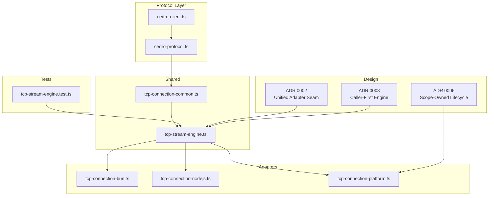
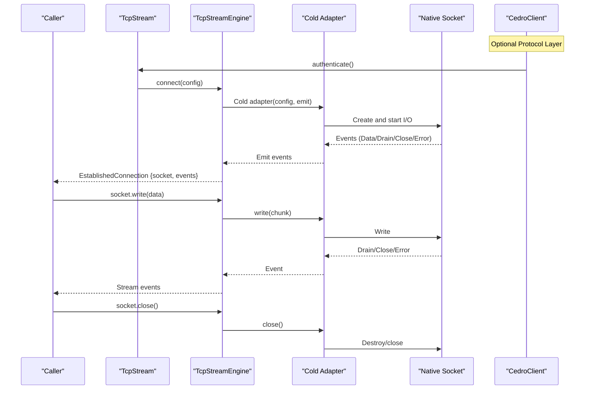
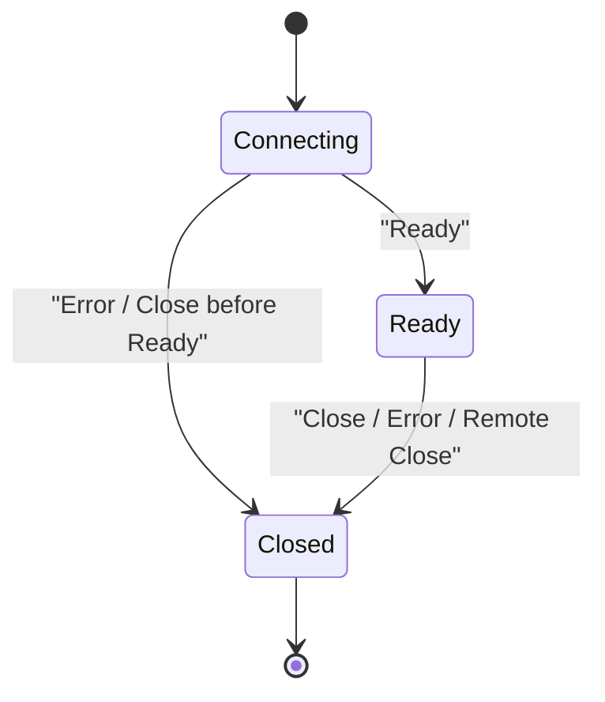
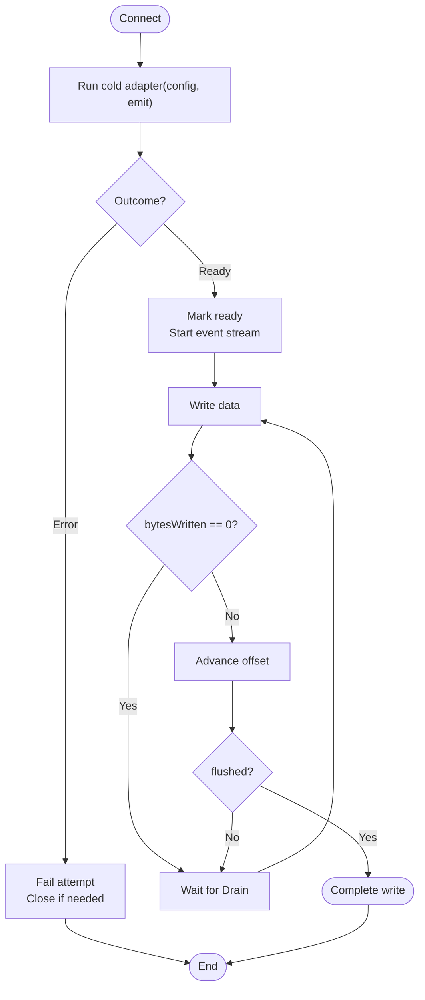
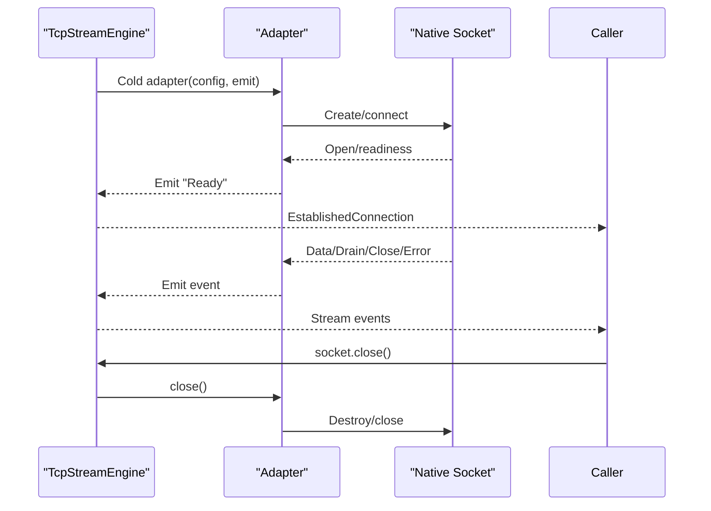
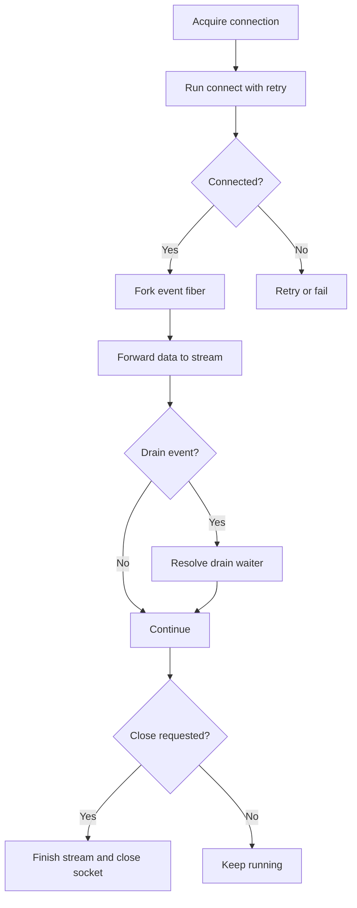
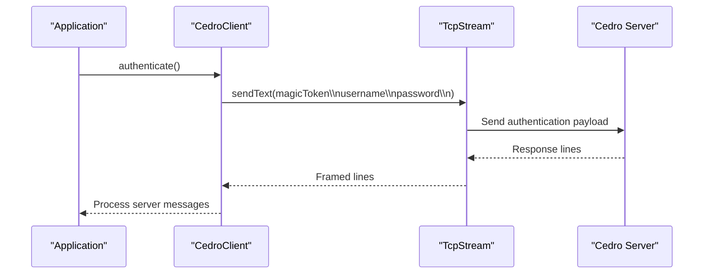
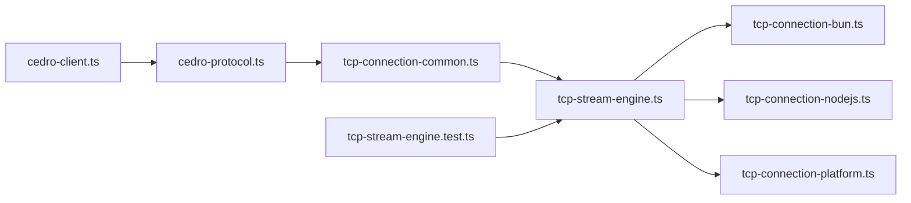

# TCP Stream Engine

<cite>
**Referenced Files in This Document**
- [tcp-stream-engine.ts](file://packages/tcp/src/tcp-stream-engine.ts)
- [tcp-connection-common.ts](file://packages/tcp/src/tcp-connection-common.ts)
- [tcp-connection-bun.ts](file://packages/tcp/src/tcp-connection-bun.ts)
- [tcp-connection-nodejs.ts](file://packages/tcp/src/tcp-connection-nodejs.ts)
- [tcp-connection-platform.ts](file://packages/tcp/src/tcp-connection-platform.ts)
- [cedro-protocol.ts](file://packages/tcp/src/cedro-protocol.ts)
- [cedro-client.ts](file://packages/tcp/src/cedro-client.ts)
- [tcp-stream-engine.test.ts](file://packages/tcp/src/tcp-stream-engine.test.ts)
- [0002-unified-tcp-stream-engine-adapter-seam.md](file://docs/adr/0002-unified-tcp-stream-engine-adapter-seam.md)
- [0006-scope-owned-platform-engine-lifecycle.md](file://docs/adr/0006-scope-owned-platform-engine-lifecycle.md)
- [0008-caller-first-tcp-stream-engine.md](file://docs/adr/0008-caller-first-tcp-stream-engine.md)
</cite>

## Update Summary
**Changes Made**
- Added comprehensive Cedro client usage instructions and integration patterns
- Documented environment variable configuration for production deployments
- Clarified behavioral characteristics of the Cedro client authentication flow
- Updated architecture diagrams to include Cedro protocol layer
- Enhanced troubleshooting guide with Cedro-specific scenarios

## Table of Contents
1. [Introduction](#introduction)
2. [Project Structure](#project-structure)
3. [Core Components](#core-components)
4. [Architecture Overview](#architecture-overview)
5. [Detailed Component Analysis](#detailed-component-analysis)
6. [Cedro Protocol Integration](#cedro-protocol-integration)
7. [Environment Configuration](#environment-configuration)
8. [Dependency Analysis](#dependency-analysis)
9. [Performance Considerations](#performance-considerations)
10. [Troubleshooting Guide](#troubleshooting-guide)
11. [Conclusion](#conclusion)

## Introduction
This document explains the TCP Stream Engine with a focus on its central orchestrator: the caller-first engine that owns one connection attempt, exposes an established connection, and coordinates retry, timeout, backpressure, event ordering, and resource lifecycle. It also documents the adapter seam that enables cross-platform compatibility across Bun, Node.js, and a unified platform abstraction.

The engine is designed around three main ideas:
- A shared orchestrator that implements stateful connection management, retry policies, timeouts, and streaming.
- Thin platform adapters that translate native socket events into a common cold protocol.
- A public `TcpStream` service that composes configuration, retry, and session orchestration over any engine implementation.

Additionally, the system includes a high-level Cedro protocol client that provides authentication and subscription capabilities over the TCP stream, with support for environment-based configuration and production-ready deployment patterns.

## Project Structure
The TCP Stream Engine lives under `packages/tcp/src` and is organized by responsibility:
- Shared contracts, errors, configuration, and retry utilities are in `tcp-connection-common.ts`.
- The central orchestrator is in `tcp-stream-engine.ts`.
- Platform-specific adapters are in `tcp-connection-bun.ts`, `tcp-connection-nodejs.ts`, and `tcp-connection-platform.ts`.
- The Cedro protocol client is implemented in `cedro-protocol.ts` and `cedro-client.ts`.
- Tests validate behavior for the engine seam and the full stream layer.
- Architecture Decision Records (ADRs) explain design choices such as the adapter seam, scope ownership, and caller-first semantics.



**Diagram sources**
- [tcp-stream-engine.ts:1-359](file://packages/tcp/src/tcp-stream-engine.ts#L1-L359)
- [tcp-connection-common.ts:1-101](file://packages/tcp/src/tcp-connection-common.ts#L1-L101)
- [tcp-connection-bun.ts:1-145](file://packages/tcp/src/tcp-connection-bun.ts#L1-L145)
- [tcp-connection-nodejs.ts:1-132](file://packages/tcp/src/tcp-connection-nodejs.ts#L1-L132)
- [tcp-connection-platform.ts:1-135](file://packages/tcp/src/tcp-connection-platform.ts#L1-L135)
- [cedro-protocol.ts:1-105](file://packages/tcp/src/cedro-protocol.ts#L1-L105)
- [cedro-client.ts:1-45](file://packages/tcp/src/cedro-client.ts#L1-L45)
- [tcp-stream-engine.test.ts:1-214](file://packages/tcp/src/tcp-stream-engine.test.ts#L1-L214)
- [0002-unified-tcp-stream-engine-adapter-seam.md:1-48](file://docs/adr/0002-unified-tcp-stream-engine-adapter-seam.md#L1-L48)
- [0006-scope-owned-platform-engine-lifecycle.md:1-84](file://docs/adr/0006-scope-owned-platform-engine-lifecycle.md#L1-L84)
- [0008-caller-first-tcp-stream-engine.md:1-18](file://docs/adr/0008-caller-first-tcp-stream-engine.md#L1-L18)

**Section sources**
- [tcp-stream-engine.ts:1-359](file://packages/tcp/src/tcp-stream-engine.ts#L1-L359)
- [tcp-connection-common.ts:1-101](file://packages/tcp/src/tcp-connection-common.ts#L1-L101)
- [tcp-connection-bun.ts:1-145](file://packages/tcp/src/tcp-connection-bun.ts#L1-L145)
- [tcp-connection-nodejs.ts:1-132](file://packages/tcp/src/tcp-connection-nodejs.ts#L1-L132)
- [tcp-connection-platform.ts:1-135](file://packages/tcp/src/tcp-connection-platform.ts#L1-L135)
- [cedro-protocol.ts:1-105](file://packages/tcp/src/cedro-protocol.ts#L1-L105)
- [cedro-client.ts:1-45](file://packages/tcp/src/cedro-client.ts#L1-L45)
- [tcp-stream-engine.test.ts:1-214](file://packages/tcp/src/tcp-stream-engine.test.ts#L1-L214)
- [0002-unified-tcp-stream-engine-adapter-seam.md:1-48](file://docs/adr/0002-unified-tcp-stream-engine-adapter-seam.md#L1-L48)
- [0006-scope-owned-platform-engine-lifecycle.md:1-84](file://docs/adr/0006-scope-owned-platform-engine-lifecycle.md#L1-L84)
- [0008-caller-first-tcp-stream-engine.md:1-18](file://docs/adr/0008-caller-first-tcp-stream-engine.md#L1-L18)

## Core Components
- `TcpStreamEngine`: The central orchestrator service that provides `connect(config)` and returns an established connection with a socket handle and an ordered event stream.
- `makeTcpStreamEngine(adapter)`: Builds the caller-first engine from a cold adapter function.
- `TcpStream`: The higher-level service that adds retry, write serialization, backpressure handling, and lifecycle management.
- `ConnectionConfigShape`: Configuration for host, port, TLS, retry policy, custom schedule, and connect timeout.
- Platform adapters (`Bun`, `Node.js`, `Platform`): Implement the cold adapter protocol to map native sockets to the shared engine.
- `CedroClient`: High-level protocol client providing authentication and subscription functionality.
- `CedroConfig`: Configuration service for Cedro protocol credentials and settings.

Key responsibilities:
- Orchestrator: State machine for connection readiness, event ordering, first-outcome-wins settlement, and idempotent close.
- Retry and timeout: Exponential backoff with jitter, bounded attempts/duration, and configurable connect timeout.
- Backpressure: Drain events synchronize writes; zero-byte writes wait for drain before continuing.
- Resource management: Scoped acquisition/release ensures cleanup even on interruption or failure.
- Protocol abstraction: Cedro client handles authentication framing and line-based message processing.

**Section sources**
- [tcp-stream-engine.ts:49-67](file://packages/tcp/src/tcp-stream-engine.ts#L49-L67)
- [tcp-stream-engine.ts:88-178](file://packages/tcp/src/tcp-stream-engine.ts#L88-L178)
- [tcp-stream-engine.ts:201-341](file://packages/tcp/src/tcp-stream-engine.ts#L201-L341)
- [cedro-protocol.ts:10-39](file://packages/tcp/src/cedro-protocol.ts#L10-L39)
- [cedro-client.ts:10-18](file://packages/tcp/src/cedro-client.ts#L10-L18)
- [tcp-connection-common.ts:37-57](file://packages/tcp/src/tcp-connection-common.ts#L37-L57)
- [tcp-connection-common.ts:90-100](file://packages/tcp/src/tcp-connection-common.ts#L90-L100)

## Architecture Overview
The architecture separates concerns between a shared orchestrator and thin platform adapters. The orchestrator owns the connection lifecycle and user-facing API; adapters only translate platform socket events into a common cold protocol.



**Diagram sources**
- [tcp-stream-engine.ts:88-178](file://packages/tcp/src/tcp-stream-engine.ts#L88-L178)
- [tcp-stream-engine.ts:201-341](file://packages/tcp/src/tcp-stream-engine.ts#L201-L341)
- [cedro-protocol.ts:41-99](file://packages/tcp/src/cedro-protocol.ts#L41-L99)
- [cedro-client.ts:10-18](file://packages/tcp/src/cedro-client.ts#L10-L18)
- [tcp-connection-bun.ts:18-135](file://packages/tcp/src/tcp-connection-bun.ts#L18-L135)
- [tcp-connection-nodejs.ts:21-114](file://packages/tcp/src/tcp-connection-nodejs.ts#L21-L114)
- [tcp-connection-platform.ts:17-128](file://packages/tcp/src/tcp-connection-platform.ts#L17-L128)

## Detailed Component Analysis

### Central Orchestrator: `TcpStreamEngine` and `makeTcpStreamEngine`
The orchestrator builds a caller-first connection model:
- `connect(config)` runs one attempt through the cold adapter.
- It manages a phase state machine: connecting → ready → closed.
- It buffers early events until readiness and guarantees order.
- It settles the first outcome (ready or error), suppresses stale signals, and makes explicit close terminal and effective once.
- Connect timeout wraps the entire attempt, including readiness and event setup.

State transitions:
- Connecting: Waiting for adapter to emit Ready.
- Ready: First successful outcome; events flow through a queue.
- Closed: Either explicit close, remote close, or error; event stream ends.



**Diagram sources**
- [tcp-stream-engine.ts:99-138](file://packages/tcp/src/tcp-stream-engine.ts#L99-L138)
- [tcp-stream-engine.ts:149-176](file://packages/tcp/src/tcp-stream-engine.ts#L149-L176)

Retry and timeout:
- Retry is owned by `TcpStream`, not the engine attempt.
- Default exponential backoff with jitter is built from `buildDefaultRetrySchedule`.
- Custom schedules can be provided via `retrySchedule`.
- Connect timeout is applied centrally around the adapter's effect.

Backpressure and write serialization:
- Writes are serialized with a semaphore.
- Zero-byte writes wait for a drain waiter; drain events resolve the waiter.
- Data chunks are offered into an incoming queue; read errors terminate the stream.

Resource management:
- Connection acquisition uses `Effect.acquireRelease` with `{ interruptible: true }`.
- Explicit close interrupts the event fiber and closes the underlying socket.
- The event fiber finishes the incoming queue on success or failure.



**Diagram sources**
- [tcp-stream-engine.ts:180-195](file://packages/tcp/src/tcp-stream-engine.ts#L180-L195)
- [tcp-stream-engine.ts:238-260](file://packages/tcp/src/tcp-stream-engine.ts#L238-L260)
- [tcp-stream-engine.ts:300-332](file://packages/tcp/src/tcp-stream-engine.ts#L300-L332)

**Section sources**
- [tcp-stream-engine.ts:88-178](file://packages/tcp/src/tcp-stream-engine.ts#L88-L178)
- [tcp-stream-engine.ts:180-195](file://packages/tcp/src/tcp-stream-engine.ts#L180-L195)
- [tcp-stream-engine.ts:201-341](file://packages/tcp/src/tcp-stream-engine.ts#L201-L341)
- [tcp-stream-engine.test.ts:26-47](file://packages/tcp/src/tcp-stream-engine.test.ts#L26-L47)
- [tcp-stream-engine.test.ts:49-73](file://packages/tcp/src/tcp-stream-engine.test.ts#L49-L73)
- [tcp-stream-engine.test.ts:126-149](file://packages/tcp/src/tcp-stream-engine.test.ts#L126-L149)
- [tcp-stream-engine.test.ts:151-186](file://packages/tcp/src/tcp-stream-engine.test.ts#L151-L186)

### Higher-Level Service: `TcpStream`
`TcpStream` composes:
- Validation of `ConnectionConfigShape`.
- Selection of retry strategy: none, default exponential backoff with jitter, or custom schedule.
- Acquisition and release of the connection.
- Event fiber that forwards data and handles drain semantics.
- Write serialization and backpressure coordination.
- Graceful close that terminates the event fiber and underlying socket.

Configuration options:
- `host`, `port`: Required endpoint.
- `tls`: Boolean or platform TLS options.
- `retry`: Policy object or `false`.
- `retrySchedule`: Custom Effect `Schedule`.
- `connectTimeout`: Duration for connect attempt.

Usage pattern:
- Provide `ConnectionConfigLive(config)` and a concrete engine layer (e.g., `TcpStreamBunLive`, `TcpStreamNodejsLive`, `TcpStreamPlatformLive`).
- Access `TcpStream` via Effect context and use `send`, `sendText`, `stream`, and `close`.

**Section sources**
- [tcp-stream-engine.ts:201-341](file://packages/tcp/src/tcp-stream-engine.ts#L201-L341)
- [tcp-connection-common.ts:45-57](file://packages/tcp/src/tcp-connection-common.ts#L45-L57)
- [tcp-connection-common.ts:85-100](file://packages/tcp/src/tcp-connection-common.ts#L85-L100)

### Adapter Seam Pattern: Cross-Platform Compatibility
The adapter seam defines a cold protocol:
- `ColdAdapter(config, emit)`: Returns an effect producing a `RawSocketHandle`.
- `emit(event)`: Synchronous event emission returning `"accepted"` or `"closed"`.
- `RawSocketHandle.write(chunk)`: Returns `RawSocketWriteResult` with `bytesWritten` and `flushed`.
- `RawSocketHandle.close()`: Idempotent teardown.

Platform implementations:
- Bun adapter maps `Bun.connect` callbacks to the adapter events.
- Node.js adapter maps `net.Socket` and `tls.connect` events to the adapter events.
- Platform adapter uses `effect/unstable.socket/Socket` with Bun's `BunSocket` wrapper and Node TLS.

Benefits:
- Zero duplication of orchestration logic.
- Direct control of native sockets preserved.
- High leverage: adapters are thin and focused on mapping.


**Diagram sources**
- [tcp-stream-engine.ts:28-38](file://packages/tcp/src/tcp-stream-engine.ts#L28-L38)
- [tcp-stream-engine.ts:69-79](file://packages/tcp/src/tcp-stream-engine.ts#L69-L79)
- [tcp-connection-bun.ts:18-135](file://packages/tcp/src/tcp-connection-bun.ts#L18-L135)
- [tcp-connection-nodejs.ts:21-114](file://packages/tcp/src/tcp-connection-nodejs.ts#L21-L114)
- [tcp-connection-platform.ts:17-128](file://packages/tcp/src/tcp-connection-platform.ts#L17-L128)

**Section sources**
- [0002-unified-tcp-stream-engine-adapter-seam.md:1-48](file://docs/adr/0002-unified-tcp-stream-engine-adapter-seam.md#L1-L48)
- [tcp-connection-bun.ts:18-135](file://packages/tcp/src/tcp-connection-bun.ts#L18-L135)
- [tcp-connection-nodejs.ts:21-114](file://packages/tcp/src/tcp-connection-nodejs.ts#L21-L114)
- [tcp-connection-platform.ts:17-128](file://packages/tcp/src/tcp-connection-platform.ts#L17-L128)

### Connection Lifecycle Management
Establishment:
- The engine calls the cold adapter with config and emit.
- The adapter creates the native socket and starts I/O.
- On readiness, the adapter emits `Ready`; the engine marks the connection ready and begins streaming events.

Maintenance:
- Incoming data is forwarded to the consumer stream.
- Drain events coordinate backpressure for zero-byte writes.
- Errors after readiness are classified as read failures.

Teardown:
- Explicit close ends the event stream and closes the underlying socket.
- Remote close ends the event stream gracefully.
- Failure during connection before readiness triggers cleanup and fails the connect attempt.



**Diagram sources**
- [tcp-stream-engine.ts:99-176](file://packages/tcp/src/tcp-stream-engine.ts#L99-L176)
- [tcp-connection-bun.ts:56-123](file://packages/tcp/src/tcp-connection-bun.ts#L56-L123)
- [tcp-connection-nodejs.ts:74-104](file://packages/tcp/src/tcp-connection-nodejs.ts#L74-L104)
- [tcp-connection-platform.ts:51-119](file://packages/tcp/src/tcp-connection-platform.ts#L51-L119)

**Section sources**
- [tcp-stream-engine.ts:99-176](file://packages/tcp/src/tcp-stream-engine.ts#L99-L176)
- [tcp-stream-engine.test.ts:75-98](file://packages/tcp/src/tcp-stream-engine.test.ts#L75-L98)
- [tcp-stream-engine.test.ts:100-124](file://packages/tcp/src/tcp-stream-engine.test.ts#L100-L124)

### Retry Policies, Timeout Handling, and Connection Pooling
Retry policies:
- Default exponential backoff with jitter is constructed by `buildDefaultRetrySchedule`.
- Users can disable retries with `retry: false`.
- Custom schedules can be provided via `retrySchedule`.

Timeout handling:
- Connect timeout wraps the entire attempt, including readiness and event setup.
- Timeouts produce a `TcpStreamError` with operation `connect`.

Connection pooling:
- The current design does not implement connection pooling.
- Each `connect` call establishes one attempt; retries are attempted per call.
- If pooling is required, it should be implemented at a higher level outside the engine.

**Section sources**
- [tcp-connection-common.ts:90-100](file://packages/tcp/src/tcp-connection-common.ts#L90-L100)
- [tcp-stream-engine.ts:180-195](file://packages/tcp/src/tcp-stream-engine.ts#L180-L195)
- [tcp-stream-engine.ts:238-260](file://packages/tcp/src/tcp-stream-engine.ts#L238-L260)

### Implementation Details: State Transitions, Event-Driven Communication, and Resource Management
State transitions:
- Connecting → Ready on `Ready`.
- Connecting → Closed on `Error`/`Close` before readiness.
- Ready → Closed on explicit close, error, or remote close.

Event-driven communication:
- Adapter emits events synchronously via `emit`.
- Engine buffers events until readiness and orders them correctly.
- Failed attempts discard their event queues to prevent stale data leakage.

Resource management:
- `Effect.acquireRelease` with `{ interruptible: true }` ensures cleanup during retries and interruptions.
- Per-attempt scopes are forked from the ambient scope in the Platform adapter.
- Explicit close is idempotent and unconditional.



**Diagram sources**
- [tcp-stream-engine.ts:201-341](file://packages/tcp/src/tcp-stream-engine.ts#L201-L341)
- [tcp-connection-platform.ts:51-119](file://packages/tcp/src/tcp-connection-platform.ts#L51-L119)

**Section sources**
- [tcp-stream-engine.ts:99-176](file://packages/tcp/src/tcp-stream-engine.ts#L99-L176)
- [tcp-stream-engine.ts:201-341](file://packages/tcp/src/tcp-stream-engine.ts#L201-L341)
- [0006-scope-owned-platform-engine-lifecycle.md:1-84](file://docs/adr/0006-scope-owned-platform-engine-lifecycle.md#L1-L84)
- [0008-caller-first-tcp-stream-engine.md:1-18](file://docs/adr/0008-caller-first-tcp-stream-engine.md#L1-L18)

## Cedro Protocol Integration

### Overview
The Cedro protocol client provides a high-level interface for authenticating and subscribing to market data streams over TCP connections. It builds on top of the TCP Stream Engine to provide protocol-specific functionality including authentication framing, line-based message processing, and subscription management.

### Authentication Flow
The Cedro client follows a specific authentication sequence:
1. Immediately sends login fields (magic token, username, password) upon connection establishment
2. Validates input fields to prevent injection attacks (no line breaks allowed)
3. Processes server responses as framed lines
4. Maintains the connection for ongoing message consumption



**Diagram sources**
- [cedro-protocol.ts:41-75](file://packages/tcp/src/cedro-protocol.ts#L41-L75)
- [cedro-client.ts:10-18](file://packages/tcp/src/cedro-client.ts#L10-L18)

### Configuration and Usage Patterns
The Cedro client supports multiple configuration approaches:

**Programmatic Configuration:**
```typescript
const cedroConfig = CedroConfigLive({
  magicToken: "TOKEN_123",
  username: "trader_user", 
  password: "secret_password",
  tickers: ["PETR4", "VALE3"],
});
```

**Environment-Based Configuration:**
```typescript
const host = yield* Config.string("CEDRO_HOST");
const port = yield* Config.int("CEDRO_PORT");
const magicToken = yield* Config.redacted("CEDRO_MAGIC_KEY");
const username = yield* Config.string("CEDRO_USER");
const password = yield* Config.redacted("CEDRO_PASSWORD");
```

### Behavioral Characteristics
- **Immediate Authentication**: Login fields are sent immediately upon connection establishment
- **Line-Based Processing**: All server responses are processed as UTF-8 framed lines
- **Input Validation**: Magic token, username, and password cannot contain line breaks
- **Subscription Support**: Supports subscribing to multiple tickers with comma-separated lists
- **Error Handling**: Uses `CedroProtocolError` for protocol-specific validation failures

**Section sources**
- [cedro-protocol.ts:1-105](file://packages/tcp/src/cedro-protocol.ts#L1-L105)
- [cedro-client.ts:1-45](file://packages/tcp/src/cedro-client.ts#L1-L45)
- [cedro-protocol.test.ts:1-110](file://packages/tcp/src/cedro-protocol.test.ts#L1-L110)
- [cedro-client.test.ts:1-97](file://packages/tcp/src/cedro-client.test.ts#L1-L97)

## Environment Configuration

### Production Deployment
For production environments, the Cedro client supports comprehensive environment variable configuration:

**Required Environment Variables:**
- `CEDRO_HOST`: Server hostname or IP address
- `CEDRO_PORT`: Server port number  
- `CEDRO_MAGIC_KEY`: Authentication magic token (redacted)
- `CEDRO_USER`: Username for authentication
- `CEDRO_PASSWORD`: Password for authentication (redacted)

**Security Best Practices:**
- Use redacted configuration for sensitive values like passwords and tokens
- Configure appropriate network security policies for TCP connections
- Set reasonable connect timeouts to prevent hanging connections
- Disable retries in production unless specifically required

**Runtime Configuration Example:**
```typescript
export const main = Effect.gen(function* () {
  const host = yield* Config.string("CEDRO_HOST");
  const port = yield* Config.int("CEDRO_PORT");
  const magicToken = yield* Config.redacted("CEDRO_MAGIC_KEY");
  const username = yield* Config.string("CEDRO_USER");
  const password = yield* Config.redacted("CEDRO_PASSWORD");
  
  const cedroLayer = CedroClientLive.pipe(
    Layer.provide(
      Layer.merge(
        TcpStreamLive({ host, port, retry: false }),
        CedroConfigLive({
          magicToken: Redacted.value(magicToken),
          username,
          password: Redacted.value(password),
        }),
      ),
    ),
  );
  
  return yield* receiveCedroCommands((line) => Console.log(line)).pipe(
    Effect.provide(cedroLayer),
  );
});
```

**Section sources**
- [cedro-client.ts:20-41](file://packages/tcp/src/cedro-client.ts#L20-L41)

## Dependency Analysis
The orchestrator depends on shared configuration and error types, while platform adapters depend on the orchestrator's cold protocol. The Cedro protocol layer depends on the TCP stream infrastructure. Tests validate both the engine seam and the full stream layer.



**Diagram sources**
- [tcp-stream-engine.ts:1-359](file://packages/tcp/src/tcp-stream-engine.ts#L1-L359)
- [tcp-connection-common.ts:1-101](file://packages/tcp/src/tcp-connection-common.ts#L1-L101)
- [tcp-connection-bun.ts:1-145](file://packages/tcp/src/tcp-connection-bun.ts#L1-L145)
- [tcp-connection-nodejs.ts:1-132](file://packages/tcp/src/tcp-connection-nodejs.ts#L1-L132)
- [tcp-connection-platform.ts:1-135](file://packages/tcp/src/tcp-connection-platform.ts#L1-L135)
- [cedro-protocol.ts:1-105](file://packages/tcp/src/cedro-protocol.ts#L1-L105)
- [cedro-client.ts:1-45](file://packages/tcp/src/cedro-client.ts#L1-L45)
- [tcp-stream-engine.test.ts:1-214](file://packages/tcp/src/tcp-stream-engine.test.ts#L1-L214)

**Section sources**
- [tcp-stream-engine.ts:1-359](file://packages/tcp/src/tcp-stream-engine.ts#L1-L359)
- [tcp-connection-common.ts:1-101](file://packages/tcp/src/tcp-connection-common.ts#L1-L101)
- [tcp-connection-bun.ts:1-145](file://packages/tcp/src/tcp-connection-bun.ts#L1-L145)
- [tcp-connection-nodejs.ts:1-132](file://packages/tcp/src/tcp-connection-nodejs.ts#L1-L132)
- [tcp-connection-platform.ts:1-135](file://packages/tcp/src/tcp-connection-platform.ts#L1-L135)
- [cedro-protocol.ts:1-105](file://packages/tcp/src/cedro-protocol.ts#L1-L105)
- [cedro-client.ts:1-45](file://packages/tcp/src/cedro-client.ts#L1-L45)
- [tcp-stream-engine.test.ts:1-214](file://packages/tcp/src/tcp-stream-engine.test.ts#L1-L214)

## Performance Considerations
- Avoid unnecessary allocations by reusing buffers where possible in adapters.
- Prefer custom schedules when predictable retry timing is critical.
- Monitor backpressure: excessive zero-byte writes indicate downstream consumers are slow.
- Keep connect timeouts reasonable to avoid long-running fibers during network issues.
- Do not implement pooling inside the engine; if needed, build a higher-level pool that respects the engine's scoped lifecycle.
- For Cedro protocol usage, consider batching subscriptions to minimize network overhead.
- Use line-based processing efficiently by processing messages in batches when possible.

## Troubleshooting Guide
Common issues and resolutions:
- Connection never becomes ready:
  - Verify the server is reachable and listening.
  - Increase `connectTimeout`.
  - Check TLS configuration if enabled.
- Stale events from failed attempts:
  - Ensure you are using the caller-first engine; it discards per-attempt event queues.
- Hanging on close:
  - Confirm explicit close is called and that the event fiber is interrupted.
  - Validate adapter cleanup (destroy/close) is idempotent.
- Retry exhaustion:
  - Inspect `retry` settings and `retrySchedule`.
  - Confirm unreachable endpoints are properly reserved in tests.

**Cedro-Specific Issues:**
- Authentication failures:
  - Verify magic token, username, and password are correctly configured.
  - Check that credentials don't contain line breaks (validation prevents this).
  - Ensure the server expects the three-line authentication format.
- Message processing problems:
  - Verify server is sending properly framed lines with newline terminators.
  - Check that the application handler processes all received lines.
  - Monitor for connection drops during message processing.
- Environment configuration issues:
  - Verify all required environment variables are set in production.
  - Check that redacted values are properly handled by the runtime.
  - Ensure network connectivity to the specified host/port.

Relevant references:
- Engine seam tests for readiness, error classification, timeout, and idempotent close: [tcp-stream-engine.test.ts:26-47](file://packages/tcp/src/tcp-stream-engine.test.ts#L26-L47), [tcp-stream-engine.test.ts:100-124](file://packages/tcp/src/tcp-stream-engine.test.ts#L100-L124), [tcp-stream-engine.test.ts:126-149](file://packages/tcp/src/tcp-stream-engine.test.ts#L126-L149), [tcp-stream-engine.test.ts:151-186](file://packages/tcp/src/tcp-stream-engine.test.ts#L151-L186).
- Lifecycle and scope ownership: [0006-scope-owned-platform-engine-lifecycle.md:1-84](file://docs/adr/0006-scope-owned-platform-engine-lifecycle.md#L1-L84).
- Cedro protocol tests: [cedro-protocol.test.ts:1-110](file://packages/tcp/src/cedro-protocol.test.ts#L1-L110), [cedro-client.test.ts:1-97](file://packages/tcp/src/cedro-client.test.ts#L1-L97).

**Section sources**
- [tcp-stream-engine.test.ts:26-47](file://packages/tcp/src/tcp-stream-engine.test.ts#L26-L47)
- [tcp-stream-engine.test.ts:100-124](file://packages/tcp/src/tcp-stream-engine.test.ts#L100-L124)
- [tcp-stream-engine.test.ts:126-149](file://packages/tcp/src/tcp-stream-engine.test.ts#L126-L149)
- [tcp-stream-engine.test.ts:151-186](file://packages/tcp/src/tcp-stream-engine.test.ts#L151-L186)
- [0006-scope-owned-platform-engine-lifecycle.md:1-84](file://docs/adr/0006-scope-owned-platform-engine-lifecycle.md#L1-L84)
- [cedro-protocol.test.ts:1-110](file://packages/tcp/src/cedro-protocol.test.ts#L1-L110)
- [cedro-client.test.ts:1-97](file://packages/tcp/src/cedro-client.test.ts#L1-L97)

## Conclusion
The TCP Stream Engine centralizes connection lifecycle management behind a clean, caller-first interface while delegating platform specifics to thin adapters. Its state machine ensures correct event ordering and first-outcome-wins settlement. Retry policies, connect timeouts, and backpressure are handled consistently across platforms. Scoped acquisition/release guarantees robust resource cleanup, even under interruption. The adapter seam enables cross-platform compatibility without duplicating orchestration logic, making the system maintainable and testable.

The addition of the Cedro protocol client extends the system's capabilities to provide high-level authentication and subscription functionality over TCP connections. With support for environment-based configuration, input validation, and production-ready deployment patterns, the system offers a complete solution for building reliable TCP-based applications with proper resource management and error handling.