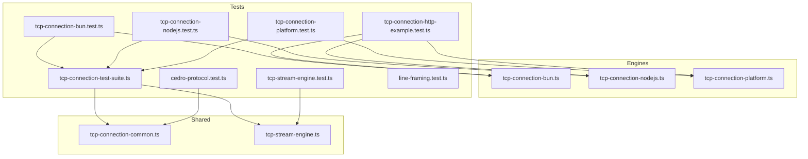
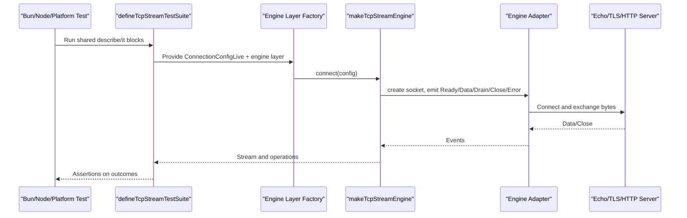
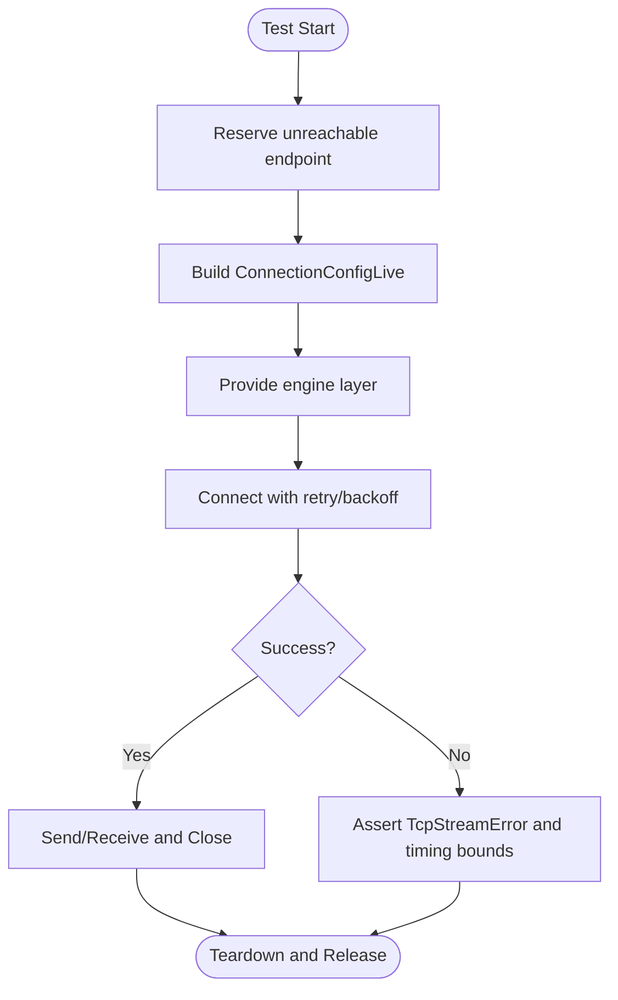
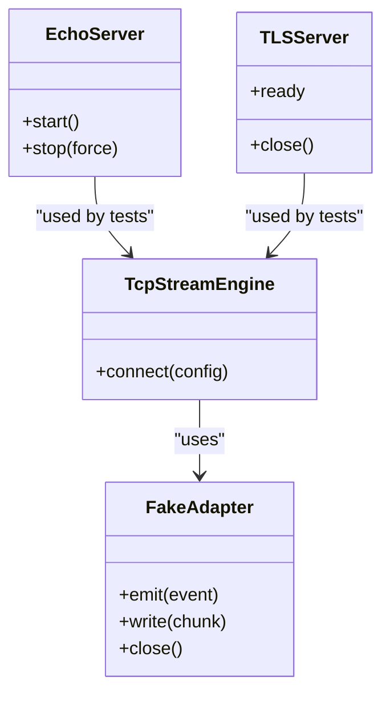
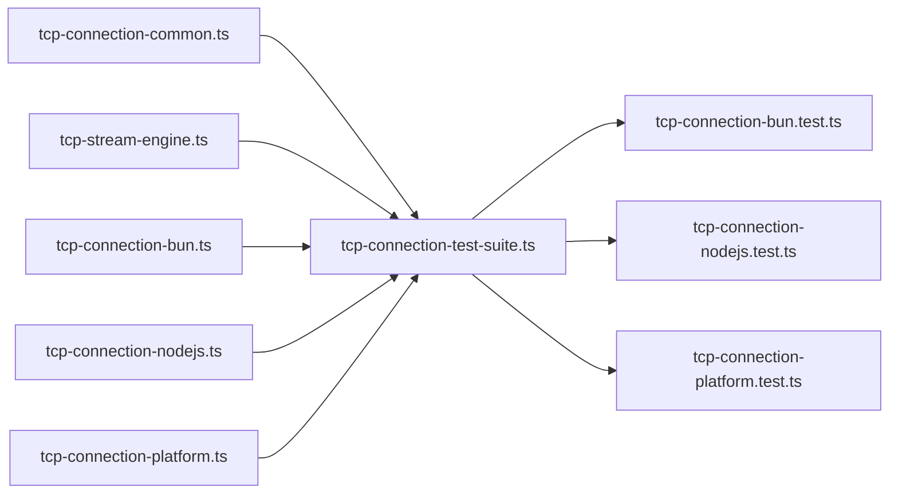

# Testing Strategy

<cite>
**Referenced Files in This Document**
- [tcp-connection-test-suite.ts](file://src/tcp-connection-test-suite.ts)
- [tcp-connection-bun.test.ts](file://src/tcp-connection-bun.test.ts)
- [tcp-connection-nodejs.test.ts](file://src/tcp-connection-nodejs.test.ts)
- [tcp-connection-platform.test.ts](file://src/tcp-connection-platform.test.ts)
- [tcp-connection-common.ts](file://src/tcp-connection-common.ts)
- [tcp-stream-engine.test.ts](file://src/tcp-stream-engine.test.ts)
- [tcp-stream-engine.ts](file://src/tcp-stream-engine.ts)
- [tcp-connection-bun.ts](file://src/tcp-connection-bun.ts)
- [tcp-connection-nodejs.ts](file://src/tcp-connection-nodejs.ts)
- [tcp-connection-platform.ts](file://src/tcp-connection-platform.ts)
- [cedro-protocol.test.ts](file://src/cedro-protocol.test.ts)
- [line-framing.test.ts](file://src/line-framing.test.ts)
- [tcp-connection-http-example.test.ts](file://src/tcp-connection-http-example.test.ts)
- [ci.yml](file://.github/workflows/ci.yml)
- [package.json](file://package.json)
</cite>

## Table of Contents
1. Introduction
2. Project Structure
3. Core Components
4. Architecture Overview
5. Detailed Component Analysis
6. Dependency Analysis
7. Performance Considerations
8. Troubleshooting Guide
9. Conclusion

## Introduction
This document describes the comprehensive testing strategy for cross-platform TCP functionality across Bun, Node.js, and Effect Platform. It explains how shared test cases run against all engines, how mocks and test doubles simulate network behavior, and how to write tests that are consistent across platforms. It also covers protocol-level tests (Cedro), line framing, HTTP-over-TCP examples, error scenarios, performance considerations, and continuous integration setup.

## Project Structure
The repository uses a layered approach:
- Shared abstractions and errors live in common modules.
- Engine-specific implementations provide adapters for Bun, Node.js, and Effect Platform.
- A single shared test suite is parameterized per engine via layers, ensuring identical coverage across platforms.
- Additional tests validate protocol framing, protocol clients, and an HTTP example program.

**Diagram sources**
- [tcp-connection-test-suite.ts:1-20](file://src/tcp-connection-test-suite.ts#L1-L20)
- [tcp-connection-bun.test.ts:1-12](file://src/tcp-connection-bun.test.ts#L1-L12)
- [tcp-connection-nodejs.test.ts:1-12](file://src/tcp-connection-nodejs.test.ts#L1-L12)
- [tcp-connection-platform.test.ts:1-12](file://src/tcp-connection-platform.test.ts#L1-L12)
- [tcp-connection-common.ts:1-101](file://src/tcp-connection-common.ts#L1-L101)
- [tcp-stream-engine.ts:1-200](file://src/tcp-stream-engine.ts#L1-L200)
- [tcp-connection-bun.ts:1-145](file://src/tcp-connection-bun.ts#L1-L145)
- [tcp-connection-nodejs.ts:1-132](file://src/tcp-connection-nodejs.ts#L1-L132)
- [tcp-connection-platform.ts:1-135](file://src/tcp-connection-platform.ts#L1-L135)

**Section sources**
- [package.json:6-10](file://package.json#L6-L10)
- [ci.yml:8-35](file://.github/workflows/ci.yml#L8-L35)

## Core Components
- TcpStreamShape and TcpStream service define the platform-agnostic TCP API used by tests and higher-level protocols.
- ConnectionConfigShape and ConnectionConfigLive configure host, port, TLS, retry policies, and timeouts.
- TcpStreamError and RetryPolicyConfig standardize error reporting and retry behavior.
- makeTcpStreamEngine provides a reusable engine that translates raw socket events into a typed stream and connection lifecycle.

Key responsibilities:
- Abstraction: Tests interact with TcpStream and ConnectionConfig rather than platform APIs directly.
- Portability: Each engine implements an adapter that emits standardized events consumed by the engine.
- Reliability: Retries, timeouts, and clean teardowns are enforced by the engine and validated by tests.

**Section sources**
- [tcp-connection-common.ts:12-101](file://src/tcp-connection-common.ts#L12-L101)
- [tcp-stream-engine.ts:1-200](file://src/tcp-stream-engine.ts#L1-L200)

## Architecture Overview
The testing architecture centers on a shared test suite that is instantiated once per engine. Each engine file exports a layer factory that wires the engine’s adapter into the shared engine. The suite spins up real or simulated servers and exercises connections, retries, TLS, interruptions, and graceful closes.

**Diagram sources**
- [tcp-connection-test-suite.ts:213-386](file://src/tcp-connection-test-suite.ts#L213-L386)
- [tcp-stream-engine.ts:1-200](file://src/tcp-stream-engine.ts#L1-L200)
- [tcp-connection-bun.ts:18-135](file://src/tcp-connection-bun.ts#L18-L135)
- [tcp-connection-nodejs.ts:21-114](file://src/tcp-connection-nodejs.ts#L21-L114)
- [tcp-connection-platform.ts:17-119](file://src/tcp-connection-platform.ts#L17-L119)

## Detailed Component Analysis

### Shared Test Suite Architecture
- Parameterization: The suite receives engineName, layerFactory, and optional engineLayer to run identical tests against Bun, Node.js, and Platform.
- Fixtures:
  - Echo server: A simple plaintext echo server validates send/receive and close semantics.
  - Unreachable endpoint reservation: Reserves a port on one loopback address while tests target another to simulate unreachable endpoints deterministically.
  - TLS server: Generates a temporary self-signed certificate and runs a TLS echo server to exercise TLS paths.
- Coverage areas:
  - Retry policy enforcement and custom schedules.
  - Recovery when a server starts during backoff.
  - Binary data round-trips and graceful close.
  - Clean failure classification without defects.
  - TLS handshake success and failure modes.
  - Immediate remote close handling.
  - Interruption safety during connect and retry backoff.

**Diagram sources**
- [tcp-connection-test-suite.ts:219-306](file://src/tcp-connection-test-suite.ts#L219-L306)
- [tcp-connection-test-suite.ts:308-386](file://src/tcp-connection-test-suite.ts#L308-L386)

**Section sources**
- [tcp-connection-test-suite.ts:164-203](file://src/tcp-connection-test-suite.ts#L164-L203)
- [tcp-connection-test-suite.ts:213-386](file://src/tcp-connection-test-suite.ts#L213-L386)
- [tcp-connection-test-suite.ts:447-623](file://src/tcp-connection-test-suite.ts#L447-L623)
- [tcp-connection-test-suite.ts:625-797](file://src/tcp-connection-test-suite.ts#L625-L797)

### Mock Implementations and Test Doubles
- Real servers as test doubles:
  - Plaintext echo server simulates a minimal TCP peer for read/write/close verification.
  - TLS echo server validates TLS handshake and streaming with rejectUnauthorized disabled for tests.
- Deterministic unreachability:
  - reserveUnreachableEndpoint binds a port on 127.0.0.1 while tests target 127.0.0.2 to guarantee connection failures without flakiness.
- Engine seam mocking:
  - tcp-stream-engine.test.ts constructs a fake adapter using makeTcpStreamEngine to emit controlled events (Data, Drain, Ready, Close, Error) and verify engine behavior such as event ordering, attempt isolation, timeouts, and idempotent close.

**Diagram sources**
- [tcp-stream-engine.test.ts:26-98](file://src/tcp-stream-engine.test.ts#L26-L98)
- [tcp-connection-test-suite.ts:164-199](file://src/tcp-connection-test-suite.ts#L164-L199)
- [tcp-connection-test-suite.ts:40-162](file://src/tcp-connection-test-suite.ts#L40-L162)

**Section sources**
- [tcp-stream-engine.test.ts:26-214](file://src/tcp-stream-engine.test.ts#L26-L214)
- [tcp-connection-test-suite.ts:164-199](file://src/tcp-connection-test-suite.ts#L164-L199)
- [tcp-connection-test-suite.ts:40-162](file://src/tcp-connection-test-suite.ts#L40-L162)

### Platform-Specific Testing Strategies
- Bun:
  - Uses Bun.connect and Bun.listen for adapters and fixtures.
  - Validates binary writes, drain signaling, and immediate close semantics.
- Node.js:
  - Uses node:net and node:tls for adapters; tests cover both plaintext and TLS paths.
  - Ensures string chunks are normalized to Uint8Array before emitting.
- Effect Platform:
  - Uses @effect/platform-bun and unstable Socket APIs; wraps TLS via fromDuplex.
  - Verifies scope-owned lifecycle and cleanup on interruption.

Each platform has a dedicated test file that instantiates the shared suite with its engine layer, ensuring identical assertions across engines.

**Section sources**
- [tcp-connection-bun.test.ts:1-12](file://src/tcp-connection-bun.test.ts#L1-L12)
- [tcp-connection-nodejs.test.ts:1-12](file://src/tcp-connection-nodejs.test.ts#L1-L12)
- [tcp-connection-platform.test.ts:1-12](file://src/tcp-connection-platform.test.ts#L1-L12)
- [tcp-connection-bun.ts:18-135](file://src/tcp-connection-bun.ts#L18-L135)
- [tcp-connection-nodejs.ts:21-114](file://src/tcp-connection-nodejs.ts#L21-L114)
- [tcp-connection-platform.ts:17-119](file://src/tcp-connection-platform.ts#L17-L119)

### Protocol and Framing Tests
- Cedro protocol:
  - Composes TcpStream and Cedro client layers to authenticate and subscribe over TCP.
  - Validates message framing and error conditions (missing credentials).
- Line framing:
  - Exercises frameLines with various chunking patterns, CRLF/CR/LF endings, and fragmented messages.

These tests demonstrate how to build higher-level protocols atop the TCP abstraction and ensure robustness under fragmentation.

**Section sources**
- [cedro-protocol.test.ts:10-110](file://src/cedro-protocol.test.ts#L10-L110)
- [line-framing.test.ts:12-107](file://src/line-framing.test.ts#L12-L107)

### HTTP Example Across Engines
- The HTTP example test drives a CLI-like function that executes HTTP requests over TCP using each engine.
- It verifies argument parsing and end-to-end request/response flow against a local echo server.
- Confirms that the same logic works identically across Bun, Node.js, and Platform engines.

**Section sources**
- [tcp-connection-http-example.test.ts:13-121](file://src/tcp-connection-http-example.test.ts#L13-L121)
- [tcp-connection-http-example.test.ts:123-205](file://src/tcp-connection-http-example.test.ts#L123-L205)

## Dependency Analysis
- Tests depend on:
  - Shared abstractions (TcpStream, ConnectionConfig, TcpStreamError).
  - Engine adapters (Bun, Node.js, Platform).
  - The engine core (makeTcpStreamEngine) for event-driven stream construction.
- Cross-cutting concerns:
  - Retry scheduling and timeouts are configured via ConnectionConfig and validated by the suite.
  - TLS configuration is passed through to adapters and verified by TLS-specific tests.

**Diagram sources**
- [tcp-connection-common.ts:12-101](file://src/tcp-connection-common.ts#L12-L101)
- [tcp-stream-engine.ts:1-200](file://src/tcp-stream-engine.ts#L1-L200)
- [tcp-connection-test-suite.ts:213-386](file://src/tcp-connection-test-suite.ts#L213-L386)
- [tcp-connection-bun.ts:18-135](file://src/tcp-connection-bun.ts#L18-L135)
- [tcp-connection-nodejs.ts:21-114](file://src/tcp-connection-nodejs.ts#L21-L114)
- [tcp-connection-platform.ts:17-119](file://src/tcp-connection-platform.ts#L17-L119)

**Section sources**
- [tcp-connection-common.ts:12-101](file://src/tcp-connection-common.ts#L12-L101)
- [tcp-stream-engine.ts:1-200](file://src/tcp-stream-engine.ts#L1-L200)
- [tcp-connection-test-suite.ts:213-386](file://src/tcp-connection-test-suite.ts#L213-L386)

## Performance Considerations
- Use deterministic ports and loopback addresses to avoid flaky network contention.
- Prefer bounded timeouts for connect, retry, and interrupt scenarios to prevent hangs.
- Validate retry backoff durations and upper bounds to catch regressions where retries stall.
- For TLS tests, generate ephemeral certificates and enforce timeouts around OpenSSL invocation.
- When measuring performance, isolate I/O-bound sections and avoid global state between tests.

[No sources needed since this section provides general guidance]

## Troubleshooting Guide
Common issues and how the tests help detect them:
- Stuck connections:
  - Interrupt tests assert prompt exit and absence of defects during long-running connects or TLS handshakes.
- Resource leaks:
  - Tests verify that failed attempts do not leak events to later attempts and that handles close exactly once.
- Misclassified errors:
  - Post-readiness errors are classified as read failures; connect-time failures surface as TcpStreamError.
- TLS mismatches:
  - Connecting a TLS client to a plaintext server must fail cleanly without hanging or leaking resources.

**Section sources**
- [tcp-connection-test-suite.ts:724-797](file://src/tcp-connection-test-suite.ts#L724-L797)
- [tcp-stream-engine.test.ts:49-98](file://src/tcp-stream-engine.test.ts#L49-L98)
- [tcp-stream-engine.test.ts:100-149](file://src/tcp-stream-engine.test.ts#L100-L149)
- [tcp-connection-test-suite.ts:581-623](file://src/tcp-connection-test-suite.ts#L581-L623)

## Conclusion
The testing strategy ensures reliable, cross-platform TCP behavior by:
- Centralizing shared tests and parameterizing them per engine.
- Using realistic fixtures and deterministic unreachability to simulate network conditions.
- Validating engine seams with fine-grained event control.
- Covering protocol composition, framing, and HTTP examples.
- Enforcing clean error handling, timeouts, and resource management.
- Running consistently in CI across Bun environments.

[No sources needed since this section summarizes without analyzing specific files]