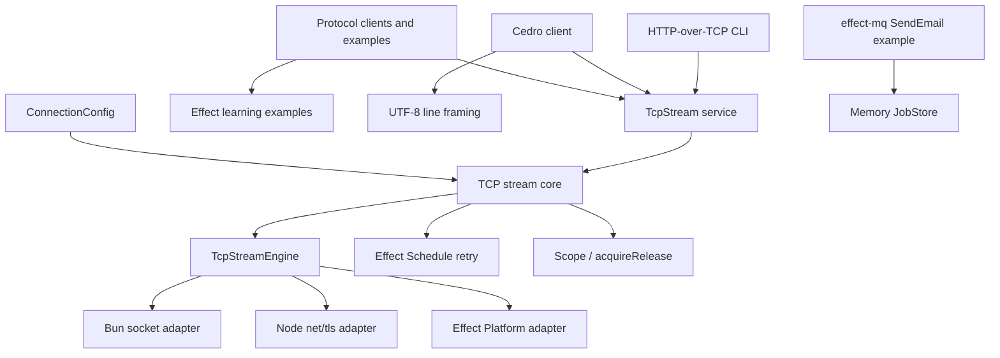
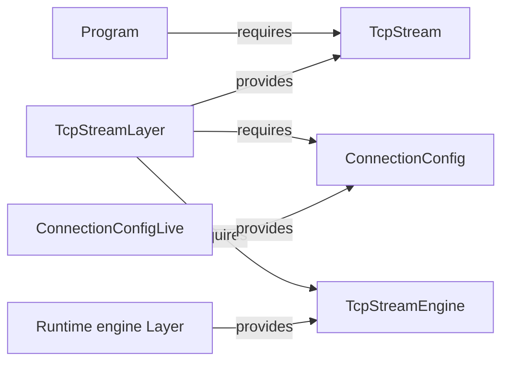
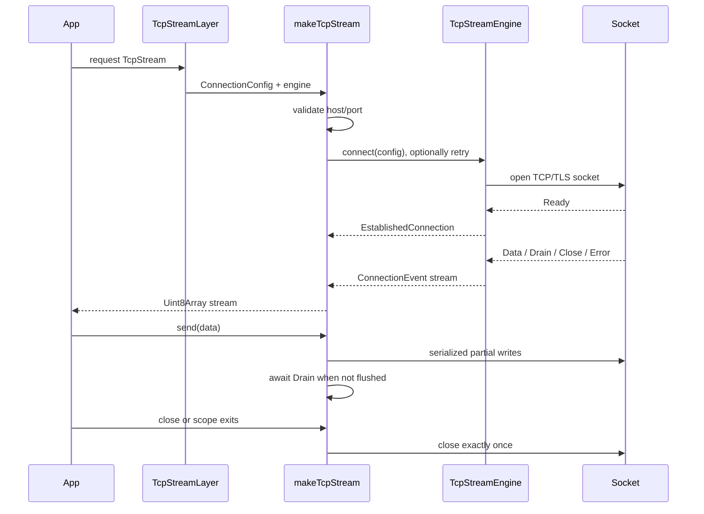
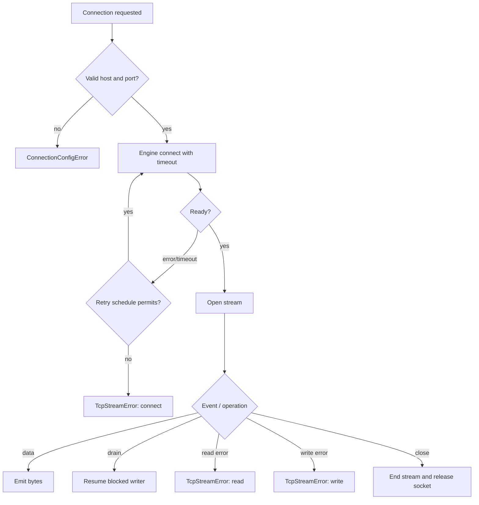

# lab-effect4

## Purpose

`lab-effect4` is an experimental TypeScript/Bun workspace for learning and validating Effect 4 patterns. Its most cohesive subsystem is a runtime-neutral, scoped TCP stream abstraction with retry, timeout, TLS, backpressure, and interchangeable socket engines. The repository also demonstrates a line-oriented Cedro protocol client, a raw HTTP-over-TCP CLI, typed Effect error/control-flow patterns, interruption-safe file I/O, and typed message-queue jobs.

The package uses ESM and pre-release Effect 4 packages. It is a laboratory rather than a published library: `package.json` has no export map and still names a non-representative `index.js` main.

## Architecture overview

The central design separates **policy** from **platform mechanics**:

- `tcp-connection-common.ts` defines services, configuration, validation, retry policy, and typed errors.
- `tcp-stream-engine.ts` converts a low-level callback adapter into an Effect-native engine, then builds the public `TcpStream` with resource safety and backpressure handling.
- Runtime adapters supply socket creation and events behind `TcpStreamEngine`.
- Higher-level clients depend only on `TcpStream`, so callers choose an implementation by providing a Layer.

## Sub-modules

### TCP transport

The transport subsystem owns configuration validation, connection establishment, retries, timeout enforcement, stream delivery, serialized writes, drain-based backpressure, error normalization, and scoped cleanup. Platform-specific Layers can be selected without changing consumers. See [TCP transport and engine](lab-effect4_tcp-transport.md).

### Protocol clients and executable examples

`CedroClient` formats authentication/subscription commands and exposes both raw bytes and UTF-8 framed lines. The HTTP example parses CLI options, selects Bun/Node/Effect Platform engines, constructs TLS settings from a URL, writes an HTTP/1.1 request, and incrementally decodes the response. See [protocol clients and examples](lab-effect4_protocol-clients.md).

### Effect programming examples

The standalone learning files illustrate Effect creation, callback and Promise integration, interruption cleanup, typed tagged errors, `Result` validation, collection combinators, and error-channel operators. See [Effect patterns](lab-effect4_effect-patterns.md).

### Message queue example

The MQ example declares a schema-validated `SendEmail` job with idempotency, metadata, retry defaults, typed results, and an in-memory worker Layer. See [message queue](lab-effect4_message-queue.md).

## TCP lifecycle and data flow

### Failure model

Configuration failures use `ConnectionConfigError`. Runtime transport failures use `TcpStreamError` with an `operation` discriminator (`connect`, `read`, or `write`) and optional cause. Protocol formatting failures use `CedroProtocolError`. The engine converts callback errors into the typed channel, while clean closure ends streams normally. Retry applies only while establishing a connection; post-connect read/write failures are surfaced directly.

## Configuration and extension points

`ConnectionConfigShape` requires `host` and `port` and optionally accepts TLS options, connection timeout, retry settings, or a fully custom `Schedule`. Defaults are a 3-second connect timeout and jittered exponential retry beginning at 100 ms, factor 2, bounded by five schedule repetitions and 30 seconds. Set `retry: false` to disable retry. If `retrySchedule` is present, it takes precedence over `retry`.

To add a socket implementation, provide a scoped cold adapter to `makeTcpStreamEngine`, map runtime callbacks to `Ready`, `Data`, `Drain`, `Close`, and `Error`, and return a `RawSocketHandle`. Then expose its engine Layer through `makeConvenienceLayer`. Consumers can either pass configuration directly to the convenience Layer or provide `ConnectionConfig` separately for composable dependency injection.

## Build, runtime, and quality gates

- Runtime/package model: Bun-oriented ESM (`package.json`, `type: module`) with Node and Bun type definitions.
- Main dependencies: `effect`, `@effect/platform-bun`, `@effect/platform-node`, and `effect-mq` (`package.json`).
- Type checking: strict NodeNext TypeScript with exact optional properties, unchecked-index checks, isolated modules, and the Effect language-service plugin (`tsconfig.json`).
- Commands: `bun test`, `bun run lint`, and `bun run format` (`package.json`).
- CI installs with pnpm under Bun 1.4.1, then typechecks, tests, lints, and checks formatting (`.github/workflows/ci.yml`).
- `docker-compose.yml` supplies a persistent Redis service, although the shown MQ example currently uses `MemoryJobStore`; it is an infrastructure option rather than a dependency of the TCP subsystem.

## Test strategy

The shared TCP conformance suite is parameterized by engine Layer. It verifies retries and custom schedules, recovery during backoff, binary round trips, TLS success and handshake failure, clean remote/client closure, idempotent close, defect-free failures, interruption during connect/backoff, and scoped socket teardown. This makes adapter behavior comparable while keeping policy tests centralized.

## Repository boundaries

The TCP/protocol and MQ areas are independent demonstrations joined mainly by their use of Effect services, Layers, typed errors, and scopes. The control-flow, error-channel, and file-I/O files are executable teaching examples and may perform work at module load; they should not be treated as side-effect-free library entry points.
