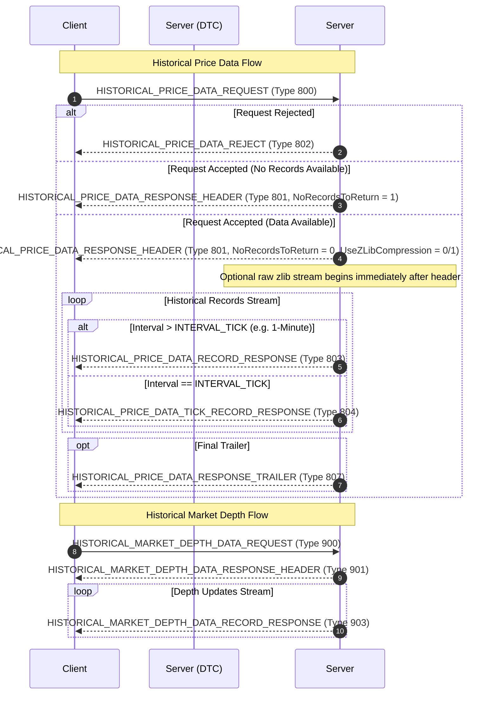

# DTC Protocol & Sierra Chart Ecosystem: Market Data On-Disk Persistence & Historical Data Architecture

**Sources:**
- [DTC Protocol Main Specification](https://www.sierrachart.com/index.php?page=doc/DTCProtocol.php)
- [DTC Protocol Messages and Procedures](https://www.sierrachart.com/index.php?page=doc/DTCMessageDocumentation.php)
- [DTC Protocol C++ Header Source (`DTCProtocol.h`)](https://www.sierrachart.com/DTC_Files/DTCProtocol.h)
- [Sierra Chart Intraday Data File Format (`.scid`)](https://www.sierrachart.com/index.php?page=doc/IntradayDataFileFormat.html)
- [Sierra Chart Market Depth Data File Format (`.depth`)](https://www.sierrachart.com/index.php?page=doc/MarketDepthDataFileFormat.php)
- [Sierra Chart DateTime & Epoch Specification (`SCDateTimeMS`)](https://www.sierrachart.com/index.php?page=doc/SCDateTime.html)

---

## 1. Executive Summary: Wire Protocol vs. On-Disk Persistence

The **Data and Trading Communications (DTC) Protocol** and its reference host platform, **Sierra Chart**, enforce a clean architectural boundary between network transmission and disk persistence:

1. **The DTC Protocol is strictly a wire specification:**
   - DTC defines network-level framing, message encodings (Binary, JSON, Protocol Buffers), streaming subscriptions, and historical data request/response messages (`HISTORICAL_PRICE_DATA_REQUEST`, `HISTORICAL_PRICE_DATA_TICK_RECORD_RESPONSE`, etc.).
   - **The DTC Protocol specification itself does not mandate or define a disk persistence format.** It abstracts storage away from the transport layer.
2. **Sierra Chart provides the reference on-disk storage ecosystem:**
   - As the creator and primary reference implementation of DTC, Sierra Chart defines standard binary and text persistence formats:
     - **`.scid` (Sierra Chart Intraday Data):** Flat, uncompressed binary format with a 56-byte header (`s_IntradayHeader`) followed by contiguous, fixed-stride 40-byte records (`s_IntradayRecord`). Used for tick-by-tick (Time & Sales) data and aggregated intraday bars (1-second, 1-minute, etc.).
     - **`.depth` (Historical Market Depth):** Flat, uncompressed binary format with a 64-byte header (`s_MarketDepthFileHeader`) followed by contiguous 24-byte records (`s_MarketDepthFileRecord`). Pairs periodic full snapshots (every 10 minutes) with incremental order-book diffs.
     - **`.dly` (Historical Daily Data):** Delimited text/CSV file format for daily and multi-day bars.
3. **Compression strategy:**
   - **On the wire**, DTC supports streaming **zlib** and **zlib-ng** compression to minimize network bandwidth during historical data catch-up.
   - **On disk**, both `.scid` and `.depth` files are **strictly uncompressed binary**. This allows $O(1)$ fixed-stride record addressing, instantaneous $O(\log N)$ binary search on timestamps, direct zero-copy memory mapping (`mmap`), low-latency continuous appending, and in-place bar updates.

---

## 2. DTC Protocol Historical Wire Messages

DTC standardizes historical price and market depth retrieval over the network using distinct message types.

### 2.1 Historical Message Flow



### 2.2 Wire Timestamp Encodings

DTC wire messages standardize on the **Unix Epoch (January 1, 1970, 00:00:00 UTC)**:

```cpp
typedef int64_t t_DateTime;                     // Whole seconds since Unix epoch
typedef uint32_t t_DateTime4Byte;               // Whole seconds (compact, 1970–2106)
typedef double t_DateTimeWithMilliseconds;      // Fractional seconds (floating-point)
typedef int64_t t_DateTimeWithMillisecondsInt;  // Whole milliseconds since Unix epoch
typedef int64_t t_DateTimeWithMicrosecondsInt;  // Whole microseconds since Unix epoch
```

### 2.3 Exact C++ Struct Definitions (`DTCProtocol.h`)

#### `HISTORICAL_PRICE_DATA_REQUEST` (Type 800)
```cpp
struct s_HistoricalPriceDataRequest
{
    static constexpr uint16_t MESSAGE_TYPE = HISTORICAL_PRICE_DATA_REQUEST; // 800

    uint16_t Size = sizeof(*this);
    uint16_t Type = MESSAGE_TYPE;

    int32_t RequestID = 0;
    char Symbol[SYMBOL_LENGTH] = {};         // 64 bytes
    char Exchange[EXCHANGE_LENGTH] = {};     // 16 bytes
    HistoricalDataIntervalEnum RecordInterval = INTERVAL_TICK;
    t_DateTime StartDateTime = 0;            // Unix epoch seconds
    t_DateTime EndDateTime = 0;              // Unix epoch seconds
    uint32_t MaxDaysToReturn = 0;
    uint8_t  UseZLibCompression = 0;         // 1 = enable zlib compression on records
    uint8_t RequestDividendAdjustedStockData = 0;
    uint16_t Integer_1 = 0;                  // Bit 0x8 = request unbundled trade flags
    uint8_t UseZLibNGCompression = 0;
};
```

#### `HISTORICAL_PRICE_DATA_RESPONSE_HEADER` (Type 801)
```cpp
struct s_HistoricalPriceDataResponseHeader
{
    static constexpr uint16_t MESSAGE_TYPE = HISTORICAL_PRICE_DATA_RESPONSE_HEADER; // 801

    uint16_t Size = sizeof(*this);
    uint16_t Type = MESSAGE_TYPE;

    int32_t RequestID = 0;
    HistoricalDataIntervalEnum RecordInterval = INTERVAL_TICK;

    uint8_t UseZLibCompression = 0;          // Server confirms zlib compression
    uint8_t NoRecordsToReturn = 0;           // 1 = no data available, response ends
    float IntToFloatPriceDivisor = 0;        // Legacy field
    uint8_t UseZLibNGCompression = 0;
};
```

> [!NOTE]
> The `HISTORICAL_PRICE_DATA_RESPONSE_HEADER` is **never compressed**. It is transmitted in standard negotiated encoding (e.g. binary) so the receiver can prepare buffers and configure the zlib decompression stream.

#### `HISTORICAL_PRICE_DATA_TICK_RECORD_RESPONSE` (Type 804)
Sent when `RecordInterval == INTERVAL_TICK`:
```cpp
struct s_HistoricalPriceDataTickRecordResponse
{
    static constexpr uint16_t MESSAGE_TYPE = HISTORICAL_PRICE_DATA_TICK_RECORD_RESPONSE; // 804

    uint16_t Size = sizeof(*this);
    uint16_t Type = MESSAGE_TYPE;

    int32_t RequestID = 0;
    t_DateTimeWithMilliseconds DateTime = 0; // Unix epoch fractional seconds (double)
    AtBidOrAskEnum AtBidOrAsk = BID_ASK_UNSET; // BID_ASK_UNSET=0, AT_BID=1, AT_ASK=2

    double Price = 0;
    double Volume = 0;

    uint8_t IsFinalRecord = 0;               // 1 = final record
};
```

#### `HISTORICAL_PRICE_DATA_RECORD_RESPONSE` (Type 803)
Sent when `RecordInterval > INTERVAL_TICK` (e.g. `INTERVAL_1_MINUTE = 60`, `INTERVAL_1_DAY = 86400`):
```cpp
struct s_HistoricalPriceDataRecordResponse
{
    static constexpr uint16_t MESSAGE_TYPE = HISTORICAL_PRICE_DATA_RECORD_RESPONSE; // 803

    uint16_t Size = sizeof(*this);
    uint16_t Type = MESSAGE_TYPE;

    int32_t RequestID = 0;
    t_DateTimeWithMicrosecondsInt StartDateTime = 0; // Unix epoch microseconds

    double OpenPrice = 0;
    double HighPrice = 0;
    double LowPrice = 0;
    double LastPrice = 0;
    double Volume = 0;
    union
    {
        uint32_t OpenInterest = 0;
        uint32_t NumTrades;
    };
    double BidVolume = 0;
    double AskVolume = 0;

    uint8_t IsFinalRecord = 0;
};
```

---

## 3. Reference Disk Storage Formats in the DTC Ecosystem

In Sierra Chart's implementation, files are stored within the installation directories:
- **Intraday Data (`.scid`):** `<SierraChartPath>\Data\[Symbol].scid`
- **Market Depth Data (`.depth`):** `<SierraChartPath>\Data\MarketDepthData\[Symbol].[YYYY-MM-DD].depth`
- **Daily Historical Data (`.dly`):** `<SierraChartPath>\Data\[Symbol].dly`

### 3.1 The Sierra Chart Epoch: `SCDateTimeMS`

A critical distinction between wire and disk representations is the timestamp epoch:
- **Wire (DTC):** Unix epoch: `1970-01-01 00:00:00 UTC`.
- **Disk (`SCDateTimeMS`):** Microseconds elapsed since **December 30, 1899, 00:00:00 UTC** (the Microsoft OLE Automation / COM `DATE` epoch, unified in modern Sierra Chart with microsecond integer resolution).

#### Epoch Conversion Formula
The time elapsed between `1899-12-30 00:00:00` and `1970-01-01 00:00:00` is exactly **25,569 days**:
$$\Delta T_{\text{seconds}} = 25{,}569 \times 86{,}400 = 2{,}209{,}161{,}600 \text{ seconds}$$
$$\Delta T_{\mu\text{s}} = 2{,}209{,}161{,}600 \times 1{,}000{,}000 = 2{,}209{,}161{,}600{,}000{,}000 \mu\text{s}$$

Conversion between DTC wire microseconds and SCID disk microseconds:
$$\text{SCDateTimeMS} = \text{DtcMicrosecondsSince1970} + 2{,}209{,}161{,}600{,}000{,}000$$
$$\text{DtcMicrosecondsSince1970} = \text{SCDateTimeMS} - 2{,}209{,}161{,}600{,}000{,}000$$

---

## 4. Sierra Chart Intraday Data (`.scid`) Specification

The `.scid` format stores intraday data as a flat array of fixed-size binary structures.

### 4.1 Header: `s_IntradayHeader` (56 Bytes)

Located at byte offset `0` of every `.scid` file:

```cpp
struct s_IntradayHeader
{
    char FileTypeUniqueHeaderID[4]; // "SCID" (ASCII: 0x53, 0x43, 0x49, 0x44)
    uint32_t HeaderSize;            // 56 (bytes)
    uint32_t RecordSize;            // 40 (bytes)
    uint16_t Version;               // 1 (current file format version)
    uint16_t Unused1;               // 0 (padding)
    uint32_t UTCStartIndex;         // 0
    char Reserve[36];               // Zeroed reserved bytes
};
```

| Offset | Field | Type | Size | Description |
|---|---|---|---|---|
| `0..3` | `FileTypeUniqueHeaderID` | `char[4]` | 4 | Magic identifier `"SCID"` |
| `4..7` | `HeaderSize` | `uint32_t` | 4 | Header size in bytes (`56`) |
| `8..11` | `RecordSize` | `uint32_t` | 4 | Record size in bytes (`40`) |
| `12..13` | `Version` | `uint16_t` | 2 | Format version (`1`) |
| `14..15` | `Unused1` | `uint16_t` | 2 | Reserved |
| `16..19` | `UTCStartIndex` | `uint32_t` | 4 | Set to `0` |
| `20..55` | `Reserve` | `char[36]` | 36 | Reserved padding (0) |
| **Total** | | | **56** | 8-byte aligned |

### 4.2 Data Record: `s_IntradayRecord` (40 Bytes)

```cpp
struct s_IntradayRecord
{
    static const float SINGLE_TRADE_WITH_BID_ASK;            // 0.0F
    static const float FIRST_SUB_TRADE_OF_UNBUNDLED_TRADE;   // -1.99900095e+37F
    static const float LAST_SUB_TRADE_OF_UNBUNDLED_TRADE;    // -1.99900197e+37F

    SCDateTimeMS DateTime; // Microseconds since 1899-12-30 UTC (64-bit int)

    float Open;            // Open price or special trade indicator flag
    float High;            // High price or Ask price at trade time
    float Low;             // Low price or Bid price at trade time
    float Close;           // Close price or Trade execution price

    uint32_t NumTrades;    // Number of trades in bar (or 1 for individual tick)
    uint32_t TotalVolume;  // Total volume in bar or trade volume
    uint32_t BidVolume;    // Volume traded at bid or lower (seller aggressor)
    uint32_t AskVolume;    // Volume traded at ask or higher (buyer aggressor)
};
```

| Offset | Field | Type | Size | Alignment | Description |
|---|---|---|---|---|---|
| `0..7` | `DateTime` | `int64_t` (`SCDateTimeMS`) | 8 | 8 | Microseconds since 1899-12-30 UTC |
| `8..11` | `Open` | `float` | 4 | 4 | Open price / trade indicator |
| `12..15` | `High` | `float` | 4 | 4 | High price / Ask price |
| `16..19` | `Low` | `float` | 4 | 4 | Low price / Bid price |
| `20..23` | `Close` | `float` | 4 | 4 | Close price / Execution price |
| `24..27` | `NumTrades` | `uint32_t` | 4 | 4 | Trade count |
| `28..31` | `TotalVolume` | `uint32_t` | 4 | 4 | Total volume |
| `32..35` | `BidVolume` | `uint32_t` | 4 | 4 | Volume at Bid or lower |
| `36..39` | `AskVolume` | `uint32_t` | 4 | 4 | Volume at Ask or higher |
| **Total** | | | **40** | **8** | Naturally aligned, no padding holes |

### 4.3 Tick vs. Bar Representation on Disk

1. **Standard Tick (Time & Sales):**
   - `Open = High = Low = Close = TradePrice`
   - `NumTrades = 1`
   - `TotalVolume = TradeVolume`
   - Aggressor side: If traded at Bid, `BidVolume = TradeVolume, AskVolume = 0`. If traded at Ask, `AskVolume = TradeVolume, BidVolume = 0`.
2. **Tick with Bid/Ask Context (`SINGLE_TRADE_WITH_BID_ASK`):**
   - `Open = 0.0F` (sentinel value)
   - `High = AskPrice` (prevailing best offer at trade time)
   - `Low = BidPrice` (prevailing best bid at trade time)
   - `Close = TradePrice` (actual fill price)
   - `NumTrades = 1`, `TotalVolume = TradeVolume`
3. **Aggregated Bars (1-Second, 1-Minute, etc.):**
   - `DateTime` marks the time boundary.
   - `Open`, `High`, `Low`, `Close` represent OHLC of the bar period.
   - `TotalVolume`, `BidVolume`, `AskVolume`, and `NumTrades` accumulate across all trades in the interval.

### 4.4 Disk Access & Indexing Patterns

```
Byte Offset:
0           56          96          136                      56 + N*40
+-----------+-----------+-----------+--------- - - - --------+
| Header    | Record 0  | Record 1  | Record 2               | Record N-1
| (56 B)    | (40 B)    | (40 B)    | (40 B)                 | (40 B)
+-----------+-----------+-----------+--------- - - - --------+
```

- **Direct $O(1)$ Stride Indexing:** Record $i$ starts at byte offset `56 + (i * 40)`. Total records $N = (\text{FileSize} - 56) / 40$.
- **$O(\log N)$ Binary Search:** Strict monotonic ordering of `DateTime` enables fast seeks on disk without in-memory indexing.
- **Continuous Append vs. In-Place Updates:**
  - Ticks are strictly appended.
  - Developing bars are updated in-place: the writer seeks back 40 bytes (`seek(FileSize - 40)`), updates OHLCV and trade counters, and overwrites the last 40 bytes.
- **Buffered I/O & Concurrency:** Buffered writes flush to disk every 5,000 ms (default). Files use shared read/write flags (`FILE_SHARE_READ | FILE_SHARE_WRITE`), enabling concurrent reads while feeds append.

---

## 5. Historical Market Depth Data (`.depth`) Specification

Recorded in dedicated binary files under `Data\MarketDepthData\[Symbol].[YYYY-MM-DD].depth`.

### 5.1 File Header: `s_MarketDepthFileHeader` (64 Bytes)
```cpp
struct s_MarketDepthFileHeader
{
    static const int MINIMAL_HEADER_SIZE = 16;
    static const uint32_t UNIQUE_HEADER_ID = 0x44444353; // "SCDD"

    uint32_t FileTypeUniqueHeaderID; // 0x44444353 ("SCDD")
    uint32_t HeaderSize;             // 64 (bytes)
    uint32_t RecordSize;             // 24 (bytes)
    uint32_t Version;                // 1
    char Reserve[48];                // Zeroed reserved bytes
};
```

### 5.2 Data Record: `s_MarketDepthFileRecord` (24 Bytes)
```cpp
struct s_MarketDepthFileRecord
{
    enum CommandEnum : uint8_t
    {
        NO_COMMAND = 0,
        COMMAND_CLEAR_BOOK = 1,       // Reset order book
        COMMAND_ADD_BID_LEVEL = 2,    // Add bid price level
        COMMAND_ADD_ASK_LEVEL = 3,    // Add ask price level
        COMMAND_MODIFY_BID_LEVEL = 4, // Modify bid price level
        COMMAND_MODIFY_ASK_LEVEL = 5, // Modify ask price level
        COMMAND_DELETE_BID_LEVEL = 6, // Delete bid price level
        COMMAND_DELETE_ASK_LEVEL = 7  // Delete ask price level
    };

    static const uint8_t FLAG_END_OF_BATCH = 0x01;

    SCDateTimeMS DateTime; // 8 bytes: Microseconds since 1899-12-30 UTC
    CommandEnum Command;   // 1 byte: Action enum
    uint8_t Flags;         // 1 byte: 0x01 indicates end of batch/snapshot
    uint16_t NumOrders;    // 2 bytes: Count of limit orders at price level
    float Price;           // 4 bytes: Price level
    uint32_t Quantity;     // 4 bytes: Cumulative order size at price level
    uint32_t Reserved;     // 4 bytes: Padding for 8-byte alignment
};
```

### 5.3 Order Book Reconstruction Architecture
- **Snapshots every 10 minutes:** Full book dump starting with `COMMAND_CLEAR_BOOK` followed by `COMMAND_ADD_BID_LEVEL` and `COMMAND_ADD_ASK_LEVEL` records, terminated with `FLAG_END_OF_BATCH`.
- **Incremental Diffs:** Appended in real-time as `MODIFY` or `DELETE` records.
- **Arbitrary Time Replay:** Binary search to target timestamp $T$, scan back to the nearest `COMMAND_CLEAR_BOOK` (max 10 minutes back), reset book, and replay forward to $T$.

---

## 6. Compression Mechanics Comparison

| Dimension | Wire Transport (DTC Protocol) | Disk Persistence (`.scid` / `.depth`) |
|---|---|---|
| **Compression Algorithm** | **zlib** / **zlib-ng** (Deflate) | **None** (Raw uncompressed binary structs) |
| **Stream Framing** | Uncompressed header + raw deflate stream | Fixed header (56 or 64 B) + contiguous records |
| **Addressing / Seeking** | Sequential only; requires stateful decompression | Instantaneous $O(1)$ stride formula: `HeaderSize + i * RecordSize` |
| **Search Performance** | Must stream and decompress from start | $O(\log N)$ binary search directly on disk |
| **Memory Efficiency** | Minimizes network socket transfer time | Zero-copy memory mapping (`mmap`), zero CPU decompression overhead |
| **Mutation / Updates** | Read-only append stream | In-place updates for developing bars |

---

## 7. Lessons & Recommendations for Persisting Cedro Market Data

If designing a persistence layer for Cedro's Times & Trades feed (`GQT` / `V:PETR4:...`), the DTC/Sierra Chart architecture offers several valuable patterns:

1. **Uncompressed Fixed-Size Binary Records:**
   - Instead of storing raw text lines (e.g. `V:PETR4:A:10:15:32.450:36.50:3:8:100:14589201:0:A:0\n`), parsing into a fixed-stride binary struct (e.g. 32–40 bytes per trade: 8-byte timestamp, 4-byte float/int price, 4-byte quantity, 4-byte buyer broker, 4-byte seller broker, 1-byte aggressor, 1-byte condition) enables direct $O(1)$ indexing, binary search by timestamp, and zero-copy `mmap`.
2. **Monotonic Timestamps:**
   - Handling sub-millisecond identical timestamps by incrementing a microsecond counter ensures strict monotonicity for binary search on disk.
3. **Buffered Batch Flushing:**
   - Appending incoming trades to an in-memory buffer and flushing periodically (e.g., every 1–5 seconds) prevents disk I/O bottlenecks during high-frequency volatility spikes.
